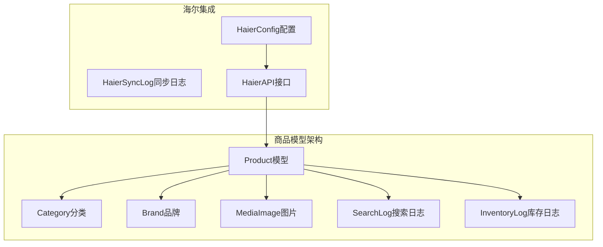
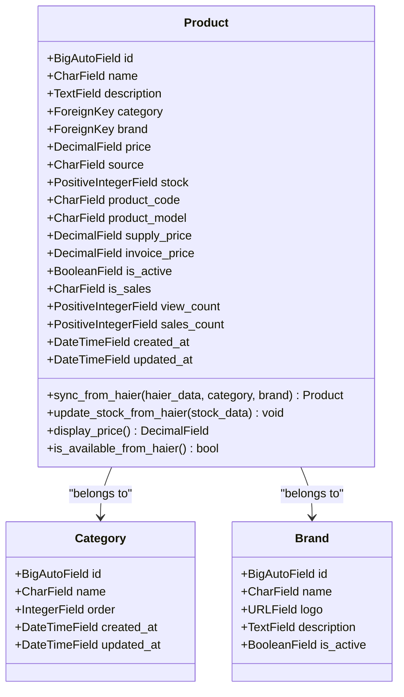
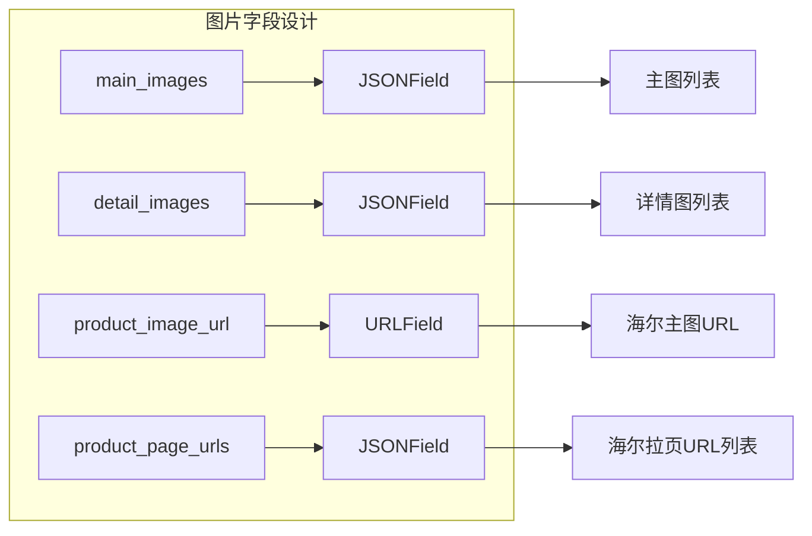
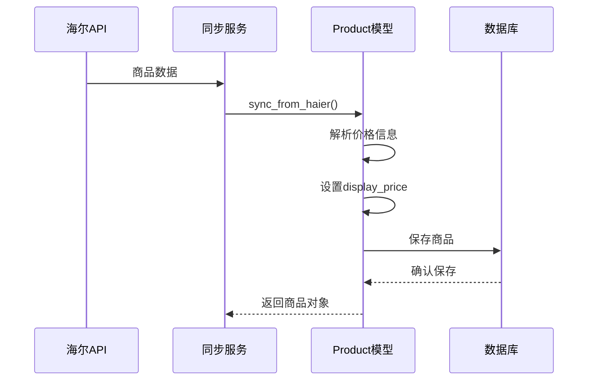
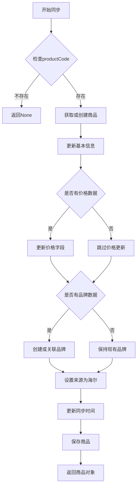
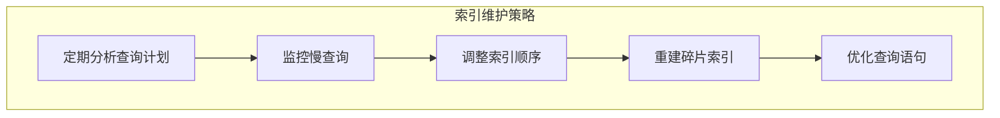

# 商品数据模型

<cite>
**本文档引用的文件**
- [models.py](file://backend/catalog/models.py)
- [migrations/0015_product_source.py](file://backend/catalog/migrations/0015_product_source.py)
- [migrations/0014_product_invoice_price_product_is_sales_and_more.py](file://backend/catalog/migrations/0014_product_invoice_price_product_is_sales_and_more.py)
- [migrations/0008_add_product_stats_and_timestamps.py](file://backend/catalog/migrations/0008_add_product_stats_and_timestamps.py)
- [management/commands/sync_haier_products.py](file://backend/catalog/management/commands/sync_haier_products.py)
- [integrations/models.py](file://backend/integrations/models.py)
- [serializers.py](file://backend/catalog/serializers.py)
- [common/serializers.py](file://backend/common/serializers.py)
</cite>

## 目录
1. [简介](#简介)
2. [项目结构概览](#项目结构概览)
3. [Product模型核心设计](#product模型核心设计)
4. [字段定义详解](#字段定义详解)
5. [商品来源系统](#商品来源系统)
6. [海尔商品特有字段](#海尔商品特有字段)
7. [价格体系管理](#价格体系管理)
8. [库存管理系统](#库存管理系统)
9. [状态与统计信息](#状态与统计信息)
10. [核心方法实现](#核心方法实现)
11. [数据库索引优化](#数据库索引优化)
12. [序列化器设计](#序列化器设计)
13. [常见问题与解决方案](#常见问题与解决方案)
14. [总结](#总结)

## 简介

本文档详细介绍了电商系统中商品数据模型（Product模型）的设计与实现。Product模型是整个商品管理系统的核心，负责存储和管理商品的基础信息、价格体系、库存状态以及与海尔API集成的相关功能。

该模型采用了现代化的Django ORM设计，支持本地商品管理和海尔商品同步两种模式，并提供了完善的字段验证、索引优化和数据生命周期管理功能。

## 项目结构概览

商品数据模型位于`backend/catalog/models.py`文件中，采用模块化设计，主要包含以下核心组件：



**图表来源**
- [models.py](file://backend/catalog/models.py#L43-L312)
- [integrations/models.py](file://backend/integrations/models.py#L1-L150)

**章节来源**
- [models.py](file://backend/catalog/models.py#L1-L312)

## Product模型核心设计

Product模型采用继承Django Model基类的方式构建，具有以下核心特征：

### 设计原则

1. **双源支持**：同时支持本地商品和海尔商品两种数据源
2. **扩展性**：预留了丰富的字段以适应未来业务需求
3. **性能优化**：通过合理的索引设计提升查询效率
4. **数据完整性**：内置字段验证和约束机制

### 核心字段结构



**图表来源**
- [models.py](file://backend/catalog/models.py#L43-L117)

**章节来源**
- [models.py](file://backend/catalog/models.py#L43-L117)

## 字段定义详解

### 基础信息字段

Product模型包含了商品的基本属性定义：

| 字段名 | 类型 | 长度限制 | 默认值 | 描述 |
|--------|------|----------|--------|------|
| `id` | BigAutoField | - | - | 主键自增字段 |
| `name` | CharField | 200字符 | - | 商品名称，必填 |
| `description` | TextField | - | '' | 商品描述，可为空 |
| `category` | ForeignKey | - | - | 所属分类，级联删除 |
| `brand` | ForeignKey | - | - | 所属品牌，级联删除 |

### 价格相关字段

| 字段名 | 类型 | 精度 | 允许空值 | 描述 |
|--------|------|------|----------|------|
| `price` | DecimalField | 10,2 | 否 | 商品售价，非负数 |
| `supply_price` | DecimalField | 10,2 | 是 | 普通供价，海尔API专用 |
| `invoice_price` | DecimalField | 10,2 | 是 | 开票价，海尔API专用 |
| `market_price` | DecimalField | 10,2 | 是 | 市场价，海尔API专用 |
| `stock_rebate` | DecimalField | 10,2 | 是 | 直扣金额，海尔API专用 |
| `rebate_money` | DecimalField | 10,2 | 是 | 台返金额，海尔API专用 |

### 库存管理字段

| 字段名 | 类型 | 长度限制 | 默认值 | 描述 |
|--------|------|----------|--------|------|
| `stock` | PositiveIntegerField | - | 0 | 库存数量，非负整数 |
| `warehouse_code` | CharField | 50字符 | '' | 库位编码，海尔API专用 |
| `warehouse_grade` | CharField | 1字符 | '' | 仓库等级(0本级仓/1上级仓)，海尔API专用 |

**章节来源**
- [models.py](file://backend/catalog/models.py#L43-L86)

## 商品来源系统

### SOURCE_CHOICES定义

Product模型引入了商品来源的概念，通过`SOURCE_CHOICES`枚举区分不同数据源：

```python
SOURCE_LOCAL = 'local'
SOURCE_HAIER = 'haier'
SOURCE_CHOICES = [
    (SOURCE_LOCAL, '本地商品'),
    (SOURCE_HAIER, '海尔商品'),
]
```

### 来源字段的作用

1. **数据隔离**：区分本地维护商品和海尔API商品
2. **功能差异**：不同来源的商品可能有不同的管理方式
3. **同步控制**：影响商品的自动同步策略
4. **界面展示**：在管理界面中显示不同的商品类型

### is_sales字段设计

`is_sales`字段用于标识海尔商品是否可采购：

| 值 | 含义 | 描述 |
|----|------|------|
| '1' | 可采 | 商品可以正常采购 |
| '0' | 不可采 | 商品暂时不可采购 |

**章节来源**
- [models.py](file://backend/catalog/models.py#L51-L67)

## 海尔商品特有字段

### 产品编码与型号

| 字段名 | 类型 | 约束 | 描述 |
|--------|------|------|------|
| `product_code` | CharField | 唯一、可空 | 海尔产品编码，作为唯一标识 |
| `product_model` | CharField | 可空 | 海尔产品型号 |
| `product_group` | CharField | 可空 | 海尔产品组 |

### 图片管理字段



**图表来源**
- [models.py](file://backend/catalog/models.py#L79-L84)

### 价格策略字段

| 字段名 | 类型 | 用途 | 示例 |
|--------|------|------|------|
| `supply_price` | DecimalField | 供应商价格 | 1999.00 |
| `invoice_price` | DecimalField | 发票价格 | 2199.00 |
| `market_price` | DecimalField | 市场指导价 | 2499.00 |
| `stock_rebate` | DecimalField | 库存返利 | 100.00 |
| `rebate_money` | DecimalField | 单台返利 | 50.00 |

**章节来源**
- [models.py](file://backend/catalog/models.py#L68-L78)

## 价格体系管理

### 显示价格逻辑

Product模型提供了`display_price`属性方法，实现了智能的价格显示逻辑：

```python
@property
def display_price(self):
    """显示价格（优先使用供价，其次使用普通价格）"""
    return self.supply_price or self.price
```

### 价格验证机制

1. **最小值验证**：价格字段使用`MinValueValidator(0)`确保非负数
2. **精度控制**：所有价格字段统一使用`decimal_places=2`保证精度
3. **空值处理**：海尔相关价格字段允许为空，保持灵活性

### 价格同步流程



**图表来源**
- [models.py](file://backend/catalog/models.py#L118-L179)

**章节来源**
- [models.py](file://backend/catalog/models.py#L196-L205)

## 库存管理系统

### 库存字段设计

| 字段名 | 类型 | 约束 | 描述 |
|--------|------|------|------|
| `stock` | PositiveIntegerField | 非负整数 | 当前库存数量 |
| `warehouse_code` | CharField | 最大50字符 | 库位编码 |
| `warehouse_grade` | CharField | 最大1字符 | 仓库等级标识 |

### 库存同步机制

`update_stock_from_haier`方法负责从海尔API更新库存信息：

```python
def update_stock_from_haier(self, stock_data: dict):
    """
    从海尔API更新库存信息
    
    Args:
        stock_data: 海尔库存API返回的数据
    """
    self.stock = int(stock_data.get('stock', 0))
    self.warehouse_code = stock_data.get('secCode', '')
    self.warehouse_grade = stock_data.get('warehouseGrade', '')
    self.last_sync_at = timezone.now()
    self.save()
```

### 库存日志记录

系统通过`InventoryLog`模型记录所有库存变更操作，支持：
- 锁定库存（lock）
- 释放库存（release）
- 调整库存（adjust）

**章节来源**
- [models.py](file://backend/catalog/models.py#L181-L195)

## 状态与统计信息

### 商品状态管理

| 字段名 | 类型 | 默认值 | 描述 |
|--------|------|--------|------|
| `is_active` | BooleanField | True | 是否上架，True表示上架 |
| `is_sales` | CharField | '1' | 海尔是否可采 |
| `no_sales_reason` | CharField | '' | 不可采原因说明 |

### 统计信息字段

| 字段名 | 类型 | 默认值 | 描述 |
|--------|------|--------|------|
| `view_count` | PositiveIntegerField | 0 | 浏览次数 |
| `sales_count` | PositiveIntegerField | 0 | 销售数量 |

### 时间戳字段

| 字段名 | 类型 | 自动设置 | 描述 |
|--------|------|----------|------|
| `created_at` | DateTimeField | 自动添加 | 创建时间 |
| `updated_at` | DateTimeField | 自动更新 | 更新时间 |
| `last_sync_at` | DateTimeField | 手动设置 | 最后同步时间 |

**章节来源**
- [models.py](file://backend/catalog/models.py#L85-L99)

## 核心方法实现

### sync_from_haier方法

这是Product模型最重要的方法之一，负责从海尔API同步商品数据：

#### 方法签名
```python
@classmethod
def sync_from_haier(cls, haier_data: dict, category=None, brand=None)
```

#### 核心功能

1. **数据验证**：检查`productCode`是否存在
2. **商品创建/更新**：使用`get_or_create`确保数据一致性
3. **字段映射**：将海尔API字段映射到本地字段
4. **品牌处理**：自动创建或关联品牌
5. **状态同步**：更新商品来源和同步时间

#### 实现要点



**图表来源**
- [models.py](file://backend/catalog/models.py#L118-L179)

### update_stock_from_haier方法

专门用于更新商品库存信息的方法：

#### 功能特点
- 接收海尔库存API返回的原始数据
- 自动转换数据类型（如将字符串转为整数）
- 更新相关的时间戳字段
- 支持批量库存更新

### 属性方法

#### display_price属性
```python
@property
def display_price(self):
    return self.supply_price or self.price
```

#### is_available_from_haier属性
```python
@property
def is_available_from_haier(self):
    return self.is_sales == '1'
```

**章节来源**
- [models.py](file://backend/catalog/models.py#L118-L205)

## 数据库索引优化

### 索引设计策略

Product模型的Meta类中定义了多个复合索引，优化查询性能：

#### 主要索引配置

| 索引字段 | 索引类型 | 用途 |
|----------|----------|------|
| `is_active, -sales_count` | 复合索引 | 按销量排序查询 |
| `is_active, -view_count` | 复合索引 | 按浏览量排序查询 |
| `category, is_active` | 复合索引 | 分类过滤查询 |
| `brand, is_active` | 复合索引 | 品牌过滤查询 |
| `-created_at` | 单字段索引 | 按创建时间排序 |
| `product_code` | 单字段索引 | 唯一标识查询 |
| `is_sales` | 单字段索引 | 海尔商品状态查询 |

### 索引优化效果

1. **查询加速**：减少数据库扫描时间
2. **排序优化**：避免额外的排序操作
3. **过滤性能**：快速定位符合条件的商品
4. **并发控制**：减少锁竞争

### 索引维护建议



**章节来源**
- [models.py](file://backend/catalog/models.py#L101-L113)

## 序列化器设计

### ProductSerializer配置

Product序列化器继承自Django REST Framework的ModelSerializer：

#### 核心特性

1. **关联字段处理**：使用`StringRelatedField`和`PrimaryKeyRelatedField`
2. **计算字段**：提供`discounted_price`和`originalPrice`等动态字段
3. **安全字段**：使用`SecureCharField`防止XSS攻击
4. **专用字段**：针对价格和库存使用专门的字段类型

#### 字段映射表

| 序列化器字段 | 模型字段 | 类型 | 特殊处理 |
|--------------|----------|------|----------|
| `category` | category | StringRelatedField | 只读显示 |
| `brand` | brand | StringRelatedField | 只读显示 |
| `category_id` | category | PrimaryKeyRelatedField | 写入时使用ID |
| `brand_id` | brand | PrimaryKeyRelatedField | 写入时使用ID |
| `discounted_price` | - | SerializerMethodField | 计算字段 |
| `originalPrice` | - | SerializerMethodField | 计算字段 |
| `is_haier_product` | - | SerializerMethodField | 判断是否海尔商品 |
| `haier_info` | - | SerializerMethodField | 海尔商品详细信息 |

### 安全字段设计

#### StockField验证
```python
class StockField(serializers.IntegerField):
    def validate_value(self, value):
        if value is not None and value < 0:
            raise serializers.ValidationError('库存不能为负数')
        return value
```

#### SecureCharField保护
- 防止XSS攻击
- 清理特殊字符
- 验证输入长度

**章节来源**
- [serializers.py](file://backend/catalog/serializers.py#L50-L84)
- [common/serializers.py](file://backend/common/serializers.py#L311-L338)

## 常见问题与解决方案

### 字段默认值设置

#### 价格字段默认值
```python
# 本地商品默认价格为0
defaults={
    'price': 0,
    'source': cls.SOURCE_LOCAL,
}
```

#### 库存字段默认值
```python
# 库存默认为0
stock = models.PositiveIntegerField(default=0, verbose_name='库存数量')
```

### 索引优化策略

#### 查询性能问题
**问题**：大量商品查询导致性能下降
**解决方案**：
1. 添加复合索引`is_active, category`
2. 使用覆盖索引减少回表操作
3. 定期分析查询执行计划

#### 排序性能问题
**问题**：按销量或浏览量排序缓慢
**解决方案**：
```python
# 利用索引进行排序
ordering = ['-sales_count']  # 使用索引进行降序排序
```

### 数据同步问题

#### 海尔API同步失败
**问题**：同步过程中出现数据不一致
**解决方案**：
1. 使用事务确保数据一致性
2. 添加重试机制
3. 记录详细的同步日志

#### 库存同步延迟
**问题**：库存数据更新不及时
**解决方案**：
1. 实现增量同步机制
2. 设置定时任务定期检查
3. 提供手动刷新功能

### 性能优化建议

#### 查询优化
1. **使用select_related**：预加载关联对象
2. **使用prefetch_related**：预加载多对多关系
3. **避免N+1查询**：合理使用查询集

#### 缓存策略
1. **商品详情缓存**：缓存热门商品信息
2. **分类缓存**：缓存分类树结构
3. **价格缓存**：缓存价格计算结果

#### 批量操作
1. **批量创建**：使用bulk_create减少数据库交互
2. **批量更新**：使用bulk_update提高效率
3. **批量删除**：谨慎使用批量删除操作

**章节来源**
- [management/commands/sync_haier_products.py](file://backend/catalog/management/commands/sync_haier_products.py#L112-L142)

## 总结

Product模型作为电商系统的核心数据模型，展现了现代Web应用中商品管理的最佳实践。通过深入分析其设计思路和实现细节，我们可以看到：

### 设计亮点

1. **双源架构**：同时支持本地和海尔商品，满足不同业务场景需求
2. **灵活的价格体系**：支持多种价格策略，适应复杂的商业环境
3. **完善的库存管理**：提供实时库存同步和详细的库存日志
4. **智能的状态管理**：通过布尔字段和枚举值清晰表达商品状态
5. **性能优化**：通过精心设计的索引和查询策略确保系统性能

### 技术特色

1. **类型安全**：使用强类型字段确保数据完整性
2. **扩展性强**：预留了充足的字段空间支持未来扩展
3. **易于维护**：清晰的代码结构和完善的注释
4. **测试友好**：提供了丰富的测试用例和边界条件处理

### 最佳实践

1. **数据验证**：在模型层面和序列化器层面双重验证
2. **错误处理**：完善的异常捕获和错误反馈机制
3. **日志记录**：详细的同步日志便于问题排查
4. **性能监控**：通过索引和查询优化确保系统响应速度

这个Product模型不仅是一个数据存储结构，更是整个商品管理系统的基础框架，为后续的功能扩展和系统优化奠定了坚实的基础。对于初学者而言，它展示了如何设计一个既简单又强大的数据模型；对于经验丰富的开发者，它提供了宝贵的架构设计和性能优化经验。