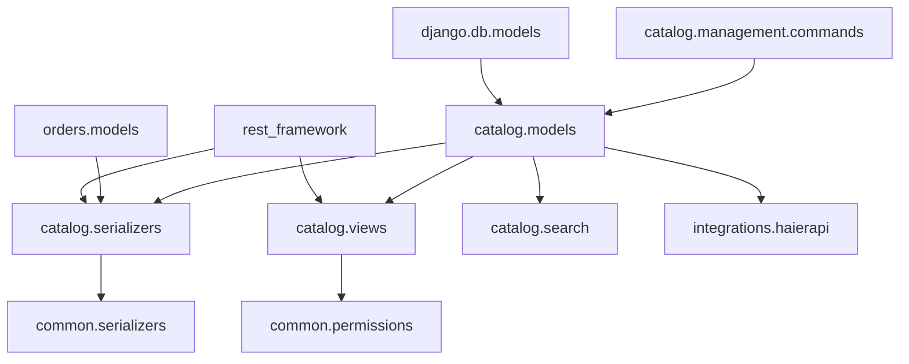

# 商品管理

<cite>
**本文档引用的文件**
- [models.py](file://backend/catalog/models.py)
- [serializers.py](file://backend/catalog/serializers.py)
- [views.py](file://backend/catalog/views.py)
- [permissions.py](file://backend/common/permissions.py)
- [search.py](file://backend/catalog/search.py)
- [haierapi.py](file://backend/integrations/haierapi.py)
- [common_serializers.py](file://backend/common/serializers.py)
- [sync_haier_products.py](file://backend/catalog/management/commands/sync_haier_products.py)
</cite>

## 目录
1. [简介](#简介)
2. [项目结构](#项目结构)
3. [核心组件](#核心组件)
4. [架构概览](#架构概览)
5. [详细组件分析](#详细组件分析)
6. [依赖关系分析](#依赖关系分析)
7. [性能考虑](#性能考虑)
8. [故障排除指南](#故障排除指南)
9. [结论](#结论)

## 简介

本文档详细介绍了电商小程序项目中的商品管理系统，重点分析Product模型的设计与实现。该系统采用Django REST Framework构建，支持本地商品管理和海尔API集成，提供了完整的商品生命周期管理功能。

商品管理系统的核心特性包括：
- 完整的商品信息管理（基础信息、价格体系、库存管理）
- 海尔API集成（商品同步、价格同步、库存同步）
- 高级搜索和过滤功能
- 权限控制和安全机制
- 商品状态管理和统计分析

## 项目结构

**图表来源**
- [models.py](file://backend/catalog/models.py#L1-L312)
- [serializers.py](file://backend/catalog/serializers.py#L1-L352)
- [views.py](file://backend/catalog/views.py#L1-L980)

**章节来源**
- [models.py](file://backend/catalog/models.py#L1-L312)
- [serializers.py](file://backend/catalog/serializers.py#L1-L352)
- [views.py](file://backend/catalog/views.py#L1-L980)

## 核心组件

### Product模型设计

Product模型是整个商品管理系统的核心，包含了商品的完整信息和业务逻辑。

#### 主要字段定义

| 字段类型 | 字段名称 | 数据类型 | 描述 | 默认值 |
|---------|---------|---------|------|--------|
| 基础信息 | name | CharField | 商品名称 | 必填 |
| 基础信息 | description | TextField | 商品描述 | 空字符串 |
| 关联信息 | category | ForeignKey | 商品分类 | 必填 |
| 关联信息 | brand | ForeignKey | 品牌 | 必填 |
| 价格体系 | price | DecimalField | 销售价 | 必填 |
| 价格体系 | supply_price | DecimalField | 普通供价 | null |
| 价格体系 | invoice_price | DecimalField | 开票价 | null |
| 价格体系 | market_price | DecimalField | 市场价 | null |
| 价格体系 | stock_rebate | DecimalField | 直扣 | null |
| 价格体系 | rebate_money | DecimalField | 台返 | null |
| 库存管理 | stock | PositiveIntegerField | 库存数量 | 0 |
| 库存管理 | warehouse_code | CharField | 库位编码 | 空字符串 |
| 库存管理 | warehouse_grade | CharField | 仓库等级 | 空字符串 |
| 海尔特有 | product_code | CharField | 海尔产品编码 | null |
| 海尔特有 | product_model | CharField | 海尔产品型号 | 空字符串 |
| 海尔特有 | product_group | CharField | 海尔产品组 | 空字符串 |
| 海尔特有 | product_image_url | URLField | 海尔主图URL | 空字符串 |
| 海尔特有 | product_page_urls | JSONField | 海尔拉页URL列表 | 空列表 |
| 状态管理 | is_active | BooleanField | 是否上架 | true |
| 状态管理 | is_sales | CharField | 海尔是否可采 | '1' |
| 状态管理 | no_sales_reason | CharField | 不可采原因 | 空字符串 |
| 统计信息 | view_count | PositiveIntegerField | 浏览次数 | 0 |
| 统计信息 | sales_count | PositiveIntegerField | 销售数量 | 0 |
| 时间戳 | created_at | DateTimeField | 创建时间 | auto_now_add |
| 时间戳 | updated_at | DateTimeField | 更新时间 | auto_now |
| 时间戳 | last_sync_at | DateTimeField | 最后同步时间 | null |

**章节来源**
- [models.py](file://backend/catalog/models.py#L43-L116)

## 架构概览

**图表来源**
- [models.py](file://backend/catalog/models.py#L43-L205)
- [serializers.py](file://backend/catalog/serializers.py#L50-L251)
- [views.py](file://backend/catalog/views.py#L29-L565)
- [search.py](file://backend/catalog/search.py#L19-L287)

## 详细组件分析

### Product模型深度解析

#### 商品来源标识

系统支持两种商品来源：本地商品和海尔商品，通过`source`字段进行区分：

**图表来源**
- [models.py](file://backend/catalog/models.py#L51-L64)
- [models.py](file://backend/catalog/models.py#L118-L179)

#### 海尔商品同步机制

`sync_from_haier`方法实现了从海尔API同步商品数据的完整流程：

**图表来源**
- [models.py](file://backend/catalog/models.py#L118-L179)
- [haierapi.py](file://backend/integrations/haierapi.py#L74-L97)

**章节来源**
- [models.py](file://backend/catalog/models.py#L118-L179)
- [haierapi.py](file://backend/integrations/haierapi.py#L74-L97)

### ProductSerializer序列化器

#### 安全字段设计

ProductSerializer采用了多种专用字段来确保数据安全和有效性：

| 字段类型 | 字段名称 | 自定义类 | 安全特性 |
|---------|---------|---------|----------|
| 文本输入 | name | SecureCharField | HTML转义，防止XSS攻击 |
| 文本输入 | description | SecureCharField | HTML转义，防止XSS攻击 |
| 文本输入 | product_model | SecureCharField | HTML转义，防止XSS攻击 |
| 文本输入 | product_group | SecureCharField | HTML转义，防止XSS攻击 |
| 文本输入 | warehouse_code | SecureCharField | HTML转义，防止XSS攻击 |
| 文本输入 | no_sales_reason | SecureCharField | HTML转义，防止XSS攻击 |
| 数值输入 | price | PriceField | 价格验证，必须大于0 |
| 数值输入 | stock | StockField | 库存验证，非负数 |
| 数值输入 | supply_price | PriceField | 价格验证，可选 |
| 数值输入 | invoice_price | PriceField | 价格验证，可选 |
| 数值输入 | market_price | PriceField | 价格验证，可选 |
| 数值输入 | stock_rebate | PriceField | 价格验证，可选 |
| 数值输入 | rebate_money | PriceField | 价格验证，可选 |

#### 图片URL处理机制

to_representation方法实现了智能的图片URL处理逻辑：

**图表来源**
- [serializers.py](file://backend/catalog/serializers.py#L122-L156)

**章节来源**
- [serializers.py](file://backend/catalog/serializers.py#L50-L251)

### API接口设计

#### 权限控制策略

系统采用分层权限控制：

**图表来源**
- [permissions.py](file://backend/common/permissions.py#L70-L99)
- [permissions.py](file://backend/common/permissions.py#L101-L123)

#### 商品管理API端点

| 端点 | 方法 | 权限 | 功能描述 |
|------|------|------|----------|
| `/api/products/` | GET | AllowAny | 列出商品，支持搜索和过滤 |
| `/api/products/` | POST | IsAdminOrReadOnly | 创建新商品 |
| `/api/products/{id}/` | GET | AllowAny | 获取单个商品详情 |
| `/api/products/{id}/` | PUT/PATCH | IsAdminOrReadOnly | 更新商品信息 |
| `/api/products/{id}/` | DELETE | IsAdminOrReadOnly | 删除商品 |
| `/api/products/{id}/sync-haier-stock/` | POST | IsAdmin | 同步海尔库存 |
| `/api/products/{id}/sync-haier-price/` | POST | IsAdmin | 同步海尔价格 |
| `/api/products/related/` | GET | AllowAny | 获取相关商品 |
| `/api/products/recommendations/` | GET | AllowAny | 获取推荐商品 |

**章节来源**
- [views.py](file://backend/catalog/views.py#L29-L565)

### 搜索和过滤系统

#### ProductSearchService核心功能

**图表来源**
- [search.py](file://backend/catalog/search.py#L47-L158)

**章节来源**
- [search.py](file://backend/catalog/search.py#L47-L158)

## 依赖关系分析

### 模块间依赖关系

**图表来源**
- [models.py](file://backend/catalog/models.py#L1-L6)
- [serializers.py](file://backend/catalog/serializers.py#L1-L14)
- [views.py](file://backend/catalog/views.py#L1-L18)

**章节来源**
- [models.py](file://backend/catalog/models.py#L1-L312)
- [serializers.py](file://backend/catalog/serializers.py#L1-L352)
- [views.py](file://backend/catalog/views.py#L1-L980)

## 性能考虑

### 查询优化策略

1. **索引设计**：Product模型设置了多个复合索引以优化查询性能
2. **预加载关联数据**：使用select_related减少数据库查询次数
3. **缓存机制**：在价格计算中使用Redis缓存减少数据库查询
4. **分页处理**：支持大结果集的高效分页

### 内存优化

1. **流式处理**：大量数据处理时使用生成器模式
2. **批量操作**：支持批量创建和更新操作
3. **延迟加载**：非关键字段采用延迟加载策略

## 故障排除指南

### 常见问题及解决方案

#### 商品图片处理问题

**问题**：图片URL格式不正确或无法访问
**解决方案**：
- 检查图片URL格式是否符合规范
- 验证图片文件是否存在且可访问
- 确认服务器配置正确

#### 价格计算异常

**问题**：折扣价计算错误
**解决方案**：
- 检查DiscountTarget配置
- 验证用户权限和有效期
- 清除相关缓存

#### 海尔API同步失败

**问题**：海尔商品同步中断
**解决方案**：
- 检查API认证信息
- 验证网络连接
- 查看API响应状态码

**章节来源**
- [serializers.py](file://backend/catalog/serializers.py#L122-L156)
- [views.py](file://backend/catalog/views.py#L439-L493)

## 结论

商品管理系统是一个功能完整、设计合理的电商核心模块。它成功地整合了本地商品管理和第三方API集成，提供了强大的搜索、过滤和权限控制功能。

### 主要优势

1. **安全性**：通过SecureCharField等专用字段确保数据安全
2. **可扩展性**：模块化设计便于功能扩展
3. **性能**：优化的查询和缓存策略保证系统性能
4. **易维护**：清晰的代码结构和完善的注释

### 改进建议

1. **监控告警**：增加API调用监控和异常告警
2. **批量操作**：提供更多批量处理功能
3. **数据分析**：增强商品销售和浏览数据的分析能力
4. **国际化**：支持多语言商品信息管理

该系统为电商平台提供了坚实的基础设施，能够满足当前业务需求并支持未来的扩展发展。