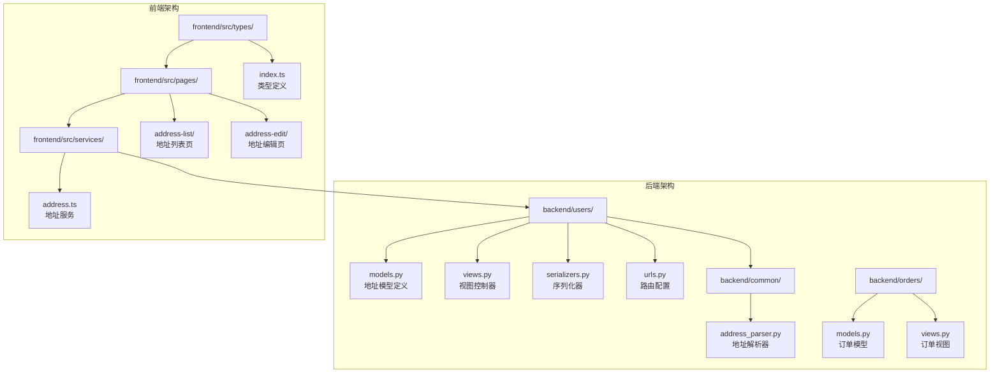
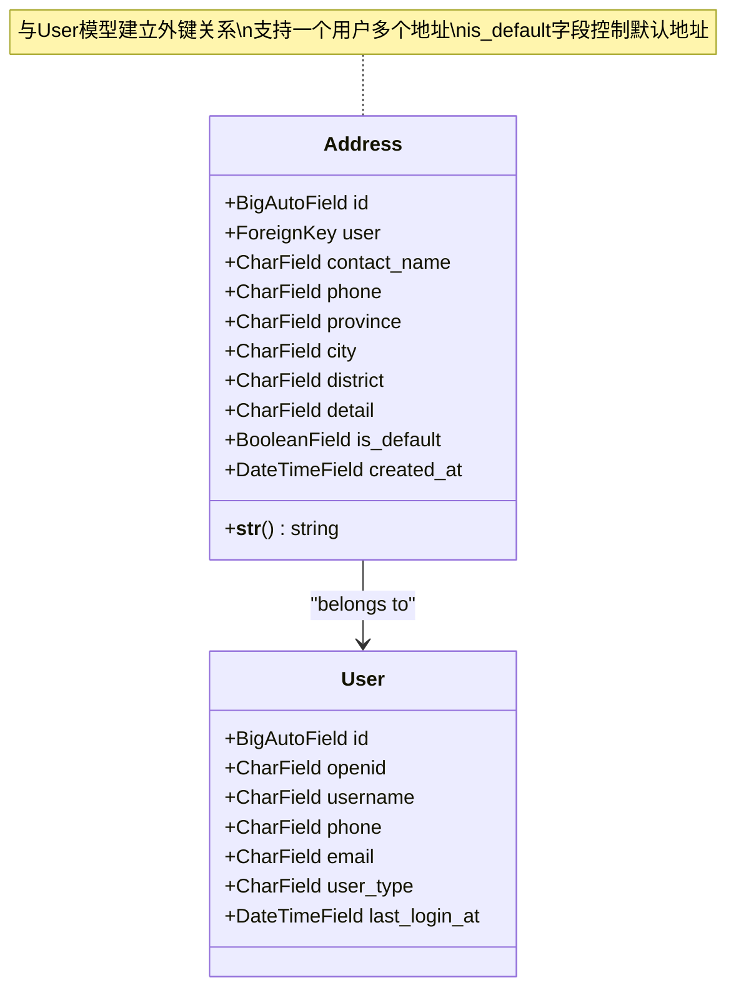
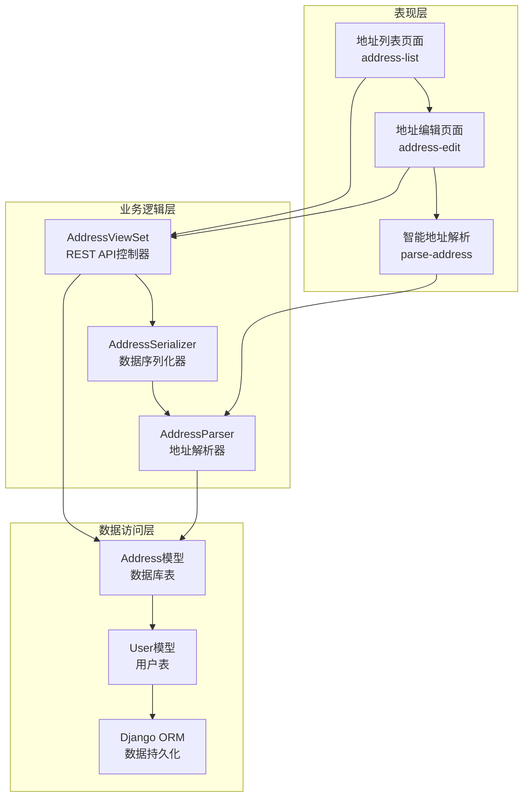
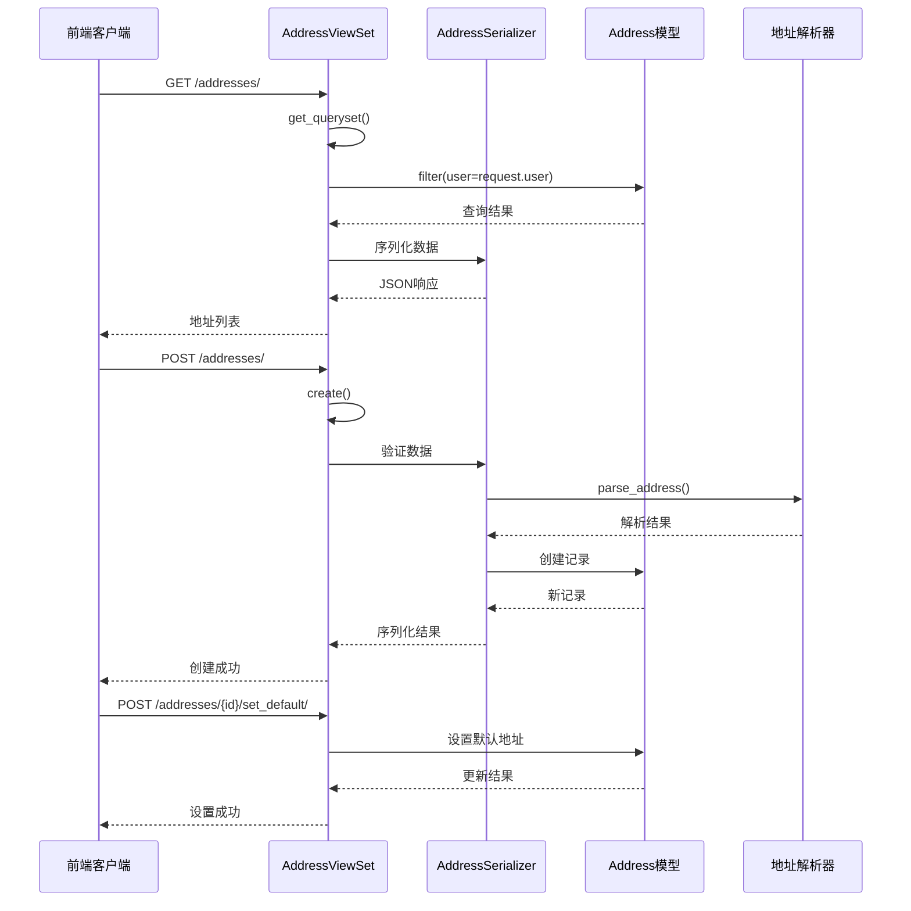
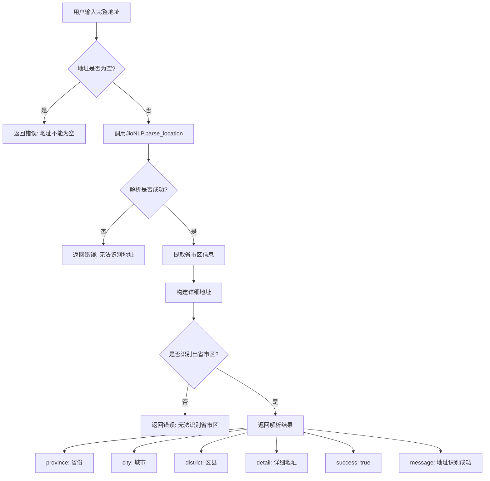
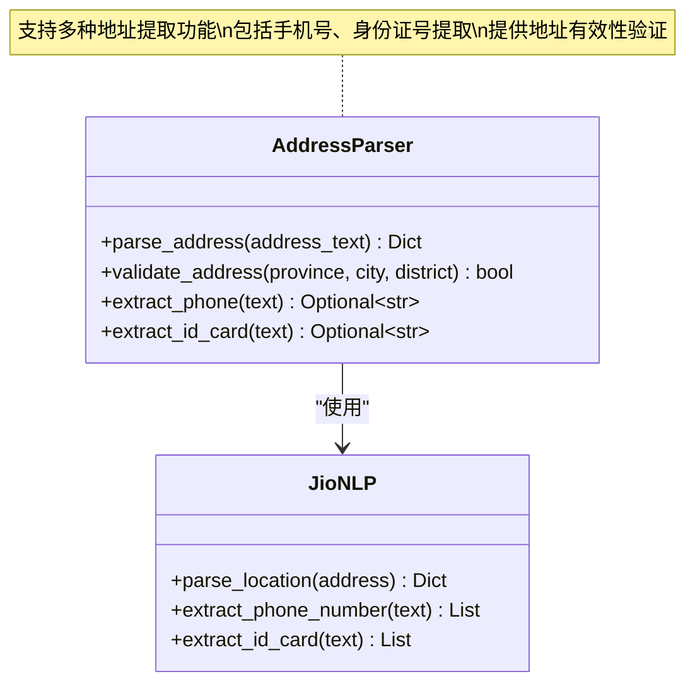
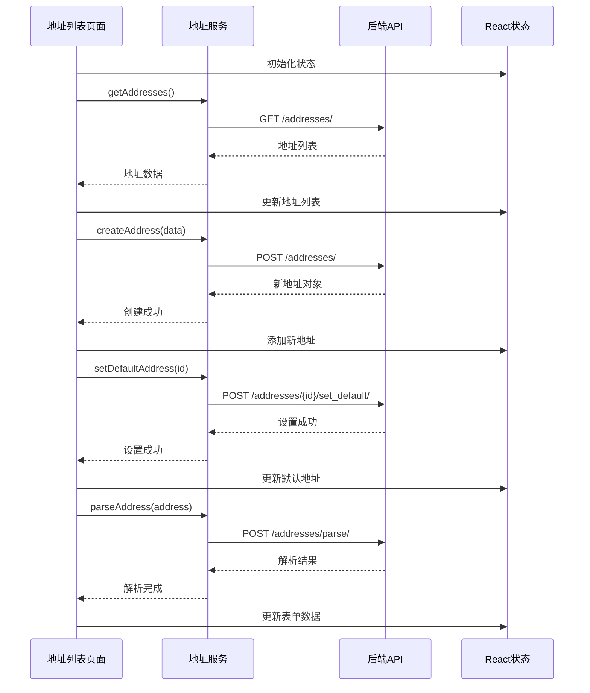
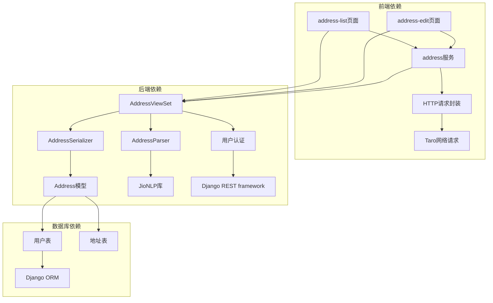

# 收货地址管理

<cite>
**本文档引用的文件**
- [backend/users/models.py](file://backend/users/models.py)
- [backend/users/views.py](file://backend/users/views.py)
- [backend/users/serializers.py](file://backend/users/serializers.py)
- [backend/users/urls.py](file://backend/users/urls.py)
- [backend/common/address_parser.py](file://backend/common/address_parser.py)
- [frontend/src/services/address.ts](file://frontend/src/services/address.ts)
- [frontend/src/pages/address-list/index.tsx](file://frontend/src/pages/address-list/index.tsx)
- [frontend/src/pages/address-edit/index.tsx](file://frontend/src/pages/address-edit/index.tsx)
- [frontend/src/types/index.ts](file://frontend/src/types/index.ts)
</cite>

## 目录
1. [简介](#简介)
2. [项目结构](#项目结构)
3. [核心组件](#核心组件)
4. [架构概览](#架构概览)
5. [详细组件分析](#详细组件分析)
6. [依赖关系分析](#依赖关系分析)
7. [性能考虑](#性能考虑)
8. [故障排除指南](#故障排除指南)
9. [结论](#结论)

## 简介

收货地址管理系统是电商业务小程序的核心功能模块之一，负责处理用户的收货地址信息管理。该系统采用前后端分离架构，后端基于Django REST framework构建，前端使用Taro框架开发跨平台小程序应用。系统提供了完整的地址管理功能，包括地址的创建、编辑、删除、默认地址设置以及智能地址解析等核心功能。

## 项目结构

收货地址管理系统的文件组织结构清晰，主要分布在以下目录中：



**图表来源**
- [backend/users/models.py](file://backend/users/models.py#L1-L95)
- [backend/users/views.py](file://backend/users/views.py#L1-L460)
- [frontend/src/services/address.ts](file://frontend/src/services/address.ts#L1-L44)

**章节来源**
- [backend/users/models.py](file://backend/users/models.py#L1-L95)
- [backend/users/views.py](file://backend/users/views.py#L1-L460)
- [frontend/src/services/address.ts](file://frontend/src/services/address.ts#L1-L44)

## 核心组件

### Address模型设计

Address模型是整个地址管理系统的核心数据结构，采用了简洁而有效的设计：



**图表来源**
- [backend/users/models.py](file://backend/users/models.py#L77-L95)

#### 字段定义详解

| 字段名 | 类型 | 长度 | 必填 | 描述 | 默认值 |
|--------|------|------|------|------|--------|
| id | BigAutoField | - | 是 | 主键标识符 | 自动生成 |
| user | ForeignKey | - | 是 | 关联的用户对象 | 外键约束 |
| contact_name | CharField | 50 | 是 | 联系人姓名 | - |
| phone | CharField | 20 | 是 | 联系电话 | - |
| province | CharField | 20 | 是 | 省份名称 | - |
| city | CharField | 20 | 是 | 城市名称 | - |
| district | CharField | 20 | 是 | 区县名称 | - |
| detail | CharField | 200 | 是 | 详细地址 | - |
| is_default | BooleanField | - | 否 | 是否为默认地址 | False |
| created_at | DateTimeField | - | 是 | 创建时间 | 自动添加 |

**章节来源**
- [backend/users/models.py](file://backend/users/models.py#L77-L95)

## 架构概览

收货地址管理系统采用典型的三层架构设计：



**图表来源**
- [backend/users/views.py](file://backend/users/views.py#L287-L385)
- [frontend/src/services/address.ts](file://frontend/src/services/address.ts#L1-L44)

## 详细组件分析

### AddressViewSet RESTful API设计

AddressViewSet是地址管理的核心控制器，继承自Django REST framework的ModelViewSet，提供了完整的CRUD操作：



**图表来源**
- [backend/users/views.py](file://backend/users/views.py#L287-L385)
- [backend/users/serializers.py](file://backend/users/serializers.py#L56-L92)

#### API端点详情

| HTTP方法 | 端点路径 | 功能描述 | 请求体 | 响应格式 |
|----------|----------|----------|--------|----------|
| GET | /addresses/ | 获取地址列表 | 无 | 地址数组 |
| POST | /addresses/ | 创建新地址 | 地址数据 | 新地址对象 |
| GET | /addresses/{id}/ | 获取指定地址 | 无 | 单个地址对象 |
| PUT | /addresses/{id}/ | 更新完整地址 | 完整地址数据 | 更新后的地址对象 |
| PATCH | /addresses/{id}/ | 部分更新地址 | 部分地址数据 | 更新后的地址对象 |
| DELETE | /addresses/{id}/ | 删除地址 | 无 | 成功/失败状态 |
| POST | /addresses/{id}/set_default/ | 设置默认地址 | 无 | 设置状态消息 |
| POST | /addresses/parse/ | 智能解析地址 | 完整地址文本 | 解析结果 |

**章节来源**
- [backend/users/views.py](file://backend/users/views.py#L287-L385)
- [backend/users/urls.py](file://backend/users/urls.py#L1-L18)

### 智能地址解析功能

地址解析功能是系统的重要特性，通过调用JioNLP库实现中文地址的智能识别和拆分：



**图表来源**
- [backend/common/address_parser.py](file://backend/common/address_parser.py#L25-L107)

#### 地址解析算法实现

地址解析器使用JioNLP库的强大功能，能够准确识别中文地址的各个组成部分：



**图表来源**
- [backend/common/address_parser.py](file://backend/common/address_parser.py#L12-L175)

**章节来源**
- [backend/common/address_parser.py](file://backend/common/address_parser.py#L1-L175)

### 前端UI组件与后端API交互

前端采用React Hooks模式开发，实现了完整的地址管理界面：



**图表来源**
- [frontend/src/pages/address-list/index.tsx](file://frontend/src/pages/address-list/index.tsx#L1-L135)
- [frontend/src/pages/address-edit/index.tsx](file://frontend/src/pages/address-edit/index.tsx#L1-L237)
- [frontend/src/services/address.ts](file://frontend/src/services/address.ts#L1-L44)

#### 地址编辑页面功能

地址编辑页面提供了完整的地址录入和智能解析功能：

```mermaid
flowchart TD
A[地址编辑页面] --> B[基础表单字段]
B --> C[联系人姓名输入]
B --> D[手机号输入]
B --> E[省市区选择]
B --> F[详细地址输入]
B --> G[默认地址开关]
A --> H[智能解析区域]
H --> I[完整地址输入框]
H --> J[智能识别按钮]
J --> K{解析状态}
K --> |解析中| L[显示"识别中..."]
K --> |解析完成| M[显示"智能识别"]
L --> N[调用parseAddress API]
M --> N
N --> O{解析结果}
O --> |成功| P[自动填充表单]
O --> |失败| Q[显示错误提示]
P --> R[保存地址]
Q --> S[手动填写]
R --> T[验证表单]
S --> T
T --> U{验证通过?}
U --> |否| V[显示错误信息]
U --> |是| W[调用后端API]
W --> X[保存成功]
V --> Y[等待用户修正]
```

**图表来源**
- [frontend/src/pages/address-edit/index.tsx](file://frontend/src/pages/address-edit/index.tsx#L1-L237)

**章节来源**
- [frontend/src/pages/address-list/index.tsx](file://frontend/src/pages/address-list/index.tsx#L1-L135)
- [frontend/src/pages/address-edit/index.tsx](file://frontend/src/pages/address-edit/index.tsx#L1-L237)
- [frontend/src/services/address.ts](file://frontend/src/services/address.ts#L1-L44)

## 依赖关系分析

系统各组件之间的依赖关系清晰明确：



**图表来源**
- [backend/users/views.py](file://backend/users/views.py#L1-L460)
- [frontend/src/services/address.ts](file://frontend/src/services/address.ts#L1-L44)

**章节来源**
- [backend/users/views.py](file://backend/users/views.py#L1-L460)
- [backend/common/address_parser.py](file://backend/common/address_parser.py#L1-L175)

## 性能考虑

### 地址列表优化

系统在地址列表查询中采用了智能排序策略，确保默认地址始终显示在最前面：

- **排序策略**: `order_by('-is_default', '-id')` - 首先按默认地址降序排列，然后按创建时间降序排列
- **分页禁用**: 由于地址数量通常较少，系统禁用了分页功能，直接返回完整列表
- **缓存策略**: 虽然地址列表本身不使用缓存，但系统整体采用了Redis缓存机制提升性能

### 地址解析性能

地址解析功能针对性能进行了优化：

- **异步处理**: 地址解析采用异步方式，避免阻塞用户界面
- **错误处理**: 完善的错误处理机制，确保解析失败时不会影响用户体验
- **结果缓存**: 虽然具体缓存实现未展示，但系统整体支持多级缓存

## 故障排除指南

### 常见问题及解决方案

#### 地址解析失败

**问题描述**: 用户输入完整地址后，智能识别功能无法正常工作

**可能原因**:
1. JioNLP库初始化失败
2. 输入地址格式不符合规范
3. 网络连接问题导致API调用失败

**解决方案**:
1. 检查后端日志确认JioNLP库是否正确初始化
2. 验证输入地址是否包含省市区信息
3. 确认网络连接正常，重试解析操作

#### 默认地址设置不生效

**问题描述**: 设置默认地址后，前端显示仍然不是最新的默认地址

**可能原因**:
1. 数据库事务未提交
2. 前端状态未及时更新
3. 并发操作导致状态冲突

**解决方案**:
1. 确保数据库操作在事务中正确执行
2. 在设置默认地址后重新加载地址列表
3. 实现适当的并发控制机制

#### 地址列表加载缓慢

**问题描述**: 地址列表页面加载时间过长

**可能原因**:
1. 地址数量过多
2. 数据库查询效率低
3. 网络传输延迟

**解决方案**:
1. 限制每个用户的地址数量
2. 优化数据库查询索引
3. 实现前端虚拟滚动技术

**章节来源**
- [backend/common/address_parser.py](file://backend/common/address_parser.py#L25-L107)
- [backend/users/views.py](file://backend/users/views.py#L311-L319)

## 结论

收货地址管理系统是一个设计合理、功能完善的模块，具有以下特点：

1. **数据模型设计**: Address模型采用简洁的五字段设计，既满足了基本需求又保持了良好的扩展性
2. **API设计**: RESTful风格的API设计符合现代Web开发最佳实践，易于集成和维护
3. **智能解析**: 基于JioNLP的地址解析功能大大提升了用户体验
4. **前后端分离**: 清晰的职责划分使得系统易于开发和维护
5. **错误处理**: 完善的错误处理机制确保了系统的稳定性

该系统为电商业务提供了可靠的地址管理基础设施，支持用户高效地管理收货地址，是构建完整电商生态的重要组成部分。