# 用户管理模块

<cite>
**本文档中引用的文件**
- [backend/users/models.py](file://backend/users/models.py)
- [backend/users/views.py](file://backend/users/views.py)
- [backend/users/serializers.py](file://backend/users/serializers.py)
- [backend/users/services.py](file://backend/users/services.py)
- [backend/users/urls.py](file://backend/users/urls.py)
- [backend/users/admin.py](file://backend/users/admin.py)
- [backend/users/migrations/0003_address.py](file://backend/users/migrations/0003_address.py)
- [backend/common/permissions.py](file://backend/common/permissions.py)
- [backend/common/address_parser.py](file://backend/common/address_parser.py)
- [backend/backend/settings/base.py](file://backend/backend/settings/base.py)
- [frontend/src/services/auth.ts](file://frontend/src/services/auth.ts)
- [merchant/src/services/api.ts](file://merchant/src/services/api.ts)
</cite>

## 目录
1. [简介](#简介)
2. [项目结构](#项目结构)
3. [核心组件](#核心组件)
4. [架构概览](#架构概览)
5. [详细组件分析](#详细组件分析)
6. [JWT认证流程](#jwt认证流程)
7. [用户资料管理](#用户资料管理)
8. [收货地址管理](#收货地址管理)
9. [权限控制机制](#权限控制机制)
10. [常见问题与解决方案](#常见问题与解决方案)
11. [总结](#总结)

## 简介

用户管理模块是电商业务系统的核心组件，负责处理用户认证、授权、资料管理和收货地址等功能。该模块采用Django REST Framework构建，支持微信小程序登录和传统用户名密码登录两种认证方式，提供了完整的用户生命周期管理功能。

模块的主要特点包括：
- 双重认证体系：支持微信小程序OAuth和传统用户名密码认证
- 灵活的用户类型：区分普通微信用户和管理员用户
- 完整的CRUD操作：支持用户资料和收货地址的增删改查
- 强大的权限控制：基于角色的访问控制（RBAC）
- 智能地址解析：自动识别和拆分中文地址

## 项目结构

用户管理模块位于`backend/users/`目录下，包含以下核心文件：

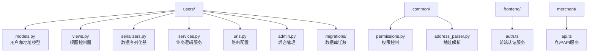

**图表来源**
- [backend/users/models.py](file://backend/users/models.py#L1-L95)
- [backend/users/views.py](file://backend/users/views.py#L1-L460)
- [backend/users/serializers.py](file://backend/users/serializers.py#L1-L92)
- [backend/users/services.py](file://backend/users/services.py#L1-L55)

**章节来源**
- [backend/users/models.py](file://backend/users/models.py#L1-L95)
- [backend/users/views.py](file://backend/users/views.py#L1-L460)
- [backend/users/serializers.py](file://backend/users/serializers.py#L1-L92)
- [backend/users/services.py](file://backend/users/services.py#L1-L55)

## 核心组件

### User模型设计

User模型继承自Django的AbstractUser，扩展了微信小程序登录所需的字段：

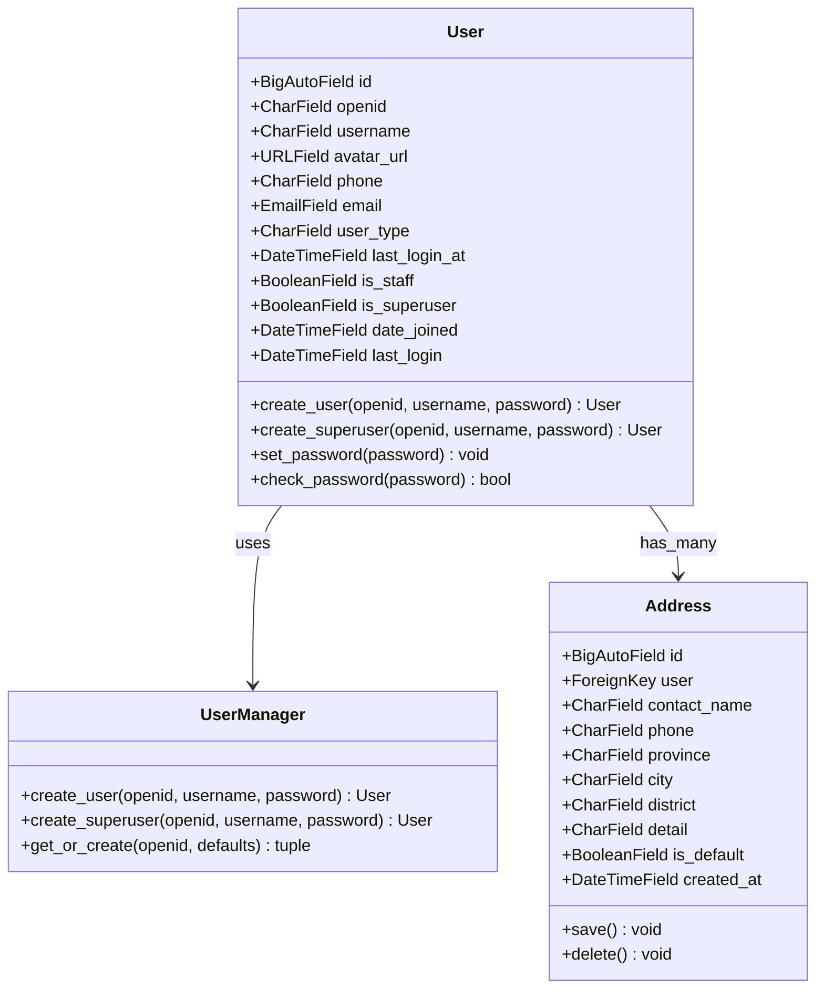

**图表来源**
- [backend/users/models.py](file://backend/users/models.py#L31-L95)

### 字段定义与业务规则

| 字段名 | 类型 | 约束 | 描述 | 业务规则 |
|--------|------|------|------|----------|
| id | BigAutoField | 主键 | 用户唯一标识 | 自动递增 |
| openid | CharField(64) | 唯一、可空 | 微信用户标识 | 微信登录必需 |
| username | CharField(150) | 唯一、可空 | 用户名 | 自动生成或手动设置 |
| avatar_url | URLField(200) | 可空 | 头像链接 | 默认Gravatar头像 |
| phone | CharField(20) | 可空 | 手机号码 | 用户联系方式 |
| email | EmailField | 可空 | 电子邮箱 | 用户注册信息 |
| user_type | CharField(20) | 枚举 | 用户类型 | wechat/admin |
| last_login_at | DateTimeField | 可空 | 最后登录时间 | 记录登录时间戳 |
| is_staff | BooleanField | 默认False | 管理员标志 | 控制后台访问权限 |
| is_superuser | BooleanField | 默认False | 超级管理员 | 完全系统权限 |

**章节来源**
- [backend/users/models.py](file://backend/users/models.py#L31-L95)

## 架构概览

用户管理模块采用分层架构设计，清晰分离关注点：

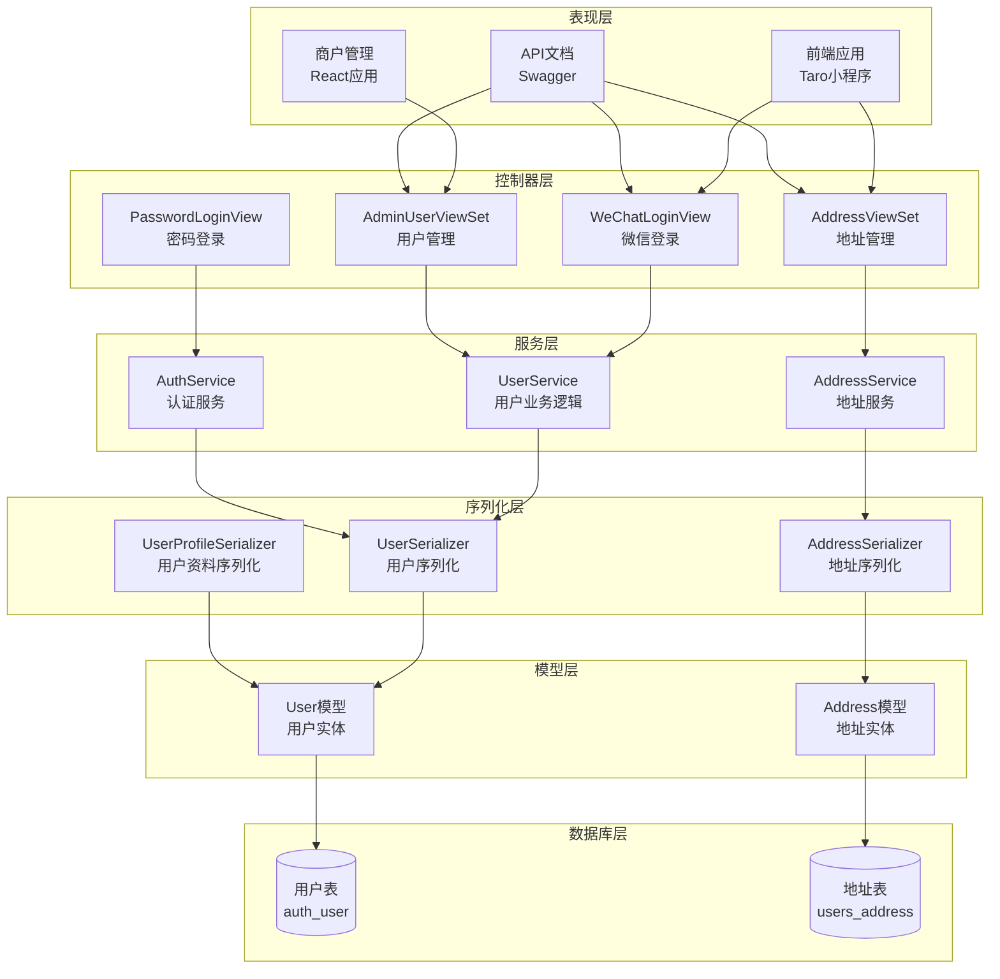

**图表来源**
- [backend/users/views.py](file://backend/users/views.py#L22-L460)
- [backend/users/serializers.py](file://backend/users/serializers.py#L1-L92)
- [backend/users/models.py](file://backend/users/models.py#L1-L95)

## 详细组件分析

### 微信登录实现

微信登录是模块的核心功能之一，支持微信小程序OAuth认证流程：

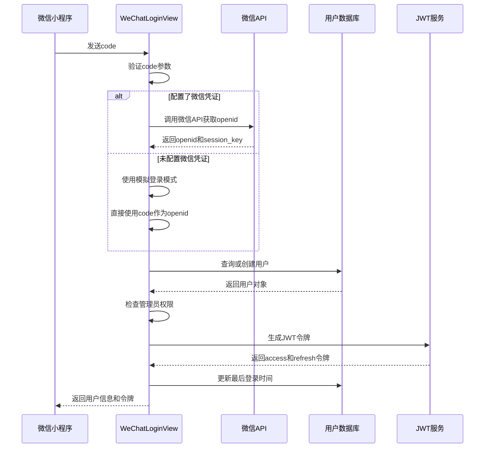

**图表来源**
- [backend/users/views.py](file://backend/users/views.py#L22-L154)
- [backend/users/services.py](file://backend/users/services.py#L1-L55)

#### 关键特性

1. **双重登录模式**：支持真实微信API和模拟登录
2. **管理员快捷登录**：开发环境下code以'admin'开头可直接获得管理员权限
3. **异常处理**：完善的错误处理和日志记录
4. **速率限制**：防止暴力破解攻击

**章节来源**
- [backend/users/views.py](file://backend/users/views.py#L22-L154)
- [backend/users/services.py](file://backend/users/services.py#L1-L55)

### 密码登录实现

管理员密码登录提供了传统的认证方式：

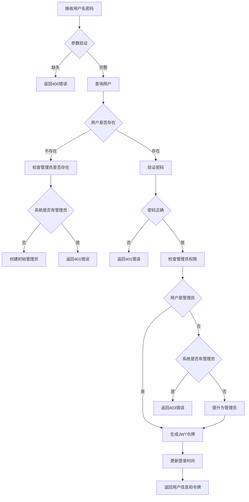

**图表来源**
- [backend/users/views.py](file://backend/users/views.py#L161-L233)

**章节来源**
- [backend/users/views.py](file://backend/users/views.py#L161-L233)

### 地址管理功能

地址管理提供了完整的CRUD操作和智能地址解析：

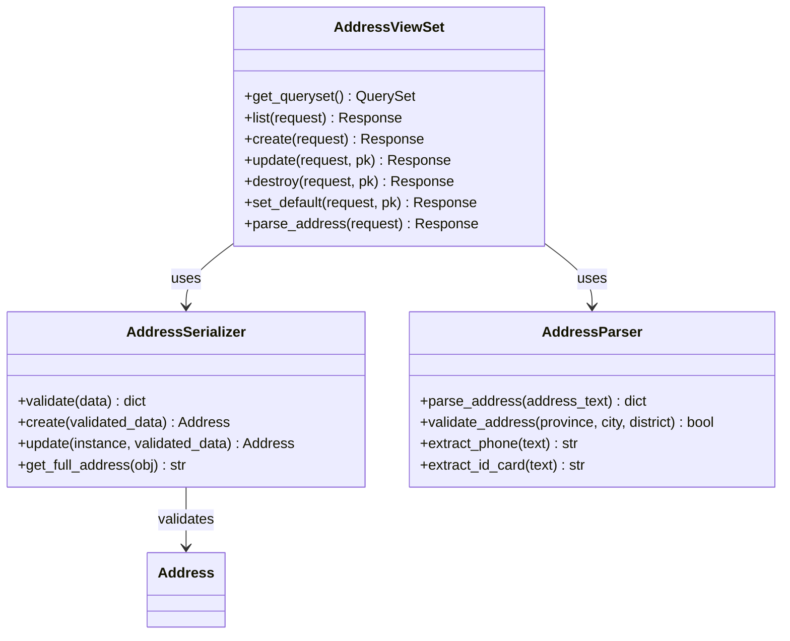

**图表来源**
- [backend/users/views.py](file://backend/users/views.py#L287-L385)
- [backend/users/serializers.py](file://backend/users/serializers.py#L56-L92)
- [backend/common/address_parser.py](file://backend/common/address_parser.py#L12-L175)

**章节来源**
- [backend/users/views.py](file://backend/users/views.py#L287-L385)
- [backend/users/serializers.py](file://backend/users/serializers.py#L56-L92)
- [backend/common/address_parser.py](file://backend/common/address_parser.py#L12-L175)

## JWT认证流程

### 认证架构

系统采用JWT（JSON Web Token）进行无状态认证：

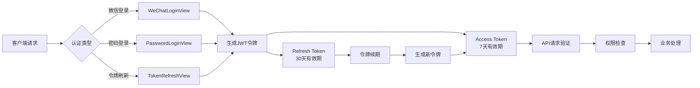

**图表来源**
- [backend/users/views.py](file://backend/users/views.py#L22-L233)
- [backend/users/urls.py](file://backend/users/urls.py#L1-L18)
- [backend/backend/settings/base.py](file://backend/backend/settings/base.py#L142-L146)

### 令牌管理策略

| 令牌类型 | 生命周期 | 用途 | 刷新策略 |
|----------|----------|------|----------|
| Access Token | 7天 | API请求认证 | 不自动刷新 |
| Refresh Token | 30天 | 令牌续期 | 支持手动刷新 |
| Session Token | 会话期间 | 浏览器会话 | 随浏览器关闭 |

**章节来源**
- [backend/backend/settings/base.py](file://backend/backend/settings/base.py#L142-L146)
- [backend/users/views.py](file://backend/users/views.py#L22-L233)

## 用户资料管理

### 用户资料序列化

用户资料管理通过专门的序列化器实现：

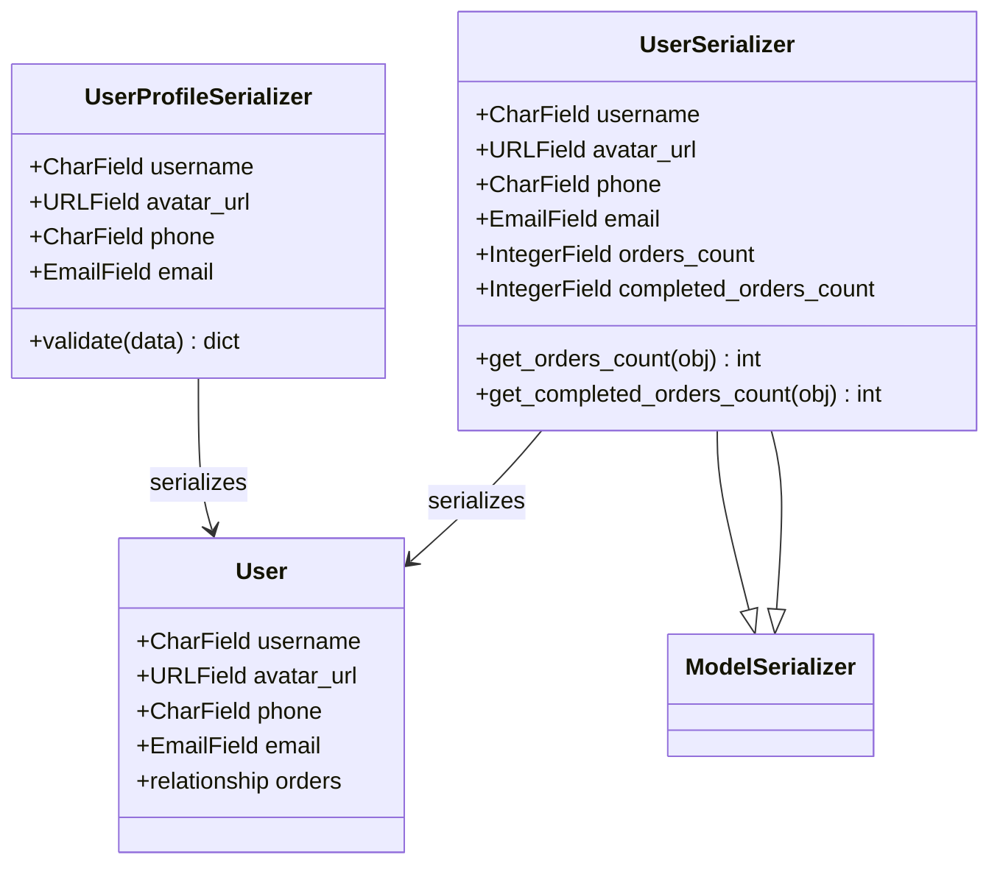

**图表来源**
- [backend/users/serializers.py](file://backend/users/serializers.py#L43-L56)
- [backend/users/serializers.py](file://backend/users/serializers.py#L6-L42)

### 用户统计功能

系统提供了用户订单统计功能，通过缓存优化性能：

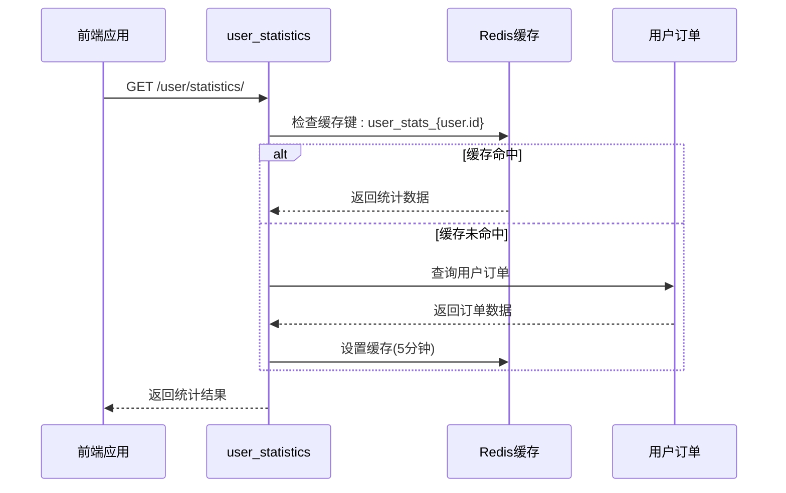

**图表来源**
- [backend/users/views.py](file://backend/users/views.py#L250-L285)

**章节来源**
- [backend/users/serializers.py](file://backend/users/serializers.py#L43-L92)
- [backend/users/views.py](file://backend/users/views.py#L250-L285)

## 收货地址管理

### 地址CRUD操作

地址管理提供了完整的CRUD功能：

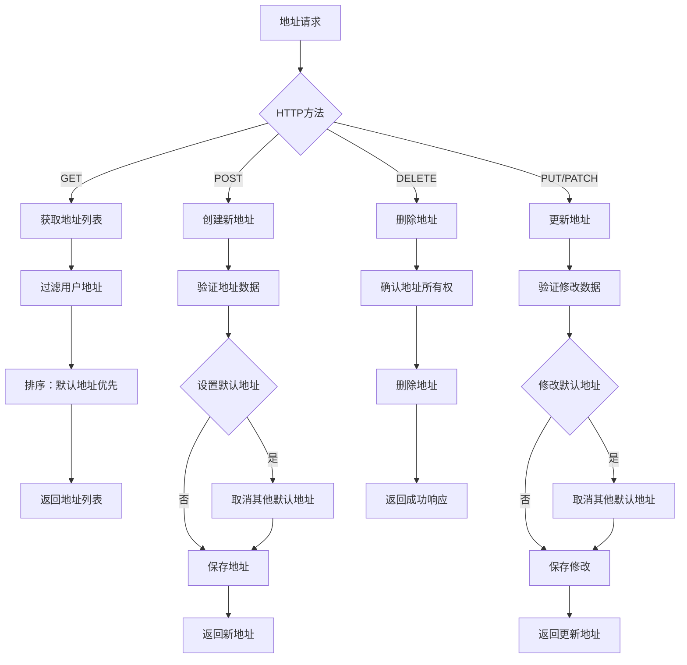

**图表来源**
- [backend/users/views.py](file://backend/users/views.py#L287-L385)
- [backend/users/serializers.py](file://backend/users/serializers.py#L56-L92)

### 智能地址解析

系统集成了JioNLP进行智能地址解析：

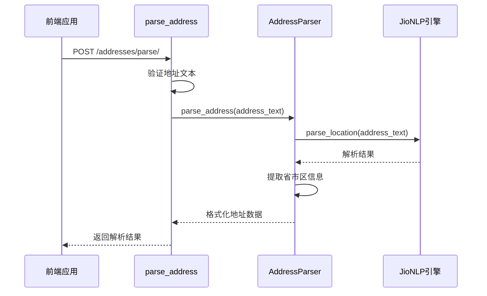

**图表来源**
- [backend/users/views.py](file://backend/users/views.py#L356-L385)
- [backend/common/address_parser.py](file://backend/common/address_parser.py#L25-L107)

**章节来源**
- [backend/users/views.py](file://backend/users/views.py#L287-L385)
- [backend/users/serializers.py](file://backend/users/serializers.py#L56-L92)
- [backend/common/address_parser.py](file://backend/common/address_parser.py#L25-L107)

## 权限控制机制

### 权限类设计

系统实现了多层次的权限控制：

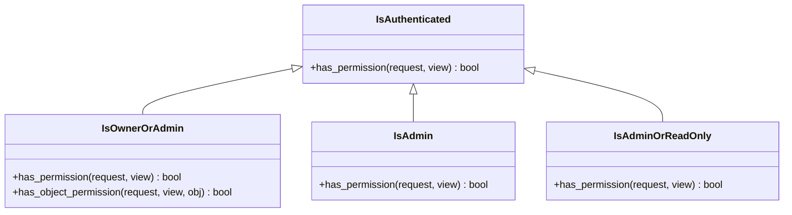

**图表来源**
- [backend/common/permissions.py](file://backend/common/permissions.py#L12-L189)

### 权限应用场景

| 权限类 | 应用场景 | 访问控制 |
|--------|----------|----------|
| IsAuthenticated | 用户资料管理 | 已认证用户 |
| IsOwnerOrAdmin | 地址管理 | 用户本人或管理员 |
| IsAdmin | 用户管理 | 管理员用户 |
| IsAdminOrReadOnly | 商品管理 | 管理员写入，所有人只读 |

**章节来源**
- [backend/common/permissions.py](file://backend/common/permissions.py#L12-L189)
- [backend/users/views.py](file://backend/users/views.py#L287-L460)

## 常见问题与解决方案

### Token刷新失败

**问题描述**：JWT刷新令牌过期或无效

**解决方案**：
1. 检查Refresh Token的有效期
2. 实现自动重新登录机制
3. 提供令牌过期提示和重新登录入口

**代码示例路径**：[backend/users/views.py](file://backend/users/views.py#L14-L15)

### 地址解析错误

**问题描述**：中文地址无法正确解析

**解决方案**：
1. 验证地址格式是否符合规范
2. 检查JioNLP依赖是否正常安装
3. 提供手动填写地址的备用方案

**代码示例路径**：[backend/common/address_parser.py](file://backend/common/address_parser.py#L25-L107)

### 微信登录异常

**问题描述**：微信API调用失败或返回错误

**解决方案**：
1. 检查微信AppID和Secret配置
2. 验证网络连接和防火墙设置
3. 实现降级到模拟登录模式

**代码示例路径**：[backend/users/views.py](file://backend/users/views.py#L60-L118)

### 管理员权限问题

**问题描述**：首次登录无管理员权限

**解决方案**：
1. 系统自动检测并创建首个管理员账户
2. 提供管理员权限提升功能
3. 实现权限继承和审计日志

**代码示例路径**：[backend/users/services.py](file://backend/users/services.py#L26-L49)

### 地址重复问题

**问题描述**：用户创建重复地址

**解决方案**：
1. 在创建时自动取消其他默认地址
2. 提供地址去重功能
3. 实现地址合并和清理工具

**代码示例路径**：[backend/users/serializers.py](file://backend/users/serializers.py#L78-L91)

## 总结

用户管理模块是一个功能完整、架构清晰的Django应用组件，具有以下特点：

### 技术优势

1. **双认证体系**：支持微信小程序OAuth和传统用户名密码登录
2. **灵活的数据模型**：User模型扩展了业务需求，Address模型支持复杂地址管理
3. **完善的权限控制**：基于角色的访问控制（RBAC）确保数据安全
4. **智能地址解析**：集成JioNLP实现中文地址的自动识别和拆分
5. **高性能缓存**：用户统计和订单数据采用Redis缓存提升性能

### 设计亮点

1. **模块化架构**：清晰分离模型、视图、序列化器和服务层
2. **异常处理**：完善的错误处理和日志记录机制
3. **开发友好**：提供模拟登录和开发环境特殊功能
4. **扩展性强**：支持插件化的权限控制和业务逻辑

### 最佳实践

1. **安全性**：采用JWT无状态认证，支持令牌刷新
2. **性能优化**：合理使用缓存，减少数据库查询
3. **用户体验**：提供智能地址解析和快速登录功能
4. **可维护性**：清晰的代码结构和详细的文档注释

该模块为电商业务系统提供了坚实的用户基础，支持复杂的业务场景和未来的功能扩展需求。通过合理的架构设计和完善的权限控制，确保了系统的安全性和可维护性。