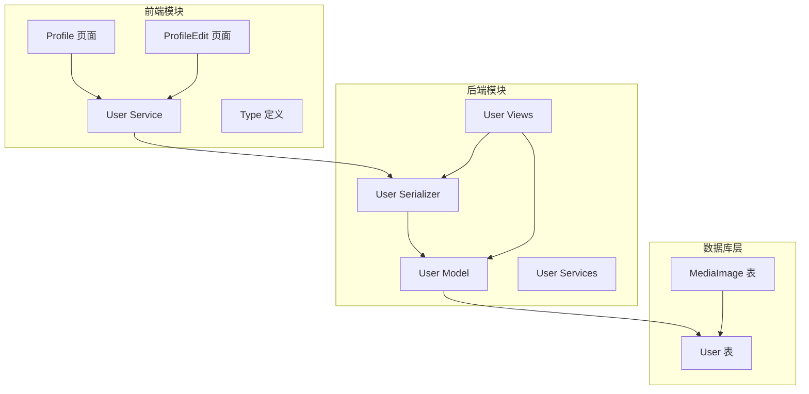
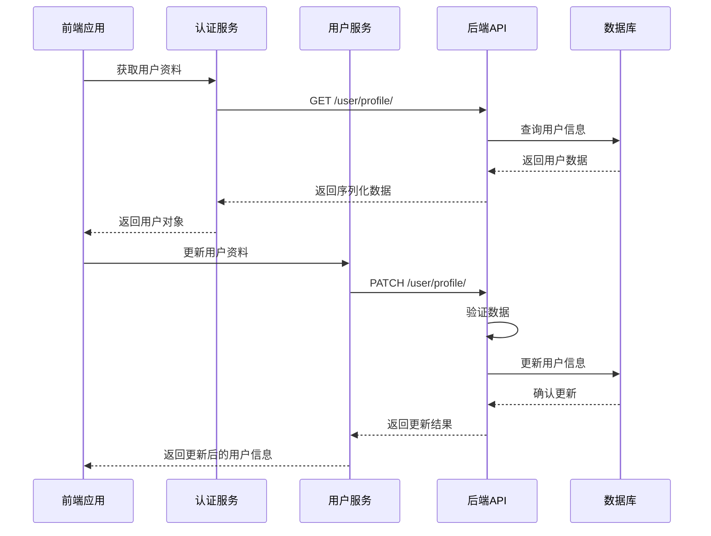
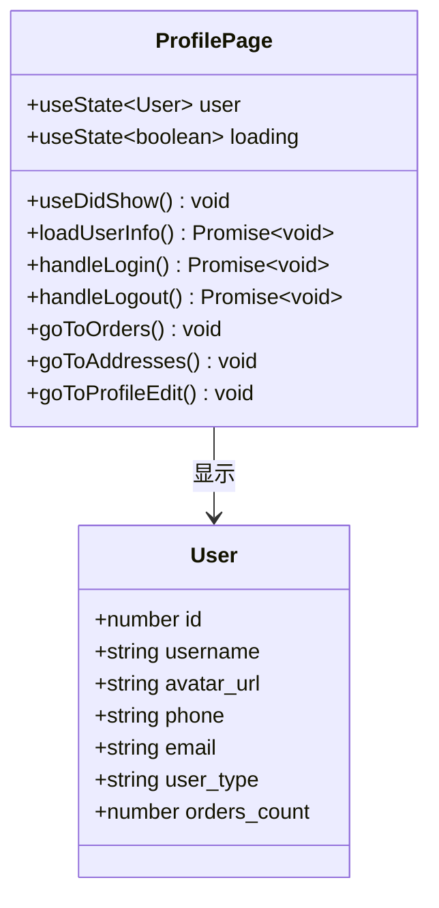
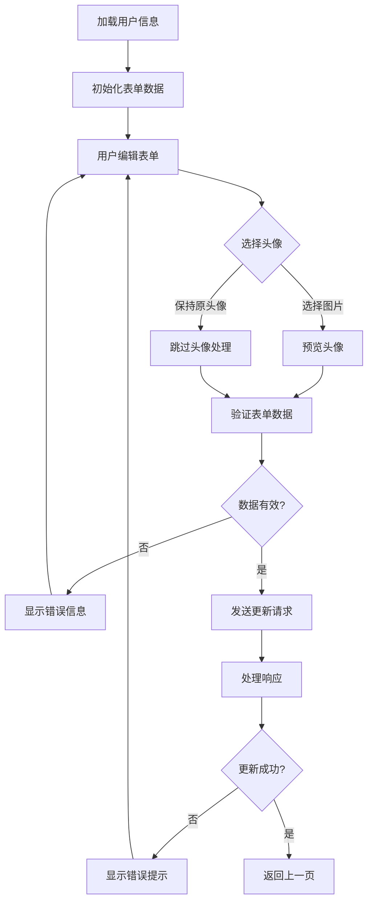
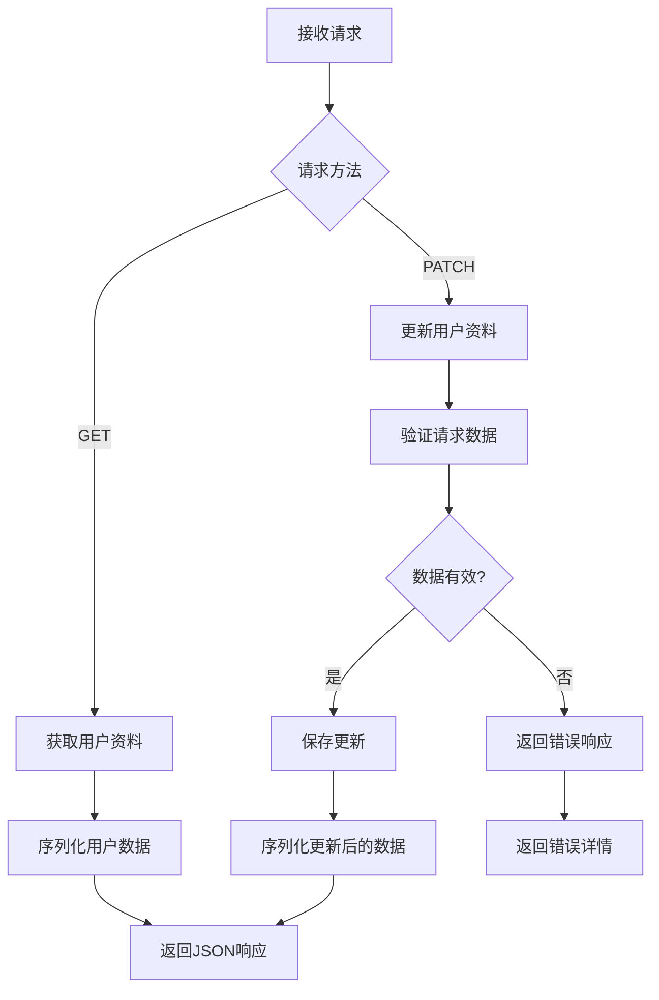
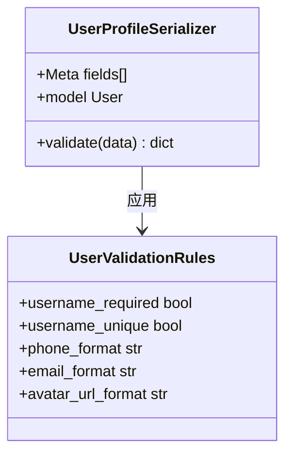
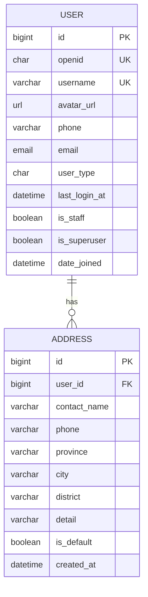
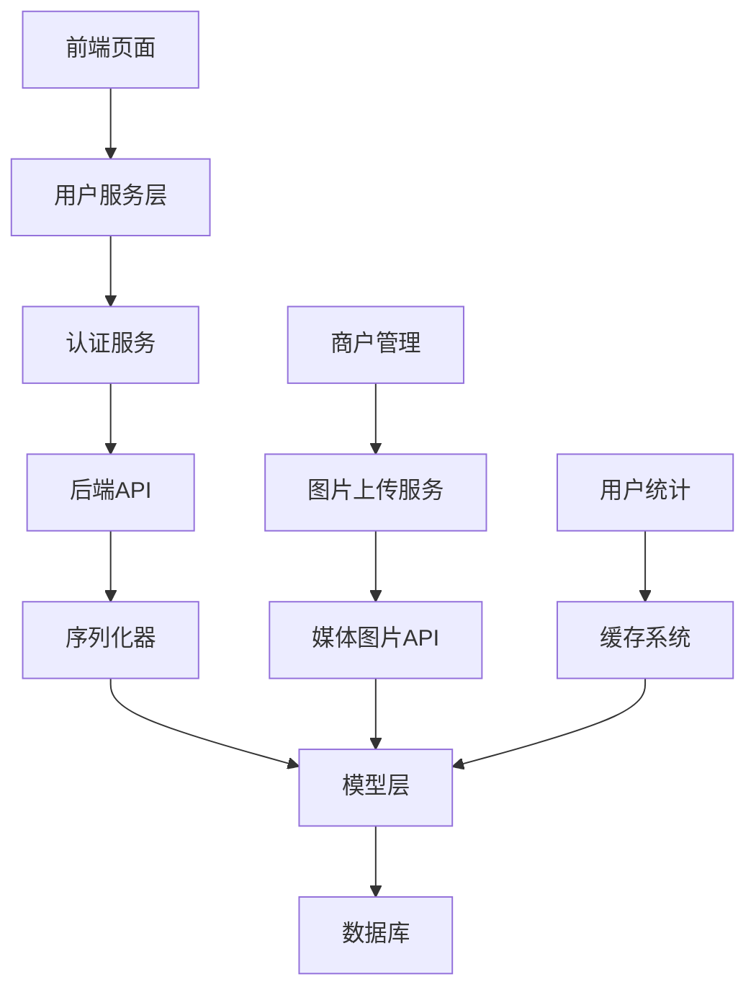

# 用户资料管理

<cite>
**本文档引用的文件**
- [backend/users/models.py](file://backend/users/models.py)
- [backend/users/serializers.py](file://backend/users/serializers.py)
- [backend/users/views.py](file://backend/users/views.py)
- [backend/users/services.py](file://backend/users/services.py)
- [backend/users/urls.py](file://backend/users/urls.py)
- [frontend/src/services/user.ts](file://frontend/src/services/user.ts)
- [frontend/src/pages/profile/index.tsx](file://frontend/src/pages/profile/index.tsx)
- [frontend/src/pages/profile-edit/index.tsx](file://frontend/src/pages/profile-edit/index.tsx)
- [frontend/src/types/index.ts](file://frontend/src/types/index.ts)
- [merchant/src/services/api.ts](file://merchant/src/services/api.ts)
</cite>

## 目录
1. [简介](#简介)
2. [项目结构](#项目结构)
3. [核心组件](#核心组件)
4. [架构概览](#架构概览)
5. [详细组件分析](#详细组件分析)
6. [依赖关系分析](#依赖关系分析)
7. [性能考虑](#性能考虑)
8. [故障排除指南](#故障排除指南)
9. [结论](#结论)

## 简介

本文档详细介绍了电商业务小程序中的用户资料管理功能，重点涵盖UserProfileSerializer和UserSerializer的字段映射与验证规则、用户资料的CRUD操作实现、以及前后端交互机制。该系统支持微信小程序登录、用户资料编辑、头像上传等功能，为用户提供完整的个人资料管理体验。

## 项目结构

用户资料管理系统采用前后端分离架构，主要分为以下模块：

**图表来源**
- [frontend/src/pages/profile/index.tsx](file://frontend/src/pages/profile/index.tsx#L1-L170)
- [frontend/src/pages/profile-edit/index.tsx](file://frontend/src/pages/profile-edit/index.tsx#L1-L168)
- [backend/users/models.py](file://backend/users/models.py#L1-L95)

**章节来源**
- [frontend/src/pages/profile/index.tsx](file://frontend/src/pages/profile/index.tsx#L1-L170)
- [frontend/src/pages/profile-edit/index.tsx](file://frontend/src/pages/profile-edit/index.tsx#L1-L168)
- [backend/users/models.py](file://backend/users/models.py#L1-L95)

## 核心组件

### User 模型设计

User模型是整个用户资料管理的核心，继承自Django的AbstractUser，扩展了微信小程序登录所需的字段：

| 字段名 | 类型 | 默认值 | 验证规则 | 描述 |
|--------|------|--------|----------|------|
| username | CharField | 自动生成 | 唯一性、长度限制 | 用户名，支持中文和特殊字符 |
| avatar_url | URLField | Gravatar链接 | URL格式验证 | 用户头像链接，支持HTTPS |
| phone | CharField | 空字符串 | 可选、长度限制 | 手机号码，用于订单联系 |
| email | EmailField | 空字符串 | 邮箱格式验证 | 电子邮箱地址 |
| user_type | CharField | 'wechat' | 枚举值验证 | 用户类型：微信用户或管理员 |
| openid | CharField | null | 唯一性 | 微信小程序唯一标识符 |
| last_login_at | DateTimeField | null | 时间戳验证 | 最后登录时间记录 |

### 序列化器设计

系统提供了两个核心序列化器：

#### UserProfileSerializer
专门用于用户资料的读写操作，包含以下字段：
- username: 用户名
- avatar_url: 头像链接
- phone: 手机号
- email: 电子邮箱

#### UserSerializer
扩展版序列化器，包含所有User模型字段及统计信息：
- 包含UserProfileSerializer的所有字段
- orders_count: 总订单数量（缓存计算）
- completed_orders_count: 完成订单数量（缓存计算）

**章节来源**
- [backend/users/models.py](file://backend/users/models.py#L31-L65)
- [backend/users/serializers.py](file://backend/users/serializers.py#L6-L92)

## 架构概览

用户资料管理系统采用RESTful API架构，前后端通过HTTP协议进行通信：

**图表来源**
- [frontend/src/services/user.ts](file://frontend/src/services/user.ts#L1-L20)
- [backend/users/views.py](file://backend/users/views.py#L235-L247)

## 详细组件分析

### 前端组件分析

#### Profile 页面组件

Profile页面负责显示用户基本信息和提供导航功能：

**图表来源**
- [frontend/src/pages/profile/index.tsx](file://frontend/src/pages/profile/index.tsx#L9-L169)
- [frontend/src/types/index.ts](file://frontend/src/types/index.ts#L2-L11)

#### ProfileEdit 页面组件

ProfileEdit页面提供用户资料编辑功能：

**图表来源**
- [frontend/src/pages/profile-edit/index.tsx](file://frontend/src/pages/profile-edit/index.tsx#L1-L168)

**章节来源**
- [frontend/src/pages/profile/index.tsx](file://frontend/src/pages/profile/index.tsx#L1-L170)
- [frontend/src/pages/profile-edit/index.tsx](file://frontend/src/pages/profile-edit/index.tsx#L1-L168)

### 后端组件分析

#### 用户资料视图函数

user_profile视图函数实现了用户资料的CRUD操作：

**图表来源**
- [backend/users/views.py](file://backend/users/views.py#L235-L247)

#### 序列化器验证机制

UserProfileSerializer提供了灵活的验证机制：

**图表来源**
- [backend/users/serializers.py](file://backend/users/serializers.py#L43-L54)

**章节来源**
- [backend/users/views.py](file://backend/users/views.py#L235-L247)
- [backend/users/serializers.py](file://backend/users/serializers.py#L43-L92)

### 数据库模型分析

User模型的设计体现了业务需求和技术考量：

**图表来源**
- [backend/users/models.py](file://backend/users/models.py#L31-L95)

**章节来源**
- [backend/users/models.py](file://backend/users/models.py#L31-L95)

## 依赖关系分析

系统的依赖关系展现了清晰的分层架构：

**图表来源**
- [frontend/src/services/user.ts](file://frontend/src/services/user.ts#L1-L20)
- [backend/users/views.py](file://backend/users/views.py#L1-L460)

**章节来源**
- [frontend/src/services/user.ts](file://frontend/src/services/user.ts#L1-L20)
- [backend/users/views.py](file://backend/users/views.py#L1-L460)

## 性能考虑

系统在多个层面进行了性能优化：

### 缓存策略
- 用户统计信息缓存5分钟
- 订单数量统计缓存5分钟
- 避免重复的数据库查询

### 数据库优化
- 用户名字段建立唯一索引
- openid字段建立唯一索引
- 收货地址按默认状态排序

### 前端优化
- 使用懒加载减少初始加载时间
- 表单提交防抖处理
- 错误状态及时反馈

## 故障排除指南

### 常见问题及解决方案

#### 头像上传失败
**问题现象**: 用户无法上传或更新头像
**可能原因**:
- 文件格式不支持
- 文件大小超过限制
- 网络连接不稳定

**解决方案**:
1. 检查文件格式是否为jpg、png、webp
2. 确保文件大小不超过指定限制
3. 重新尝试上传操作
4. 检查网络连接状态

#### 用户名更新不生效
**问题现象**: 修改用户名后仍显示旧名称
**可能原因**:
- 缓存未清除
- 验证规则阻止更新
- 并发冲突

**解决方案**:
1. 清除浏览器缓存
2. 检查用户名是否符合验证规则
3. 重新登录确认更改
4. 检查是否有并发更新冲突

#### 资料加载超时
**问题现象**: 用户资料页面加载缓慢或无响应
**可能原因**:
- 数据库查询性能问题
- 网络延迟过高
- 缓存失效

**解决方案**:
1. 检查数据库索引是否完善
2. 优化查询语句
3. 增加超时重试机制
4. 检查缓存配置

**章节来源**
- [frontend/src/pages/profile-edit/index.tsx](file://frontend/src/pages/profile-edit/index.tsx#L50-L92)
- [backend/users/views.py](file://backend/users/views.py#L262-L285)

## 结论

用户资料管理系统通过精心设计的前后端架构，实现了完整的用户资料管理功能。系统具有以下特点：

1. **安全性**: 采用JWT认证机制，确保用户信息安全
2. **可扩展性**: 模块化设计便于功能扩展
3. **用户体验**: 流畅的交互流程和及时的状态反馈
4. **性能优化**: 多层次缓存和数据库优化
5. **错误处理**: 完善的异常捕获和用户友好的错误提示

该系统为电商业务小程序提供了稳定可靠的用户资料管理基础，支持微信小程序登录、用户资料编辑、头像上传等核心功能，为后续业务发展奠定了坚实的技术基础。