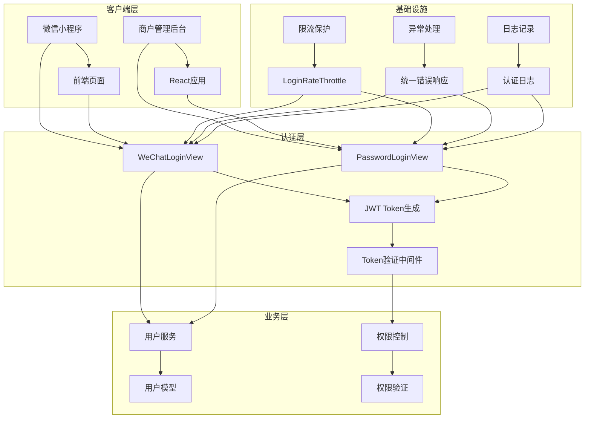
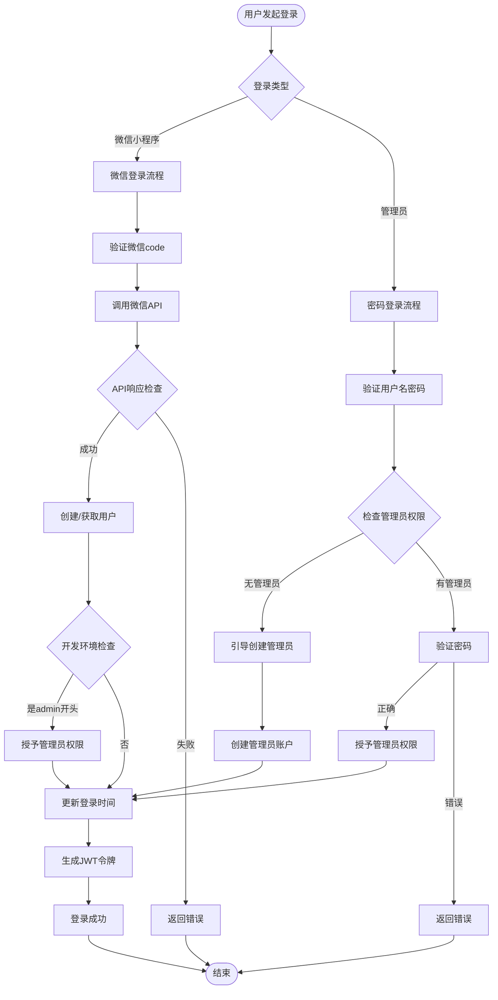
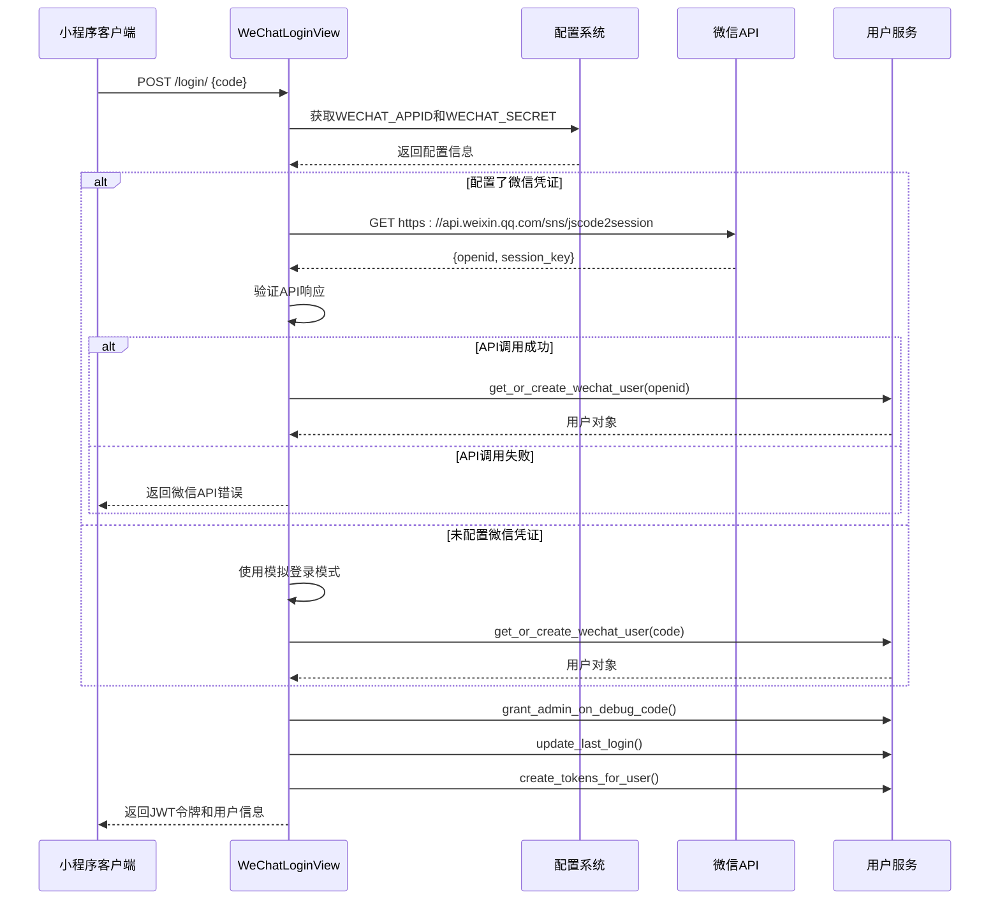
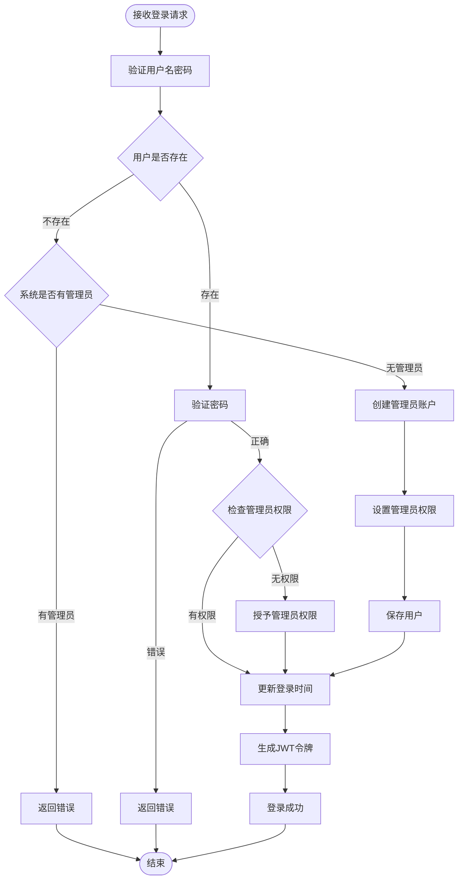
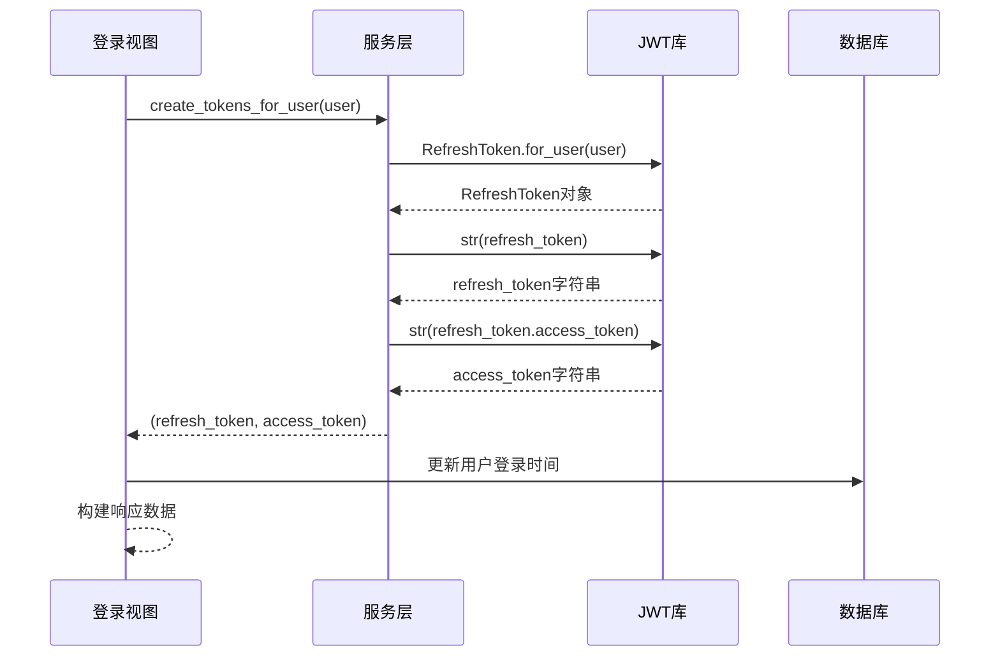
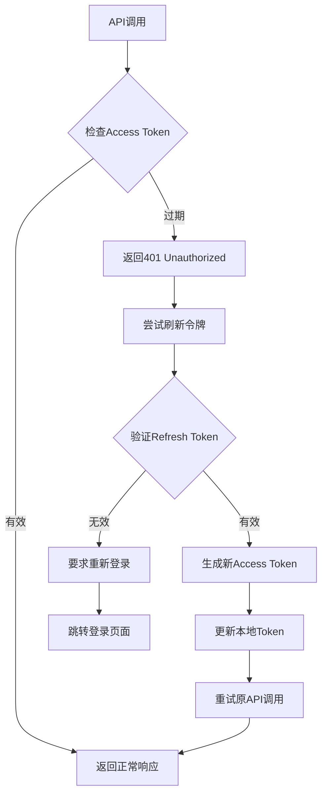
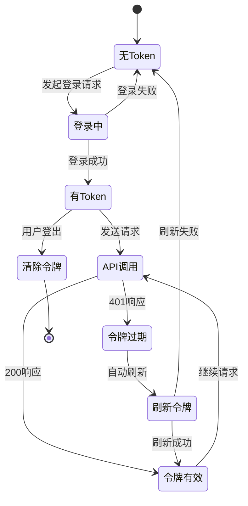

# 认证模块

<cite>
**本文档引用的文件**
- [backend/users/views.py](file://backend/users/views.py)
- [backend/users/services.py](file://backend/users/services.py)
- [backend/users/models.py](file://backend/users/models.py)
- [backend/users/serializers.py](file://backend/users/serializers.py)
- [backend/users/urls.py](file://backend/users/urls.py)
- [backend/common/throttles.py](file://backend/common/throttles.py)
- [backend/backend/settings/base.py](file://backend/backend/settings/base.py)
- [frontend/src/services/auth.ts](file://frontend/src/services/auth.ts)
- [frontend/src/utils/request.ts](file://frontend/src/utils/request.ts)
- [merchant/src/utils/auth.ts](file://merchant/src/utils/auth.ts)
- [backend/common/exceptions.py](file://backend/common/exceptions.py)
</cite>

## 目录
1. [简介](#简介)
2. [系统架构概览](#系统架构概览)
3. [核心认证机制](#核心认证机制)
4. [WeChatLoginView实现详解](#wechatloginview实现详解)
5. [PasswordLoginView实现详解](#passwordloginview实现详解)
6. [JWT令牌管理](#jwt令牌管理)
7. [安全机制](#安全机制)
8. [前端集成](#前端集成)
9. [常见问题与解决方案](#常见问题与解决方案)
10. [扩展与定制](#扩展与定制)

## 简介

家电商城系统的认证模块提供了两种主要的登录方式：微信小程序登录和管理员密码登录。该模块采用JWT（JSON Web Token）认证机制，确保用户身份的安全验证和会话管理。系统设计遵循RESTful API原则，提供清晰的接口规范和错误处理机制。

### 主要特性

- **双认证模式**：支持微信小程序OAuth登录和管理员用户名密码登录
- **JWT令牌体系**：提供短期访问令牌和长期刷新令牌
- **安全防护**：实施登录频率限制和异常检测
- **开发友好**：支持模拟登录和管理员快捷登录
- **多端兼容**：适配小程序和Web管理后台

## 系统架构概览



**图表来源**
- [backend/users/views.py](file://backend/users/views.py#L23-L233)
- [backend/common/throttles.py](file://backend/common/throttles.py#L11-L29)

## 核心认证机制

系统采用双重认证策略，针对不同类型的用户群体提供专门的登录方案：

### 认证流程图



**图表来源**
- [backend/users/views.py](file://backend/users/views.py#L49-L233)
- [backend/users/services.py](file://backend/users/services.py#L1-L55)

## WeChatLoginView实现详解

WeChatLoginView是微信小程序登录的核心实现，负责处理微信OAuth认证流程。

### 核心功能特性

1. **微信API集成**：调用官方微信登录接口获取用户标识
2. **模拟登录支持**：开发环境下使用code直接作为openid
3. **管理员快捷登录**：开发环境中code以"admin"开头时自动授予管理员权限
4. **异常处理**：完善的错误捕获和日志记录机制

### 实现细节

#### 微信API调用逻辑

系统根据配置决定使用真实微信API还是模拟登录：



**图表来源**
- [backend/users/views.py](file://backend/users/views.py#L49-L154)
- [backend/users/services.py](file://backend/users/services.py#L5-L16)

#### 关键实现要点

1. **配置检查**：通过`settings.WECHAT_APPID`和`settings.WECHAT_SECRET`判断是否启用真实微信API
2. **错误处理**：对网络异常、API错误和数据验证进行全面保护
3. **开发环境特殊处理**：code以"admin"开头时自动提升为管理员权限
4. **日志记录**：详细的认证过程日志便于调试和监控

**章节来源**
- [backend/users/views.py](file://backend/users/views.py#L23-L154)

## PasswordLoginView实现详解

PasswordLoginView专为管理员用户提供基于用户名密码的登录方式，支持系统引导和权限管理。

### 核心业务逻辑

#### 管理员登录流程



**图表来源**
- [backend/users/views.py](file://backend/users/views.py#L162-L233)

### 特殊功能

1. **系统引导机制**：当系统中没有管理员时，自动创建第一个管理员账户
2. **密码初始化**：支持首次登录时设置密码
3. **权限升级**：现有用户首次登录时可自动升级为管理员
4. **开发环境支持**：开发环境下支持快速创建管理员

**章节来源**
- [backend/users/views.py](file://backend/users/views.py#L162-L233)

## JWT令牌管理

系统采用JWT（JSON Web Token）作为认证令牌，提供安全可靠的会话管理机制。

### 令牌结构与生命周期

| 令牌类型 | 生命周期 | 用途 | 安全级别 |
|---------|---------|------|---------|
| Access Token | 7天 | API访问授权 | 中等 |
| Refresh Token | 30天 | 令牌刷新 | 高 |

### 令牌生成流程



**图表来源**
- [backend/users/services.py](file://backend/users/services.py#L22-L25)

### 令牌刷新机制

系统提供自动化的令牌刷新功能，确保用户体验的连续性：



**图表来源**
- [frontend/src/utils/request.ts](file://frontend/src/utils/request.ts#L39-L57)

**章节来源**
- [backend/users/services.py](file://backend/users/services.py#L22-L25)
- [backend/backend/settings/base.py](file://backend/backend/settings/base.py#L142-L146)

## 安全机制

### 登录频率限制

系统实施严格的登录频率限制，防止暴力破解攻击：

| 限制类型 | 速率限制 | 适用场景 |
|---------|---------|---------|
| 登录接口 | 5次/分钟 | 所有登录请求 |
| 匿名登录 | 5次/分钟 | 未认证用户的登录尝试 |
| 支付接口 | 10次/分钟 | 敏感支付操作 |

### 密码安全处理

1. **哈希存储**：所有密码均经过安全哈希算法存储
2. **不可逆加密**：密码只存储哈希值，不保存明文
3. **盐值保护**：使用Django内置的盐值机制增强安全性

### 敏感信息保护

1. **日志脱敏**：敏感信息在日志中进行脱敏处理
2. **传输加密**：所有认证通信均使用HTTPS协议
3. **会话隔离**：不同用户会话完全隔离

**章节来源**
- [backend/common/throttles.py](file://backend/common/throttles.py#L11-L29)
- [backend/users/models.py](file://backend/users/models.py#L8-L16)

## 前端集成

### 小程序登录流程

#### 前端实现步骤

1. **获取微信code**：调用小程序API获取临时登录凭证
2. **发送登录请求**：将code发送到后端认证接口
3. **保存令牌**：将返回的JWT令牌保存到本地存储
4. **设置请求头**：后续API请求携带Authorization头

#### 代码示例

```typescript
// 小程序登录服务
export const authService = {
  async login(): Promise<LoginResponse> {
    const { code } = await Taro.login()
    return http.post<LoginResponse>('/login/', { code }, false)
  }
}
```

### 管理后台登录

商户管理后台使用标准的表单登录方式：

```typescript
// 管理后台登录流程
async function adminLogin(username: string, password: string) {
  const response = await http.post('/admin/login/', {
    username,
    password
  })
  
  // 保存令牌到localStorage
  localStorage.setItem('admin_token', response.token)
  return response
}
```

### Token管理

前端实现了完整的Token生命周期管理：



**图表来源**
- [frontend/src/utils/request.ts](file://frontend/src/utils/request.ts#L39-L57)
- [merchant/src/utils/auth.ts](file://merchant/src/utils/auth.ts#L1-L14)

**章节来源**
- [frontend/src/services/auth.ts](file://frontend/src/services/auth.ts#L1-L22)
- [merchant/src/utils/auth.ts](file://merchant/src/utils/auth.ts#L1-L14)

## 常见问题与解决方案

### Token刷新失败

**问题描述**：访问令牌过期后，刷新令牌也无法获取新的访问令牌。

**可能原因**：
1. 刷新令牌已过期
2. 用户账户被禁用
3. 服务器时间不同步

**解决方案**：
1. 检查刷新令牌的有效期
2. 验证用户账户状态
3. 确保服务器时间同步

### 微信API调用错误

**问题描述**：调用微信登录API返回错误。

**常见错误码及解决**：
- `40029`: code无效 - 检查小程序是否正确调用wx.login()
- `40013`: appid无效 - 检查WECHAT_APPID配置
- `42001`: access_token超时 - 重新获取access_token

### 管理员权限授予失败

**问题描述**：开发环境中admin开头的code无法授予管理员权限。

**排查步骤**：
1. 确认DEBUG模式开启
2. 检查code格式是否正确
3. 验证用户对象状态

**章节来源**
- [backend/users/views.py](file://backend/users/views.py#L72-L118)
- [backend/users/services.py](file://backend/users/services.py#L8-L16)

## 扩展与定制

### 自定义认证逻辑

开发者可以通过以下方式扩展认证功能：

1. **自定义用户模型**：继承User模型添加额外字段
2. **扩展认证视图**：继承现有视图类添加业务逻辑
3. **自定义权限类**：创建专门的权限验证规则

### 第三方认证集成

系统架构支持集成其他认证提供商：

```python
# 示例：添加GitHub OAuth认证
class GitHubLoginView(APIView):
    def post(self, request):
        # 实现GitHub OAuth认证逻辑
        pass
```

### 监控与审计

建议添加以下监控指标：

1. **登录成功率**：统计各类登录方式的成功率
2. **异常登录检测**：监控异常IP和频率
3. **令牌使用统计**：跟踪令牌的生成和刷新情况

**章节来源**
- [backend/users/models.py](file://backend/users/models.py#L31-L71)
- [backend/users/views.py](file://backend/users/views.py#L1-L20)

## 总结

家电商城系统的认证模块设计精良，提供了完整的双认证体系和安全防护机制。通过JWT令牌管理、严格的频率限制和完善的错误处理，确保了系统的安全性和用户体验。开发者可以根据具体需求进行功能扩展和定制，同时需要注意保持安全最佳实践。