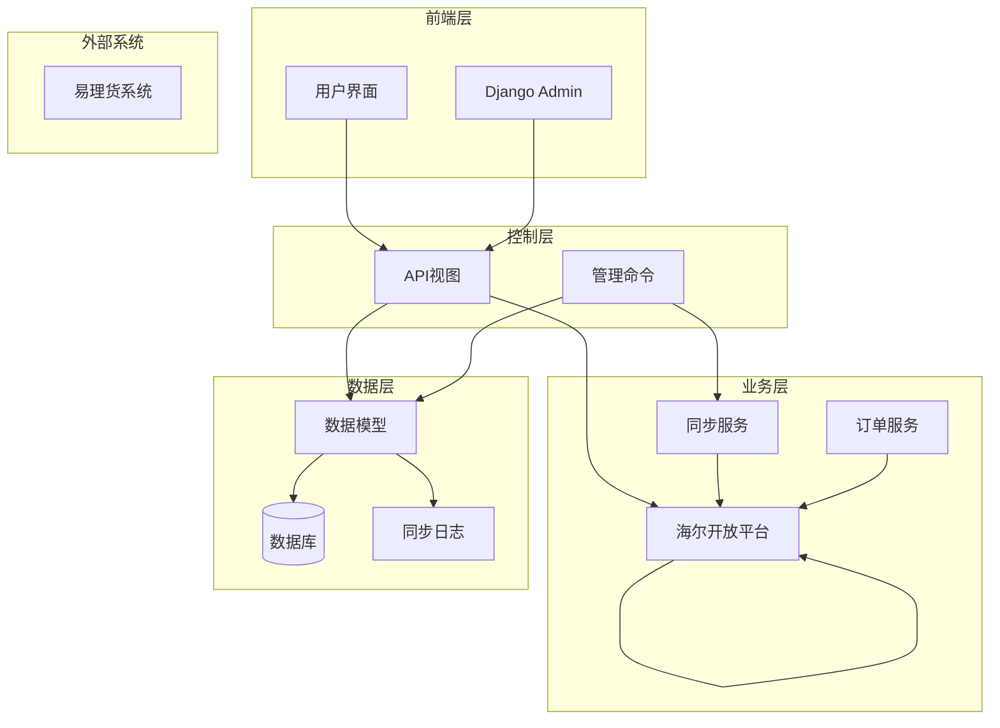
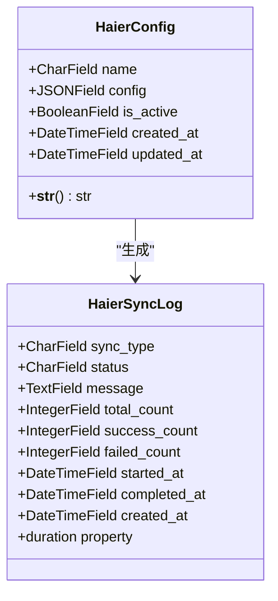
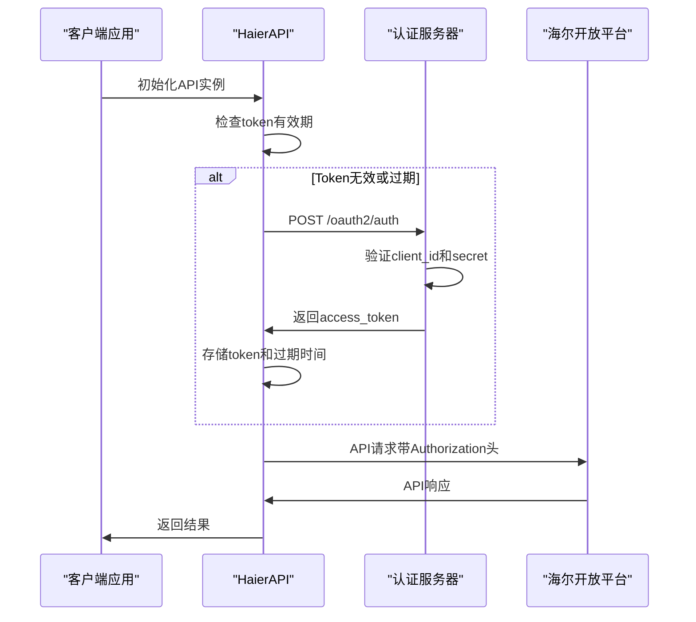
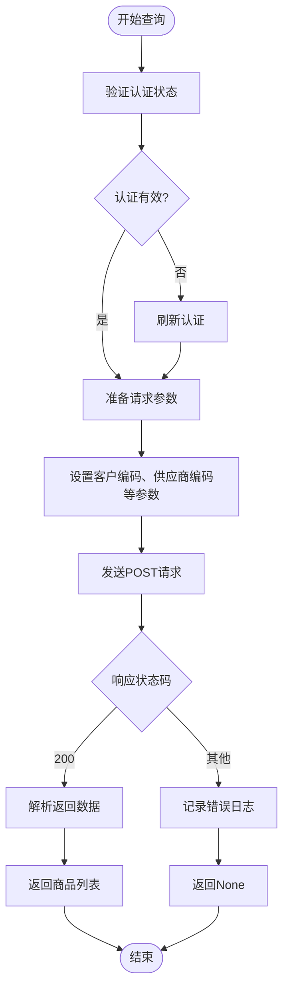
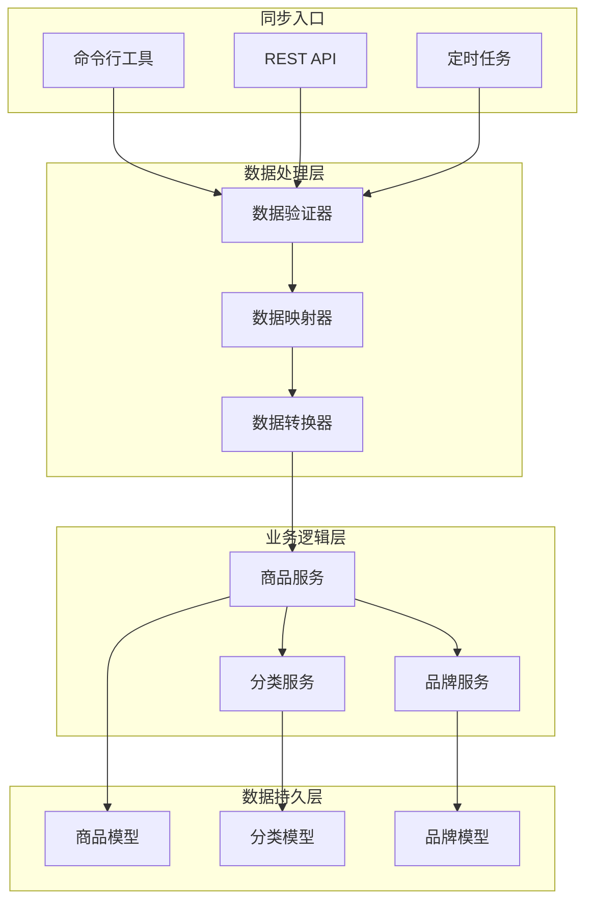
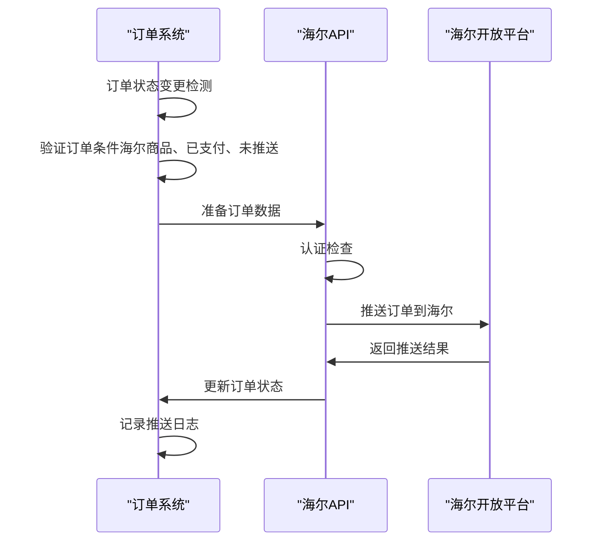
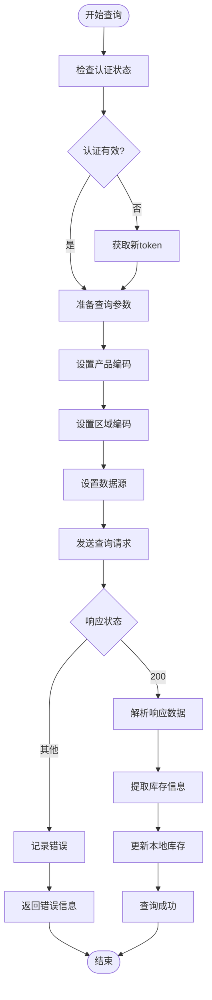
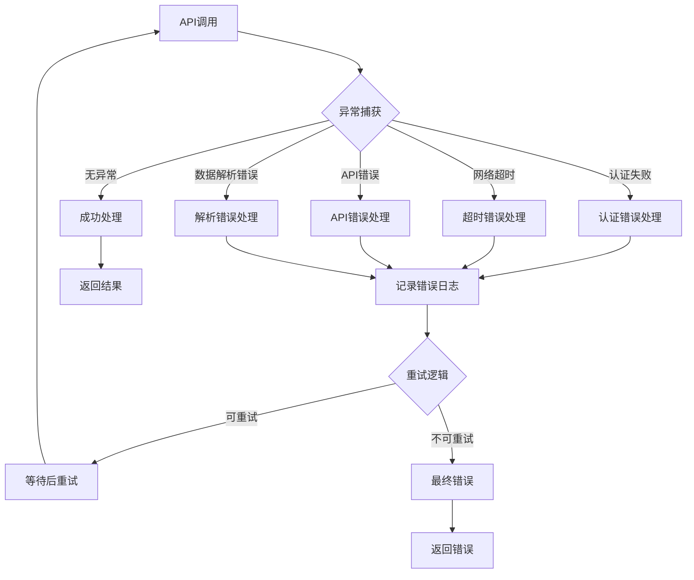
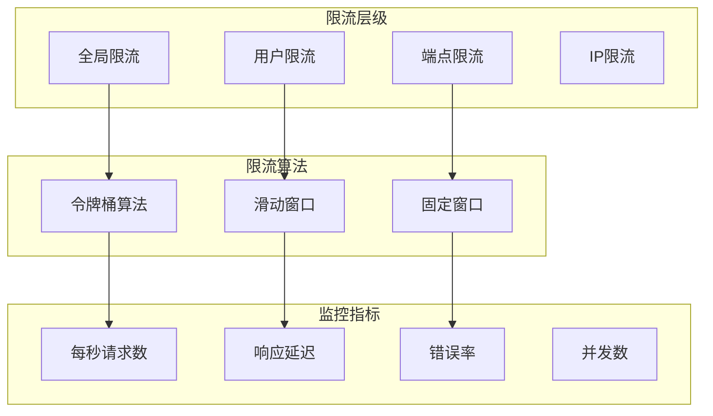

# 海尔API集成

<cite>
**本文档引用的文件**
- [haierapi.py](file://backend/integrations/haierapi.py)
- [models.py](file://backend/integrations/models.py)
- [admin.py](file://backend/integrations/admin.py)
- [serializers.py](file://backend/integrations/serializers.py)
- [sync_haier_products.py](file://backend/catalog/management/commands/sync_haier_products.py)
- [views.py](file://backend/integrations/views.py)
- [base.py](file://backend/backend/settings/base.py)
- [models.py](file://backend/catalog/models.py)
- [throttles.py](file://backend/common/throttles.py)
- [exceptions.py](file://backend/common/exceptions.py)
</cite>

## 目录
1. [简介](#简介)
2. [项目架构概览](#项目架构概览)
3. [HaierConfig模型详解](#haierconfig模型详解)
4. [认证机制](#认证机制)
5. [核心API功能](#核心api功能)
6. [商品同步流程](#商品同步流程)
7. [订单推送机制](#订单推送机制)
8. [库存查询功能](#库存查询功能)
9. [管理命令详解](#管理命令详解)
10. [错误处理与重试机制](#错误处理与重试机制)
11. [API限流与性能优化](#api限流与性能优化)
12. [最佳实践指南](#最佳实践指南)
13. [故障排除](#故障排除)

## 简介

海尔API集成模块是一个完整的电商平台与海尔开放平台对接的解决方案，提供了商品同步、价格查询、库存管理、订单推送等核心功能。该模块采用面向对象的设计模式，通过统一的API接口实现与海尔系统的无缝集成。

主要功能特性包括：
- OAuth2.0认证机制确保API调用安全性
- 商品数据实时同步与增量更新
- 多维度库存查询与实时库存管理
- 订单状态变更自动推送
- 完善的日志记录与错误处理机制
- 可配置的环境参数与多环境支持

## 项目架构概览

海尔API集成模块采用分层架构设计，清晰分离了业务逻辑、数据访问和用户界面层。



**图表来源**
- [haierapi.py](file://backend/integrations/haierapi.py#L10-L214)
- [views.py](file://backend/integrations/views.py#L104-L327)
- [models.py](file://backend/integrations/models.py#L4-L150)

## HaierConfig模型详解

HaierConfig模型是海尔API配置的核心数据结构，负责存储和管理所有与海尔API相关的认证信息和配置参数。

### 模型结构



**图表来源**
- [models.py](file://backend/integrations/models.py#L4-L150)

### 配置参数说明

| 参数名称 | 类型 | 必填 | 描述 | 默认值 |
|---------|------|------|------|--------|
| client_id | String | 是 | 海尔开放平台应用ID | - |
| client_secret | String | 是 | 海尔开放平台应用密钥 | - |
| token_url | String | 是 | OAuth2.0认证端点URL | https://openplat-test.haier.net/oauth2/auth |
| base_url | String | 是 | 海尔API基础URL | https://openplat-test.haier.net |
| customer_code | String | 是 | 客户八码标识 | - |
| send_to_code | String | 否 | 发货方编码 | customer_code |
| supplier_code | String | 否 | 供应商编码 | 1001 |
| password | String | 是 | 通用密码 | - |
| seller_password | String | 是 | 卖家密码 | - |

### Django Admin集成

HaierConfig模型通过Django Admin提供了完整的CRUD管理界面，支持配置的可视化管理和测试连接功能。

**章节来源**
- [models.py](file://backend/integrations/models.py#L4-L47)
- [admin.py](file://backend/integrations/admin.py#L5-L26)

## 认证机制

海尔API采用OAuth2.0客户端凭据模式进行身份认证，确保API调用的安全性和可靠性。

### 认证流程



**图表来源**
- [haierapi.py](file://backend/integrations/haierapi.py#L41-L64)
- [haierapi.py](file://backend/integrations/haierapi.py#L66-L72)

### 认证实现细节

认证机制的核心实现包括以下关键步骤：

1. **Token缓存策略**：API实例维护access_token和过期时间，避免重复认证
2. **自动刷新机制**：在token即将过期前自动重新获取新token
3. **错误处理**：认证失败时返回明确的错误信息和状态码
4. **超时控制**：设置合理的认证超时时间（10秒）

**章节来源**
- [haierapi.py](file://backend/integrations/haierapi.py#L41-L64)
- [haierapi.py](file://backend/integrations/haierapi.py#L66-L72)

## 核心API功能

### 商品查询接口

商品查询功能支持批量获取海尔可采商品信息，包括商品基本信息、价格信息和库存状态。



**图表来源**
- [haierapi.py](file://backend/integrations/haierapi.py#L74-L97)

### 价格查询接口

价格查询功能提供商品的实时价格信息，支持批量查询以提高效率。

### 库存查询接口

库存查询支持基于产品编码和区域编码的精确库存查询，返回可用库存数量和仓库信息。

### 物流查询接口

物流查询功能提供订单物流信息的实时查询，支持按订单号查询物流状态和配送信息。

**章节来源**
- [haierapi.py](file://backend/integrations/haierapi.py#L74-L166)

## 商品同步流程

商品同步是海尔API集成的核心功能，实现了从海尔系统到本地数据库的完整数据同步流程。

### 同步架构设计



**图表来源**
- [sync_haier_products.py](file://backend/catalog/management/commands/sync_haier_products.py#L13-L156)
- [models.py](file://backend/catalog/models.py#L118-L179)

### 数据同步步骤

1. **认证验证**：确保API认证有效
2. **数据获取**：从海尔API获取商品数据
3. **数据验证**：验证数据完整性和有效性
4. **数据映射**：将海尔数据映射到本地模型
5. **数据持久化**：保存到本地数据库
6. **状态更新**：更新同步状态和时间戳

### 商品同步命令

同步命令提供了丰富的参数选项，支持灵活的商品同步策略：

| 参数 | 类型 | 描述 | 示例 |
|------|------|------|------|
| --product-codes | 列表 | 指定要同步的产品编码 | GA0SZC00U,EC6001-HT3 |
| --category | 字符串 | 指定商品分类 | 家用空调 |
| --brand | 字符串 | 指定品牌名称 | 海尔 |
| --sync-prices | 布尔 | 同步价格信息 | true |
| --sync-stock | 布尔 | 同步库存信息 | true |
| --county-code | 字符串 | 区域编码 | 110101 |

**章节来源**
- [sync_haier_products.py](file://backend/catalog/management/commands/sync_haier_products.py#L16-L48)
- [sync_haier_products.py](file://backend/catalog/management/commands/sync_haier_products.py#L50-L156)

## 订单推送机制

当订单状态发生变更时，系统会自动将订单信息推送到海尔系统，确保双方数据的一致性。

### 订单推送流程



**图表来源**
- [views.py](file://backend/orders/views.py#L393-L489)

### 订单数据准备

订单推送需要准备完整的订单信息，包括商品明细、收货信息、价格信息等：

| 字段名称 | 描述 | 示例值 |
|----------|------|--------|
| sourceSystem | 来源系统标识 | YOUR_SYSTEM |
| shopName | 店铺名称 | XX旗舰店 |
| sellerCode | 客户八码 | 8800633175 |
| consigneeName | 收货人姓名 | 张三 |
| consigneeMobile | 收货人电话 | 13800138000 |
| onlineNo | 平台订单号 | 1764050087579528 |
| soId | 子订单号 | 1764050087579528-2 |
| itemList | 商品明细列表 | [{productCode, itemQty, retailPrice}] |

**章节来源**
- [views.py](file://backend/orders/views.py#L86-L128)

## 库存查询功能

库存查询功能提供了实时的库存信息查询能力，支持基于产品编码和区域编码的精确查询。

### 库存查询实现



**图表来源**
- [haierapi.py](file://backend/integrations/haierapi.py#L121-L142)

### 库存信息字段

| 字段名称 | 类型 | 描述 |
|----------|------|------|
| stock | Integer | 可用库存数量 |
| secCode | String | 库位编码 |
| warehouseGrade | String | 仓库等级（0本级仓/1上级仓） |
| timelinessData | Dict | 实时性数据 |

**章节来源**
- [haierapi.py](file://backend/integrations/haierapi.py#L121-L142)

## 管理命令详解

### sync_haier_products命令

sync_haier_products是专门用于同步海尔商品数据的管理命令，提供了完整的商品同步功能。

#### 命令参数

```bash
# 基本用法
python manage.py sync_haier_products

# 指定产品编码
python manage.py sync_haier_products --product-codes GA0SZC00U EC6001-HT3

# 指定分类和品牌
python manage.py sync_haier_products --category "家用空调" --brand "海尔"

# 同步价格和库存
python manage.py sync_haier_products --sync-prices --sync-stock --county-code 110101
```

#### 执行流程

1. **初始化API**：从Django设置加载配置
2. **认证测试**：验证API认证有效性
3. **分类和品牌查找**：获取指定的分类和品牌对象
4. **商品查询**：从海尔API获取商品数据
5. **逐个同步**：处理每个商品的同步逻辑
6. **价格同步**：可选的价格信息同步
7. **库存同步**：可选的库存信息同步
8. **结果统计**：输出同步统计信息

**章节来源**
- [sync_haier_products.py](file://backend/catalog/management/commands/sync_haier_products.py#L13-L156)

## 错误处理与重试机制

### 异常处理策略

海尔API集成模块实现了完善的异常处理机制，确保系统在各种异常情况下的稳定性。



**图表来源**
- [haierapi.py](file://backend/integrations/haierapi.py#L41-L64)
- [exceptions.py](file://backend/common/exceptions.py#L1-L249)

### 错误类型定义

| 错误类型 | HTTP状态码 | 错误代码 | 描述 | 处理策略 |
|----------|------------|----------|------|----------|
| 认证失败 | 401 | AUTH_FAILED | API认证失败 | 自动重试认证 |
| 请求超时 | 408 | REQUEST_TIMEOUT | API请求超时 | 指数退避重试 |
| 限流错误 | 429 | RATE_LIMITED | 请求过于频繁 | 等待后重试 |
| 服务器错误 | 500 | SERVER_ERROR | 服务器内部错误 | 指数退避重试 |
| 数据验证错误 | 400 | VALIDATION_ERROR | 数据格式错误 | 不重试，记录错误 |

### 重试机制实现

1. **指数退避算法**：每次重试间隔逐渐增加
2. **最大重试次数**：防止无限重试导致资源浪费
3. **熔断器模式**：连续失败达到阈值时暂停调用
4. **超时控制**：设置合理的请求超时时间

**章节来源**
- [exceptions.py](file://backend/common/exceptions.py#L1-L249)

## API限流与性能优化

### 限流策略

系统实现了多层次的限流机制，保护API资源并确保服务质量。



**图表来源**
- [throttles.py](file://backend/common/throttles.py#L1-L78)

### 性能优化措施

1. **连接池管理**：复用HTTP连接减少建立连接的开销
2. **异步处理**：对于非关键路径的操作采用异步执行
3. **缓存策略**：对频繁查询的数据实施缓存机制
4. **批量操作**：支持批量API调用减少网络往返
5. **压缩传输**：启用GZIP压缩减少传输数据量

### 监控与告警

| 监控指标 | 告警阈值 | 处理动作 |
|----------|----------|----------|
| API响应时间 | >2秒 | 记录日志，通知运维 |
| 错误率 | >5% | 自动降级，通知开发 |
| 连接池使用率 | >80% | 扩容连接池 |
| 内存使用率 | >90% | 清理缓存，重启服务 |

**章节来源**
- [throttles.py](file://backend/common/throttles.py#L1-L78)

## 最佳实践指南

### 开发最佳实践

1. **配置管理**
   - 使用环境变量管理敏感配置
   - 实施配置加密存储
   - 提供多环境配置模板

2. **错误处理**
   - 实现统一的异常处理机制
   - 提供详细的错误日志信息
   - 支持错误恢复和重试

3. **性能优化**
   - 合理设置超时时间和重试策略
   - 实施适当的缓存机制
   - 使用连接池管理HTTP连接

4. **安全考虑**
   - 定期轮换API密钥
   - 实施HTTPS加密传输
   - 限制API访问权限

### 生产环境部署

1. **环境隔离**：开发、测试、生产环境严格分离
2. **监控告警**：建立完善的监控和告警体系
3. **备份恢复**：定期备份配置和重要数据
4. **版本管理**：实施严格的版本控制和发布流程

### 调试和诊断

1. **日志级别**：合理设置不同环境的日志级别
2. **调试模式**：提供详细的调试信息但不影响生产性能
3. **健康检查**：定期检查API连接状态和系统健康度
4. **性能分析**：监控API调用性能和资源使用情况

## 故障排除

### 常见问题及解决方案

#### 认证失败

**症状**：API调用返回401 Unauthorized错误
**原因**：client_id或client_secret配置错误
**解决**：检查配置文件中的认证信息，确认密钥有效性

#### 网络超时

**症状**：API调用长时间无响应
**原因**：网络连接不稳定或API服务器负载过高
**解决**：调整超时设置，实施重试机制

#### 数据同步失败

**症状**：商品数据未能正确同步
**原因**：海尔API返回数据格式变化或网络中断
**解决**：检查API响应格式，实施数据验证机制

#### 库存查询异常

**症状**：库存查询返回空数据或错误信息
**原因**：产品编码错误或区域编码不匹配
**解决**：验证输入参数的有效性，检查海尔系统配置

### 调试工具和技巧

1. **日志分析**：通过详细日志定位问题根源
2. **API测试**：使用Postman等工具测试API接口
3. **断点调试**：在开发环境中设置断点跟踪执行流程
4. **性能分析**：使用性能分析工具识别瓶颈

### 维护和升级

1. **定期检查**：定期检查API连接状态和配置有效性
2. **版本兼容**：关注海尔API版本更新，及时适配新版本
3. **容量规划**：根据业务增长预测系统容量需求
4. **安全更新**：及时应用安全补丁和更新

**章节来源**
- [views.py](file://backend/integrations/views.py#L60-L101)
- [models.py](file://backend/integrations/models.py#L50-L150)