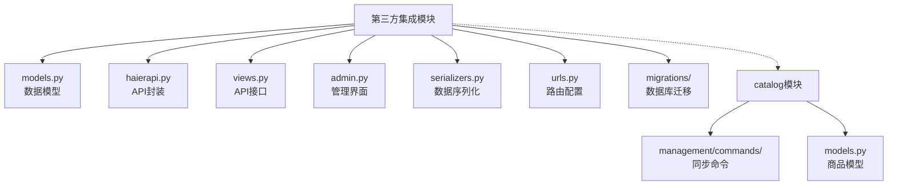
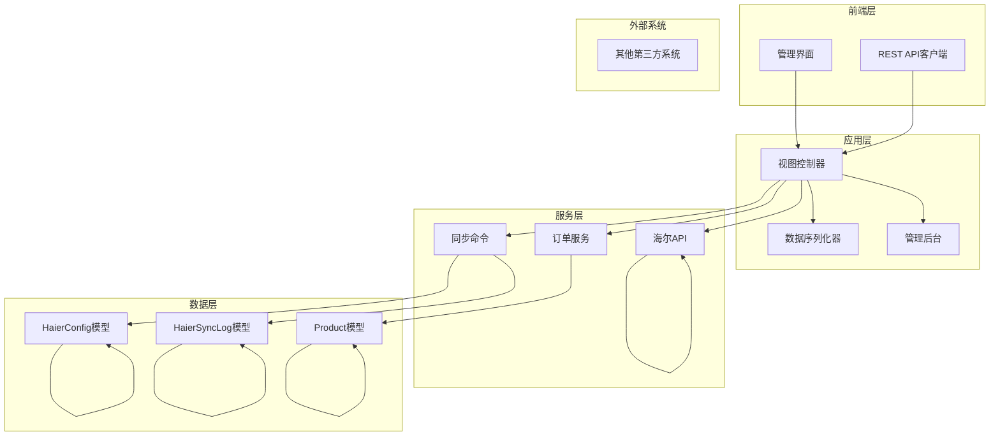
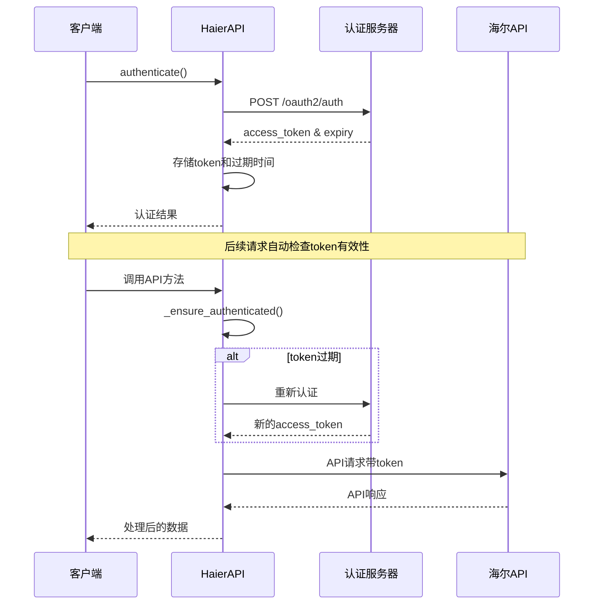
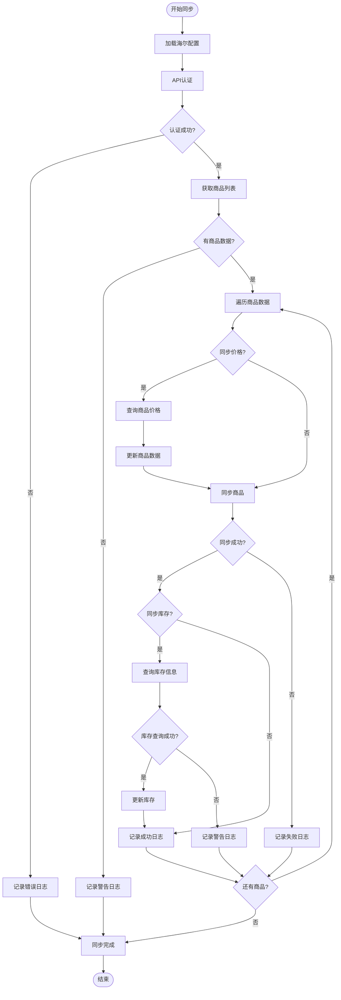

# 第三方集成模块

<cite>
**本文档引用的文件**
- [models.py](file://backend/integrations/models.py)
- [haierapi.py](file://backend/integrations/haierapi.py)
- [views.py](file://backend/integrations/views.py)
- [admin.py](file://backend/integrations/admin.py)
- [serializers.py](file://backend/integrations/serializers.py)
- [urls.py](file://backend/integrations/urls.py)
- [sync_haier_products.py](file://backend/catalog/management/commands/sync_haier_products.py)
- [0001_initial.py](file://backend/integrations/migrations/0001_initial.py)
- [0002_haierconfig_haiersynclog_delete_supplierconfig_and_more.py](file://backend/integrations/migrations/0002_haierconfig_haiersynclog_delete_supplierconfig_and_more.py)
- [models.py](file://backend/catalog/models.py)
- [services.py](file://backend/orders/services.py)
</cite>

## 目录
1. [简介](#简介)
2. [项目结构](#项目结构)
3. [核心组件](#核心组件)
4. [架构概览](#架构概览)
5. [详细组件分析](#详细组件分析)
6. [API集成流程](#api集成流程)
7. [管理界面](#管理界面)
8. [错误处理与重试机制](#错误处理与重试机制)
9. [常见问题与解决方案](#常见问题与解决方案)
10. [最佳实践](#最佳实践)
11. [总结](#总结)

## 简介

第三方集成模块是一个专门设计用于与海尔等外部系统进行数据交换和业务协同的核心组件。该模块提供了完整的API封装、配置管理和同步机制，支持商品数据同步、订单处理、库存查询和物流跟踪等功能。

### 主要特性

- **多系统集成**：支持与海尔API系统的无缝对接
- **配置管理**：提供灵活的API配置和管理功能
- **数据同步**：自动化的商品、价格、库存数据同步
- **实时监控**：详细的同步日志和状态跟踪
- **错误处理**：完善的异常捕获和重试机制
- **权限控制**：基于角色的访问控制和操作审计

## 项目结构

第三方集成模块采用模块化设计，主要包含以下核心文件：



**图表来源**
- [models.py](file://backend/integrations/models.py#L1-L150)
- [haierapi.py](file://backend/integrations/haierapi.py#L1-L214)
- [views.py](file://backend/integrations/views.py#L1-L327)

**章节来源**
- [models.py](file://backend/integrations/models.py#L1-L150)
- [haierapi.py](file://backend/integrations/haierapi.py#L1-L214)
- [views.py](file://backend/integrations/views.py#L1-L327)

## 核心组件

### HaierConfig模型 - API配置管理

HaierConfig模型负责存储和管理海尔API的认证信息和配置参数，是整个集成系统的基础。

#### 关键属性

| 属性名 | 类型 | 描述 | 默认值 |
|--------|------|------|--------|
| name | CharField | 配置名称标识 | 'haier' |
| config | JSONField | 配置信息（JSON格式） | - |
| is_active | BooleanField | 是否启用配置 | True |
| created_at | DateTimeField | 创建时间 | 自动设置 |
| updated_at | DateTimeField | 更新时间 | 自动更新 |

#### 配置结构示例

```python
{
    "client_id": "your_client_id",
    "client_secret": "your_client_secret", 
    "token_url": "https://openplat-test.haier.net/oauth2/auth",
    "base_url": "https://openplat-test.haier.net",
    "customer_code": "8800633175",
    "send_to_code": "8800633175",
    "supplier_code": "1001",
    "password": "your_password",
    "seller_password": "your_password"
}
```

### HaierSyncLog模型 - 同步日志管理

HaierSyncLog模型记录所有海尔API数据同步操作的详细信息，提供完整的审计和故障排查功能。

#### 同步类型枚举

| 类型 | 显示名称 | 描述 |
|------|----------|------|
| products | 商品同步 | 商品信息同步 |
| prices | 价格同步 | 商品价格同步 |
| stock | 库存同步 | 库存信息同步 |
| order | 订单推送 | 订单数据推送 |
| logistics | 物流查询 | 物流信息查询 |
| manual | 手动操作 | 手动触发的操作 |

#### 状态枚举

| 状态 | 显示名称 | 描述 |
|------|----------|------|
| pending | 待处理 | 等待执行 |
| processing | 处理中 | 正在处理 |
| success | 成功 | 操作成功 |
| failed | 失败 | 操作失败 |
| partial | 部分成功 | 部分操作成功 |

**章节来源**
- [models.py](file://backend/integrations/models.py#L4-L150)

## 架构概览

第三方集成模块采用分层架构设计，确保系统的可扩展性和维护性：



**图表来源**
- [views.py](file://backend/integrations/views.py#L1-L327)
- [haierapi.py](file://backend/integrations/haierapi.py#L1-L214)
- [models.py](file://backend/integrations/models.py#L1-L150)

## 详细组件分析

### HaierAPI类 - API封装核心

HaierAPI类是整个集成模块的核心，提供了对海尔API的完整封装和管理。

#### 认证机制



**图表来源**
- [haierapi.py](file://backend/integrations/haierapi.py#L41-L69)

#### 主要API方法

| 方法名 | 功能 | 参数 | 返回值 |
|--------|------|------|--------|
| get_products | 查询可采商品 | product_codes: List[str] | List[Dict] |
| get_product_prices | 查询商品价格 | product_codes: List[str] | List[Dict] |
| check_stock | 查询库存 | product_code: str, county_code: str | Dict |
| get_logistics_info | 查询物流信息 | order_code: str, 其他可选参数 | Dict |
| get_account_balance | 查询账户余额 | - | Dict |

#### 认证流程详解

认证过程包含以下关键步骤：

1. **参数准备**：构建认证请求体，包含client_id、client_secret和grant_type
2. **请求发送**：向认证服务器发送POST请求，超时时间为10秒
3. **响应解析**：提取access_token、token_type和expires_in
4. **过期时间计算**：考虑网络延迟，设置提前600秒刷新的策略
5. **状态更新**：保存token信息和过期时间戳

**章节来源**
- [haierapi.py](file://backend/integrations/haierapi.py#L10-L214)

### 视图控制器 - API接口层

视图控制器提供了RESTful API接口，支持管理员通过Web界面或API客户端进行操作。

#### 配置管理接口

| 端点 | 方法 | 功能 | 权限 |
|------|------|------|------|
| /api/haier/config/ | GET | 获取配置列表 | 管理员 |
| /api/haier/config/ | POST | 创建新配置 | 管理员 |
| /api/haier/config/{id}/ | GET | 获取配置详情 | 管理员 |
| /api/haier/config/{id}/ | PUT | 更新配置 | 管理员 |
| /api/haier/config/{id}/test/ | POST | 测试连接 | 管理员 |

#### API操作接口

| 端点 | 方法 | 功能 | 参数 |
|------|------|------|------|
| /api/haier/products/ | GET | 查询商品 | product_codes |
| /api/haier/prices/ | GET | 查询价格 | product_codes |
| /api/haier/stock/ | GET | 查询库存 | product_code, county_code |
| /api/haier/balance/ | GET | 查询余额 | - |
| /api/haier/logistics/ | GET | 查询物流 | order_code |
| /api/haier/logs/ | GET | 获取日志 | sync_type, status, limit |

**章节来源**
- [views.py](file://backend/integrations/views.py#L36-L327)

### 序列化器 - 数据转换层

序列化器负责将模型数据转换为API响应格式，并提供数据验证功能。

#### HaierConfigSerializer

- **配置验证**：确保必需字段存在且格式正确
- **字段过滤**：只暴露必要的配置信息
- **只读保护**：防止意外修改创建时间和更新时间

#### HaierSyncLogSerializer

- **显示字段**：提供人类可读的状态和类型显示
- **计算字段**：自动生成持续时间
- **数据保护**：只读字段防止篡改

**章节来源**
- [serializers.py](file://backend/integrations/serializers.py#L1-L67)

## API集成流程

### 商品同步流程



**图表来源**
- [sync_haier_products.py](file://backend/catalog/management/commands/sync_haier_products.py#L50-L156)

### 订单推送流程

订单推送涉及多个系统的协调工作：

1. **订单验证**：检查订单状态和商品可用性
2. **库存确认**：调用海尔API确认库存充足
3. **订单转换**：将本地订单格式转换为海尔格式
4. **批量推送**：支持批量订单推送以提高效率
5. **状态跟踪**：实时跟踪订单推送状态

### 物流查询流程

物流查询提供了完整的配送跟踪功能：

1. **订单关联**：根据订单号查询对应的物流信息
2. **多渠道查询**：支持多种物流渠道的信息获取
3. **状态解析**：解析复杂的物流状态信息
4. **异常处理**：处理物流信息缺失或格式异常的情况

**章节来源**
- [sync_haier_products.py](file://backend/catalog/management/commands/sync_haier_products.py#L1-L156)
- [services.py](file://backend/orders/services.py#L157-L216)

## 管理界面

### 配置管理界面

管理员可以通过Django Admin界面管理海尔API配置：

#### HaierConfigAdmin

- **列表显示**：配置名称、启用状态、创建时间
- **筛选功能**：按启用状态和创建时间筛选
- **搜索功能**：按配置名称搜索
- **只读字段**：保护创建时间和更新时间不被修改

#### HaierSyncLogAdmin

- **日志详情**：显示同步类型、状态、统计信息
- **时间轴**：按创建时间排序，支持时间范围筛选
- **搜索功能**：按日志消息内容搜索
- **权限控制**：禁止手动添加日志，只能通过系统生成

### API测试功能

系统提供了内置的API测试功能，帮助管理员验证配置的有效性：

```python
# 测试认证连接
@api.test()
def test_connection(self):
    config_obj = self.get_object()
    api = HaierAPI(config_obj.config)
    success = api.authenticate()
    return {"success": success, "message": "连接测试"}
```

**章节来源**
- [admin.py](file://backend/integrations/admin.py#L1-L26)

## 错误处理与重试机制

### 认证错误处理

认证过程包含多层次的错误处理：

1. **HTTP状态码检查**：验证API响应状态码
2. **Token提取验证**：确保成功提取access_token
3. **异常捕获**：捕获网络和解析异常
4. **日志记录**：详细记录错误信息便于排查

### API调用错误处理

每个API方法都实现了完善的错误处理：

```python
# 示例：商品查询的错误处理
def get_products(self, product_codes=None):
    try:
        if not self._ensure_authenticated():
            return None
        
        # API调用逻辑
        res = requests.post(url, headers=headers, data=json.dumps(body), timeout=30)
        
        if res.status_code != 200:
            logger.error(f'haier products failed: {res.status_code} {res.text}')
            return None
            
        return res.json()
        
    except Exception as e:
        logger.error(f'haier products error: {str(e)}')
        return None
```

### 重试机制

虽然当前实现没有显式的重试循环，但系统通过以下方式提供重试能力：

1. **自动认证刷新**：token过期时自动重新认证
2. **超时控制**：设置合理的超时时间避免长时间等待
3. **幂等性设计**：API调用设计为幂等操作，支持安全重试

### 日志记录策略

系统实现了全面的日志记录：

- **错误级别**：记录认证失败、API调用失败等严重错误
- **调试级别**：记录详细的API请求和响应信息
- **性能监控**：记录API调用耗时和成功率

**章节来源**
- [haierapi.py](file://backend/integrations/haierapi.py#L41-L69)
- [views.py](file://backend/integrations/views.py#L81-L101)

## 常见问题与解决方案

### API认证失败

**问题症状**：
- 认证接口返回400错误
- access_token获取失败
- token验证失败

**可能原因**：
1. **配置错误**：client_id或client_secret不正确
2. **网络问题**：无法访问认证服务器
3. **权限问题**：API密钥权限不足
4. **时间同步**：服务器时间与认证服务器时间不同步

**解决方案**：
1. **验证配置**：检查HaierConfig中的各项参数
2. **网络诊断**：测试token_url的可达性
3. **权限检查**：确认API密钥具有必要的权限
4. **时间校准**：确保服务器时间准确

### 数据同步延迟

**问题症状**：
- 商品数据更新缓慢
- 价格同步不及时
- 库存信息滞后

**可能原因**：
1. **API限制**：海尔API的调用频率限制
2. **网络延迟**：网络传输时间过长
3. **并发冲突**：多个同步任务竞争资源
4. **数据量过大**：一次性同步过多数据

**解决方案**：
1. **优化配置**：合理设置同步频率和批次大小
2. **异步处理**：使用后台任务队列处理大量数据
3. **缓存策略**：实施适当的缓存机制减少API调用
4. **监控告警**：建立同步状态监控和告警机制

### 库存查询失败

**问题症状**：
- 库存查询返回空数据
- 库存数量不准确
- 查询超时

**可能原因**：
1. **参数错误**：product_code或county_code不正确
2. **权限问题**：缺少库存查询权限
3. **数据缺失**：海尔系统中无对应库存数据
4. **网络问题**：API调用超时或中断

**解决方案**：
1. **参数验证**：确保输入参数格式正确
2. **权限确认**：检查API权限配置
3. **数据检查**：验证海尔系统中的库存数据
4. **重试机制**：实现指数退避重试策略

### 同步日志异常

**问题症状**：
- 日志记录失败
- 日志信息不完整
- 日志查询困难

**解决方案**：
1. **权限检查**：确保日志写入权限
2. **数据库优化**：定期清理历史日志
3. **索引优化**：为常用查询字段添加索引
4. **日志轮转**：实施日志文件轮转策略

**章节来源**
- [views.py](file://backend/integrations/views.py#L81-L101)
- [haierapi.py](file://backend/integrations/haierapi.py#L41-L69)

## 最佳实践

### 配置管理最佳实践

1. **环境分离**：开发、测试、生产环境使用不同的配置
2. **敏感信息保护**：使用环境变量存储敏感配置
3. **配置验证**：在保存前验证配置的完整性
4. **版本控制**：记录配置变更历史

### API调用最佳实践

1. **超时设置**：为所有API调用设置合理的超时时间
2. **错误处理**：实现完善的异常捕获和处理机制
3. **日志记录**：记录详细的请求和响应信息
4. **性能监控**：监控API调用的响应时间和成功率

### 数据同步最佳实践

1. **增量同步**：只同步发生变化的数据
2. **批量处理**：合理设置批量大小提高效率
3. **冲突解决**：制定明确的数据冲突解决策略
4. **回滚机制**：提供数据同步失败时的回滚方案

### 安全最佳实践

1. **认证加密**：确保所有API通信使用HTTPS
2. **权限控制**：实施最小权限原则
3. **审计日志**：记录所有重要操作的审计日志
4. **定期审查**：定期审查和更新安全配置

### 监控和运维最佳实践

1. **健康检查**：定期检查API连接状态
2. **性能监控**：监控系统性能指标
3. **告警机制**：建立及时的问题告警
4. **备份策略**：定期备份关键配置和数据

## 总结

第三方集成模块为系统提供了完整的海尔API集成能力，通过精心设计的架构和完善的错误处理机制，确保了系统的稳定性和可靠性。

### 核心优势

1. **模块化设计**：清晰的职责分离和良好的可扩展性
2. **完善的错误处理**：多层次的异常捕获和恢复机制
3. **详细的日志记录**：完整的审计轨迹和故障排查支持
4. **灵活的配置管理**：支持多环境和动态配置更新
5. **RESTful API设计**：符合现代Web标准的接口设计

### 技术特色

- **智能认证管理**：自动化的token管理和刷新机制
- **异步处理能力**：支持大规模数据同步的异步处理
- **幂等性保证**：确保API调用的安全重试能力
- **性能优化**：合理的超时设置和资源管理

### 发展方向

1. **微服务架构**：考虑向微服务架构演进
2. **容器化部署**：支持Docker和Kubernetes部署
3. **云原生特性**：集成更多云原生工具和特性
4. **AI辅助优化**：利用机器学习优化同步策略

该模块为企业的数字化转型提供了坚实的技术基础，通过标准化的API集成模式，降低了与第三方系统对接的复杂度，提高了系统的整体竞争力。