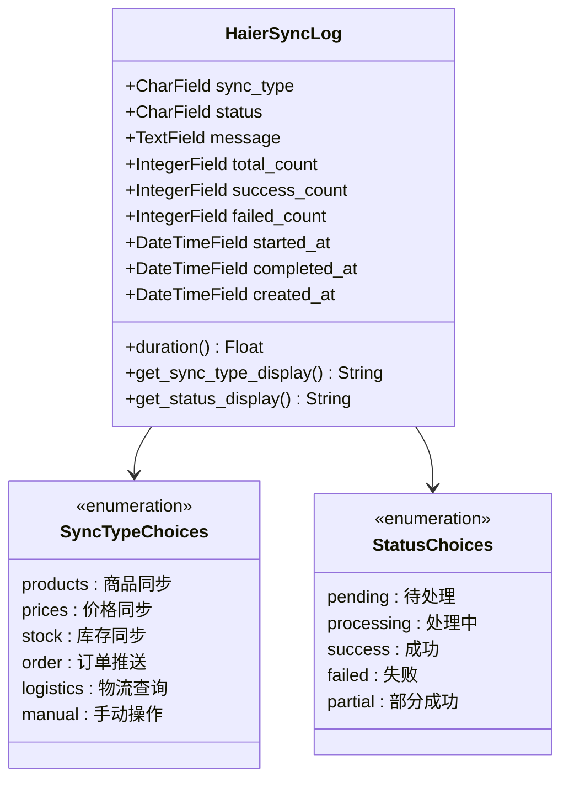
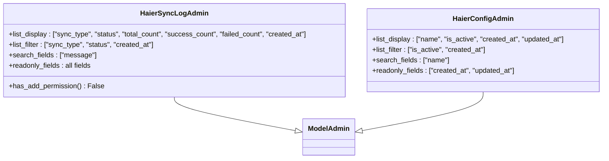
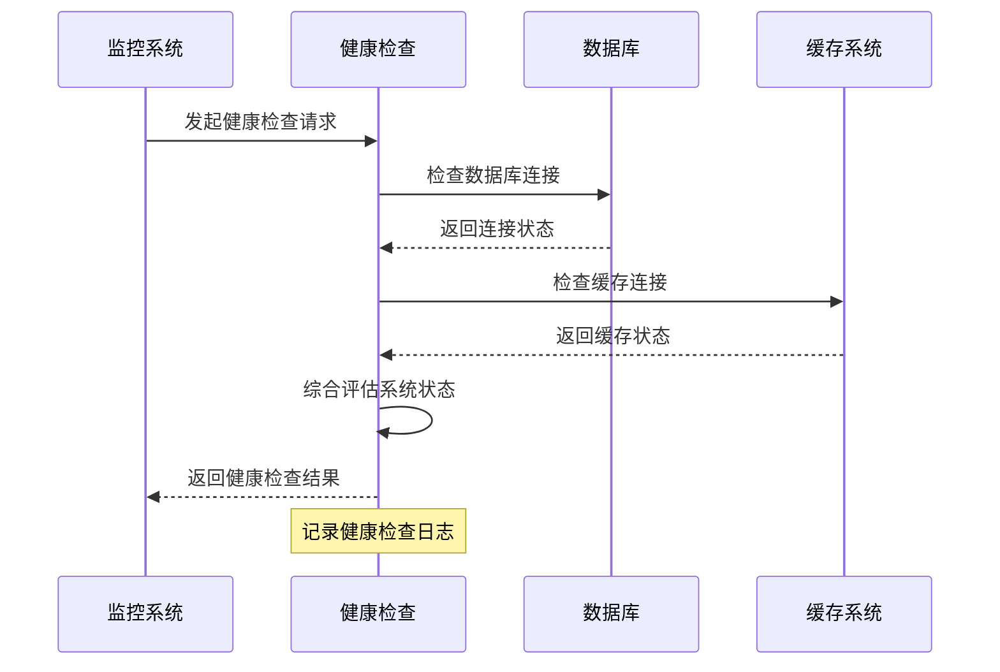
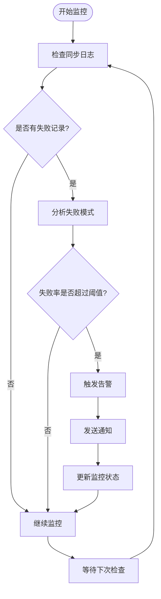
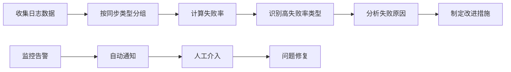
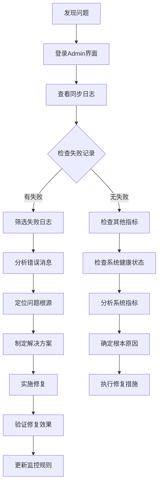

# 集成日志与监控

<cite>
**本文档引用的文件**
- [models.py](file://backend/integrations/models.py)
- [admin.py](file://backend/integrations/admin.py)
- [serializers.py](file://backend/integrations/serializers.py)
- [views.py](file://backend/integrations/views.py)
- [monitor_urls.py](file://backend/common/monitor_urls.py)
- [health.py](file://backend/common/health.py)
- [logging_config.py](file://backend/common/logging_config.py)
- [sync_haier_products.py](file://backend/catalog/management/commands/sync_haier_products.py)
- [0002_haierconfig_haiersynclog_delete_supplierconfig_and_more.py](file://backend/integrations/migrations/0002_haierconfig_haiersynclog_delete_supplierconfig_and_more.py)
</cite>

## 目录
1. [概述](#概述)
2. [HaierSyncLog模型设计](#haiersynclog模型设计)
3. [Django Admin界面管理](#django-admin界面管理)
4. [系统监控集成](#系统监控集成)
5. [日志数据分析与应用](#日志数据分析与应用)
6. [故障诊断流程](#故障诊断流程)
7. [性能优化建议](#性能优化建议)
8. [最佳实践](#最佳实践)

## 概述

本系统实现了完整的海尔API集成日志管理系统，通过HaierSyncLog模型记录所有同步操作的详细信息，为管理员提供全面的监控和故障排查能力。系统集成了Django Admin界面、健康检查机制和实时监控功能，确保系统的稳定性和可维护性。

### 核心特性

- **全面的日志记录**：记录同步类型、状态、统计数据和时间信息
- **直观的Admin界面**：提供便捷的日志查看和筛选功能
- **智能监控集成**：与健康检查系统无缝对接
- **多维度数据分析**：支持按类型、状态、时间等多种维度分析
- **自动化故障检测**：自动识别异常模式和性能瓶颈

## HaierSyncLog模型设计

### 数据结构设计

HaierSyncLog模型是整个日志系统的核心，采用精心设计的数据结构来记录所有同步操作的关键信息。



**图表来源**
- [models.py](file://backend/integrations/models.py#L50-L150)

### 关键字段详解

#### 同步类型字段 (sync_type)
系统支持六种主要的同步类型，每种类型对应不同的业务场景：

| 同步类型 | 描述 | 用途 |
|---------|------|------|
| products | 商品同步 | 从海尔API获取商品基本信息 |
| prices | 价格同步 | 更新商品价格信息 |
| stock | 库存同步 | 同步商品库存状态 |
| order | 订单推送 | 将订单信息推送到海尔系统 |
| logistics | 物流查询 | 查询订单物流状态 |
| manual | 手动操作 | 管理员手动触发的操作 |

#### 状态字段 (status)
定义了同步操作的完整生命周期状态：

| 状态 | 含义 | 处理逻辑 |
|------|------|----------|
| pending | 待处理 | 操作已提交但尚未开始执行 |
| processing | 处理中 | 正在执行同步操作 |
| success | 成功 | 同步操作完全成功 |
| failed | 失败 | 同步操作完全失败 |
| partial | 部分成功 | 部分数据同步成功，部分失败 |

#### 统计数据字段
- **total_count**: 处理的总记录数，反映操作规模
- **success_count**: 成功处理的记录数，用于计算成功率
- **failed_count**: 失败的记录数，帮助识别问题范围

#### 时间戳字段
- **started_at**: 操作开始时间，自动设置
- **completed_at**: 操作完成时间，操作完成后设置
- **created_at**: 日志记录创建时间，用于排序和筛选

**章节来源**
- [models.py](file://backend/integrations/models.py#L50-L150)

### 性能优化设计

#### 索引策略
系统在关键字段上建立了复合索引，优化查询性能：

```mermaid
erDiagram
HaierSyncLog {
CharField sync_type
CharField status
DateTimeField created_at
DateTimeField started_at
DateTimeField completed_at
}
INDEX_STATUS_CREATED_AT {
fields: status, created_at
type: composite
}
INDEX_SYNC_TYPE_CREATED_AT {
fields: sync_type, created_at
type: composite
}
HaierSyncLog ||--|| INDEX_STATUS_CREATED_AT : "has"
HaierSyncLog ||--|| INDEX_SYNC_TYPE_CREATED_AT : "has"
```

**图表来源**
- [models.py](file://backend/integrations/models.py#L136-L139)
- [0002_haierconfig_haiersynclog_delete_supplierconfig_and_more.py](file://backend/integrations/migrations/0002_haierconfig_haiersynclog_delete_supplierconfig_and_more.py#L55-L62)

#### 耗时计算属性
提供了duration属性，自动计算同步操作的执行时间，便于性能分析。

**章节来源**
- [models.py](file://backend/integrations/models.py#L144-L149)

## Django Admin界面管理

### 管理界面配置

Django Admin为管理员提供了直观的日志管理界面，支持多种操作和筛选功能。



**图表来源**
- [admin.py](file://backend/integrations/admin.py#L14-L26)

### 界面功能特性

#### 列表显示配置
- **同步类型**: 显示操作类型，便于分类查看
- **状态**: 实时反映操作执行状态
- **统计信息**: 总数、成功数、失败数一目了然
- **时间信息**: 创建时间用于排序和筛选

#### 筛选功能
- **按同步类型筛选**: 快速定位特定类型的同步记录
- **按状态筛选**: 查找失败或待处理的记录
- **按时间筛选**: 支持日期范围筛选，便于历史分析

#### 搜索功能
- **消息内容搜索**: 可以搜索具体的错误信息或操作详情
- **全文检索**: 帮助快速定位特定的同步事件

#### 安全控制
- **只读字段**: 所有字段均为只读，防止意外修改
- **禁止添加权限**: 禁止手动添加日志记录，确保数据完整性

**章节来源**
- [admin.py](file://backend/integrations/admin.py#L14-L26)

### 典型使用场景

#### 查看最近同步记录
管理员可以通过Admin界面快速查看最近的同步活动，了解系统运行状态。

#### 筛选失败记录
当系统出现问题时，可以按"failed"状态筛选，快速定位失败的同步任务。

#### 分析同步趋势
通过时间筛选和状态统计，可以分析不同时间段的同步成功率和性能表现。

## 系统监控集成

### 健康检查系统

系统集成了完整的健康检查机制，通过health.py模块提供系统状态监控。



**图表来源**
- [health.py](file://backend/common/health.py#L23-L96)

### 监控URL配置

系统提供了专门的监控URL配置，支持多种监控需求。

| URL路径 | 功能 | 权限要求 |
|---------|------|----------|
| /api/monitor/dashboard/ | 监控仪表板 | 公开访问 |
| /api/monitor/records/ | 监控记录查询 | 公开访问 |
| /api/monitor/statistics/ | 统计数据分析 | 公开访问 |
| /api/monitor/clear/ | 清理监控数据 | 管理员权限 |

**章节来源**
- [monitor_urls.py](file://backend/common/monitor_urls.py#L12-L17)

### 日志与监控的协同工作

#### 异常告警机制
当HaierSyncLog记录出现异常模式时，系统可以自动触发告警：



#### 性能指标监控
系统可以基于日志数据计算关键性能指标：

- **同步成功率**: 成功次数 / 总次数
- **平均响应时间**: 操作耗时的平均值
- **错误频率**: 单位时间内失败次数
- **资源利用率**: 系统负载情况

**章节来源**
- [health.py](file://backend/common/health.py#L1-L182)

## 日志数据分析与应用

### 典型分析场景

#### 场景一：识别频繁失败的同步任务
通过分析HaierSyncLog数据，可以识别出经常失败的同步类型和具体原因。



#### 场景二：定位数据格式错误
通过分析message字段的内容，可以发现数据格式方面的问题。

#### 场景三：性能瓶颈分析
通过duration字段和时间戳分析，识别性能瓶颈。

### 数据分析工具

#### API接口分析
系统提供了专门的API接口用于日志数据分析：

```python
# 示例查询参数
{
    "sync_type": "products",      # 按类型筛选
    "status": "failed",           # 按状态筛选  
    "limit": 100                  # 限制返回数量
}
```

#### 报表生成
基于日志数据可以生成各种报表：
- **每日同步报告**: 包含成功、失败、成功率等指标
- **错误分析报告**: 按错误类型和频率统计
- **性能趋势报告**: 展示同步性能变化趋势

**章节来源**
- [views.py](file://backend/integrations/views.py#L297-L326)
- [serializers.py](file://backend/integrations/serializers.py#L33-L67)

## 故障诊断流程

### 标准诊断流程



### 常见问题诊断

#### 同步失败诊断
1. **网络连接问题**: 检查API连接状态和网络稳定性
2. **认证失败**: 验证API密钥和认证信息
3. **数据格式问题**: 分析message字段中的错误信息
4. **系统资源不足**: 检查服务器资源使用情况

#### 性能问题诊断
1. **查询超时**: 分析数据库查询性能
2. **内存泄漏**: 监控内存使用情况
3. **并发问题**: 检查并发处理能力

### 自动化诊断工具

系统可以集成自动化诊断工具，提供以下功能：
- **根因分析**: 自动分析失败的根本原因
- **趋势预测**: 预测潜在的系统问题
- **智能告警**: 基于机器学习的异常检测

**章节来源**
- [views.py](file://backend/integrations/views.py#L297-L326)

## 性能优化建议

### 数据库优化

#### 索引优化
- **复合索引**: 在常用查询字段上建立复合索引
- **分区策略**: 对历史数据进行分区管理
- **查询优化**: 优化复杂查询语句

#### 缓存策略
- **热点数据缓存**: 缓存频繁访问的日志数据
- **查询结果缓存**: 缓存分析结果和报表数据
- **分布式缓存**: 使用Redis等分布式缓存系统

### 系统架构优化

#### 异步处理
- **批量操作**: 批量处理大量日志记录
- **队列系统**: 使用消息队列处理耗时操作
- **后台任务**: 将分析任务放到后台执行

#### 资源管理
- **连接池**: 管理数据库和API连接
- **内存管理**: 优化内存使用和垃圾回收
- **并发控制**: 控制并发线程和进程数量

### 监控优化

#### 实时监控
- **指标采集**: 实时采集系统指标
- **阈值告警**: 设置合理的告警阈值
- **可视化展示**: 提供直观的监控面板

#### 日志轮转
- **定期清理**: 自动清理过期的日志数据
- **压缩存储**: 对历史数据进行压缩存储
- **归档策略**: 制定合理的数据归档策略

## 最佳实践

### 日志记录最佳实践

#### 结构化日志
- 使用统一的字段格式记录关键信息
- 包含足够的上下文信息以便于分析
- 保持日志格式的一致性

#### 敏感信息保护
- 过滤敏感数据，如密码、令牌等
- 使用适当的日志级别区分信息重要性
- 定期审查日志内容的安全性

#### 性能考虑
- 避免在高频操作中记录详细日志
- 使用异步方式写入日志
- 合理设置日志级别和输出频率

### 监控系统最佳实践

#### 分层监控
- **基础设施监控**: 服务器、网络、存储
- **应用监控**: 应用性能、错误率、响应时间
- **业务监控**: 业务指标、用户行为、转化率

#### 告警策略
- **分级告警**: 不同严重程度使用不同通知方式
- **告警抑制**: 避免告警风暴
- **告警升级**: 设置告警升级机制

#### 数据保留策略
- **短期存储**: 保留近期的详细日志数据
- **长期归档**: 将历史数据归档到低成本存储
- **合规要求**: 满足数据保留的法律要求

### 运维团队协作

#### 文档维护
- 保持监控文档的及时更新
- 记录常见问题的解决方案
- 建立知识分享机制

#### 培训计划
- 定期培训运维人员
- 模拟故障场景演练
- 新技术学习和应用

#### 流程规范
- 制定标准化的操作流程
- 建立变更管理机制
- 实施质量保证措施

通过以上全面的日志管理和监控体系，系统能够提供强大的运维支持能力，确保海尔API集成的稳定运行和高效维护。