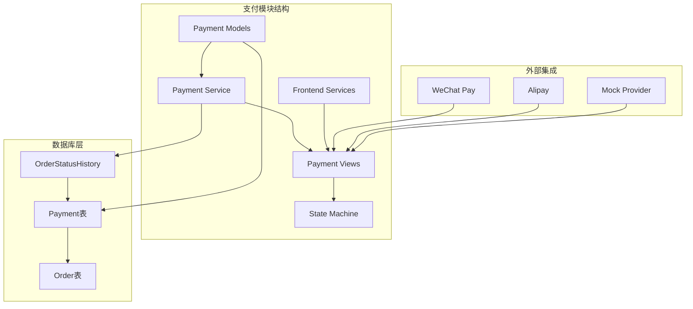
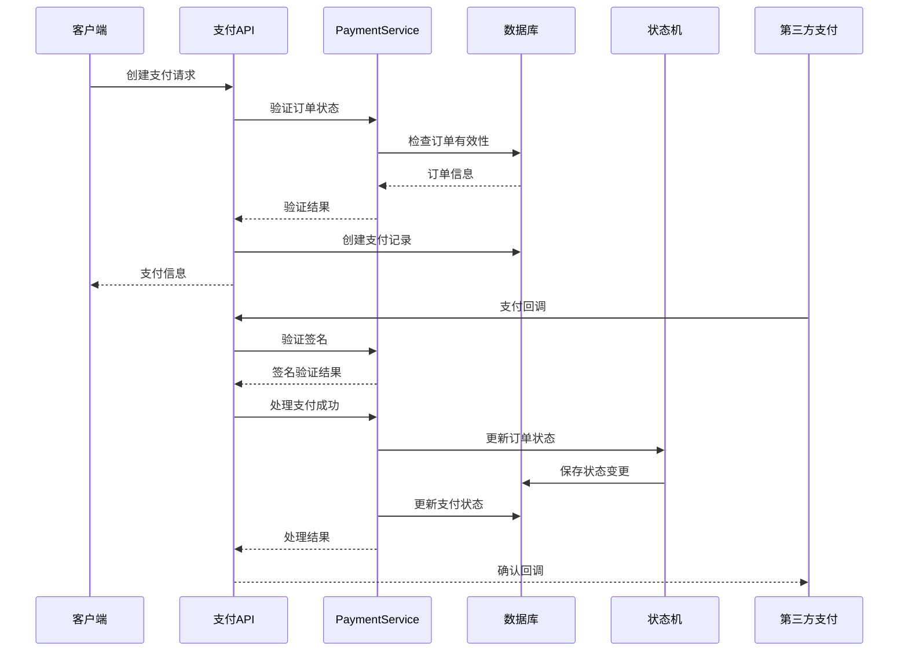
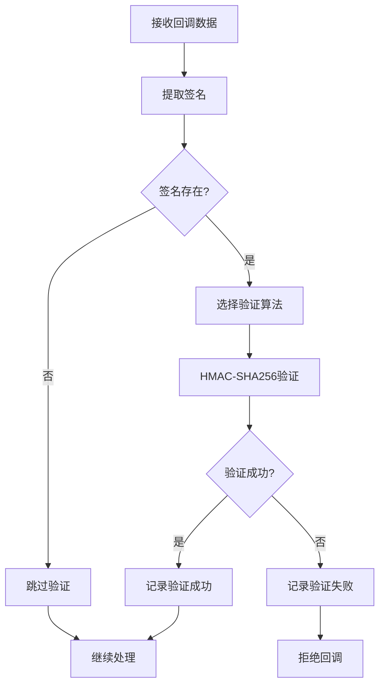
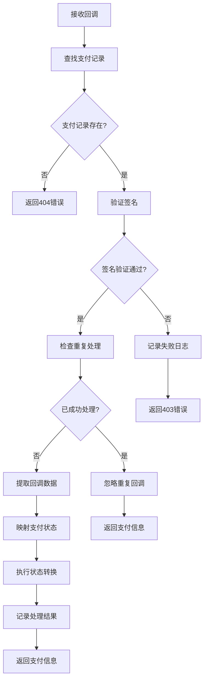
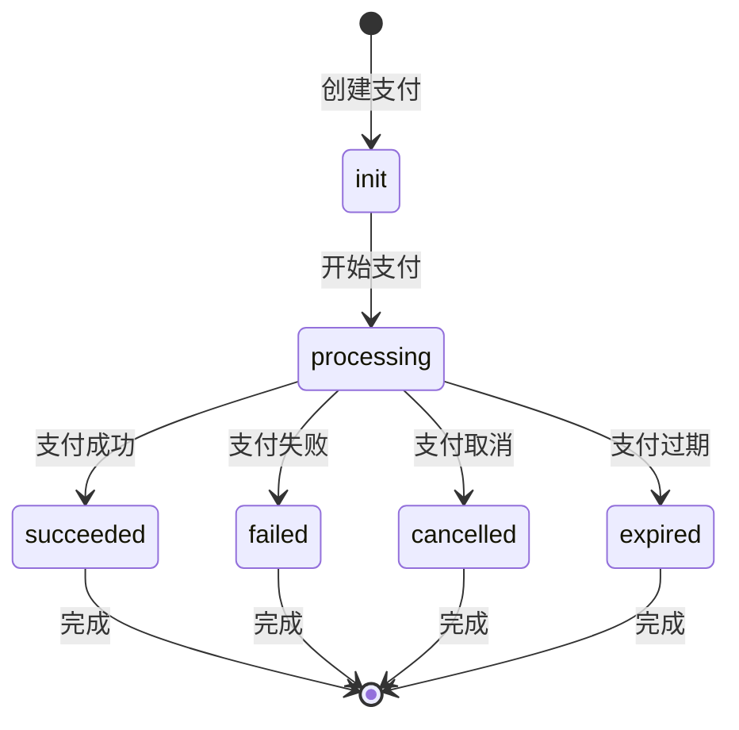
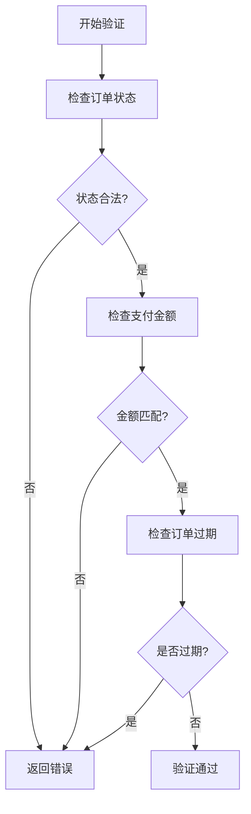
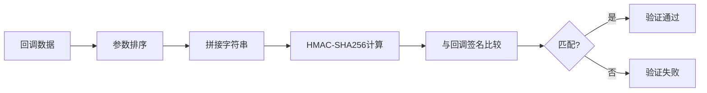

# 支付集成模块API文档

<cite>
**本文档引用的文件**
- [payment_service.py](file://backend/orders/payment_service.py)
- [models.py](file://backend/orders/models.py)
- [views.py](file://backend/orders/views.py)
- [state_machine.py](file://backend/orders/state_machine.py)
- [services.py](file://backend/orders/services.py)
- [migrations/0005_payment.py](file://backend/orders/migrations/0005_payment.py)
- [frontend/src/services/payment.ts](file://frontend/src/services/payment.ts)
</cite>

## 目录
1. [简介](#简介)
2. [项目结构](#项目结构)
3. [核心组件](#核心组件)
4. [架构概览](#架构概览)
5. [详细组件分析](#详细组件分析)
6. [支付模型结构](#支付模型结构)
7. [支付服务实现](#支付服务实现)
8. [支付回调处理](#支付回调处理)
9. [安全措施](#安全措施)
10. [错误处理与调试](#错误处理与调试)
11. [最佳实践](#最佳实践)
12. [故障排除指南](#故障排除指南)

## 简介

支付集成模块是一个完整的支付处理系统，负责处理订单支付、回调验证、状态流转和防止重复支付等核心功能。该模块采用事务性操作确保数据一致性，并提供多种支付方式的支持。

### 主要特性

- **多支付方式支持**：微信支付、支付宝、银行卡
- **安全验证**：签名验证、金额校验、防止重复支付
- **状态机管理**：严格的订单状态流转控制
- **事务性处理**：确保支付操作的原子性
- **完整日志记录**：详细的支付事件追踪
- **回调处理**：支持第三方支付平台回调

## 项目结构

**图表来源**
- [models.py](file://backend/orders/models.py#L186-L234)
- [payment_service.py](file://backend/orders/payment_service.py#L20-L292)

## 核心组件

支付集成模块包含以下核心组件：

### 1. Payment模型
订单支付的核心数据模型，包含支付记录的所有必要信息。

### 2. PaymentService类
支付业务逻辑的核心服务类，提供签名验证、金额校验、支付处理等功能。

### 3. PaymentCallbackView
支付回调处理视图，负责处理第三方支付平台的回调请求。

### 4. OrderStateMachine
订单状态机，管理订单状态的合法转换规则。

### 5. 支付序列化器
用于API数据传输的序列化器，确保数据格式的一致性。

**章节来源**
- [models.py](file://backend/orders/models.py#L186-L234)
- [payment_service.py](file://backend/orders/payment_service.py#L20-L292)
- [views.py](file://backend/orders/views.py#L1133-L1400)

## 架构概览

**图表来源**
- [views.py](file://backend/orders/views.py#L1133-L1400)
- [payment_service.py](file://backend/orders/payment_service.py#L106-L204)
- [state_machine.py](file://backend/orders/state_machine.py#L59-L154)

## 详细组件分析

### PaymentService类详解

PaymentService是支付业务逻辑的核心，提供以下关键功能：

#### 签名验证功能

**图表来源**
- [payment_service.py](file://backend/orders/payment_service.py#L30-L68)

#### 支付金额验证

支付金额验证确保支付金额与订单金额一致，允许0.01元的误差以处理浮点数精度问题。

#### 支付成功处理

支付成功处理是整个支付流程的核心，包含以下步骤：

1. **防重复处理**：检查支付记录状态，防止重复处理
2. **状态更新**：更新支付状态为"成功"
3. **交易ID记录**：记录第三方支付系统的交易ID
4. **订单状态更新**：使用状态机更新关联订单状态
5. **日志记录**：记录完整的操作日志

**章节来源**
- [payment_service.py](file://backend/orders/payment_service.py#L106-L204)

### 支付回调处理流程

支付回调处理是支付系统与第三方支付平台交互的关键环节：

**图表来源**
- [views.py](file://backend/orders/views.py#L1149-L1296)

**章节来源**
- [views.py](file://backend/orders/views.py#L1133-L1400)

## 支付模型结构

### Payment模型字段说明

| 字段名 | 类型 | 描述 | 默认值 |
|--------|------|------|--------|
| id | BigAutoField | 支付记录主键 | 自动生成 |
| order | ForeignKey | 关联的订单 | 必填 |
| amount | Decimal | 支付金额 | 必填 |
| method | CharField | 支付方式 | 'wechat' |
| status | CharField | 支付状态 | 'init' |
| created_at | DateTimeField | 创建时间 | 自动设置 |
| updated_at | DateTimeField | 更新时间 | 自动更新 |
| expires_at | DateTimeField | 过期时间 | 必填 |
| logs | JSONField | 支付日志 | [] |

### 支付状态流转

**图表来源**
- [models.py](file://backend/orders/models.py#L187-L199)

**章节来源**
- [models.py](file://backend/orders/models.py#L186-L234)

## 支付服务实现

### 支付创建验证

支付创建前的验证确保订单状态允许支付、金额一致且未过期：

**图表来源**
- [payment_service.py](file://backend/orders/payment_service.py#L206-L242)

### 支付金额验证算法

支付金额验证使用精确的Decimal比较，允许0.01元的误差：

- **类型转换**：确保支付金额为Decimal类型
- **精度处理**：允许0.01元的浮点数误差
- **比较逻辑**：计算绝对差值并与阈值比较

**章节来源**
- [payment_service.py](file://backend/orders/payment_service.py#L71-L104)

## 支付回调处理

### 微信支付回调处理

微信支付回调处理遵循微信支付的标准流程：

1. **签名验证**：使用HMAC-SHA256算法验证回调数据
2. **状态映射**：将微信支付状态映射到统一状态
3. **事务处理**：使用数据库事务确保操作原子性
4. **状态更新**：更新支付状态和订单状态

### 支付宝回调处理

支付宝回调处理流程类似，但状态参数和签名验证方式有所不同：

- **状态参数**：使用`trade_status`字段
- **签名验证**：使用支付宝的签名算法
- **回调格式**：JSON格式的回调数据

### Mock支付处理

开发环境下的Mock支付处理，跳过签名验证，便于开发和测试：

- **简化流程**：跳过所有安全验证
- **快速响应**：立即返回处理结果
- **日志记录**：记录Mock处理过程

**章节来源**
- [views.py](file://backend/orders/views.py#L1133-L1400)

## 安全措施

### 签名验证机制

支付回调的安全验证采用HMAC-SHA256算法：

**图表来源**
- [payment_service.py](file://backend/orders/payment_service.py#L30-L68)

### 防止重复支付

系统采用多重机制防止重复支付：

1. **状态检查**：检查支付记录是否已成功
2. **时间验证**：检查支付是否已过期
3. **并发控制**：使用数据库锁防止并发处理
4. **幂等性**：确保重复请求不会产生副作用

### 金额验证

支付金额验证确保支付金额与订单金额一致：

- **精确比较**：使用Decimal类型避免浮点数误差
- **容差处理**：允许0.01元的误差
- **类型转换**：自动处理字符串到Decimal的转换

**章节来源**
- [payment_service.py](file://backend/orders/payment_service.py#L30-L104)

## 错误处理与调试

### 日志记录策略

支付系统采用分级日志记录：

| 日志级别 | 记录内容 | 示例场景 |
|----------|----------|----------|
| DEBUG | 详细处理过程 | 签名验证细节 |
| INFO | 正常操作记录 | 支付成功、状态更新 |
| WARNING | 异常但可恢复 | 重复处理、金额接近 |
| ERROR | 严重错误 | 签名验证失败、数据库错误 |

### 常见错误及解决方案

#### 1. 签名验证失败
- **原因**：回调数据被篡改或密钥不匹配
- **解决**：检查密钥配置和回调数据完整性

#### 2. 支付金额不匹配
- **原因**：前端传递的金额与订单金额不一致
- **解决**：验证前端金额计算逻辑

#### 3. 重复支付处理
- **原因**：第三方平台重复发送回调
- **解决**：系统自动检测并忽略重复处理

#### 4. 订单状态转换失败
- **原因**：订单状态不符合转换规则
- **解决**：检查订单状态机配置

**章节来源**
- [payment_service.py](file://backend/orders/payment_service.py#L245-L292)

## 最佳实践

### 支付流程建议

1. **订单创建**：先创建订单，再创建支付记录
2. **金额验证**：严格验证支付金额与订单金额
3. **状态管理**：使用状态机确保状态转换合法
4. **日志记录**：完整记录支付过程中的所有事件
5. **错误处理**：妥善处理各种异常情况

### 性能优化建议

1. **缓存机制**：缓存折扣信息减少数据库查询
2. **批量操作**：批量处理支付回调
3. **异步处理**：将耗时操作放入后台任务
4. **索引优化**：为常用查询字段建立索引

### 安全最佳实践

1. **密钥管理**：定期轮换支付密钥
2. **HTTPS通信**：确保所有支付通信使用HTTPS
3. **输入验证**：严格验证所有输入参数
4. **访问控制**：限制支付相关API的访问权限

## 故障排除指南

### 支付回调问题

#### 问题：支付回调无法到达服务器
**排查步骤**：
1. 检查服务器防火墙设置
2. 验证回调URL配置正确
3. 检查网络连接稳定性
4. 查看服务器日志

#### 问题：签名验证总是失败
**排查步骤**：
1. 确认密钥配置正确
2. 检查回调数据格式
3. 验证时间戳有效性
4. 确认参数排序正确

### 支付状态异常

#### 问题：支付成功但订单状态未更新
**排查步骤**：
1. 检查状态机配置
2. 查看状态转换日志
3. 验证事务提交情况
4. 检查并发处理问题

#### 问题：支付金额验证失败
**排查步骤**：
1. 检查Decimal类型转换
2. 验证金额精度设置
3. 查看前后端金额计算
4. 确认货币单位一致

### 性能问题

#### 问题：支付处理响应缓慢
**排查步骤**：
1. 分析数据库查询性能
2. 检查索引使用情况
3. 优化复杂查询逻辑
4. 考虑添加缓存机制

**章节来源**
- [views.py](file://backend/orders/views.py#L1133-L1400)
- [payment_service.py](file://backend/orders/payment_service.py#L245-L292)