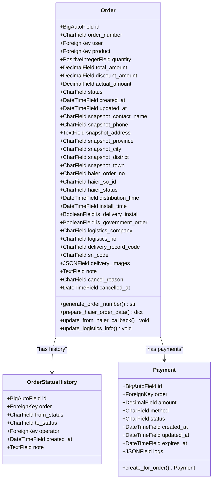
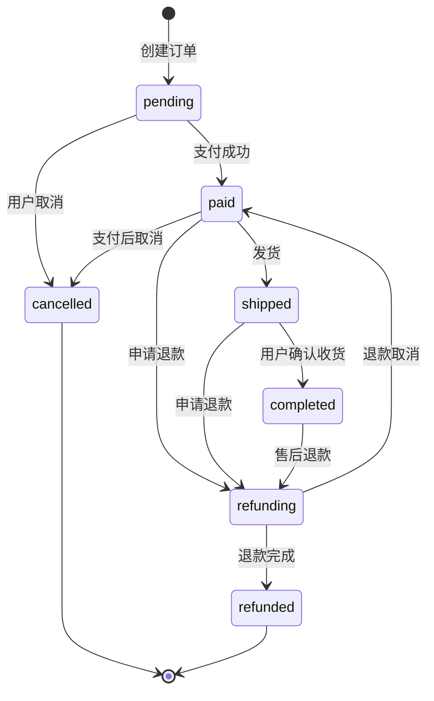
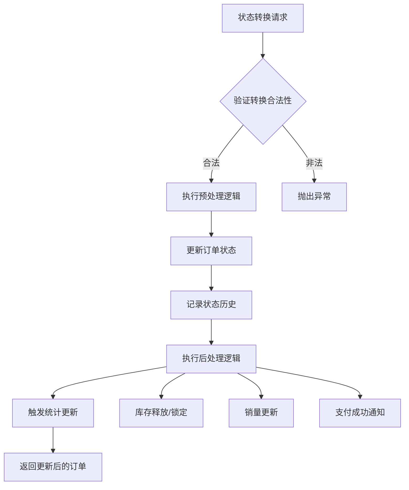
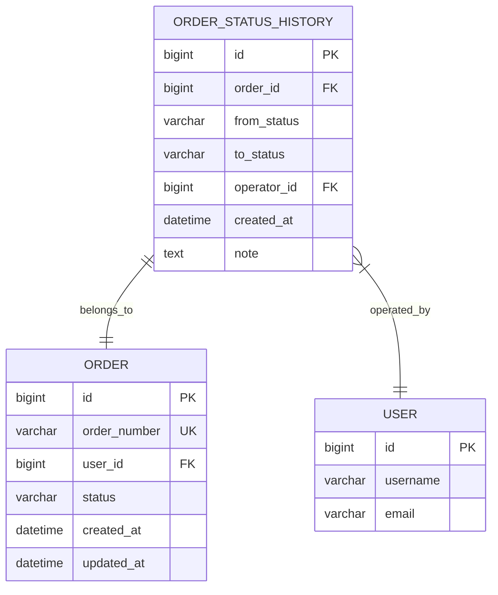
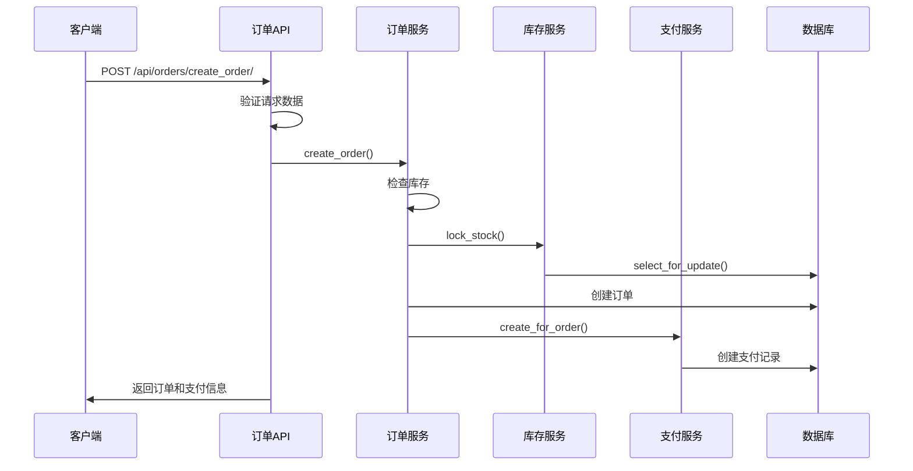
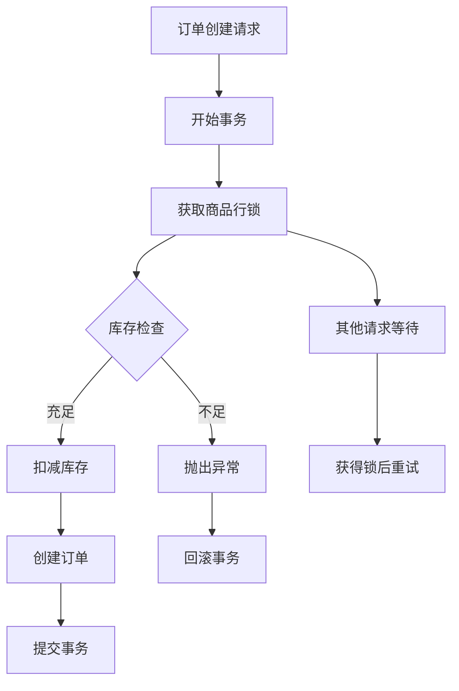
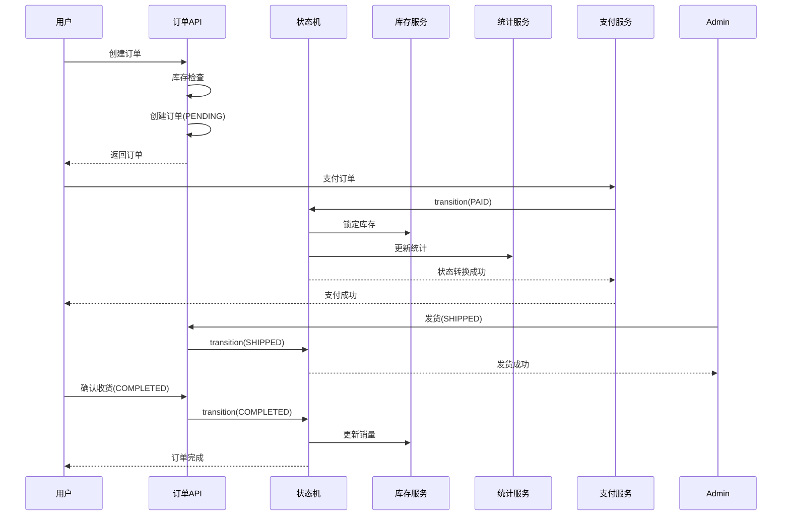

# 订单核心功能详细文档

<cite>
**本文档引用的文件**
- [backend/orders/models.py](file://backend/orders/models.py)
- [backend/orders/state_machine.py](file://backend/orders/state_machine.py)
- [backend/orders/services.py](file://backend/orders/services.py)
- [backend/orders/views.py](file://backend/orders/views.py)
- [backend/orders/serializers.py](file://backend/orders/serializers.py)
- [backend/orders/analytics.py](file://backend/orders/analytics.py)
- [backend/orders/migrations/0008_add_order_status_history.py](file://backend/orders/migrations/0008_add_order_status_history.py)
- [backend/orders/payment_service.py](file://backend/orders/payment_service.py)
- [backend/catalog/models.py](file://backend/catalog/models.py)
</cite>

## 目录
1. [概述](#概述)
2. [Order模型设计](#order模型设计)
3. [状态机集成](#状态机集成)
4. [订单生命周期管理](#订单生命周期管理)
5. [快照机制](#快照机制)
6. [海尔订单号生成](#海尔订单号生成)
7. [订单状态历史](#订单状态历史)
8. [订单创建API实现](#订单创建api实现)
9. [并发控制策略](#并发控制策略)
10. [状态转换流程](#状态转换流程)
11. [总结](#总结)

## 概述

本文档详细阐述了电商业务系统中订单核心功能的设计与实现，涵盖了Order模型的字段设计、状态机集成、订单生命周期管理、快照机制、海尔订单号生成逻辑、状态历史记录等核心功能。

系统采用Django框架构建，实现了完整的订单管理功能，包括订单创建、状态流转、库存管理、支付处理、海尔系统对接等业务场景。

## Order模型设计

### 核心字段结构

Order模型包含了完整的订单信息，支持本地商品和海尔商品两种类型：



**图表来源**
- [backend/orders/models.py](file://backend/orders/models.py#L13-L164)

### 状态定义

订单支持以下七种状态：

| 状态 | 英文 | 描述 |
|------|------|------|
| pending | 待支付 | 订单已创建，等待用户支付 |
| paid | 待发货 | 支付成功，等待发货 |
| shipped | 待收货 | 已发货，等待用户确认收货 |
| completed | 已完成 | 用户确认收货，订单完成 |
| cancelled | 已取消 | 订单被取消 |
| refunding | 退款中 | 用户申请退款，处理中 |
| refunded | 已退款 | 退款已完成 |

**章节来源**
- [backend/orders/models.py](file://backend/orders/models.py#L14-L22)

### 海尔系统集成字段

系统特别为海尔商品订单设计了专门的字段：

- `haier_order_no`: 海尔订单号（巨商汇系统）
- `haier_so_id`: 海尔子订单号（唯一标识）
- `haier_status`: 海尔订单状态

**章节来源**
- [backend/orders/models.py](file://backend/orders/models.py#L44-L47)

## 状态机集成

### 状态转换规则

系统实现了严格的订单状态机，确保状态转换的合法性：



**图表来源**
- [backend/orders/state_machine.py](file://backend/orders/state_machine.py#L33-L56)

### 状态转换验证

状态机提供了严格的状态转换验证机制：

```python
# 允许的转换规则示例
{
    OrderStatus.PENDING: {OrderStatus.PAID, OrderStatus.CANCELLED},
    OrderStatus.PAID: {OrderStatus.SHIPPED, OrderStatus.REFUNDING, OrderStatus.CANCELLED},
    OrderStatus.SHIPPED: {OrderStatus.COMPLETED, OrderStatus.REFUNDING},
    OrderStatus.COMPLETED: {OrderStatus.REFUNDING},
    OrderStatus.REFUNDING: {OrderStatus.REFUNDED, OrderStatus.PAID},
    OrderStatus.CANCELLED: set(),
    OrderStatus.REFUNDED: set()
}
```

**章节来源**
- [backend/orders/state_machine.py](file://backend/orders/state_machine.py#L33-L56)

## 订单生命周期管理

### 生命周期阶段

订单从创建到完成经历以下主要阶段：

1. **创建阶段**: 用户提交订单，生成订单号
2. **支付阶段**: 用户完成支付，状态从pending转为paid
3. **发货阶段**: 管理员发货，状态从paid转为shipped
4. **收货阶段**: 用户确认收货，状态从shipped转为completed
5. **售后阶段**: 可能涉及退款、取消等操作

### 业务逻辑处理

状态机在每次状态转换时会执行相应的业务逻辑：



**图表来源**
- [backend/orders/state_machine.py](file://backend/orders/state_machine.py#L95-L154)

**章节来源**
- [backend/orders/state_machine.py](file://backend/orders/state_machine.py#L157-L288)

## 快照机制

### 快照字段设计

为了确保订单数据的一致性和可追溯性，系统在订单创建时会捕获关键信息的快照：

| 字段 | 类型 | 描述 |
|------|------|------|
| snapshot_contact_name | CharField | 联系人姓名 |
| snapshot_phone | CharField | 联系电话 |
| snapshot_address | TextField | 完整收货地址 |
| snapshot_province | CharField | 省份 |
| snapshot_city | CharField | 城市 |
| snapshot_district | CharField | 区县 |
| snapshot_town | CharField | 乡镇/街道 |

### 快照生成时机

快照在订单创建时自动生成，确保即使后续用户修改地址信息，订单历史记录仍然保持原始状态不变。

**章节来源**
- [backend/orders/models.py](file://backend/orders/models.py#L36-L42)

## 海尔订单号生成

### 生成逻辑

海尔子订单号（haier_so_id）的生成遵循以下规则：

1. **优先使用现有值**: 如果订单已有haier_so_id，则直接使用
2. **默认生成规则**: `订单号-订单ID`，例如：`1700000000-123`
3. **唯一性保证**: haier_so_id字段具有unique=True约束

### 海尔订单数据准备

系统提供了`prepare_haier_order_data()`方法，用于准备推送到海尔系统的订单数据：

```python
def prepare_haier_order_data(self, source_system='YOUR_SYSTEM', shop_name='默认店铺'):
    return {
        'sourceSystem': source_system,
        'shopName': shop_name,
        'sellerCode': settings.HAIER_CUSTOMER_CODE,
        'consigneeName': self.snapshot_contact_name,
        'consigneeMobile': self.snapshot_phone,
        'onlineNo': self.order_number,
        'soId': self.haier_so_id or f"{self.order_number}-{self.id}",
        'remark': self.note,
        'totalQty': self.quantity,
        'totalAmt': float(self.total_amount),
        'createTime': int(self.created_at.timestamp() * 1000),
        'province': self.snapshot_province,
        'city': self.snapshot_city,
        'area': self.snapshot_district,
        'town': self.snapshot_town,
        'detailAddress': self.snapshot_address,
        'distributionTime': int(self.distribution_time.timestamp() * 1000) if self.distribution_time else None,
        'installTime': int(self.install_time.timestamp() * 1000) if self.install_time else None,
        'governmentOrder': self.is_government_order,
        'deliveryInstall': str(self.is_delivery_install).lower(),
        'itemList': [...]
    }
```

**章节来源**
- [backend/orders/models.py](file://backend/orders/models.py#L86-L115)

## 订单状态历史

### 历史记录表结构

系统通过OrderStatusHistory模型记录所有状态变更：



**图表来源**
- [backend/orders/models.py](file://backend/orders/models.py#L292-L321)

### 查询方法

系统提供了多种查询方法来获取状态历史：

1. **按订单查询**: `order.status_history.all()`
2. **按时间段查询**: 支持时间范围过滤
3. **按状态转换查询**: 支持原状态和新状态的组合查询

**章节来源**
- [backend/orders/models.py](file://backend/orders/models.py#L292-L321)

## 订单创建API实现

### API端点设计

系统提供了完整的订单创建API：



**图表来源**
- [backend/orders/views.py](file://backend/orders/views.py#L136-L217)

### 库存校验流程

订单创建过程中的库存校验包括：

1. **本地商品库存**: 使用数据库行锁确保并发安全
2. **海尔商品库存**: 调用海尔API检查可用库存
3. **并发控制**: 使用事务和行锁防止超卖

### 快照数据生成

在订单创建过程中，系统会自动生成快照数据：

```python
# 快照字段赋值示例
order = Order.objects.create(
    user=user,
    product=product,
    quantity=quantity,
    total_amount=total_amount,
    snapshot_contact_name=address.contact_name,
    snapshot_phone=address.phone,
    snapshot_address=full_address,
    snapshot_province=address.province,
    snapshot_city=address.city,
    snapshot_district=address.district,
    note=note,
)
```

**章节来源**
- [backend/orders/views.py](file://backend/orders/views.py#L136-L217)
- [backend/orders/services.py](file://backend/orders/services.py#L219-L297)

## 并发控制策略

### 数据库层面的并发控制

系统采用了多层次的并发控制策略：

1. **数据库行锁**: 使用`select_for_update()`防止并发修改
2. **事务隔离**: 使用数据库事务确保操作的原子性
3. **唯一约束**: 对关键字段（如haier_so_id）设置唯一约束

### 库存并发控制



**图表来源**
- [backend/orders/services.py](file://backend/orders/services.py#L333-L372)

### 支付并发控制

支付处理也采用了类似的并发控制策略：

```python
@transaction.atomic
def process_payment_success(payment_id: int, transaction_id: str = None, operator=None):
    # 使用select_for_update锁定支付记录
    payment = Payment.objects.select_for_update().get(id=payment_id)
    
    # 防止重复处理已成功的支付
    if payment.status == 'succeeded':
        return payment
        
    # 更新支付状态
    payment.status = 'succeeded'
    payment.save()
    
    # 使用状态机更新订单状态
    OrderStateMachine.transition(payment.order, 'paid', operator=operator)
```

**章节来源**
- [backend/orders/services.py](file://backend/orders/services.py#L333-L372)
- [backend/orders/payment_service.py](file://backend/orders/payment_service.py#L105-L202)

## 状态转换流程

### 完整的订单状态流转

以下是订单从创建到完成的完整状态转换流程：



**图表来源**
- [backend/orders/state_machine.py](file://backend/orders/state_machine.py#L95-L154)

### 异常处理机制

系统在状态转换过程中提供了完善的异常处理：

1. **状态转换验证**: 检查是否允许的状态转换
2. **业务逻辑验证**: 确保转换前的业务条件满足
3. **回滚机制**: 转换失败时自动回滚
4. **日志记录**: 记录所有状态转换的详细信息

**章节来源**
- [backend/orders/state_machine.py](file://backend/orders/state_machine.py#L95-L154)

## 总结

本文档详细介绍了电商业务系统中订单核心功能的设计与实现，主要包括：

1. **完整的Order模型设计**: 支持本地商品和海尔商品，包含丰富的字段和状态管理
2. **严格的状态机集成**: 确保订单状态转换的合法性和一致性
3. **可靠的快照机制**: 保证订单历史数据的完整性和可追溯性
4. **智能的海尔订单号生成**: 提供灵活的订单号生成策略
5. **全面的状态历史记录**: 支持完整的订单生命周期追踪
6. **健壮的订单创建API**: 包含库存校验和快照数据生成
7. **完善的并发控制策略**: 确保高并发场景下的数据一致性
8. **清晰的状态转换流程**: 提供完整的业务逻辑处理链路

这套订单核心功能设计充分考虑了电商系统的复杂性和业务需求，为系统的稳定运行提供了坚实的基础。通过状态机、快照机制、并发控制等技术手段，确保了订单数据的准确性、一致性和可靠性。