# 订单管理模块

<cite>
**本文档引用的文件**
- [backend/orders/models.py](file://backend/orders/models.py)
- [backend/orders/state_machine.py](file://backend/orders/state_machine.py)
- [backend/orders/views.py](file://backend/orders/views.py)
- [backend/orders/services.py](file://backend/orders/services.py)
- [backend/orders/payment_service.py](file://backend/orders/payment_service.py)
- [backend/common/permissions.py](file://backend/common/permissions.py)
- [backend/orders/urls.py](file://backend/orders/urls.py)
- [frontend/src/services/order.ts](file://frontend/src/services/order.ts)
- [frontend/src/services/cart.ts](file://frontend/src/services/cart.ts)
- [PRODUCT_ORDER_FULFILLMENT_GUIDE.md](file://PRODUCT_ORDER_FULFILLMENT_GUIDE.md)
</cite>

## 目录
1. [简介](#简介)
2. [系统架构概览](#系统架构概览)
3. [核心模型设计](#核心模型设计)
4. [订单状态机](#订单状态机)
5. [购物车管理](#购物车管理)
6. [支付流程](#支付流程)
7. [权限控制](#权限控制)
8. [业务流程详解](#业务流程详解)
9. [常见问题与解决方案](#常见问题与解决方案)
10. [最佳实践](#最佳实践)

## 简介

订单管理模块是电小二商城的核心交易系统，负责处理从用户下单到订单完成的完整生命周期。该模块采用状态机模式管理订单状态流转，实现了严格的业务逻辑控制和完善的权限管理体系。

系统支持两种产品类型：非海尔产品和海尔产品，每种类型都有独特的处理流程。对于非海尔产品，系统完全自主管理库存和发货；对于海尔产品，则需要对接海尔供应链系统，实现订单推送和物流查询。

## 系统架构概览

订单管理模块采用分层架构设计，包含以下核心组件：

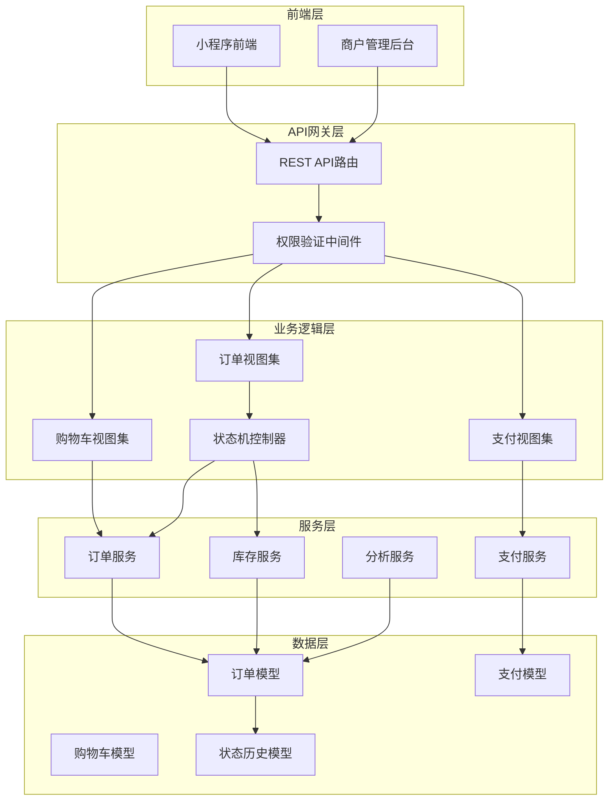

**图表来源**
- [backend/orders/views.py](file://backend/orders/views.py#L1-L50)
- [backend/orders/models.py](file://backend/orders/models.py#L1-L100)

**章节来源**
- [backend/orders/views.py](file://backend/orders/views.py#L1-L100)
- [backend/orders/models.py](file://backend/orders/models.py#L1-L200)

## 核心模型设计

### Order（订单）模型

Order模型是整个订单系统的核心，包含了订单的完整信息和状态管理：

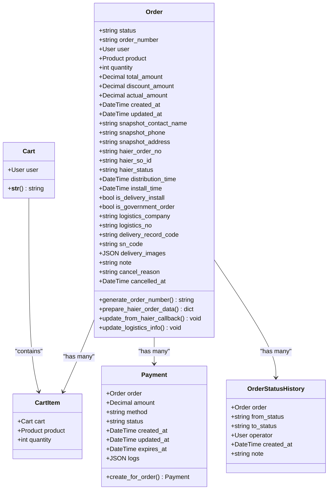

**图表来源**
- [backend/orders/models.py](file://backend/orders/models.py#L13-L322)

#### 订单状态定义

订单支持以下状态：

| 状态 | 英文 | 描述 |
|------|------|------|
| 待支付 | pending | 订单已创建，等待用户支付 |
| 待发货 | paid | 支付成功，等待发货 |
| 待收货 | shipped | 已发货，等待用户确认收货 |
| 已完成 | completed | 用户确认收货，订单完成 |
| 已取消 | cancelled | 订单被取消 |
| 退款中 | refunding | 用户申请退款 |
| 已退款 | refunded | 退款已完成 |

#### 海尔产品特殊字段

对于海尔产品订单，系统额外维护以下字段：

- `haier_order_no`: 海尔订单号
- `haier_so_id`: 海尔子订单号  
- `haier_status`: 海尔订单状态
- `distribution_time`: 配送时间
- `install_time`: 安装时间
- `is_delivery_install`: 是否送装一体
- `is_government_order`: 是否国补订单

**章节来源**
- [backend/orders/models.py](file://backend/orders/models.py#L13-L148)

### Cart（购物车）模型

购物车系统采用两级结构设计：

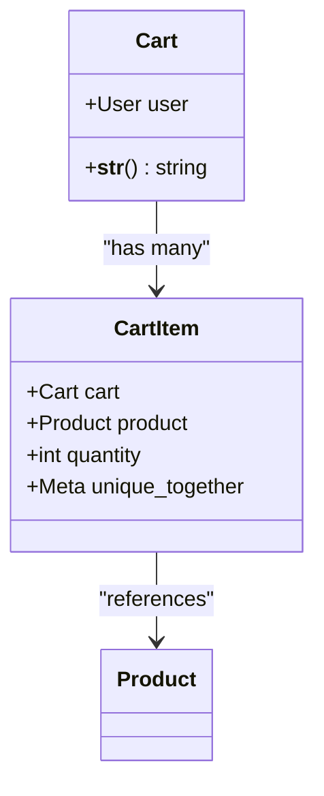

**图表来源**
- [backend/orders/models.py](file://backend/orders/models.py#L165-L184)

**章节来源**
- [backend/orders/models.py](file://backend/orders/models.py#L165-L184)

### Payment（支付）模型

支付模型记录每次支付的详细信息：

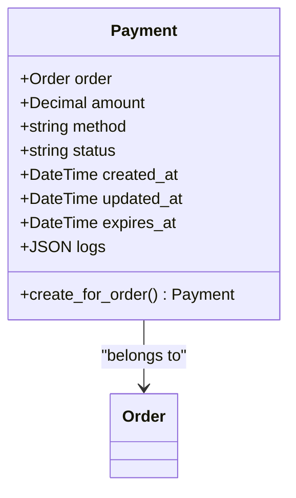

**图表来源**
- [backend/orders/models.py](file://backend/orders/models.py#L186-L234)

**章节来源**
- [backend/orders/models.py](file://backend/orders/models.py#L186-L234)

## 订单状态机

订单状态机是系统的核心业务逻辑组件，确保订单状态的合法流转：

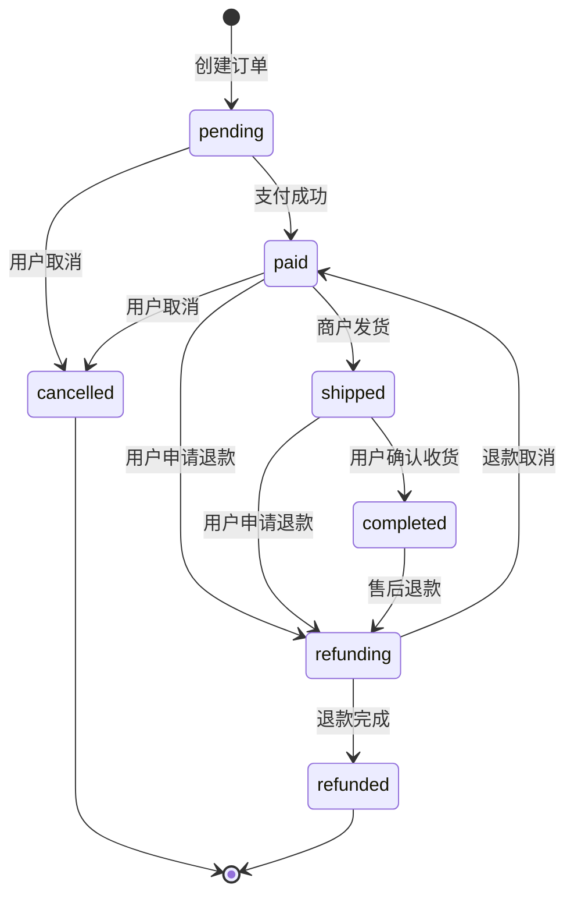

**图表来源**
- [backend/orders/state_machine.py](file://backend/orders/state_machine.py#L34-L57)

### 状态转换规则

状态机定义了严格的转换规则：

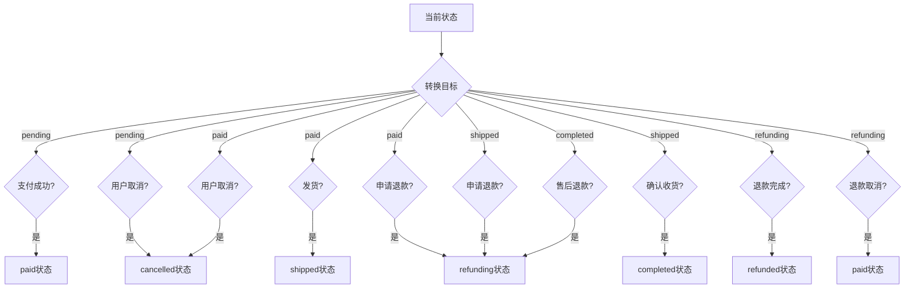

**图表来源**
- [backend/orders/state_machine.py](file://backend/orders/state_machine.py#L34-L57)

### 状态转换实现

状态转换通过原子事务保证数据一致性：

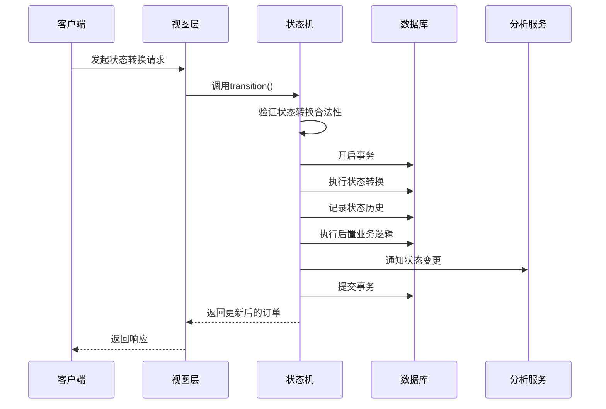

**图表来源**
- [backend/orders/state_machine.py](file://backend/orders/state_machine.py#L96-L154)

**章节来源**
- [backend/orders/state_machine.py](file://backend/orders/state_machine.py#L1-L289)

## 购物车管理

购物车系统提供了完整的商品管理功能：

### 购物车操作流程

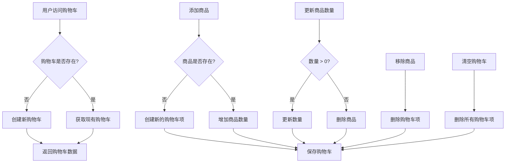

**图表来源**
- [backend/orders/views.py](file://backend/orders/views.py#L647-L780)

### 购物车服务函数

系统提供了以下核心服务函数：

| 函数名 | 功能 | 参数 | 返回值 |
|--------|------|------|--------|
| get_or_create_cart | 获取或创建购物车 | user | Cart |
| add_to_cart | 添加商品到购物车 | user, product_id, quantity | CartItem |
| remove_from_cart | 从购物车移除商品 | user, product_id | void |
| update_item | 更新商品数量 | user, product_id, quantity | Cart |
| clear_cart | 清空购物车 | user | Cart |

**章节来源**
- [backend/orders/views.py](file://backend/orders/views.py#L647-L780)
- [backend/orders/services.py](file://backend/orders/services.py#L300-L320)

## 支付流程

支付系统采用异步处理模式，确保支付安全性和可靠性：

### 支付流程架构

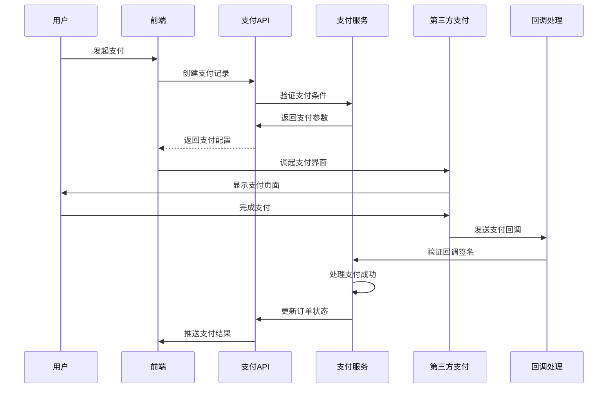

**图表来源**
- [backend/orders/payment_service.py](file://backend/orders/payment_service.py#L106-L204)

### 支付安全机制

支付系统实现了多重安全保护：

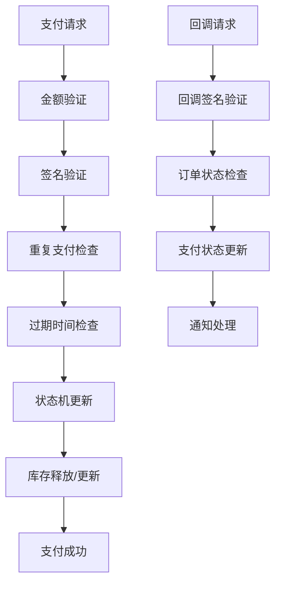

**图表来源**
- [backend/orders/payment_service.py](file://backend/orders/payment_service.py#L30-L292)

**章节来源**
- [backend/orders/payment_service.py](file://backend/orders/payment_service.py#L1-L292)

## 权限控制

系统采用多层次的权限控制体系：

### IsOwnerOrAdmin权限

这是订单管理的核心权限类，确保用户只能访问自己的订单：

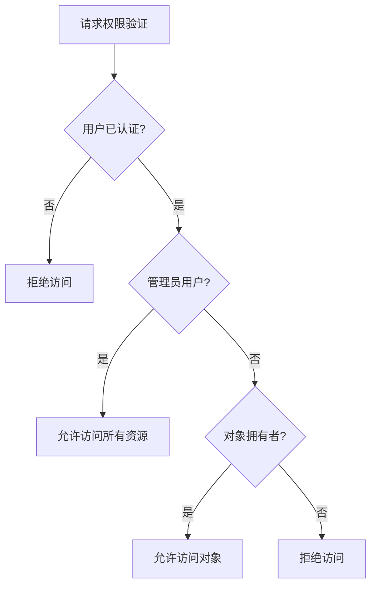

**图表来源**
- [backend/common/permissions.py](file://backend/common/permissions.py#L12-L67)

### 权限应用场景

| 视图集 | 权限类 | 访问规则 |
|--------|--------|----------|
| OrderViewSet | IsOwnerOrAdmin | 用户只能访问自己的订单，管理员可访问所有 |
| PaymentViewSet | IsOwnerOrAdmin | 用户只能访问自己订单的支付记录，管理员可访问所有 |
| CartViewSet | IsAuthenticated | 仅认证用户可访问购物车 |
| Admin Views | IsAdmin | 仅管理员可访问管理功能 |

**章节来源**
- [backend/common/permissions.py](file://backend/common/permissions.py#L1-L189)
- [backend/orders/views.py](file://backend/orders/views.py#L23-L33)

## 业务流程详解

### 订单创建流程

订单创建是整个交易流程的起点：

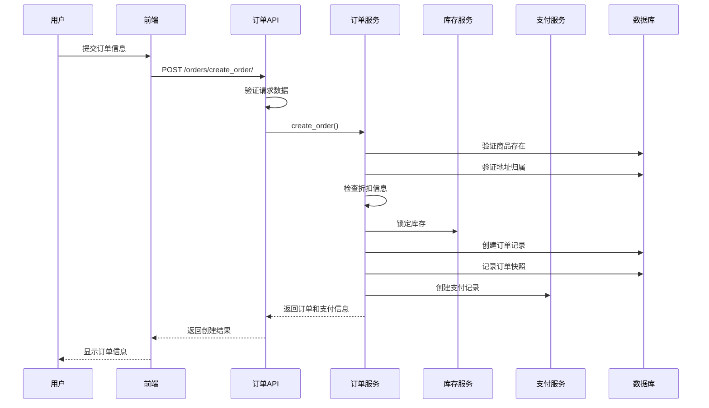

**图表来源**
- [backend/orders/views.py](file://backend/orders/views.py#L136-L217)
- [backend/orders/services.py](file://backend/orders/services.py#L219-L297)

### 库存管理策略

系统实现了严格的库存管理机制：

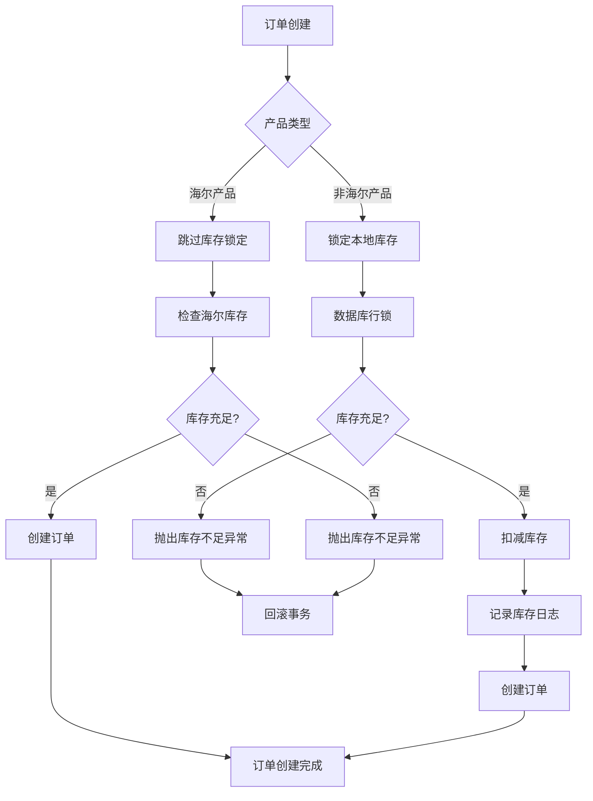

**图表来源**
- [backend/orders/services.py](file://backend/orders/services.py#L332-L372)

### 海尔产品特殊流程

海尔产品需要特殊的处理流程：

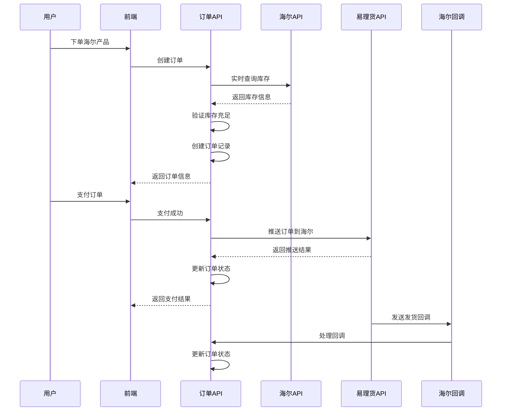

**图表来源**
- [PRODUCT_ORDER_FULFILLMENT_GUIDE.md](file://PRODUCT_ORDER_FULFILLMENT_GUIDE.md#L250-L380)

**章节来源**
- [backend/orders/views.py](file://backend/orders/views.py#L136-L217)
- [backend/orders/services.py](file://backend/orders/services.py#L219-L297)
- [PRODUCT_ORDER_FULFILLMENT_GUIDE.md](file://PRODUCT_ORDER_FULFILLMENT_GUIDE.md#L1-L737)

## 常见问题与解决方案

### 库存超卖问题

**问题描述**: 多个用户同时购买同一件商品导致库存不足。

**解决方案**: 使用数据库行锁确保库存操作的原子性：

```python
# 示例：库存锁定实现
@transaction.atomic
def lock_stock(product_id: int, quantity: int):
    product = Product.objects.select_for_update().get(id=product_id)
    if product.stock < quantity:
        raise ValueError("库存不足")
    product.stock -= quantity
    product.save()
```

**章节来源**
- [backend/orders/services.py](file://backend/orders/services.py#L332-L372)

### 支付状态不一致

**问题描述**: 支付成功但订单状态未更新，或订单状态已更新但支付记录未正确处理。

**解决方案**: 实现幂等性处理和状态补偿机制：

```python
# 示例：支付状态补偿
def process_payment_success(payment_id):
    payment = Payment.objects.select_for_update().get(id=payment_id)
    if payment.status == 'succeeded':
        return payment  # 防止重复处理
    
    # 更新支付状态
    payment.status = 'succeeded'
    payment.save()
    
    # 使用状态机更新订单状态
    OrderStateMachine.transition(payment.order, 'paid')
```

**章节来源**
- [backend/orders/payment_service.py](file://backend/orders/payment_service.py#L106-L204)

### 海尔库存同步延迟

**问题描述**: 海尔产品库存信息更新滞后，导致下单时库存显示充足但实际无法购买。

**解决方案**: 实现实时库存查询和缓存机制：

```python
# 示例：实时库存查询
def check_haier_stock(product, address, quantity):
    county_code = get_county_code(address.province, address.city, address.district)
    stock_info = haier_api.check_stock(product.product_code, county_code)
    
    if stock_info['stock'] < quantity:
        raise ValueError("海尔产品库存不足")
    
    return stock_info
```

**章节来源**
- [backend/orders/services.py](file://backend/orders/services.py#L123-L217)

## 最佳实践

### 订单状态管理

1. **使用状态机**: 始终通过状态机进行状态转换，避免直接修改状态字段
2. **事务保证**: 关键业务操作必须在事务中执行
3. **状态历史**: 每次状态变更都要记录历史，便于审计和问题追踪

### 库存管理

1. **行锁保护**: 使用数据库行锁防止并发超卖
2. **及时释放**: 订单取消或支付失败时及时释放库存
3. **实时查询**: 海尔产品使用实时库存查询

### 支付安全

1. **签名验证**: 所有支付回调必须验证签名
2. **幂等处理**: 支付处理必须支持幂等性
3. **状态补偿**: 实现支付状态不一致的补偿机制

### 性能优化

1. **批量操作**: 购物车结算使用批量创建订单
2. **缓存策略**: 适当使用缓存减少数据库查询
3. **索引优化**: 为常用查询字段建立索引

**章节来源**
- [backend/orders/state_machine.py](file://backend/orders/state_machine.py#L96-L154)
- [backend/orders/services.py](file://backend/orders/services.py#L332-L410)
- [backend/orders/payment_service.py](file://backend/orders/payment_service.py#L30-L292)