# 购物车管理

<cite>
**本文档引用的文件**
- [models.py](file://backend/orders/models.py)
- [views.py](file://backend/orders/views.py)
- [serializers.py](file://backend/orders/serializers.py)
- [services.py](file://backend/orders/services.py)
- [cart.ts](file://frontend/src/services/cart.ts)
- [admin.py](file://backend/orders/admin.py)
- [cancel_unpaid_orders.py](file://backend/orders/management/commands/cancel_unpaid_orders.py)
</cite>

## 目录
1. [简介](#简介)
2. [项目结构](#项目结构)
3. [核心组件](#核心组件)
4. [架构概览](#架构概览)
5. [详细组件分析](#详细组件分析)
6. [依赖关系分析](#依赖关系分析)
7. [性能考虑](#性能考虑)
8. [故障排除指南](#故障排除指南)
9. [结论](#结论)

## 简介

购物车管理功能是电商平台的核心模块之一，负责处理用户购物车的创建、维护和操作。本文档详细介绍了基于Django框架构建的购物车管理系统，包括Cart和CartItem模型的设计与实现、购物车与用户及商品的关系、唯一性约束、业务逻辑处理以及并发场景下的数据一致性保障。

该系统采用RESTful API设计，支持添加商品、更新数量、删除商品等基本操作，并提供了完善的库存同步机制和过期处理方案。

## 项目结构

购物车管理功能在项目中的组织结构如下：

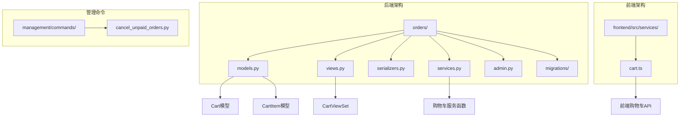

**图表来源**
- [models.py](file://backend/orders/models.py#L165-L184)
- [views.py](file://backend/orders/views.py#L647-L768)
- [cart.ts](file://frontend/src/services/cart.ts#L1-L45)

**章节来源**
- [models.py](file://backend/orders/models.py#L1-L322)
- [views.py](file://backend/orders/views.py#L1-L800)
- [cart.ts](file://frontend/src/services/cart.ts#L1-L45)

## 核心组件

### Cart模型 - 购物车实体

Cart模型代表用户的购物车，每个用户只能拥有一个购物车实例：

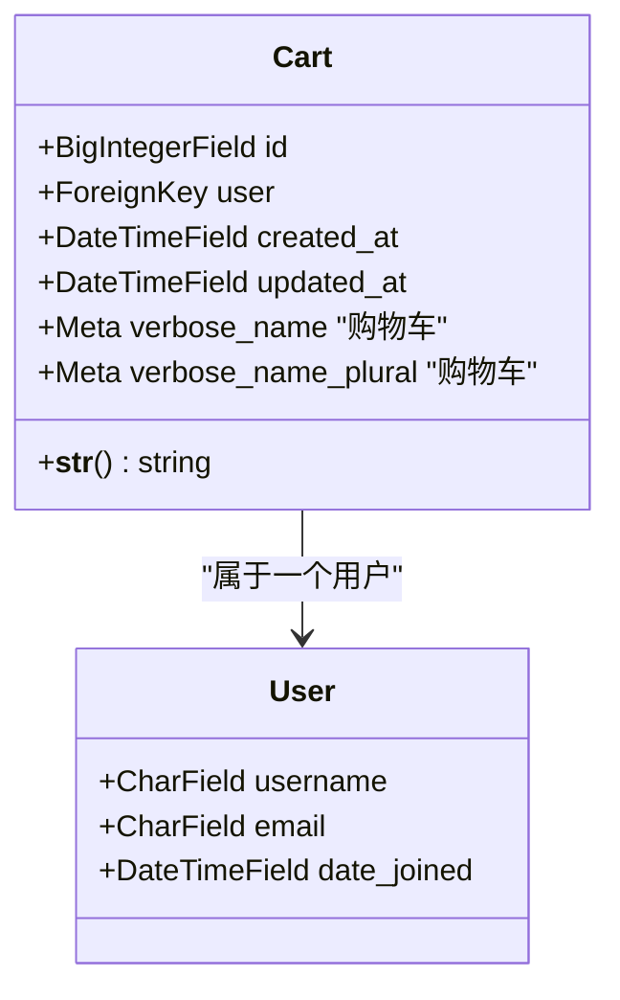

**图表来源**
- [models.py](file://backend/orders/models.py#L165-L170)

### CartItem模型 - 购物车项

CartItem模型表示购物车中的具体商品项，具有唯一性约束确保同一商品在购物车中只出现一次：

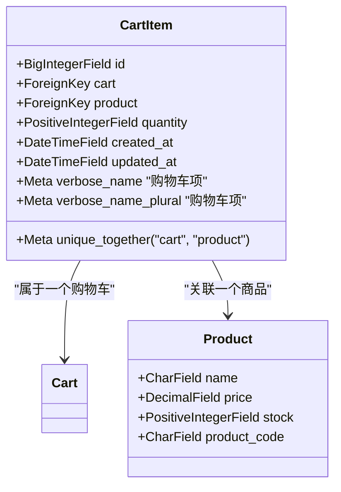

**图表来源**
- [models.py](file://backend/orders/models.py#L174-L184)

**章节来源**
- [models.py](file://backend/orders/models.py#L165-L184)

## 架构概览

购物车管理系统采用分层架构设计，从前端到后端形成完整的数据流：

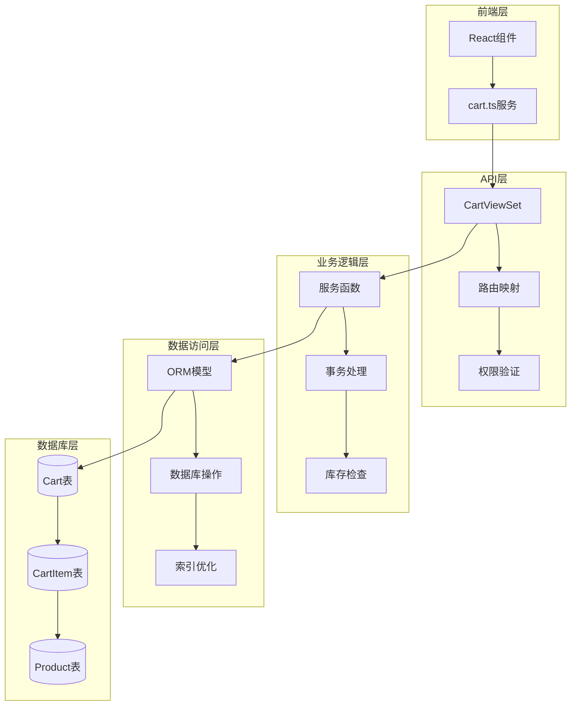

**图表来源**
- [views.py](file://backend/orders/views.py#L647-L768)
- [services.py](file://backend/orders/services.py#L300-L330)

## 详细组件分析

### 购物车视图控制器

CartViewSet提供了完整的购物车操作API接口：

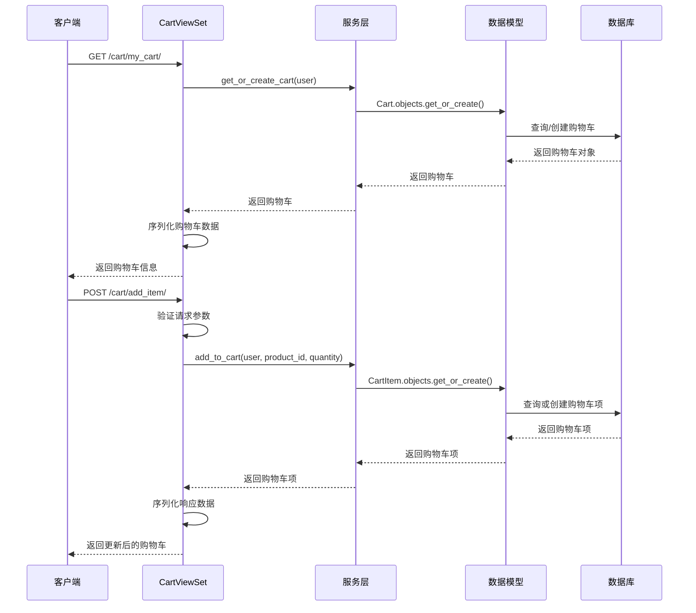

**图表来源**
- [views.py](file://backend/orders/views.py#L650-L700)
- [services.py](file://backend/orders/services.py#L300-L320)

### 购物车操作业务逻辑

#### 添加商品到购物车

添加商品到购物车的操作遵循以下流程：

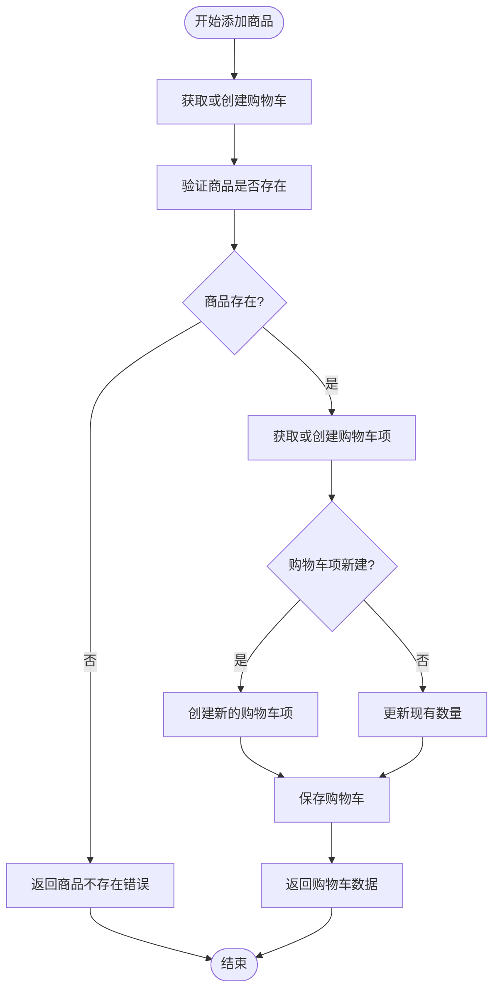

**图表来源**
- [services.py](file://backend/orders/services.py#L305-L317)

#### 更新购物车数量

更新购物车数量支持两种模式：累加模式和精确设置模式：

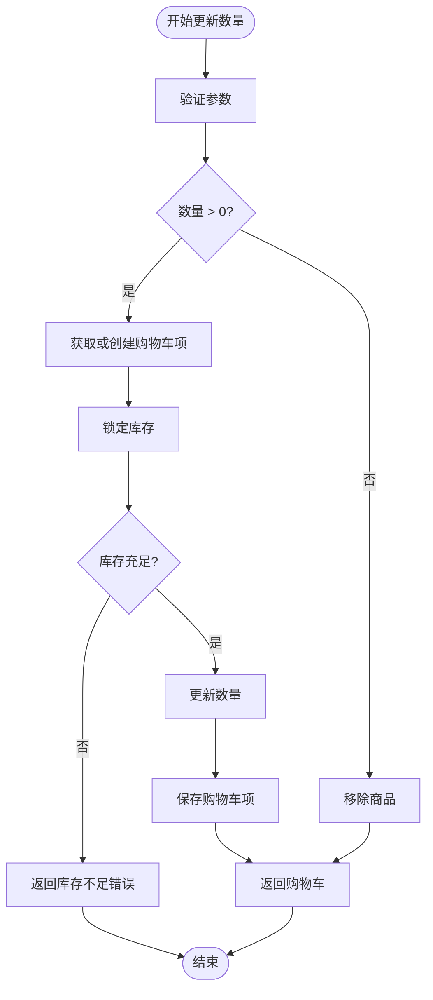

**图表来源**
- [views.py](file://backend/orders/views.py#L702-L767)
- [services.py](file://backend/orders/services.py#L305-L317)

### 序列化器设计

购物车序列化器负责数据的序列化和反序列化：

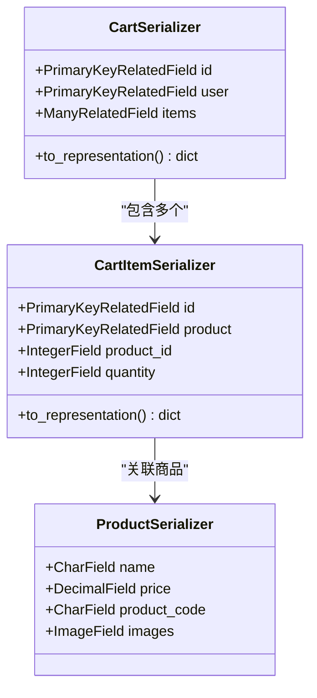

**图表来源**
- [serializers.py](file://backend/orders/serializers.py#L148-L159)
- [serializers.py](file://backend/orders/serializers.py#L135-L148)

**章节来源**
- [views.py](file://backend/orders/views.py#L647-L768)
- [serializers.py](file://backend/orders/serializers.py#L135-L159)

### 并发控制与数据一致性

系统通过多种机制确保购物车操作的并发安全性：

#### 数据库层面的并发控制

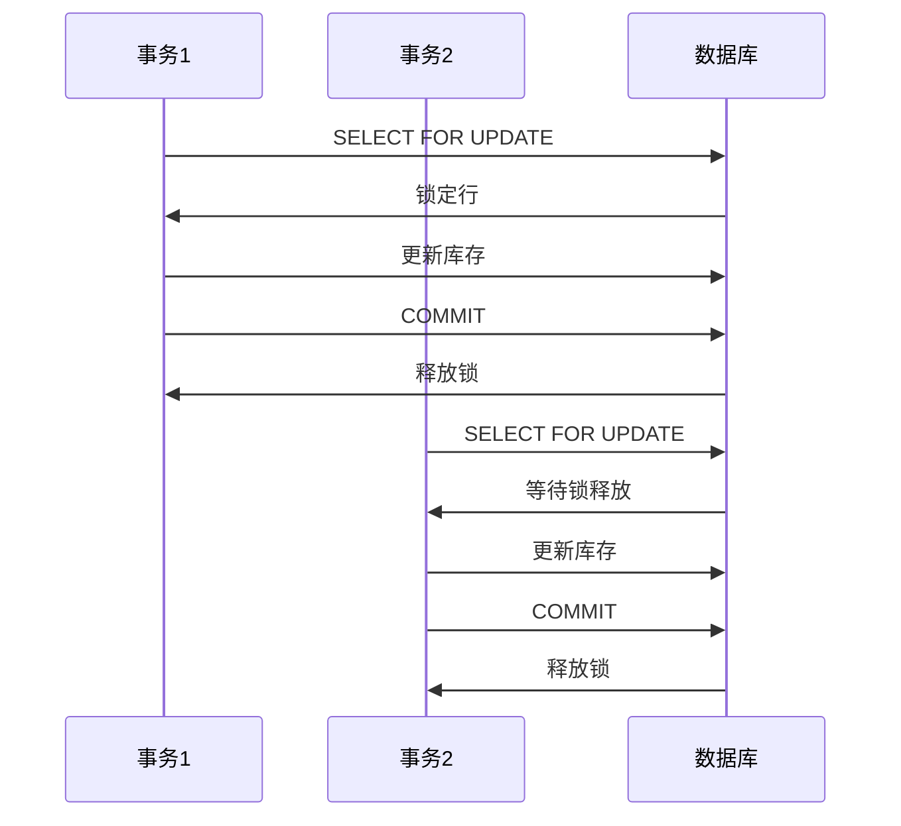

**图表来源**
- [services.py](file://backend/orders/services.py#L333-L372)

#### 库存同步机制

系统实现了多层次的库存同步策略：

| 同步类型 | 触发条件 | 同步频率 | 数据源 |
|---------|---------|---------|--------|
| 实时同步 | 商品购买时 | 单次 | 本地库存+海尔库存 |
| 定时同步 | 每日凌晨 | 每天一次 | 海尔API |
| 手动同步 | 管理员操作 | 按需 | 海尔API |
| 缓存同步 | 商品浏览时 | 按需 | Redis缓存 |

**章节来源**
- [services.py](file://backend/orders/services.py#L123-L217)

### 前端购物车服务

前端提供了完整的购物车操作API封装：

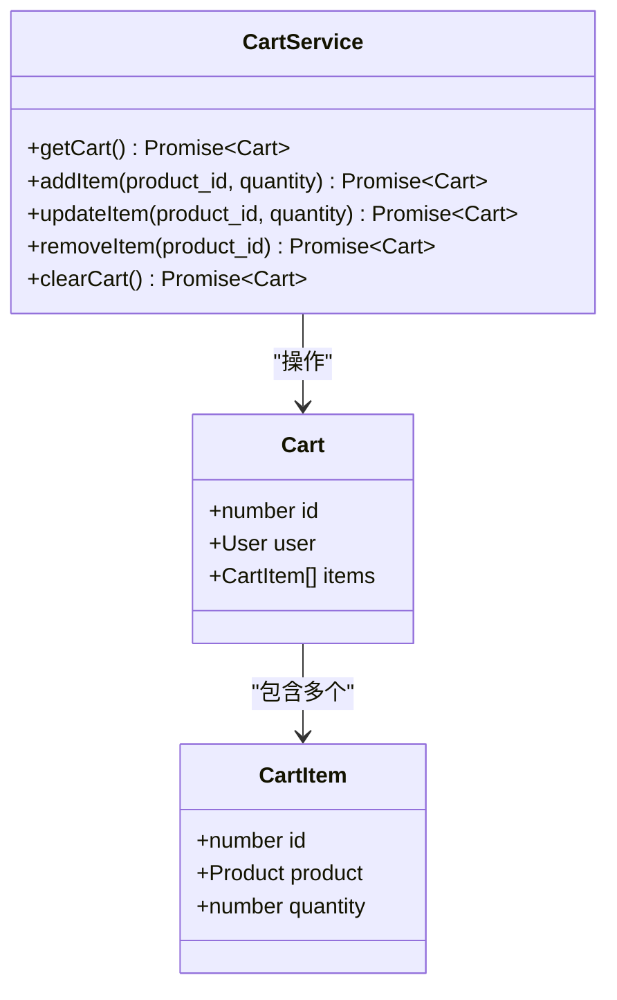

**图表来源**
- [cart.ts](file://frontend/src/services/cart.ts#L4-L44)

**章节来源**
- [cart.ts](file://frontend/src/services/cart.ts#L1-L45)

## 依赖关系分析

购物车系统的依赖关系体现了清晰的分层架构：

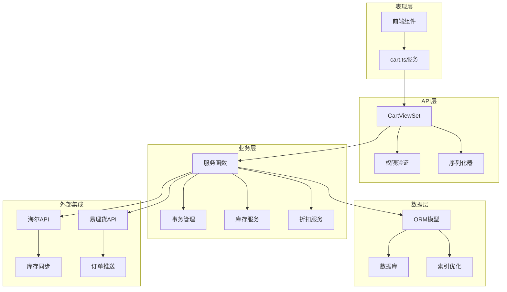

**图表来源**
- [views.py](file://backend/orders/views.py#L1-L20)
- [services.py](file://backend/orders/services.py#L1-L10)

**章节来源**
- [views.py](file://backend/orders/views.py#L1-L800)
- [services.py](file://backend/orders/services.py#L1-L500)

## 性能考虑

### 查询优化

系统采用了多种查询优化策略：

1. **预取关联数据**：使用`select_related`和`prefetch_related`减少数据库查询次数
2. **索引优化**：在关键字段上建立索引，提高查询效率
3. **缓存策略**：对频繁访问的数据实施缓存机制

### 并发处理

为了应对高并发场景，系统实现了以下优化：

1. **数据库行锁**：使用`SELECT FOR UPDATE`确保库存操作的原子性
2. **乐观锁**：在某些场景下使用版本号控制并发更新
3. **队列处理**：对于耗时操作，采用异步队列处理

## 故障排除指南

### 常见问题及解决方案

#### 库存同步问题

**问题描述**：购物车中的商品库存显示不准确

**解决方案**：
1. 检查海尔API连接状态
2. 验证商品库存数据同步
3. 查看库存同步日志

#### 购物车过期处理

系统提供了自动清理过期订单的功能：

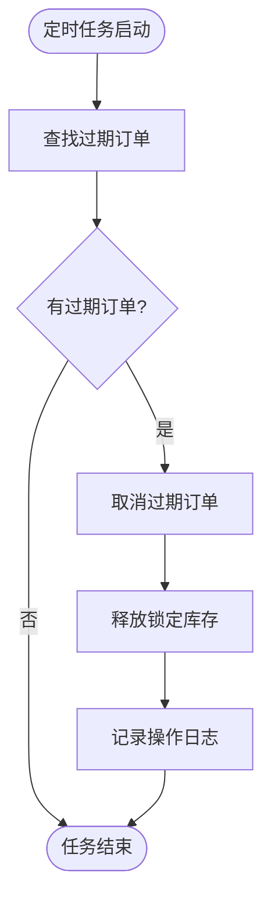

**图表来源**
- [cancel_unpaid_orders.py](file://backend/orders/management/commands/cancel_unpaid_orders.py#L55-L62)

#### 并发冲突处理

当遇到并发冲突时，系统会：
1. 自动重试操作
2. 提供详细的错误信息
3. 记录冲突日志便于排查

**章节来源**
- [cancel_unpaid_orders.py](file://backend/orders/management/commands/cancel_unpaid_orders.py#L1-L62)

## 结论

购物车管理系统是一个复杂但设计良好的电商核心功能模块。它通过合理的架构设计、完善的业务逻辑和强大的并发控制机制，确保了用户购物体验的流畅性和数据的一致性。

### 主要特性

1. **数据一致性**：通过数据库约束和事务处理确保数据完整性
2. **并发安全**：采用行锁和乐观锁机制处理高并发场景
3. **扩展性强**：模块化设计便于功能扩展和维护
4. **性能优化**：多层次的查询优化和缓存策略
5. **易于维护**：清晰的代码结构和完善的错误处理

### 最佳实践建议

1. **定期监控**：关注购物车操作的性能指标
2. **容量规划**：根据用户增长预测系统资源需求
3. **备份策略**：定期备份购物车数据以防意外丢失
4. **监控告警**：建立完善的监控和告警机制

该购物车管理系统为电商平台提供了稳定可靠的购物车功能基础，能够满足大多数电商场景的需求，并具备良好的扩展性和维护性。