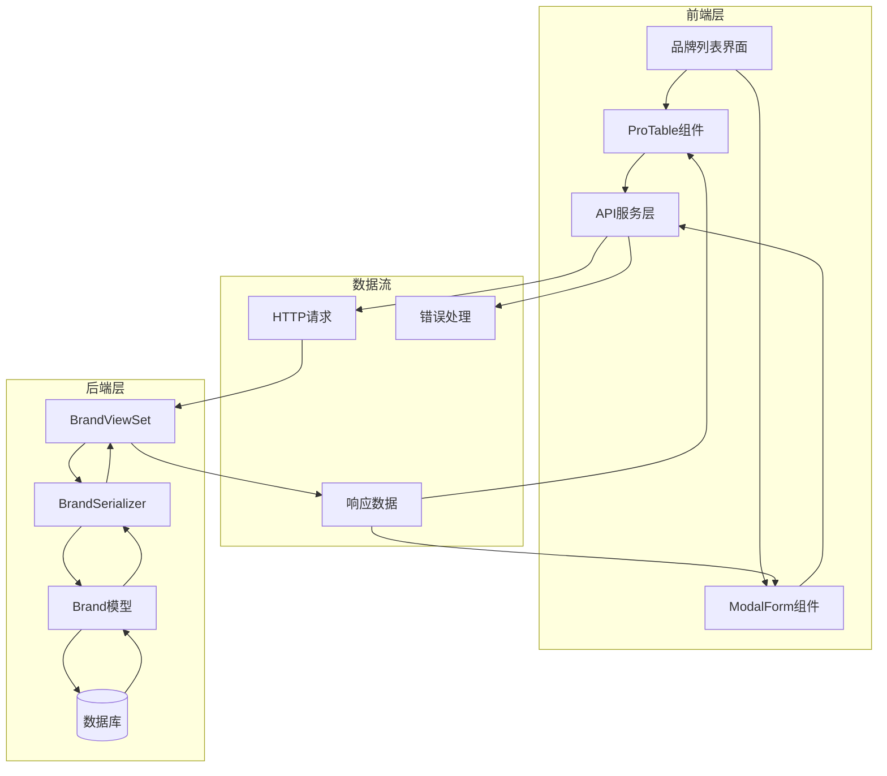
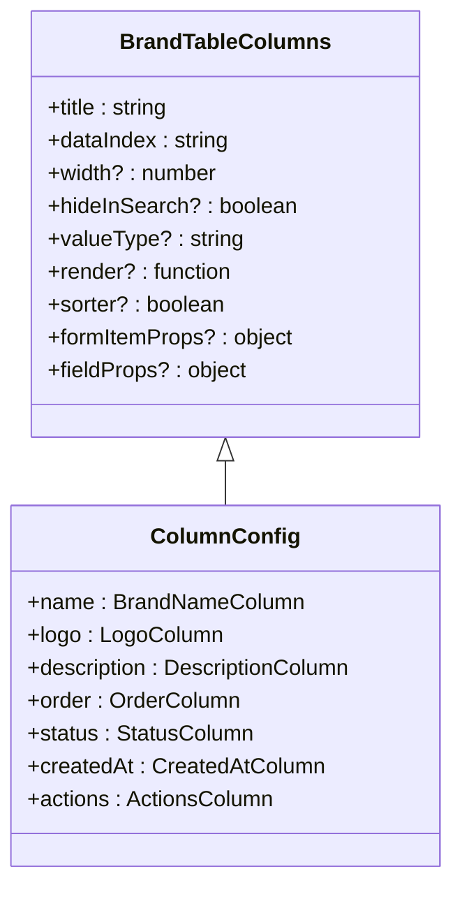
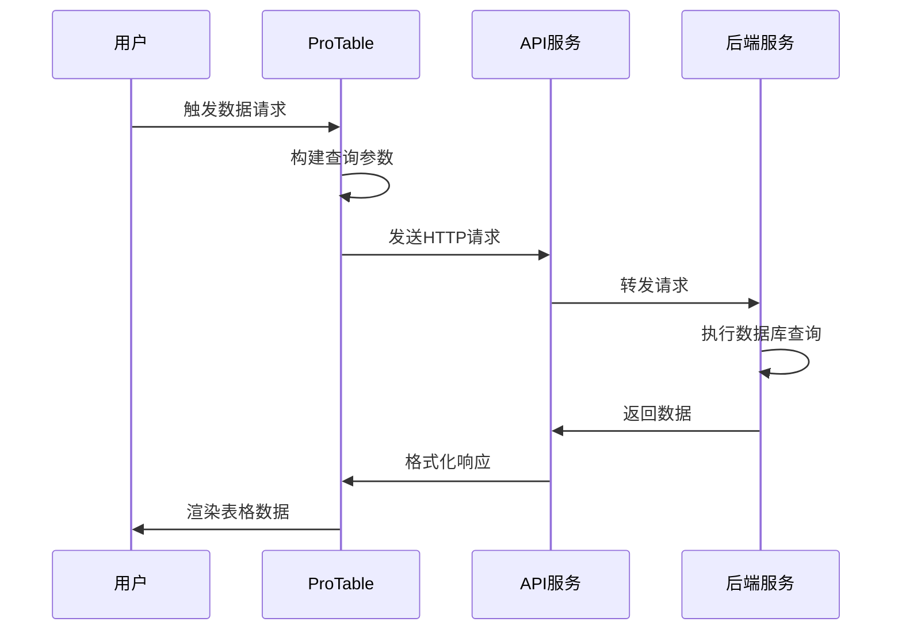
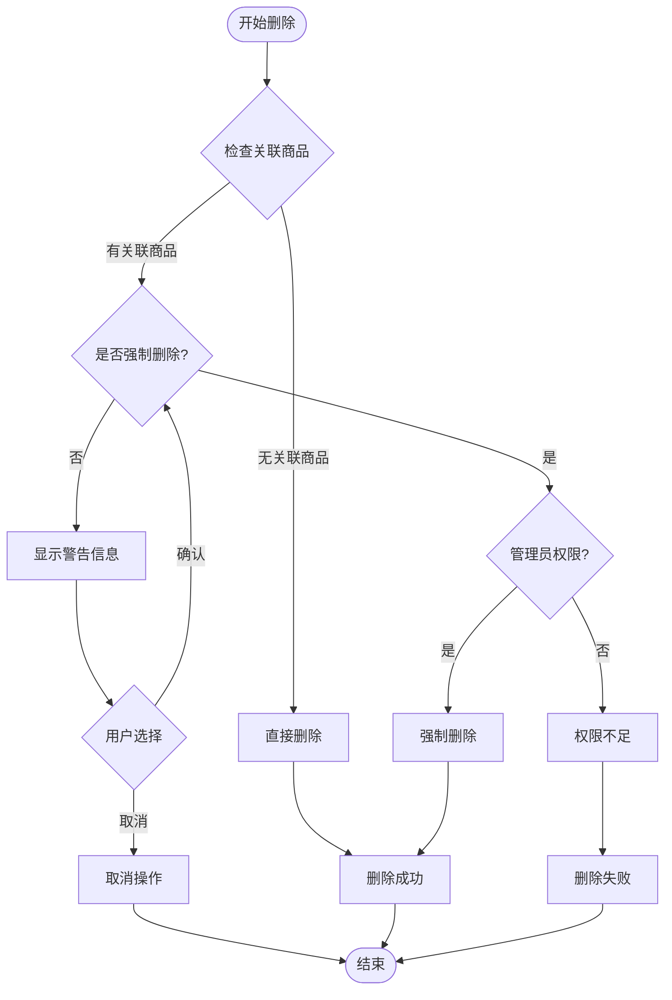
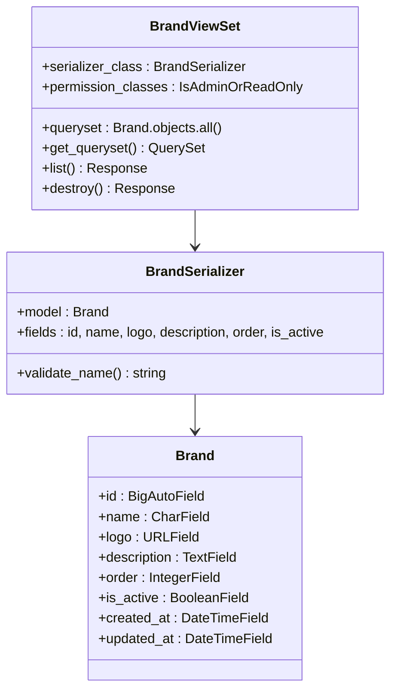
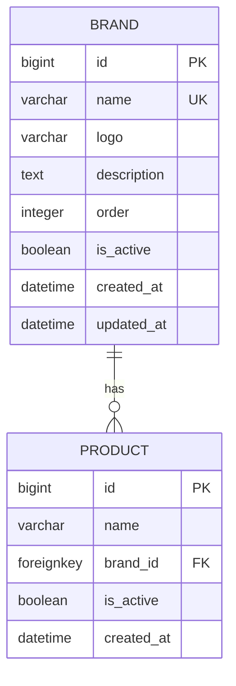
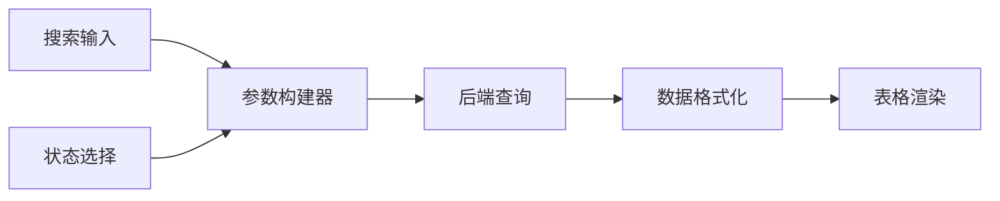
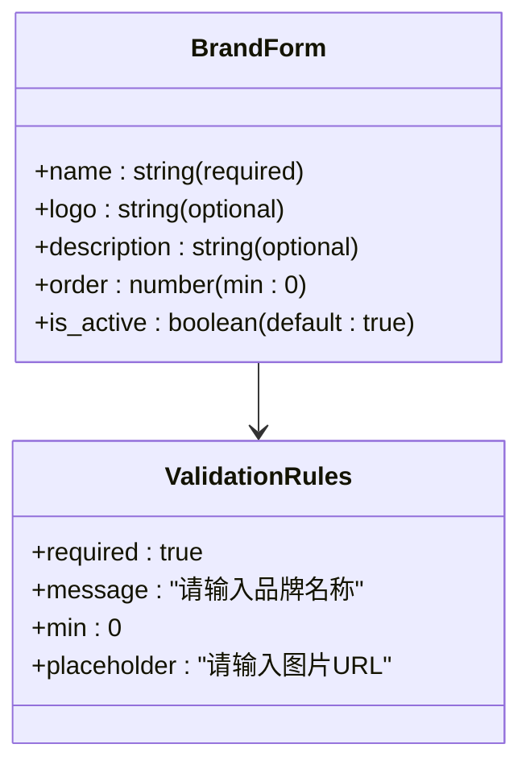

# 品牌列表功能详细文档

<cite>
**本文档引用的文件**
- [merchant/src/pages/Brands/index.tsx](file://merchant/src/pages/Brands/index.tsx)
- [merchant/src/services/api.ts](file://merchant/src/services/api.ts)
- [frontend/src/services/brand.ts](file://frontend/src/services/brand.ts)
- [frontend/src/types/index.ts](file://frontend/src/types/index.ts)
- [backend/catalog/views.py](file://backend/catalog/views.py)
- [backend/catalog/models.py](file://backend/catalog/models.py)
- [backend/catalog/serializers.py](file://backend/catalog/serializers.py)
- [merchant/src/utils/request.ts](file://merchant/src/utils/request.ts)
</cite>

## 目录
1. [功能概述](#功能概述)
2. [系统架构](#系统架构)
3. [前端实现](#前端实现)
4. [后端实现](#后端实现)
5. [数据模型](#数据模型)
6. [API接口](#api接口)
7. [核心功能详解](#核心功能详解)
8. [性能优化](#性能优化)
9. [使用指南](#使用指南)
10. [故障排除](#故障排除)

## 功能概述

品牌列表功能是商户后台管理系统的核心模块之一，提供完整的品牌管理能力。该功能基于Ant Design Pro框架构建，采用现代化的表格组件实现数据展示、搜索、筛选和操作功能。

### 主要特性
- **可视化表格展示**：以表格形式展示品牌信息，包含品牌名称、LOGO、描述、排序、状态和创建时间等关键字段
- **智能搜索功能**：支持按品牌名称进行模糊搜索，提升用户体验
- **多维筛选**：支持按品牌状态（启用/禁用）进行条件筛选
- **实时数据请求**：集成ProTable组件实现动态数据加载和分页
- **安全删除机制**：具备关联商品检查和二次确认功能
- **响应式设计**：适配不同屏幕尺寸，确保良好的移动端体验

## 系统架构



**图表来源**
- [merchant/src/pages/Brands/index.tsx](file://merchant/src/pages/Brands/index.tsx#L1-L189)
- [backend/catalog/views.py](file://backend/catalog/views.py#L589-L675)

## 前端实现

### 组件结构

品牌列表页面采用React函数组件模式，主要包含以下核心部分：

#### 列表表格配置
表格列定义涵盖了品牌管理所需的所有关键信息：



**图表来源**
- [merchant/src/pages/Brands/index.tsx](file://merchant/src/pages/Brands/index.tsx#L35-L101)

#### 数据请求处理
前端通过ProTable组件实现智能数据请求，支持动态参数传递和响应格式转换：



**图表来源**
- [merchant/src/pages/Brands/index.tsx](file://merchant/src/pages/Brands/index.tsx#L110-L138)
- [merchant/src/services/api.ts](file://merchant/src/services/api.ts#L16-L21)

**章节来源**
- [merchant/src/pages/Brands/index.tsx](file://merchant/src/pages/Brands/index.tsx#L1-L189)
- [merchant/src/services/api.ts](file://merchant/src/services/api.ts#L1-L66)

### 搜索与筛选功能

#### 品牌名称搜索
支持按品牌名称进行模糊匹配，使用`icontains`查询实现：

- **输入验证**：提供占位符提示用户输入搜索关键词
- **实时响应**：支持即时搜索结果更新
- **参数传递**：自动将搜索词转换为`search`查询参数

#### 状态筛选
提供启用/禁用状态的下拉筛选器：

- **枚举配置**：预定义状态选项和视觉标识
- **标签渲染**：使用绿色/红色标签直观显示状态
- **布尔值处理**：自动转换为布尔类型进行数据库查询

**章节来源**
- [merchant/src/pages/Brands/index.tsx](file://merchant/src/pages/Brands/index.tsx#L35-L80)

### 删除功能实现

#### 关联商品检查机制
删除功能包含智能的安全检查：



**图表来源**
- [merchant/src/pages/Brands/index.tsx](file://merchant/src/pages/Brands/index.tsx#L13-L33)
- [backend/catalog/views.py](file://backend/catalog/views.py#L634-L674)

#### 二次确认弹窗
当检测到关联商品时，系统会显示确认对话框：

- **信息提示**：明确告知关联商品数量
- **操作选项**：提供强制删除和取消两个选项
- **视觉区分**：强制删除按钮使用危险色标示

**章节来源**
- [merchant/src/pages/Brands/index.tsx](file://merchant/src/pages/Brands/index.tsx#L13-L33)

## 后端实现

### 视图集配置

后端采用Django REST Framework的ViewSet模式，提供完整的CRUD操作：



**图表来源**
- [backend/catalog/views.py](file://backend/catalog/views.py#L589-L675)
- [backend/catalog/serializers.py](file://backend/catalog/serializers.py#L22-L48)
- [backend/catalog/models.py](file://backend/catalog/models.py#L21-L40)

### 搜索功能实现

#### 模糊搜索逻辑
后端支持按品牌名称进行模糊搜索：

- **查询参数解析**：自动识别`search`参数
- **SQL查询优化**：使用`icontains`实现不区分大小写的模糊匹配
- **索引利用**：通过数据库索引提升查询性能

#### 状态过滤
支持按品牌状态进行精确过滤：

- **布尔值转换**：自动将字符串参数转换为布尔值
- **空值处理**：优雅处理无效的状态参数
- **组合查询**：支持多个筛选条件的组合使用

**章节来源**
- [backend/catalog/views.py](file://backend/catalog/views.py#L613-L625)
- [backend/catalog/views.py](file://backend/catalog/views.py#L634-L674)

### 安全机制

#### 权限控制
- **只读访问**：GET请求允许公开访问
- **写入限制**：POST、PUT、DELETE操作仅限管理员
- **强制删除权限**：强制删除功能需要管理员身份验证

#### 数据验证
- **名称必填**：品牌名称不能为空
- **唯一性约束**：品牌名称在数据库中必须唯一
- **URL验证**：LOGO字段支持有效的URL格式

**章节来源**
- [backend/catalog/views.py](file://backend/catalog/views.py#L596-L598)
- [backend/catalog/serializers.py](file://backend/catalog/serializers.py#L43-L47)

## 数据模型

### 品牌模型结构



**图表来源**
- [backend/catalog/models.py](file://backend/catalog/models.py#L21-L40)

### 字段说明

| 字段名 | 类型 | 约束 | 描述 |
|--------|------|------|------|
| id | BigAutoField | 主键 | 品牌唯一标识符 |
| name | CharField | 非空、唯一 | 品牌名称 |
| logo | URLField | 可选 | 品牌Logo图片URL |
| description | TextField | 可选 | 品牌详细描述 |
| order | IntegerField | 默认0 | 显示顺序 |
| is_active | BooleanField | 默认True | 是否启用状态 |
| created_at | DateTimeField | 自动设置 | 创建时间 |
| updated_at | DateTimeField | 自动更新 | 最后修改时间 |

### 索引优化

- **复合索引**：`(is_active, order)`提升常用查询性能
- **时间索引**：按创建时间排序支持历史记录查询
- **唯一约束**：品牌名称唯一避免重复

**章节来源**
- [backend/catalog/models.py](file://backend/catalog/models.py#L21-L40)

## API接口

### 接口规范

#### 获取品牌列表
```
GET /api/brands/
```

**查询参数**：
- `search`：品牌名称模糊搜索
- `is_active`：状态筛选（true/false）

**响应格式**：
```typescript
{
  results: Brand[],
  total: number,
  page: number,
  total_pages: number,
  has_next: boolean,
  has_previous: boolean
}
```

#### 创建品牌
```
POST /api/brands/
```

**请求体**：
```typescript
{
  name: string,
  logo?: string,
  description?: string,
  order?: number,
  is_active?: boolean
}
```

#### 更新品牌
```
PATCH /api/brands/{id}/
```

#### 删除品牌
```
DELETE /api/brands/{id}/?force_delete={boolean}
```

**查询参数**：
- `force_delete`：强制删除标志（管理员专用）

**章节来源**
- [merchant/src/services/api.ts](file://merchant/src/services/api.ts#L16-L21)
- [frontend/src/services/brand.ts](file://frontend/src/services/brand.ts#L1-L16)

### 错误处理

#### 删除失败场景
- **关联商品存在**：返回关联商品数量和建议
- **权限不足**：强制删除需要管理员权限
- **网络异常**：统一的错误消息提示

**章节来源**
- [merchant/src/services/api.ts](file://merchant/src/services/api.ts#L16-L21)

## 核心功能详解

### 表格设计

#### 列配置详解

| 列名 | 数据字段 | 特性 | 实现方式 |
|------|----------|------|----------|
| 品牌名称 | name | 支持搜索 | ProFormText + 模糊匹配 |
| Logo | logo | 图片展示 | 自定义渲染函数 |
| 描述 | description | 文本省略 | ellipsis属性 |
| 排序 | order | 数值排序 | sorter属性 |
| 状态 | is_active | 下拉筛选 | valueType: select |
| 创建时间 | created_at | 日期格式 | valueType: dateTime |
| 操作 | - | 编辑删除 | 固定右侧列 |

#### 响应式设计
- **固定列宽**：Logo列固定100px，操作列固定150px
- **弹性布局**：描述列支持文本省略和换行
- **移动端适配**：自动隐藏非关键列

**章节来源**
- [merchant/src/pages/Brands/index.tsx](file://merchant/src/pages/Brands/index.tsx#L35-L101)

### 数据请求流程

#### 请求参数映射
前端ProTable组件自动将搜索条件映射为后端查询参数：



**图表来源**
- [merchant/src/pages/Brands/index.tsx](file://merchant/src/pages/Brands/index.tsx#L110-L138)

#### 响应数据转换
后端返回的数据需要转换为ProTable期望的格式：

- **数组检测**：自动识别返回数据类型
- **字段映射**：将`results`字段映射为`data`
- **分页信息**：计算总条数和分页状态

**章节来源**
- [merchant/src/pages/Brands/index.tsx](file://merchant/src/pages/Brands/index.tsx#L125-L138)

### 表单验证

#### 新增/编辑表单
使用ModalForm组件实现品牌信息的创建和编辑：



**图表来源**
- [merchant/src/pages/Brands/index.tsx](file://merchant/src/pages/Brands/index.tsx#L159-L185)

#### 验证规则
- **品牌名称**：必填字段，不能为空
- **排序数值**：非负整数
- **状态开关**：布尔值，默认启用
- **LOGO URL**：可选，支持图片链接

**章节来源**
- [merchant/src/pages/Brands/index.tsx](file://merchant/src/pages/Brands/index.tsx#L180-L184)

## 性能优化

### 前端优化策略

#### 数据缓存
- **请求去重**：避免重复发送相同查询
- **状态管理**：使用React状态管理减少不必要的重渲染
- **懒加载**：按需加载表格数据

#### 渲染优化
- **虚拟滚动**：支持大量数据的高效渲染
- **列宽固定**：减少DOM重排
- **图片懒加载**：延迟加载品牌Logo图片

### 后端优化策略

#### 查询优化
- **索引利用**：合理使用数据库索引
- **查询限制**：设置合理的分页大小
- **缓存策略**：缓存频繁访问的品牌数据

#### 数据库优化
- **连接池**：使用数据库连接池提高并发性能
- **事务管理**：合理使用事务保证数据一致性
- **批量操作**：支持批量删除和更新操作

**章节来源**
- [backend/catalog/views.py](file://backend/catalog/views.py#L52-L67)

## 使用指南

### 新手使用指南

#### 进入品牌列表页面
1. 登录商户后台管理系统
2. 在左侧导航栏找到"品牌管理"菜单
3. 点击进入品牌列表页面

#### 基本操作
- **新增品牌**：点击右上角"新增品牌"按钮
- **编辑品牌**：在操作列点击"编辑"按钮
- **删除品牌**：在操作列点击"删除"按钮（注意关联商品检查）

#### 搜索和筛选
- **品牌搜索**：在表格顶部输入品牌名称进行模糊搜索
- **状态筛选**：使用状态下拉菜单筛选启用/禁用品牌

### 高级功能

#### 批量操作
- **全选功能**：支持批量选择多个品牌
- **批量删除**：选择多个品牌后执行批量删除
- **状态批量修改**：支持批量启用或禁用品牌

#### 导出功能
- **数据导出**：支持将当前筛选结果导出为Excel文件
- **格式定制**：可选择导出字段和格式选项

### 最佳实践

#### 品牌命名规范
- 使用简洁明了的品牌名称
- 避免使用特殊字符和过长的名称
- 确保品牌名称的唯一性

#### LOGO设计建议
- 使用高质量的图片文件
- 推荐使用PNG格式保持透明背景
- 图片尺寸建议为100x100像素

## 故障排除

### 常见问题及解决方案

#### 数据加载失败
**症状**：品牌列表空白或显示加载错误
**可能原因**：
- 网络连接问题
- 后端服务异常
- 权限认证失效

**解决方法**：
1. 检查网络连接状态
2. 刷新页面重新加载数据
3. 重新登录系统验证权限

#### 搜索功能异常
**症状**：搜索无结果或搜索结果不准确
**可能原因**：
- 搜索参数格式错误
- 数据库索引问题
- 字符编码问题

**解决方法**：
1. 检查搜索关键词的拼写
2. 尝试使用更短的关键词
3. 清除浏览器缓存后重试

#### 删除操作失败
**症状**：删除品牌时提示关联商品存在
**可能原因**：
- 品牌下有关联的商品
- 权限不足尝试强制删除
- 数据库事务冲突

**解决方法**：
1. 先删除或转移关联商品
2. 联系管理员获得强制删除权限
3. 等待系统清理后重试

### 性能问题诊断

#### 页面加载缓慢
**诊断步骤**：
1. 检查网络带宽和延迟
2. 查看浏览器开发者工具的网络面板
3. 监控服务器CPU和内存使用率

**优化建议**：
- 减少同时加载的品牌数量
- 使用更高效的搜索算法
- 实施数据分页加载

#### 搜索响应慢
**诊断步骤**：
1. 分析数据库查询执行计划
2. 检查索引是否正确使用
3. 监控数据库连接池状态

**优化建议**：
- 添加适当的数据库索引
- 优化查询语句结构
- 实施查询结果缓存

**章节来源**
- [merchant/src/pages/Brands/index.tsx](file://merchant/src/pages/Brands/index.tsx#L135-L137)
- [backend/catalog/views.py](file://backend/catalog/views.py#L645-L674)