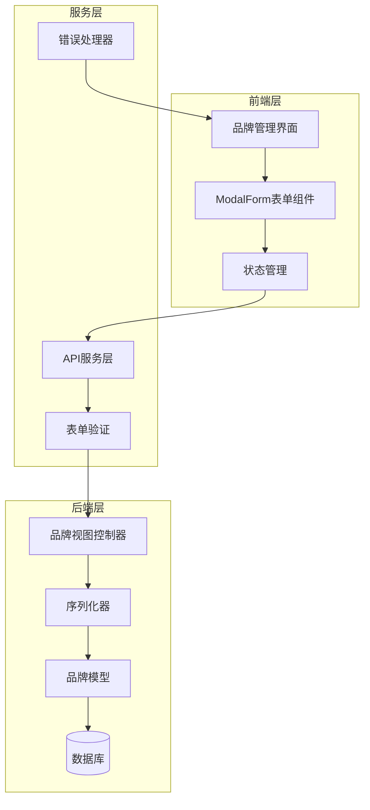
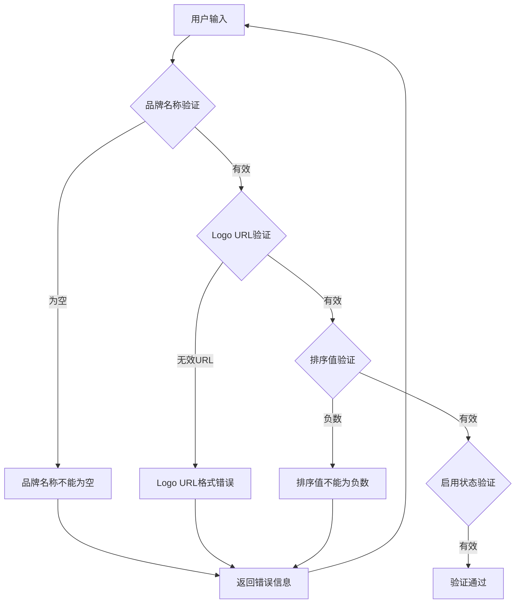
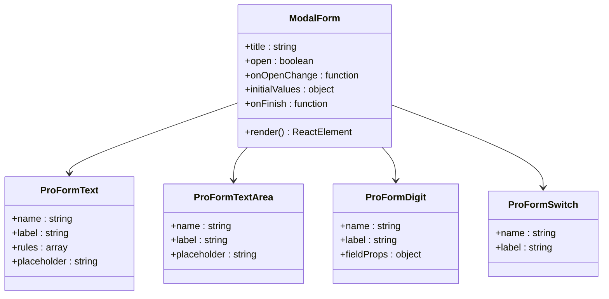
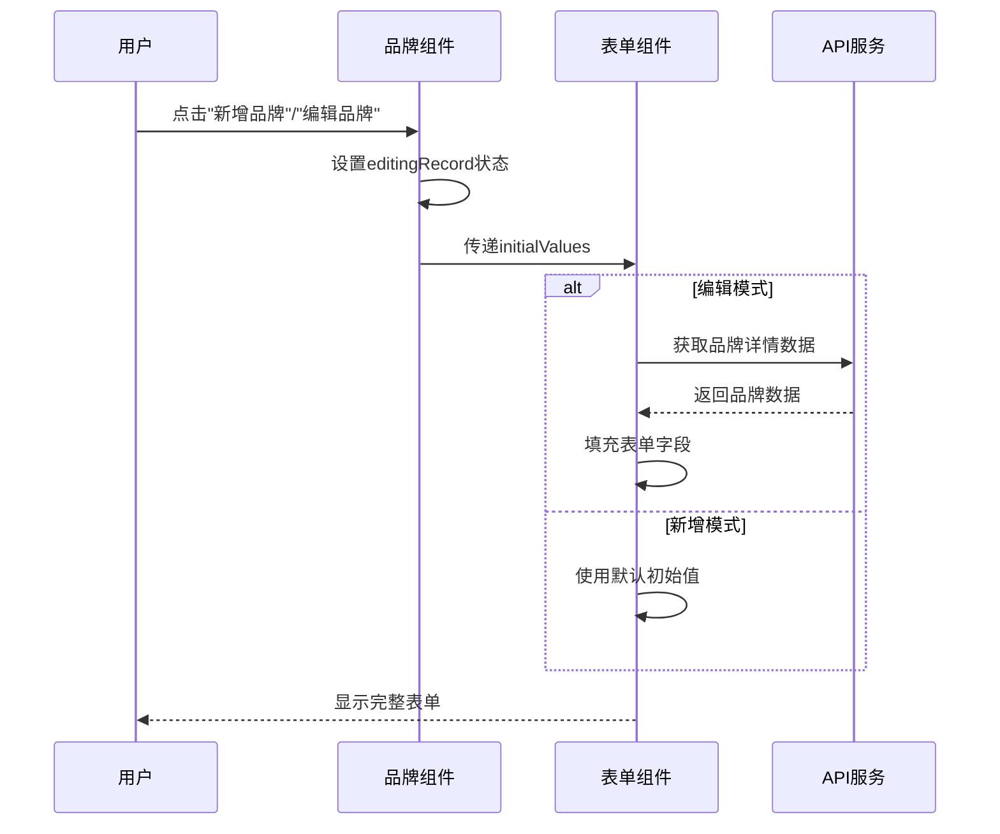
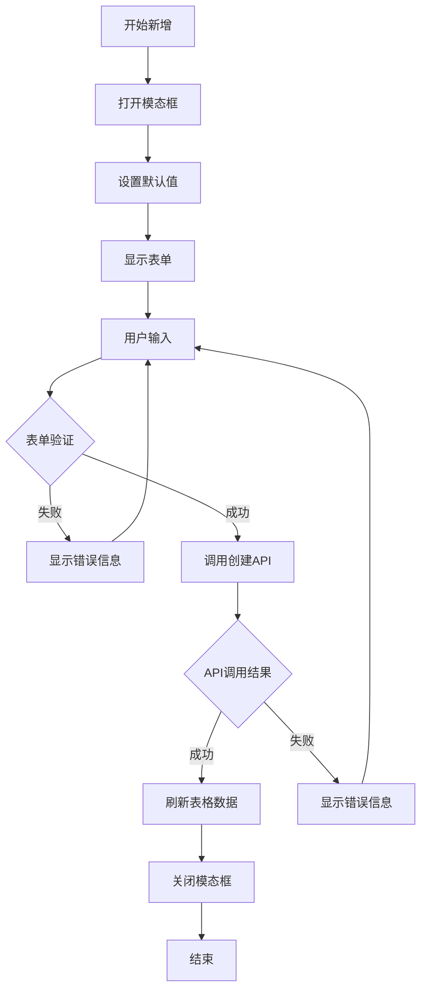
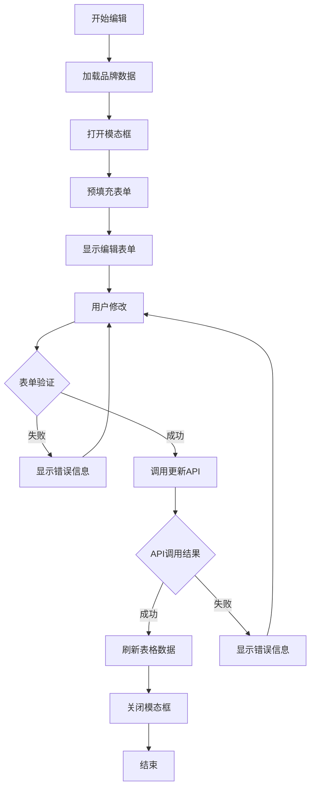
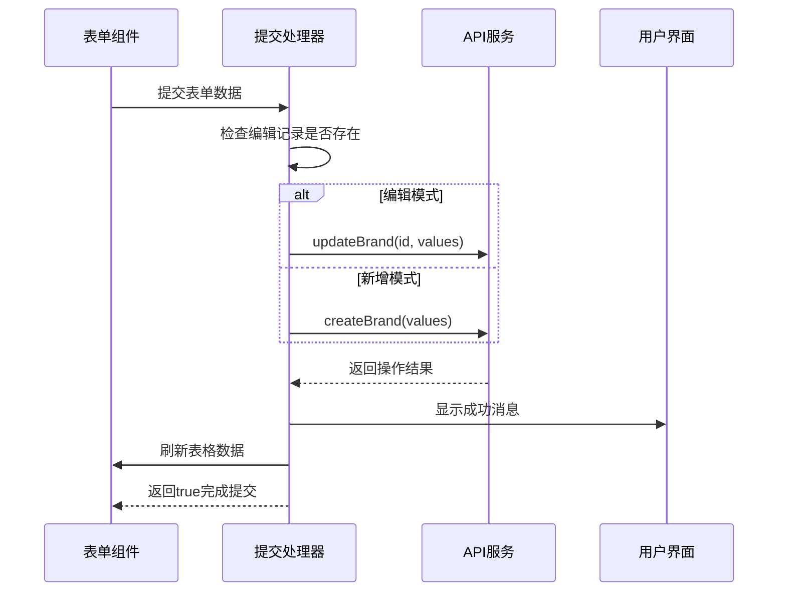
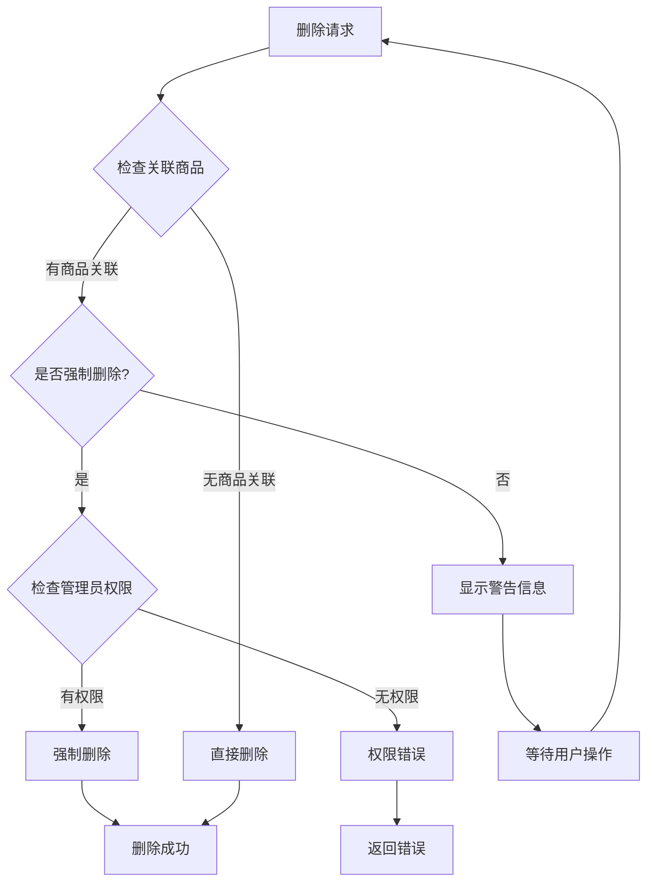
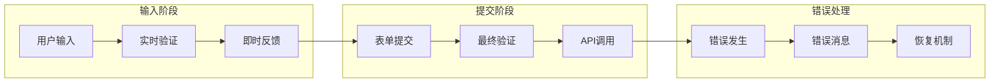
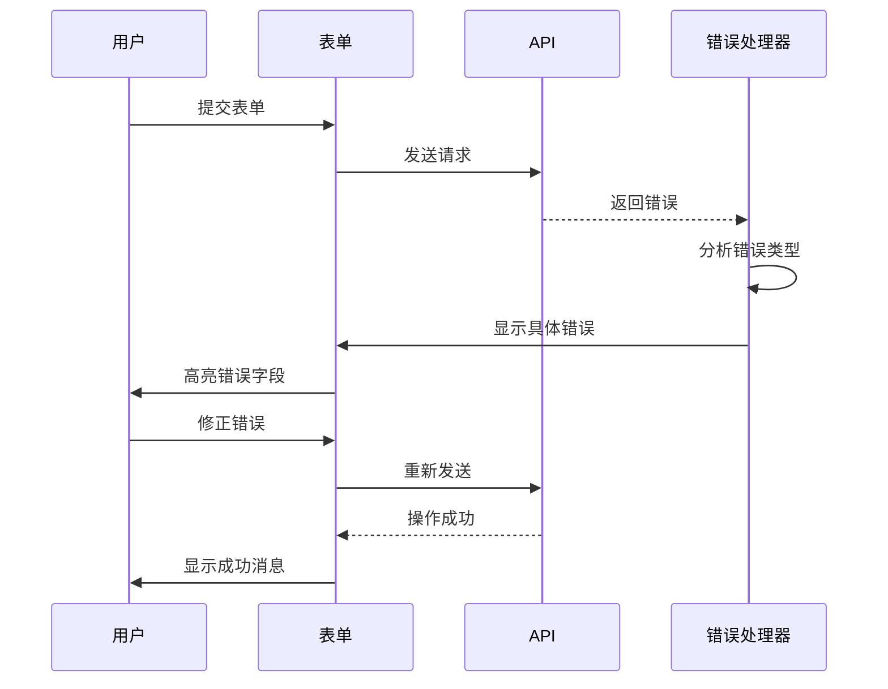

# 品牌创建与编辑功能详细文档

<cite>
**本文档引用的文件**
- [merchant/src/pages/Brands/index.tsx](file://merchant/src/pages/Brands/index.tsx)
- [merchant/src/services/api.ts](file://merchant/src/services/api.ts)
- [frontend/src/services/brand.ts](file://frontend/src/services/brand.ts)
- [frontend/src/types/index.ts](file://frontend/src/types/index.ts)
- [backend/catalog/models.py](file://backend/catalog/models.py)
- [backend/catalog/serializers.py](file://backend/catalog/serializers.py)
- [backend/catalog/views.py](file://backend/catalog/views.py)
- [merchant/src/utils/request.ts](file://merchant/src/utils/request.ts)
</cite>

## 目录
1. [项目概述](#项目概述)
2. [系统架构](#系统架构)
3. [品牌数据模型](#品牌数据模型)
4. [前端表单设计](#前端表单设计)
5. [表单操作流程](#表单操作流程)
6. [API接口设计](#api接口设计)
7. [错误处理与验证](#错误处理与验证)
8. [最佳实践指南](#最佳实践指南)
9. [故障排除](#故障排除)
10. [总结](#总结)

## 项目概述

本文档详细介绍了一个基于React和Ant Design Pro的企业级品牌管理系统中的品牌创建与编辑功能。该系统采用前后端分离架构，前端使用React技术栈，后端使用Django REST Framework构建RESTful API。

### 核心特性

- **统一的模态框表单**：新增和编辑品牌共享同一套表单组件
- **完整的表单验证**：前端和后端双重验证机制
- **智能初始化逻辑**：根据操作模式自动设置表单初始值
- **实时状态管理**：使用React Hooks进行状态同步
- **优雅的错误处理**：提供用户友好的错误提示和恢复机制

## 系统架构

**图表来源**
- [merchant/src/pages/Brands/index.tsx](file://merchant/src/pages/Brands/index.tsx#L1-L189)
- [merchant/src/services/api.ts](file://merchant/src/services/api.ts#L1-L66)

## 品牌数据模型

### 数据结构定义

品牌系统的核心数据模型包含以下关键字段：

| 字段名 | 类型 | 长度限制 | 是否必填 | 默认值 | 描述 |
|--------|------|----------|----------|--------|------|
| name | String | 100字符 | 是 | - | 品牌名称，必须唯一且不能为空 |
| logo | URL | 500字符 | 否 | '' | 品牌Logo的URL地址 |
| description | Text | 无限制 | 否 | '' | 品牌详细描述信息 |
| order | Integer | - | 否 | 0 | 显示排序权重，数值越小越靠前 |
| is_active | Boolean | - | 否 | true | 是否启用状态，影响前台展示 |

### 后端验证规则

**图表来源**
- [backend/catalog/serializers.py](file://backend/catalog/serializers.py#L22-L47)
- [backend/catalog/models.py](file://backend/catalog/models.py#L21-L30)

**章节来源**
- [frontend/src/types/index.ts](file://frontend/src/types/index.ts#L58-L66)
- [backend/catalog/models.py](file://backend/catalog/models.py#L21-L30)
- [backend/catalog/serializers.py](file://backend/catalog/serializers.py#L22-L47)

## 前端表单设计

### ModalForm组件配置

系统使用Ant Design Pro的ModalForm组件实现品牌表单的弹出式编辑功能：

**图表来源**
- [merchant/src/pages/Brands/index.tsx](file://merchant/src/pages/Brands/index.tsx#L159-L185)

### 表单字段配置

| 字段名 | 组件类型 | 验证规则 | 默认值 | 用途说明 |
|--------|----------|----------|--------|----------|
| name | ProFormText | required: true, message: '请输入品牌名称' | - | 品牌唯一标识符 |
| logo | ProFormText | - | '' | 品牌视觉标识 |
| description | ProFormTextArea | - | '' | 品牌详细信息 |
| order | ProFormDigit | min: 0 | 0 | 排序权重 |
| is_active | ProFormSwitch | - | true | 启用状态控制 |

### 初始值设置逻辑

**图表来源**
- [merchant/src/pages/Brands/index.tsx](file://merchant/src/pages/Brands/index.tsx#L163-L164)

**章节来源**
- [merchant/src/pages/Brands/index.tsx](file://merchant/src/pages/Brands/index.tsx#L159-L185)

## 表单操作流程

### 新增品牌流程

### 编辑品牌流程

**图表来源**
- [merchant/src/pages/Brands/index.tsx](file://merchant/src/pages/Brands/index.tsx#L164-L178)

### 表单提交处理

表单的onFinish回调函数实现了统一的提交处理逻辑：

**图表来源**
- [merchant/src/pages/Brands/index.tsx](file://merchant/src/pages/Brands/index.tsx#L164-L178)

**章节来源**
- [merchant/src/pages/Brands/index.tsx](file://merchant/src/pages/Brands/index.tsx#L164-L178)

## API接口设计

### 后端API端点

| HTTP方法 | 端点路径 | 功能描述 | 请求参数 | 响应格式 |
|----------|----------|----------|----------|----------|
| GET | /brands/ | 获取品牌列表 | search, is_active | JSON数组 |
| POST | /brands/ | 创建新品牌 | 品牌数据对象 | 品牌对象 |
| PATCH | /brands/{id}/ | 更新品牌信息 | 品牌ID, 更新数据 | 品牌对象 |
| DELETE | /brands/{id}/ | 删除品牌 | 品牌ID, force_delete | 状态码 |

### 删除保护机制

系统实现了智能的品牌删除保护机制：

**图表来源**
- [backend/catalog/views.py](file://backend/catalog/views.py#L646-L674)

### 错误响应格式

系统定义了标准化的错误响应格式：

| 字段名 | 类型 | 描述 |
|--------|------|------|
| error | string | 错误类型标识 |
| message | string | 人类可读的错误描述 |
| associated_products_count | integer | 关联商品数量（删除保护时） |
| suggestion | string | 解决方案建议 |

**章节来源**
- [merchant/src/services/api.ts](file://merchant/src/services/api.ts#L16-L21)
- [backend/catalog/views.py](file://backend/catalog/views.py#L646-L674)

## 错误处理与验证

### 前端验证策略

### 后端验证规则

系统在多个层面实施验证：

1. **模型级验证**：Django模型字段约束
2. **序列化器验证**：DRF序列化器自定义验证
3. **视图级验证**：业务逻辑验证
4. **数据库约束**：唯一性约束等

### 错误恢复机制

**章节来源**
- [backend/catalog/serializers.py](file://backend/catalog/serializers.py#L43-L47)
- [merchant/src/utils/request.ts](file://merchant/src/utils/request.ts#L23-L35)

## 最佳实践指南

### 开发者最佳实践

#### 1. 表单设计原则
- **一致性**：新增和编辑使用相同的表单组件
- **用户体验**：提供清晰的验证提示和错误信息
- **性能优化**：合理使用initialValues避免不必要的API调用

#### 2. 状态管理
- **单一数据源**：使用editingRecord作为唯一数据源
- **状态同步**：及时更新组件状态与API响应
- **内存管理**：及时清理不需要的状态数据

#### 3. 错误处理
- **用户友好**：提供具体的错误描述而非技术术语
- **渐进式增强**：从简单到复杂的错误处理策略
- **日志记录**：记录错误以便后续分析

### 新手操作指南

#### 创建新品牌的步骤

1. **访问品牌管理页面**
   - 导航到品牌管理模块
   - 查看现有的品牌列表

2. **启动创建流程**
   - 点击"新增品牌"按钮
   - 系统打开品牌创建模态框

3. **填写品牌信息**
   - 输入品牌名称（必填）
   - 可选：上传品牌Logo
   - 可选：编写品牌描述
   - 设置显示顺序
   - 选择启用状态

4. **提交表单**
   - 点击"保存"按钮
   - 系统进行验证
   - 验证通过后创建品牌

5. **确认结果**
   - 查看成功消息
   - 刷新列表查看新品牌

#### 编辑品牌的步骤

1. **选择要编辑的品牌**
   - 在品牌列表中找到目标品牌
   - 点击"编辑"操作按钮

2. **修改品牌信息**
   - 模态框自动填充现有数据
   - 修改需要变更的信息
   - 保留不需要变更的字段

3. **保存更改**
   - 点击"保存"按钮
   - 系统验证修改内容
   - 更新品牌信息

4. **验证结果**
   - 查看更新成功的确认消息
   - 在列表中验证修改效果

### 性能优化建议

#### 1. 表单渲染优化
- 使用React.memo包装表单组件
- 实现条件渲染减少不必要的DOM更新
- 合理使用key属性提升列表渲染性能

#### 2. API调用优化
- 实现请求去重机制
- 使用缓存减少重复请求
- 批量处理API调用

#### 3. 内存管理
- 及时清理事件监听器
- 避免内存泄漏
- 合理使用useEffect依赖数组

## 故障排除

### 常见问题及解决方案

#### 1. 表单验证失败

**问题现象**：表单提交时出现验证错误

**可能原因**：
- 品牌名称为空或重复
- Logo URL格式不正确
- 排序值为负数

**解决步骤**：
1. 检查品牌名称是否唯一且非空
2. 验证Logo URL的有效性
3. 确认排序值为非负整数

#### 2. API调用失败

**问题现象**：提交表单后没有响应或出现网络错误

**可能原因**：
- 网络连接问题
- 后端服务异常
- 权限不足

**解决步骤**：
1. 检查网络连接状态
2. 查看浏览器开发者工具的网络面板
3. 确认用户权限级别

#### 3. 删除品牌失败

**问题现象**：尝试删除品牌时收到错误提示

**可能原因**：
- 品牌有关联的商品
- 用户权限不足
- 强制删除参数错误

**解决步骤**：
1. 检查品牌是否有相关联的商品
2. 确认用户具有管理员权限
3. 正确使用force_delete参数

### 调试技巧

#### 1. 前端调试
- 使用React DevTools检查组件状态
- 在浏览器控制台查看API响应
- 使用Redux DevTools监控状态变化

#### 2. 后端调试
- 查看Django日志文件
- 使用Postman测试API端点
- 检查数据库约束和索引

#### 3. 网络调试
- 使用浏览器网络面板
- 检查请求头和响应头
- 分析请求参数和响应数据

**章节来源**
- [merchant/src/utils/request.ts](file://merchant/src/utils/request.ts#L23-L35)
- [backend/catalog/views.py](file://backend/catalog/views.py#L646-L674)

## 总结

本文档全面介绍了品牌创建与编辑功能的设计与实现。该系统通过以下核心特性提供了优秀的用户体验和开发体验：

### 技术亮点

1. **统一的表单设计**：新增和编辑共享同一套表单组件，减少了代码重复和维护成本
2. **智能的状态管理**：通过editingRecord状态实现了灵活的表单初始化逻辑
3. **完善的验证机制**：前后端双重验证确保数据完整性
4. **优雅的错误处理**：提供用户友好的错误提示和恢复机制
5. **安全的删除保护**：防止意外删除有关联数据的品牌

### 架构优势

- **模块化设计**：清晰的分层架构便于扩展和维护
- **类型安全**：TypeScript提供了强类型支持
- **组件复用**：可复用的组件提高了开发效率
- **性能优化**：合理的状态管理和渲染优化

### 应用价值

该品牌管理系统不仅满足了基本的CRUD操作需求，还通过以下方式提升了应用价值：

- **用户体验**：直观的操作界面和流畅的交互体验
- **数据质量**：严格的验证机制保证了数据的准确性
- **系统稳定性**：完善的错误处理和恢复机制
- **可维护性**：清晰的代码结构和文档支持长期维护

通过遵循本文档提供的最佳实践和指导原则，开发者可以高效地维护和扩展这个品牌管理系统，为企业提供可靠的品牌信息管理解决方案。