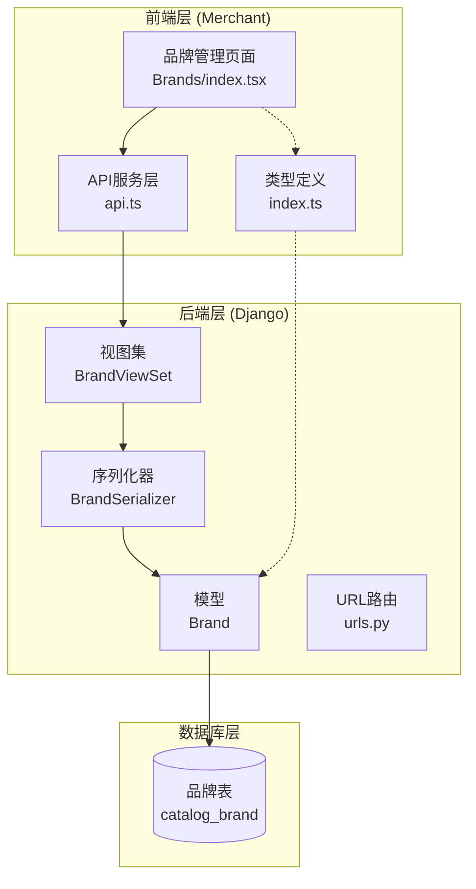
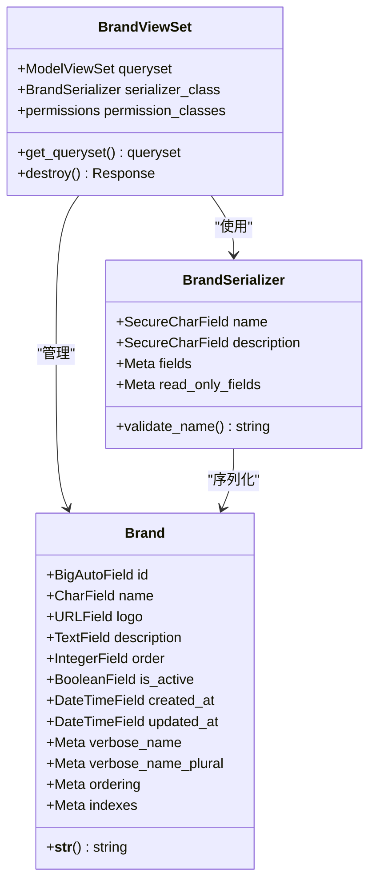
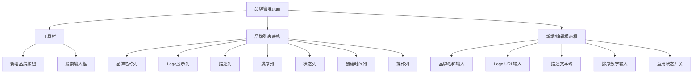
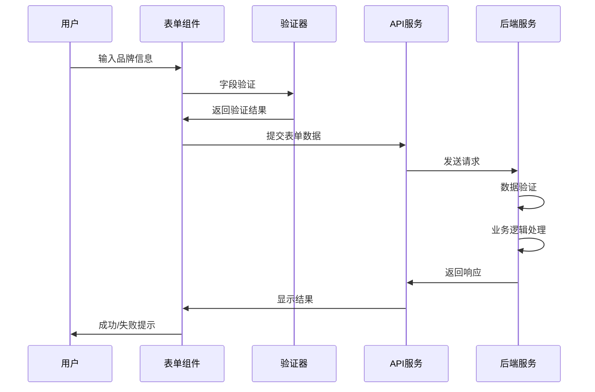
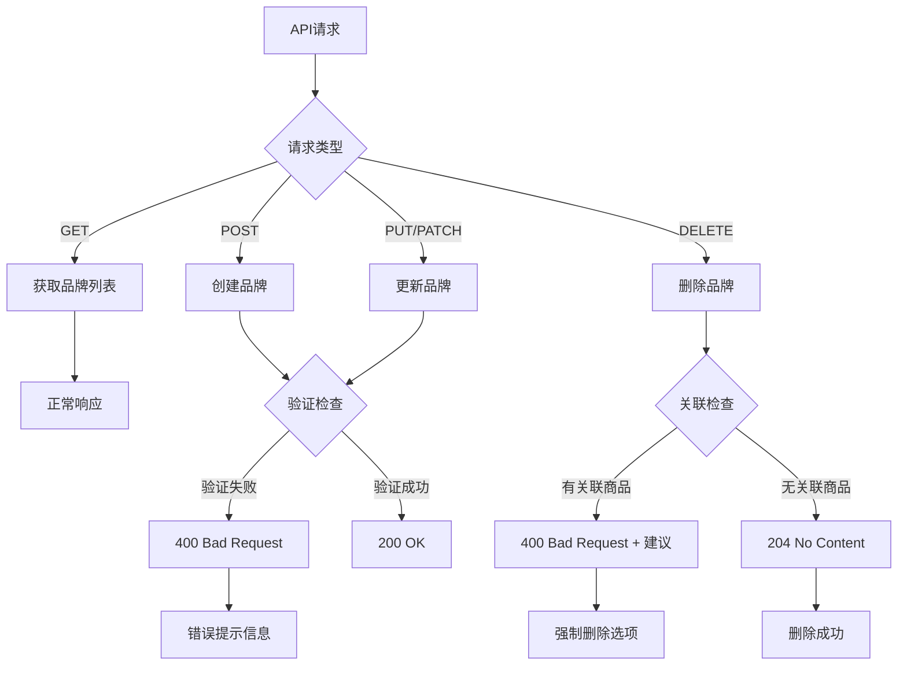
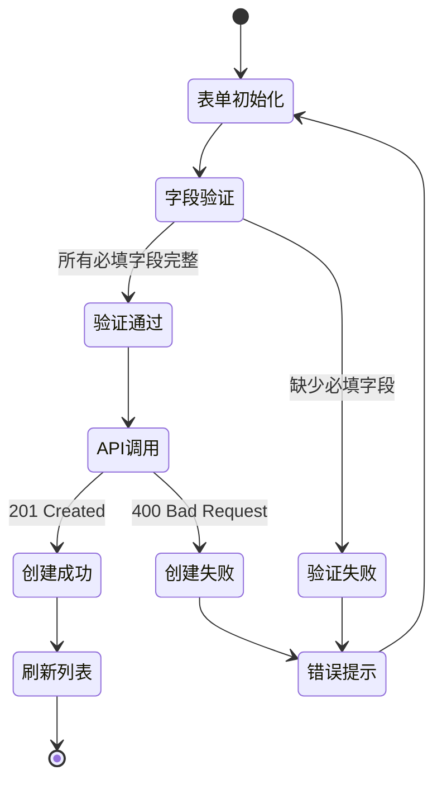
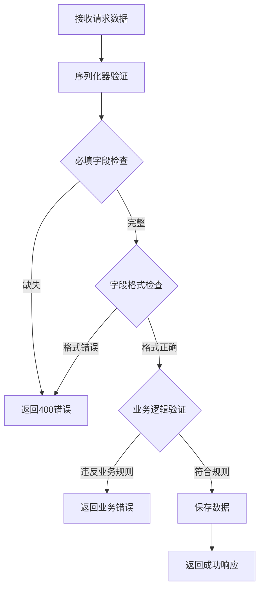
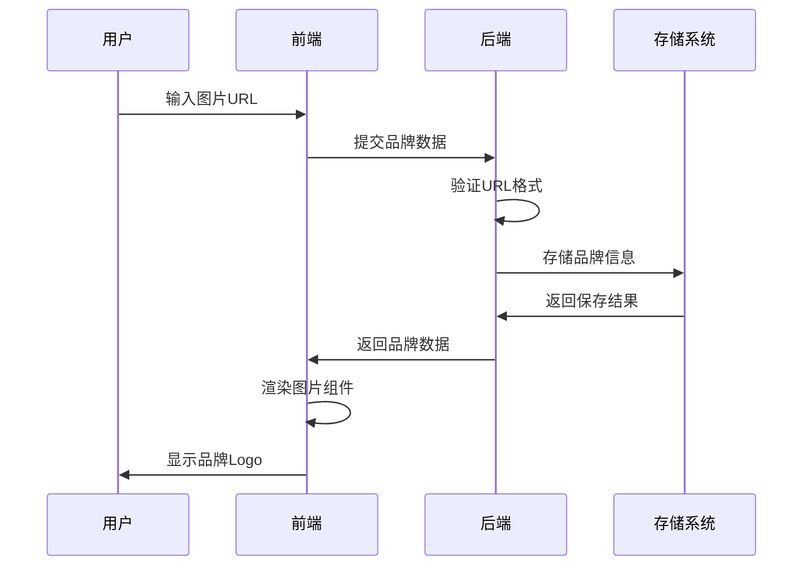
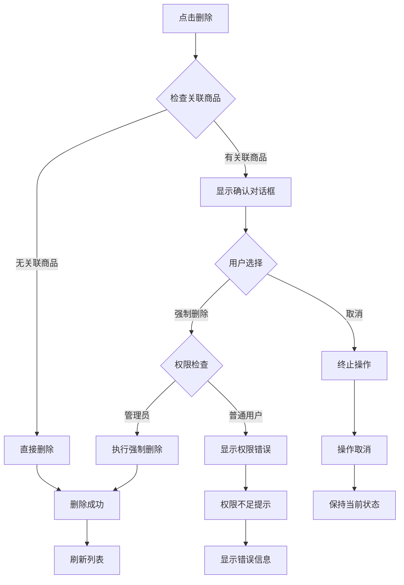

# 品牌管理

<cite>
**本文档引用的文件**
- [merchant/src/pages/Brands/index.tsx](file://merchant/src/pages/Brands/index.tsx)
- [frontend/src/services/brand.ts](file://frontend/src/services/brand.ts)
- [backend/catalog/models.py](file://backend/catalog/models.py)
- [backend/catalog/views.py](file://backend/catalog/views.py)
- [backend/catalog/serializers.py](file://backend/catalog/serializers.py)
- [backend/catalog/urls.py](file://backend/catalog/urls.py)
- [merchant/src/services/api.ts](file://merchant/src/services/api.ts)
- [frontend/src/types/index.ts](file://frontend/src/types/index.ts)
- [merchant/src/utils/image.ts](file://merchant/src/utils/image.ts)
</cite>

## 目录
1. [简介](#简介)
2. [项目架构概览](#项目架构概览)
3. [品牌数据模型](#品牌数据模型)
4. [前端品牌管理界面](#前端品牌管理界面)
5. [后端API接口](#后端api接口)
6. [品牌管理核心功能](#品牌管理核心功能)
7. [表单验证与数据处理](#表单验证与数据处理)
8. [品牌LOGO图片处理](#品牌logo图片处理)
9. [错误处理与用户体验](#错误处理与用户体验)
10. [性能优化策略](#性能优化策略)
11. [最佳实践建议](#最佳实践建议)
12. [故障排除指南](#故障排除指南)

## 简介

品牌管理功能是商户后台系统的核心组成部分，负责维护和管理所有商品品牌的完整信息。该功能采用前后端分离架构，前端基于React和Ant Design Pro构建现代化的管理界面，后端使用Django REST framework提供RESTful API服务。

品牌管理功能支持完整的CRUD操作，包括品牌列表展示、新增品牌、编辑品牌信息、删除品牌等核心功能。系统还提供了强大的搜索和筛选能力，支持按品牌名称、状态等条件进行快速查找。

## 项目架构概览

品牌管理功能在整个系统中的架构位置如下：

**图表来源**
- [merchant/src/pages/Brands/index.tsx](file://merchant/src/pages/Brands/index.tsx#L1-L189)
- [backend/catalog/views.py](file://backend/catalog/views.py#L589-L675)
- [backend/catalog/models.py](file://backend/catalog/models.py#L21-L40)

**章节来源**
- [merchant/src/pages/Brands/index.tsx](file://merchant/src/pages/Brands/index.tsx#L1-L10)
- [backend/catalog/views.py](file://backend/catalog/views.py#L589-L590)

## 品牌数据模型

### 数据模型结构

品牌数据模型定义了完整的品牌信息结构，包含以下核心字段：

| 字段名 | 类型 | 描述 | 约束条件 |
|--------|------|------|----------|
| id | BigAutoField | 品牌唯一标识符 | 主键，自增 |
| name | CharField(100) | 品牌名称 | 必填，唯一，最大长度100 |
| logo | URLField(500) | 品牌Logo链接 | 可选，最大长度500 |
| description | TextField | 品牌描述 | 可选，默认为空字符串 |
| order | IntegerField | 显示排序 | 默认值0 |
| is_active | BooleanField | 是否启用 | 默认值True |
| created_at | DateTimeField | 创建时间 | 自动生成 |
| updated_at | DateTimeField | 更新时间 | 自动更新 |

### 模型特性

**图表来源**
- [backend/catalog/models.py](file://backend/catalog/models.py#L21-L40)
- [backend/catalog/views.py](file://backend/catalog/views.py#L589-L675)
- [backend/catalog/serializers.py](file://backend/catalog/serializers.py#L22-L47)

**章节来源**
- [backend/catalog/models.py](file://backend/catalog/models.py#L21-L40)
- [backend/catalog/serializers.py](file://backend/catalog/serializers.py#L22-L47)

## 前端品牌管理界面

### 页面布局与组件

品牌管理页面采用Ant Design Pro的ProTable组件构建，提供现代化的表格界面：

**图表来源**
- [merchant/src/pages/Brands/index.tsx](file://merchant/src/pages/Brands/index.tsx#L35-L102)

### 表格列配置

品牌列表表格包含以下关键列配置：

| 列名 | 数据字段 | 特性 | 功能描述 |
|------|----------|------|----------|
| 品牌名称 | name | 支持搜索 | 可通过名称进行模糊搜索 |
| Logo | logo | 图片展示 | 显示品牌Logo，支持图片预览 |
| 描述 | description | 文本省略 | 长文本自动省略，支持完整查看 |
| 排序 | order | 数字排序 | 支持升序降序排序 |
| 状态 | is_active | 标签展示 | 启用/禁用状态，不同颜色标识 |
| 创建时间 | created_at | 时间格式化 | 显示标准日期时间格式 |
| 操作 | - | 按钮组 | 包含编辑和删除功能 |

### 模态框表单设计

新增和编辑品牌使用统一的ModalForm组件，表单字段配置如下：

**图表来源**
- [merchant/src/pages/Brands/index.tsx](file://merchant/src/pages/Brands/index.tsx#L159-L185)

**章节来源**
- [merchant/src/pages/Brands/index.tsx](file://merchant/src/pages/Brands/index.tsx#L35-L102)
- [merchant/src/pages/Brands/index.tsx](file://merchant/src/pages/Brands/index.tsx#L159-L185)

## 后端API接口

### RESTful API规范

品牌管理API遵循RESTful设计原则，提供标准的CRUD操作：

| HTTP方法 | 端点 | 功能 | 权限要求 |
|----------|------|------|----------|
| GET | /brands/ | 获取品牌列表 | AllowAny |
| GET | /brands/{id}/ | 获取品牌详情 | AllowAny |
| POST | /brands/ | 创建新品牌 | IsAdminOrReadOnly |
| PUT | /brands/{id}/ | 完整更新品牌 | IsAdminOrReadOnly |
| PATCH | /brands/{id}/ | 部分更新品牌 | IsAdminOrReadOnly |
| DELETE | /brands/{id}/ | 删除品牌 | IsAdminOrReadOnly |

### API请求参数

#### 获取品牌列表
- **查询参数**:
  - `search`: 按品牌名称模糊搜索
  - `is_active`: 按启用状态筛选
  - `page`: 页码，默认1
  - `page_size`: 每页数量，默认20

#### 删除品牌
- **查询参数**:
  - `force_delete`: 强制删除标志，仅管理员可用

### 错误响应处理

**图表来源**
- [backend/catalog/views.py](file://backend/catalog/views.py#L634-L674)

**章节来源**
- [backend/catalog/views.py](file://backend/catalog/views.py#L589-L675)
- [backend/catalog/urls.py](file://backend/catalog/urls.py#L9)

## 品牌管理核心功能

### 品牌列表展示

品牌列表采用ProTable组件实现，支持多种展示特性和交互功能：

#### 搜索功能
- **名称搜索**: 支持按品牌名称进行模糊匹配
- **状态筛选**: 可按启用/禁用状态进行筛选
- **实时过滤**: 输入即生效，无需手动触发

#### 排序功能
- **多字段排序**: 支持按创建时间、排序值等字段排序
- **升序降序**: 支持正反两种排序方向

#### 分页控制
- **动态分页**: 支持自定义每页显示数量
- **总数显示**: 显示总记录数和当前页信息

### 新增品牌功能

新增品牌通过ModalForm组件实现，提供直观的表单界面：

**图表来源**
- [merchant/src/pages/Brands/index.tsx](file://merchant/src/pages/Brands/index.tsx#L164-L178)

### 编辑品牌功能

编辑功能复用新增表单，通过initialValues属性预填充现有数据：

- **数据预填充**: 自动填充品牌现有信息
- **差异保存**: 只提交修改过的字段
- **状态保持**: 保留原有的启用/禁用状态

### 删除品牌功能

删除功能包含安全保护机制，防止误删除有关联商品的品牌：

#### 删除流程
1. **关联检查**: 检查品牌是否有关联商品
2. **权限验证**: 验证用户是否有删除权限
3. **强制删除**: 对于有关联商品的品牌，提供强制删除选项
4. **级联处理**: 删除时处理相关联的商品关系

**章节来源**
- [merchant/src/pages/Brands/index.tsx](file://merchant/src/pages/Brands/index.tsx#L13-L33)
- [backend/catalog/views.py](file://backend/catalog/views.py#L634-L674)

## 表单验证与数据处理

### 前端验证规则

前端使用Ant Design Pro的表单验证功能，确保数据质量：

| 字段 | 验证规则 | 错误提示 |
|------|----------|----------|
| 品牌名称 | required: true | 请输入品牌名称 |
| 品牌名称 | 字符串非空 | 品牌名称不能为空 |
| 排序值 | min: 0 | 排序值不能小于0 |

### 后端验证逻辑

后端使用Django REST framework的序列化器进行数据验证：

**图表来源**
- [backend/catalog/serializers.py](file://backend/catalog/serializers.py#L43-L47)

### 数据完整性保护

系统实现了多层数据完整性保护机制：

- **唯一性约束**: 品牌名称字段设置唯一约束
- **外键关联**: 品牌与商品建立外键关系
- **级联删除**: 控制关联数据的删除行为
- **软删除**: 通过is_active字段实现逻辑删除

**章节来源**
- [backend/catalog/serializers.py](file://backend/catalog/serializers.py#L43-L47)
- [backend/catalog/models.py](file://backend/catalog/models.py#L23)

## 品牌LOGO图片处理

### 图片URL处理

品牌LOGO使用URL字段存储图片链接，前端通过img标签直接渲染：

**图表来源**
- [merchant/src/pages/Brands/index.tsx](file://merchant/src/pages/Brands/index.tsx#L51)

### 图片预览功能

品牌列表中的Logo列提供图片预览功能：

- **图片尺寸**: 固定40x40像素，保持一致的视觉效果
- **缩放模式**: 使用object-fit: contain确保图片完整显示
- **占位符**: 无Logo时显示"-"字符作为占位符

### 图片URL标准化

系统提供了图片URL标准化工具函数，确保URL格式的一致性：

- **协议处理**: 统一转换为相对路径格式
- **路径规范化**: 移除多余的斜杠和特殊字符
- **安全性检查**: 验证URL的有效性和安全性

**章节来源**
- [merchant/src/pages/Brands/index.tsx](file://merchant/src/pages/Brands/index.tsx#L51)
- [merchant/src/utils/image.ts](file://merchant/src/utils/image.ts#L1-L33)

## 错误处理与用户体验

### 删除操作的安全机制

删除品牌时的错误处理流程：

**图表来源**
- [merchant/src/pages/Brands/index.tsx](file://merchant/src/pages/Brands/index.tsx#L13-L33)

### 错误提示策略

系统采用多层次的错误提示策略：

- **即时反馈**: 表单验证错误立即显示
- **语义化提示**: 错误信息清晰明确
- **用户引导**: 提供解决问题的建议
- **操作确认**: 关键操作前进行二次确认

### 成功反馈机制

成功的操作会获得及时的反馈：

- **消息通知**: 使用Ant Design的message组件显示成功消息
- **界面更新**: 自动刷新相关列表数据
- **状态重置**: 清空表单状态，准备下一次操作

**章节来源**
- [merchant/src/pages/Brands/index.tsx](file://merchant/src/pages/Brands/index.tsx#L13-L33)

## 性能优化策略

### 数据加载优化

- **懒加载**: 表格数据按需加载，避免一次性加载过多数据
- **缓存机制**: 利用浏览器缓存减少重复请求
- **分页处理**: 实现高效的分页加载机制

### 前端性能优化

- **虚拟滚动**: 对于大量数据，使用虚拟滚动技术
- **防抖处理**: 搜索输入采用防抖机制，减少不必要的请求
- **状态管理**: 合理使用React状态，避免不必要的重新渲染

### 后端性能优化

- **索引优化**: 在常用查询字段上建立数据库索引
- **查询优化**: 使用select_related和prefetch_related优化查询
- **缓存策略**: 对频繁访问的数据实施缓存机制

**章节来源**
- [backend/catalog/views.py](file://backend/catalog/views.py#L613-L625)

## 最佳实践建议

### 开发建议

1. **数据验证**: 始终在前后端都进行数据验证
2. **错误处理**: 实现完善的错误处理和恢复机制
3. **安全性**: 对用户输入进行严格的验证和清理
4. **可扩展性**: 设计时考虑未来的功能扩展需求

### 运维建议

1. **监控告警**: 建立API响应时间和成功率的监控
2. **日志记录**: 记录关键操作的日志以便问题排查
3. **备份策略**: 定期备份品牌数据以防数据丢失
4. **性能测试**: 定期进行性能测试确保系统稳定性

### 用户体验建议

1. **响应速度**: 优化API响应时间，提升用户体验
2. **界面友好**: 提供清晰的操作指引和反馈信息
3. **错误恢复**: 提供友好的错误恢复机制
4. **帮助文档**: 提供详细的使用说明和帮助文档

## 故障排除指南

### 常见问题及解决方案

#### 品牌创建失败
**问题**: 创建品牌时返回400错误
**可能原因**: 
- 品牌名称已存在
- 品牌名称为空
- 其他字段验证失败

**解决方法**:
1. 检查品牌名称是否唯一
2. 确认所有必填字段都已填写
3. 查看具体的错误提示信息

#### 品牌删除失败
**问题**: 删除品牌时提示有关联商品
**解决方法**:
1. 检查品牌是否有关联商品
2. 如确实需要删除，使用强制删除功能
3. 确保当前用户具有管理员权限

#### 图片显示异常
**问题**: 品牌Logo无法正常显示
**可能原因**:
- 图片URL无效
- 图片格式不支持
- 网络连接问题

**解决方法**:
1. 检查图片URL的正确性
2. 确认图片格式符合要求
3. 验证网络连接状态

### 调试技巧

1. **浏览器开发者工具**: 使用Network面板检查API请求
2. **后端日志**: 查看Django服务器日志定位问题
3. **数据库查询**: 使用Django ORM调试工具分析查询
4. **错误追踪**: 使用错误追踪服务监控系统异常

**章节来源**
- [merchant/src/pages/Brands/index.tsx](file://merchant/src/pages/Brands/index.tsx#L13-L33)
- [backend/catalog/views.py](file://backend/catalog/views.py#L634-L674)