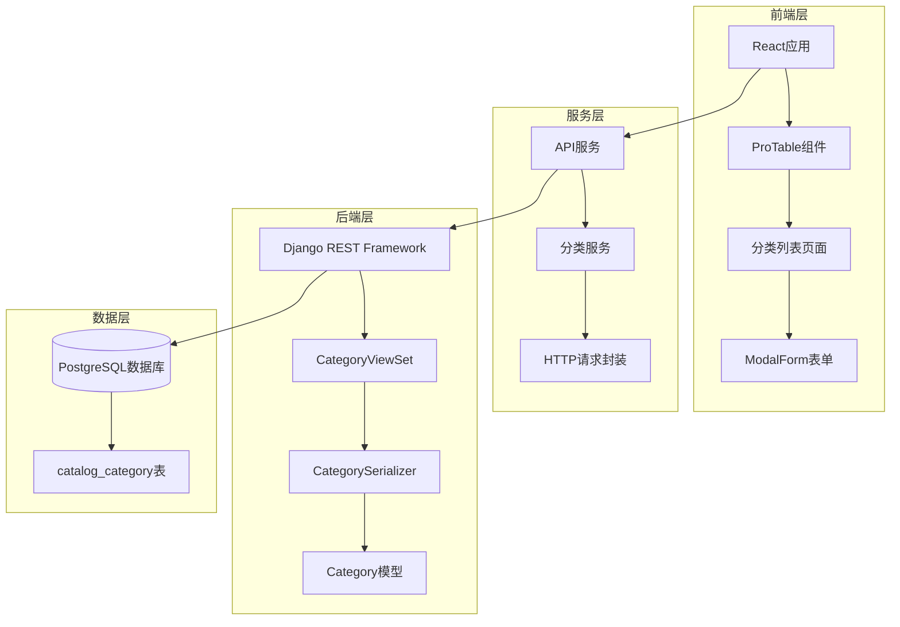
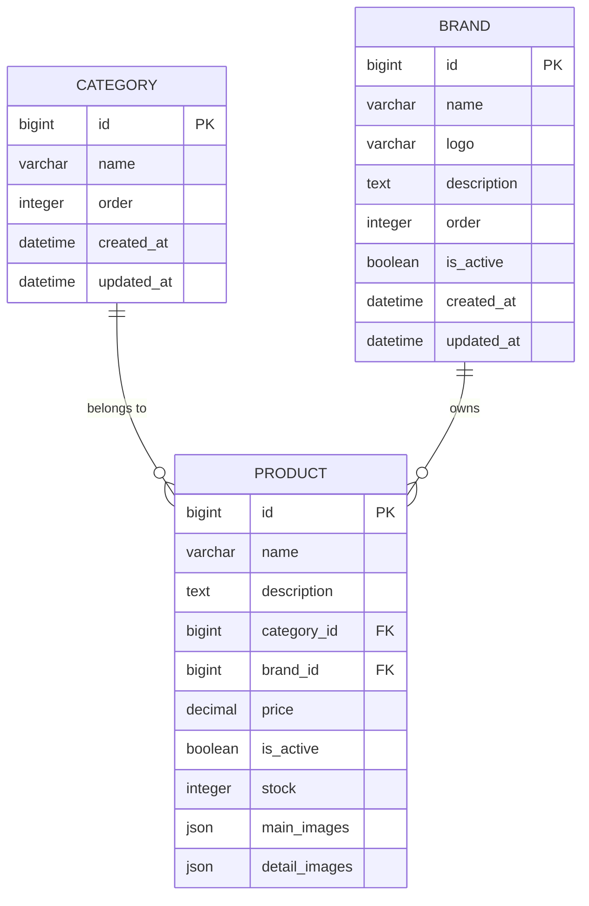
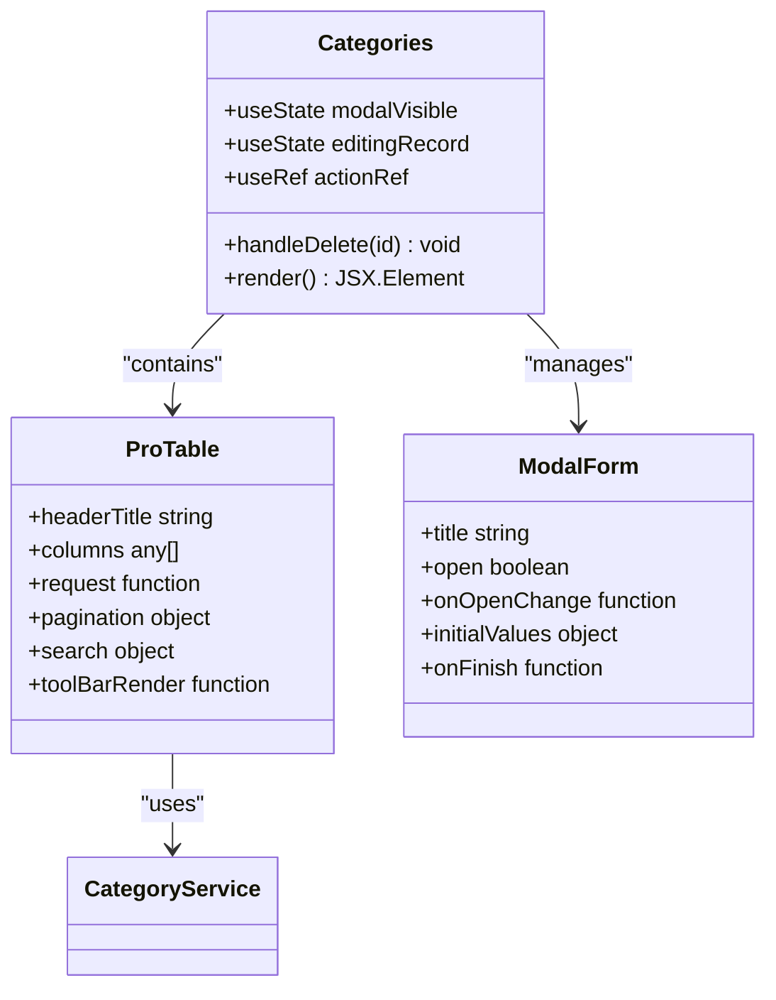
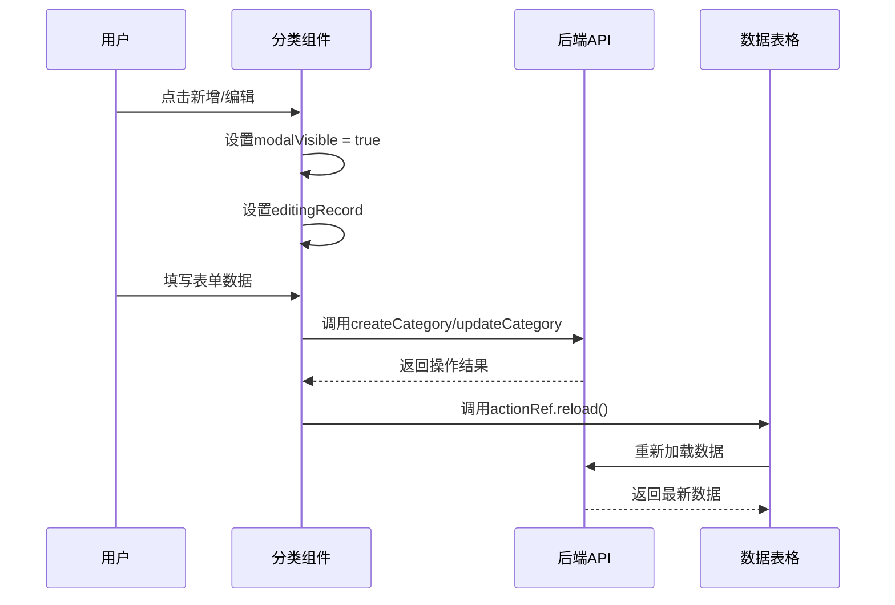
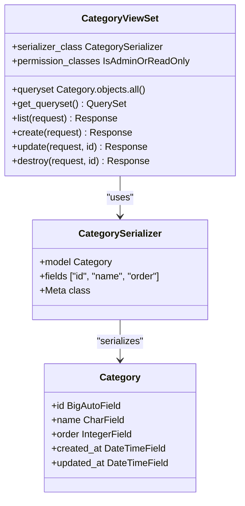
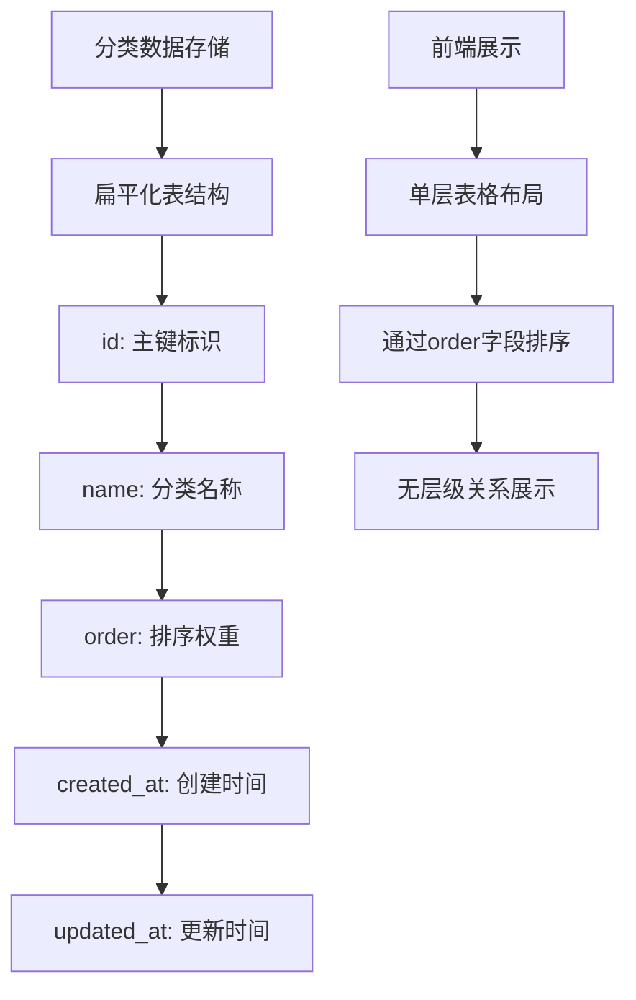
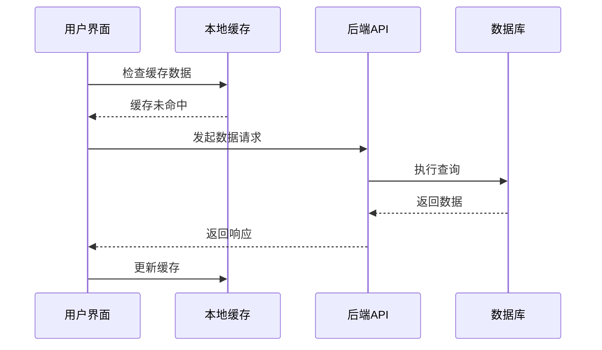

# 品类列表功能详细文档

<cite>
**本文档引用的文件**
- [merchant/src/pages/Categories/index.tsx](file://merchant/src/pages/Categories/index.tsx)
- [frontend/src/services/category.ts](file://frontend/src/services/category.ts)
- [frontend/src/services/api.ts](file://frontend/src/services/api.ts)
- [backend/catalog/models.py](file://backend/catalog/models.py)
- [backend/catalog/views.py](file://backend/catalog/views.py)
- [backend/catalog/serializers.py](file://backend/catalog/serializers.py)
- [backend/catalog/urls.py](file://backend/catalog/urls.py)
- [frontend/src/types/index.ts](file://frontend/src/types/index.ts)
- [backend/catalog/migrations/0004_alter_category_options_category_level_category_order_and_more.py](file://backend/catalog/migrations/0004_alter_category_options_category_level_category_order_and_more.py)
- [backend/catalog/migrations/0007_flatten_categories_remove_parent_level.py](file://backend/catalog/migrations/0007_flatten_categories_remove_parent_level.py)
</cite>

## 目录
1. [简介](#简介)
2. [系统架构概览](#系统架构概览)
3. [数据模型设计](#数据模型设计)
4. [前端实现详解](#前端实现详解)
5. [后端API设计](#后端api设计)
6. [分类层级展示机制](#分类层级展示机制)
7. [搜索与过滤功能](#搜索与过滤功能)
8. [性能优化策略](#性能优化策略)
9. [最佳实践指南](#最佳实践指南)
10. [故障排除指南](#故障排除指南)

## 简介

品类列表功能是商户后台管理系统的核心组件之一，负责展示和管理商品分类体系。该功能采用前后端分离架构，前端使用React + Ant Design技术栈，后端基于Django REST Framework构建，支持多级分类的树形展示、实时搜索过滤、批量操作等功能。

## 系统架构概览



**图表来源**
- [merchant/src/pages/Categories/index.tsx](file://merchant/src/pages/Categories/index.tsx#L1-L134)
- [frontend/src/services/api.ts](file://frontend/src/services/api.ts#L23-L27)
- [backend/catalog/views.py](file://backend/catalog/views.py#L568-L587)

## 数据模型设计

### 分类模型结构



**图表来源**
- [backend/catalog/models.py](file://backend/catalog/models.py#L5-L18)
- [backend/catalog/models.py](file://backend/catalog/models.py#L43-L116)

### 关键字段说明

| 字段名 | 类型 | 描述 | 默认值 |
|--------|------|------|--------|
| id | BigAutoField | 主键标识符 | 自动生成 |
| name | CharField(100) | 分类名称 | 必填，唯一 |
| order | IntegerField | 排序权重 | 0 |
| created_at | DateTimeField | 创建时间 | 自动设置 |
| updated_at | DateTimeField | 更新时间 | 自动更新 |

**章节来源**
- [backend/catalog/models.py](file://backend/catalog/models.py#L5-L18)

## 前端实现详解

### 组件架构设计



**图表来源**
- [merchant/src/pages/Categories/index.tsx](file://merchant/src/pages/Categories/index.tsx#L8-L134)

### 核心功能实现

#### 1. 列表展示配置

分类列表采用ProTable组件实现，支持以下核心特性：

- **列定义**：包含分类名称、排序序号、操作按钮
- **搜索功能**：支持按分类名称进行模糊搜索
- **分页控制**：默认每页20条记录，支持分页切换
- **工具栏**：提供新增分类的快捷入口

#### 2. 表单交互逻辑



**图表来源**
- [merchant/src/pages/Categories/index.tsx](file://merchant/src/pages/Categories/index.tsx#L107-L130)

#### 3. 删除确认机制

系统实现了安全的删除确认机制：

- 使用Popconfirm组件提供二次确认
- 删除成功后自动刷新列表数据
- 异常情况提供友好的错误提示

**章节来源**
- [merchant/src/pages/Categories/index.tsx](file://merchant/src/pages/Categories/index.tsx#L13-L21)

## 后端API设计

### 视图集架构



**图表来源**
- [backend/catalog/views.py](file://backend/catalog/views.py#L568-L587)
- [backend/catalog/serializers.py](file://backend/catalog/serializers.py#L16-L19)

### API端点设计

| HTTP方法 | 端点 | 功能 | 权限要求 |
|----------|------|------|----------|
| GET | /categories/ | 获取分类列表 | AllowAny |
| POST | /categories/ | 创建新分类 | IsAdminOrReadOnly |
| GET | /categories/{id}/ | 获取分类详情 | AllowAny |
| PUT | /categories/{id}/ | 更新分类信息 | IsAdminOrReadOnly |
| DELETE | /categories/{id}/ | 删除分类 | IsAdminOrReadOnly |

### 查询参数支持

后端API支持以下查询参数：

- **search**: 按分类名称进行模糊搜索
- **page**: 指定页码（默认1）
- **page_size**: 每页记录数（默认20）

**章节来源**
- [backend/catalog/views.py](file://backend/catalog/views.py#L580-L586)
- [backend/catalog/urls.py](file://backend/catalog/urls.py#L6-L8)

## 分类层级展示机制

### 当前实现方案

根据数据库迁移历史，当前系统采用扁平化存储结构：



**图表来源**
- [backend/catalog/migrations/0004_alter_category_options_category_level_category_order_and_more.py](file://backend/catalog/migrations/0004_alter_category_options_category_level_category_order_and_more.py#L19-L32)
- [backend/catalog/migrations/0007_flatten_categories_remove_parent_level.py](file://backend/catalog/migrations/0007_flatten_categories_remove_parent_level.py#L11-L18)

### 层级关系处理

虽然当前数据库结构为扁平化，但系统保留了层级关系的设计思路：

- **level字段**: 曾经用于标识分类层级深度
- **parent字段**: 曾经用于建立父子关系
- **order字段**: 用于控制同级分类的显示顺序

**章节来源**
- [backend/catalog/migrations/0004_alter_category_options_category_level_category_order_and_more.py](file://backend/catalog/migrations/0004_alter_category_options_category_level_category_order_and_more.py#L19-L32)

## 搜索与过滤功能

### 前端搜索实现


**图表来源**
- [merchant/src/pages/Categories/index.tsx](file://merchant/src/pages/Categories/index.tsx#L63-L85)

### 后端搜索逻辑

后端通过Django ORM的`icontains`查询实现模糊匹配：

```typescript
// 后端搜索条件构建
if search:
    qs = qs.filter(name__icontains=search)
```

### 搜索优化策略

- **索引支持**: 在name字段上建立了索引以提高查询性能
- **缓存机制**: 对频繁访问的分类数据实施缓存策略
- **分页加载**: 支持大数据量下的分页展示

**章节来源**
- [backend/catalog/views.py](file://backend/catalog/views.py#L582-L585)

## 性能优化策略

### 前端性能优化

#### 1. 数据加载优化



#### 2. 渲染性能优化

- **虚拟滚动**: 对于大量数据，考虑实现虚拟滚动
- **防抖处理**: 搜索输入采用防抖机制减少API调用
- **懒加载**: 支持无限滚动加载更多数据

### 后端性能优化

#### 1. 查询优化

```sql
-- 优化后的查询语句
SELECT id, name, "order" 
FROM catalog_category 
WHERE name ILIKE '%搜索关键词%' 
ORDER BY "order" 
LIMIT 20 OFFSET 0;
```

#### 2. 缓存策略

- **查询结果缓存**: 对常用查询结果实施缓存
- **模型实例缓存**: 避免重复查询相同分类数据
- **API响应缓存**: 对静态数据实施HTTP缓存头

**章节来源**
- [backend/catalog/views.py](file://backend/catalog/views.py#L580-L586)

## 最佳实践指南

### 开发最佳实践

#### 1. 数据验证

```typescript
// 前端表单验证
const formRules = {
    name: [{ required: true, message: '请输入分类名称' }],
    order: [{ type: 'number', min: 0, message: '排序值必须为非负数' }]
}
```

#### 2. 错误处理

- 实现统一的错误处理机制
- 提供友好的错误提示信息
- 记录详细的错误日志

#### 3. 用户体验

- 提供加载状态指示器
- 实现操作完成的反馈提示
- 支持键盘快捷操作

### 运维最佳实践

#### 1. 监控指标

- API响应时间监控
- 数据库查询性能监控
- 用户操作行为分析

#### 2. 安全考虑

- 输入数据的安全验证
- 权限控制的严格实施
- 敏感操作的二次确认

## 故障排除指南

### 常见问题及解决方案

#### 1. 分类列表加载缓慢

**症状**: 分类列表数据加载时间过长

**可能原因**:
- 数据库查询未使用索引
- 前端未实施分页加载
- 网络连接不稳定

**解决方案**:
- 检查数据库索引配置
- 实施分页加载机制
- 添加加载状态提示

#### 2. 搜索功能不工作

**症状**: 搜索框输入后无法正确过滤数据

**可能原因**:
- 后端模糊匹配逻辑错误
- 前端查询参数传递错误
- 数据库字符集不匹配

**解决方案**:
- 验证后端搜索逻辑
- 检查前端参数构造
- 确认数据库字符集设置

#### 3. 分类删除失败

**症状**: 删除分类时出现错误提示

**可能原因**:
- 分类关联了商品数据
- 权限验证失败
- 数据库约束冲突

**解决方案**:
- 检查分类关联关系
- 验证用户权限设置
- 处理数据库约束异常

### 调试技巧

#### 1. 前端调试

```javascript
// 开启开发模式日志
console.log('分类数据:', categories);
console.log('API请求参数:', params);
```

#### 2. 后端调试

```python
# Django shell调试
from catalog.models import Category
categories = Category.objects.all()
print(f"分类总数: {categories.count()}")
```

**章节来源**
- [merchant/src/pages/Categories/index.tsx](file://merchant/src/pages/Categories/index.tsx#L13-L21)
- [backend/catalog/views.py](file://backend/catalog/views.py#L582-L585)

## 总结

品类列表功能作为商户后台管理系统的重要组成部分，通过合理的架构设计和优化策略，实现了高效的商品分类管理。当前采用的扁平化存储结构简化了实现复杂度，同时保留了扩展为树形结构的可能性。

未来改进方向：
- 考虑引入树形结构支持
- 实现分类层级的可视化展示
- 优化大数据量下的性能表现
- 增强分类数据的导入导出功能