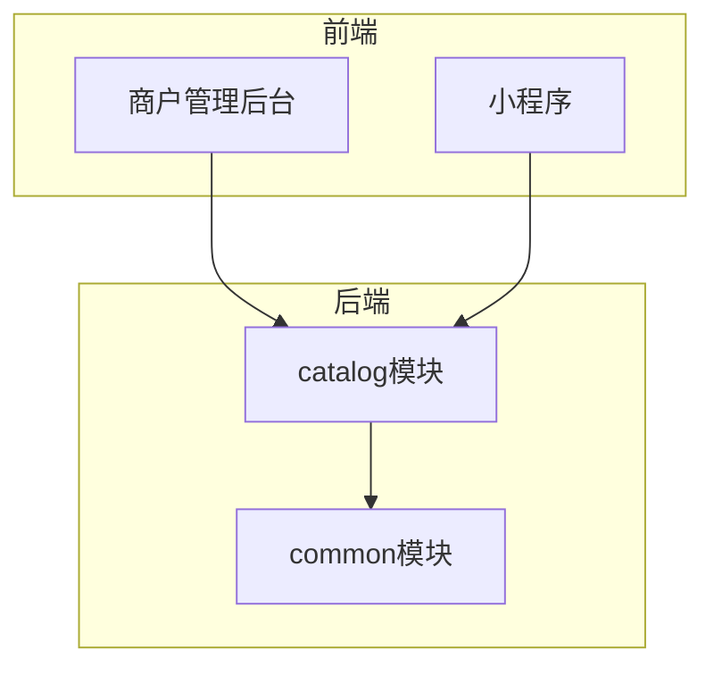
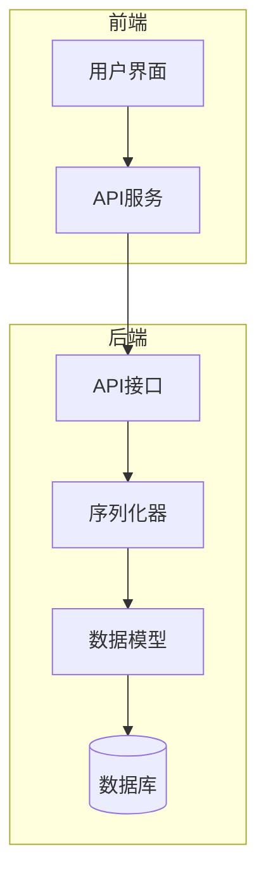
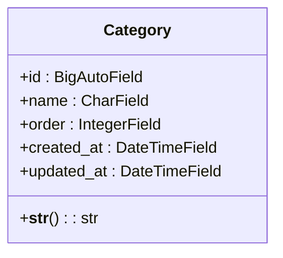
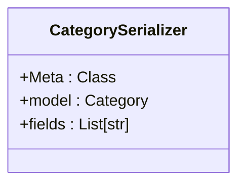
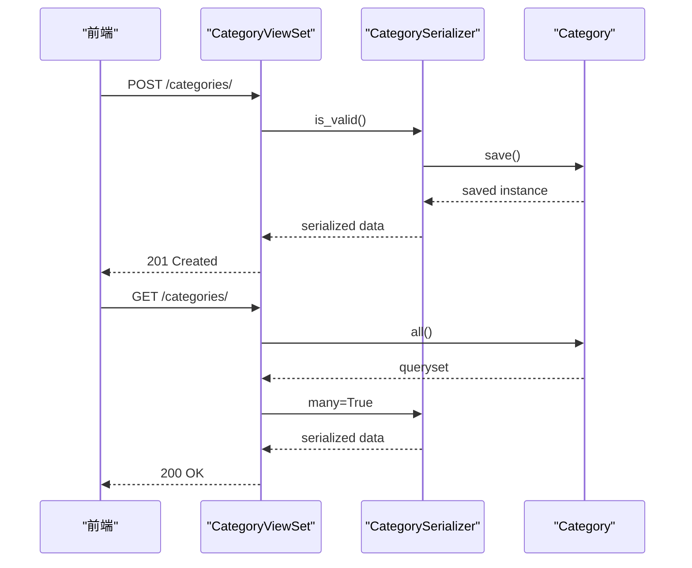
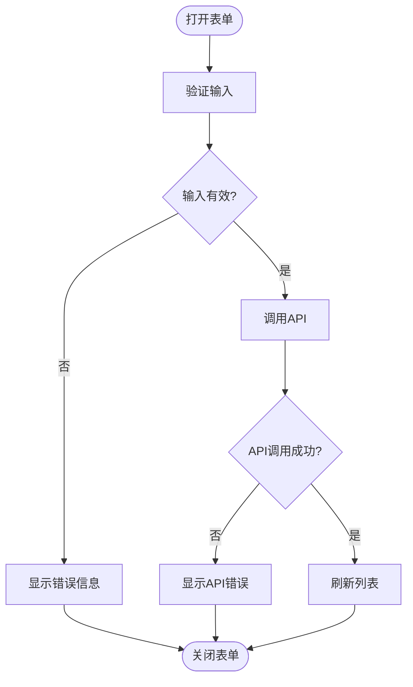
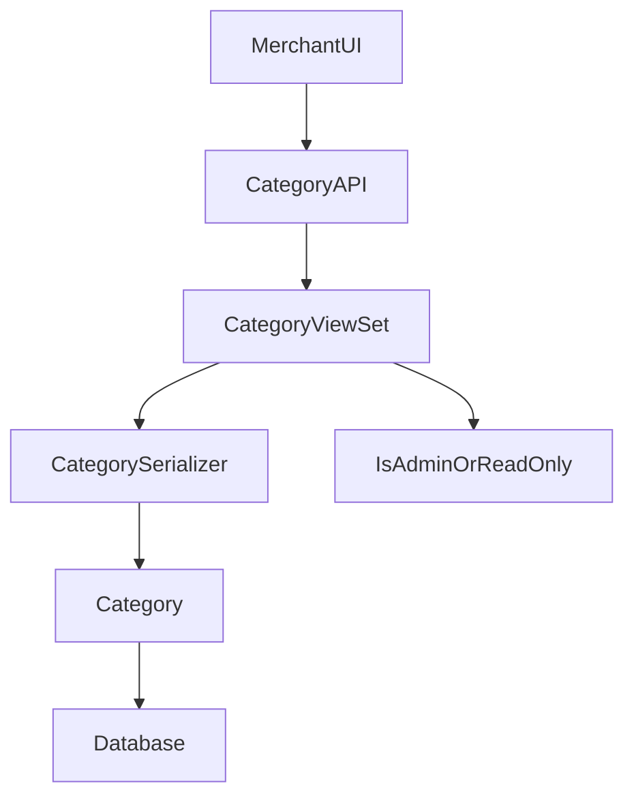

# 品类创建与编辑

<cite>
**本文档引用的文件**  
- [models.py](file://backend/catalog/models.py)
- [views.py](file://backend/catalog/views.py)
- [serializers.py](file://backend/catalog/serializers.py)
- [index.tsx](file://merchant/src/pages/Categories/index.tsx)
- [api.ts](file://merchant/src/services/api.ts)
- [category.ts](file://frontend/src/services/category.ts)
- [0004_alter_category_options_category_level_category_order_and_more.py](file://backend/catalog/migrations/0004_alter_category_options_category_level_category_order_and_more.py)
- [0007_flatten_categories_remove_parent_level.py](file://backend/catalog/migrations/0007_flatten_categories_remove_parent_level.py)
</cite>

## 目录
1. [简介](#简介)
2. [项目结构](#项目结构)
3. [核心组件](#核心组件)
4. [架构概述](#架构概述)
5. [详细组件分析](#详细组件分析)
6. [依赖分析](#依赖分析)
7. [性能考虑](#性能考虑)
8. [故障排除指南](#故障排除指南)
9. [结论](#结论)

## 简介
本文档深入解析了品类创建与编辑功能的实现机制，全面阐述了分类信息的增改流程。文档详细说明了创建/编辑表单的UI结构，包括分类名称输入、排序序号设置等字段的设计与实现。同时，文档解释了分类唯一性校验在前后端的实现机制，并提供了实际代码示例展示表单验证逻辑和API调用流程。为初学者提供表单设计指导，为开发者分析数据一致性保障策略。

## 项目结构
项目采用前后端分离架构，后端使用Django框架实现品类管理功能，前端包含商户管理后台和小程序两个客户端。品类管理功能主要集中在backend/catalog模块中，包括模型定义、序列化器、视图集等组件。商户管理后台使用React框架实现UI界面，通过API与后端交互。

**图表来源**  
- [models.py](file://backend/catalog/models.py)
- [views.py](file://backend/catalog/views.py)

**本节来源**  
- [models.py](file://backend/catalog/models.py)
- [views.py](file://backend/catalog/views.py)

## 核心组件
核心组件包括品类模型、序列化器、视图集和前端表单组件。品类模型定义了分类的基本属性，序列化器处理数据的序列化和反序列化，视图集提供RESTful API接口，前端组件实现用户界面和交互逻辑。这些组件协同工作，实现了品类的创建、编辑、查询和删除功能。

**本节来源**  
- [models.py](file://backend/catalog/models.py#L5-L18)
- [serializers.py](file://backend/catalog/serializers.py#L16-L20)
- [views.py](file://backend/catalog/views.py#L568-L586)

## 架构概述
系统采用典型的MVC架构模式，后端Django应用处理业务逻辑和数据存储，前端React应用负责用户界面展示和交互。品类管理功能通过RESTful API进行通信，遵循标准的HTTP方法语义。系统实现了前后端分离，提高了开发效率和系统可维护性。

**图表来源**  
- [models.py](file://backend/catalog/models.py)
- [serializers.py](file://backend/catalog/serializers.py)
- [views.py](file://backend/catalog/views.py)

## 详细组件分析

### 品类模型分析
品类模型定义了分类的基本属性，包括名称和排序序号。模型通过unique=True约束确保分类名称的唯一性，防止重复创建相同名称的分类。排序序号用于控制分类在前端的显示顺序，数值越小优先级越高。

**图表来源**  
- [models.py](file://backend/catalog/models.py#L5-L18)

**本节来源**  
- [models.py](file://backend/catalog/models.py#L5-L18)

### 品类序列化器分析
品类序列化器负责处理品类数据的序列化和反序列化操作。它定义了API接口中暴露的字段，包括ID、名称和排序序号。序列化器还实现了数据验证逻辑，确保输入数据的完整性和正确性。

**图表来源**  
- [serializers.py](file://backend/catalog/serializers.py#L16-L20)

**本节来源**  
- [serializers.py](file://backend/catalog/serializers.py#L16-L20)

### 品类视图集分析
品类视图集提供了RESTful API接口，支持品类的增删改查操作。视图集继承自ModelViewSet，自动实现了标准的CRUD操作。权限控制确保只有管理员可以修改品类信息，普通用户只能查看。

**图表来源**  
- [views.py](file://backend/catalog/views.py#L568-L586)

**本节来源**  
- [views.py](file://backend/catalog/views.py#L568-L586)

### 前端表单分析
前端表单组件实现了品类的创建和编辑界面。表单包含分类名称输入框和排序序号输入框，通过ModalForm组件实现弹窗式交互。表单验证确保用户输入的有效性，提交后通过API服务与后端通信。

**图表来源**  
- [index.tsx](file://merchant/src/pages/Categories/index.tsx)
- [api.ts](file://merchant/src/services/api.ts)

**本节来源**  
- [index.tsx](file://merchant/src/pages/Categories/index.tsx#L107-L130)
- [api.ts](file://merchant/src/services/api.ts#L24-L27)

## 依赖分析
品类管理功能依赖于Django框架的核心组件，包括ORM、序列化器和视图集。前端依赖Ant Design Pro组件库实现UI界面，通过自定义API服务与后端通信。系统还依赖common模块提供的权限控制和异常处理功能。

**图表来源**  
- [views.py](file://backend/catalog/views.py)
- [serializers.py](file://backend/catalog/serializers.py)
- [models.py](file://backend/catalog/models.py)

**本节来源**  
- [views.py](file://backend/catalog/views.py#L578)
- [serializers.py](file://backend/catalog/serializers.py#L18)
- [models.py](file://backend/catalog/models.py#L5)

## 性能考虑
系统在性能方面进行了多项优化。后端视图集通过select_related优化数据库查询，减少N+1查询问题。API接口支持分页和搜索参数，避免返回过多数据。前端使用ProTable组件实现高效的数据展示和交互，支持虚拟滚动和懒加载。

## 故障排除指南
常见问题包括分类名称重复、权限不足和API调用失败。对于分类名称重复问题，系统会返回400错误，提示用户使用不同的名称。权限不足问题通常发生在非管理员用户尝试修改数据时，需要检查用户角色和权限设置。API调用失败可能由网络问题或后端服务异常引起，需要检查服务状态和网络连接。

**本节来源**  
- [views.py](file://backend/catalog/views.py#L578)
- [serializers.py](file://backend/catalog/serializers.py#L43-L47)

## 结论
本文档全面解析了品类创建与编辑功能的实现机制。系统通过清晰的分层架构和规范的API设计，实现了高效、可靠的品类管理功能。前后端分离的架构模式提高了开发效率和系统可维护性。未来可以考虑增加分类层级功能，支持更复杂的分类体系。