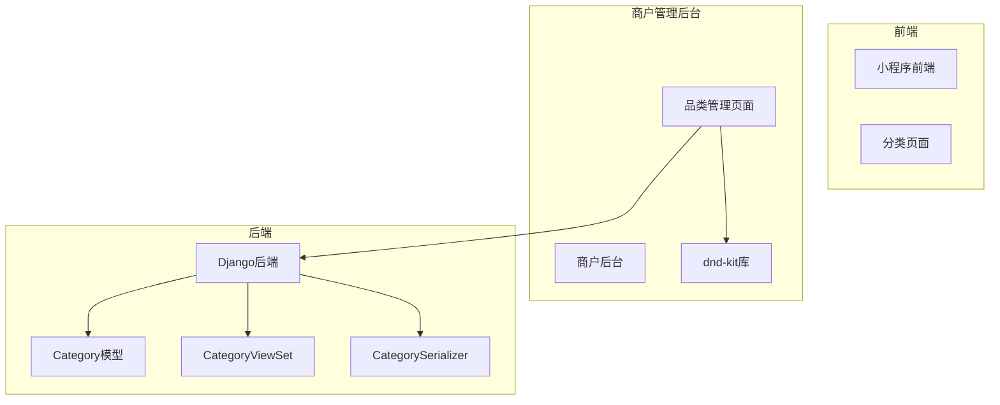
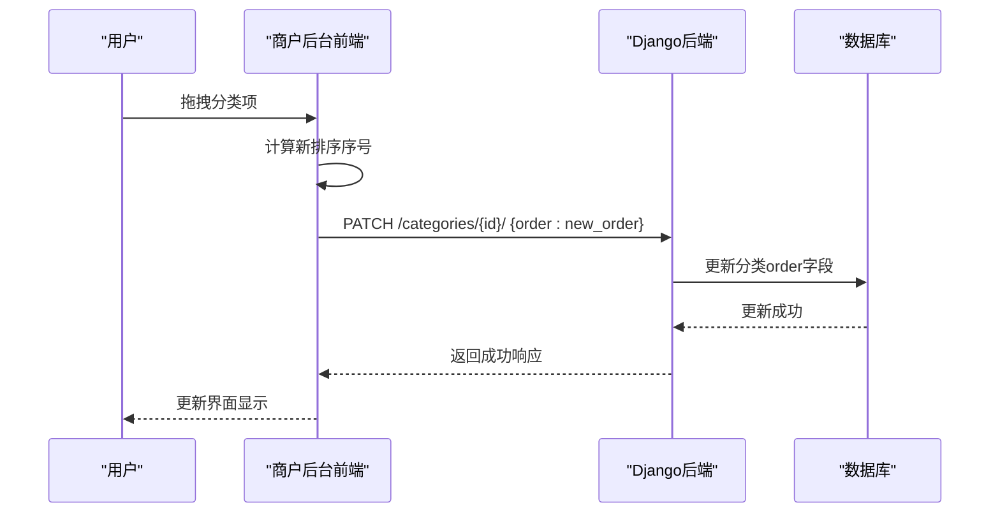
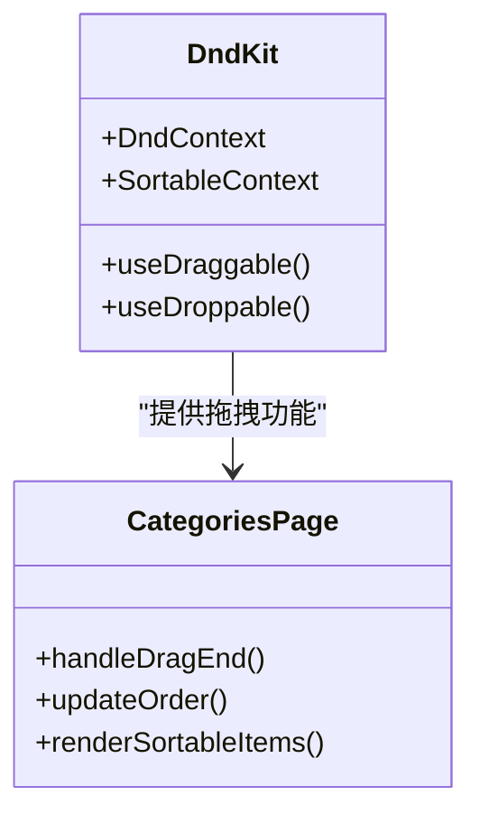
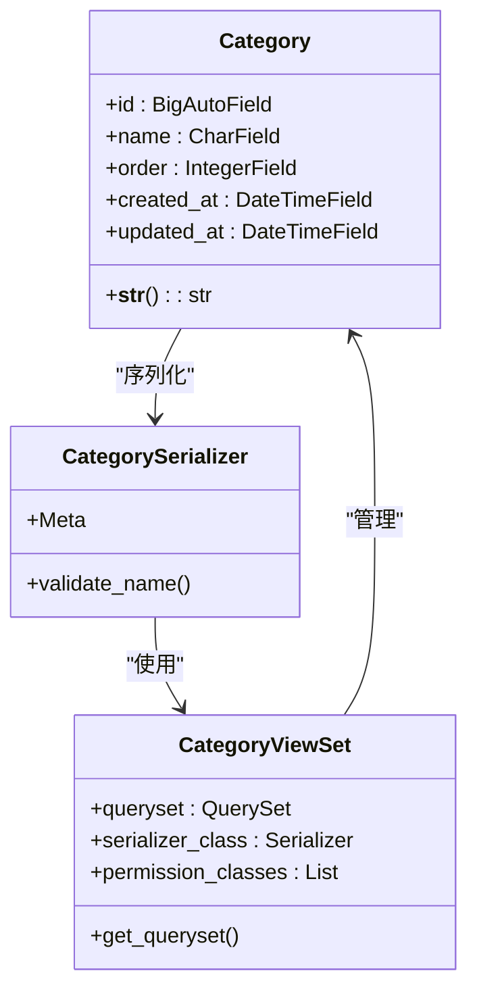
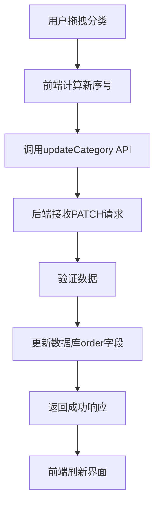
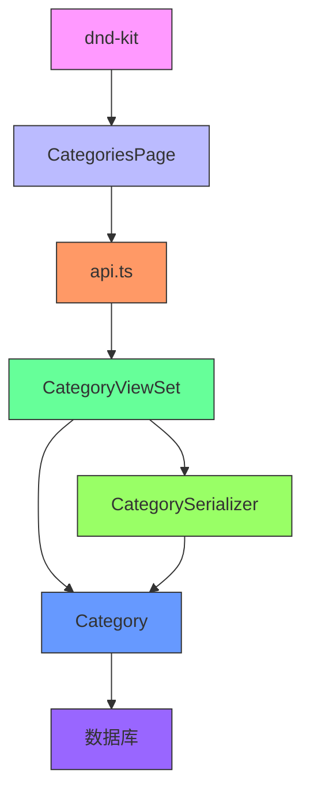

# 品类排序管理

<cite>
**本文档引用的文件**  
- [Categories/index.tsx](file://merchant/src/pages/Categories/index.tsx)
- [api.ts](file://merchant/src/services/api.ts)
- [models.py](file://backend/catalog/models.py)
- [views.py](file://backend/catalog/views.py)
- [serializers.py](file://backend/catalog/serializers.py)
- [category.ts](file://frontend/src/services/category.ts)
- [package-lock.json](file://merchant/package-lock.json)
</cite>

## 目录
1. [简介](#简介)
2. [项目结构](#项目结构)
3. [核心组件](#核心组件)
4. [架构概述](#架构概述)
5. [详细组件分析](#详细组件分析)
6. [依赖分析](#依赖分析)
7. [性能考虑](#性能考虑)
8. [故障排除指南](#故障排除指南)
9. [结论](#结论)

## 简介
本技术文档系统性地介绍了电商小程序中品类排序管理功能的实现原理。文档详细说明了前端如何通过拖拽交互实现分类项的顺序调整，并实时更新排序序号（order字段）。同时阐述了拖拽过程中对层级结构的约束规则，以及排序数据提交后端后的持久化处理流程。通过代码示例展示了拖拽事件监听、排序算法实现以及与后端排序API的通信细节，为开发者提供了完整的实现参考。

## 项目结构
该项目包含前端、商户管理后台和后端三个主要部分。品类排序功能主要涉及商户管理后台的前端界面和后端API服务。前端使用React框架和dnd-kit库实现拖拽功能，后端使用Django REST framework提供API接口。

**图表来源**  
- [Categories/index.tsx](file://merchant/src/pages/Categories/index.tsx)
- [models.py](file://backend/catalog/models.py)
- [views.py](file://backend/catalog/views.py)

## 核心组件
品类排序管理的核心组件包括前端的拖拽界面、后端的分类模型和API视图。前端使用dnd-kit库实现拖拽功能，通过API与后端通信更新排序。后端的Category模型包含order字段用于存储排序序号，CategoryViewSet提供RESTful API接口。

**组件来源**  
- [Categories/index.tsx](file://merchant/src/pages/Categories/index.tsx#L1-L133)
- [models.py](file://backend/catalog/models.py#L5-L15)
- [views.py](file://backend/catalog/views.py#L568-L587)

## 架构概述
品类排序管理采用前后端分离架构。前端负责用户交互和拖拽操作，后端负责数据持久化和业务逻辑处理。当用户在前端进行拖拽操作时，前端计算新的排序序号并调用后端API更新数据库。

**图表来源**  
- [Categories/index.tsx](file://merchant/src/pages/Categories/index.tsx#L113-L122)
- [views.py](file://backend/catalog/views.py#L578-L587)

## 详细组件分析

### 前端拖拽功能分析
商户管理后台使用dnd-kit库实现品类的拖拽排序功能。虽然具体实现代码未完全展示，但从package-lock.json文件中可以确认项目依赖了@dnd-kit/core、@dnd-kit/sortable等核心包。

**图表来源**  
- [package-lock.json](file://merchant/package-lock.json#L739-L782)
- [Categories/index.tsx](file://merchant/src/pages/Categories/index.tsx)

### 后端模型与API分析
后端使用Django模型定义品类数据结构，包含order字段用于排序。通过RESTful API提供创建、读取、更新和删除操作。

**图表来源**  
- [models.py](file://backend/catalog/models.py#L5-L18)
- [serializers.py](file://backend/catalog/serializers.py#L16-L20)
- [views.py](file://backend/catalog/views.py#L568-L587)

### 排序数据流分析
品类排序的数据流从用户交互开始，经过前端处理，通过API传输到后端，最终持久化到数据库。

**图表来源**  
- [api.ts](file://merchant/src/services/api.ts#L26)
- [views.py](file://backend/catalog/views.py#L578-L587)
- [Categories/index.tsx](file://merchant/src/pages/Categories/index.tsx#L113-L122)

## 依赖分析
品类排序功能涉及多个组件的依赖关系。前端依赖dnd-kit库实现拖拽功能，通过API服务与后端通信。后端的CategoryViewSet依赖Category模型和CategorySerializer。

**图表来源**  
- [package-lock.json](file://merchant/package-lock.json)
- [api.ts](file://merchant/src/services/api.ts)
- [views.py](file://backend/catalog/views.py)
- [models.py](file://backend/catalog/models.py)

## 性能考虑
品类排序功能在性能方面有以下考虑：后端在Category模型的Meta类中定义了ordering = ['order', 'id']，确保查询时按排序字段返回；前端使用ProTable组件进行数据展示，支持分页和搜索功能，避免一次性加载过多数据。

## 故障排除指南
当品类排序功能出现问题时，可以按照以下步骤进行排查：
1. 检查前端控制台是否有JavaScript错误
2. 确认dnd-kit库是否正确加载
3. 检查API请求是否成功发送
4. 验证后端API接口是否正常工作
5. 确认数据库中的order字段是否正确更新

**组件来源**  
- [Categories/index.tsx](file://merchant/src/pages/Categories/index.tsx)
- [views.py](file://backend/catalog/views.py)
- [models.py](file://backend/catalog/models.py)

## 结论
品类排序管理功能通过前后端协作实现，前端使用dnd-kit库提供直观的拖拽交互，后端通过RESTful API处理排序数据的持久化。该实现方式既保证了用户体验的流畅性，又确保了数据的一致性和可靠性。对于高并发场景，建议在更新排序时添加适当的锁机制或使用队列处理，避免数据冲突。