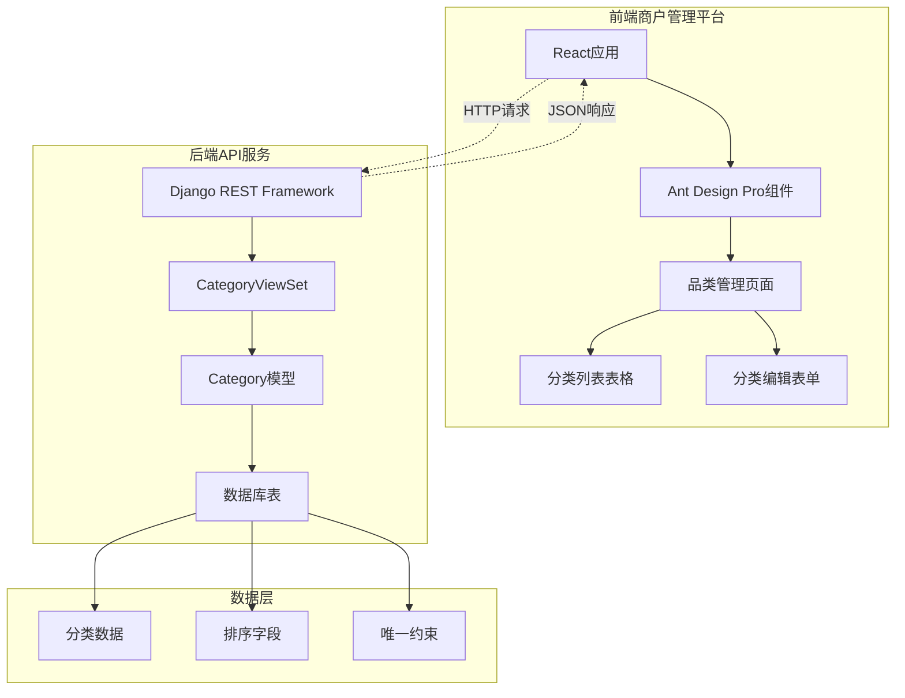
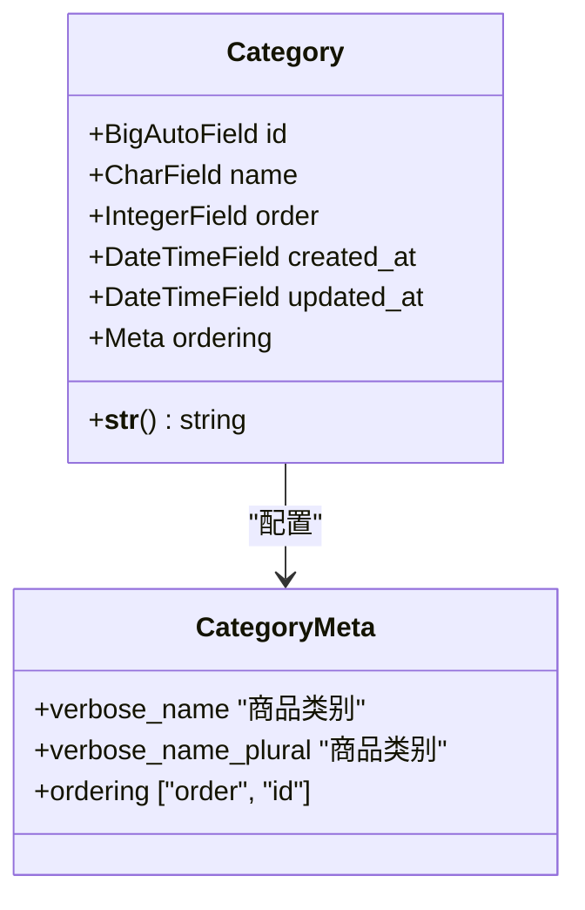
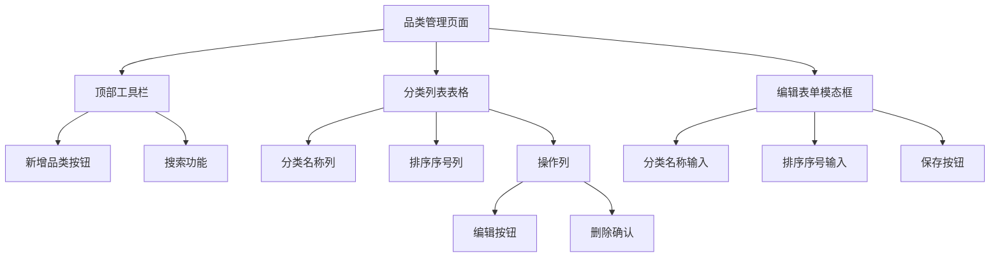
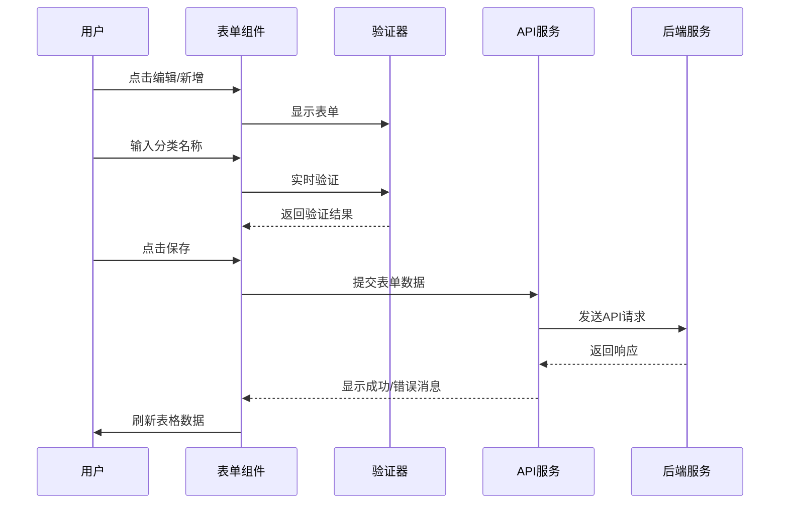
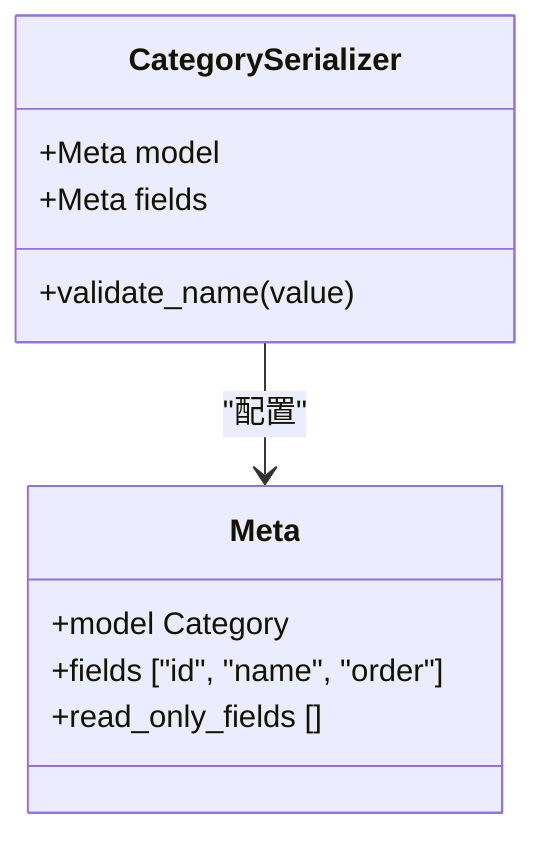
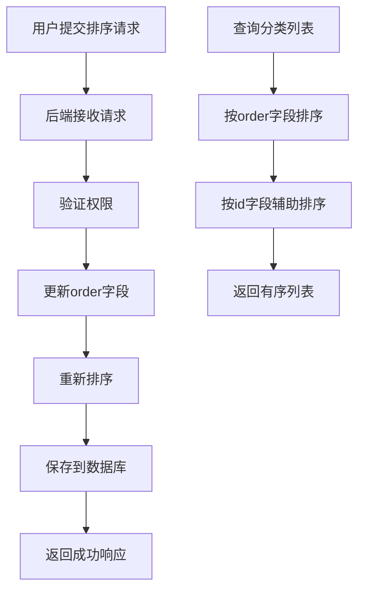
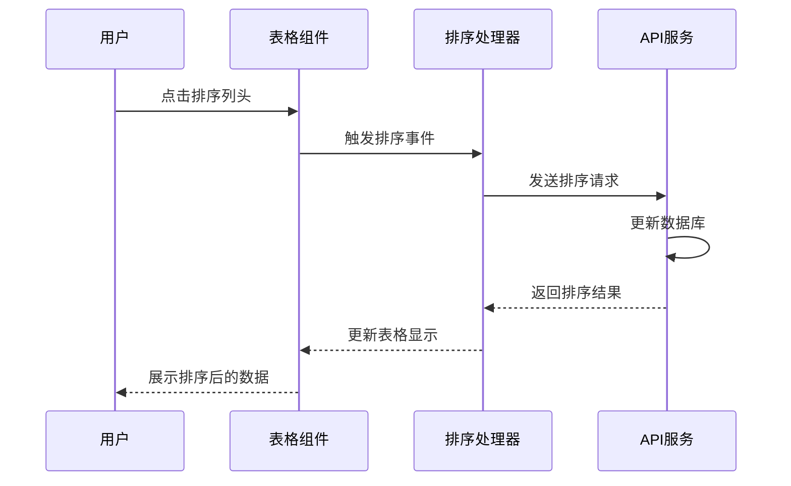
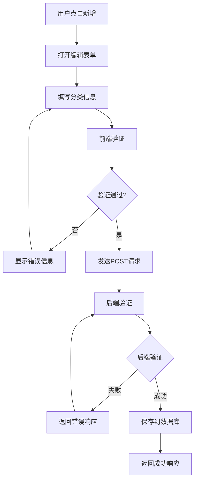
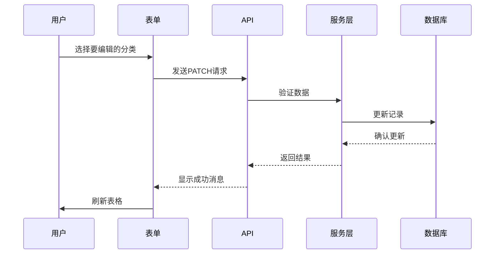
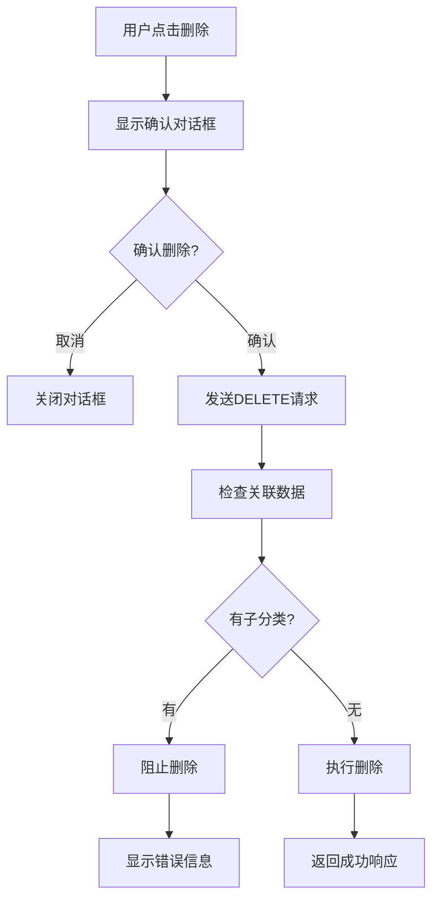

# 品类管理

<cite>
**本文档引用的文件**
- [merchant/src/pages/Categories/index.tsx](file://merchant/src/pages/Categories/index.tsx)
- [frontend/src/services/category.ts](file://frontend/src/services/category.ts)
- [backend/catalog/models.py](file://backend/catalog/models.py)
- [backend/catalog/views.py](file://backend/catalog/views.py)
- [backend/catalog/serializers.py](file://backend/catalog/serializers.py)
- [backend/catalog/urls.py](file://backend/catalog/urls.py)
- [backend/catalog/migrations/0004_alter_category_options_category_level_category_order_and_more.py](file://backend/catalog/migrations/0004_alter_category_options_category_level_category_order_and_more.py)
- [backend/catalog/migrations/0007_flatten_categories_remove_parent_level.py](file://backend/catalog/migrations/0007_flatten_categories_remove_parent_level.py)
- [merchant/src/services/api.ts](file://merchant/src/services/api.ts)
- [frontend/src/types/index.ts](file://frontend/src/types/index.ts)
</cite>

## 目录
1. [简介](#简介)
2. [项目架构概览](#项目架构概览)
3. [核心数据模型](#核心数据模型)
4. [前端品类管理界面](#前端品类管理界面)
5. [后端API接口](#后端api接口)
6. [分类层次结构设计](#分类层次结构设计)
7. [排序机制实现](#排序机制实现)
8. [CRUD操作详解](#crud操作详解)
9. [性能优化策略](#性能优化策略)
10. [最佳实践指南](#最佳实践指南)

## 简介

品类管理是电商品台的核心功能之一，负责维护商品分类体系，支持商家进行商品分类的创建、编辑、删除和排序操作。该功能采用前后端分离架构，前端使用React技术栈，后端基于Django REST framework构建，提供完整的RESTful API接口。

系统支持扁平化的分类结构，通过order字段控制显示顺序，简化了多级分类的复杂性，同时保证了良好的用户体验和数据一致性。

## 项目架构概览

品类管理系统采用现代化的前后端分离架构，主要包含以下组件：



**图表来源**
- [merchant/src/pages/Categories/index.tsx](file://merchant/src/pages/Categories/index.tsx#L1-L134)
- [backend/catalog/views.py](file://backend/catalog/views.py#L567-L587)

**章节来源**
- [merchant/src/pages/Categories/index.tsx](file://merchant/src/pages/Categories/index.tsx#L1-L50)
- [backend/catalog/views.py](file://backend/catalog/views.py#L567-L587)

## 核心数据模型

### 分类模型设计

品类管理的核心数据模型基于扁平化设计，摒弃了传统的树形结构，采用简单的层级关系：



**图表来源**
- [backend/catalog/models.py](file://backend/catalog/models.py#L5-L18)

### 字段说明

| 字段名 | 类型 | 约束 | 说明 |
|--------|------|------|------|
| id | BigAutoField | 主键 | 分类唯一标识符 |
| name | CharField | 非空，唯一 | 分类名称，最大长度100字符 |
| order | IntegerField | 默认值0 | 排序字段，数值越小越靠前 |
| created_at | DateTimeField | 自动生成 | 创建时间，自动记录 |
| updated_at | DateTimeField | 自动更新 | 更新时间，自动更新 |

### 数据库迁移历史

系统经历了多次架构演进：

1. **初始版本**：基础分类模型，仅包含id和name字段
2. **层级化版本**：引入parent外键和level字段，支持树形结构
3. **扁平化版本**：移除parent和level字段，简化为扁平结构

**章节来源**
- [backend/catalog/models.py](file://backend/catalog/models.py#L5-L18)
- [backend/catalog/migrations/0004_alter_category_options_category_level_category_order_and_more.py](file://backend/catalog/migrations/0004_alter_category_options_category_level_category_order_and_more.py#L1-L44)
- [backend/catalog/migrations/0007_flatten_categories_remove_parent_level.py](file://backend/catalog/migrations/0007_flatten_categories_remove_parent_level.py#L1-L19)

## 前端品类管理界面

### 页面布局与组件

前端品类管理页面采用现代化的表格布局，集成了丰富的交互功能：



**图表来源**
- [merchant/src/pages/Categories/index.tsx](file://merchant/src/pages/Categories/index.tsx#L58-L133)

### 表格列配置

品类列表表格包含以下关键列：

| 列名 | 数据字段 | 宽度 | 功能 |
|------|----------|------|------|
| 分类名称 | name | 自适应 | 支持搜索和排序 |
| 排序 | order | 100px | 数字排序功能 |
| 操作 | option | 150px | 编辑和删除功能 |

### 表单验证与交互

编辑表单采用Ant Design Pro的ModalForm组件，提供实时验证和错误提示：



**图表来源**
- [merchant/src/pages/Categories/index.tsx](file://merchant/src/pages/Categories/index.tsx#L107-L130)

**章节来源**
- [merchant/src/pages/Categories/index.tsx](file://merchant/src/pages/Categories/index.tsx#L23-L55)
- [merchant/src/pages/Categories/index.tsx](file://merchant/src/pages/Categories/index.tsx#L107-L130)

## 后端API接口

### RESTful API设计

品类管理API遵循RESTful设计原则，提供标准的CRUD操作：


**图表来源**
- [backend/catalog/views.py](file://backend/catalog/views.py#L567-L587)
- [backend/catalog/urls.py](file://backend/catalog/urls.py#L1-L15)

### API端点定义

| HTTP方法 | 端点 | 功能 | 权限要求 |
|----------|------|------|----------|
| GET | /categories/ | 获取分类列表 | AllowAny |
| POST | /categories/ | 创建新分类 | IsAdminOrReadOnly |
| GET | /categories/{id}/ | 获取分类详情 | AllowAny |
| PATCH | /categories/{id}/ | 更新分类信息 | IsAdminOrReadOnly |
| DELETE | /categories/{id}/ | 删除分类 | IsAdminOrReadOnly |

### 序列化器实现

分类序列化器负责数据的序列化和反序列化：



**图表来源**
- [backend/catalog/serializers.py](file://backend/catalog/serializers.py#L16-L19)

**章节来源**
- [backend/catalog/views.py](file://backend/catalog/views.py#L567-L587)
- [backend/catalog/serializers.py](file://backend/catalog/serializers.py#L16-L19)
- [backend/catalog/urls.py](file://backend/catalog/urls.py#L1-L15)

## 分类层次结构设计

### 扁平化架构优势

系统采用扁平化分类结构，相比传统的树形结构具有以下优势：

1. **简化数据库设计**：无需复杂的父子关系维护
2. **提高查询性能**：避免递归查询和JOIN操作
3. **降低开发复杂度**：减少边界情况处理
4. **便于前端展示**：支持简单的表格或列表展示

### 排序机制原理



**图表来源**
- [backend/catalog/views.py](file://backend/catalog/views.py#L580-L586)

### 数据一致性保证

系统通过以下机制确保数据一致性：

1. **数据库约束**：order字段的非负数约束
2. **序列化器验证**：前端输入验证
3. **事务处理**：批量操作的原子性保证

**章节来源**
- [backend/catalog/migrations/0007_flatten_categories_remove_parent_level.py](file://backend/catalog/migrations/0007_flatten_categories_remove_parent_level.py#L1-L19)
- [backend/catalog/views.py](file://backend/catalog/views.py#L580-L586)

## 排序机制实现

### 前端排序功能

前端使用Ant Design Pro的ProTable组件实现排序功能：



**图表来源**
- [merchant/src/pages/Categories/index.tsx](file://merchant/src/pages/Categories/index.tsx#L39-L40)

### 后端排序逻辑

后端通过Django ORM的ordering参数实现自动排序：

```python
# 后端排序配置
class Meta:
    ordering = ['order', 'id']
```

排序优先级：
1. **主要排序**：按order字段升序排列
2. **次要排序**：当order相同时，按id升序排列

### 排序性能优化

系统采用以下优化策略：

1. **索引优化**：在order字段上建立数据库索引
2. **缓存策略**：缓存分类列表数据
3. **懒加载**：大数据量时采用分页加载

**章节来源**
- [merchant/src/pages/Categories/index.tsx](file://merchant/src/pages/Categories/index.tsx#L39-L40)
- [backend/catalog/models.py](file://backend/catalog/models.py#L15-L15)

## CRUD操作详解

### 创建分类（Create）



**图表来源**
- [merchant/src/pages/Categories/index.tsx](file://merchant/src/pages/Categories/index.tsx#L117-L119)
- [merchant/src/services/api.ts](file://merchant/src/services/api.ts#L25-L25)

### 更新分类（Update）

更新操作支持部分字段修改，保持其他字段不变：



**图表来源**
- [merchant/src/pages/Categories/index.tsx](file://merchant/src/pages/Categories/index.tsx#L114-L116)

### 删除分类（Delete）

删除操作包含软删除和硬删除两种模式：



**图表来源**
- [merchant/src/pages/Categories/index.tsx](file://merchant/src/pages/Categories/index.tsx#L14-L20)
- [merchant/src/services/api.ts](file://merchant/src/services/api.ts#L27-L27)

### 查询分类（Read）

查询功能支持多种过滤和搜索条件：

| 参数名 | 类型 | 说明 |
|--------|------|------|
| search | string | 模糊搜索分类名称 |
| page | integer | 页码，默认1 |
| page_size | integer | 每页数量，默认20 |

**章节来源**
- [merchant/src/pages/Categories/index.tsx](file://merchant/src/pages/Categories/index.tsx#L63-L85)
- [backend/catalog/views.py](file://backend/catalog/views.py#L580-L586)

## 性能优化策略

### 数据库优化

1. **索引策略**
   - 在order字段上建立复合索引
   - 在name字段上建立全文索引（如需要）

2. **查询优化**
   - 使用select_related预加载相关数据
   - 采用分页查询避免全表扫描

3. **缓存机制**
   - 缓存分类列表数据
   - 使用Redis存储热点数据

### 前端优化

1. **虚拟滚动**
   - 大数据量时使用虚拟滚动
   - 减少DOM节点数量

2. **防抖处理**
   - 搜索功能采用防抖机制
   - 减少不必要的API调用

3. **状态管理**
   - 使用React状态管理优化渲染
   - 避免不必要的重新渲染

### 网络优化

1. **请求合并**
   - 批量处理相似请求
   - 减少网络往返次数

2. **压缩传输**
   - 启用Gzip压缩
   - 优化JSON响应格式

## 最佳实践指南

### 设计原则

1. **单一职责原则**
   - 每个分类只代表一个明确的商品类别
   - 避免过于宽泛或重叠的分类

2. **命名规范**
   - 使用清晰、简洁的分类名称
   - 避免使用过于抽象或模糊的术语

3. **层级规划**
   - 控制分类层级深度（建议不超过3层）
   - 平衡分类粒度和管理复杂度

### 开发建议

1. **数据验证**
   - 前端和后端双重验证
   - 处理边界情况和异常输入

2. **错误处理**
   - 提供友好的错误提示
   - 记录详细的错误日志

3. **用户体验**
   - 提供实时反馈
   - 支持撤销操作

### 维护建议

1. **定期清理**
   - 清理无效或重复的分类
   - 优化分类结构

2. **监控告警**
   - 监控API响应时间
   - 关注错误率变化

3. **版本管理**
   - 记录分类变更历史
   - 支持回滚操作

### 扩展方向

1. **多语言支持**
   - 添加国际化分类名称
   - 支持不同语言的分类体系

2. **分类模板**
   - 提供标准化的分类模板
   - 快速创建相似分类

3. **智能推荐**
   - 基于商品特征自动分类
   - 提供分类优化建议

通过以上设计和实现，品类管理系统能够满足现代电商平台对商品分类管理的需求，提供高效、稳定、易用的功能体验。系统的扁平化设计既简化了开发复杂度，又保证了良好的性能表现，为商家提供了强大的商品分类管理工具。