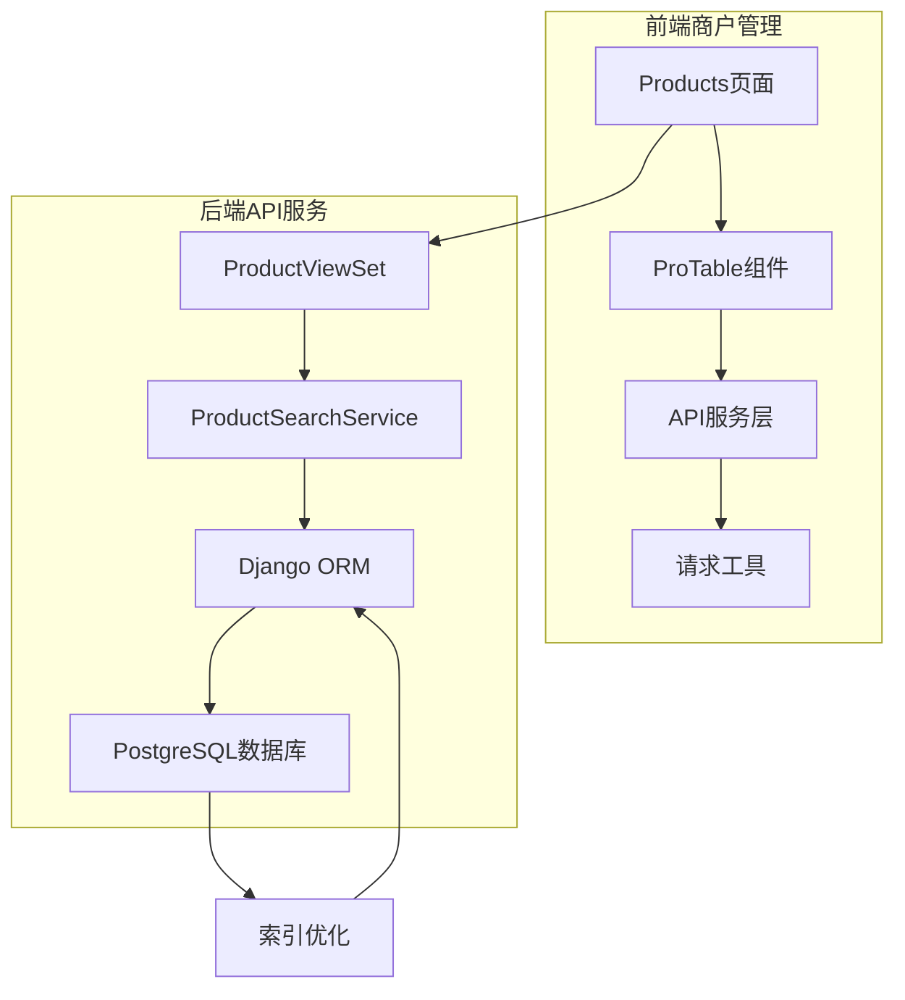
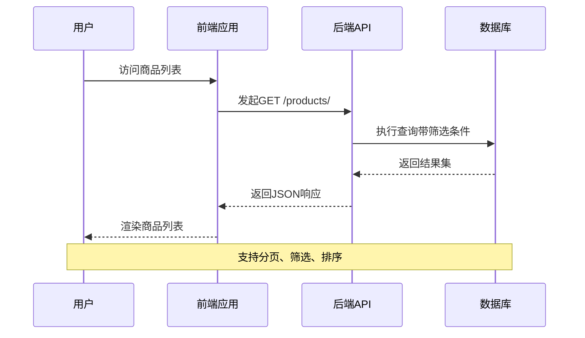
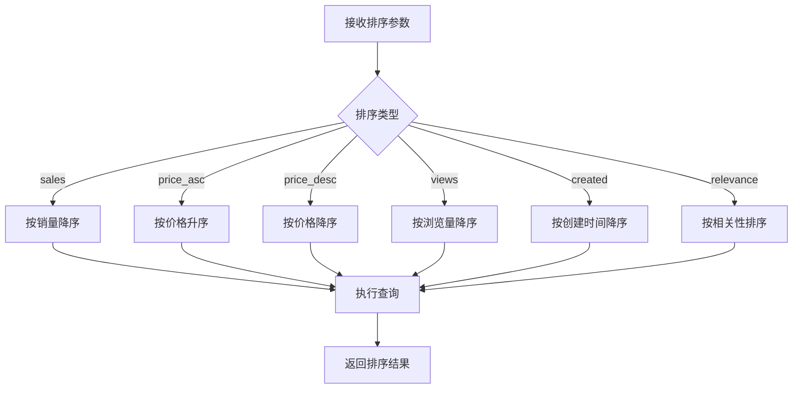
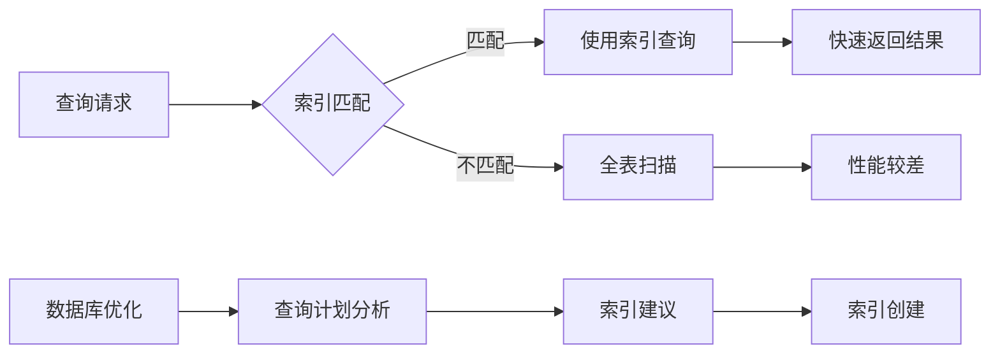
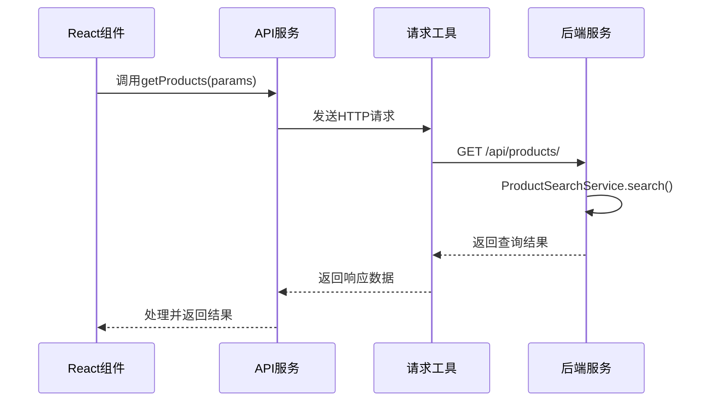
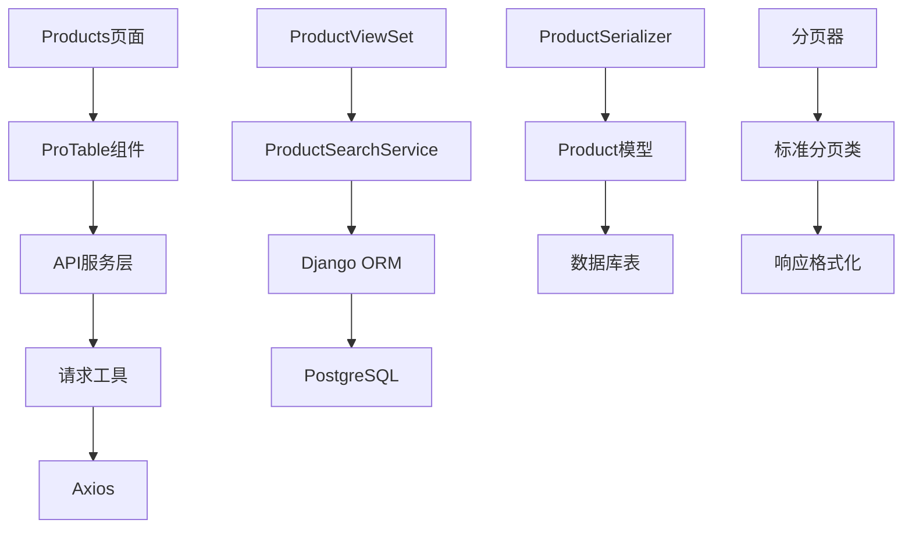

# 商品列表

<cite>
**本文档中引用的文件**
- [merchant/src/pages/Products/index.tsx](file://merchant/src/pages/Products/index.tsx)
- [merchant/src/services/api.ts](file://merchant/src/services/api.ts)
- [backend/catalog/models.py](file://backend/catalog/models.py)
- [backend/catalog/views.py](file://backend/catalog/views.py)
- [backend/catalog/serializers.py](file://backend/catalog/serializers.py)
- [backend/catalog/search.py](file://backend/catalog/search.py)
- [backend/common/pagination.py](file://backend/common/pagination.py)
- [merchant/src/utils/request.ts](file://merchant/src/utils/request.ts)
- [backend/catalog/migrations/0008_add_product_stats_and_timestamps.py](file://backend/catalog/migrations/0008_add_product_stats_and_timestamps.py)
- [backend/catalog/migrations/0014_product_invoice_price_product_is_sales_and_more.py](file://backend/catalog/migrations/0014_product_invoice_price_product_is_sales_and_more.py)
</cite>

## 目录
1. [简介](#简介)
2. [项目结构](#项目结构)
3. [核心组件](#核心组件)
4. [架构概览](#架构概览)
5. [详细组件分析](#详细组件分析)
6. [依赖关系分析](#依赖关系分析)
7. [性能考虑](#性能考虑)
8. [故障排除指南](#故障排除指南)
9. [结论](#结论)

## 简介

本文档详细介绍了电商业务系统中商户后台商品列表功能的实现。该功能基于Ant Design Pro框架的ProTable组件，实现了商品数据的分页展示、多条件筛选和排序功能。系统采用前后端分离架构，前端使用React技术栈，后端使用Django REST Framework构建API服务。

商品列表功能支持多种筛选条件（品牌、分类、价格区间、状态等），并提供基于销量、价格、浏览量等多种排序方式。系统还集成了虚拟滚动、懒加载等性能优化技术，确保在大数据量场景下的流畅体验。

## 项目结构

系统采用模块化的项目结构，主要分为前端商户管理界面和后端API服务两大部分：

**图表来源**
- [merchant/src/pages/Products/index.tsx](file://merchant/src/pages/Products/index.tsx#L1-L50)
- [backend/catalog/views.py](file://backend/catalog/views.py#L1-L50)

**章节来源**
- [merchant/src/pages/Products/index.tsx](file://merchant/src/pages/Products/index.tsx#L1-L720)
- [backend/catalog/views.py](file://backend/catalog/views.py#L1-L100)

## 核心组件

### 前端商品列表组件

前端商品列表功能的核心是基于Ant Design Pro的ProTable组件，该组件提供了丰富的表格功能：

#### 主要特性
- **分页展示**：支持自定义每页显示数量，提供快速跳转功能
- **多条件筛选**：支持品牌、分类、价格范围、状态等多种筛选条件
- **智能排序**：支持按销量、价格、浏览量、创建时间等字段排序
- **实时搜索**：提供关键词搜索功能，支持模糊匹配
- **操作便捷**：内置编辑、删除等操作按钮

#### 数据模型字段

商品数据模型包含以下关键字段：

| 字段名 | 类型 | 描述 | 展示位置 |
|--------|------|------|----------|
| name | CharField | 商品名称 | 产品名称列 |
| price | DecimalField | 商品价格 | 价格列 |
| stock | PositiveIntegerField | 库存数量 | 库存列 |
| sales_count | PositiveIntegerField | 销量统计 | 销量列 |
| view_count | PositiveIntegerField | 浏览次数 | 浏览量列 |
| is_active | BooleanField | 上架状态 | 状态列 |
| category | ForeignKey | 商品分类 | 分类列 |
| brand | ForeignKey | 品牌信息 | 品牌列 |
| source | CharField | 商品来源 | 来源列 |

**章节来源**
- [backend/catalog/models.py](file://backend/catalog/models.py#L43-L113)
- [merchant/src/pages/Products/index.tsx](file://merchant/src/pages/Products/index.tsx#L41-L204)

### 后端搜索服务

后端的ProductSearchService提供了强大的搜索和过滤功能：

#### 搜索功能
- **关键词搜索**：支持商品名称和描述的模糊匹配
- **多维度过滤**：品牌、分类、价格范围、状态等条件组合
- **智能排序**：支持相关性、价格、销量、浏览量等多种排序策略

#### 性能优化
- **数据库索引**：针对常用查询字段建立了复合索引
- **查询优化**：使用Django ORM的Q对象进行复杂查询
- **缓存机制**：对热门搜索词进行缓存处理

**章节来源**
- [backend/catalog/search.py](file://backend/catalog/search.py#L19-L287)
- [backend/catalog/views.py](file://backend/catalog/views.py#L83-L131)

## 架构概览

系统采用前后端分离架构，通过RESTful API进行数据交互：

**图表来源**
- [merchant/src/services/api.ts](file://merchant/src/services/api.ts#L29-L34)
- [backend/catalog/views.py](file://backend/catalog/views.py#L83-L131)

## 详细组件分析

### ProTable组件配置

ProTable组件是商品列表的核心UI组件，其配置包含了完整的表格功能：

#### 请求参数映射

前端请求参数与后端过滤逻辑的映射关系：

| 前端参数 | 后端参数 | 功能描述 |
|----------|----------|----------|
| page | page | 当前页码 |
| page_size | page_size | 每页条数 |
| name | search | 关键词搜索 |
| brand | brand | 品牌筛选 |
| category | category | 分类筛选 |
| min_price | min_price | 最低价格 |
| max_price | max_price | 最高价格 |
| is_active | is_active | 上架状态 |
| sort_by | 排序字段 | 排序策略 |

#### 排序实现机制

系统支持多种排序方式，通过sort_by参数控制：

**图表来源**
- [backend/catalog/search.py](file://backend/catalog/search.py#L160-L201)
- [merchant/src/pages/Products/index.tsx](file://merchant/src/pages/Products/index.tsx#L349-L356)

**章节来源**
- [merchant/src/pages/Products/index.tsx](file://merchant/src/pages/Products/index.tsx#L313-L379)

### 数据库索引优化

为了提升查询性能，系统在Product模型中建立了多个复合索引：

#### 索引设计原则

| 索引字段 | 索引类型 | 用途 |
|----------|----------|------|
| is_active, -sales_count | 复合索引 | 快速获取上架商品的销量排行 |
| is_active, -view_count | 复合索引 | 快速获取上架商品的浏览排行 |
| category, is_active | 复合索引 | 按分类筛选上架商品 |
| brand, is_active | 复合索引 | 按品牌筛选上架商品 |
| price | 单字段索引 | 价格范围查询优化 |
| -created_at | 单字段索引 | 按时间排序优化 |

#### 查询性能优化

**图表来源**
- [backend/catalog/migrations/0008_add_product_stats_and_timestamps.py](file://backend/catalog/migrations/0008_add_product_stats_and_timestamps.py#L37-L56)
- [backend/catalog/migrations/0014_product_invoice_price_product_is_sales_and_more.py](file://backend/catalog/migrations/0014_product_invoice_price_product_is_sales_and_more.py#L88-L96)

**章节来源**
- [backend/catalog/migrations/0008_add_product_stats_and_timestamps.py](file://backend/catalog/migrations/0008_add_product_stats_and_timestamps.py#L1-L58)
- [backend/catalog/migrations/0014_product_invoice_price_product_is_sales_and_more.py](file://backend/catalog/migrations/0014_product_invoice_price_product_is_sales_and_more.py#L1-L97)

### API调用流程

前端通过request函数调用后端API获取商品数据：

#### 请求处理流程

**图表来源**
- [merchant/src/services/api.ts](file://merchant/src/services/api.ts#L29-L34)
- [merchant/src/utils/request.ts](file://merchant/src/utils/request.ts#L1-L38)

**章节来源**
- [merchant/src/services/api.ts](file://merchant/src/services/api.ts#L29-L34)
- [merchant/src/utils/request.ts](file://merchant/src/utils/request.ts#L1-L38)

## 依赖关系分析

系统各组件之间的依赖关系如下：

**图表来源**
- [merchant/src/pages/Products/index.tsx](file://merchant/src/pages/Products/index.tsx#L1-L10)
- [backend/catalog/views.py](file://backend/catalog/views.py#L1-L20)

**章节来源**
- [merchant/src/pages/Products/index.tsx](file://merchant/src/pages/Products/index.tsx#L1-L720)
- [backend/catalog/views.py](file://backend/catalog/views.py#L1-L980)

## 性能考虑

### 前端性能优化

#### 虚拟滚动
对于大量数据的展示，系统支持虚拟滚动技术，只渲染可视区域内的数据项，显著提升性能。

#### 懒加载
图片资源采用懒加载策略，减少初始加载时间，提升用户体验。

#### 缓存策略
- **搜索历史缓存**：缓存热门搜索关键词
- **商品数据缓存**：对频繁访问的商品信息进行缓存
- **分类数据缓存**：缓存品牌和分类数据，减少重复请求

### 后端性能优化

#### 数据库优化
- **索引优化**：为常用查询字段建立复合索引
- **查询优化**：使用Django ORM的最佳实践
- **连接池**：合理配置数据库连接池

#### 缓存机制
- **查询结果缓存**：对复杂查询结果进行缓存
- **热点数据缓存**：对热门商品信息进行缓存
- **搜索引擎集成**：考虑集成Elasticsearch提升搜索性能

## 故障排除指南

### 常见问题及解决方案

#### 数据加载缓慢
**症状**：商品列表加载时间过长
**可能原因**：
- 数据库查询未使用索引
- 查询条件过于复杂
- 数据量过大

**解决方案**：
1. 检查数据库索引是否正确建立
2. 优化查询条件，减少不必要的筛选
3. 实施分页策略，限制单次查询数据量

#### 筛选功能失效
**症状**：筛选条件无法正确应用
**可能原因**：
- 前后端参数映射错误
- 后端过滤逻辑异常
- 数据库字段不存在

**解决方案**：
1. 检查前端请求参数与后端期望参数的一致性
2. 验证后端过滤逻辑的正确性
3. 确认数据库字段存在且类型正确

#### 排序功能异常
**症状**：排序功能无法正常工作
**可能原因**：
- 排序字段不存在
- 排序逻辑错误
- 数据类型不匹配

**解决方案**：
1. 验证排序字段在数据库中存在
2. 检查排序逻辑的实现
3. 确认数据类型的正确性

**章节来源**
- [backend/catalog/search.py](file://backend/catalog/search.py#L36-L44)
- [backend/catalog/views.py](file://backend/catalog/views.py#L52-L67)

## 结论

商户后台商品列表功能是一个功能完整、性能优化良好的电商管理系统核心组件。通过Ant Design Pro的ProTable组件，我们实现了丰富的表格功能，包括分页、筛选、排序等特性。

系统采用了前后端分离的架构设计，前端使用React技术栈，后端使用Django REST Framework，确保了系统的可扩展性和可维护性。数据库层面通过合理的索引设计和查询优化，保证了在大数据量场景下的查询性能。

未来可以考虑的优化方向包括：
- 集成Elasticsearch提升搜索性能
- 实施更精细的缓存策略
- 添加数据可视化功能
- 优化移动端体验

该功能为商户提供了高效的商品管理工具，是电商业务系统的重要组成部分。