# 商品创建功能详细文档

<cite>
**本文档引用的文件**
- [backend/catalog/serializers.py](file://backend/catalog/serializers.py)
- [backend/catalog/models.py](file://backend/catalog/models.py)
- [backend/common/serializers.py](file://backend/common/serializers.py)
- [backend/catalog/views.py](file://backend/catalog/views.py)
- [backend/catalog/urls.py](file://backend/catalog/urls.py)
- [backend/catalog/models.py](file://backend/catalog/models.py)
- [backend/orders/services.py](file://backend/orders/services.py)
- [merchant/src/pages/Products/index.tsx](file://merchant/src/pages/Products/index.tsx)
- [merchant/src/components/ImageUpload/index.tsx](file://merchant/src/components/ImageUpload/index.tsx)
- [merchant/src/utils/image.ts](file://merchant/src/utils/image.ts)
</cite>

## 目录
1. [概述](#概述)
2. [系统架构](#系统架构)
3. [前端实现](#前端实现)
4. [后端实现](#后端实现)
5. [数据模型设计](#数据模型设计)
6. [安全验证机制](#安全验证机制)
7. [图片上传处理](#图片上传处理)
8. [库存管理与日志](#库存管理与日志)
9. [最佳实践与优化](#最佳实践与优化)
10. [故障排除指南](#故障排除指南)

## 概述

商品创建功能是商户后台的核心模块，支持通过Ant Design表单组件创建新商品，包括本地商品和海尔商品两种类型。系统采用前后端分离架构，前端使用React + Ant Design，后端基于Django REST Framework构建，提供完整的商品生命周期管理功能。

### 主要特性

- **双商品类型支持**：本地商品和海尔商品的差异化处理
- **完善的表单验证**：前端和后端双重验证机制
- **智能图片管理**：支持多图上传、预览和实时同步
- **库存安全保障**：基于事务的库存变更和审计日志
- **异步处理能力**：支持并发创建和批量操作

## 系统架构

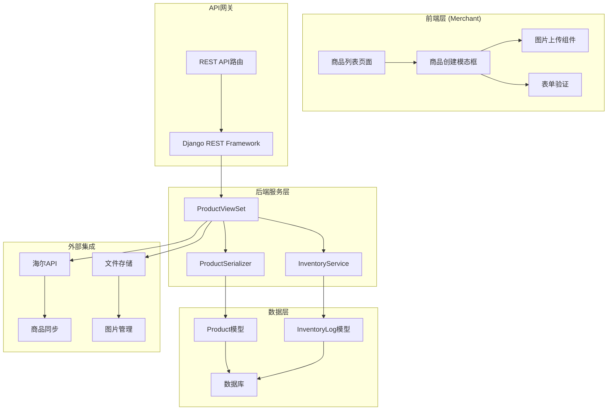

**架构图源文件**
- [backend/catalog/views.py](file://backend/catalog/views.py#L30-L50)
- [backend/catalog/urls.py](file://backend/catalog/urls.py#L1-L15)
- [merchant/src/pages/Products/index.tsx](file://merchant/src/pages/Products/index.tsx#L1-L50)

## 前端实现

### 表单组件架构

前端使用Ant Design Pro的ModalForm组件构建商品创建界面，支持本地商品和海尔商品的差异化展示。

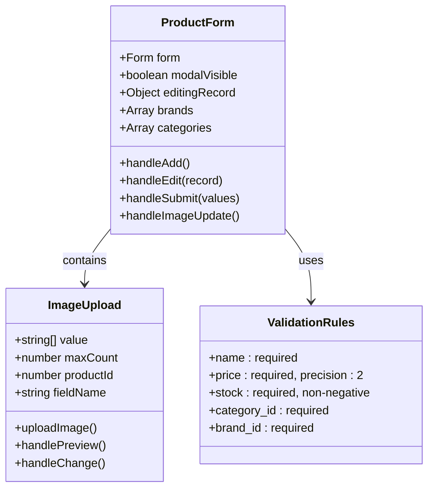

**类图源文件**
- [merchant/src/pages/Products/index.tsx](file://merchant/src/pages/Products/index.tsx#L412-L470)
- [merchant/src/components/ImageUpload/index.tsx](file://merchant/src/components/ImageUpload/index.tsx#L8-L16)

### 字段验证规则

表单字段采用多层次验证机制：

| 字段类型 | 验证规则 | 错误提示 | 实现位置 |
|---------|---------|---------|----------|
| 产品名称 | 必填，最大200字符 | 请输入产品名称 | 前端ProFormText |
| 价格 | 必填，非负数，精确到小数点后2位 | 请输入正确的价格 | 前端ProFormDigit + 后端PriceField |
| 库存 | 必填，非负整数 | 请输入库存数量 | 前端ProFormDigit + 后端StockField |
| 品牌 | 必填，从下拉选择 | 请选择品牌 | 前端ProFormSelect |
| 分类 | 必填，从下拉选择 | 请选择分类 | 前端ProFormSelect |
| 商品来源 | 必填，默认本地 | 请选择商品来源 | 前端ProFormSelect |
| 主图 | 最多5张，图片格式 | 请上传主图 | 图片上传组件 |

**字段验证源文件**
- [merchant/src/pages/Products/index.tsx](file://merchant/src/pages/Products/index.tsx#L483-L551)

### 图片上传组件

图片上传组件提供实时预览和自动同步功能：

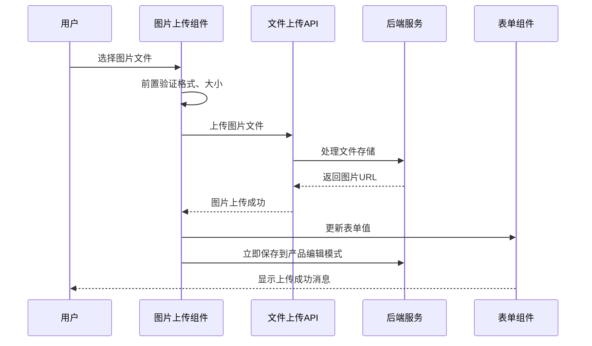

**序列图源文件**
- [merchant/src/components/ImageUpload/index.tsx](file://merchant/src/components/ImageUpload/index.tsx#L73-L118)

**节源文件**
- [merchant/src/components/ImageUpload/index.tsx](file://merchant/src/components/ImageUpload/index.tsx#L1-L173)

## 后端实现

### ProductSerializer设计

后端使用专门的ProductSerializer处理商品数据的序列化和验证：

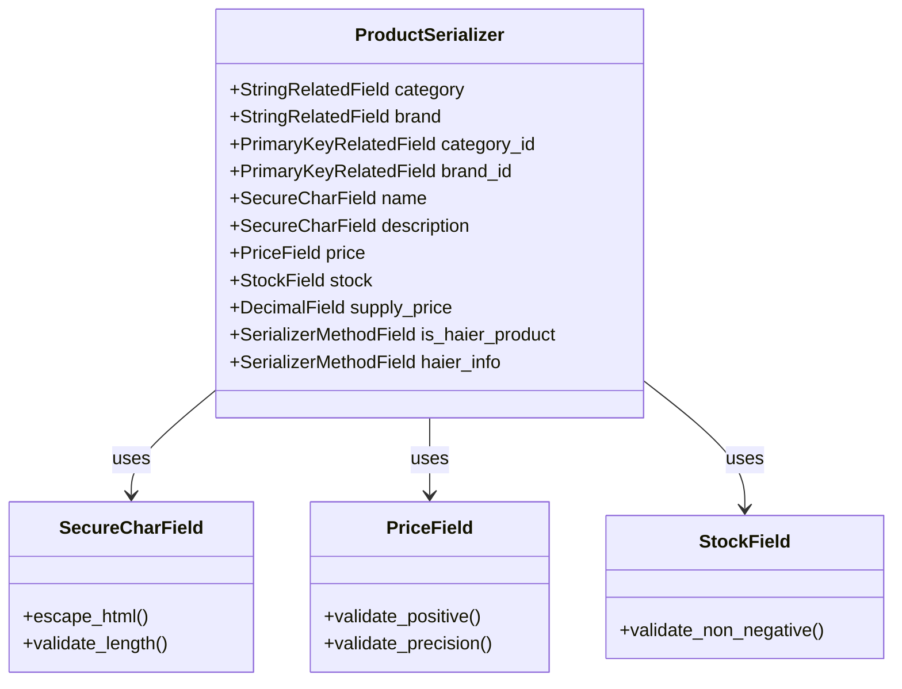

**类图源文件**
- [backend/catalog/serializers.py](file://backend/catalog/serializers.py#L50-L74)
- [backend/common/serializers.py](file://backend/common/serializers.py#L15-L339)

### 外键关联处理

ProductSerializer中的外键字段处理逻辑：

| 字段 | 类型 | 功能 | 验证规则 |
|------|------|------|----------|
| category_id | PrimaryKeyRelatedField | 关联商品分类 | 必填，必须存在于Category表 |
| brand_id | PrimaryKeyRelatedField | 关联品牌 | 必填，必须存在于Brand表 |
| category | StringRelatedField | 只读显示分类名称 | 自动关联查询 |
| brand | StringRelatedField | 只读显示品牌名称 | 自动关联查询 |

**外键处理源文件**
- [backend/catalog/serializers.py](file://backend/catalog/serializers.py#L52-L55)

### 安全字段验证

系统实现了多层安全验证机制：

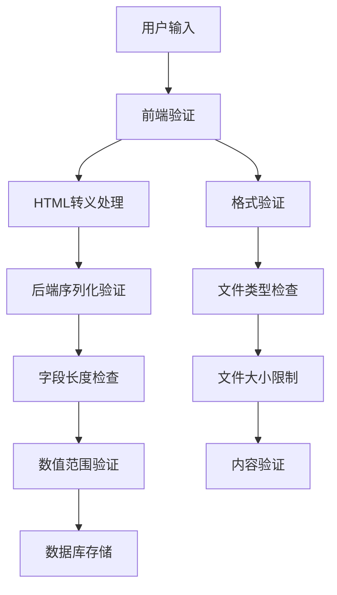

**安全验证源文件**
- [backend/common/serializers.py](file://backend/common/serializers.py#L15-L49)

**节源文件**
- [backend/catalog/serializers.py](file://backend/catalog/serializers.py#L1-L74)
- [backend/common/serializers.py](file://backend/common/serializers.py#L1-L339)

## 数据模型设计

### 商品模型结构

商品模型支持本地商品和海尔商品的差异化存储：

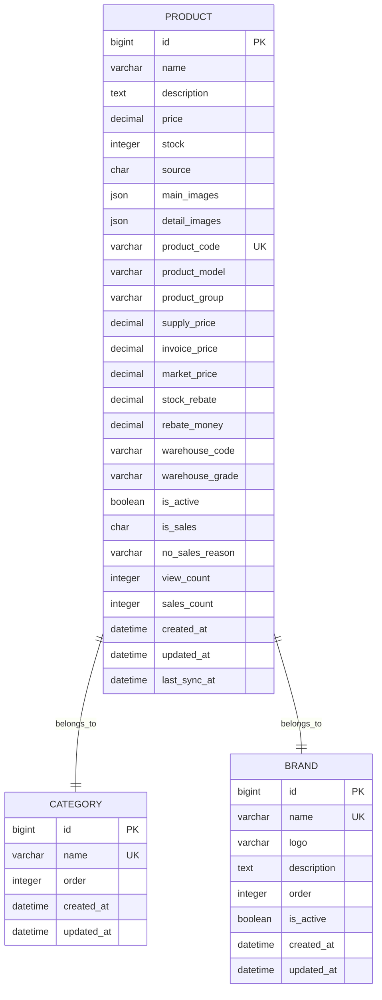

**实体关系图源文件**
- [backend/catalog/models.py](file://backend/catalog/models.py#L43-L200)

### 海尔商品标识字段

系统通过`is_haier_product`和`haier_info`字段区分不同类型的商品：

| 字段 | 类型 | 用途 | 业务规则 |
|------|------|------|----------|
| source | CharField | 商品来源标识 | local/haier |
| product_code | CharField | 海尔产品编码 | 唯一标识海尔商品 |
| is_haier_product | SerializerMethodField | 是否为海尔商品 | 基于source字段计算 |
| haier_info | SerializerMethodField | 海尔商品信息 | 包含价格、库存等信息 |
| last_sync_at | DateTimeField | 最后同步时间 | 记录与海尔API的同步状态 |

**海尔商品源文件**
- [backend/catalog/models.py](file://backend/catalog/models.py#L51-L64)
- [backend/catalog/serializers.py](file://backend/catalog/serializers.py#L59-L62)

**节源文件**
- [backend/catalog/models.py](file://backend/catalog/models.py#L1-L312)

## 安全验证机制

### SecureCharField实现

SecureCharField提供自动HTML转义功能，防止XSS攻击：

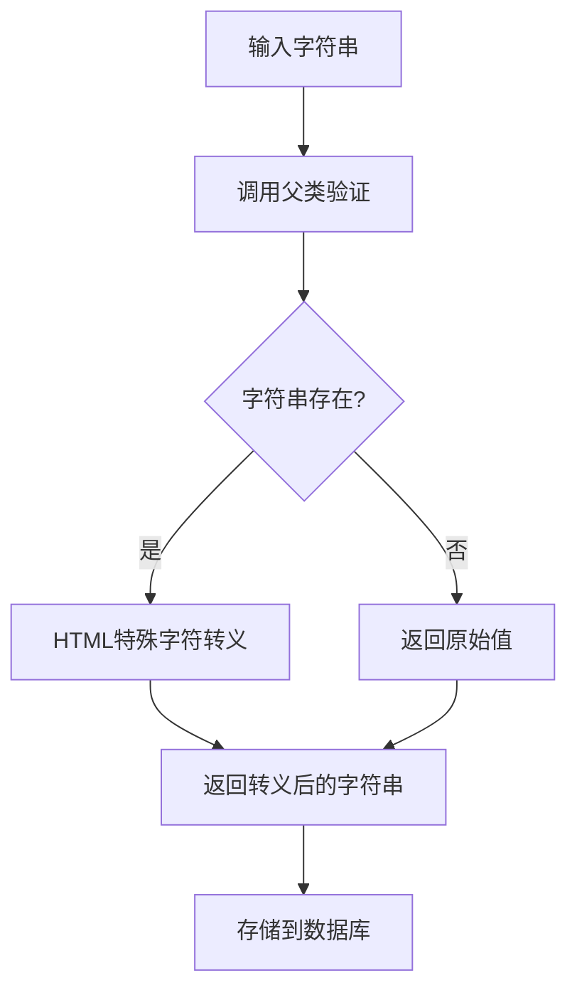

**安全机制源文件**
- [backend/common/serializers.py](file://backend/common/serializers.py#L28-L48)

### 图片文件验证

图片上传组件实现了严格的文件验证机制：

| 验证项目 | 规则 | 错误处理 |
|---------|------|----------|
| 文件扩展名 | 白名单：jpg, jpeg, png, gif, webp, bmp | 显示支持的文件类型 |
| 文件大小 | 最大20MB | 提示文件过大 |
| MIME类型 | 验证文件头和内容 | 检测文件真实类型 |
| 文件内容 | 多种检测方法 | 防止恶意文件伪装 |

**图片验证源文件**
- [backend/common/serializers.py](file://backend/common/serializers.py#L51-L278)

### 数值字段验证

PriceField和StockField提供了专门的数值验证：

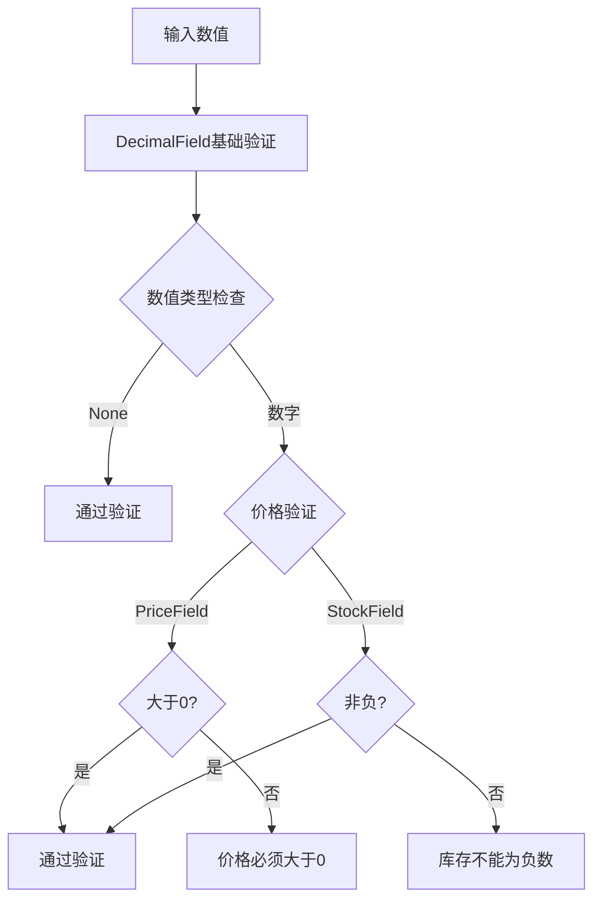

**数值验证源文件**
- [backend/common/serializers.py](file://backend/common/serializers.py#L280-L339)

## 图片上传处理

### 图片存储策略

系统采用安全的图片存储方案：

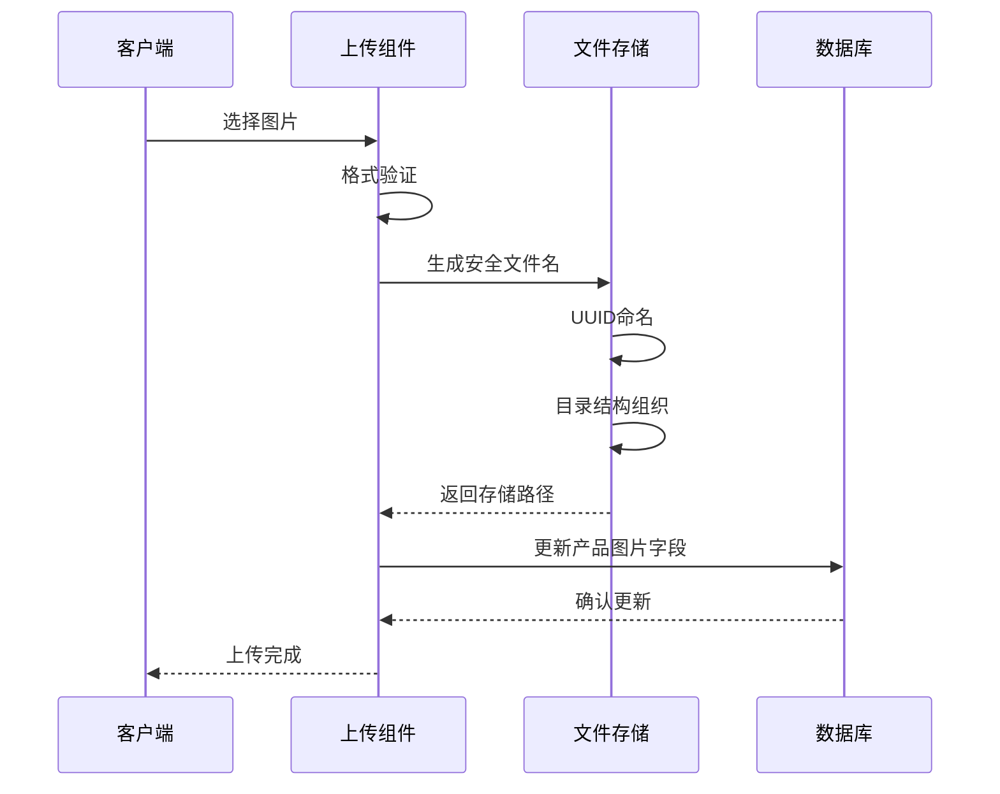

**图片处理源文件**
- [backend/catalog/views.py](file://backend/catalog/views.py#L769-L792)

### 图片预览与管理

图片上传组件提供完整的图片管理功能：

| 功能 | 实现方式 | 特性 |
|------|----------|------|
| 实时预览 | Ant Design Upload组件 | 支持图片预览和删除 |
| 多图上传 | multiple属性 | 支持批量选择 |
| 限制控制 | maxCount属性 | 控制最大上传数量 |
| 即时同步 | 编辑模式自动保存 | 上传后立即更新产品 |
| 错误处理 | 统一错误提示 | 友好的用户反馈 |

**节源文件**
- [merchant/src/components/ImageUpload/index.tsx](file://merchant/src/components/ImageUpload/index.tsx#L1-L173)

## 库存管理与日志

### 库存变更流程

系统通过InventoryLog模型记录所有库存变更：

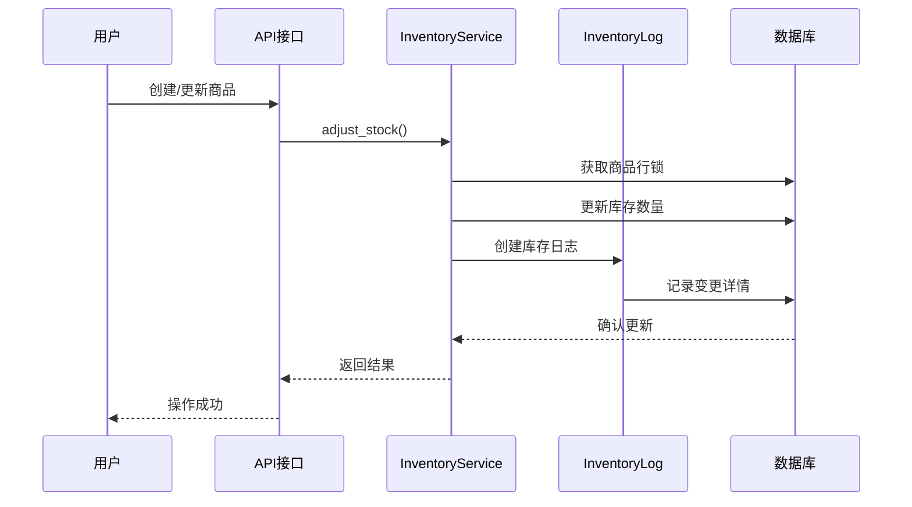

**库存管理源文件**
- [backend/orders/services.py](file://backend/orders/services.py#L325-L450)

### 库存日志结构

InventoryLog模型记录详细的库存变更信息：

| 字段 | 类型 | 描述 | 示例值 |
|------|------|------|--------|
| product | ForeignKey | 关联商品 | 商品对象 |
| change_type | CharField | 变更类型 | lock/release/adjust |
| quantity | IntegerField | 变更数量 | +10/-5 |
| reason | CharField | 变更原因 | manual_adjust/order_cancelled |
| created_by | ForeignKey | 操作人 | 用户对象 |
| created_at | DateTimeField | 创建时间 | 2024-01-01 12:00:00 |

**库存日志源文件**
- [backend/catalog/models.py](file://backend/catalog/models.py#L267-L312)

### 数据一致性保障

系统通过多种机制确保数据一致性：

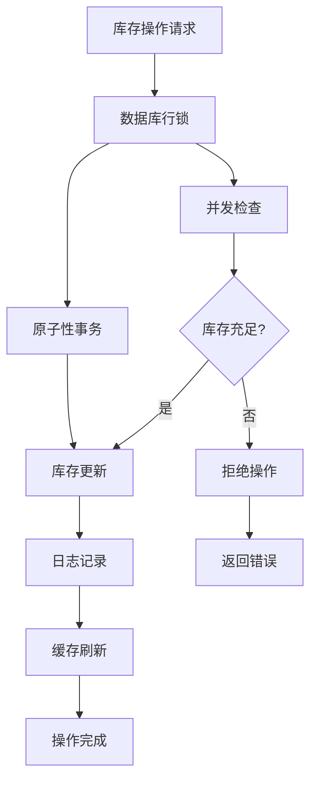

**数据一致性源文件**
- [backend/orders/services.py](file://backend/orders/services.py#L412-L449)

## 最佳实践与优化

### 防止重复提交

系统采用多重防重复提交机制：

| 机制 | 实现方式 | 效果 |
|------|----------|------|
| 前端按钮禁用 | 设置loading状态 | 防止快速点击 |
| 表单状态管理 | useForm控制 | 避免重复提交 |
| 后端幂等性 | 唯一约束检查 | 防止重复创建 |
| CSRF保护 | Django中间件 | 防止跨站攻击 |

### 异步验证策略

系统支持异步字段验证：

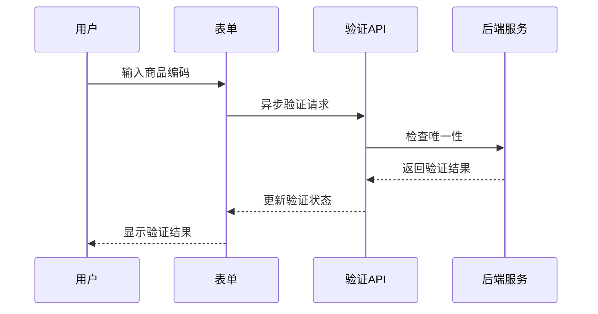

### 性能优化措施

1. **数据库索引优化**：为常用查询字段建立索引
2. **查询优化**：使用select_related减少查询次数
3. **缓存策略**：缓存品牌和分类数据
4. **分页处理**：大数据量列表采用分页加载

### 错误处理策略

系统实现了完善的错误处理机制：

| 错误类型 | 处理方式 | 用户体验 |
|---------|----------|----------|
| 表单验证错误 | 实时反馈 | 字段级错误提示 |
| 网络请求错误 | 重试机制 | 友好错误消息 |
| 数据库错误 | 事务回滚 | 状态恢复 |
| 文件上传错误 | 格式化提示 | 清晰的解决建议 |

**节源文件**
- [merchant/src/pages/Products/index.tsx](file://merchant/src/pages/Products/index.tsx#L425-L467)

## 故障排除指南

### 常见问题及解决方案

#### 商品创建失败

**问题症状**：提交表单后出现"操作失败"提示

**可能原因**：
1. 必填字段未填写完整
2. 价格或库存格式错误
3. 品牌或分类不存在
4. 数据库连接问题

**解决步骤**：
1. 检查所有必填字段是否填写
2. 验证价格和库存格式
3. 确认品牌和分类存在
4. 查看浏览器控制台错误信息

#### 图片上传失败

**问题症状**：图片上传进度条卡住或显示"上传失败"

**可能原因**：
1. 文件格式不支持
2. 文件大小超限
3. 网络连接不稳定
4. 服务器存储空间不足

**解决步骤**：
1. 检查文件格式是否为jpg、png、gif等
2. 确认文件大小不超过20MB
3. 检查网络连接状态
4. 联系管理员检查服务器状态

#### 库存同步异常

**问题症状**：海尔商品库存无法同步更新

**可能原因**：
1. 海尔API认证失败
2. 商品编码不存在
3. 网络连接问题
4. API配额限制

**解决步骤**：
1. 检查海尔API配置
2. 验证商品编码正确性
3. 确认网络连接正常
4. 查看API调用日志

### 调试工具和技巧

#### 前端调试

1. 使用浏览器开发者工具查看网络请求
2. 检查Console中的JavaScript错误
3. 使用React DevTools调试组件状态

#### 后端调试

1. 查看Django日志文件
2. 使用数据库查询日志
3. 检查Celery任务队列状态

#### 性能监控

1. 监控API响应时间
2. 检查数据库查询性能
3. 监控内存和CPU使用率

**节源文件**
- [merchant/src/pages/Products/index.tsx](file://merchant/src/pages/Products/index.tsx#L464-L467)

## 总结

商品创建功能是一个完整的电商系统核心模块，通过前后端协作实现了安全、高效的商品管理。系统具备以下优势：

1. **安全性**：多层验证机制防止各种攻击
2. **可靠性**：完善的错误处理和数据一致性保障
3. **易用性**：直观的用户界面和实时反馈
4. **扩展性**：模块化设计支持功能扩展
5. **性能**：优化的数据库查询和缓存策略

通过持续的优化和维护，该功能能够满足现代电商平台对商品管理的各种需求，为用户提供优质的使用体验。