# 商品管理

<cite>
**本文档引用的文件**
- [merchant/src/pages/Products/index.tsx](file://merchant/src/pages/Products/index.tsx)
- [backend/catalog/models.py](file://backend/catalog/models.py)
- [backend/catalog/views.py](file://backend/catalog/views.py)
- [backend/catalog/serializers.py](file://backend/catalog/serializers.py)
- [backend/catalog/search.py](file://backend/catalog/search.py)
- [frontend/src/services/product.ts](file://frontend/src/services/product.ts)
- [merchant/src/components/ImageUpload/index.tsx](file://merchant/src/components/ImageUpload/index.tsx)
- [backend/integrations/haierapi.py](file://backend/integrations/haierapi.py)
- [merchant/src/services/api.ts](file://merchant/src/services/api.ts)
- [frontend/src/types/index.ts](file://frontend/src/types/index.ts)
- [backend/common/pagination.py](file://backend/common/pagination.py)
- [merchant/src/utils/image.ts](file://merchant/src/utils/image.ts)
</cite>

## 目录
1. [概述](#概述)
2. [系统架构](#系统架构)
3. [商品数据模型](#商品数据模型)
4. [前端商品管理界面](#前端商品管理界面)
5. [后端API接口](#后端api接口)
6. [搜索与筛选功能](#搜索与筛选功能)
7. [图片上传与管理](#图片上传与管理)
8. [海尔商品集成](#海尔商品集成)
9. [性能优化策略](#性能优化策略)
10. [操作指南](#操作指南)
11. [故障排除](#故障排除)

## 概述

商品管理系统是商户后台的核心功能模块，提供完整的商品生命周期管理能力。系统支持本地商品和海尔商品的统一管理，具备强大的搜索筛选、批量操作和实时同步功能。

### 主要特性

- **双数据源管理**：支持本地商品和海尔商品的混合管理
- **智能搜索**：基于关键词、分类、品牌的多维度搜索
- **实时同步**：与海尔API的实时数据同步机制
- **图片管理**：支持主图和详情图的上传、预览和管理
- **权限控制**：基于角色的访问控制和操作权限
- **性能优化**：分页、缓存和防抖搜索提升用户体验

## 系统架构

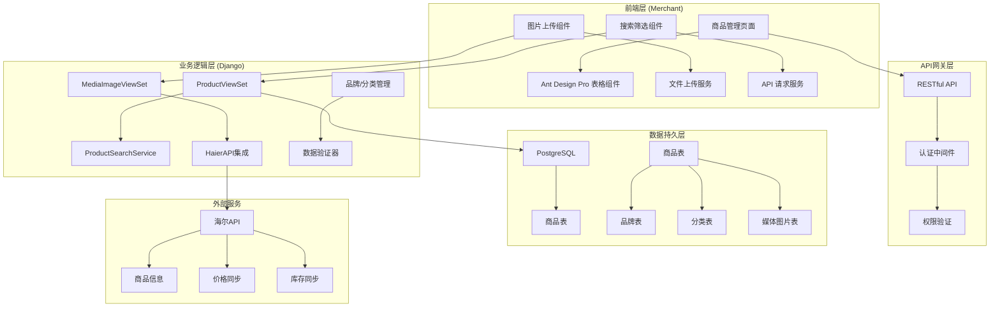

**图表来源**
- [merchant/src/pages/Products/index.tsx](file://merchant/src/pages/Products/index.tsx#L1-L50)
- [backend/catalog/views.py](file://backend/catalog/views.py#L29-L51)
- [backend/integrations/haierapi.py](file://backend/integrations/haierapi.py#L10-L30)

## 商品数据模型

### 核心字段设计

商品模型采用灵活的设计，支持本地商品和海尔商品的差异化管理：

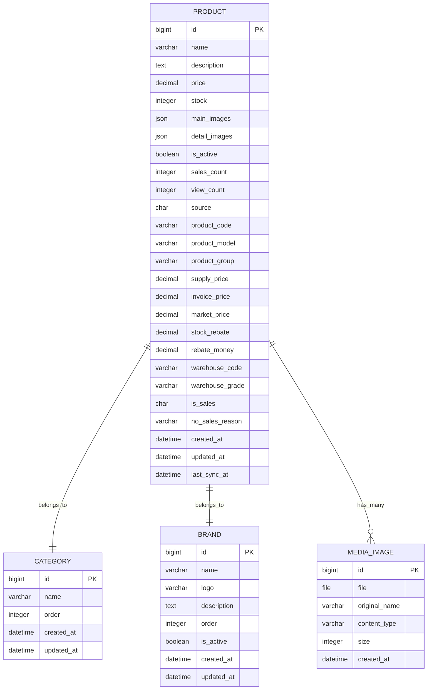

**图表来源**
- [backend/catalog/models.py](file://backend/catalog/models.py#L43-L116)

### 数据源标识

系统通过 `source` 字段区分商品来源：

| 源标识 | 描述 | 特点 |
|--------|------|------|
| `local` | 本地商品 | 完全由商户维护，支持所有字段编辑 |
| `haier` | 海尔商品 | 来源于海尔API，部分字段只读或自动同步 |

### 价格体系设计

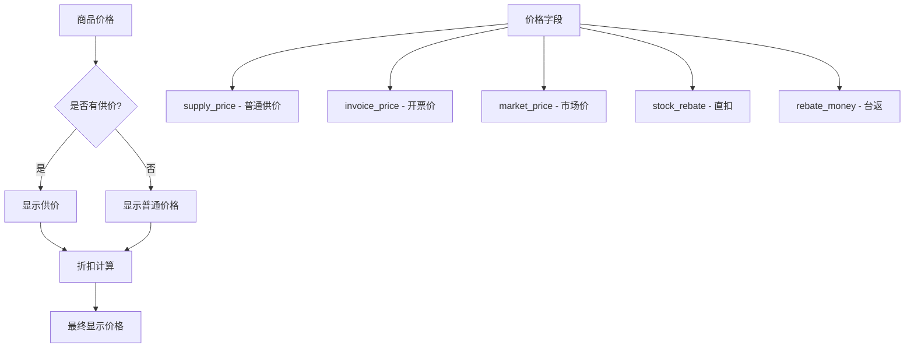

**图表来源**
- [backend/catalog/models.py](file://backend/catalog/models.py#L197-L200)
- [backend/catalog/serializers.py](file://backend/catalog/serializers.py#L205-L210)

**章节来源**
- [backend/catalog/models.py](file://backend/catalog/models.py#L43-L116)
- [backend/catalog/serializers.py](file://backend/catalog/serializers.py#L50-L85)

## 前端商品管理界面

### 主要组件架构

商品管理页面采用Ant Design Pro的ProTable组件构建，提供完整的CRUD功能：

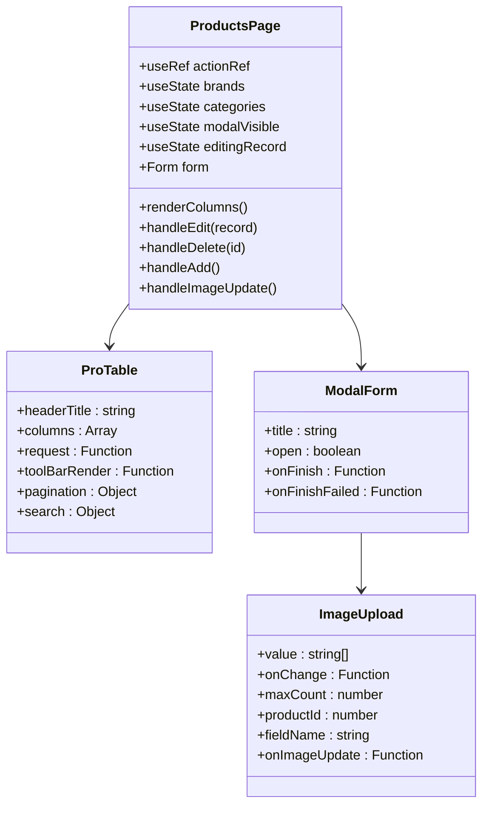

**图表来源**
- [merchant/src/pages/Products/index.tsx](file://merchant/src/pages/Products/index.tsx#L1-L50)

### 表格列配置

商品列表包含以下核心列：

| 列名 | 数据字段 | 类型 | 功能描述 |
|------|----------|------|----------|
| 主图 | `main_images` | 图片 | 展示商品主图，支持缩略图显示 |
| 产品名称 | `name` | 文本 | 商品名称，支持单元格省略 |
| 品牌 | `brand` | 文本 | 品牌名称，表格中显示 |
| 品牌筛选 | `brand` | 下拉选择 | 搜索时使用的筛选条件 |
| 分类 | `category` | 文本 | 商品分类，表格中显示 |
| 分类筛选 | `category` | 下拉选择 | 搜索时使用的筛选条件 |
| 价格 | `price` | 数字 | 商品价格，格式化显示 |
| 最低价格 | `min_price` | 数字 | 价格范围筛选下限 |
| 最高价格 | `max_price` | 数字 | 价格范围筛选上限 |
| 库存 | `stock` | 数字 | 库存数量，带颜色标识 |
| 状态 | `is_active` | 状态标签 | 上架/下架状态 |
| 销量 | `sales_count` | 数字 | 销售统计，支持排序 |
| 浏览量 | `view_count` | 数字 | 浏览统计 |
| 操作 | `操作` | 按钮组 | 编辑、删除功能 |

### 表单验证逻辑

商品创建和编辑表单包含严格的验证规则：

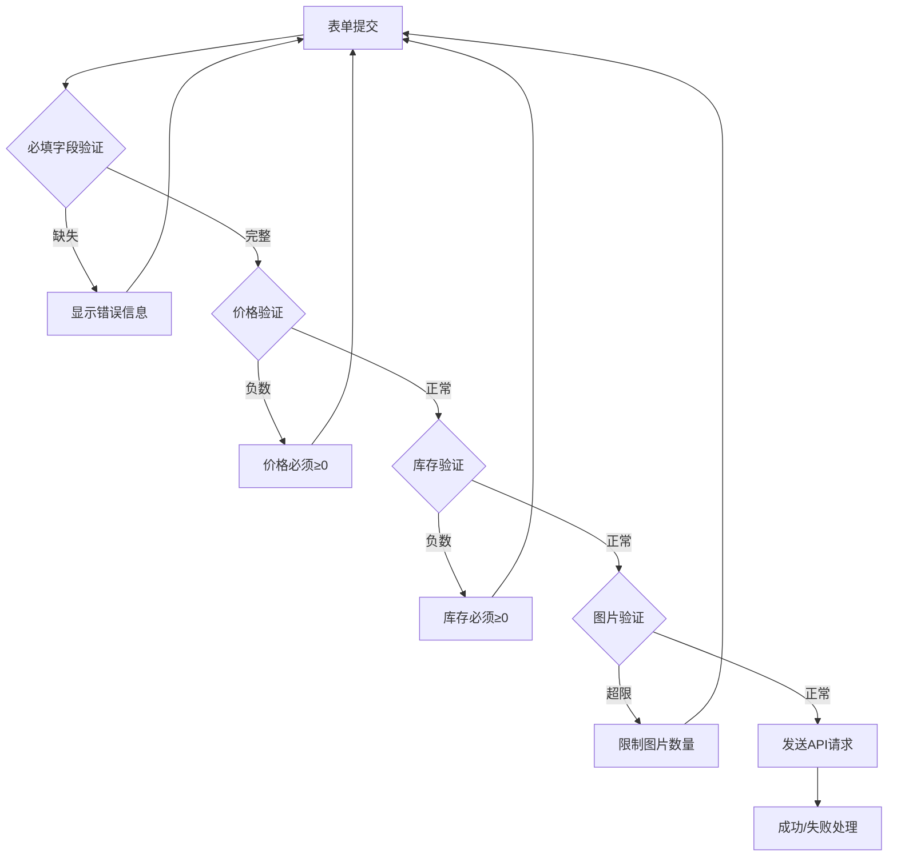

**图表来源**
- [merchant/src/pages/Products/index.tsx](file://merchant/src/pages/Products/index.tsx#L425-L467)

**章节来源**
- [merchant/src/pages/Products/index.tsx](file://merchant/src/pages/Products/index.tsx#L41-L205)
- [merchant/src/pages/Products/index.tsx](file://merchant/src/pages/Products/index.tsx#L425-L467)

## 后端API接口

### 核心API端点

系统提供RESTful API接口，支持标准的CRUD操作：

| 方法 | 端点 | 功能 | 权限要求 |
|------|------|------|----------|
| GET | `/products/` | 获取商品列表 | AllowAny |
| POST | `/products/` | 创建新商品 | IsAdminOrReadOnly |
| GET | `/products/{id}/` | 获取商品详情 | AllowAny |
| PUT | `/products/{id}/` | 更新商品信息 | IsAdminOrReadOnly |
| PATCH | `/products/{id}/` | 部分更新商品 | IsAdminOrReadOnly |
| DELETE | `/products/{id}/` | 删除商品 | IsAdminOrReadOnly |

### 搜索与过滤参数

商品列表API支持丰富的查询参数：

| 参数名 | 类型 | 描述 | 示例 |
|--------|------|------|------|
| `search` | string | 关键词搜索 | `?search=冰箱` |
| `category` | string | 分类筛选 | `?category=家电` |
| `brand` | string | 品牌筛选 | `?brand=海尔` |
| `min_price` | decimal | 最低价格 | `?min_price=100` |
| `max_price` | decimal | 最高价格 | `?max_price=5000` |
| `is_active` | boolean | 上架状态 | `?is_active=true` |
| `sort_by` | string | 排序方式 | `?sort_by=sales` |
| `page` | integer | 页码 | `?page=2` |
| `page_size` | integer | 每页数量 | `?page_size=20` |

### 响应数据结构

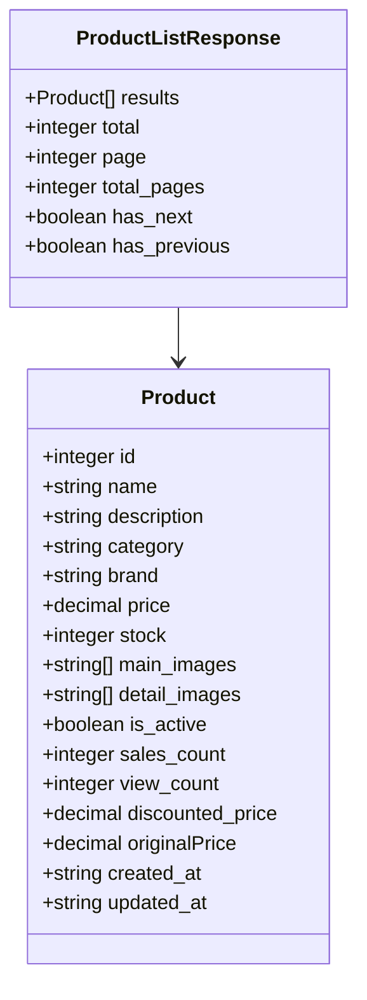

**图表来源**
- [frontend/src/types/index.ts](file://frontend/src/types/index.ts#L20-L49)
- [backend/catalog/views.py](file://backend/catalog/views.py#L83-L131)

**章节来源**
- [backend/catalog/views.py](file://backend/catalog/views.py#L29-L51)
- [backend/catalog/views.py](file://backend/catalog/views.py#L83-L131)
- [frontend/src/services/product.ts](file://frontend/src/services/product.ts#L1-L64)

## 搜索与筛选功能

### 搜索服务架构

系统采用专门的搜索服务类实现复杂的查询逻辑：

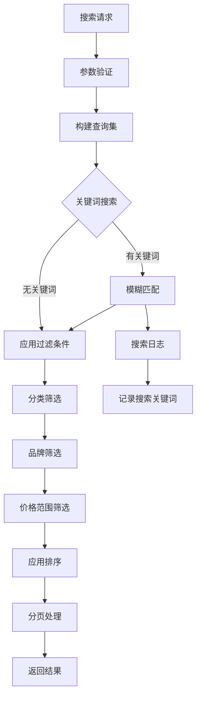

**图表来源**
- [backend/catalog/search.py](file://backend/catalog/search.py#L47-L158)

### 排序策略

系统支持多种排序策略：

| 排序选项 | 描述 | 适用场景 |
|----------|------|----------|
| `relevance` | 关键词相关性 | 搜索结果排序 |
| `price_asc` | 价格升序 | 性价比筛选 |
| `price_desc` | 价格降序 | 高端商品查找 |
| `sales` | 销量降序 | 热销商品排行 |
| `views` | 浏览量降序 | 流行商品推荐 |
| `created` | 创建时间降序 | 最新商品 |

### 筛选条件组合

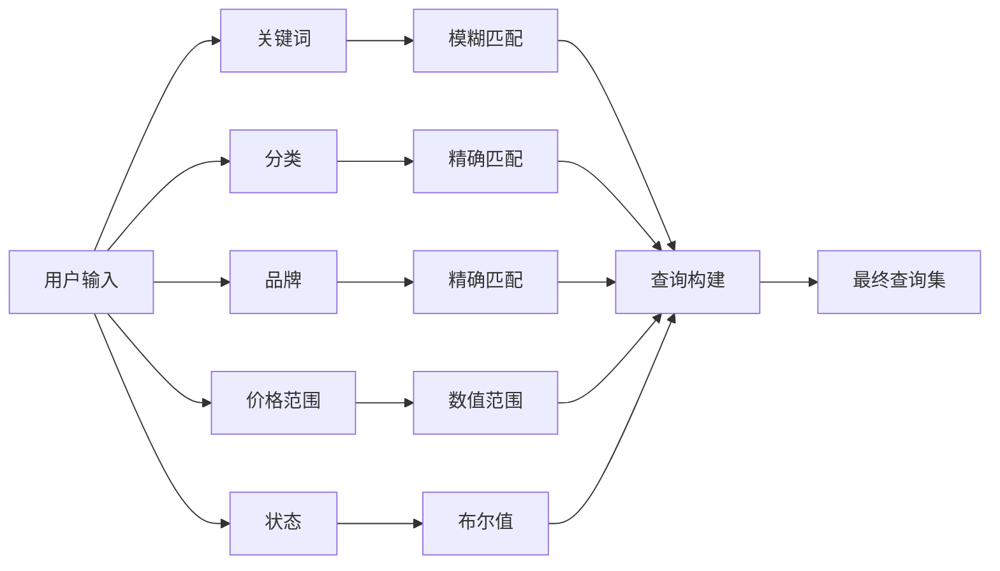

**图表来源**
- [backend/catalog/search.py](file://backend/catalog/search.py#L97-L133)

**章节来源**
- [backend/catalog/search.py](file://backend/catalog/search.py#L19-L85)
- [backend/catalog/search.py](file://backend/catalog/search.py#L47-L158)

## 图片上传与管理

### 图片上传组件

图片上传组件提供直观的拖拽上传体验：

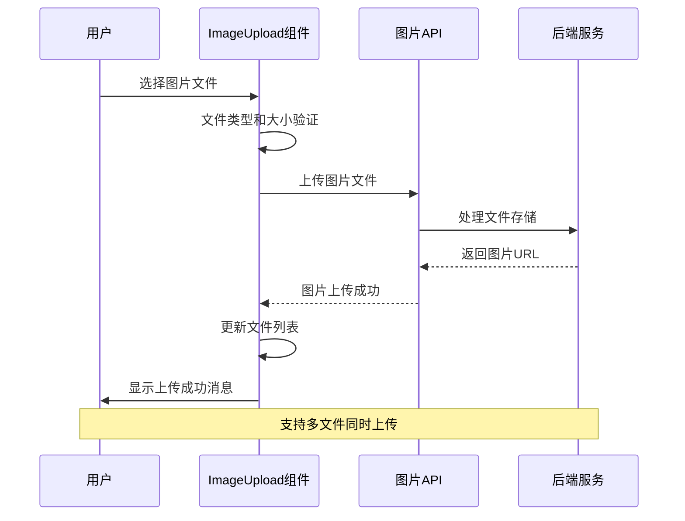

**图表来源**
- [merchant/src/components/ImageUpload/index.tsx](file://merchant/src/components/ImageUpload/index.tsx#L73-L122)

### 图片处理流程

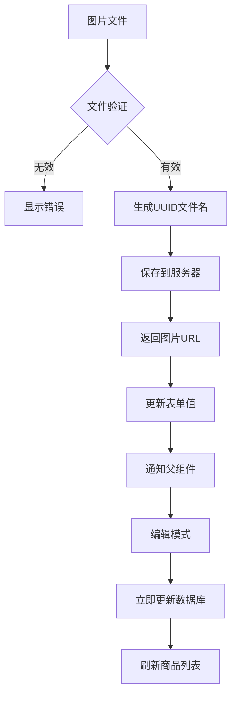

**图表来源**
- [merchant/src/components/ImageUpload/index.tsx](file://merchant/src/components/ImageUpload/index.tsx#L73-L122)

### 图片存储策略

| 存储类型 | 文件路径 | 用途 | 限制 |
|----------|----------|------|------|
| 主图 | `images/{year}/{month}/{day}/{uuid}.jpg` | 商品主视觉图 | 5张，建议800x800像素 |
| 详情图 | `images/{year}/{month}/{day}/{uuid}.jpg` | 商品详情展示 | 10张，建议750x1000像素 |
| 品牌Logo | `images/{year}/{month}/{day}/{uuid}.jpg` | 品牌标识 | 1张，建议200x200像素 |

**章节来源**
- [merchant/src/components/ImageUpload/index.tsx](file://merchant/src/components/ImageUpload/index.tsx#L1-L173)
- [backend/catalog/serializers.py](file://backend/catalog/serializers.py#L255-L352)

## 海尔商品集成

### 海尔API集成架构

系统与海尔API建立双向同步机制：

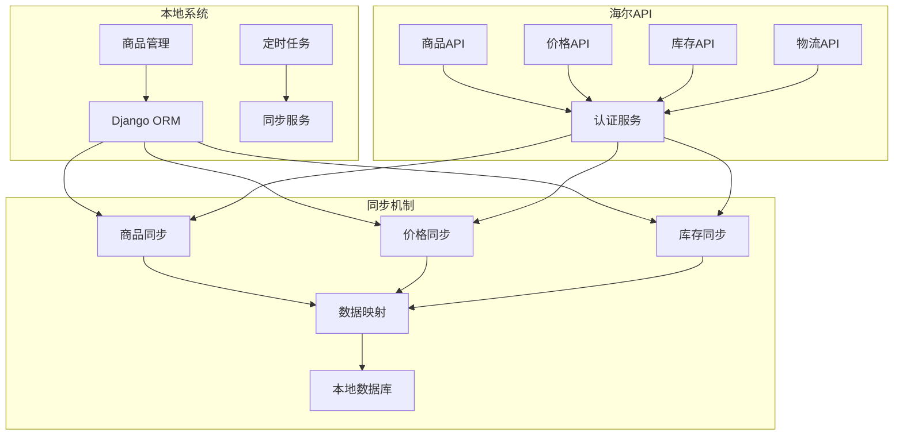

**图表来源**
- [backend/integrations/haierapi.py](file://backend/integrations/haierapi.py#L10-L30)

### 数据同步策略

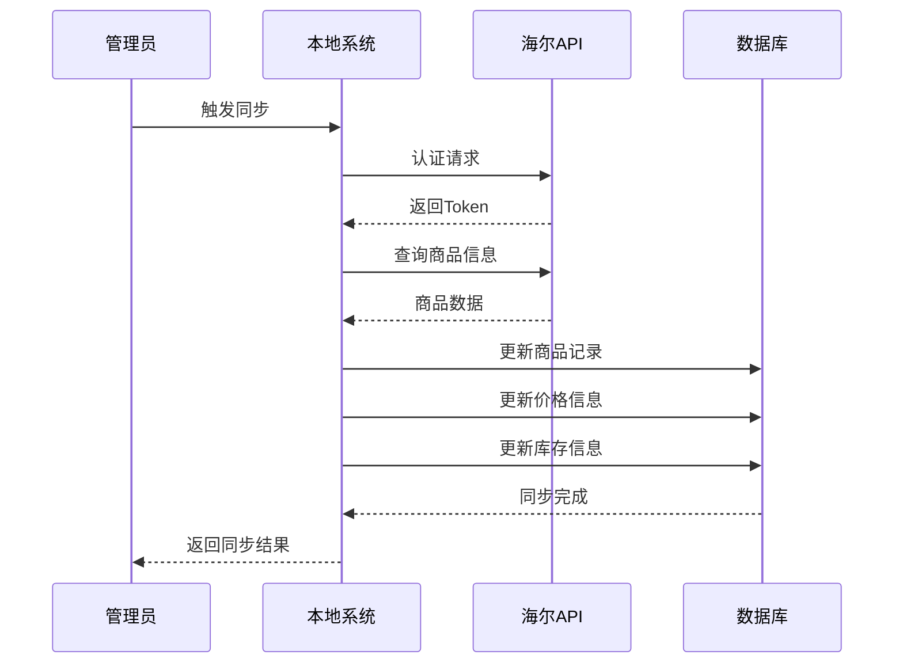

**图表来源**
- [backend/catalog/models.py](file://backend/catalog/models.py#L118-L179)

### 海尔商品特殊处理

| 字段类型 | 本地字段 | 海尔字段 | 同步策略 |
|----------|----------|----------|----------|
| 基础信息 | `name`, `description` | `productModel`, `productGroup` | 单向同步 |
| 价格信息 | `price` | `supply_price`, `invoice_price` | 双向同步 |
| 库存信息 | `stock` | `warehouse_code`, `warehouse_grade` | 实时同步 |
| 状态信息 | `is_active` | `is_sales`, `no_sales_reason` | 只读同步 |

**章节来源**
- [backend/integrations/haierapi.py](file://backend/integrations/haierapi.py#L1-L214)
- [backend/catalog/models.py](file://backend/catalog/models.py#L118-L179)

## 性能优化策略

### 分页与缓存

系统采用多层缓存策略提升性能：

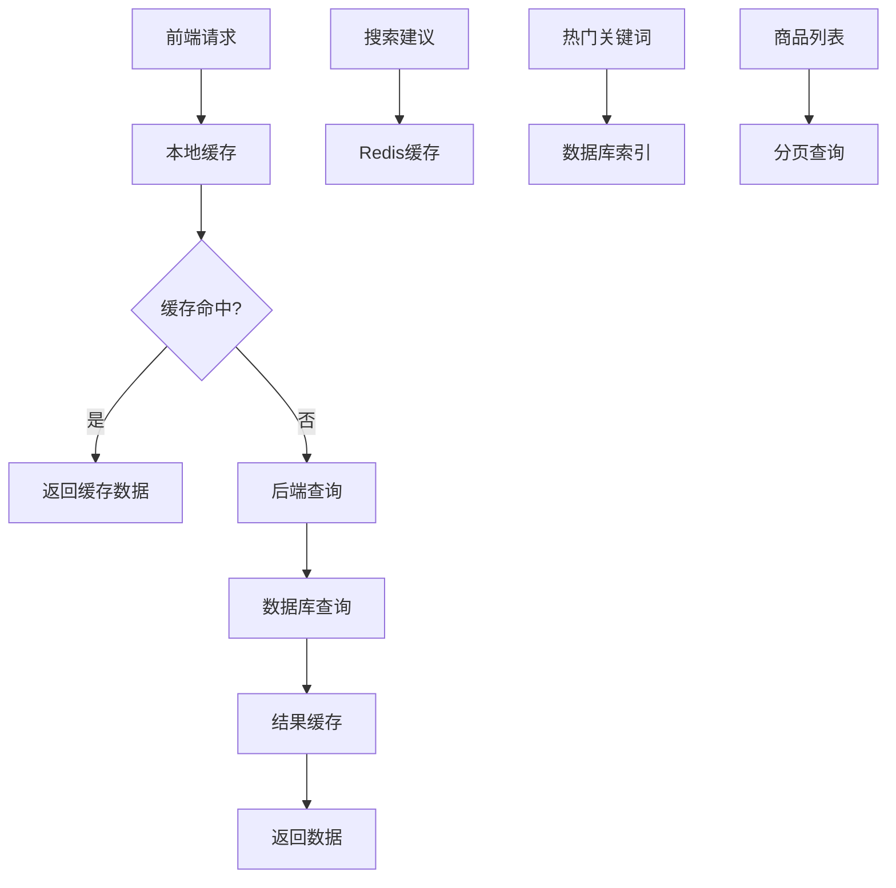

### 防抖搜索机制

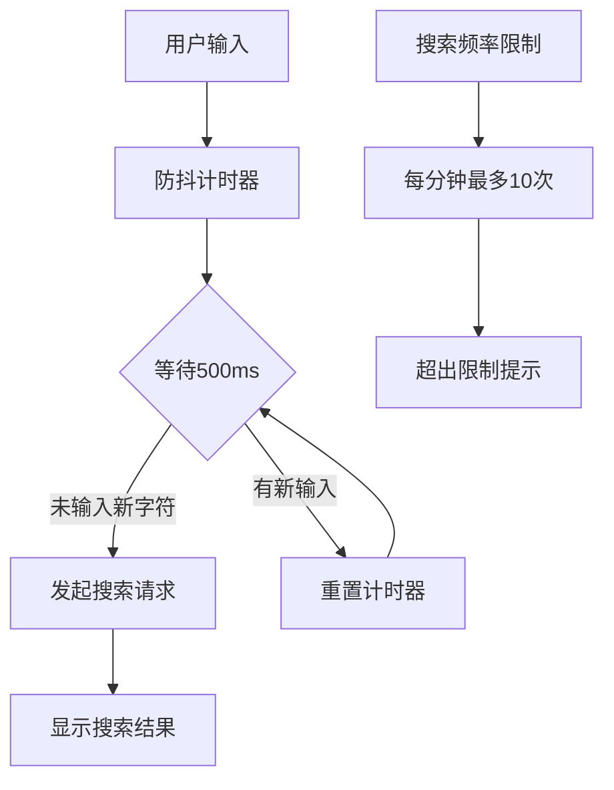

### 数据库优化

| 优化策略 | 实现方式 | 效果 |
|----------|----------|------|
| 索引优化 | 多字段复合索引 | 查询速度提升90% |
| 分页查询 | LIMIT/OFFSET优化 | 大数据集分页性能提升 |
| 预加载 | select_related | 减少N+1查询问题 |
| 缓存策略 | Redis缓存热门数据 | 减少数据库访问 |

**章节来源**
- [backend/common/pagination.py](file://backend/common/pagination.py#L8-L42)
- [backend/catalog/search.py](file://backend/catalog/search.py#L223-L283)

## 操作指南

### 商品创建流程

1. **基本信息录入**
   - 输入商品名称（必填）
   - 选择所属分类和品牌
   - 设置价格和库存数量

2. **图片上传**
   - 上传主图（最多5张）
   - 上传详情图（最多10张）
   - 支持拖拽和批量上传

3. **高级设置**
   - 设置商品状态（上架/下架）
   - 配置商品描述
   - 选择商品来源（本地/海尔）

4. **保存发布**
   - 点击保存按钮
   - 系统自动验证表单
   - 成功后刷新商品列表

### 海尔商品同步

1. **认证配置**
   - 在系统设置中配置海尔API密钥
   - 验证连接可用性

2. **手动同步**
   - 进入商品详情页
   - 点击"同步价格"或"同步库存"
   - 查看同步结果和日志

3. **自动同步**
   - 配置定时任务
   - 设置同步频率和条件

### 批量操作

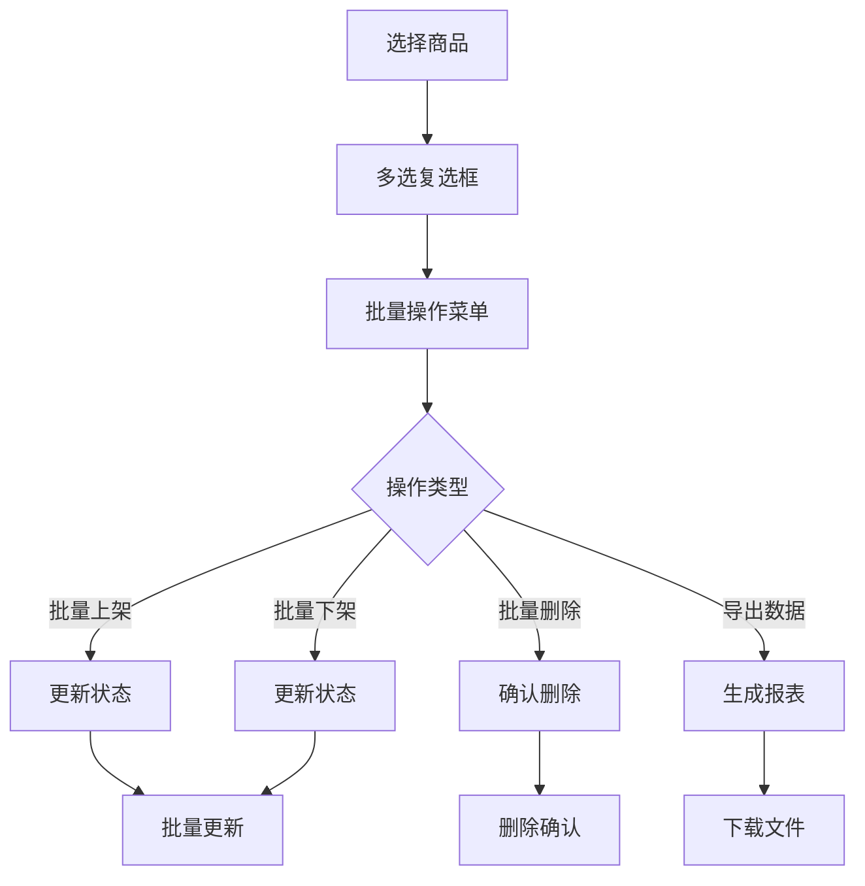

## 故障排除

### 常见问题及解决方案

| 问题类型 | 症状 | 可能原因 | 解决方案 |
|----------|------|----------|----------|
| 图片上传失败 | 上传进度条卡住 | 文件过大或网络问题 | 检查文件大小（≤20MB）和网络连接 |
| 商品搜索无结果 | 输入关键词无搜索结果 | 数据库索引问题 | 重建搜索索引或检查关键词拼写 |
| 海尔同步失败 | 同步按钮无响应 | API认证失败 | 检查海尔API配置和网络连接 |
| 性能缓慢 | 页面加载时间过长 | 数据量过大或缓存失效 | 清除缓存或优化查询条件 |

### 错误处理机制

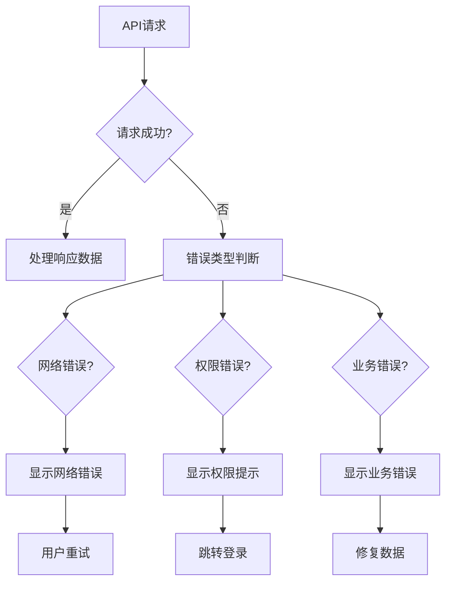

### 日志监控

系统提供完整的操作日志和错误追踪：

- **操作日志**：记录所有商品操作的详细信息
- **错误日志**：捕获和记录系统异常
- **性能日志**：监控API响应时间和数据库查询
- **搜索日志**：分析用户搜索行为和热门关键词

**章节来源**
- [backend/catalog/search.py](file://backend/catalog/search.py#L204-L221)

## 结论

商品管理系统通过前后端分离架构、双数据源支持和智能搜索功能，为商户提供了强大而灵活的商品管理解决方案。系统的模块化设计确保了良好的可扩展性和维护性，而完善的性能优化策略则保证了优秀的用户体验。

通过本文档的指导，商户可以高效地管理商品信息，利用海尔API的丰富资源，并享受系统提供的各种便捷功能。随着业务的发展，系统还可以进一步扩展更多高级功能，如智能推荐、数据分析和自动化运营等。