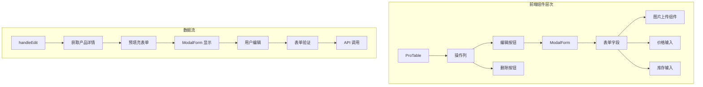
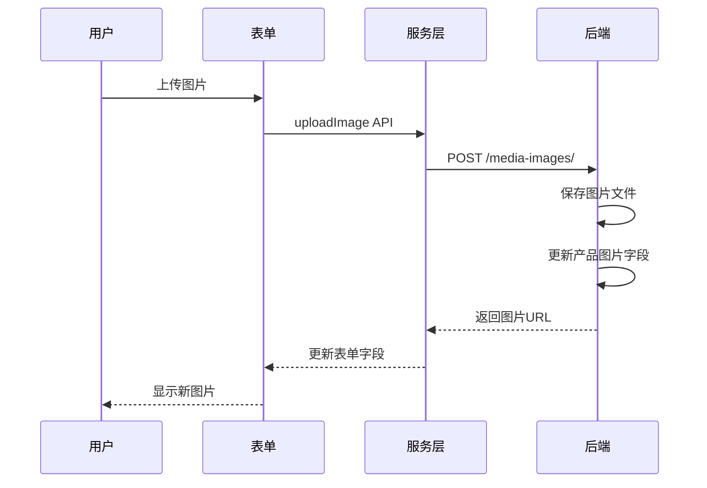
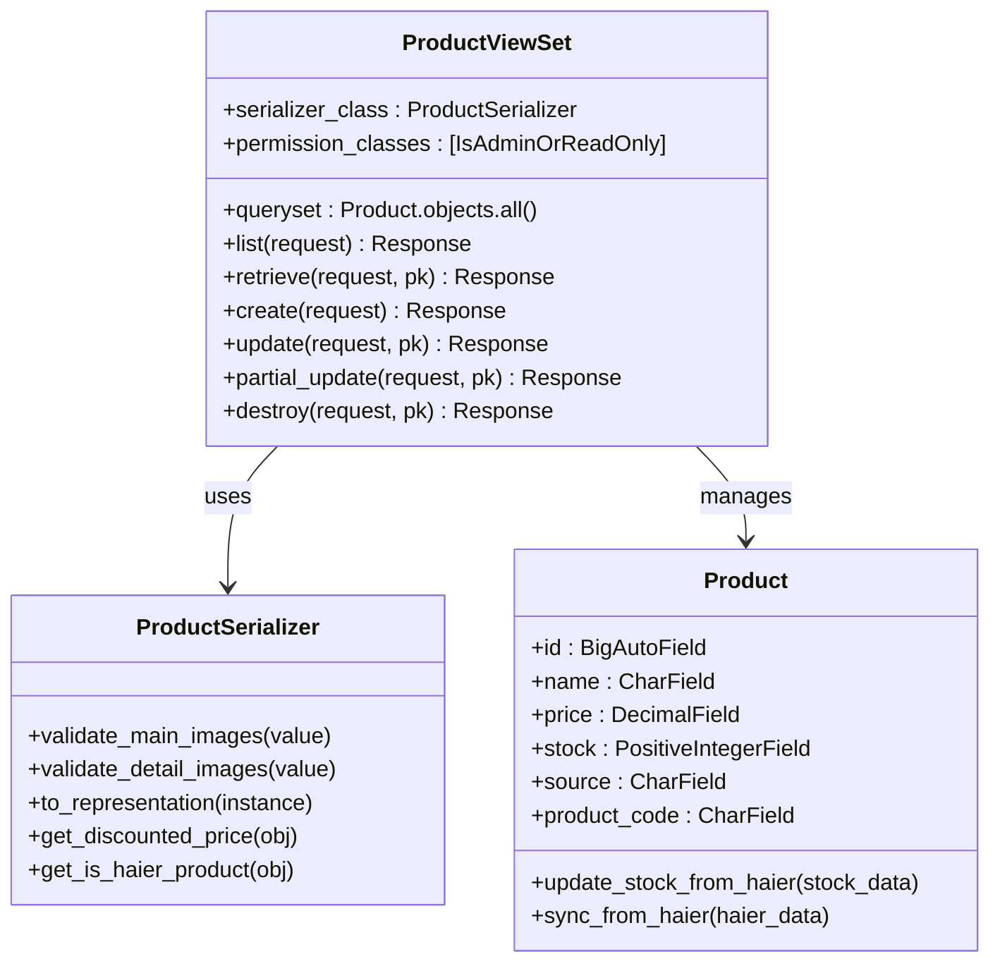
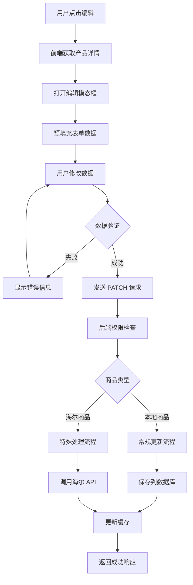
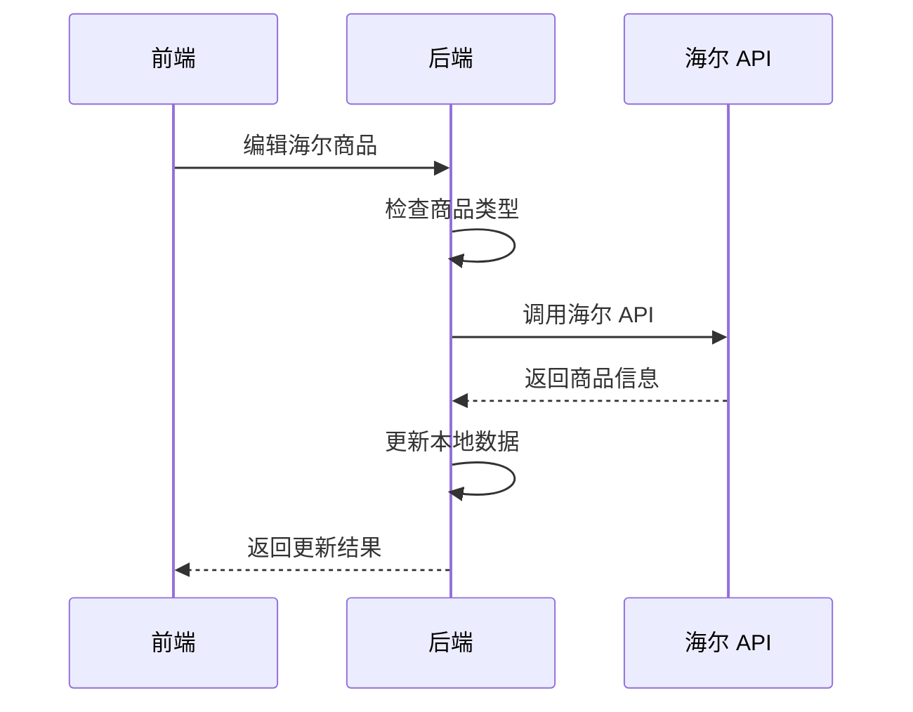
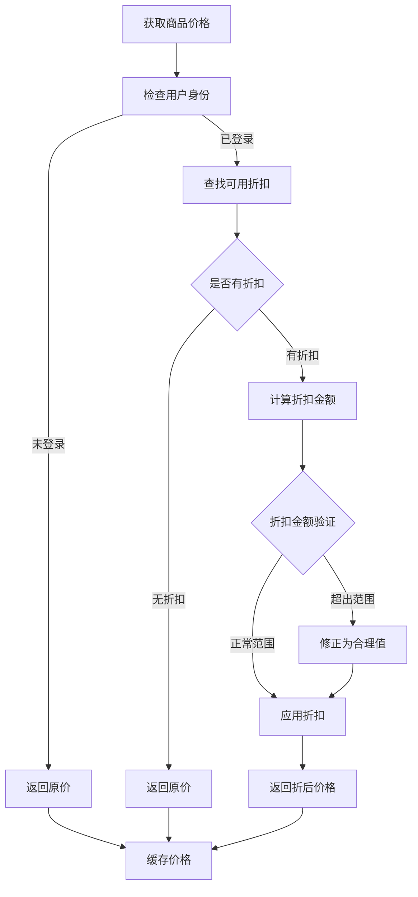
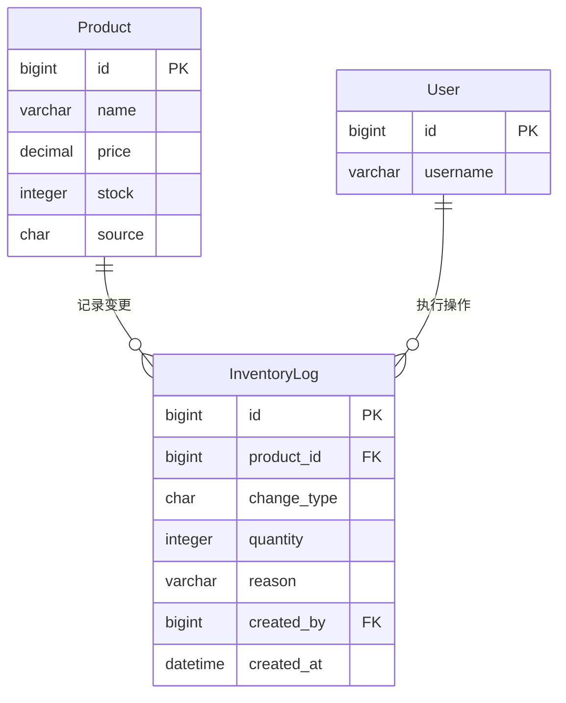
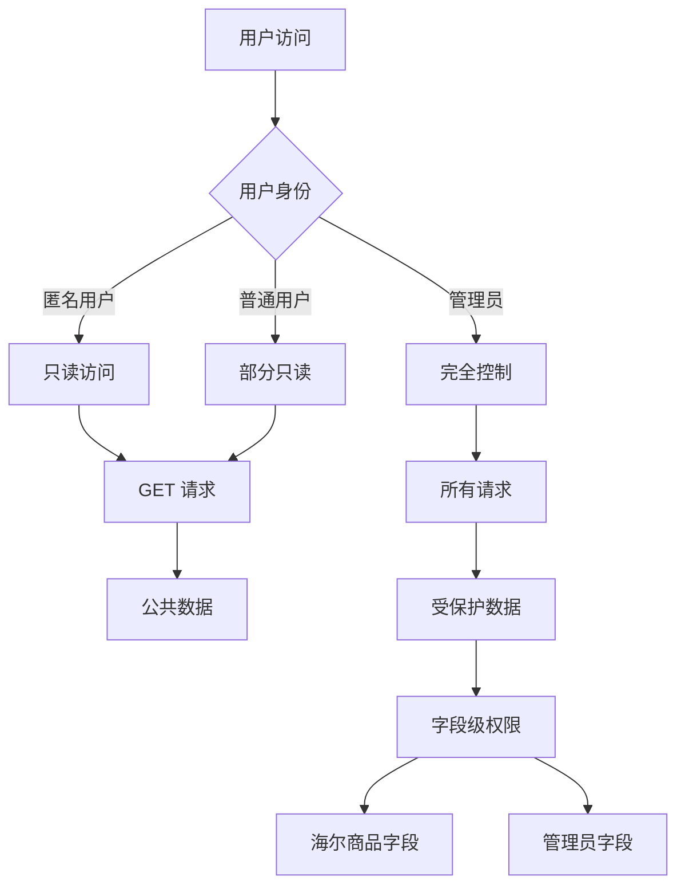
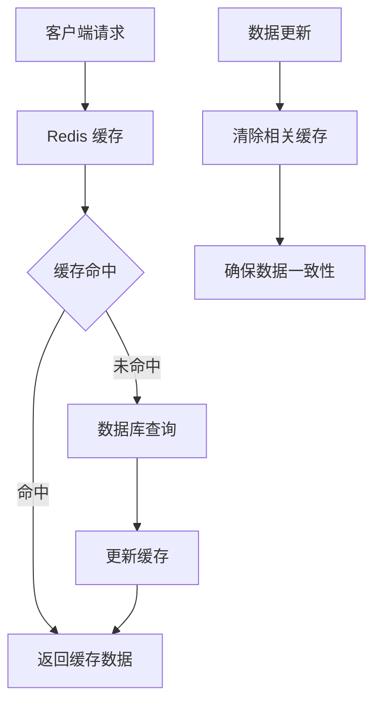

# 商品编辑功能技术文档

<cite>
**本文档引用的文件**
- [merchant/src/pages/Products/index.tsx](file://merchant/src/pages/Products/index.tsx)
- [backend/catalog/views.py](file://backend/catalog/views.py)
- [backend/catalog/models.py](file://backend/catalog/models.py)
- [backend/catalog/serializers.py](file://backend/catalog/serializers.py)
- [backend/integrations/haierapi.py](file://backend/integrations/haierapi.py)
- [backend/common/utils.py](file://backend/common/utils.py)
- [backend/orders/models.py](file://backend/orders/models.py)
- [backend/orders/services.py](file://backend/orders/services.py)
- [backend/common/permissions.py](file://backend/common/permissions.py)
- [merchant/src/services/api.ts](file://merchant/src/services/api.ts)
</cite>

## 目录
1. [概述](#概述)
2. [前端架构](#前端架构)
3. [后端架构](#后端架构)
4. [商品编辑流程](#商品编辑流程)
5. [海尔商品特殊处理](#海尔商品特殊处理)
6. [价格计算机制](#价格计算机制)
7. [库存变更与日志记录](#库存变更与日志记录)
8. [权限控制与数据验证](#权限控制与数据验证)
9. [并发控制与缓存策略](#并发控制与缓存策略)
10. [常见问题与解决方案](#常见问题与解决方案)

## 概述

商品编辑功能是一个复杂的业务流程，涉及前端表单操作、后端数据验证、权限控制、价格计算、库存管理和数据一致性保障等多个方面。该功能支持本地商品和海尔商品两种类型的编辑，具有不同的处理逻辑和权限要求。

### 核心特性

- **双模式编辑**：支持本地商品和海尔商品的不同编辑策略
- **实时图片处理**：上传图片时即时更新产品信息
- **智能价格计算**：基于折扣系统的动态价格计算
- **库存审计**：完整的库存变更日志记录
- **权限隔离**：不同商品类型的字段级权限控制
- **并发安全保障**：通过乐观锁机制防止并发编辑冲突

## 前端架构

### ProTable 组件结构

前端采用 Ant Design Pro 的 ProTable 组件构建商品管理界面，提供完整的 CRUD 操作能力。

**图表来源**
- [merchant/src/pages/Products/index.tsx](file://merchant/src/pages/Products/index.tsx#L175-L204)

### 编辑表单初始化

编辑功能通过 `handleEdit` 方法实现，该方法负责：

1. **数据获取**：调用 `getProduct` API 获取完整的产品信息
2. **表单预填充**：将产品数据映射到表单字段
3. **模态框控制**：设置编辑记录和表单状态

**章节来源**
- [merchant/src/pages/Products/index.tsx](file://merchant/src/pages/Products/index.tsx#L207-L246)

### 图片处理机制

前端实现了智能的图片处理机制，支持实时上传和更新：

**图表来源**
- [merchant/src/services/api.ts](file://merchant/src/services/api.ts#L37-L50)
- [backend/catalog/views.py](file://backend/catalog/views.py#L840-L980)

## 后端架构

### ViewSet 设计模式

后端采用 Django REST Framework 的 ModelViewSet 提供标准的 CRUD 操作：

**图表来源**
- [backend/catalog/views.py](file://backend/catalog/views.py#L29-L50)
- [backend/catalog/serializers.py](file://backend/catalog/serializers.py#L50-L74)
- [backend/catalog/models.py](file://backend/catalog/models.py#L43-L117)

### 请求处理流程

后端接收前端的 PATCH/PUT 请求，通过以下步骤处理：

1. **权限验证**：检查用户是否具有管理员权限
2. **数据反序列化**：使用 ProductSerializer 验证和转换数据
3. **字段级验证**：执行特定的字段验证逻辑
4. **业务逻辑处理**：根据商品类型执行不同的处理策略
5. **数据持久化**：保存到数据库并触发相关事件

**章节来源**
- [backend/catalog/views.py](file://backend/catalog/views.py#L29-L50)

## 商品编辑流程

### 完整编辑生命周期

**图表来源**
- [merchant/src/pages/Products/index.tsx](file://merchant/src/pages/Products/index.tsx#L425-L467)
- [backend/catalog/views.py](file://backend/catalog/views.py#L29-L50)

### 数据验证机制

后端实现了多层次的数据验证：

1. **序列器验证**：使用自定义字段验证器
2. **业务规则验证**：检查价格、库存等业务约束
3. **完整性验证**：确保必填字段不为空
4. **格式验证**：验证数值格式和范围

**章节来源**
- [backend/catalog/serializers.py](file://backend/catalog/serializers.py#L50-L74)

## 海尔商品特殊处理

### 海尔商品识别与限制

海尔商品具有特殊的编辑限制，主要体现在以下几个方面：

| 字段类型 | 本地商品 | 海尔商品 | 说明 |
|---------|---------|---------|------|
| 商品名称 | 可编辑 | 只读 | 海尔商品名称由系统维护 |
| 价格 | 可编辑 | 只读 | 价格通过海尔 API 同步 |
| 库存 | 可编辑 | 只读 | 库存通过海尔 API 同步 |
| 主图 | 可编辑 | 只读 | 海尔主图URL优先级更高 |
| 产品编码 | 可编辑 | 只读 | 海尔产品编码固定不变 |
| 供应商信息 | 可编辑 | 只读 | 海尔供应商信息自动填充 |

### 海尔 API 集成

**图表来源**
- [backend/integrations/haierapi.py](file://backend/integrations/haierapi.py#L10-L214)

### 海尔商品同步策略

海尔商品的同步遵循以下原则：

1. **只读优先**：海尔商品的大部分字段为只读
2. **主动同步**：通过专门的同步接口更新数据
3. **冲突解决**：本地修改会被海尔数据覆盖
4. **审计跟踪**：记录每次同步的时间和结果

**章节来源**
- [backend/catalog/views.py](file://backend/catalog/views.py#L435-L565)

## 价格计算机制

### 动态价格计算

系统实现了基于折扣系统的动态价格计算机制：

**图表来源**
- [backend/catalog/serializers.py](file://backend/catalog/serializers.py#L211-L251)
- [backend/orders/services.py](file://backend/orders/services.py#L11-L41)

### 折扣系统集成

价格计算深度集成了折扣系统，考虑以下因素：

1. **用户级别**：不同用户可能享受不同折扣
2. **商品级别**：特定商品可能有专属折扣
3. **时间窗口**：折扣的有效期限制
4. **优先级**：多个折扣时的优先级规则

**章节来源**
- [backend/orders/models.py](file://backend/orders/models.py#L237-L322)

## 库存变更与日志记录

### InventoryLog 模型设计

库存变更通过 InventoryLog 模型进行完整记录：

**图表来源**
- [backend/catalog/models.py](file://backend/catalog/models.py#L267-L312)

### 库存变更触发机制

库存变更通过以下机制触发：

1. **直接修改**：管理员直接修改库存数量
2. **订单创建**：创建订单时减少库存
3. **订单取消**：取消订单时释放库存
4. **退货处理**：退货时增加库存
5. **库存调整**：手动调整库存时记录日志

**章节来源**
- [backend/catalog/models.py](file://backend/catalog/models.py#L180-L195)

## 权限控制与数据验证

### 权限层次结构

系统实现了严格的权限控制：

**图表来源**
- [backend/common/permissions.py](file://backend/common/permissions.py#L70-L98)

### 字段级权限控制

不同字段具有不同的权限要求：

| 字段 | 权限要求 | 说明 |
|------|---------|------|
| name | 管理员 | 商品名称修改需要管理员权限 |
| price | 管理员 | 价格修改需要管理员权限 |
| stock | 管理员 | 库存修改需要管理员权限 |
| source | 禁止修改 | 商品来源字段不可修改 |
| product_code | 禁止修改 | 海尔产品编码固定不变 |

**章节来源**
- [backend/catalog/serializers.py](file://backend/catalog/serializers.py#L50-L74)

## 并发控制与缓存策略

### 缓存架构

系统采用多层缓存策略提升性能：

### 价格缓存策略

价格计算结果采用短期缓存：

- **缓存键**：`discount:{user_id}:{product_id}`
- **缓存时间**：60秒
- **更新时机**：管理员修改折扣时自动清除
- **失效策略**：主动失效，快速反映价格变化

**章节来源**
- [backend/catalog/serializers.py](file://backend/catalog/serializers.py#L222-L246)

### 并发冲突处理

虽然系统目前没有实现传统的乐观锁机制，但在以下场景中提供了一定的并发保护：

1. **图片上传**：通过文件名唯一性防止重复上传
2. **商品同步**：通过原子操作保证数据一致性
3. **库存操作**：通过数据库事务保证原子性

## 常见问题与解决方案

### 并发编辑冲突

**问题描述**：多个管理员同时编辑同一件商品导致数据丢失

**解决方案**：
1. **前端提示**：编辑前检查商品状态
2. **版本控制**：在表单中添加版本号字段
3. **冲突检测**：比较前后端数据差异
4. **合并策略**：提供选择性合并选项

### 海尔 API 调用失败

**问题描述**：海尔 API 不可用导致商品信息无法同步

**解决方案**：
1. **降级策略**：使用本地缓存数据
2. **重试机制**：实现指数退避重试
3. **错误监控**：记录 API 调用失败日志
4. **用户通知**：显示同步状态和错误信息

### 性能优化建议

1. **数据库索引**：为常用查询字段添加索引
2. **查询优化**：使用 select_related 预加载关联数据
3. **缓存策略**：合理设置缓存时间和失效策略
4. **异步处理**：将耗时操作放入后台任务

### 数据一致性保障

1. **事务管理**：关键操作使用数据库事务
2. **审计日志**：记录所有数据变更操作
3. **定期校验**：定期检查数据完整性
4. **备份恢复**：建立完善的备份和恢复机制

**章节来源**
- [backend/catalog/views.py](file://backend/catalog/views.py#L435-L565)
- [backend/catalog/models.py](file://backend/catalog/models.py#L267-L312)