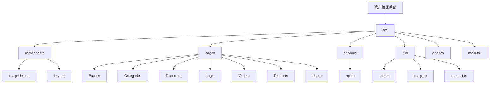
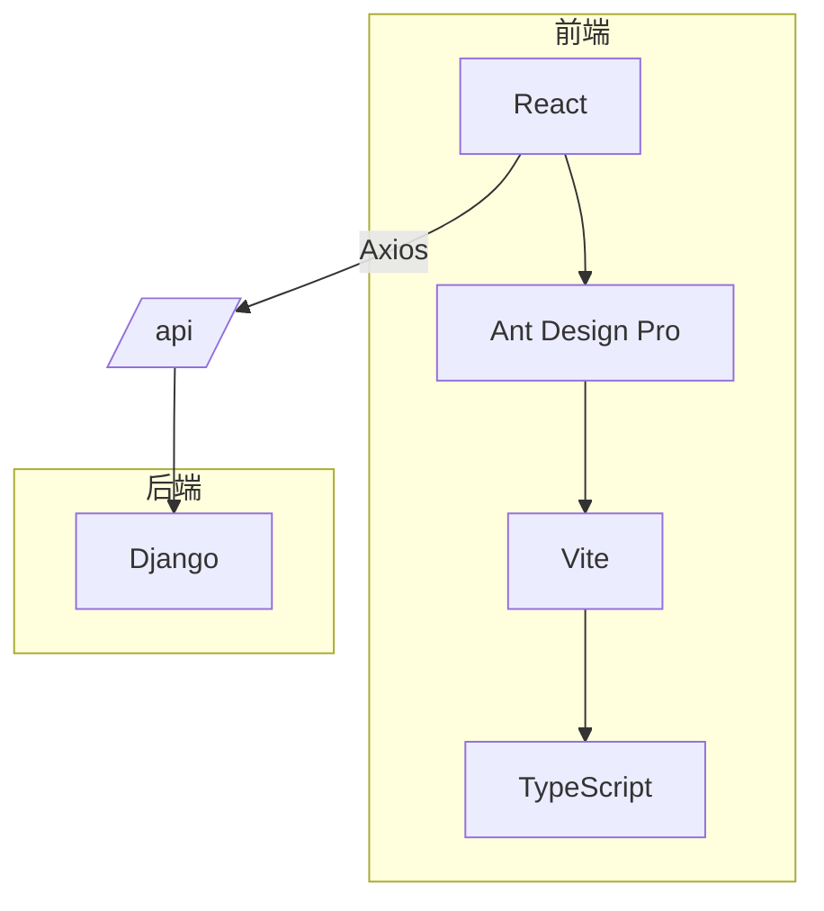
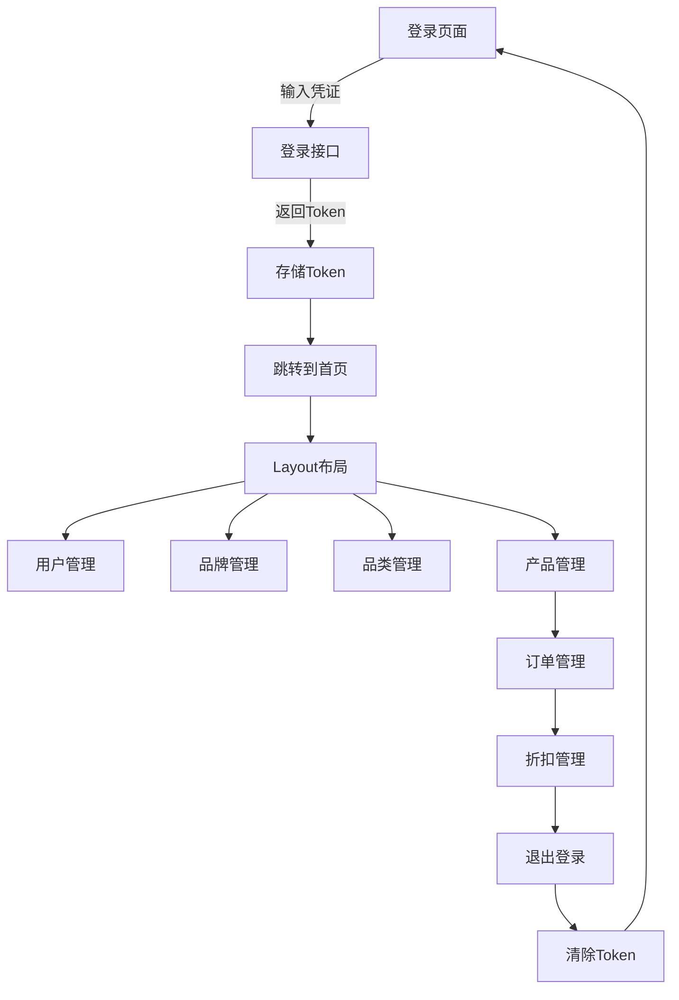
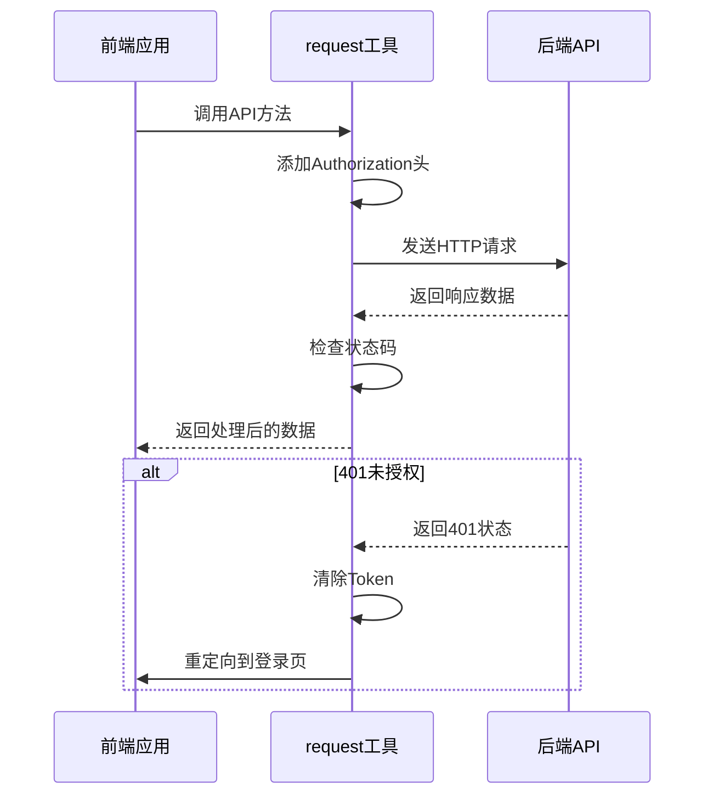

# 商户管理后台概述

<cite>
**本文档引用文件**  
- [package.json](file://merchant/package.json)
- [vite.config.ts](file://merchant/vite.config.ts)
- [tsconfig.json](file://merchant/tsconfig.json)
- [App.tsx](file://merchant/src/App.tsx)
- [main.tsx](file://merchant/src/main.tsx)
- [Layout/index.tsx](file://merchant/src/components/Layout/index.tsx)
- [Login/index.tsx](file://merchant/src/pages/Login/index.tsx)
- [api.ts](file://merchant/src/services/api.ts)
- [request.ts](file://merchant/src/utils/request.ts)
- [auth.ts](file://merchant/src/utils/auth.ts)
- [Users/index.tsx](file://merchant/src/pages/Users/index.tsx)
- [Products/index.tsx](file://merchant/src/pages/Products/index.tsx)
- [Orders/index.tsx](file://merchant/src/pages/Orders/index.tsx)
- [index.ts](file://frontend/src/types/index.ts)
- [index.ts](file://frontend/config/index.ts)
</cite>

## 目录
1. [项目结构](#项目结构)
2. [核心架构](#核心架构)
3. [路由与权限控制](#路由与权限控制)
4. [API调用与数据交互](#api调用与数据交互)
5. [功能模块分析](#功能模块分析)
6. [系统亮点](#系统亮点)
7. [配置与类型定义](#配置与类型定义)
8. [错误处理机制](#错误处理机制)

## 项目结构

商户管理后台位于 `merchant` 目录下，采用标准的React应用结构，基于Vite构建工具和TypeScript开发。项目包含核心的组件、页面、服务和工具模块。

**图示来源**  
- [merchant/src](file://merchant/src)

## 核心架构

商户管理后台基于React框架构建，使用Ant Design Pro组件库提供丰富的UI组件，通过Vite实现快速开发和构建。系统采用模块化设计，将功能划分为独立的页面和组件。

**图示来源**  
- [package.json](file://merchant/package.json#L1-L27)
- [vite.config.ts](file://merchant/vite.config.ts#L1-L27)
- [main.tsx](file://merchant/src/main.tsx#L1-L17)

**本节来源**  
- [package.json](file://merchant/package.json#L1-L27)
- [vite.config.ts](file://merchant/vite.config.ts#L1-L27)
- [main.tsx](file://merchant/src/main.tsx#L1-L17)

## 路由与权限控制

系统使用React Router进行路由管理，实现了基于Token的权限控制机制。通过`PrivateRoute`组件实现路由守卫，确保未登录用户无法访问受保护的页面。

**图示来源**  
- [App.tsx](file://merchant/src/App.tsx#L1-L45)
- [Layout/index.tsx](file://merchant/src/components/Layout/index.tsx#L1-L60)
- [Login/index.tsx](file://merchant/src/pages/Login/index.tsx#L1-L42)

**本节来源**  
- [App.tsx](file://merchant/src/App.tsx#L1-L45)
- [Layout/index.tsx](file://merchant/src/components/Layout/index.tsx#L1-L60)
- [Login/index.tsx](file://merchant/src/pages/Login/index.tsx#L1-L42)

## API调用与数据交互

系统通过Axios封装API调用，实现了统一的请求处理和响应拦截。所有API请求都通过`/api`前缀代理到后端服务器，自动添加认证头信息。

**图示来源**  
- [api.ts](file://merchant/src/services/api.ts#L1-L66)
- [request.ts](file://merchant/src/utils/request.ts#L1-L38)
- [auth.ts](file://merchant/src/utils/auth.ts#L1-L14)

**本节来源**  
- [api.ts](file://merchant/src/services/api.ts#L1-L66)
- [request.ts](file://merchant/src/utils/request.ts#L1-L38)
- [auth.ts](file://merchant/src/utils/auth.ts#L1-L14)

## 功能模块分析

### 用户管理模块

用户管理模块提供了完整的用户CRUD操作，包括用户列表展示、新增、编辑、删除和权限设置功能。使用ProTable组件实现数据表格，支持分页、搜索和筛选。

**本节来源**  
- [Users/index.tsx](file://merchant/src/pages/Users/index.tsx#L1-L292)

### 产品管理模块

产品管理模块支持产品的全生命周期管理，包括产品信息维护、图片上传、库存管理、价格设置等功能。特别针对海尔商品实现了字段只读和自动同步机制。

**本节来源**  
- [Products/index.tsx](file://merchant/src/pages/Products/index.tsx#L1-L720)

### 订单管理模块

订单管理模块实现了订单状态的完整流转，支持订单查看、发货、完成、取消等操作。对于海尔订单，提供了推送和物流查询功能。

**本节来源**  
- [Orders/index.tsx](file://merchant/src/pages/Orders/index.tsx#L1-L589)

## 系统亮点

### 响应式布局

系统采用Ant Design的Layout组件实现响应式布局，左侧为固定宽度的侧边栏菜单，右侧为主要内容区域，支持水平滚动以适应小屏幕设备。

### 表格数据渲染

使用ProTable组件实现高效的数据表格渲染，支持分页、排序、搜索、筛选等多种功能。通过valueType和render属性实现数据格式化和自定义渲染。

### 表单验证

采用ProForm组件实现强大的表单验证功能，内置多种验证规则，支持自定义验证逻辑。通过rules属性配置验证规则，确保数据的完整性和正确性。

## 配置与类型定义

### 项目配置

项目使用Vite作为构建工具，通过`vite.config.ts`文件进行配置。配置了React插件、路径别名和开发服务器代理，将`/api`请求代理到后端服务。

**本节来源**  
- [vite.config.ts](file://merchant/vite.config.ts#L1-L27)

### 类型定义

项目使用TypeScript进行类型定义，通过`tsconfig.json`文件配置编译选项。定义了路径映射`@/*`指向`src/*`，方便模块导入。

**本节来源**  
- [tsconfig.json](file://merchant/tsconfig.json#L1-L26)

## 错误处理机制

系统实现了完善的错误处理机制，通过Axios拦截器统一处理API请求错误。对于401未授权错误，自动清除Token并重定向到登录页面；对于其他错误，显示错误消息提示。

**本节来源**  
- [request.ts](file://merchant/src/utils/request.ts#L23-L35)