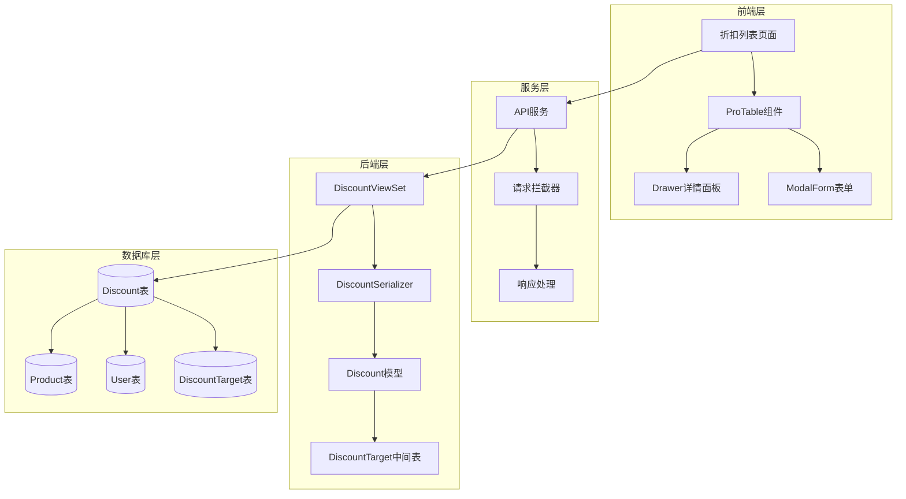
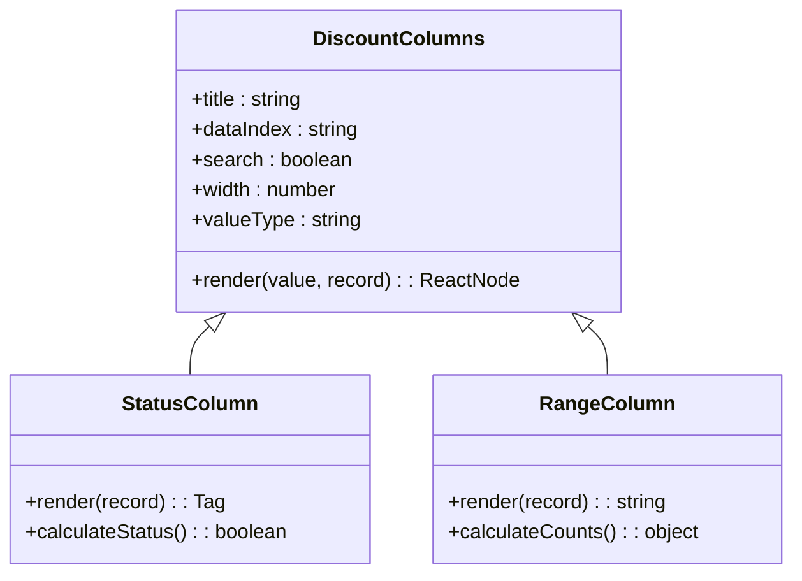
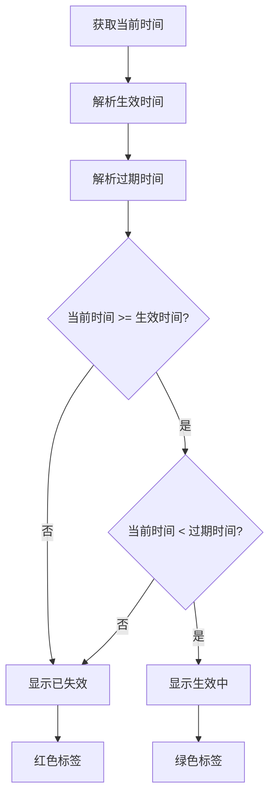
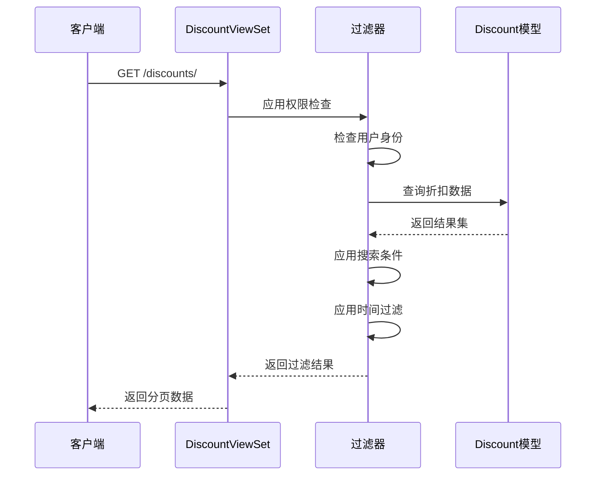
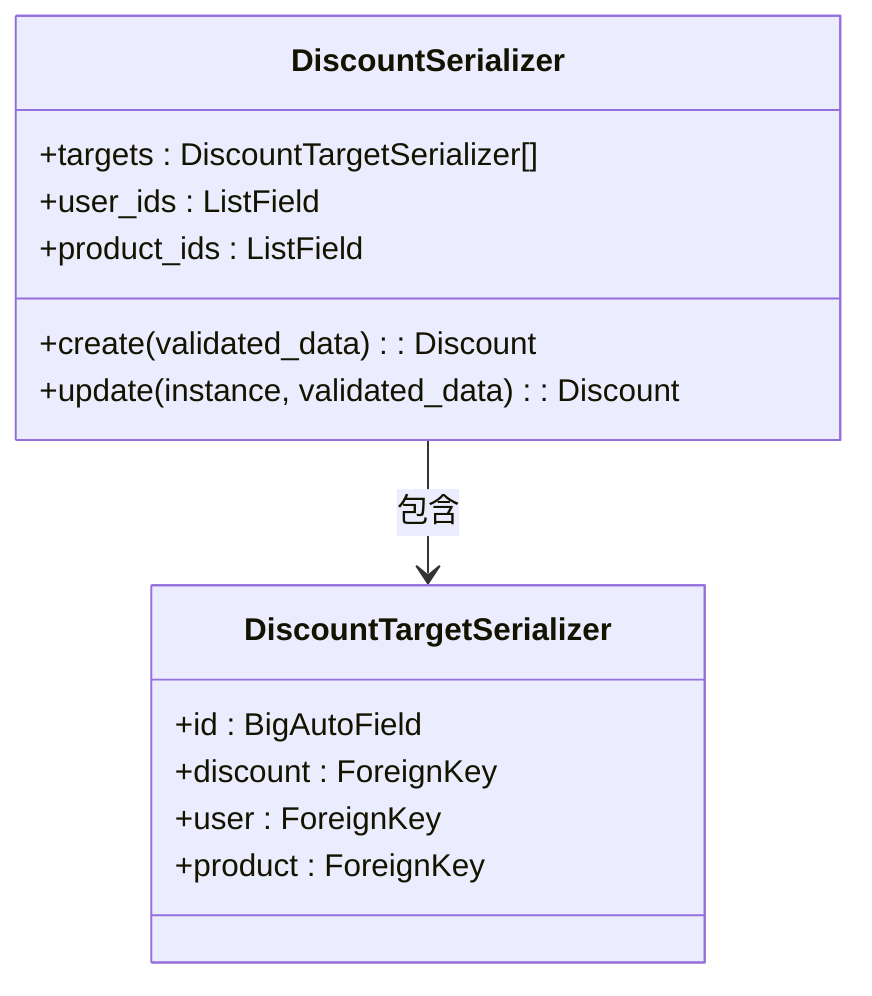
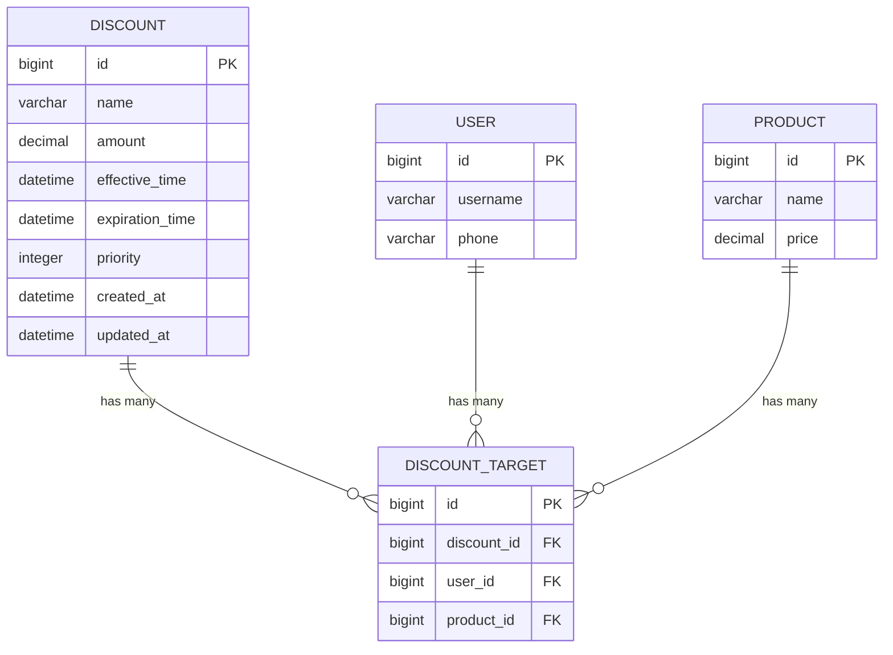
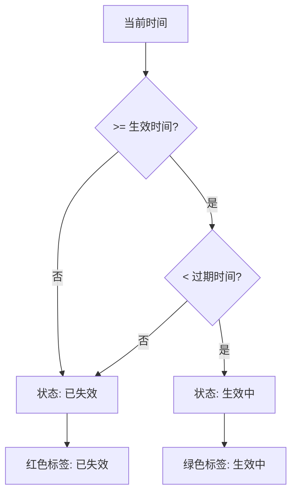
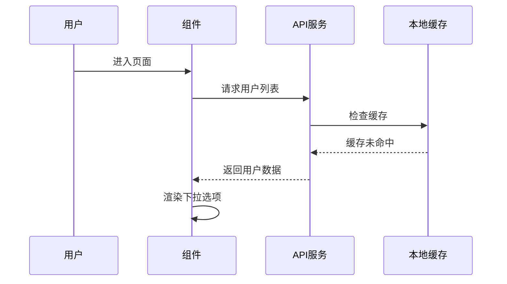

# 折扣列表功能详细文档

<cite>
**本文档引用的文件**
- [merchant/src/pages/Discounts/index.tsx](file://merchant/src/pages/Discounts/index.tsx)
- [merchant/src/services/api.ts](file://merchant/src/services/api.ts)
- [backend/orders/views.py](file://backend/orders/views.py)
- [backend/orders/models.py](file://backend/orders/models.py)
- [backend/orders/serializers.py](file://backend/orders/serializers.py)
- [backend/orders/urls.py](file://backend/orders/urls.py)
- [backend/common/pagination.py](file://backend/common/pagination.py)
- [api.md](file://api.md)
</cite>

## 目录
1. [功能概述](#功能概述)
2. [系统架构](#系统架构)
3. [前端实现](#前端实现)
4. [后端实现](#后端实现)
5. [数据模型设计](#数据模型设计)
6. [API接口规范](#api接口规范)
7. [状态管理与渲染](#状态管理与渲染)
8. [性能优化策略](#性能优化策略)
9. [最佳实践指南](#最佳实践指南)
10. [故障排除](#故障排除)

## 功能概述

折扣列表功能是商户后台管理系统的核心模块之一，提供完整的折扣规则生命周期管理。该功能支持商户创建、编辑、删除和查看折扣规则，同时具备强大的搜索、筛选和分页功能。

### 核心特性

- **完整的CRUD操作**：支持折扣规则的创建、读取、更新和删除
- **智能状态管理**：基于时间维度的自动状态切换（生效中/已失效）
- **灵活的适用范围**：支持用户和商品的组合筛选
- **实时状态渲染**：动态显示折扣的当前状态
- **高效的数据加载**：采用分页机制和数据缓存优化
- **直观的操作界面**：基于ProTable的现代化表格组件

## 系统架构



**图表来源**
- [merchant/src/pages/Discounts/index.tsx](file://merchant/src/pages/Discounts/index.tsx#L1-L368)
- [backend/orders/views.py](file://backend/orders/views.py#L975-L1087)

## 前端实现

### ProTable核心配置

折扣列表页面基于Ant Design Pro的ProTable组件构建，提供了丰富的表格功能和交互体验。

#### 列定义与展示逻辑



**图表来源**
- [merchant/src/pages/Discounts/index.tsx](file://merchant/src/pages/Discounts/index.tsx#L66-L152)

#### 数据请求与分页处理

前端通过ProTable的`request`属性与后端API进行数据交互，实现了智能的分页加载机制：

- **分页参数传递**：自动处理`page`和`page_size`参数
- **响应数据适配**：兼容多种后端分页格式
- **错误处理机制**：优雅的异常捕获和用户提示

#### 状态标签动态渲染

状态列实现了基于时间计算的动态渲染逻辑：



**图表来源**
- [merchant/src/pages/Discounts/index.tsx](file://merchant/src/pages/Discounts/index.tsx#L110-L116)

### 操作列功能实现

操作列提供了完整的CRUD操作入口：

- **查看功能**：通过Drawer组件展示折扣详情
- **编辑功能**：预填充表单数据，支持复杂对象结构
- **删除功能**：带确认机制的安全删除

**章节来源**
- [merchant/src/pages/Discounts/index.tsx](file://merchant/src/pages/Discounts/index.tsx#L119-L151)

## 后端实现

### DiscountViewSet核心逻辑

后端采用Django REST Framework的ViewSet模式，提供了完整的折扣管理API。

#### 查询集过滤与权限控制



**图表来源**
- [backend/orders/views.py](file://backend/orders/views.py#L986-L1030)

#### 批量操作支持

系统提供了专门的批量设置接口，支持为指定用户批量应用折扣：

- **批量创建**：一次性为多个用户和商品创建折扣关系
- **幂等性保证**：避免重复创建相同的折扣目标
- **事务处理**：确保数据一致性

**章节来源**
- [backend/orders/views.py](file://backend/orders/views.py#L1041-L1076)

### 序列化器设计

DiscountSerializer采用了创新的设计模式，支持复杂的批量操作：



**图表来源**
- [backend/orders/serializers.py](file://backend/orders/serializers.py#L175-L208)

## 数据模型设计

### 核心数据结构



**图表来源**
- [backend/orders/models.py](file://backend/orders/models.py#L248-L277)

### 索引优化策略

为了提升查询性能，系统在关键字段上建立了复合索引：

- **时间范围索引**：`(effective_time, expiration_time)`用于快速筛选有效折扣
- **优先级索引**：`priority`字段支持高效的排序查询
- **关联索引**：`(user, product)`用于加速折扣目标查询

**章节来源**
- [backend/orders/models.py](file://backend/orders/models.py#L259-L262)

## API接口规范

### 接口概览

| 方法 | 端点 | 权限 | 描述 |
|------|------|------|------|
| GET | `/discounts/` | IsAdmin | 获取折扣规则列表 |
| POST | `/discounts/` | IsAdmin | 创建新的折扣规则 |
| GET | `/discounts/{id}/` | IsAuthenticated | 获取折扣详情 |
| PATCH | `/discounts/{id}/` | IsAdmin | 更新折扣规则 |
| DELETE | `/discounts/{id}/` | IsAdmin | 删除折扣规则 |
| POST | `/discounts/batch_set/` | IsAdmin | 批量设置折扣 |
| GET | `/discounts/query_user_products/` | IsAuthenticated | 查询用户商品折扣 |

### 请求响应格式

#### 分页响应结构

```typescript
interface PaginationResponse<T> {
  results: T[];
  total: number;
  page: number;
  total_pages: number;
  has_next: boolean;
  has_previous: boolean;
}
```

#### 折扣对象结构

```typescript
interface Discount {
  id: number;
  name: string;
  amount: number;
  effective_time: string;
  expiration_time: string;
  priority: number;
  created_at: string;
  updated_at: string;
  targets: DiscountTarget[];
}

interface DiscountTarget {
  id: number;
  discount: number;
  user: number;
  product: number;
}
```

**章节来源**
- [api.md](file://api.md#L382-L421)
- [backend/common/pagination.py](file://backend/common/pagination.py#L27-L42)

## 状态管理与渲染

### 状态计算逻辑

系统实现了智能的状态判断机制，基于当前时间与折扣的时间范围进行对比：



**图表来源**
- [merchant/src/pages/Discounts/index.tsx](file://merchant/src/pages/Discounts/index.tsx#L110-L116)

### 适用范围统计

适用范围列通过智能统计算法计算用户和商品的数量：

- **去重处理**：使用Set数据结构去除重复的用户ID和商品ID
- **实时计算**：基于targets关联数据进行动态统计
- **友好展示**：以"X个用户 × Y个商品"的格式呈现

**章节来源**
- [merchant/src/pages/Discounts/index.tsx](file://merchant/src/pages/Discounts/index.tsx#L79-L84)

## 性能优化策略

### 前端优化

#### 数据懒加载



**图表来源**
- [merchant/src/pages/Discounts/index.tsx](file://merchant/src/pages/Discounts/index.tsx#L18-L36)

#### 接口响应缓存

- **批量数据预加载**：在页面初始化时预加载用户和商品列表
- **缓存策略**：合理设置缓存过期时间，平衡数据新鲜度
- **错误静默处理**：网络异常时不中断主流程

### 后端优化

#### 查询优化

- **选择性字段**：使用`select_related`和`prefetch_related`减少数据库查询次数
- **索引利用**：充分利用复合索引提升查询性能
- **分页限制**：设置合理的最大分页大小防止资源耗尽

#### 批量操作优化

- **批量创建**：使用`bulk_create`减少数据库交互次数
- **冲突忽略**：通过`ignore_conflicts=True`避免重复插入
- **事务管理**：确保批量操作的原子性

**章节来源**
- [backend/orders/views.py](file://backend/orders/views.py#L986-L1030)

## 最佳实践指南

### 开发最佳实践

#### 前端开发

1. **状态管理**：合理使用React Hooks管理组件状态
2. **错误处理**：提供友好的错误提示和回退机制
3. **用户体验**：及时反馈操作状态，避免用户困惑
4. **代码组织**：保持组件职责单一，便于维护

#### 后端开发

1. **权限控制**：严格验证用户权限，防止越权访问
2. **数据验证**：在序列化器层面进行充分的数据验证
3. **异常处理**：提供详细的错误信息和适当的HTTP状态码
4. **日志记录**：记录关键操作以便问题追踪

### 性能优化建议

#### 数据加载优化

- **分页策略**：根据数据量选择合适的分页大小
- **缓存机制**：对静态数据实施适当的缓存策略
- **并发控制**：避免过多的并发请求导致服务器压力

#### 前端渲染优化

- **虚拟滚动**：对于大量数据采用虚拟滚动技术
- **防抖节流**：对频繁触发的操作实施防抖或节流
- **组件优化**：使用React.memo等工具避免不必要的重渲染

## 故障排除

### 常见问题及解决方案

#### 数据加载问题

**问题描述**：折扣列表无法正常加载
**可能原因**：
- API接口不可用
- 网络连接问题
- 权限认证失败

**解决方案**：
1. 检查网络连接状态
2. 验证用户登录状态
3. 查看浏览器开发者工具中的网络请求

#### 状态显示异常

**问题描述**：折扣状态显示不正确
**可能原因**：
- 时间格式不匹配
- 时区处理问题
- 数据同步延迟

**解决方案**：
1. 确认前后端时间格式一致性
2. 检查时区设置
3. 强制刷新页面重新计算状态

#### 性能问题

**问题描述**：页面加载缓慢
**可能原因**：
- 数据量过大
- 查询效率低下
- 前端渲染开销过高

**解决方案**：
1. 实施分页加载
2. 优化数据库查询
3. 减少不必要的DOM操作

### 调试技巧

#### 前端调试

- 使用React DevTools检查组件状态
- 利用浏览器开发者工具分析网络请求
- 通过console.log输出关键变量值

#### 后端调试

- 启用Django调试模式
- 使用数据库查询日志分析性能瓶颈
- 通过API测试工具验证接口行为

**章节来源**
- [merchant/src/pages/Discounts/index.tsx](file://merchant/src/pages/Discounts/index.tsx#L38-L46)
- [backend/orders/views.py](file://backend/orders/views.py#L986-L1030)