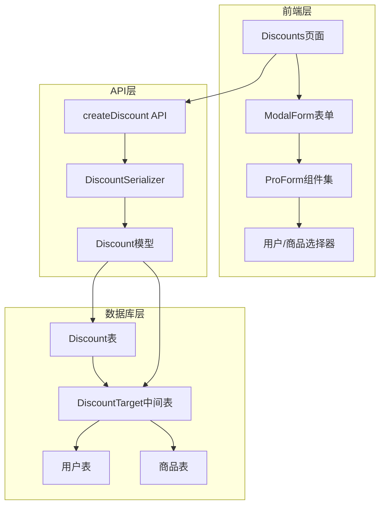
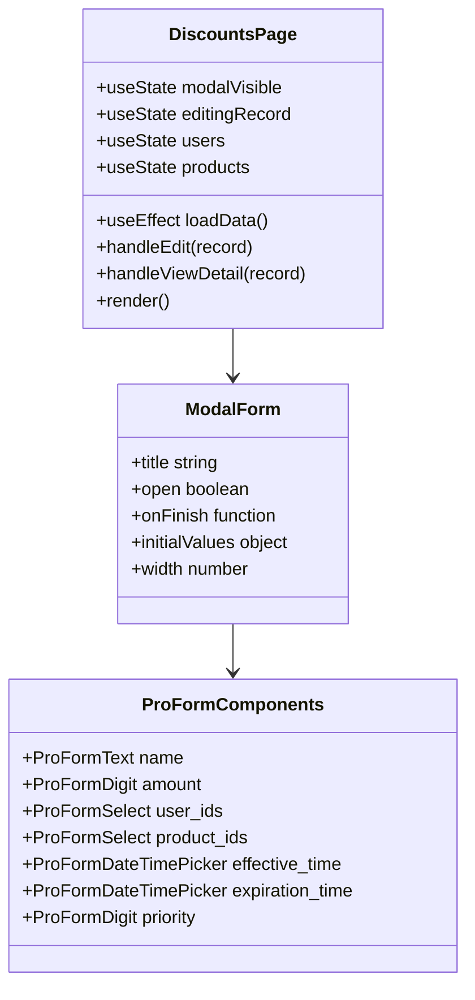
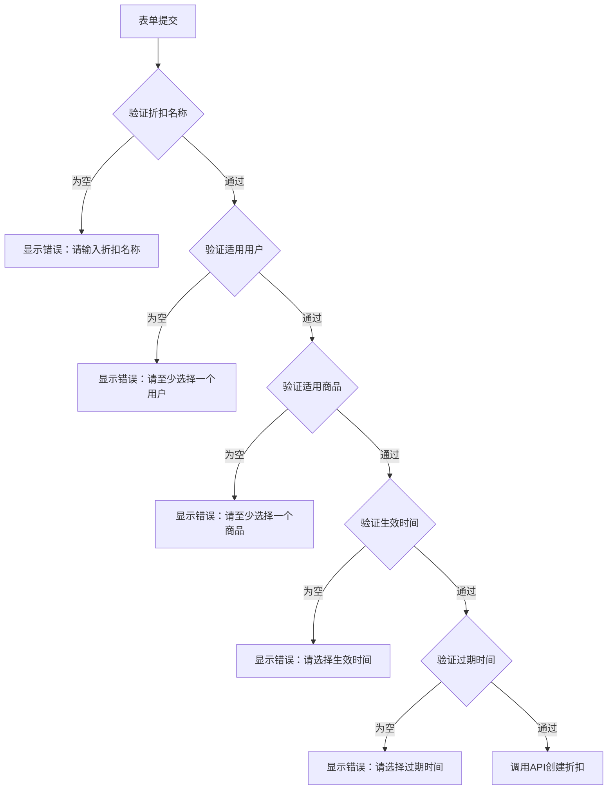
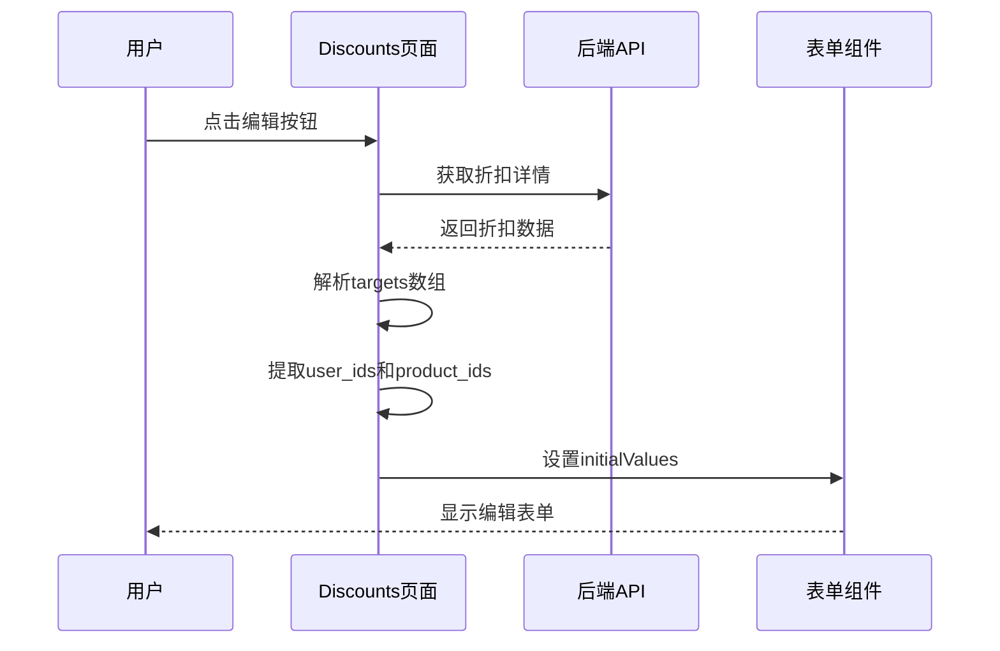
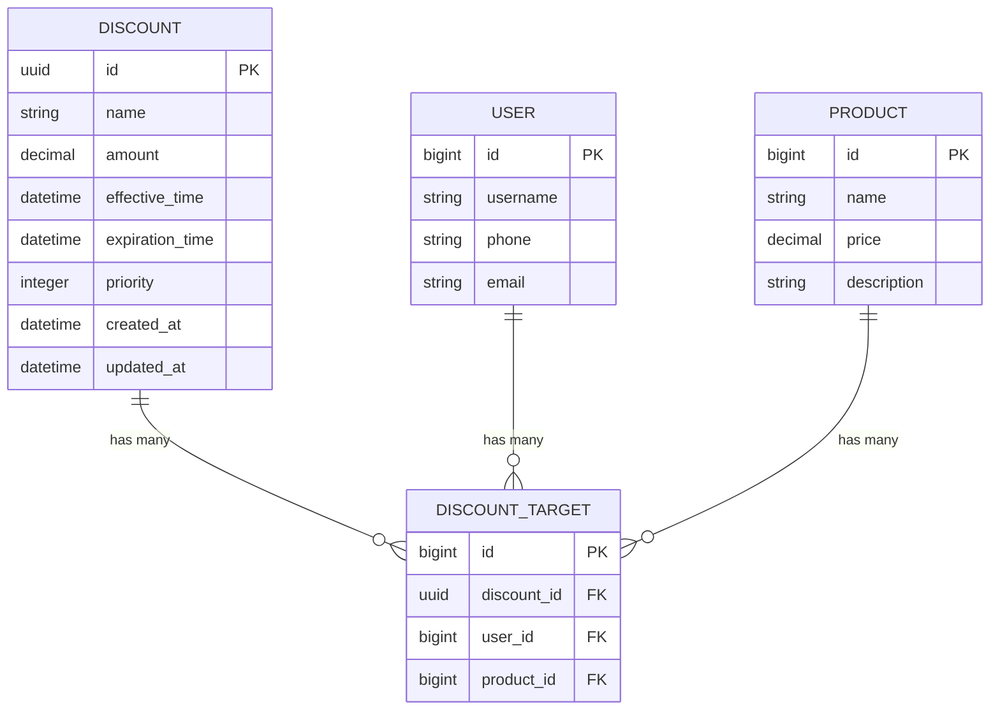
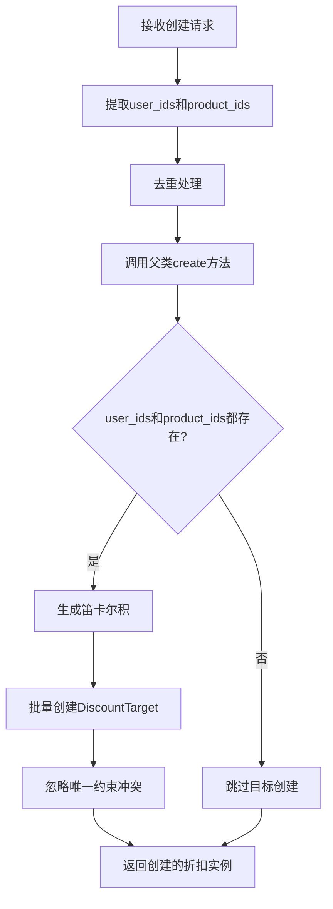
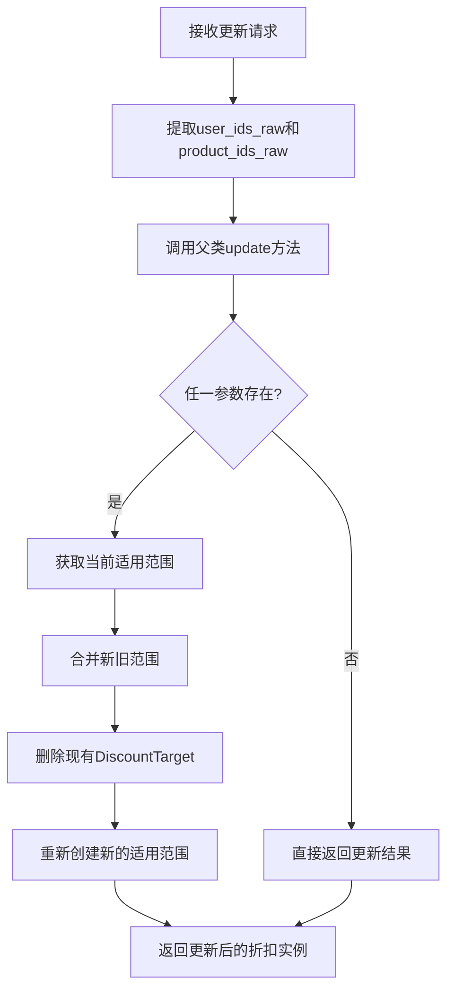
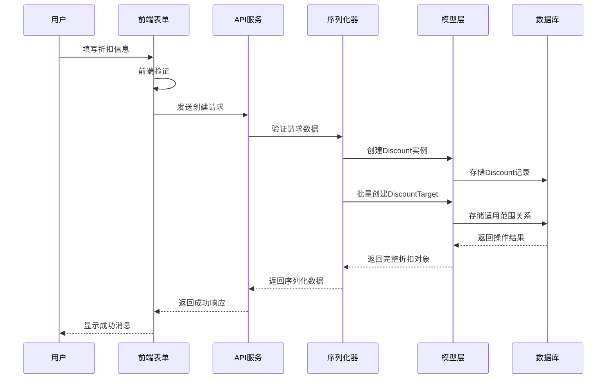

# 折扣创建功能详细文档

<cite>
**本文档引用的文件**
- [merchant/src/pages/Discounts/index.tsx](file://merchant/src/pages/Discounts/index.tsx)
- [merchant/src/services/api.ts](file://merchant/src/services/api.ts)
- [backend/orders/serializers.py](file://backend/orders/serializers.py)
- [backend/orders/models.py](file://backend/orders/models.py)
- [backend/orders/views.py](file://backend/orders/views.py)
- [merchant/src/app.tsx](file://merchant/src/app.tsx)
</cite>

## 目录
1. [功能概述](#功能概述)
2. [系统架构](#系统架构)
3. [前端实现详解](#前端实现详解)
4. [后端实现详解](#后端实现详解)
5. [数据流分析](#数据流分析)
6. [性能优化策略](#性能优化策略)
7. [用户体验设计](#用户体验设计)
8. [故障排除指南](#故障排除指南)
9. [最佳实践建议](#最佳实践建议)
10. [总结](#总结)

## 功能概述

折扣创建功能是商户后台管理系统的核心业务模块之一，允许管理员创建、编辑和管理各种类型的折扣规则。该功能支持复杂的多维度折扣策略，包括基于用户群体和商品种类的组合折扣，为商家提供了灵活的价格促销工具。

### 核心特性

- **多维度适用范围**：支持同时指定适用用户和适用商品，形成用户-商品的笛卡尔积
- **时间有效期控制**：精确控制折扣的生效时间和过期时间
- **优先级管理**：通过数字优先级确保多个折扣同时生效时的正确应用顺序
- **实时验证**：前端和后端双重验证机制，确保数据完整性
- **批量操作**：支持大规模用户和商品的选择与过滤

## 系统架构

折扣创建功能采用前后端分离架构，前端使用React + Ant Design Pro构建用户界面，后端基于Django REST Framework提供API服务。

**图表来源**
- [merchant/src/pages/Discounts/index.tsx](file://merchant/src/pages/Discounts/index.tsx#L1-L368)
- [backend/orders/serializers.py](file://backend/orders/serializers.py#L175-L230)

## 前端实现详解

### 表单组件架构

前端折扣创建表单基于Ant Design Pro的ModalForm组件构建，提供了完整的表单验证和用户交互体验。

**图表来源**
- [merchant/src/pages/Discounts/index.tsx](file://merchant/src/pages/Discounts/index.tsx#L8-L368)

### 多选组件实现

ProFormSelect组件是折扣创建表单的核心组件，负责加载和管理用户及商品列表。

#### 用户选择器配置

用户选择器实现了高效的搜索过滤功能：

- **数据源加载**：通过`getUsers({page_size: 1000})`一次性加载所有用户数据
- **显示格式**：用户名 + 手机号（可选）的组合显示
- **搜索功能**：支持模糊匹配用户名和手机号
- **多选模式**：允许选择多个用户

#### 商品选择器配置

商品选择器同样具备强大的搜索和过滤能力：

- **数据源加载**：通过`getProducts({page_size: 1000})`加载所有商品
- **显示格式**：商品名称 + 价格的组合显示
- **搜索功能**：支持按商品名称和价格搜索
- **多选模式**：支持批量选择商品

**章节来源**
- [merchant/src/pages/Discounts/index.tsx](file://merchant/src/pages/Discounts/index.tsx#L18-L36)

### 表单验证逻辑

前端表单包含多层次的验证机制：

#### 必填字段验证

**图表来源**
- [merchant/src/pages/Discounts/index.tsx](file://merchant/src/pages/Discounts/index.tsx#L195-L219)

#### 金额验证

折扣金额字段具有严格的验证规则：
- 最小值为0（支持免费促销）
- 精度控制到小数点后两位
- 添加货币符号标识

**章节来源**
- [merchant/src/pages/Discounts/index.tsx](file://merchant/src/pages/Discounts/index.tsx#L229-L239)

### 初始值处理

编辑模式下，系统需要正确处理现有的折扣数据：

**图表来源**
- [merchant/src/pages/Discounts/index.tsx](file://merchant/src/pages/Discounts/index.tsx#L53-L64)

**章节来源**
- [merchant/src/pages/Discounts/index.tsx](file://merchant/src/pages/Discounts/index.tsx#L53-L64)

## 后端实现详解

### 数据模型设计

后端采用三层结构设计：Discount主表、DiscountTarget中间表和关联的用户、商品模型。

**图表来源**
- [backend/orders/models.py](file://backend/orders/models.py#L240-L289)

### 序列化器实现

DiscountSerializer是折扣数据处理的核心组件，负责数据的验证、转换和持久化。

#### 关键特性

1. **批量适用范围设置**：通过`user_ids`和`product_ids`字段支持批量设置
2. **自动去重**：内部使用`set()`确保用户和商品ID的唯一性
3. **笛卡尔积计算**：自动生成用户-商品的组合关系
4. **忽略冲突**：使用`ignore_conflicts=True`处理重复创建

#### 创建流程

**图表来源**
- [backend/orders/serializers.py](file://backend/orders/serializers.py#L188-L200)

#### 更新流程

更新操作支持灵活的适用范围重置：

**图表来源**
- [backend/orders/serializers.py](file://backend/orders/serializers.py#L202-L230)

**章节来源**
- [backend/orders/serializers.py](file://backend/orders/serializers.py#L175-L230)

### API接口设计

后端提供了标准的RESTful API接口：

| 接口 | 方法 | 描述 | 参数 |
|------|------|------|------|
| `/discounts/` | GET | 获取折扣列表 | 分页参数 |
| `/discounts/` | POST | 创建新折扣 | DiscountSerializer数据 |
| `/discounts/{id}/` | GET | 获取单个折扣详情 | - |
| `/discounts/{id}/` | PATCH | 更新折扣 | DiscountSerializer数据 |
| `/discounts/{id}/` | DELETE | 删除折扣 | - |

**章节来源**
- [merchant/src/services/api.ts](file://merchant/src/services/api.ts#L61-L65)

## 数据流分析

### 完整的数据流转过程

**图表来源**
- [merchant/src/pages/Discounts/index.tsx](file://merchant/src/pages/Discounts/index.tsx#L195-L219)
- [backend/orders/serializers.py](file://backend/orders/serializers.py#L188-L200)

### 错误处理机制

系统实现了多层次的错误处理：

1. **前端验证错误**：立即反馈给用户
2. **API响应错误**：标准化错误信息
3. **数据库约束错误**：优雅降级处理
4. **网络异常处理**：提供重试机制

**章节来源**
- [merchant/src/pages/Discounts/index.tsx](file://merchant/src/pages/Discounts/index.tsx#L216-L219)

## 性能优化策略

### 前端性能优化

#### 数据预加载策略

系统采用预加载策略优化用户体验：

- **批量加载**：一次性加载最多1000条用户和商品数据
- **内存缓存**：将数据存储在组件状态中，避免重复请求
- **懒加载**：对于大量数据采用分页或虚拟滚动

#### 搜索性能优化

ProFormSelect组件实现了高效的搜索算法：

- **客户端过滤**：在浏览器中进行字符串匹配
- **防抖处理**：减少频繁的搜索请求
- **索引优化**：对常用字段建立索引

### 后端性能优化

#### 数据库优化

1. **复合索引**：在`(user, product)`字段上建立复合索引
2. **查询优化**：使用`select_related`减少数据库查询次数
3. **批量操作**：使用`bulk_create`提高插入性能

#### 缓存策略

虽然当前版本未实现缓存，但系统设计支持后续添加缓存层：

- **Redis缓存**：缓存热门折扣信息
- **数据库连接池**：优化数据库连接管理
- **异步处理**：对于耗时操作使用异步队列

**章节来源**
- [backend/orders/models.py](file://backend/orders/models.py#L259-L262)

## 用户体验设计

### 界面设计原则

#### 响应式布局

表单采用800px宽度设计，适应不同屏幕尺寸：

- **移动端适配**：在移动设备上自动调整布局
- **桌面端优化**：充分利用大屏幕空间
- **无障碍访问**：支持键盘导航和屏幕阅读器

#### 交互反馈

系统提供了丰富的用户反馈机制：

1. **实时验证**：输入时即时显示验证结果
2. **成功提示**：操作成功后显示确认消息
3. **错误引导**：清晰指出错误原因和解决方法
4. **加载状态**：长时间操作显示加载指示器

### 字段设计规范

#### 时间字段设计

生效时间和过期时间采用统一的时间选择器：

- **日期时间格式**：使用本地化的时间格式
- **时区处理**：确保时间的一致性
- **范围验证**：过期时间必须晚于生效时间

#### 数值字段设计

折扣金额和优先级字段的特殊处理：

- **精度控制**：金额精确到小数点后两位
- **范围限制**：优先级不能为负数
- **默认值**：优先级默认为0

**章节来源**
- [merchant/src/pages/Discounts/index.tsx](file://merchant/src/pages/Discounts/index.tsx#L277-L297)

## 故障排除指南

### 常见问题及解决方案

#### 前端问题

1. **用户/商品列表为空**
   - 检查API请求是否成功
   - 验证网络连接状态
   - 确认权限配置正确

2. **表单验证失败**
   - 检查必填字段是否填写
   - 验证金额格式是否正确
   - 确认时间范围合理性

3. **提交失败**
   - 查看浏览器控制台错误信息
   - 检查网络请求状态码
   - 验证服务器响应格式

#### 后端问题

1. **数据保存失败**
   - 检查数据库连接状态
   - 验证数据完整性约束
   - 查看数据库日志

2. **性能问题**
   - 分析慢查询日志
   - 检查数据库索引
   - 优化批量操作逻辑

### 调试技巧

#### 前端调试

- 使用浏览器开发者工具监控网络请求
- 在Redux DevTools中检查状态变化
- 使用React Developer Tools调试组件

#### 后端调试

- 启用Django调试模式
- 使用数据库查询日志
- 实现详细的API日志记录

**章节来源**
- [merchant/src/pages/Discounts/index.tsx](file://merchant/src/pages/Discounts/index.tsx#L216-L219)

## 最佳实践建议

### 开发最佳实践

#### 组件设计原则

1. **单一职责**：每个组件只负责一个特定功能
2. **可复用性**：设计通用的表单组件
3. **类型安全**：使用TypeScript确保类型安全
4. **错误边界**：实现适当的错误处理机制

#### 数据管理策略

1. **状态管理**：合理使用React状态和Context
2. **数据同步**：确保前后端数据一致性
3. **缓存策略**：实现智能的数据缓存机制
4. **版本控制**：支持数据的版本管理和回滚

### 运维最佳实践

#### 监控指标

1. **性能指标**：页面加载时间、API响应时间
2. **可用性指标**：系统可用率、错误率
3. **业务指标**：折扣创建成功率、用户满意度

#### 安全考虑

1. **输入验证**：双重验证确保数据安全
2. **权限控制**：严格的访问权限管理
3. **审计日志**：记录所有关键操作
4. **数据备份**：定期备份重要数据

### 扩展性设计

#### 模块化架构

系统采用模块化设计，便于功能扩展：

- **插件机制**：支持折扣类型的动态扩展
- **配置驱动**：通过配置文件控制功能开关
- **API版本**：支持向后兼容的API版本管理

#### 微服务架构

为未来扩展预留空间：

- **服务拆分**：将折扣功能独立为微服务
- **消息队列**：使用消息队列处理异步任务
- **分布式缓存**：支持跨服务的数据共享

## 总结

折扣创建功能是一个复杂而重要的业务模块，它不仅体现了系统的业务逻辑，也展示了现代Web应用的最佳实践。通过深入分析这个功能的实现，我们可以看到：

### 技术亮点

1. **前后端分离架构**：清晰的职责划分和良好的可维护性
2. **响应式设计**：优秀的用户体验和跨设备兼容性
3. **数据验证机制**：多层次的验证确保数据质量
4. **性能优化策略**：从多个维度提升系统性能

### 设计优势

1. **灵活性**：支持复杂的多维度折扣策略
2. **易用性**：直观的用户界面和流畅的操作体验
3. **可扩展性**：模块化设计便于功能扩展
4. **可靠性**：完善的错误处理和数据保护机制

### 改进方向

1. **性能优化**：进一步优化大数据量场景下的性能
2. **功能增强**：支持更多样化的折扣类型
3. **用户体验**：持续改进用户界面和交互设计
4. **技术升级**：跟进最新的前端和后端技术发展

这个折扣创建功能的成功实现，为整个商户后台系统奠定了坚实的基础，也为未来的功能扩展和技术演进提供了良好的起点。通过持续的优化和改进，这个功能将继续为商家提供高效、可靠的折扣管理服务。