# 折扣管理

<cite>
**本文档中引用的文件**
- [merchant/src/pages/Discounts/index.tsx](file://merchant/src/pages/Discounts/index.tsx)
- [merchant/src/services/api.ts](file://merchant/src/services/api.ts)
- [backend/orders/models.py](file://backend/orders/models.py)
- [backend/orders/views.py](file://backend/orders/views.py)
- [backend/orders/serializers.py](file://backend/orders/serializers.py)
- [backend/orders/urls.py](file://backend/orders/urls.py)
- [backend/catalog/serializers.py](file://backend/catalog/serializers.py)
</cite>

## 目录
1. [简介](#简介)
2. [系统架构概览](#系统架构概览)
3. [核心数据模型](#核心数据模型)
4. [前端折扣管理界面](#前端折扣管理界面)
5. [后端API接口](#后端api接口)
6. [折扣计算引擎](#折扣计算引擎)
7. [折扣规则配置](#折扣规则配置)
8. [性能优化策略](#性能优化策略)
9. [最佳实践指南](#最佳实践指南)
10. [故障排除](#故障排除)

## 简介

折扣管理系统是商户后台营销功能的核心组成部分，为商家提供灵活的折扣规则配置和管理能力。该系统采用前后端分离架构，前端基于React框架构建，后端使用Django REST framework实现，支持复杂的多维度折扣规则配置和高效的折扣计算引擎。

系统的主要功能包括：
- **折扣规则管理**：创建、编辑、删除和查看折扣规则
- **多维度适用范围**：支持用户群体和商品范围的灵活配置
- **时间有效期控制**：精确的时间窗口管理和状态控制
- **优先级机制**：支持多折扣叠加和优先级排序
- **实时预览功能**：配置过程中的实时效果预览
- **批量操作**：支持批量设置和管理折扣规则

## 系统架构概览

折扣管理系统采用现代化的微服务架构，主要由以下组件构成：

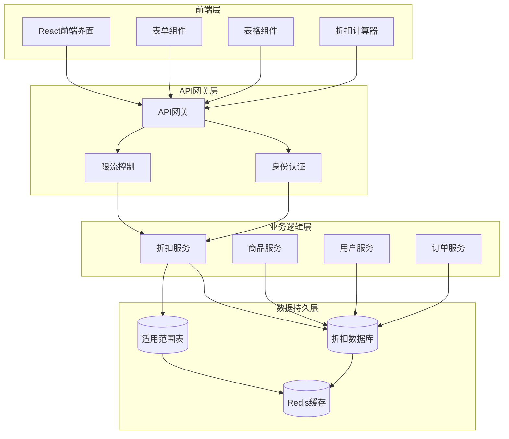

**图表来源**
- [merchant/src/pages/Discounts/index.tsx](file://merchant/src/pages/Discounts/index.tsx#L1-L50)
- [backend/orders/views.py](file://backend/orders/views.py#L975-L985)

## 核心数据模型

折扣管理系统的核心数据模型基于Django ORM设计，采用关系型数据库存储折扣规则和适用范围信息。

### Discount模型

Discount模型是折扣系统的核心实体，定义了折扣的基本属性和行为：

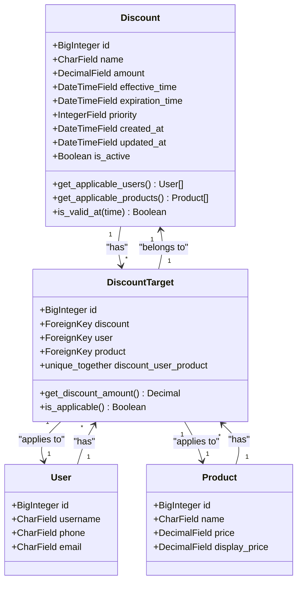

**图表来源**
- [backend/orders/models.py](file://backend/orders/models.py#L240-L290)

### 关键字段说明

| 字段名 | 类型 | 描述 | 约束条件 |
|--------|------|------|----------|
| `name` | CharField(100) | 折扣规则名称 | 可为空，用于标识和搜索 |
| `amount` | DecimalField(10,2) | 折扣金额 | 最小值为0，精度为2位小数 |
| `effective_time` | DateTimeField | 生效时间 | 折扣开始生效的时间点 |
| `expiration_time` | DateTimeField | 过期时间 | 折扣结束生效的时间点 |
| `priority` | IntegerField | 优先级 | 数字越大优先级越高，影响多折扣叠加顺序 |
| `created_at` | DateTimeField | 创建时间 | 自动设置为记录创建时间 |
| `updated_at` | DateTimeField | 更新时间 | 自动更新为记录修改时间 |

### DiscountTarget中间表

DiscountTarget模型作为Discount和User/Product之间的多对多关系中间表，实现了"针对某用户-某商品"的精确适用范围控制：

**节来源**
- [backend/orders/models.py](file://backend/orders/models.py#L273-L290)

## 前端折扣管理界面

前端折扣管理界面基于Ant Design Pro组件库构建，提供直观易用的折扣规则配置和管理功能。

### 主要组件架构

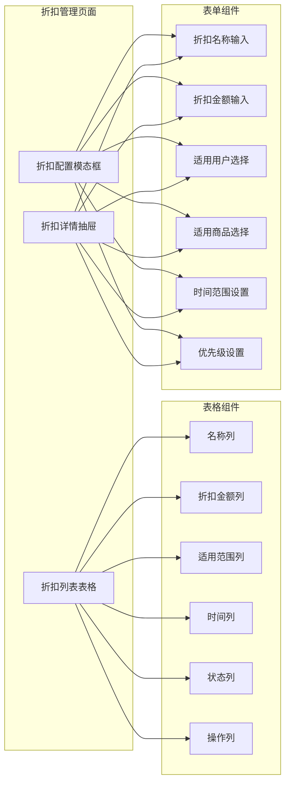

**图表来源**
- [merchant/src/pages/Discounts/index.tsx](file://merchant/src/pages/Discounts/index.tsx#L66-L150)

### 折扣列表展示

折扣列表采用ProTable组件实现，提供丰富的展示和交互功能：

#### 列配置详解

| 列名 | 数据字段 | 宽度 | 渲染方式 | 功能描述 |
|------|----------|------|----------|----------|
| 名称 | `name` | 自适应 | 直接显示 | 显示折扣规则的名称标识 |
| 折扣金额 | `amount` | 120px | 格式化显示 | 以¥符号显示折扣金额 |
| 适用范围 | `targets` | 150px | 计算显示 | 统计适用的用户数量和商品数量 |
| 生效时间 | `effective_time` | 180px | 日期时间格式 | 显示ISO格式的生效时间 |
| 过期时间 | `expiration_time` | 180px | 日期时间格式 | 显示ISO格式的过期时间 |
| 优先级 | `priority` | 100px | 直接显示 | 显示折扣的优先级数值 |
| 状态 | `status` | 100px | 标签渲染 | 基于当前时间显示生效状态 |
| 操作 | `actions` | 200px | 按钮组 | 包含查看、编辑、删除功能 |

#### 状态判断逻辑

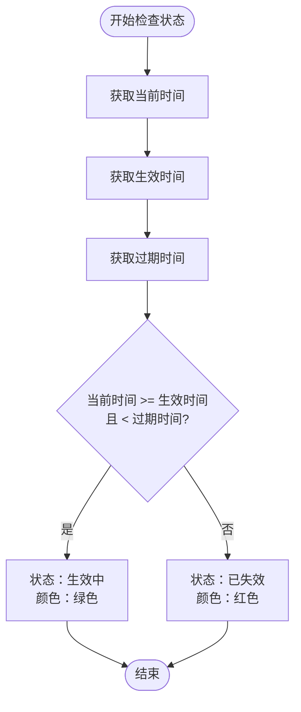

**图表来源**
- [merchant/src/pages/Discounts/index.tsx](file://merchant/src/pages/Discounts/index.tsx#L106-L116)

### 折扣配置表单

折扣配置表单采用ModalForm组件实现，支持复杂的多维度规则配置：

#### 表单字段设计

| 字段名 | 组件类型 | 验证规则 | 功能说明 |
|--------|----------|----------|----------|
| 折扣名称 | ProFormText | 必填，长度限制 | 用于标识和搜索折扣规则 |
| 折扣金额 | ProFormDigit | 必填，最小值0 | 支持最多2位小数的金额输入 |
| 适用用户 | ProFormSelect | 必填，多选 | 支持搜索和筛选适用用户 |
| 适用商品 | ProFormSelect | 必填，多选 | 支持搜索和筛选适用商品 |
| 生效时间 | ProFormDateTimePicker | 必填 | 日期时间选择器 |
| 过期时间 | ProFormDateTimePicker | 必填 | 日期时间选择器 |
| 优先级 | ProFormDigit | 可选，默认0 | 影响多折扣叠加顺序 |

#### 用户和商品选择器

用户和商品的选择器经过特殊优化，提供良好的用户体验：

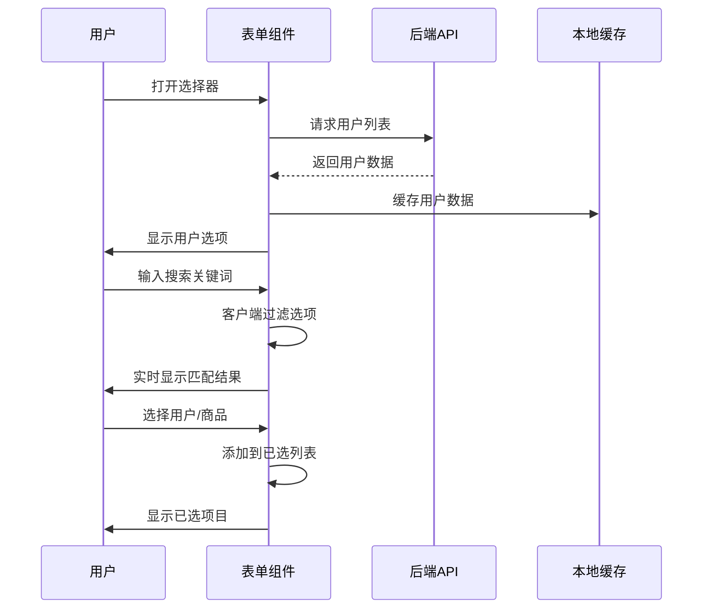

**图表来源**
- [merchant/src/pages/Discounts/index.tsx](file://merchant/src/pages/Discounts/index.tsx#L240-L275)

### 折扣详情查看

折扣详情采用Drawer组件实现，提供完整的折扣规则信息展示：

#### 详情信息布局

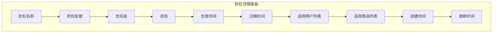

**图表来源**
- [merchant/src/pages/Discounts/index.tsx](file://merchant/src/pages/Discounts/index.tsx#L300-L365)

**节来源**
- [merchant/src/pages/Discounts/index.tsx](file://merchant/src/pages/Discounts/index.tsx#L1-L368)

## 后端API接口

后端API基于Django REST framework构建，提供完整的折扣管理RESTful接口。

### DiscountViewSet核心功能

DiscountViewSet继承自ModelViewSet，提供了标准的CRUD操作和扩展功能：

#### 核心API端点

| HTTP方法 | 端点路径 | 功能描述 | 权限要求 |
|----------|----------|----------|----------|
| GET | `/discounts/` | 获取折扣列表 | IsAuthenticated |
| POST | `/discounts/` | 创建新折扣 | IsAdmin |
| GET | `/discounts/{id}/` | 获取折扣详情 | IsAuthenticated |
| PATCH | `/discounts/{id}/` | 更新折扣 | IsAdmin |
| DELETE | `/discounts/{id}/` | 删除折扣 | IsAdmin |
| POST | `/discounts/batch_set/` | 批量设置折扣 | IsAdmin |
| GET | `/discounts/query_user_products/` | 查询用户商品折扣 | IsAuthenticated |

### 批量设置接口

批量设置接口支持为指定用户批量设置一组商品的统一折扣：

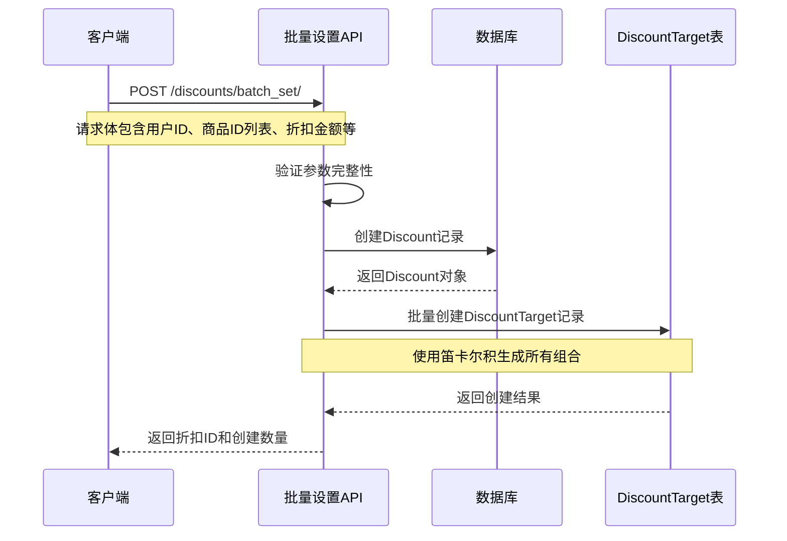

**图表来源**
- [backend/orders/views.py](file://backend/orders/views.py#L1041-L1076)

### 用户商品折扣查询

查询接口支持批量查询当前用户在一组商品上的有效折扣：

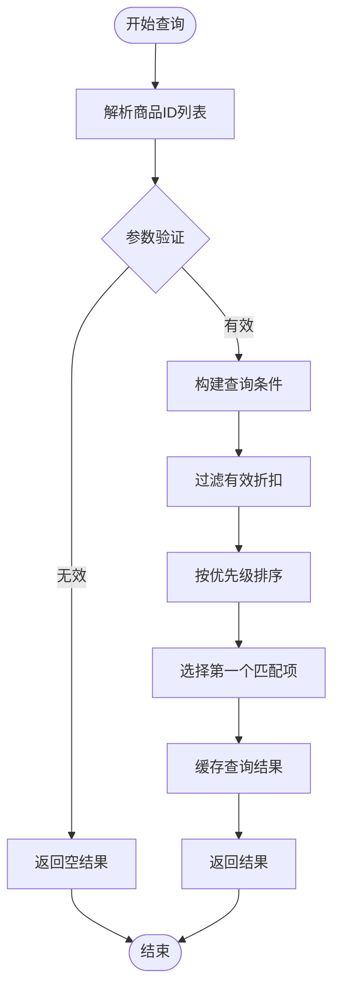

**图表来源**
- [backend/orders/views.py](file://backend/orders/views.py#L1078-L1104)

### 序列化器设计

DiscountSerializer负责Discount模型的序列化和反序列化：

#### 创建流程

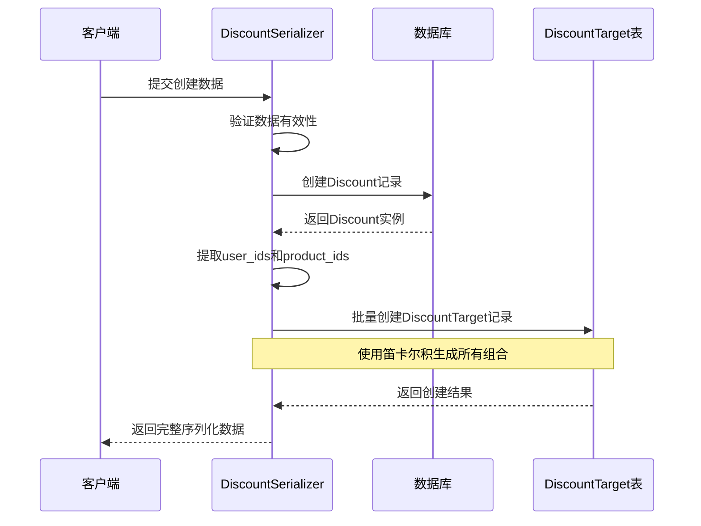

**图表来源**
- [backend/orders/serializers.py](file://backend/orders/serializers.py#L188-L200)

**节来源**
- [backend/orders/views.py](file://backend/orders/views.py#L975-L1037)
- [backend/orders/serializers.py](file://backend/orders/serializers.py#L175-L230)

## 折扣计算引擎

折扣计算引擎是系统的核心组件，负责在商品展示和订单结算过程中准确计算用户的实际应付金额。

### 折扣计算算法

折扣计算采用优先级排序和最优惠原则：

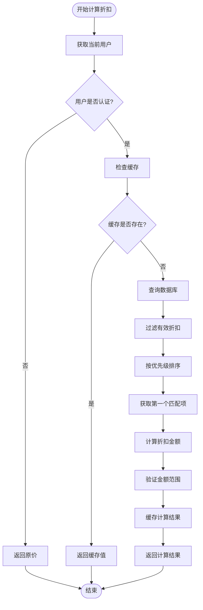

**图表来源**
- [backend/catalog/serializers.py](file://backend/catalog/serializers.py#L211-L251)

### 计算逻辑详解

#### 1. 基础价格获取

系统首先确定计算的基础价格：
- 优先使用`display_price`属性（如果有）
- 否则使用商品的`price`属性
- 支持动态价格计算场景

#### 2. 有效折扣筛选

系统根据以下条件筛选有效的折扣：

| 筛选条件 | SQL表达式 | 说明 |
|----------|-----------|------|
| 用户匹配 | `user=user` | 确保折扣适用于当前用户 |
| 商品匹配 | `product=obj` | 确保折扣适用于当前商品 |
| 时间有效 | `effective_time <= now AND expiration_time > now` | 确保折扣在有效期内 |
| 排序优先级 | `-discount__priority, '-discount__updated_at'` | 优先使用高优先级折扣 |

#### 3. 金额验证和边界处理

计算完成后，系统进行金额验证和边界处理：

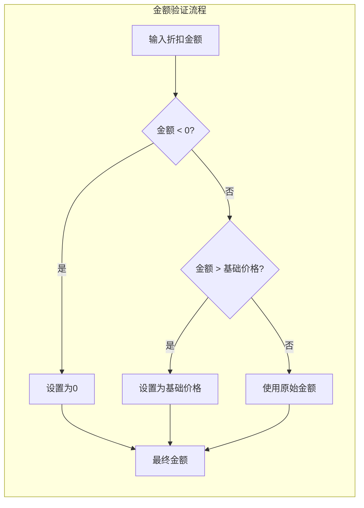

**图表来源**
- [backend/catalog/serializers.py](file://backend/catalog/serializers.py#L240-L249)

### 缓存策略

为了提高性能，系统实现了智能缓存机制：

#### 缓存键设计
```
cache_key = f"discount:{user.id}:{obj.id}"
```

#### 缓存策略
- **缓存时间**：60秒
- **缓存失效**：折扣规则更新时自动失效
- **缓存穿透**：未找到折扣时也缓存结果避免重复查询

**节来源**
- [backend/catalog/serializers.py](file://backend/catalog/serializers.py#L211-L251)

## 折扣规则配置

折扣规则配置是系统的核心功能，支持商家创建复杂多维度的营销策略。

### 配置维度

#### 1. 用户维度配置

用户维度支持多种用户群体的精确控制：

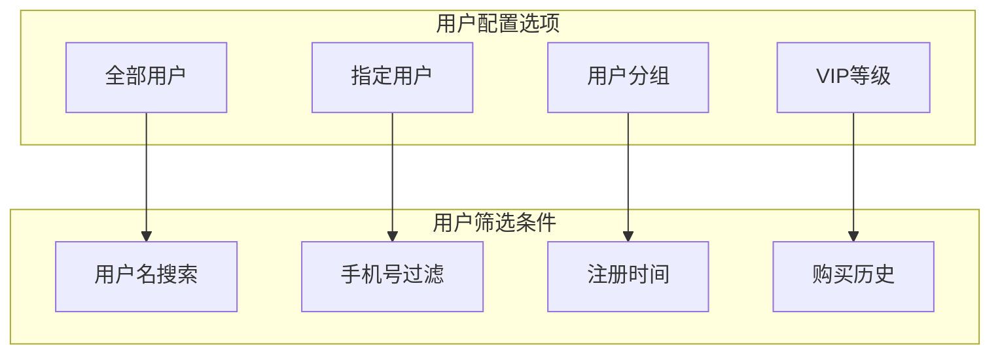

#### 2. 商品维度配置

商品维度支持精细化的商品范围控制：

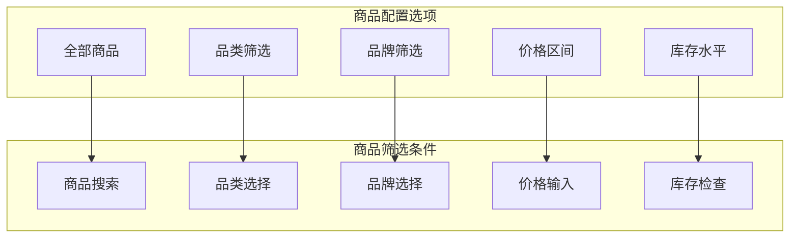

### 时间窗口配置

时间窗口配置支持灵活的时间范围控制：

#### 生效时间规则
- **最早生效时间**：当前时间之后
- **最晚生效时间**：不过去的时间点
- **时间精度**：支持到分钟级别

#### 过期时间规则
- **最短有效期**：立即生效，最长可设置为无限期
- **最长有效期**：建议设置合理的过期时间避免长期占用资源
- **时间格式**：ISO 8601标准格式

### 优先级机制

优先级机制确保多折扣情况下的正确计算：

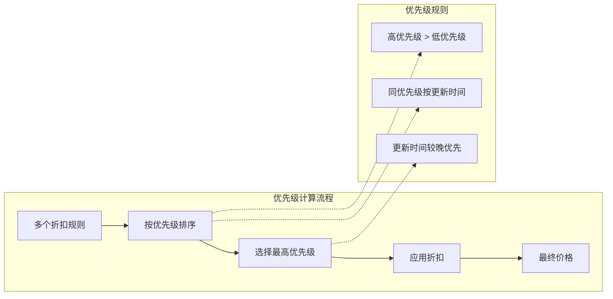

### 冲突检测和解决

系统内置冲突检测机制，防止不合理的配置：

#### 冲突类型检测

| 冲突类型 | 检测条件 | 解决方案 |
|----------|----------|----------|
| 时间重叠 | 生效时间交叉 | 提示用户调整时间范围 |
| 用户重叠 | 相同用户多折扣 | 按优先级自动选择 |
| 商品重叠 | 相同商品多折扣 | 按优先级自动选择 |
| 金额冲突 | 超出商品价格 | 自动调整为合理范围 |

**节来源**
- [merchant/src/pages/Discounts/index.tsx](file://merchant/src/pages/Discounts/index.tsx#L195-L220)
- [backend/orders/serializers.py](file://backend/orders/serializers.py#L188-L230)

## 性能优化策略

折扣管理系统在设计时充分考虑了性能优化，采用多种技术手段确保系统的高效运行。

### 数据库优化

#### 索引策略

系统在关键字段上建立了复合索引：

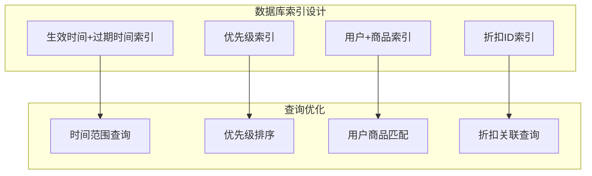

**图表来源**
- [backend/orders/models.py](file://backend/orders/models.py#L259-L262)

#### 查询优化技巧

1. **选择性查询**：使用select_related减少数据库查询次数
2. **批量操作**：使用bulk_create进行批量插入
3. **缓存利用**：合理使用Redis缓存热门数据
4. **分页处理**：大数据量列表采用分页加载

### 缓存策略

#### 多层缓存架构

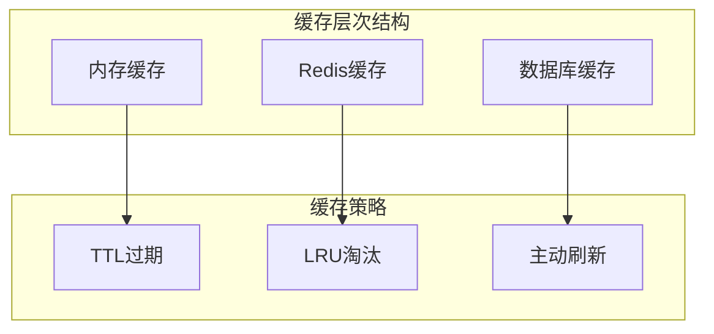

#### 缓存应用场景

| 缓存对象 | 缓存时间 | 更新触发 | 存储位置 |
|----------|----------|----------|----------|
| 用户折扣 | 60秒 | 规则更新 | Redis |
| 商品价格 | 30秒 | 价格变动 | 内存 |
| 用户列表 | 5分钟 | 用户变动 | Redis |
| 商品列表 | 10分钟 | 商品变动 | Redis |

### 并发控制

#### 锁机制

系统采用乐观锁和悲观锁相结合的方式：

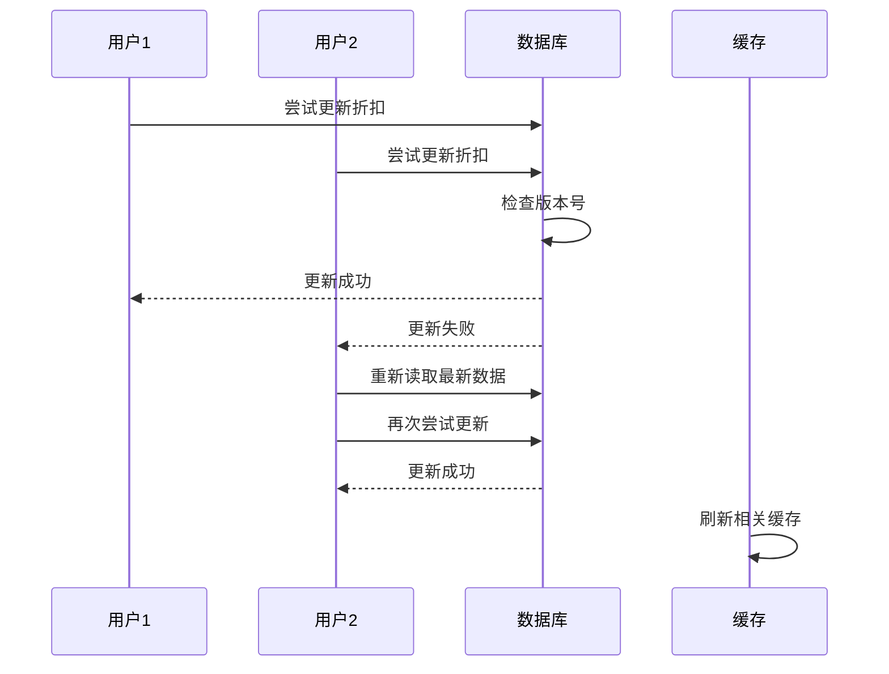

### 异步处理

#### 批量操作优化

对于大批量的折扣操作，系统采用异步处理：

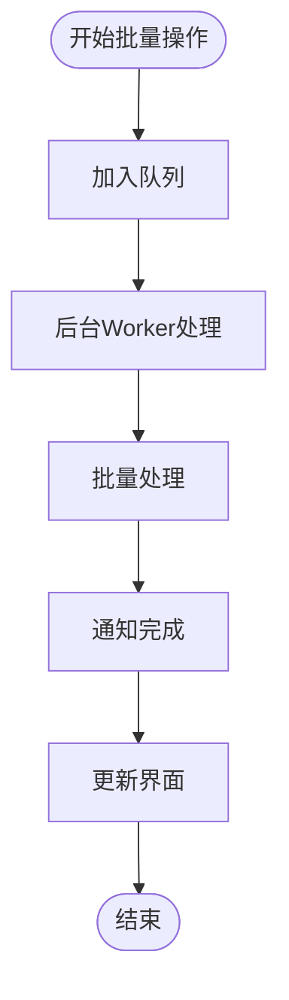

**节来源**
- [backend/orders/models.py](file://backend/orders/models.py#L259-L262)
- [backend/catalog/serializers.py](file://backend/catalog/serializers.py#L222-L246)

## 最佳实践指南

### 折扣活动策划建议

#### 1. 分层营销策略

建议采用分层的折扣策略：

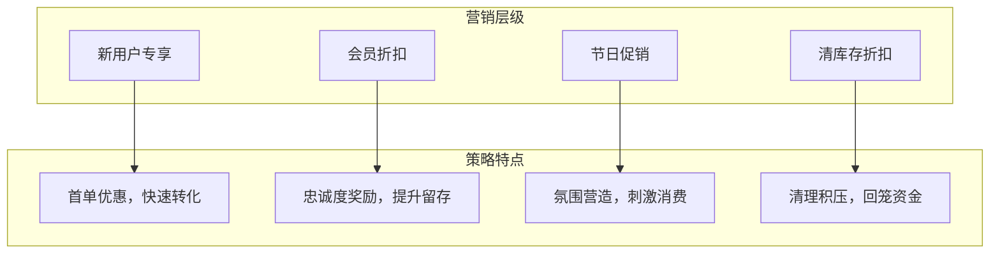

#### 2. 时间窗口规划

合理规划折扣的时间窗口：

| 时间阶段 | 推荐策略 | 注意事项 |
|----------|----------|----------|
| 前期预热 | 低折扣吸引关注 | 避免过早消耗预算 |
| 中期高潮 | 高折扣促进转化 | 控制库存和成本 |
| 后期收尾 | 清库存折扣 | 确保利润底线 |
| 长期维护 | 会员专属优惠 | 建立客户关系 |

#### 3. 用户分群策略

根据不同用户群体设计差异化折扣：

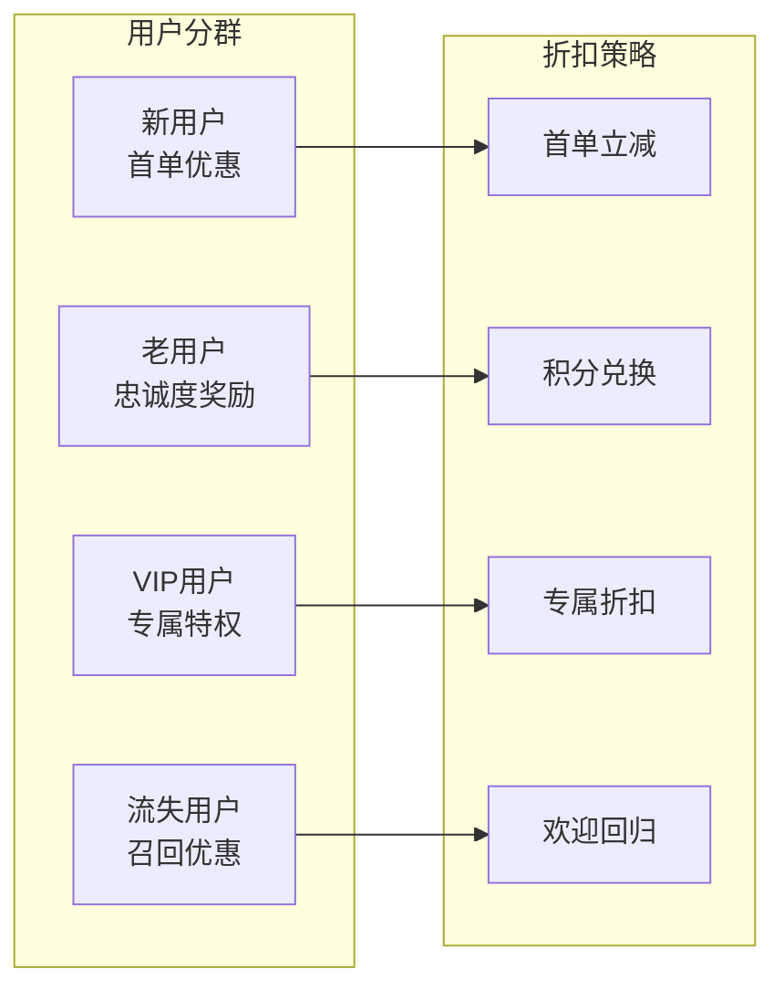

### 开发最佳实践

#### 1. 代码质量保证

- **单元测试覆盖率**：折扣计算模块测试覆盖率不低于90%
- **边界条件测试**：重点测试金额边界、时间边界、用户边界
- **并发测试**：模拟高并发场景下的系统表现

#### 2. 性能监控

建立完善的性能监控体系：

```mermaid
graph TB
subgraph "监控指标"
ResponseTime[响应时间]
Throughput[吞吐量]
ErrorRate[错误率]
CacheHit[缓存命中率]
end
subgraph "告警机制"
Threshold[阈值告警]
Trend[趋势告警]
Anomaly[异常告警]
end
ResponseTime --> Threshold
Throughput --> Trend
ErrorRate --> Anomaly
CacheHit --> Threshold
```

#### 3. 安全防护

实施多层次的安全防护措施：

| 安全层面 | 防护措施 | 实现方式 |
|----------|----------|----------|
| 数据安全 | 敏感数据加密 | AES-256加密 |
| 接口安全 | API访问控制 | JWT令牌验证 |
| 业务安全 | 防刷机制 | IP限制+频率控制 |
| 数据安全 | SQL注入防护 | ORM查询+参数化 |

#### 4. 可维护性设计

- **模块化设计**：将折扣计算、规则验证、缓存管理分离为独立模块
- **配置化管理**：将业务规则配置化，便于运营人员调整
- **日志记录**：完整记录折扣操作日志，便于问题追踪
- **版本控制**：重要折扣规则变更需要版本控制和审批流程

### 运维管理建议

#### 1. 数据备份策略

- **每日增量备份**：备份当天的折扣变更数据
- **每周全量备份**：备份完整的折扣数据
- **异地容灾**：重要数据异地存储

#### 2. 监控告警

建立全面的监控告警体系：

```mermaid
graph LR
subgraph "监控维度"
Business[业务监控]
Technical[技术监控]
Security[安全监控]
end
subgraph "告警级别"
Critical[严重]
Warning[警告]
Info[信息]
end
Business --> Critical
Technical --> Warning
Security --> Critical
Business --> Info
```

#### 3. 性能调优

定期进行性能调优：

- **数据库优化**：定期分析慢查询，优化索引
- **缓存优化**：调整缓存策略，提高命中率
- **代码优化**：重构热点代码，减少不必要的计算

## 故障排除

### 常见问题及解决方案

#### 1. 折扣计算不准确

**问题现象**：用户看到的折扣金额与预期不符

**排查步骤**：
```mermaid
flowchart TD
Start([发现问题]) --> CheckCache["检查缓存状态"]
CheckCache --> CacheOK{"缓存正常?"}
CacheOK --> |否| ClearCache["清除相关缓存"]
CacheOK --> |是| CheckRule["检查折扣规则"]
CheckRule --> RuleOK{"规则正确?"}
RuleOK --> |否| FixRule["修复规则配置"]
RuleOK --> |是| CheckUser["检查用户权限"]
CheckUser --> UserOK{"用户权限正确?"}
UserOK --> |否| FixUser["修复用户权限"]
UserOK --> |是| CheckDB["检查数据库连接"]
ClearCache --> Retry["重试计算"]
FixRule --> Retry
FixUser --> Retry
CheckDB --> Retry
Retry --> Success["问题解决"]
```

**解决方案**：
1. 清除相关缓存：`redis-cli DEL "discount:*"`
2. 检查折扣规则的有效性
3. 验证用户权限配置
4. 确认数据库连接正常

#### 2. 折扣规则冲突

**问题现象**：多个折扣同时生效，导致计算混乱

**解决方案**：
1. 检查折扣优先级设置
2. 确认时间窗口没有重叠
3. 验证用户和商品的适用范围
4. 使用系统提供的冲突检测功能

#### 3. 性能问题

**问题现象**：折扣计算响应缓慢

**优化措施**：
```mermaid
graph TB
subgraph "性能优化措施"
CacheOpt[缓存优化]
DBOpt[数据库优化]
CodeOpt[代码优化]
InfraOpt[基础设施优化]
end
subgraph "具体措施"
CacheOpt --> MemCache[内存缓存]
CacheOpt --> RedisCache[Redis缓存]
DBOpt --> IndexOpt[索引优化]
DBOpt --> QueryOpt[查询优化]
CodeOpt --> AsyncOpt[异步处理]
CodeOpt --> BatchOpt[批量处理]
InfraOpt --> LoadBalance[负载均衡]
InfraOpt --> AutoScale[自动扩容]
end
```

#### 4. 数据一致性问题

**问题现象**：不同渠道看到的折扣信息不一致

**排查清单**：
- [ ] 检查缓存同步机制
- [ ] 验证数据库事务处理
- [ ] 确认CDN缓存配置
- [ ] 检查多实例间的数据同步

### 调试工具和技巧

#### 1. 日志分析

系统提供详细的日志记录功能：

```mermaid
graph LR
subgraph "日志类型"
Access[访问日志]
Error[错误日志]
Debug[调试日志]
Business[业务日志]
end
subgraph "日志级别"
INFO[INFO级别]
WARN[WARN级别]
ERROR[ERROR级别]
DEBUG[DEBUG级别]
end
Access --> INFO
Error --> ERROR
Debug --> DEBUG
Business --> INFO
```

#### 2. 实时监控

建立实时监控面板：

| 监控指标 | 正常范围 | 告警阈值 | 处理建议 |
|----------|----------|----------|----------|
| 折扣计算响应时间 | < 100ms | > 500ms | 检查缓存和数据库 |
| 缓存命中率 | > 80% | < 50% | 优化缓存策略 |
| 数据库连接数 | < 80% | > 90% | 扩容数据库 |
| 错误率 | < 1% | > 5% | 检查系统稳定性 |

#### 3. 测试工具

开发专用的测试工具：

```mermaid
graph TB
subgraph "测试工具集"
UnitTest[单元测试]
IntegrationTest[集成测试]
LoadTest[压力测试]
SmokeTest[冒烟测试]
end
subgraph "测试场景"
BasicFunc[基础功能测试]
EdgeCase[边界情况测试]
ConcurrentTest[并发测试]
RecoveryTest[恢复测试]
end
UnitTest --> BasicFunc
IntegrationTest --> EdgeCase
LoadTest --> ConcurrentTest
SmokeTest --> RecoveryTest
```

**节来源**
- [backend/catalog/serializers.py](file://backend/catalog/serializers.py#L211-L251)
- [merchant/src/pages/Discounts/index.tsx](file://merchant/src/pages/Discounts/index.tsx#L38-L65)

## 结论

折扣管理系统是一个功能完善、性能优异的营销工具，通过合理的架构设计和优化策略，能够满足大型电商平台的复杂业务需求。系统的主要优势包括：

### 技术优势
- **高性能计算**：采用多层缓存和优化算法，确保折扣计算的高效性
- **灵活配置**：支持多维度、多层次的折扣规则配置
- **强一致性**：通过完善的事务控制和缓存同步机制保证数据一致性
- **可扩展性**：模块化设计便于功能扩展和维护

### 业务价值
- **提升转化率**：通过精准的折扣策略提高用户购买意愿
- **优化库存**：支持清库存和促销活动，改善库存周转
- **增强用户粘性**：会员专属折扣和分层营销提升用户忠诚度
- **降低运营成本**：自动化程度高，减少人工干预

### 发展方向
随着业务的发展，系统可以在以下方面持续优化：
- **AI智能推荐**：引入机器学习算法，实现个性化折扣推荐
- **实时竞价**：支持动态定价和实时竞价功能
- **跨平台整合**：与其他营销工具深度集成
- **数据分析**：提供更深入的折扣效果分析和预测功能

通过持续的技术创新和业务优化，折扣管理系统将继续为商家创造更大的商业价值。