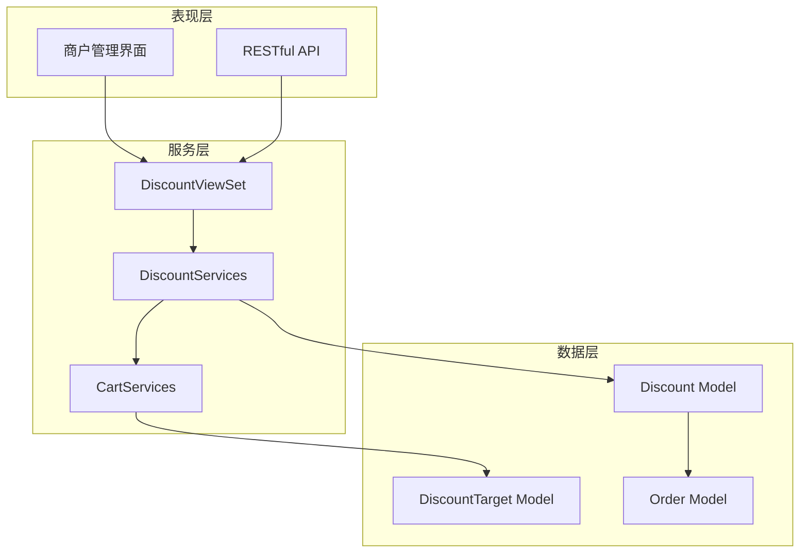
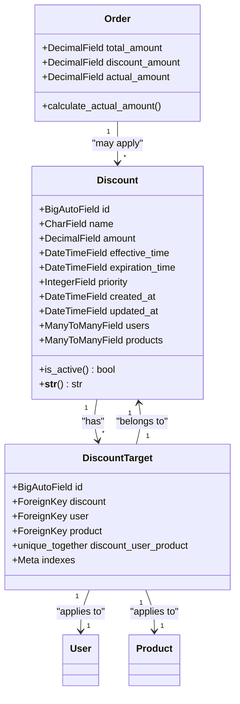
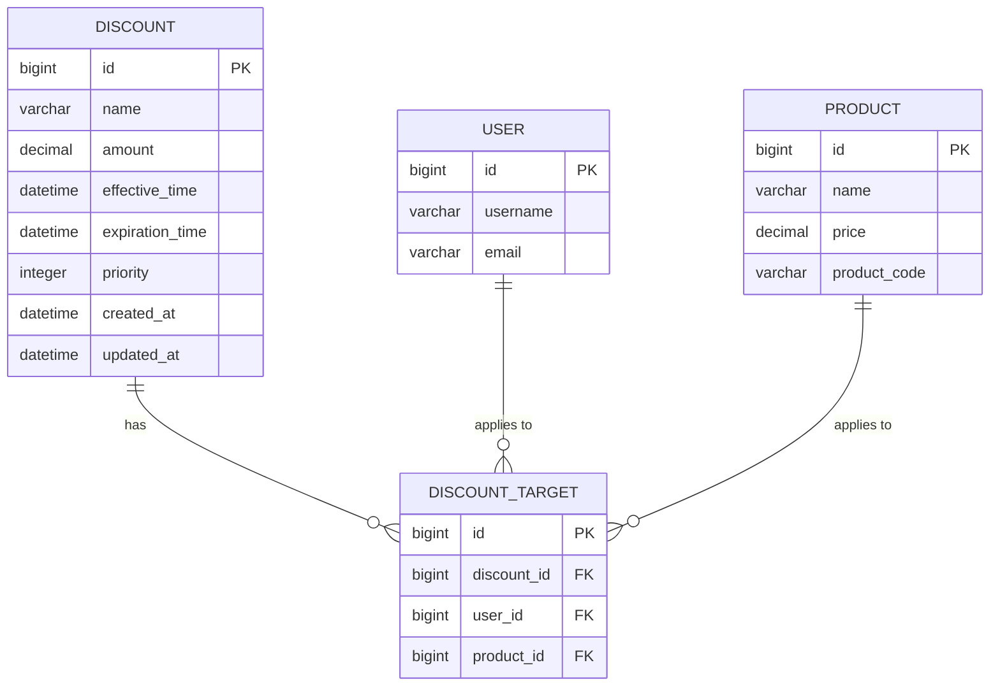
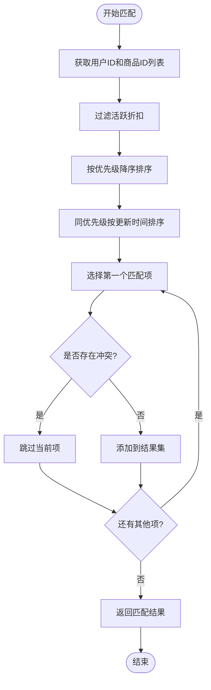
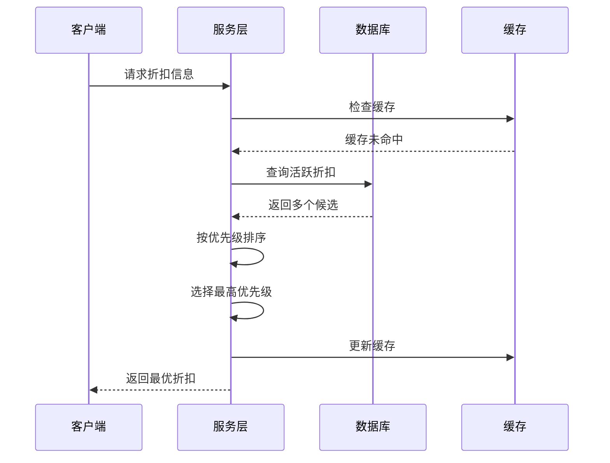
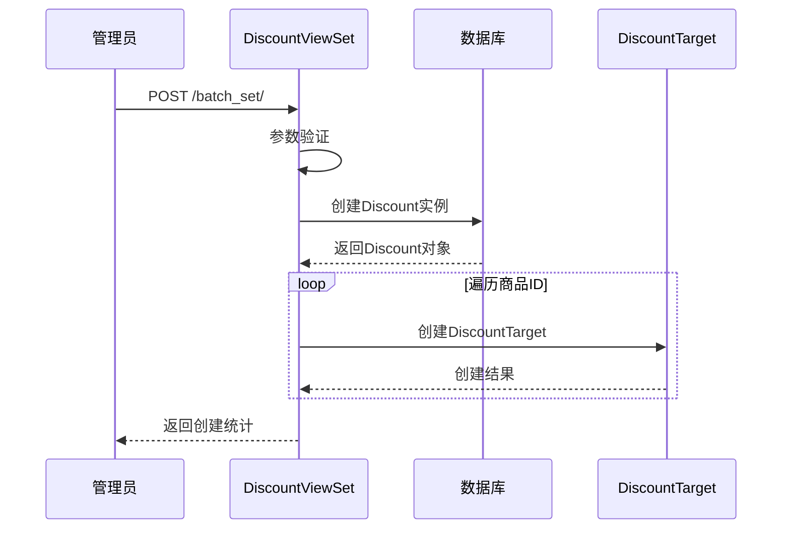
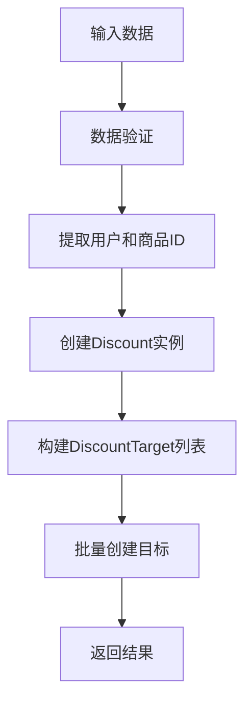
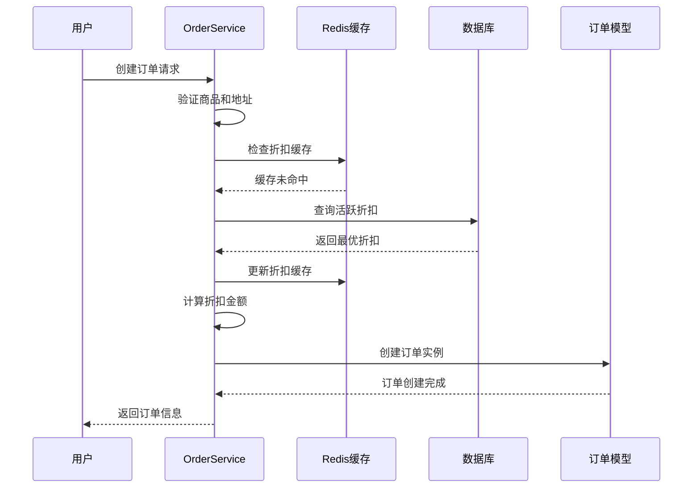
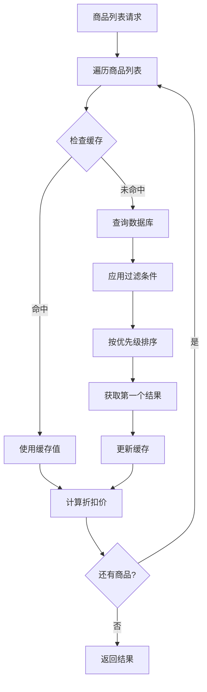

# 折扣规则功能详细文档

<cite>
**本文档引用的文件**
- [backend/orders/models.py](file://backend/orders/models.py)
- [backend/orders/serializers.py](file://backend/orders/serializers.py)
- [backend/orders/views.py](file://backend/orders/views.py)
- [backend/orders/services.py](file://backend/orders/services.py)
- [backend/catalog/serializers.py](file://backend/catalog/serializers.py)
- [backend/orders/migrations/0006_discount_discounttarget_discount_products_and_more.py](file://backend/orders/migrations/0006_discount_discounttarget_discount_products_and_more.py)
- [merchant/src/pages/Discounts/index.tsx](file://merchant/src/pages/Discounts/index.tsx)
- [api.md](file://api.md)
</cite>

## 目录
1. [简介](#简介)
2. [系统架构概览](#系统架构概览)
3. [核心数据模型](#核心数据模型)
4. [折扣规则引擎](#折扣规则引擎)
5. [后端API设计](#后端api设计)
6. [折扣应用流程](#折扣应用流程)
7. [高级特性与优化](#高级特性与优化)
8. [最佳实践指南](#最佳实践指南)
9. [故障排除](#故障排除)
10. [总结](#总结)

## 简介

折扣规则功能是电商平台的核心业务组件，负责管理复杂的折扣策略和优惠机制。该系统采用灵活的多对多关系设计，支持基于用户、商品的精细化折扣控制，同时具备强大的规则冲突检测和优先级处理能力。

系统主要解决以下核心问题：
- **精确匹配**：确保每个用户在特定商品上获得最合适的折扣
- **规则冲突**：处理多个折扣同时生效时的优先级决策
- **性能优化**：通过缓存和索引提升大量并发场景下的查询效率
- **业务灵活性**：支持复杂的折扣组合和动态规则调整

## 系统架构概览

折扣规则系统采用三层架构设计，包含数据层、服务层和表现层：



**图表来源**
- [backend/orders/views.py](file://backend/orders/views.py#L974-L1020)
- [backend/orders/models.py](file://backend/orders/models.py#L238-L290)

**章节来源**
- [backend/orders/views.py](file://backend/orders/views.py#L974-L1020)
- [backend/orders/models.py](file://backend/orders/models.py#L238-L290)

## 核心数据模型

### Discount模型详解

Discount模型是折扣规则的核心实体，定义了折扣的基本属性和行为：



**图表来源**
- [backend/orders/models.py](file://backend/orders/models.py#L238-L290)

#### 关键字段说明

| 字段名 | 类型 | 约束 | 作用 |
|--------|------|------|------|
| `amount` | DecimalField | validators=[MinValueValidator(0)] | 折扣金额，精确到小数点后两位，最小值为0 |
| `effective_time` | DateTimeField | - | 折扣生效时间，决定规则何时开始生效 |
| `expiration_time` | DateTimeField | - | 折扣过期时间，决定规则何时停止生效 |
| `priority` | IntegerField | default=0 | 优先级数值，数值越大优先级越高 |
| `name` | CharField | max_length=100, blank=True | 折扣规则名称，便于管理和识别 |

#### is_active属性实现逻辑

`is_active`属性提供了简洁的活动状态判断方法：

```python
@property
def is_active(self) -> bool:
    now = timezone.now()
    return self.effective_time <= now < self.expiration_time
```

该实现确保：
- **时间有效性**：只有在生效时间和过期时间之间才视为有效
- **时区处理**：使用`timezone.now()`确保时区一致性
- **边界条件**：包含生效时间但不包含过期时间

**章节来源**
- [backend/orders/models.py](file://backend/orders/models.py#L238-L290)

### DiscountTarget中间模型设计

DiscountTarget模型实现了Discount与用户、商品之间的多对多关系，采用单一表结构体现"针对某用户-某商品"的精确匹配：

#### 设计特点

1. **复合唯一约束**：`unique_together=('discount', 'user', 'product')`确保每种组合只能存在一个目标
2. **索引优化**：在`(user, product)`字段上建立复合索引，提升查询性能
3. **级联删除**：当Discount被删除时，所有关联的DiscountTarget也会被自动清理

#### 关系映射



**图表来源**
- [backend/orders/models.py](file://backend/orders/models.py#L273-L290)
- [backend/orders/migrations/0006_discount_discounttarget_discount_products_and_more.py](file://backend/orders/migrations/0006_discount_discounttarget_discount_products_and_more.py#L40-L42)

**章节来源**
- [backend/orders/models.py](file://backend/orders/models.py#L273-L290)
- [backend/orders/migrations/0006_discount_discounttarget_discount_products_and_more.py](file://backend/orders/migrations/0006_discount_discounttarget_discount_products_and_more.py#L40-L42)

## 折扣规则引擎

### 规则匹配算法

折扣规则引擎采用优先级驱动的匹配算法，确保在多个可用折扣中选择最优解：



**图表来源**
- [backend/orders/views.py](file://backend/orders/views.py#L1089-L1104)

#### 匹配查询实现

系统在多个场景下执行折扣匹配查询：

1. **订单创建时**：为单个商品计算折扣
2. **批量查询时**：为多个商品批量查找折扣
3. **商品列表渲染时**：为商品展示计算折扣价

查询的关键要素包括：
- **时间窗口过滤**：`discount__effective_time__lte=now, discount__expiration_time__gt=now`
- **优先级排序**：`order_by('-discount__priority', '-discount__updated_at')`
- **索引利用**：充分利用数据库索引提升查询性能

**章节来源**
- [backend/orders/views.py](file://backend/orders/views.py#L1089-L1104)
- [backend/orders/services.py](file://backend/orders/services.py#L11-L41)

### 优先级处理机制

优先级系统确保在规则冲突时能够做出合理的决策：

#### 优先级决策流程



**图表来源**
- [backend/orders/services.py](file://backend/orders/services.py#L11-L41)

#### 优先级规则

1. **数值优先**：`priority`字段的数值越大，优先级越高
2. **时间回退**：当优先级相同时，选择最近更新的规则
3. **唯一性保证**：通过数据库约束确保每个用户-商品组合的唯一性

**章节来源**
- [backend/orders/services.py](file://backend/orders/services.py#L11-L41)

## 后端API设计

### DiscountViewSet核心功能

DiscountViewSet提供了完整的折扣管理API接口，支持RESTful操作模式：

#### 主要API端点

| 端点 | 方法 | 权限 | 功能描述 |
|------|------|------|----------|
| `/discounts/` | GET | IsAuthenticated | 获取折扣列表 |
| `/discounts/` | POST | IsAdmin | 创建新折扣 |
| `/discounts/{id}/` | GET | IsAuthenticated | 获取折扣详情 |
| `/discounts/{id}/` | PATCH | IsAdmin | 更新折扣信息 |
| `/discounts/{id}/` | DELETE | IsAdmin | 删除折扣 |
| `/discounts/batch_set/` | POST | IsAdmin | 批量设置折扣 |
| `/discounts/query_user_products/` | GET | IsAuthenticated | 查询商品折扣 |

#### 批量设置API实现



**图表来源**
- [backend/orders/views.py](file://backend/orders/views.py#L1042-L1076)

#### 查询用户商品折扣API

该API专门用于批量查询用户在多个商品上的有效折扣：

```python
@action(detail=False, methods=['get'], permission_classes=[IsAuthenticated])
def query_user_products(self, request):
    """批量查询当前用户在一组商品上的有效折扣"""
    # 实现细节参见源码
```

**章节来源**
- [backend/orders/views.py](file://backend/orders/views.py#L974-L1020)
- [backend/orders/views.py](file://backend/orders/views.py#L1042-L1076)
- [backend/orders/views.py](file://backend/orders/views.py#L1078-L1104)

### DiscountSerializer序列化器

DiscountSerializer负责折扣数据的序列化和反序列化，支持复杂的关系处理：

#### 序列化器特性

1. **嵌套序列化**：通过`DiscountTargetSerializer`显示折扣的应用范围
2. **写入扩展**：支持`user_ids`和`product_ids`字段进行批量设置
3. **自定义验证**：在创建和更新时验证数据完整性

#### 创建流程



**图表来源**
- [backend/orders/serializers.py](file://backend/orders/serializers.py#L188-L200)

**章节来源**
- [backend/orders/serializers.py](file://backend/orders/serializers.py#L175-L230)

## 折扣应用流程

### 订单创建时的折扣应用

在订单创建过程中，系统会自动计算并应用最优折扣：



**图表来源**
- [backend/orders/services.py](file://backend/orders/services.py#L219-L297)

#### 折扣计算公式

订单中的金额计算遵循以下逻辑：

1. **基础价格**：`unit_price = product.price - discount_amount`
2. **总金额**：`total_amount = unit_price * quantity`
3. **实际支付**：`actual_amount = total_amount`

#### 金额验证机制

系统实现了严格的金额验证，防止出现异常情况：

```python
# 折扣金额验证
if amount < 0:
    amount = 0
if amount > product.price:
    amount = product.price
```

这确保了：
- **非负性**：折扣金额不会导致负值
- **上限控制**：折扣金额不超过商品原价
- **业务合理性**：避免出现不合理的折扣策略

**章节来源**
- [backend/orders/services.py](file://backend/orders/services.py#L219-L297)

### 商品列表折扣计算

在商品列表页面，系统需要为每个商品计算折扣价：



**图表来源**
- [backend/catalog/serializers.py](file://backend/catalog/serializers.py#L211-L251)

**章节来源**
- [backend/catalog/serializers.py](file://backend/catalog/serializers.py#L211-L251)

## 高级特性与优化

### 缓存策略

系统采用多层缓存策略提升性能：

#### 缓存层次结构

1. **应用层缓存**：在DiscountService中维护内存缓存
2. **Redis缓存**：持久化存储折扣信息，支持集群共享
3. **数据库缓存**：利用数据库连接池和查询缓存

#### 缓存键设计

```python
cache_key = f"discount:{user.id}:{product.id}"
```

这种设计的优势：
- **唯一性**：确保每个用户-商品组合的缓存独立性
- **可预测性**：缓存键格式简单，易于理解和维护
- **过期策略**：设置合理的TTL（如60秒），平衡性能和数据新鲜度

### 索引优化

数据库层面的索引设计是性能优化的关键：

#### 核心索引配置

| 索引类型 | 字段组合 | 用途 |
|----------|----------|------|
| 复合索引 | `(effective_time, expiration_time)` | 时间范围查询优化 |
| 单字段索引 | `priority` | 优先级排序加速 |
| 复合索引 | `(user, product)` | DiscountTarget查询优化 |
| 单字段索引 | `discount` | 关联查询加速 |

#### 索引使用场景

```sql
-- 时间范围查询
SELECT * FROM discount WHERE effective_time <= NOW() AND expiration_time > NOW();

-- 优先级排序
SELECT * FROM discount ORDER BY priority DESC, updated_at DESC;

-- 用户-商品匹配
SELECT * FROM discount_target WHERE user_id = ? AND product_id = ?;
```

### 并发控制

系统在高并发场景下保持数据一致性：

#### 事务管理

```python
with transaction.atomic():
    # 锁定库存
    InventoryService.lock_stock(product_id, quantity, reason, operator)
    # 创建订单
    order = Order.objects.create(...)
```

#### 数据库约束

1. **唯一约束**：防止重复的用户-商品-折扣组合
2. **外键约束**：确保数据完整性
3. **检查约束**：验证金额和时间的有效性

**章节来源**
- [backend/orders/services.py](file://backend/orders/services.py#L11-L41)
- [backend/catalog/serializers.py](file://backend/catalog/serializers.py#L211-L251)

## 最佳实践指南

### 规则设计原则

1. **单一职责**：每个折扣规则应该有明确的目的和范围
2. **时间规划**：合理安排生效时间和过期时间，避免规则冲突
3. **优先级设置**：根据业务重要性设置合理的优先级数值
4. **测试验证**：在生产环境部署前充分测试规则效果

### 性能优化建议

#### 查询优化

```python
# 推荐：使用select_related减少查询次数
DiscountTarget.objects.select_related('discount').filter(...)

# 推荐：添加适当的索引
class Meta:
    indexes = [
        models.Index(fields=['user', 'product']),
        models.Index(fields=['discount__priority']),
    ]
```

#### 缓存策略

```python
# 推荐：设置合理的缓存TTL
cache.set(cache_key, amount, timeout=60)  # 60秒

# 推荐：使用分布式缓存
from django.core.cache import cache
cache.get_or_set(key, default_value, timeout=300)
```

### 规则冲突处理

#### 冲突检测机制

```python
# 在创建新规则时检查冲突
existing = DiscountTarget.objects.filter(
    user=user,
    product=product,
    discount__effective_time__lt=expiration_time,
    discount__expiration_time__gt=effective_time
).exists()

if existing:
    raise ValidationError("存在时间冲突的折扣规则")
```

#### 冲突解决策略

1. **优先级优先**：高优先级规则覆盖低优先级规则
2. **时间优先**：相同优先级时，较新的规则优先
3. **手动干预**：对于复杂冲突，提供人工审核机制

### 监控和告警

#### 关键指标监控

1. **折扣命中率**：监控折扣规则的实际应用情况
2. **查询性能**：跟踪折扣查询的响应时间
3. **缓存命中率**：监控缓存效果和优化空间
4. **并发性能**：观察高并发场景下的系统表现

#### 告警配置

```python
# 查询超时告警
if query_time > 1.0:  # 1秒
    send_alert("折扣查询超时")

# 缓存穿透告警
if cache_miss_rate > 0.1:  # 10%
    send_alert("折扣缓存穿透严重")
```

## 故障排除

### 常见问题诊断

#### 折扣未生效

**可能原因**：
1. 折扣规则不在有效期内
2. 用户或商品不在适用范围内
3. 存在更高优先级的冲突规则

**排查步骤**：
```python
# 检查规则状态
discount.is_active  # 检查是否在有效期内

# 检查适用范围
targets = DiscountTarget.objects.filter(
    discount=discount,
    user=user,
    product=product
)

# 检查优先级
active_discounts = Discount.objects.filter(
    effective_time__lte=now,
    expiration_time__gt=now
).order_by('-priority', '-updated_at')
```

#### 性能问题

**症状**：折扣查询响应缓慢

**解决方案**：
1. 检查数据库索引是否正确创建
2. 分析慢查询日志，优化查询语句
3. 调整缓存策略和TTL设置
4. 考虑数据库读写分离

#### 并发冲突

**症状**：出现数据不一致或死锁

**解决方案**：
1. 使用数据库事务确保原子性
2. 实现乐观锁机制
3. 优化并发控制策略

### 调试工具

#### 开发环境调试

```python
# 启用SQL日志
import logging
logging.getLogger('django.db.backends').setLevel(logging.DEBUG)

# 调试折扣匹配过程
def debug_discount_match(user, product):
    now = timezone.now()
    targets = DiscountTarget.objects.filter(
        user=user,
        product=product,
        discount__effective_time__lte=now,
        discount__expiration_time__gt=now
    ).select_related('discount')
    
    print(f"匹配到 {len(targets)} 个活跃折扣:")
    for target in targets.order_by('-discount__priority', '-discount__updated_at'):
        print(f"  - 优先级: {target.discount.priority}, 折扣: {target.discount.amount}")
```

#### 生产环境监控

```python
# 性能监控
from django.db import connection
from django.core.cache import cache

def monitor_discount_performance():
    # 监控查询时间
    with connection.cursor() as cursor:
        cursor.execute("EXPLAIN SELECT ...")
        explain = cursor.fetchall()
    
    # 监控缓存状态
    cache_stats = {
        'hits': cache._cache.stats()['cmd_get']['hits'],
        'misses': cache._cache.stats()['cmd_get']['misses'],
        'keys': len(cache._cache.keys())
    }
    
    return cache_stats
```

## 总结

折扣规则功能是一个精心设计的业务组件，它不仅满足了复杂的商业需求，还展现了优秀的工程实践：

### 核心优势

1. **架构清晰**：采用分层架构，职责分明，易于维护和扩展
2. **性能优异**：通过多层缓存、索引优化和查询优化，确保高并发场景下的稳定性能
3. **业务灵活**：支持复杂的折扣组合和动态规则调整
4. **数据安全**：完善的事务控制和数据验证机制

### 技术亮点

- **智能匹配算法**：基于优先级的时间窗口匹配，确保规则冲突时的合理决策
- **缓存策略**：多层次缓存设计，显著提升查询性能
- **索引优化**：针对性的数据库索引设计，优化查询路径
- **并发控制**：完善的事务管理和数据一致性保障

### 发展方向

1. **机器学习集成**：基于用户行为数据的智能折扣推荐
2. **实时计算**：支持更复杂的实时折扣计算场景
3. **规则可视化**：提供图形化的规则配置界面
4. **A/B测试支持**：内置的实验框架，支持折扣效果评估

该折扣规则系统为电商平台提供了强大而灵活的优惠管理能力，是现代电商系统不可或缺的核心组件。