# 权限设置

<cite>
**本文档中引用的文件**
- [backend/users/views.py](file://backend/users/views.py)
- [backend/users/models.py](file://backend/users/models.py)
- [backend/users/serializers.py](file://backend/users/serializers.py)
- [backend/users/urls.py](file://backend/users/urls.py)
- [backend/users/services.py](file://backend/users/services.py)
- [backend/common/permissions.py](file://backend/common/permissions.py)
- [backend/common/audit_logger.py](file://backend/common/audit_logger.py)
- [backend/users/management/commands/reset_admin.py](file://backend/users/management/commands/reset_admin.py)
- [merchant/src/pages/Users/index.tsx](file://merchant/src/pages/Users/index.tsx)
- [merchant/src/services/api.ts](file://merchant/src/services/api.ts)
- [merchant/src/utils/auth.ts](file://merchant/src/utils/auth.ts)
- [backend/backend/settings/base.py](file://backend/backend/settings/base.py)
</cite>

## 目录
1. [简介](#简介)
2. [项目架构概览](#项目架构概览)
3. [核心组件分析](#核心组件分析)
4. [管理员权限管理机制](#管理员权限管理机制)
5. [前端Switch组件实现](#前端switch组件实现)
6. [后端API设计](#后端api设计)
7. [权限验证与安全机制](#权限验证与安全机制)
8. [审计日志与监控](#审计日志与监控)
9. [错误处理与用户体验](#错误处理与用户体验)
10. [安全最佳实践](#安全最佳实践)
11. [故障排除指南](#故障排除指南)
12. [总结](#总结)

## 简介

本系统实现了一套完整的管理员权限设置功能，通过前后端分离的架构，提供了直观的权限管理界面和可靠的权限控制机制。系统采用Django REST Framework构建后端API，使用React + Ant Design构建前端管理界面，实现了基于角色的访问控制（RBAC）和细粒度的权限管理。

核心功能包括：
- 基于is_staff和is_superuser字段的双重权限控制
- 实时的权限切换操作（设置/取消管理员）
- 完整的操作审计日志记录
- 前后端统一的权限验证机制
- 用户体验友好的确认流程和错误处理

## 项目架构概览

系统采用现代化的前后端分离架构，分为商户管理后台（merchant）和API服务（backend）两部分。

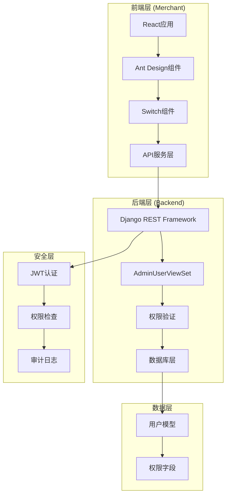

**图表来源**
- [merchant/src/pages/Users/index.tsx](file://merchant/src/pages/Users/index.tsx#L1-L123)
- [backend/users/views.py](file://backend/users/views.py#L388-L459)

**章节来源**
- [merchant/src/pages/Users/index.tsx](file://merchant/src/pages/Users/index.tsx#L1-L123)
- [backend/users/views.py](file://backend/users/views.py#L388-L459)

## 核心组件分析

### 用户模型设计

系统的核心是基于Django内置User模型扩展的用户系统，包含以下关键字段：

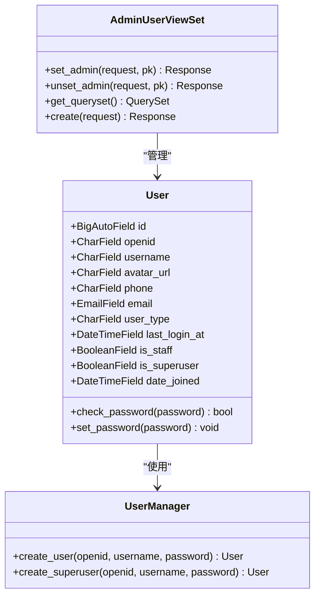

**图表来源**
- [backend/users/models.py](file://backend/users/models.py#L31-L71)
- [backend/users/views.py](file://backend/users/views.py#L388-L459)

### 权限验证机制

系统实现了多层次的权限验证体系：

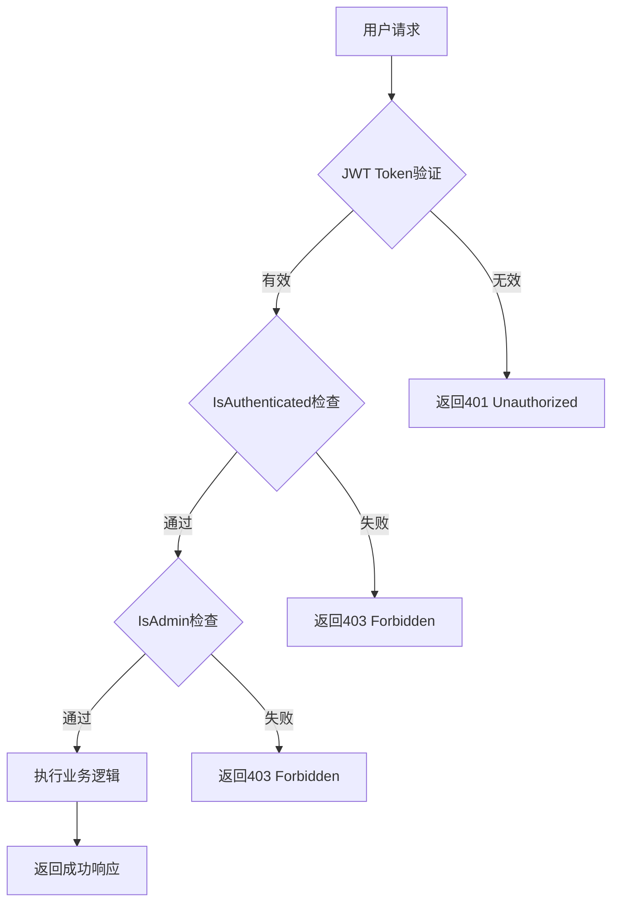

**图表来源**
- [backend/common/permissions.py](file://backend/common/permissions.py#L101-L123)
- [backend/users/views.py](file://backend/users/views.py#L398-L400)

**章节来源**
- [backend/users/models.py](file://backend/users/models.py#L31-L71)
- [backend/common/permissions.py](file://backend/common/permissions.py#L101-L123)

## 管理员权限管理机制

### 权限字段设计

系统采用双重权限控制机制：

| 字段 | 类型 | 作用 | 默认值 | 说明 |
|------|------|------|--------|------|
| is_staff | BooleanField | 基础管理员权限 | False | 控制是否可访问Django管理后台 |
| is_superuser | BooleanField | 超级管理员权限 | False | 拥有系统最高权限 |
| user_type | CharField | 用户类型标识 | 'wechat' | 区分微信用户和管理员用户 |

### 权限提升策略

系统实现了智能的权限提升机制，在特定条件下自动提升用户为管理员：

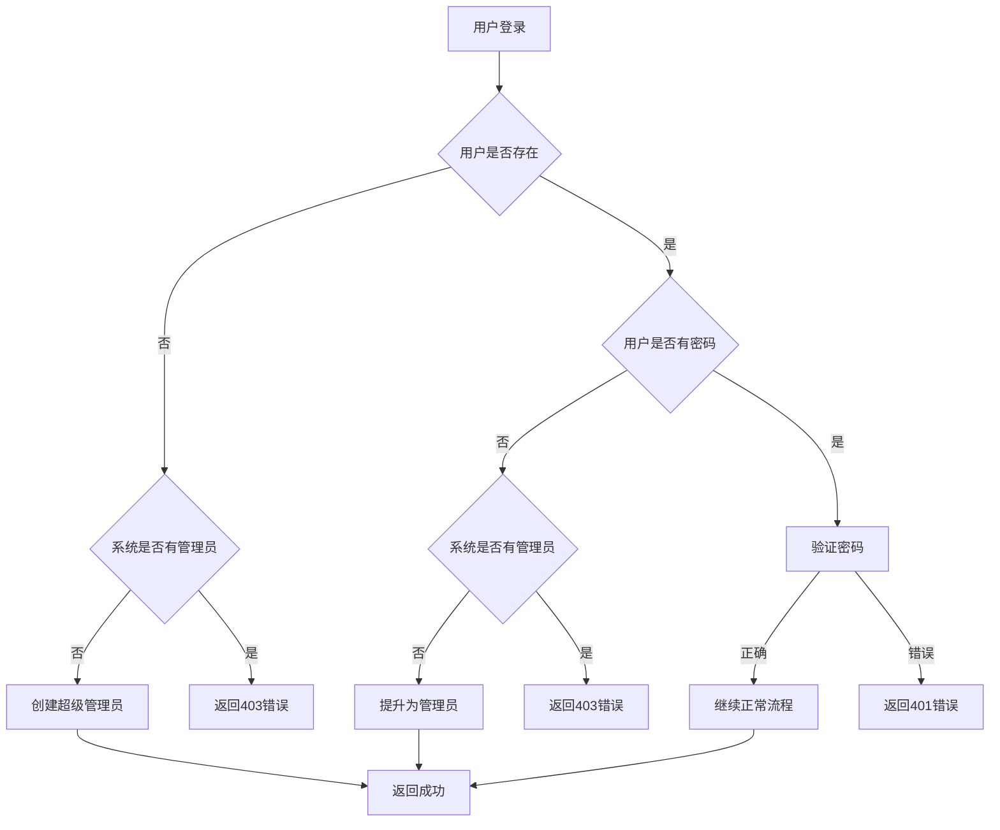

**图表来源**
- [backend/users/views.py](file://backend/users/views.py#L189-L221)

**章节来源**
- [backend/users/views.py](file://backend/users/views.py#L189-L221)
- [backend/users/models.py](file://backend/users/models.py#L18-L22)

## 前端Switch组件实现

### 组件架构设计

前端使用React和Ant Design构建管理员权限切换界面：

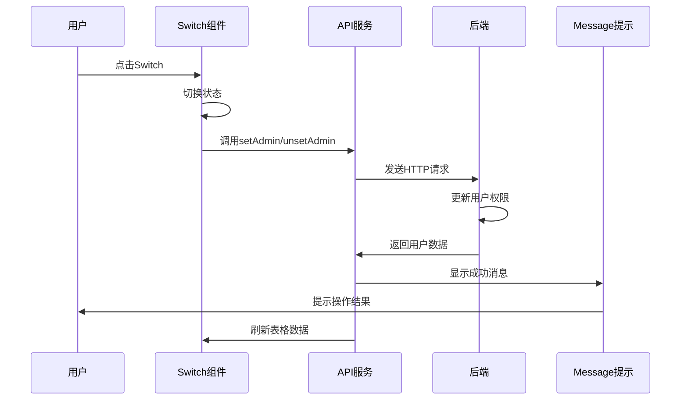

**图表来源**
- [merchant/src/pages/Users/index.tsx](file://merchant/src/pages/Users/index.tsx#L56-L70)
- [merchant/src/services/api.ts](file://merchant/src/services/api.ts#L13-L14)

### 异步操作处理

Switch组件实现了完整的异步操作处理流程：

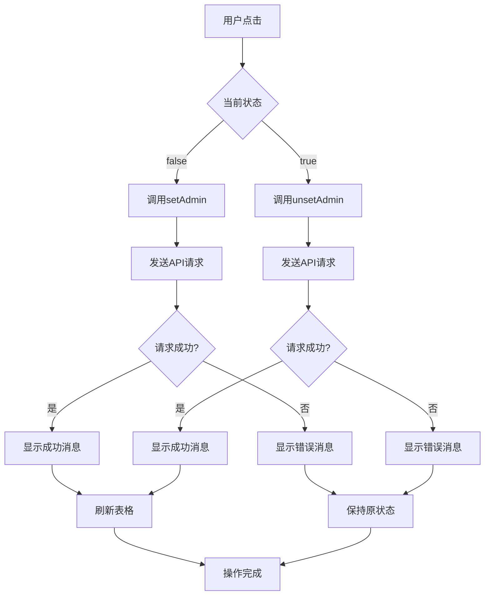

**图表来源**
- [merchant/src/pages/Users/index.tsx](file://merchant/src/pages/Users/index.tsx#L58-L70)

**章节来源**
- [merchant/src/pages/Users/index.tsx](file://merchant/src/pages/Users/index.tsx#L56-L70)
- [merchant/src/services/api.ts](file://merchant/src/services/api.ts#L13-L14)

## 后端API设计

### AdminUserViewSet架构

后端采用Django REST Framework的ViewSet模式，提供了完整的CRUD和权限管理功能：

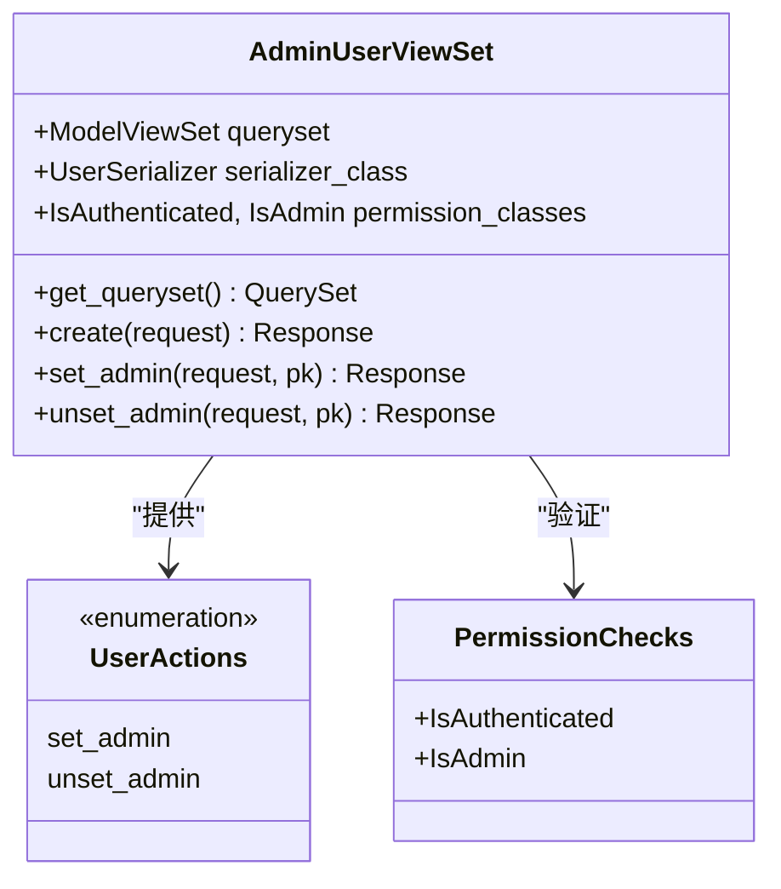

**图表来源**
- [backend/users/views.py](file://backend/users/views.py#L388-L459)

### 自定义Action实现

系统实现了两个专门的自定义Action来处理管理员权限：

| Action | 方法 | 功能 | 权限要求 | 返回值 |
|--------|------|------|----------|--------|
| set_admin | POST | 设置用户为管理员 | IsAuthenticated + IsAdmin | 更新后的用户数据 |
| unset_admin | POST | 取消用户管理员权限 | IsAuthenticated + IsAdmin | 更新后的用户数据 |

### 查询集过滤机制

AdminUserViewSet提供了灵活的查询集过滤功能：

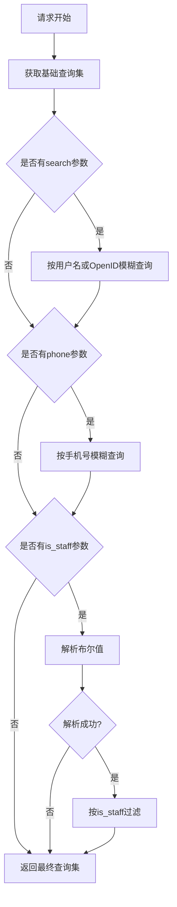

**图表来源**
- [backend/users/views.py](file://backend/users/views.py#L402-L422)

**章节来源**
- [backend/users/views.py](file://backend/users/views.py#L388-L459)
- [backend/users/urls.py](file://backend/users/urls.py#L8)

## 权限验证与安全机制

### JWT认证流程

系统采用JWT（JSON Web Token）进行身份认证：

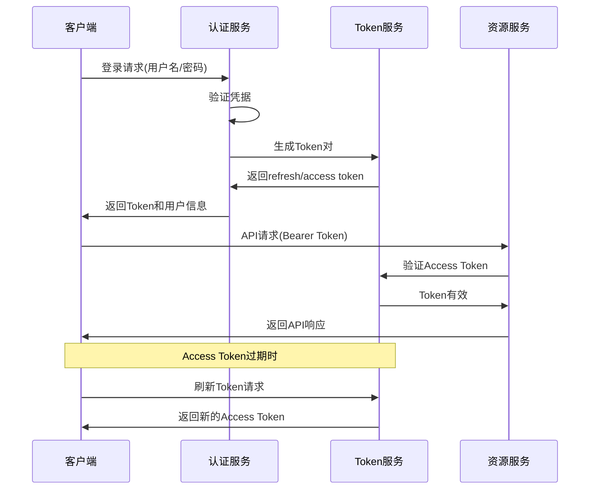

**图表来源**
- [backend/users/views.py](file://backend/users/views.py#L177-L233)
- [merchant/src/utils/auth.ts](file://merchant/src/utils/auth.ts#L1-L13)

### 权限中间件验证

系统实现了多层权限验证机制：

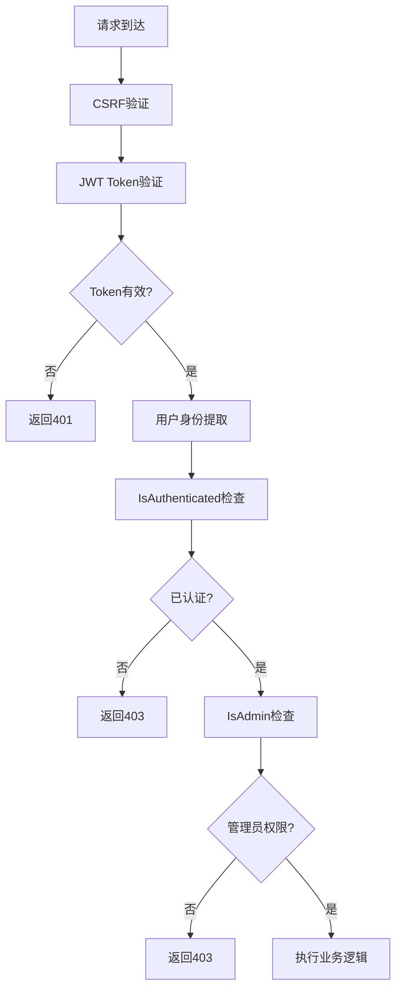

**图表来源**
- [backend/common/permissions.py](file://backend/common/permissions.py#L101-L123)

**章节来源**
- [backend/users/views.py](file://backend/users/views.py#L177-L233)
- [backend/common/permissions.py](file://backend/common/permissions.py#L101-L123)

## 审计日志与监控

### 审计日志系统

系统实现了完整的审计日志记录机制，跟踪所有重要的管理操作：

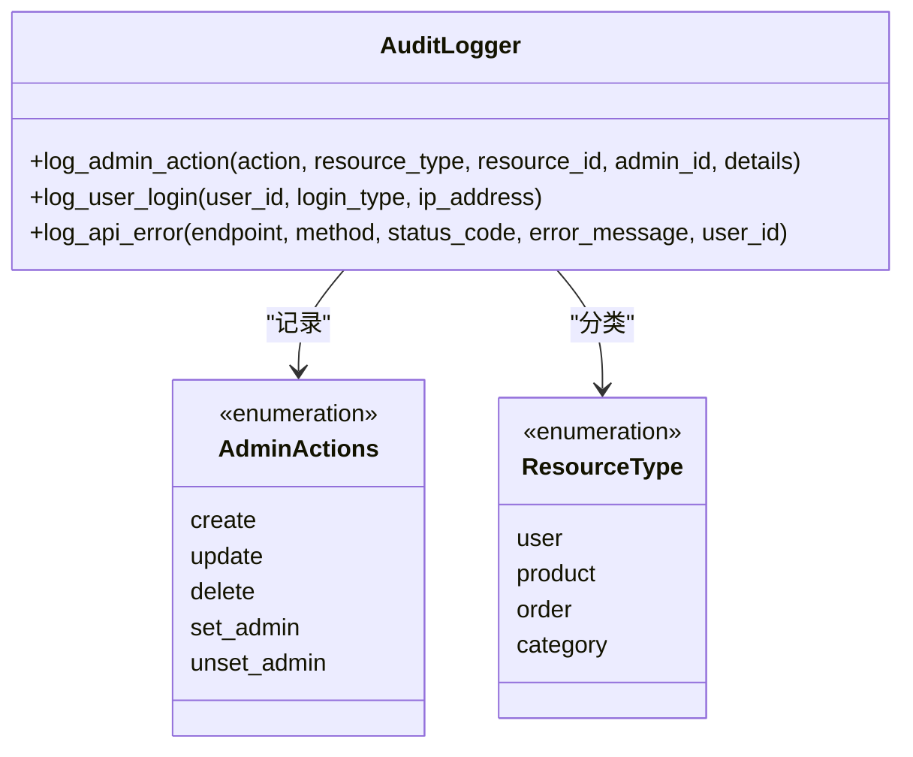

**图表来源**
- [backend/common/audit_logger.py](file://backend/common/audit_logger.py#L223-L245)

### 关键操作日志记录

系统会记录以下关键操作的审计日志：

| 操作类型 | 日志内容 | 记录字段 | 用途 |
|----------|----------|----------|------|
| 管理员权限变更 | set_admin/unset_admin操作 | admin_id, user_id, timestamp | 权限变更追踪 |
| 用户登录 | 管理员登录记录 | user_id, login_type, ip_address | 安全监控 |
| API错误 | 请求失败记录 | endpoint, method, status_code, error_message | 故障诊断 |

**章节来源**
- [backend/common/audit_logger.py](file://backend/common/audit_logger.py#L223-L245)

## 错误处理与用户体验

### 前端错误处理机制

前端实现了完善的错误处理和用户反馈机制：

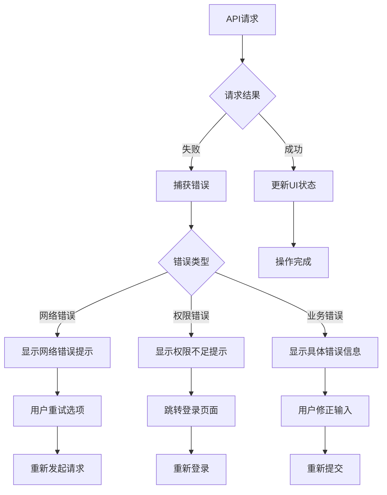

**图表来源**
- [merchant/src/pages/Users/index.tsx](file://merchant/src/pages/Users/index.tsx#L68-L70)

### 用户体验优化

系统在多个层面优化了用户体验：

1. **即时反馈**：Switch组件立即反映状态变化
2. **成功提示**：操作成功后显示明确的消息
3. **错误处理**：提供清晰的错误信息和解决建议
4. **状态同步**：操作完成后自动刷新数据

**章节来源**
- [merchant/src/pages/Users/index.tsx](file://merchant/src/pages/Users/index.tsx#L58-L70)

## 安全最佳实践

### 权限继承模型设计

系统采用了合理的权限继承模型：

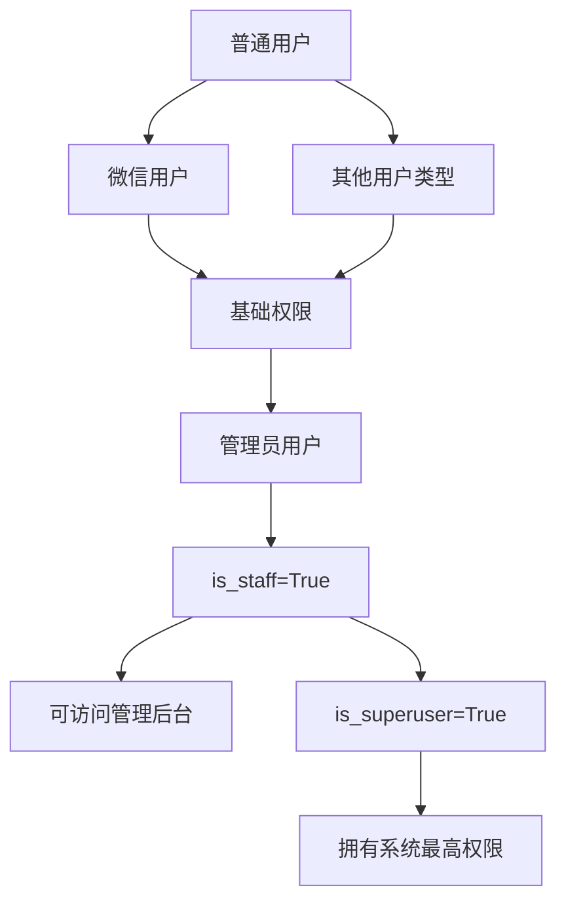

### 敏感操作的安全措施

1. **双重验证**：管理员权限变更需要管理员身份验证
2. **操作审计**：所有权限变更都有完整日志记录
3. **权限隔离**：不同类型的用户有不同的权限边界
4. **最小权限原则**：只授予必要的最小权限

### 系统初始化安全

系统提供了安全的管理员账户初始化机制：

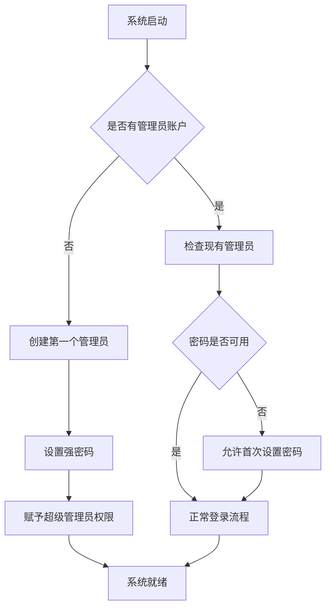

**图表来源**
- [backend/users/services.py](file://backend/users/services.py#L26-L54)

**章节来源**
- [backend/users/services.py](file://backend/users/services.py#L26-L54)
- [backend/users/management/commands/reset_admin.py](file://backend/users/management/commands/reset_admin.py#L1-L26)

## 故障排除指南

### 常见问题及解决方案

| 问题描述 | 可能原因 | 解决方案 |
|----------|----------|----------|
| 无法设置管理员权限 | 当前用户不是管理员 | 确保当前用户具有管理员权限 |
| 权限变更后无效 | 数据库同步延迟 | 刷新页面或重新登录 |
| API请求失败 | Token过期或无效 | 重新登录获取新Token |
| 权限日志缺失 | 审计日志配置问题 | 检查日志配置和权限设置 |

### 调试技巧

1. **检查Token有效性**：验证JWT Token是否正确传递
2. **查看权限验证**：确认用户是否具有管理员权限
3. **检查日志输出**：查看审计日志了解操作详情
4. **验证数据库状态**：直接查询数据库确认权限字段状态

**章节来源**
- [backend/common/audit_logger.py](file://backend/common/audit_logger.py#L223-L245)

## 总结

本权限设置功能实现了完整的管理员权限管理体系，具有以下特点：

### 技术优势

1. **架构清晰**：前后端分离，职责明确
2. **安全可靠**：多重权限验证和审计日志
3. **用户体验**：直观的操作界面和及时的反馈
4. **扩展性强**：模块化设计便于功能扩展

### 安全特性

1. **权限分离**：is_staff和is_superuser双重控制
2. **操作审计**：完整的操作日志记录
3. **安全验证**：JWT认证和权限中间件
4. **最小权限**：遵循最小权限原则

### 最佳实践

1. **代码组织**：清晰的模块划分和职责分离
2. **错误处理**：完善的异常处理和用户反馈
3. **性能优化**：查询优化和缓存机制
4. **可维护性**：良好的代码结构和文档

这套权限设置功能为系统提供了安全、可靠、易用的管理员权限管理能力，是现代Web应用权限控制的优秀实践案例。