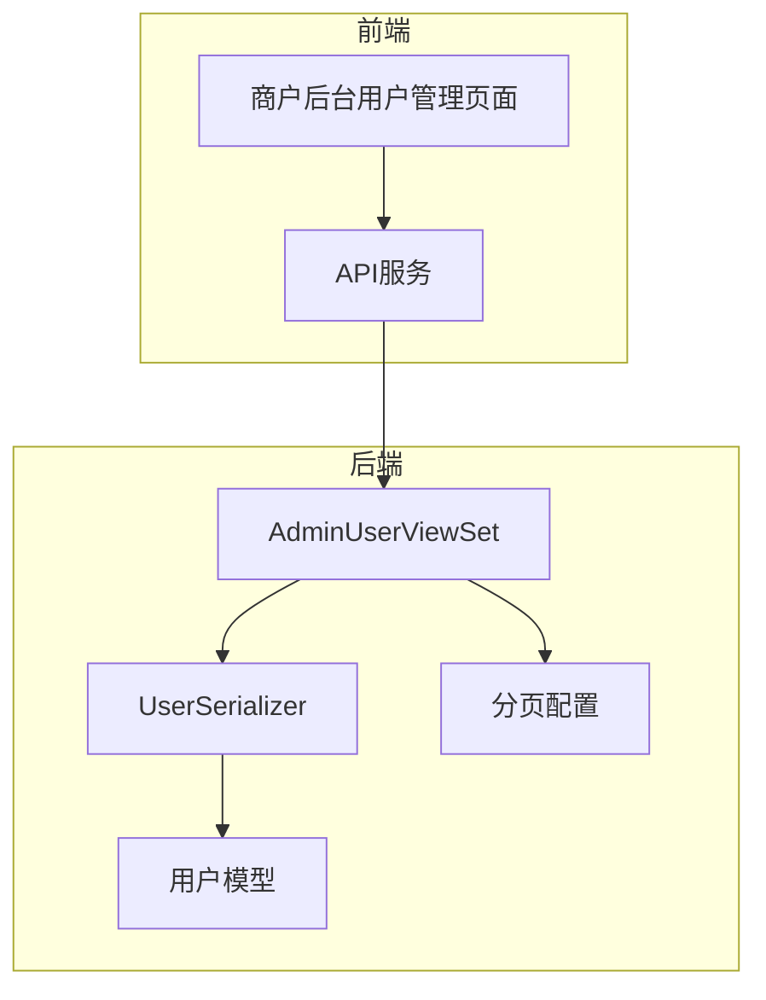
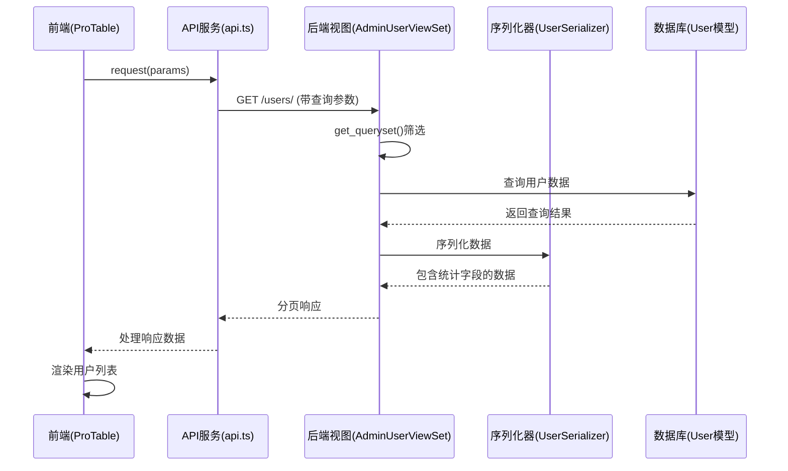
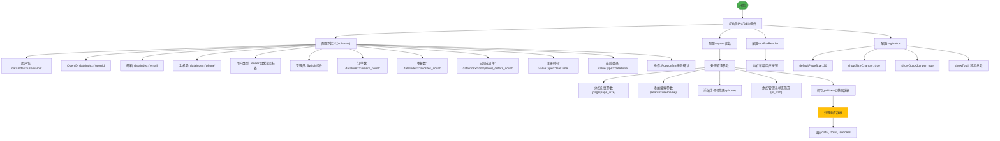
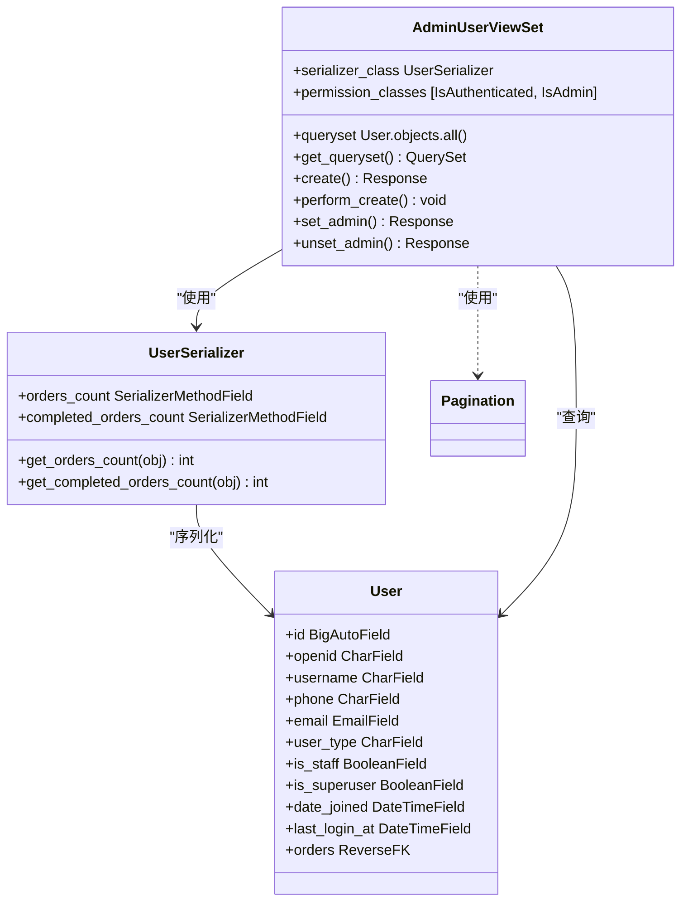
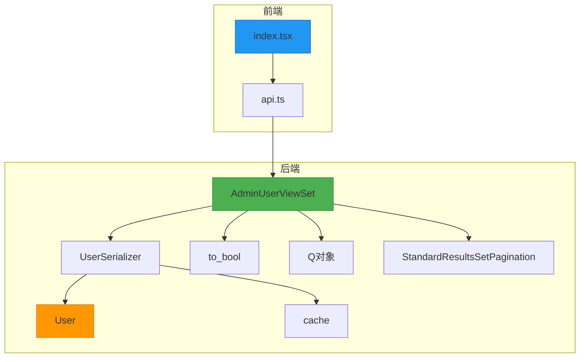

# 用户列表

<cite>
**本文档引用文件**   
- [index.tsx](file://merchant/src/pages/Users/index.tsx)
- [models.py](file://backend/users/models.py)
- [views.py](file://backend/users/views.py)
- [serializers.py](file://backend/users/serializers.py)
- [api.ts](file://merchant/src/services/api.ts)
- [pagination.py](file://backend/common/pagination.py)
- [services.py](file://backend/users/services.py)
- [utils.py](file://backend/common/utils.py)
</cite>

## 目录
1. [项目结构](#项目结构)
2. [核心组件](#核心组件)
3. [架构概述](#架构概述)
4. [详细组件分析](#详细组件分析)
5. [依赖分析](#依赖分析)
6. [性能考虑](#性能考虑)
7. [故障排除指南](#故障排除指南)
8. [结论](#结论)

## 项目结构

**图表来源**
- [index.tsx](file://merchant/src/pages/Users/index.tsx#L1-L292)
- [views.py](file://backend/users/views.py#L387-L460)

**章节来源**
- [index.tsx](file://merchant/src/pages/Users/index.tsx#L1-L292)
- [views.py](file://backend/users/views.py#L387-L460)

## 核心组件

商户后台用户列表功能由前后端协同实现，前端使用Ant Design Pro的ProTable组件展示数据，后端通过Django REST Framework提供API接口。前端通过request函数获取数据，支持分页、搜索和筛选功能。表格中的管理员权限开关（Switch）可实时更新用户权限状态，删除用户时会弹出确认对话框。后端AdminUserViewSet.get_queryset方法支持按用户名、手机号和管理员状态进行筛选，数据通过UserSerializer序列化返回。

**章节来源**
- [index.tsx](file://merchant/src/pages/Users/index.tsx#L1-L292)
- [views.py](file://backend/users/views.py#L402-L421)

## 架构概述

**图表来源**
- [index.tsx](file://merchant/src/pages/Users/index.tsx#L171-L215)
- [views.py](file://backend/users/views.py#L402-L421)
- [serializers.py](file://backend/users/serializers.py#L6-L41)

**章节来源**
- [index.tsx](file://merchant/src/pages/Users/index.tsx#L154-L227)
- [views.py](file://backend/users/views.py#L387-L460)

## 详细组件分析

### 用户列表前端实现

**图表来源**
- [index.tsx](file://merchant/src/pages/Users/index.tsx#L13-L150)
- [api.ts](file://merchant/src/services/api.ts#L8)

**章节来源**
- [index.tsx](file://merchant/src/pages/Users/index.tsx#L1-L292)

### 后端API实现

**图表来源**
- [views.py](file://backend/users/views.py#L387-L460)
- [serializers.py](file://backend/users/serializers.py#L6-L41)
- [models.py](file://backend/users/models.py#L31-L74)

**章节来源**
- [views.py](file://backend/users/views.py#L387-L460)
- [serializers.py](file://backend/users/serializers.py#L6-L41)

## 依赖分析

**图表来源**
- [index.tsx](file://merchant/src/pages/Users/index.tsx#L5)
- [api.ts](file://merchant/src/services/api.ts#L8)
- [views.py](file://backend/users/views.py#L387-L460)
- [serializers.py](file://backend/users/serializers.py#L6-L41)
- [models.py](file://backend/users/models.py#L31-L74)
- [utils.py](file://backend/common/utils.py#L1-L13)
- [pagination.py](file://backend/common/pagination.py#L8-L26)

**章节来源**
- [views.py](file://backend/users/views.py#L10)
- [serializers.py](file://backend/users/serializers.py#L2)
- [api.ts](file://merchant/src/services/api.ts#L1)

## 性能考虑

用户列表功能在性能方面有以下优化措施：首先，后端使用缓存机制存储用户统计信息，UserSerializer中的orders_count和completed_orders_count字段通过Redis缓存存储，缓存时间为5分钟，避免频繁查询数据库。其次，分页配置合理，前端默认分页大小为20条，最大支持100条，避免一次性加载过多数据。再者，数据库查询使用select_related和prefetch_related优化关联查询，减少SQL查询次数。此外，后端使用Q对象进行复杂查询，支持按用户名、手机号和管理员状态进行筛选，查询效率高。最后，前端使用虚拟滚动技术，当数据量大时仍能保持流畅的滚动体验。

**章节来源**
- [serializers.py](file://backend/users/serializers.py#L21-L41)
- [pagination.py](file://backend/common/pagination.py#L20)
- [index.tsx](file://merchant/src/pages/Users/index.tsx#L222)

## 故障排除指南

当用户列表功能出现问题时，可按以下步骤排查：首先检查网络请求是否正常，在浏览器开发者工具中查看API请求状态码，确保返回200状态码。其次检查查询参数是否正确传递，特别是分页参数(page/page_size)、搜索参数(search)、手机号筛选(phone)和管理员状态筛选(is_staff)。再者检查后端日志，查看是否有数据库查询错误或权限验证失败。如果管理员权限开关无法更新，检查set_admin和unset_admin接口是否被正确调用，以及用户是否有管理员权限操作权限。如果删除用户失败，检查Popconfirm组件的onConfirm回调是否正确执行。最后，如果数据加载缓慢，检查缓存是否正常工作，以及数据库索引是否合理。

**章节来源**
- [index.tsx](file://merchant/src/pages/Users/index.tsx#L211-L214)
- [views.py](file://backend/users/views.py#L446-L459)
- [api.ts](file://merchant/src/services/api.ts#L13-L14)

## 结论

商户后台用户列表功能通过前后端协同实现了完整的用户管理能力。前端使用Ant Design Pro的ProTable组件提供了友好的用户界面，支持分页、搜索、筛选和操作功能。后端通过Django REST Framework提供了稳定的API接口，支持复杂查询和权限控制。系统在性能方面做了充分优化，使用缓存机制减少数据库压力，合理配置分页大小避免数据过载。整体架构清晰，组件职责分明，便于维护和扩展。建议在实际使用中根据业务需求调整分页大小，对于不常用的字段可以考虑隐藏，以提升用户体验。