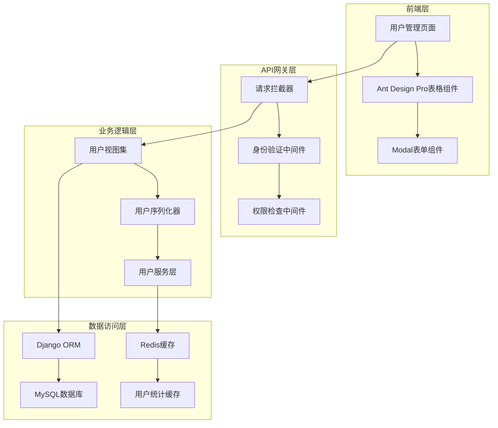
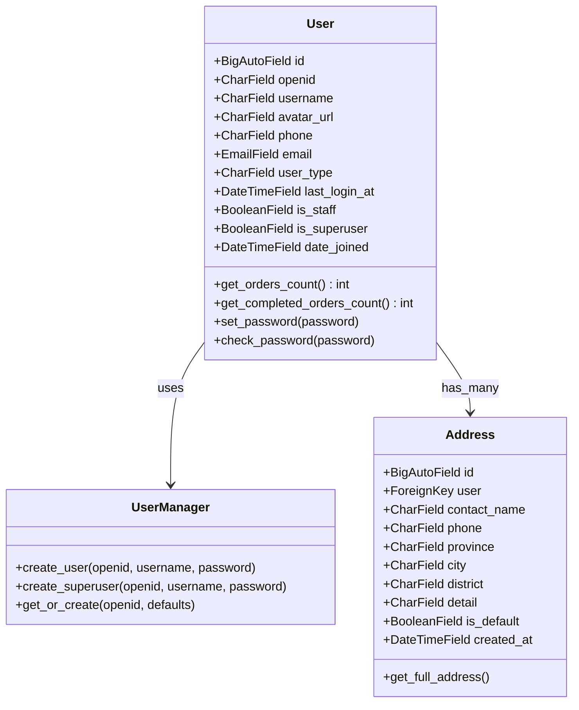
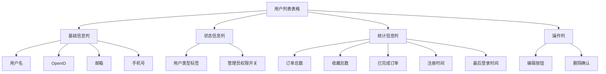
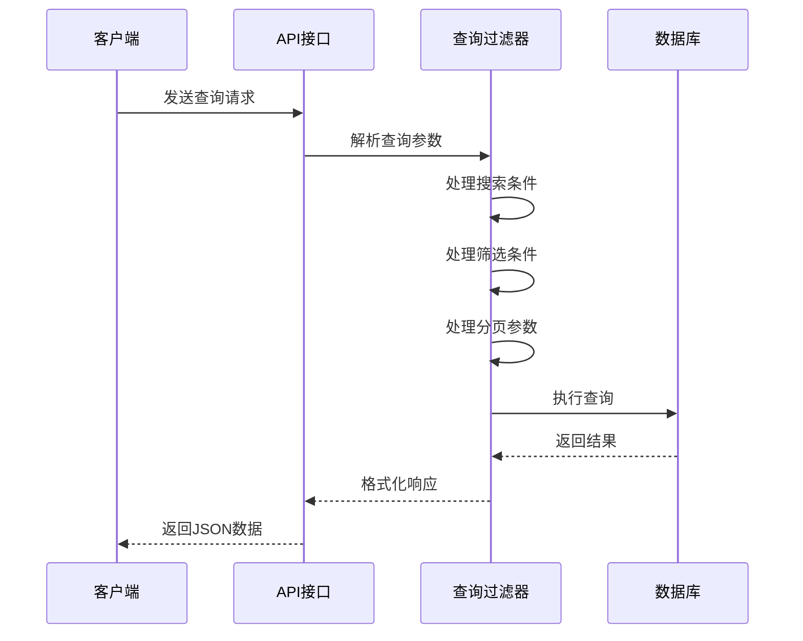
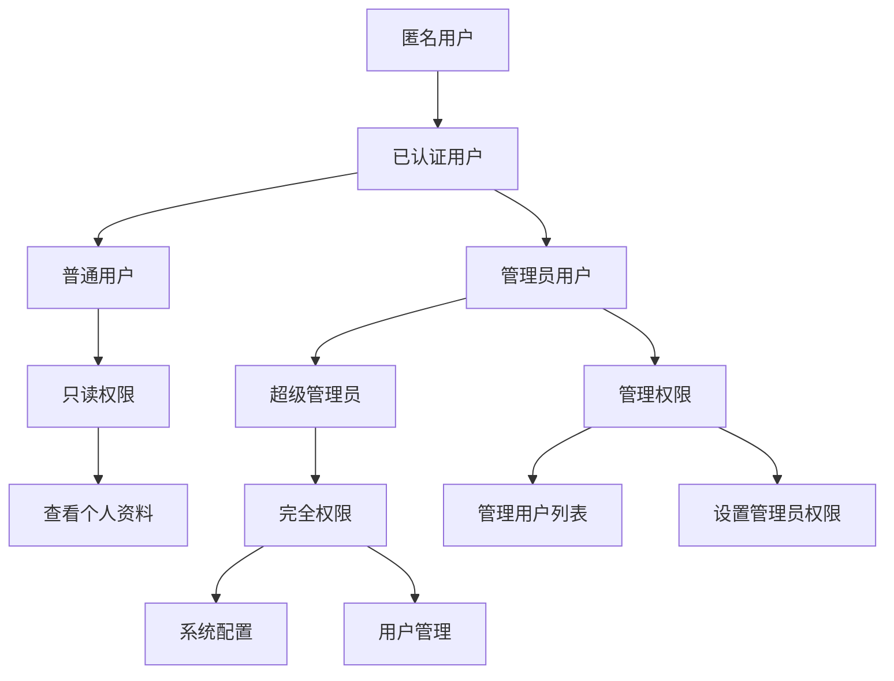
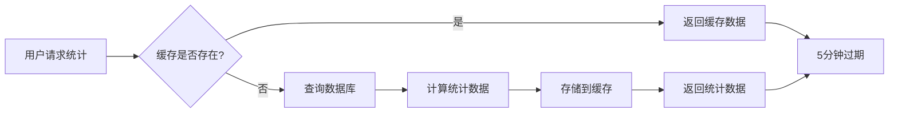
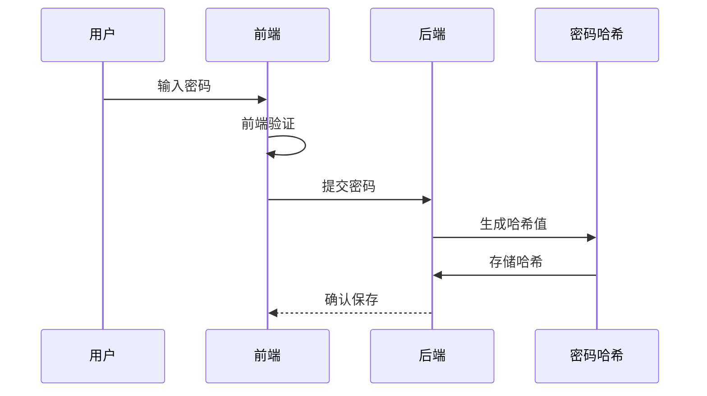
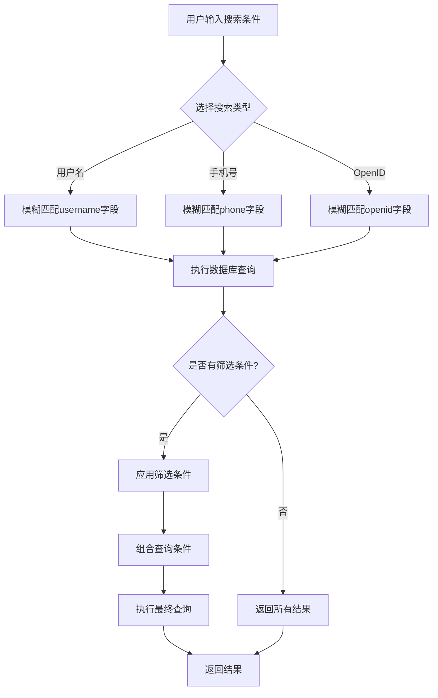
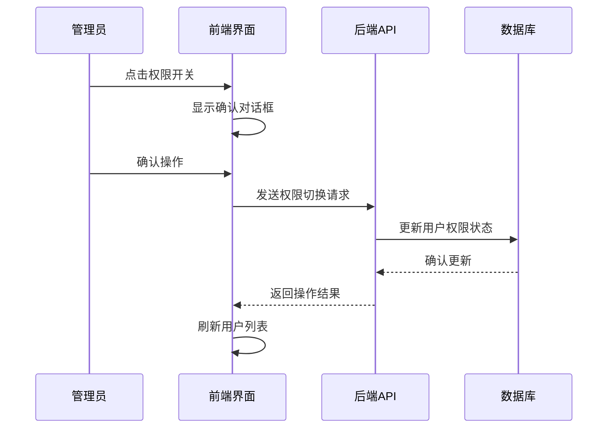

# 用户管理

<cite>
**本文档中引用的文件**
- [merchant/src/pages/Users/index.tsx](file://merchant/src/pages/Users/index.tsx)
- [backend/users/models.py](file://backend/users/models.py)
- [backend/users/views.py](file://backend/users/views.py)
- [backend/users/serializers.py](file://backend/users/serializers.py)
- [backend/users/services.py](file://backend/users/services.py)
- [backend/users/urls.py](file://backend/users/urls.py)
- [backend/common/permissions.py](file://backend/common/permissions.py)
- [merchant/src/services/api.ts](file://merchant/src/services/api.ts)
- [merchant/src/utils/auth.ts](file://merchant/src/utils/auth.ts)
- [merchant/src/utils/request.ts](file://merchant/src/utils/request.ts)
- [backend/orders/models.py](file://backend/orders/models.py)
</cite>

## 目录
1. [简介](#简介)
2. [系统架构](#系统架构)
3. [用户模型设计](#用户模型设计)
4. [前端用户管理界面](#前端用户管理界面)
5. [后端API接口](#后端api接口)
6. [权限控制系统](#权限控制系统)
7. [用户统计功能](#用户统计功能)
8. [安全机制](#安全机制)
9. [操作流程详解](#操作流程详解)
10. [最佳实践指南](#最佳实践指南)

## 简介

用户管理系统是商户后台的核心功能模块，负责管理平台上的所有用户账户。系统采用前后端分离架构，前端基于React和Ant Design Pro构建，后端使用Django REST Framework提供API服务。该系统支持多种用户认证方式，包括微信小程序登录和传统用户名密码登录，并具备完善的权限控制和数据统计功能。

## 系统架构

用户管理系统采用现代化的微服务架构，主要包含以下核心组件：

**图表来源**
- [merchant/src/pages/Users/index.tsx](file://merchant/src/pages/Users/index.tsx#L1-L292)
- [backend/users/views.py](file://backend/users/views.py#L1-L460)
- [backend/users/serializers.py](file://backend/users/serializers.py#L1-L92)

## 用户模型设计

系统采用灵活的用户模型设计，支持多种认证方式和用户类型：

**图表来源**
- [backend/users/models.py](file://backend/users/models.py#L31-L95)

### 核心字段说明

| 字段名 | 类型 | 描述 | 默认值 |
|--------|------|------|--------|
| id | BigAutoField | 主键ID | 自动生成 |
| openid | CharField(64) | 微信用户唯一标识 | null |
| username | CharField(150) | 用户名，唯一 | 自动生成 |
| phone | CharField(20) | 手机号码 | 空字符串 |
| email | EmailField | 电子邮箱 | 空字符串 |
| user_type | CharField(20) | 用户类型：wechat/admin | 'wechat' |
| is_staff | BooleanField | 是否为管理员 | False |
| is_superuser | BooleanField | 是否为超级管理员 | False |
| last_login_at | DateTimeField | 最后登录时间 | null |
| date_joined | DateTimeField | 注册时间 | 自动设置 |

**章节来源**
- [backend/users/models.py](file://backend/users/models.py#L31-L74)

## 前端用户管理界面

前端用户管理界面基于Ant Design Pro构建，提供了完整的用户管理功能：

### 表格列定义

系统定义了丰富的用户信息展示列：

**图表来源**
- [merchant/src/pages/Users/index.tsx](file://merchant/src/pages/Users/index.tsx#L13-L149)

### 关键功能特性

1. **多维度搜索**：支持用户名、手机号、OpenID的模糊搜索
2. **筛选功能**：按管理员权限、用户类型进行筛选
3. **实时统计**：显示用户的订单统计和收藏统计
4. **权限控制**：只有管理员可以查看和操作用户信息
5. **响应式设计**：支持移动端和桌面端访问

**章节来源**
- [merchant/src/pages/Users/index.tsx](file://merchant/src/pages/Users/index.tsx#L152-L227)

## 后端API接口

后端提供RESTful API接口，支持完整的CRUD操作和特殊功能：

### 核心API端点

| 方法 | 端点 | 描述 | 权限要求 |
|------|------|------|----------|
| GET | `/users/` | 获取用户列表 | 管理员 |
| POST | `/users/` | 创建新用户 | 管理员 |
| GET | `/users/{id}/` | 获取用户详情 | 管理员 |
| PATCH | `/users/{id}/` | 更新用户信息 | 管理员 |
| DELETE | `/users/{id}/` | 删除用户 | 管理员 |
| POST | `/users/{id}/set_admin/` | 设置管理员权限 | 管理员 |
| POST | `/users/{id}/unset_admin/` | 取消管理员权限 | 管理员 |

### 请求参数处理

系统实现了智能的查询参数处理机制：

**图表来源**
- [backend/users/views.py](file://backend/users/views.py#L387-L460)

**章节来源**
- [backend/users/views.py](file://backend/users/views.py#L387-L460)
- [backend/users/urls.py](file://backend/users/urls.py#L1-L18)

## 权限控制系统

系统采用多层次的权限控制机制，确保数据安全：

### 权限层级结构

**图表来源**
- [backend/common/permissions.py](file://backend/common/permissions.py#L101-L123)

### 权限验证流程

1. **身份验证**：通过JWT令牌验证用户身份
2. **权限检查**：验证用户是否具有管理员权限
3. **资源访问**：根据权限级别控制资源访问
4. **操作记录**：记录所有权限相关操作

**章节来源**
- [backend/common/permissions.py](file://backend/common/permissions.py#L101-L123)

## 用户统计功能

系统提供详细的用户统计功能，帮助管理员了解用户行为：

### 统计指标

| 指标名称 | 描述 | 计算方式 |
|----------|------|----------|
| 订单总数 | 用户创建的所有订单数量 | `user.orders.count()` |
| 已完成订单 | 用户已完成的订单数量 | `user.orders.filter(status='completed').count()` |
| 待支付订单 | 用户待支付的订单数量 | `user.orders.filter(status='pending').count()` |
| 总消费金额 | 用户在已完成订单中的总消费金额 | `Sum('total_amount')` |

### 缓存策略

为了提高性能，系统采用Redis缓存机制：

**图表来源**
- [backend/users/views.py](file://backend/users/views.py#L250-L285)

**章节来源**
- [backend/users/views.py](file://backend/users/views.py#L250-L285)
- [backend/users/serializers.py](file://backend/users/serializers.py#L14-L41)

## 安全机制

系统实施多重安全措施保护用户数据：

### 数据保护措施

1. **敏感信息脱敏**：OpenID等敏感信息在前端不直接显示
2. **传输加密**：所有API通信使用HTTPS协议
3. **权限隔离**：不同权限级别的用户只能访问相应数据
4. **操作审计**：记录所有用户管理操作

### 密码安全

**图表来源**
- [backend/users/services.py](file://backend/users/services.py#L42-L48)

**章节来源**
- [backend/users/services.py](file://backend/users/services.py#L42-L48)

## 操作流程详解

### 用户搜索和筛选流程

**图表来源**
- [merchant/src/pages/Users/index.tsx](file://merchant/src/pages/Users/index.tsx#L171-L215)

### 管理员权限切换流程

**图表来源**
- [merchant/src/pages/Users/index.tsx](file://merchant/src/pages/Users/index.tsx#L56-L73)

### 用户信息编辑流程

1. **表单验证**：前端对输入数据进行格式验证
2. **API调用**：发送编辑请求到后端
3. **后端验证**：检查权限和数据完整性
4. **数据更新**：更新数据库记录
5. **结果反馈**：向用户显示操作结果

**章节来源**
- [merchant/src/pages/Users/index.tsx](file://merchant/src/pages/Users/index.tsx#L229-L288)

## 最佳实践指南

### 开发者指南

1. **权限控制**：始终使用适当的权限装饰器
2. **数据验证**：在后端进行必要的数据验证
3. **错误处理**：提供清晰的错误信息和处理机制
4. **性能优化**：合理使用缓存减少数据库查询

### 运维指南

1. **监控告警**：监控用户管理相关的API调用
2. **日志记录**：记录所有用户管理操作
3. **备份策略**：定期备份用户数据
4. **安全审计**：定期审查权限分配情况

### 用户体验指南

1. **响应速度**：优化查询性能，确保快速响应
2. **界面友好**：提供清晰的操作提示和反馈
3. **数据准确**：确保统计信息的准确性
4. **操作安全**：重要操作提供二次确认

### 安全最佳实践

1. **最小权限原则**：只授予必要的最小权限
2. **数据加密**：敏感数据在传输和存储时加密
3. **访问控制**：严格控制对用户数据的访问
4. **定期审计**：定期审查和更新安全策略

通过以上详细的功能介绍和最佳实践指南，开发者可以更好地理解和使用用户管理系统，同时确保系统的安全性、稳定性和可维护性。