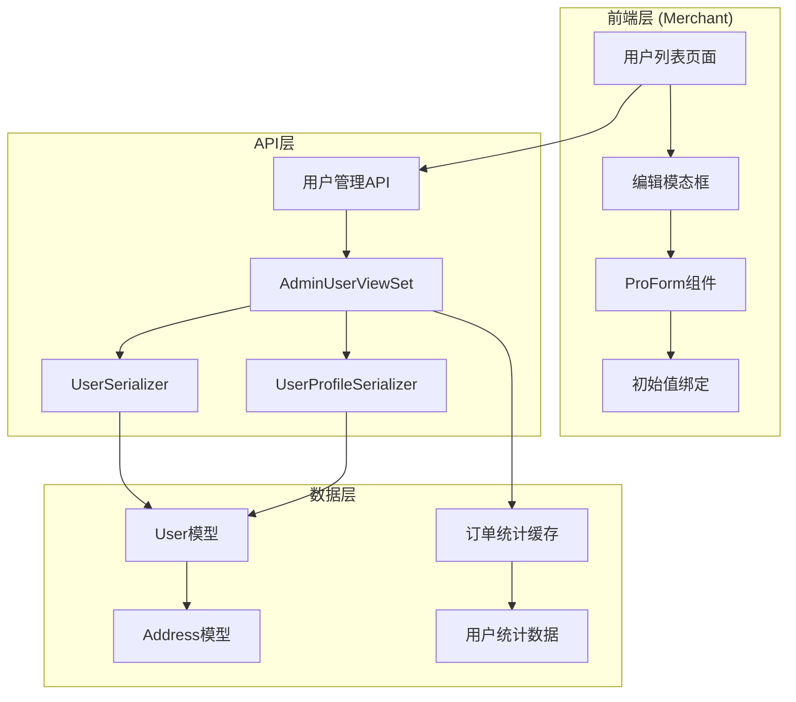
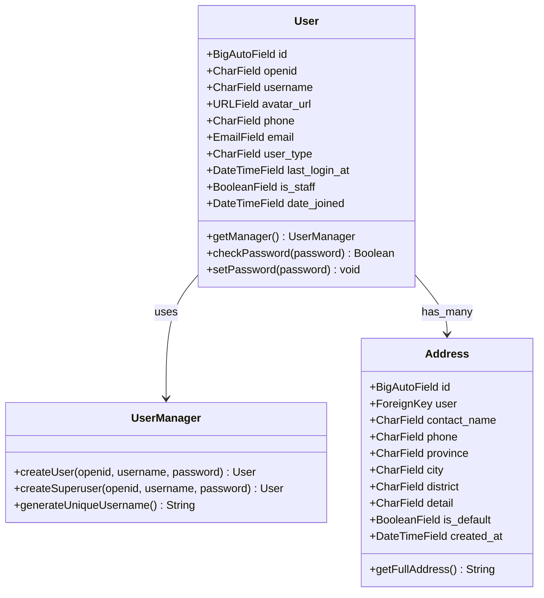
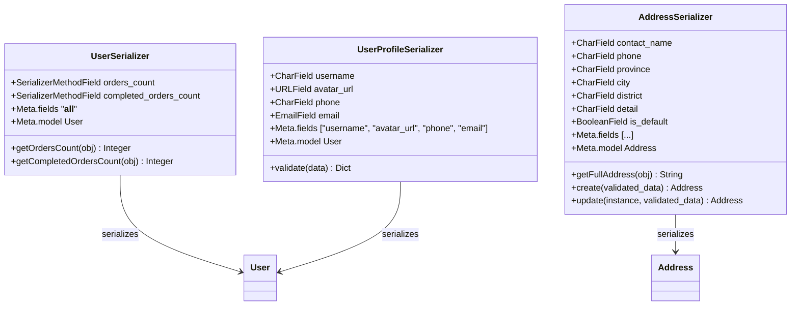
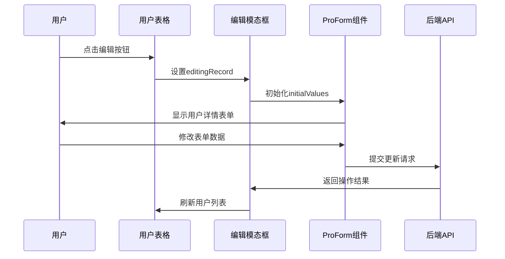
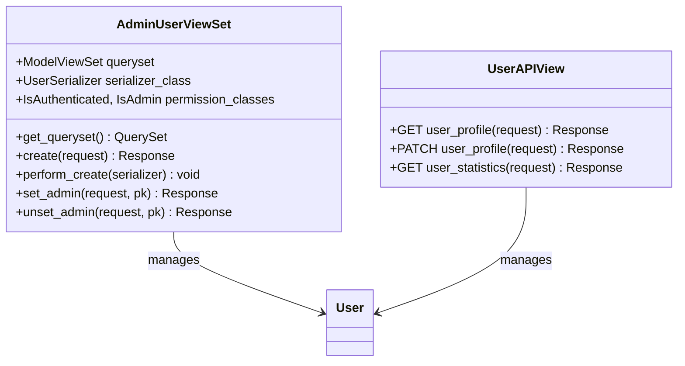
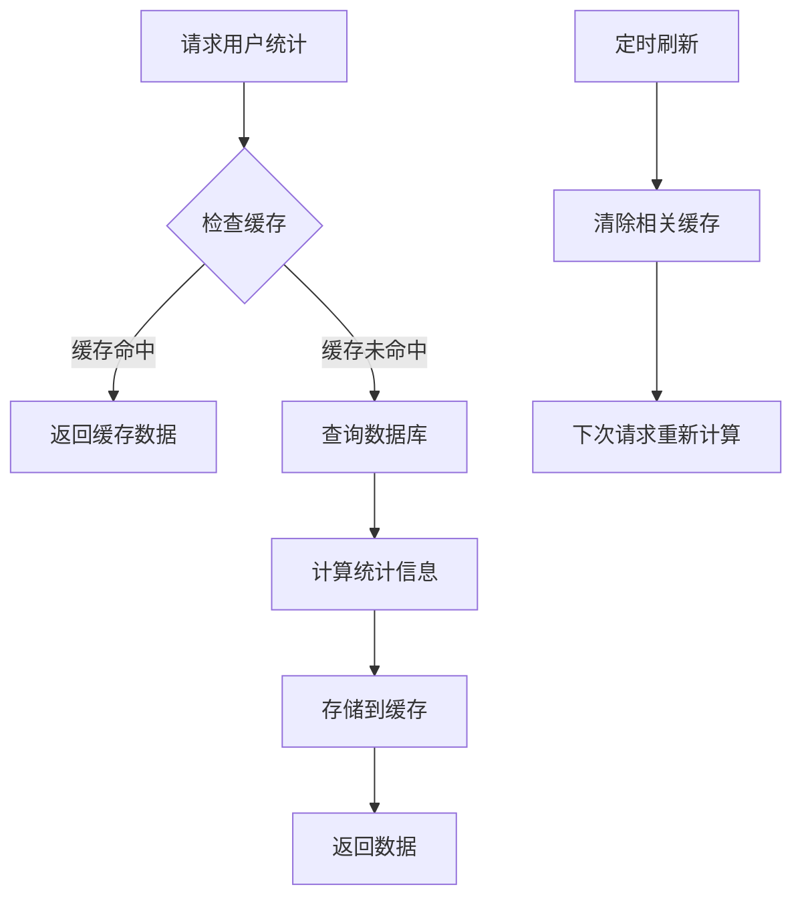
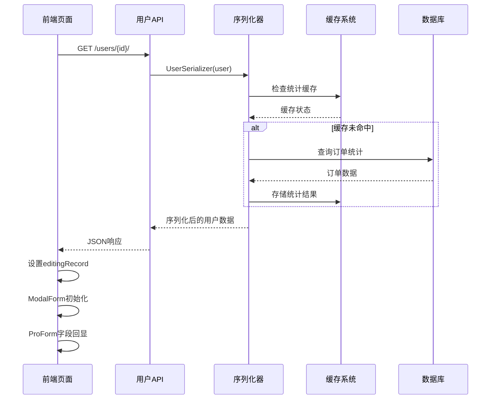
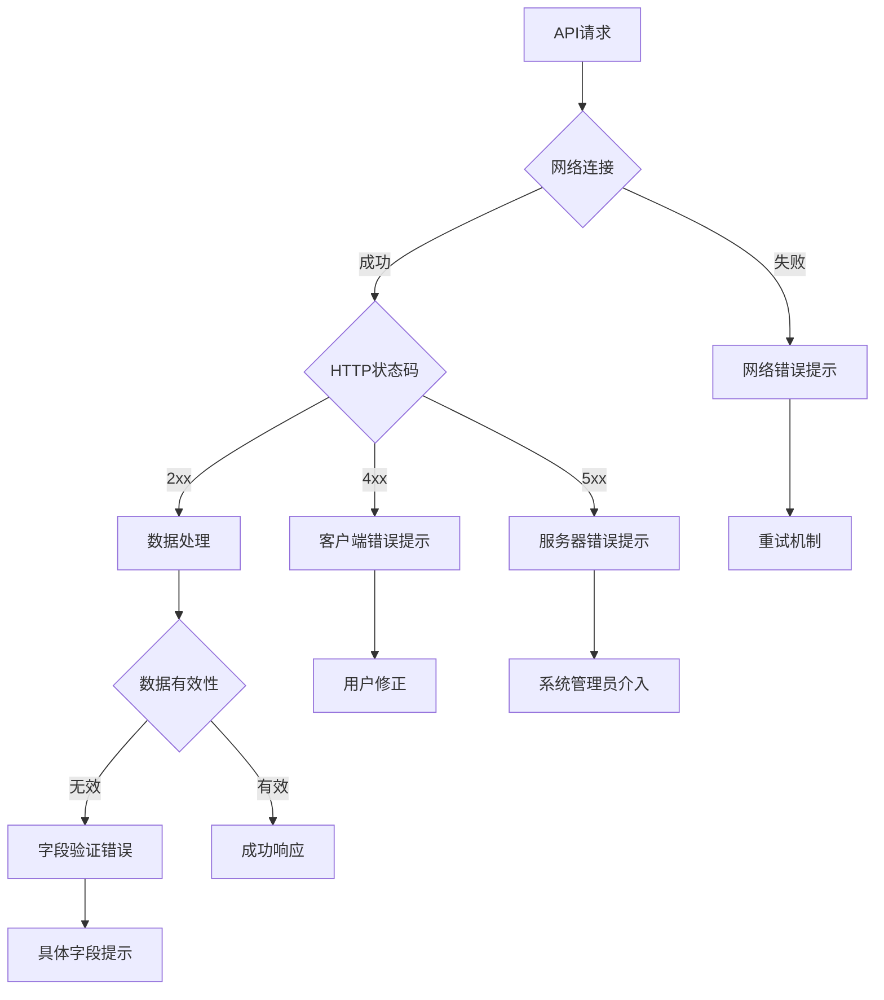
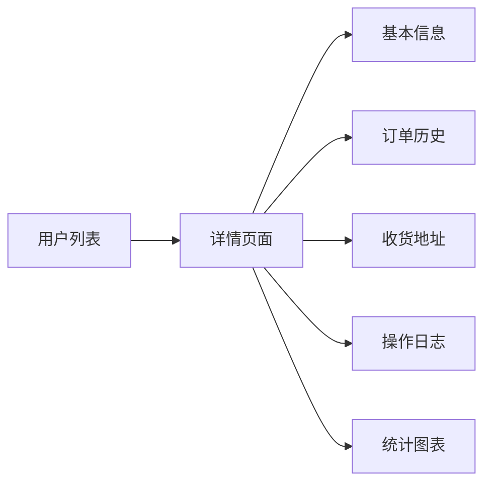

# 用户详情功能文档

<cite>
**本文档中引用的文件**
- [Users/index.tsx](file://merchant/src/pages/Users/index.tsx)
- [users/models.py](file://backend/users/models.py)
- [users/serializers.py](file://backend/users/serializers.py)
- [users/views.py](file://backend/users/views.py)
- [common/serializers.py](file://backend/common/serializers.py)
- [common/address_parser.py](file://backend/common/address_parser.py)
- [api.ts](file://merchant/src/services/api.ts)
</cite>

## 目录
1. [简介](#简介)
2. [项目架构概览](#项目架构概览)
3. [核心数据模型](#核心数据模型)
4. [序列化器设计](#序列化器设计)
5. [前端实现机制](#前端实现机制)
6. [后端API设计](#后端api设计)
7. [用户详情展示流程](#用户详情展示流程)
8. [扩展建议](#扩展建议)
9. [总结](#总结)

## 简介

本文档详细描述了电动商城商户后台系统中用户详情功能的实现方式。该功能通过编辑模态框间接展示用户详细信息，利用ProForm组件进行字段回显，并通过后端序列化器处理数据传输。系统采用前后端分离架构，通过RESTful API实现数据交互。

## 项目架构概览

系统采用现代化的前后端分离架构，前端基于React技术栈，后端使用Django REST Framework构建API服务。



**图表来源**
- [Users/index.tsx](file://merchant/src/pages/Users/index.tsx#L1-L292)
- [users/views.py](file://backend/users/views.py#L387-L460)
- [users/serializers.py](file://backend/users/serializers.py#L1-L92)

## 核心数据模型

### User模型结构

系统定义了两个核心模型来管理用户信息：



**图表来源**
- [users/models.py](file://backend/users/models.py#L31-L95)

### 数据模型特性

| 字段名称 | 类型 | 描述 | 约束 |
|---------|------|------|------|
| id | BigAutoField | 主键标识符 | 自增 |
| openid | CharField(64) | 微信小程序唯一标识 | 唯一，可空 |
| username | CharField(150) | 用户名 | 唯一，可空，默认生成 |
| avatar_url | URLField(200) | 头像链接 | 可空，默认Gravatar |
| phone | CharField(20) | 手机号码 | 可空 |
| email | EmailField | 电子邮箱 | 可空 |
| user_type | CharField(20) | 用户类型 | 枚举：wechat/admin |
| last_login_at | DateTimeField | 最后登录时间 | 可空 |
| is_staff | BooleanField | 管理员权限 | 默认False |

**节点来源**
- [users/models.py](file://backend/users/models.py#L31-L74)

## 序列化器设计

### UserSerializer - 用户详情序列化器

UserSerializer负责序列化用户数据，包含统计信息计算：



**图表来源**
- [users/serializers.py](file://backend/users/serializers.py#L6-L92)

### 序列化器功能特性

| 序列化器 | 主要用途 | 关键特性 |
|---------|----------|----------|
| UserSerializer | 用户列表和详情 | 统计字段缓存、订单数量计算 |
| UserProfileSerializer | 个人资料接口 | 精简字段、安全性验证 |
| AddressSerializer | 收货地址管理 | 默认地址逻辑、地址解析 |

**节点来源**
- [users/serializers.py](file://backend/users/serializers.py#L6-L92)

## 前端实现机制

### 编辑模态框架构

前端通过ProComponents库实现用户详情的编辑功能：



**图表来源**
- [Users/index.tsx](file://merchant/src/pages/Users/index.tsx#L118-L121)
- [Users/index.tsx](file://merchant/src/pages/Users/index.tsx#L229-L288)

### 初始值绑定机制

系统通过`initialValues`属性实现表单字段的自动填充：

```mermaid
flowchart TD
A[用户点击编辑] --> B[设置editingRecord]
B --> C[传递给ModalForm]
C --> D[initialValues绑定]
D --> E[ProForm字段回显]
E --> F[用户查看详情]
G[新增用户] --> H[editingRecord=null]
H --> I[initialValues={}]
I --> J[显示空白表单]
```

**图表来源**
- [Users/index.tsx](file://merchant/src/pages/Users/index.tsx#L118-L121)
- [Users/index.tsx](file://merchant/src/pages/Users/index.tsx#L249)

### 表格列配置

用户列表页面定义了详细的列配置：

| 列名称 | 数据字段 | 特性 | 格式化 |
|-------|----------|------|--------|
| 用户名 | username | 可省略 | ellipsis |
| OpenID | openid | 不可搜索 | ellipsis, copyable |
| 邮箱 | email | 不可搜索 | - |
| 手机号 | phone | 可搜索 | - |
| 用户类型 | user_type | 标签显示 | color-coded |
| 管理员 | is_staff | 开关控制 | boolean switch |
| 订单数 | orders_count | 统计字段 | 数字 |
| 收藏数 | favorites_count | 统计字段 | 数字 |
| 已完成订单 | completed_orders_count | 统计字段 | 数字 |
| 注册时间 | date_joined | 时间显示 | dateTime |
| 最后登录 | last_login_at | 时间显示 | dateTime |

**节点来源**
- [Users/index.tsx](file://merchant/src/pages/Users/index.tsx#L13-L106)

## 后端API设计

### AdminUserViewSet - 管理员用户视图集

后端提供完整的CRUD操作和管理员权限管理：



**图表来源**
- [users/views.py](file://backend/users/views.py#L387-L460)

### API端点设计

| HTTP方法 | 端点 | 功能 | 权限要求 |
|---------|------|------|----------|
| GET | /users/ | 获取用户列表 | IsAuthenticated, IsAdmin |
| GET | /users/{id}/ | 获取单个用户 | IsAuthenticated, IsAdmin |
| POST | /users/ | 创建新用户 | IsAuthenticated, IsAdmin |
| PATCH | /users/{id}/ | 更新用户信息 | IsAuthenticated, IsAdmin |
| DELETE | /users/{id}/ | 删除用户 | IsAuthenticated, IsAdmin |
| POST | /users/{id}/set_admin/ | 设置管理员 | IsAuthenticated, IsAdmin |
| POST | /users/{id}/unset_admin/ | 取消管理员 | IsAuthenticated, IsAdmin |
| GET | /user/profile/ | 获取个人资料 | IsAuthenticated |
| PATCH | /user/profile/ | 更新个人资料 | IsAuthenticated |
| GET | /user/statistics/ | 获取用户统计 | IsAuthenticated |

**节点来源**
- [users/views.py](file://backend/users/views.py#L387-L460)
- [api.ts](file://merchant/src/services/api.ts#L8-L14)

### 缓存策略

UserSerializer实现了智能缓存机制来优化性能：



**图表来源**
- [users/serializers.py](file://backend/users/serializers.py#L21-L41)

## 用户详情展示流程

### 完整的数据流



**图表来源**
- [Users/index.tsx](file://merchant/src/pages/Users/index.tsx#L118-L121)
- [users/views.py](file://backend/users/views.py#L387-L460)
- [users/serializers.py](file://backend/users/serializers.py#L6-L41)

### 错误处理机制

系统实现了多层次的错误处理：



**节点来源**
- [Users/index.tsx](file://merchant/src/pages/Users/index.tsx#L233-L247)

## 扩展建议

### 独立详情页面

基于现有架构，可以扩展实现独立的用户详情页面：



### 功能扩展方向

| 扩展功能 | 实现方案 | 技术要点 |
|---------|----------|----------|
| 用户统计面板 | 新增统计API | 数据聚合、图表可视化 |
| 操作日志记录 | 日志模型 + 追踪 | 审计日志、权限控制 |
| 用户行为分析 | 分析服务 | 用户画像、行为模式 |
| 批量操作 | 批量API | 异步处理、进度反馈 |
| 导出功能 | Excel/CSV导出 | 文件生成、大文件处理 |

### 性能优化建议

1. **缓存策略优化**
   - 实现多级缓存架构
   - 设置合理的缓存过期时间
   - 使用缓存预热机制

2. **数据库优化**
   - 添加适当的索引
   - 实现数据库连接池
   - 使用查询优化工具

3. **前端性能**
   - 实现虚拟滚动
   - 使用懒加载技术
   - 优化图片资源

## 总结

电动商城商户后台的用户详情功能通过精心设计的前后端架构实现了高效的数据管理和用户体验。系统采用以下核心设计理念：

1. **模块化设计**：清晰分离前端界面、API服务和数据模型
2. **缓存优化**：智能缓存机制显著提升响应速度
3. **安全考虑**：完善的权限控制和数据验证
4. **扩展性**：良好的架构设计支持功能扩展

该实现为商户提供了强大的用户管理能力，同时为未来的功能扩展奠定了坚实基础。通过持续的优化和改进，系统能够更好地满足业务需求和技术发展要求。