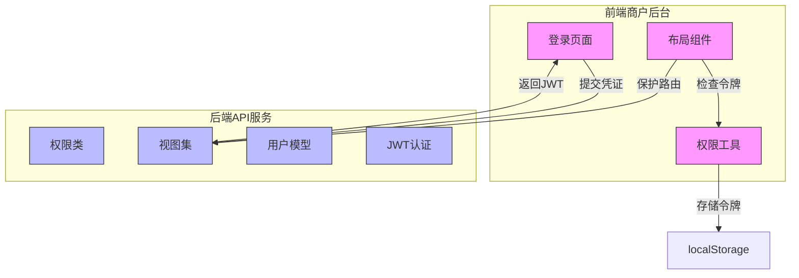
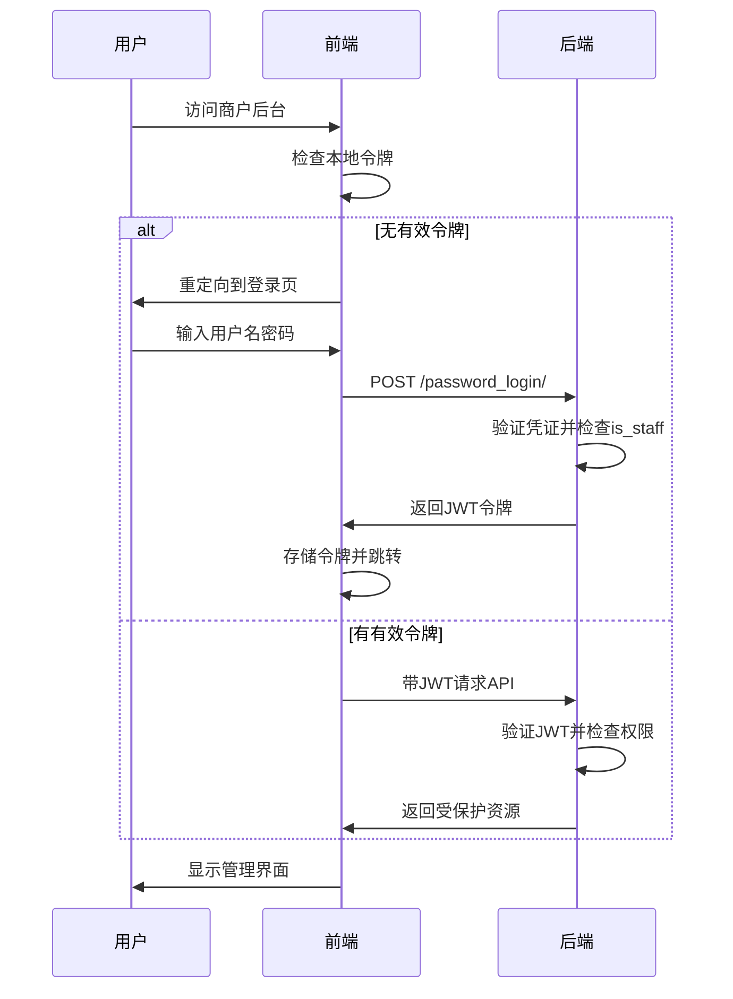
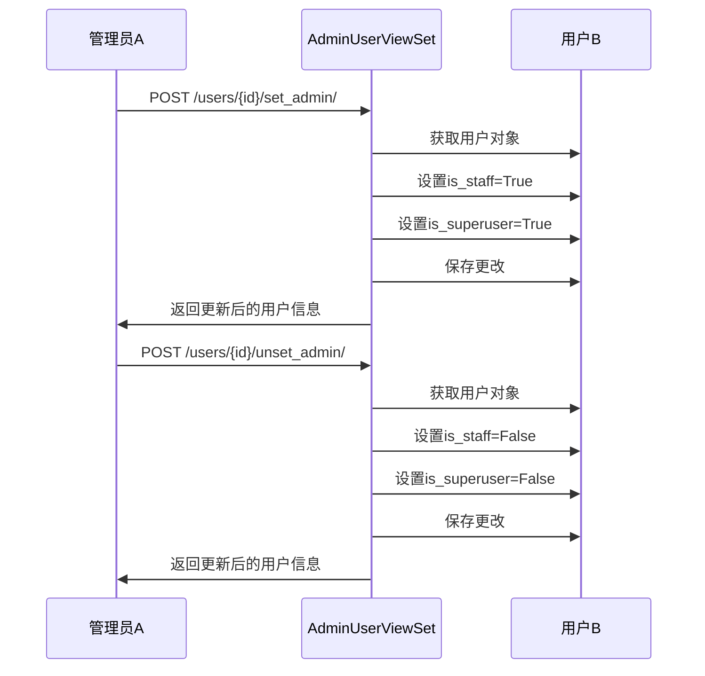
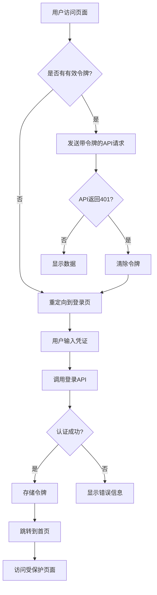
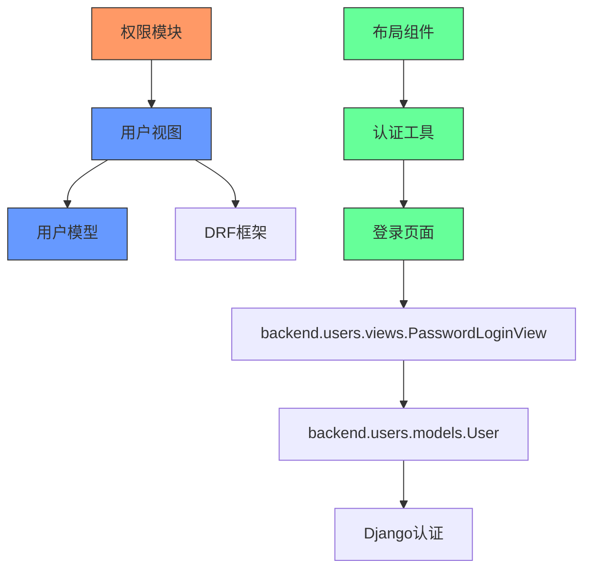

# 权限管理

<cite>
**本文档引用的文件**
- [permissions.py](file://backend/common/permissions.py)
- [views.py](file://backend/users/views.py)
- [models.py](file://backend/users/models.py)
- [env_config.py](file://backend/backend/settings/env_config.py)
- [urls.py](file://backend/users/urls.py)
- [auth.ts](file://merchant/src/utils/auth.ts)
- [Login/index.tsx](file://merchant/src/pages/Login/index.tsx)
- [Layout/index.tsx](file://merchant/src/components/Layout/index.tsx)
</cite>

## 目录
1. [简介](#简介)
2. [项目结构](#项目结构)
3. [核心组件](#核心组件)
4. [架构概述](#架构概述)
5. [详细组件分析](#详细组件分析)
6. [依赖分析](#依赖分析)
7. [性能考虑](#性能考虑)
8. [故障排除指南](#故障排除指南)
9. [结论](#结论)

## 简介
本文档深入解析商户后台权限管理系统，重点阐述基于角色的访问控制（RBAC）机制。文档详细说明了后端自定义权限类如`IsAdmin`和`IsOwnerOrAdmin`的实现原理，结合Django REST Framework的`permission_classes`机制保护API端点。同时，文档解释了管理员用户模型中`is_staff`和`is_superuser`字段的作用及其在权限判断中的应用，并描述前端如何通过工具函数检查登录状态并实现页面级权限控制。

## 项目结构
商户后台权限管理系统由后端Django应用和前端React应用组成，通过JWT令牌进行身份验证和权限控制。后端定义了多种自定义权限类来保护API端点，而前端通过路由守卫和状态管理实现页面级访问控制。



**图源**
- [auth.ts](file://merchant/src/utils/auth.ts)
- [Login/index.tsx](file://merchant/src/pages/Login/index.tsx)
- [permissions.py](file://backend/common/permissions.py)
- [views.py](file://backend/users/views.py)

**本节来源**
- [permissions.py](file://backend/common/permissions.py)
- [views.py](file://backend/users/views.py)
- [auth.ts](file://merchant/src/utils/auth.ts)

## 核心组件
权限管理系统的核心组件包括后端的自定义权限类、用户模型和视图集，以及前端的认证工具和路由守卫。后端通过Django REST Framework的权限系统实现细粒度的API访问控制，而前端通过React Router和本地存储实现页面级权限管理。

**本节来源**
- [permissions.py](file://backend/common/permissions.py)
- [models.py](file://backend/users/models.py)
- [auth.ts](file://merchant/src/utils/auth.ts)

## 架构概述
商户后台权限管理采用前后端分离架构，基于JWT（JSON Web Token）进行身份验证和权限传递。系统实现了基于角色的访问控制（RBAC），通过`is_staff`和`is_superuser`字段区分不同级别的管理员权限。



**图源**
- [views.py](file://backend/users/views.py)
- [auth.ts](file://merchant/src/utils/auth.ts)
- [Login/index.tsx](file://merchant/src/pages/Login/index.tsx)

## 详细组件分析

### 后端权限类分析
后端实现了多个自定义权限类，用于不同的访问控制场景。这些权限类继承自Django REST Framework的`BasePermission`，通过重写`has_permission`和`has_object_permission`方法实现细粒度的权限控制。

#### 权限类实现
```mermaid
classDiagram
class BasePermission {
<<abstract>>
+has_permission(request, view) bool
+has_object_permission(request, view, obj) bool
}
class IsAdmin {
+has_permission(request, view) bool
}
class IsOwnerOrAdmin {
+has_permission(request, view) bool
+has_object_permission(request, view, obj) bool
}
class IsAdminOrReadOnly {
+has_permission(request, view) bool
}
class EnvironmentAwarePermission {
+has_permission(request, view) bool
}
class IsAuthenticatedOrReadOnly {
+has_permission(request, view) bool
}
BasePermission <|-- IsAdmin
BasePermission <|-- IsOwnerOrAdmin
BasePermission <|-- IsAdminOrReadOnly
BasePermission <|-- EnvironmentAwarePermission
BasePermission <|-- IsAuthenticatedOrReadOnly
note right of IsAdmin
仅允许is_staff=True的用户访问
end note
note right of IsOwnerOrAdmin
允许管理员访问所有对象，
普通用户只能访问自己拥有的对象
end note
note right of IsAdminOrReadOnly
读取操作对所有人开放，
写入操作仅限管理员
end note
```

**图源**
- [permissions.py](file://backend/common/permissions.py)

**本节来源**
- [permissions.py](file://backend/common/permissions.py)

### 用户模型分析
用户模型扩展了Django的`AbstractUser`，添加了微信小程序认证所需字段，并通过`is_staff`和`is_superuser`字段实现权限分级。

```mermaid
classDiagram
class User {
+id : BigAutoField
+openid : CharField
+username : CharField
+avatar_url : URLField
+phone : CharField
+email : EmailField
+user_type : CharField
+last_login_at : DateTimeField
+is_staff : BooleanField
+is_superuser : BooleanField
+objects : UserManager
+__str__() str
}
class Address {
+id : BigAutoField
+user : ForeignKey
+contact_name : CharField
+phone : CharField
+province : CharField
+city : CharField
+district : CharField
+detail : CharField
+is_default : BooleanField
+created_at : DateTimeField
}
User "1" *-- "0..*" Address : 拥有
note right of User
is_staff : 是否为管理员\n
is_superuser : 是否为超级管理员\n
user_type : 用户类型(微信用户/管理员)
end note
```

**图源**
- [models.py](file://backend/users/models.py)

**本节来源**
- [models.py](file://backend/users/models.py)

### 管理员用户管理分析
`AdminUserViewSet`提供了管理员用户的CRUD操作和权限管理功能，包括`set_admin`和`unset_admin`两个自定义操作，用于动态分配和撤销管理员权限。



**图源**
- [views.py](file://backend/users/views.py#L387-L459)

**本节来源**
- [views.py](file://backend/users/views.py)

### 前端权限控制分析
前端通过`auth.ts`工具函数管理JWT令牌，并在布局组件中实现路由守卫，确保只有经过身份验证的用户才能访问管理界面。

#### 前端认证流程


**图源**
- [auth.ts](file://merchant/src/utils/auth.ts)
- [Login/index.tsx](file://merchant/src/pages/Login/index.tsx)
- [Layout/index.tsx](file://merchant/src/components/Layout/index.tsx)

**本节来源**
- [auth.ts](file://merchant/src/utils/auth.ts)
- [Login/index.tsx](file://merchant/src/pages/Login/index.tsx)

## 依赖分析
权限管理系统涉及多个组件之间的依赖关系，包括后端权限类与视图集的依赖，以及前端认证工具与页面组件的依赖。



**图源**
- [permissions.py](file://backend/common/permissions.py)
- [views.py](file://backend/users/views.py)
- [models.py](file://backend/users/models.py)
- [auth.ts](file://merchant/src/utils/auth.ts)

**本节来源**
- [permissions.py](file://backend/common/permissions.py)
- [views.py](file://backend/users/views.py)
- [models.py](file://backend/users/models.py)
- [auth.ts](file://merchant/src/utils/auth.ts)

## 性能考虑
权限管理系统在设计时考虑了性能优化，包括JWT令牌的使用减少了数据库查询，以及在生产环境中严格的权限检查确保了系统的安全性。

## 故障排除指南
当遇到权限相关问题时，可以按照以下步骤进行排查：

1. **检查JWT令牌是否有效**：确认前端是否正确存储了令牌，以及令牌是否已过期。
2. **验证用户权限设置**：检查数据库中用户的`is_staff`和`is_superuser`字段是否正确设置。
3. **审查权限类配置**：确认视图集中的`permission_classes`配置是否正确。
4. **查看API响应状态码**：401表示未认证，403表示权限不足。

**本节来源**
- [views.py](file://backend/users/views.py)
- [auth.ts](file://merchant/src/utils/auth.ts)

## 结论
商户后台权限管理系统通过前后端协同工作，实现了安全可靠的访问控制。后端利用Django REST Framework的权限系统提供细粒度的API保护，而前端通过路由守卫确保页面级的安全访问。系统采用基于角色的访问控制（RBAC）模型，通过`is_staff`和`is_superuser`字段区分不同级别的管理员权限，为商户后台提供了灵活而安全的权限管理解决方案。