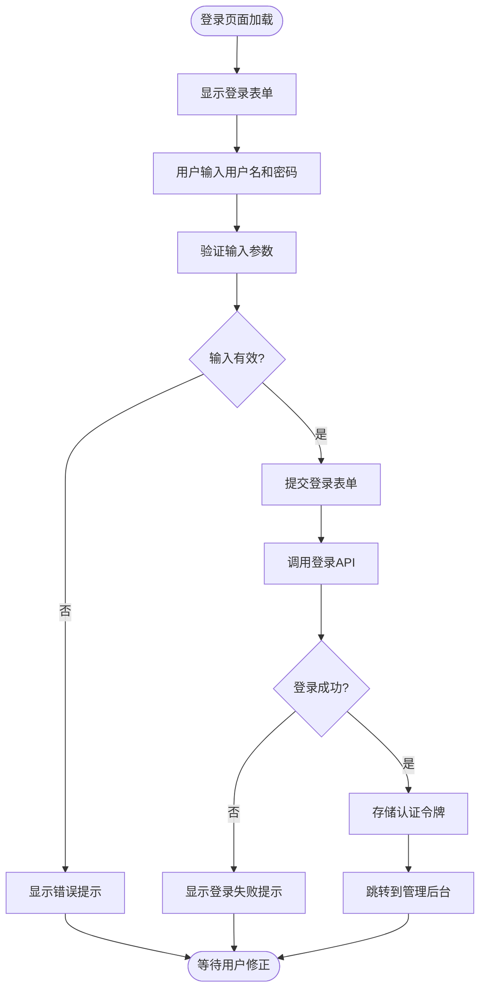
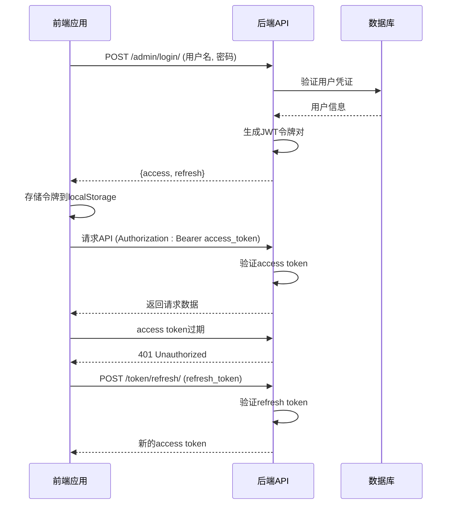
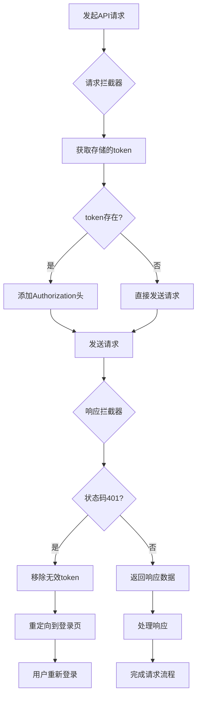
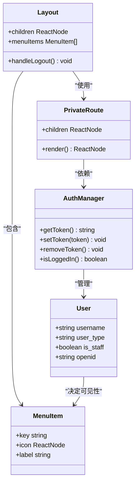
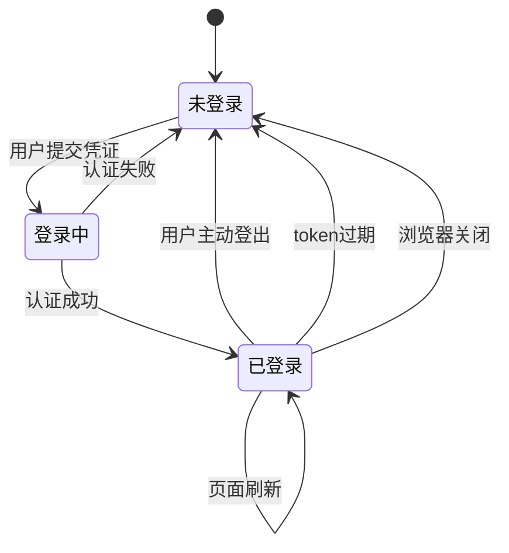
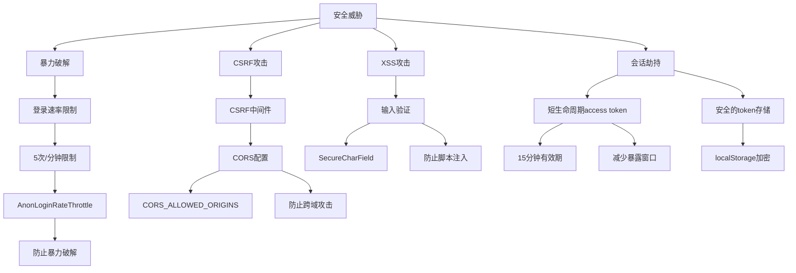

# 登录与权限

<cite>
**本文档引用文件**   
- [Login/index.tsx](file://merchant/src/pages/Login/index.tsx)
- [auth.ts](file://merchant/src/utils/auth.ts)
- [request.ts](file://merchant/src/utils/request.ts)
- [App.tsx](file://merchant/src/App.tsx)
- [Layout/index.tsx](file://merchant/src/components/Layout/index.tsx)
- [api.ts](file://merchant/src/services/api.ts)
- [users/models.py](file://backend/users/models.py)
- [users/views.py](file://backend/users/views.py)
- [common/throttles.py](file://backend/common/throttles.py)
- [base.py](file://backend/backend/settings/base.py)
- [api.md](file://api.md)
</cite>

## 目录
1. [介绍](#介绍)
2. [登录页面设计与实现](#登录页面设计与实现)
3. [JWT令牌管理机制](#jwt令牌管理机制)
4. [前端认证拦截器实现](#前端认证拦截器实现)
5. [权限控制与菜单管理](#权限控制与菜单管理)
6. [登录状态持久化与自动登出](#登录状态持久化与自动登出)
7. [安全最佳实践](#安全最佳实践)
8. [开发者指南](#开发者指南)
9. [操作指南](#操作指南)

## 介绍
本文档系统性地介绍了商户后台的认证授权机制，涵盖登录页面设计、JWT令牌管理、前端拦截器实现、权限控制策略等核心内容。文档为初学者提供安全登录的操作指南，同时为开发者提供认证安全最佳实践。

## 登录页面设计与实现

商户后台登录页面采用简洁直观的设计，包含用户名密码输入、登录按钮状态管理和错误提示展示等核心功能。页面使用Ant Design组件库构建，确保用户体验的一致性和专业性。

**图示来源**
- [Login/index.tsx](file://merchant/src/pages/Login/index.tsx#L1-L42)

**本节来源**
- [Login/index.tsx](file://merchant/src/pages/Login/index.tsx#L1-L42)

## JWT令牌管理机制

系统采用JWT（JSON Web Token）作为主要的认证机制，通过access token和refresh token的组合实现安全的会话管理。access token有效期为15分钟，refresh token有效期为7天，既保证了安全性又提升了用户体验。

**图示来源**
- [users/views.py](file://backend/users/views.py#L160-L190)
- [base.py](file://backend/backend/settings/base.py#L143-L146)

**本节来源**
- [api.md](file://api.md#L621-L636)
- [base.py](file://backend/backend/settings/base.py#L143-L146)

## 前端认证拦截器实现

前端通过Axios拦截器自动附加认证头，实现无缝的认证流程。请求拦截器在每个API请求中自动添加JWT令牌，响应拦截器处理401未授权状态并自动刷新令牌或重定向到登录页面。

**图示来源**
- [request.ts](file://merchant/src/utils/request.ts#L1-L37)

**本节来源**
- [request.ts](file://merchant/src/utils/request.ts#L1-L37)

## 权限控制与菜单管理

系统实现基于角色的访问控制（RBAC）和动态菜单加载机制。管理员用户拥有完整的管理权限，系统通过用户角色动态渲染菜单项，确保用户只能访问其权限范围内的功能模块。

**图示来源**
- [App.tsx](file://merchant/src/App.tsx#L1-L44)
- [Layout/index.tsx](file://merchant/src/components/Layout/index.tsx#L1-L59)
- [users/models.py](file://backend/users/models.py#L31-L75)

**本节来源**
- [App.tsx](file://merchant/src/App.tsx#L1-L44)
- [Layout/index.tsx](file://merchant/src/components/Layout/index.tsx#L1-L59)
- [users/models.py](file://backend/users/models.py#L54-L63)

## 登录状态持久化与自动登出

系统通过localStorage实现登录状态的持久化存储，确保用户刷新页面后仍保持登录状态。同时提供明确的退出登录机制，清除本地存储的认证信息并重定向到登录页面。

**图示来源**
- [auth.ts](file://merchant/src/utils/auth.ts#L1-L13)
- [Layout/index.tsx](file://merchant/src/components/Layout/index.tsx#L30-L33)

**本节来源**
- [auth.ts](file://merchant/src/utils/auth.ts#L1-L13)
- [Layout/index.tsx](file://merchant/src/components/Layout/index.tsx#L30-L33)

## 安全最佳实践

系统实施多项安全措施防止常见攻击，包括登录速率限制、密码哈希存储、CORS配置等。这些措施共同构建了坚固的安全防线，保护系统免受暴力破解和其他安全威胁。

**图示来源**
- [common/throttles.py](file://backend/common/throttles.py#L11-L30)
- [base.py](file://backend/backend/settings/base.py#L148-L160)

**本节来源**
- [common/throttles.py](file://backend/common/throttles.py#L11-L30)
- [api.md](file://api.md#L1201-L1210)

## 开发者指南

### 登录表单验证逻辑
登录表单采用声明式验证方式，通过Ant Design Form组件的rules属性定义验证规则。系统要求用户名和密码字段均为必填项，前端在提交前进行基本验证，后端进行严格的凭证验证。

**本节来源**
- [Login/index.tsx](file://merchant/src/pages/Login/index.tsx#L26-L30)

### 权限指令实现方式
权限控制通过高阶组件PrivateRoute实现，该组件检查用户的认证状态，未认证用户将被重定向到登录页面。菜单项的可见性由用户角色决定，通过条件渲染实现动态菜单加载。

**本节来源**
- [App.tsx](file://merchant/src/App.tsx#L12-L14)
- [Layout/index.tsx](file://merchant/src/components/Layout/index.tsx#L18-L24)

## 操作指南

### 初学者安全登录步骤
1. 访问商户管理后台登录页面
2. 输入管理员用户名和密码
3. 点击"登录"按钮提交表单
4. 系统验证成功后自动跳转到管理后台
5. 通过右上角"退出登录"按钮安全登出

### 认证安全注意事项
- 不要在公共计算机上保存登录凭证
- 定期更换密码以增强账户安全
- 发现异常登录活动时立即修改密码
- 不要与他人共享管理员账户
- 使用强密码组合（大小写字母、数字、特殊字符）