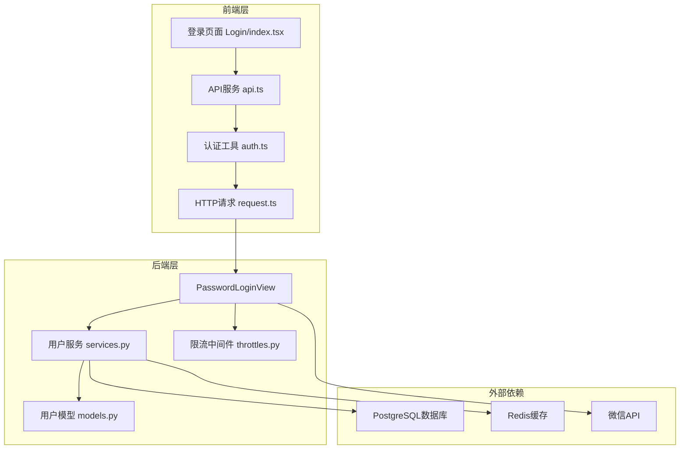
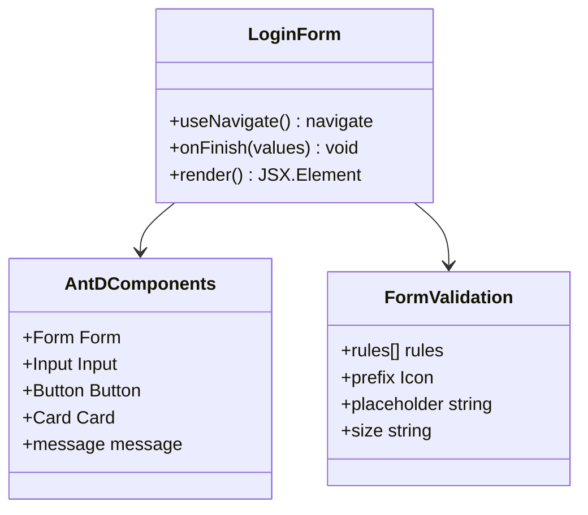
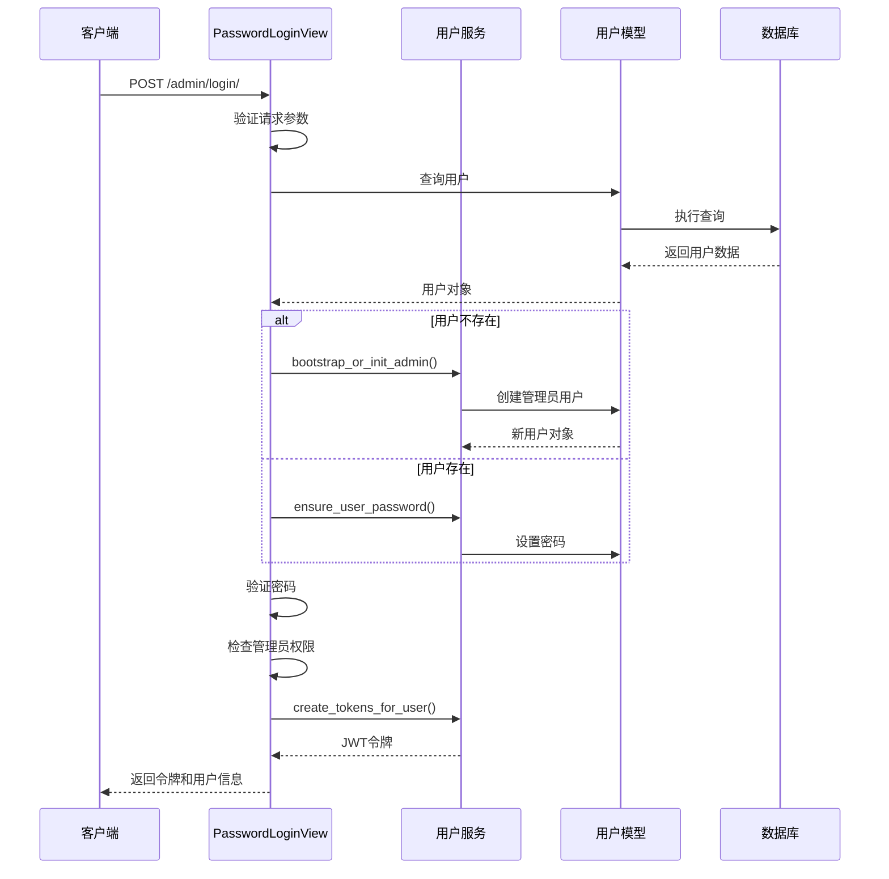
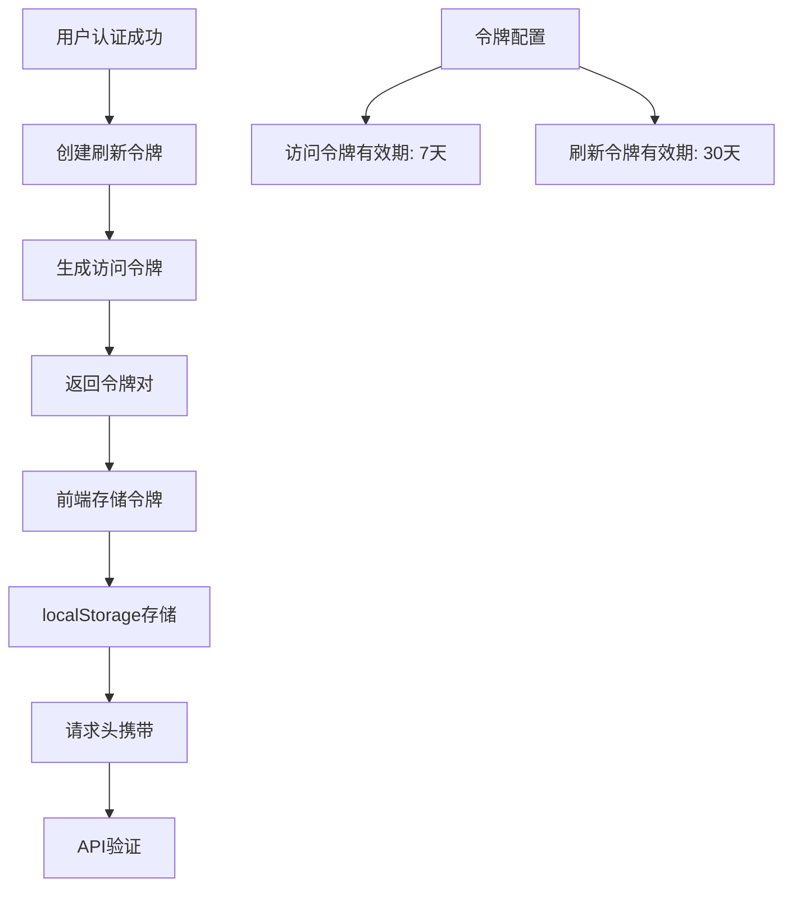
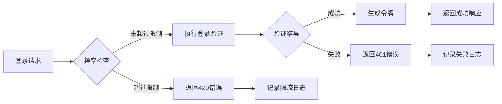
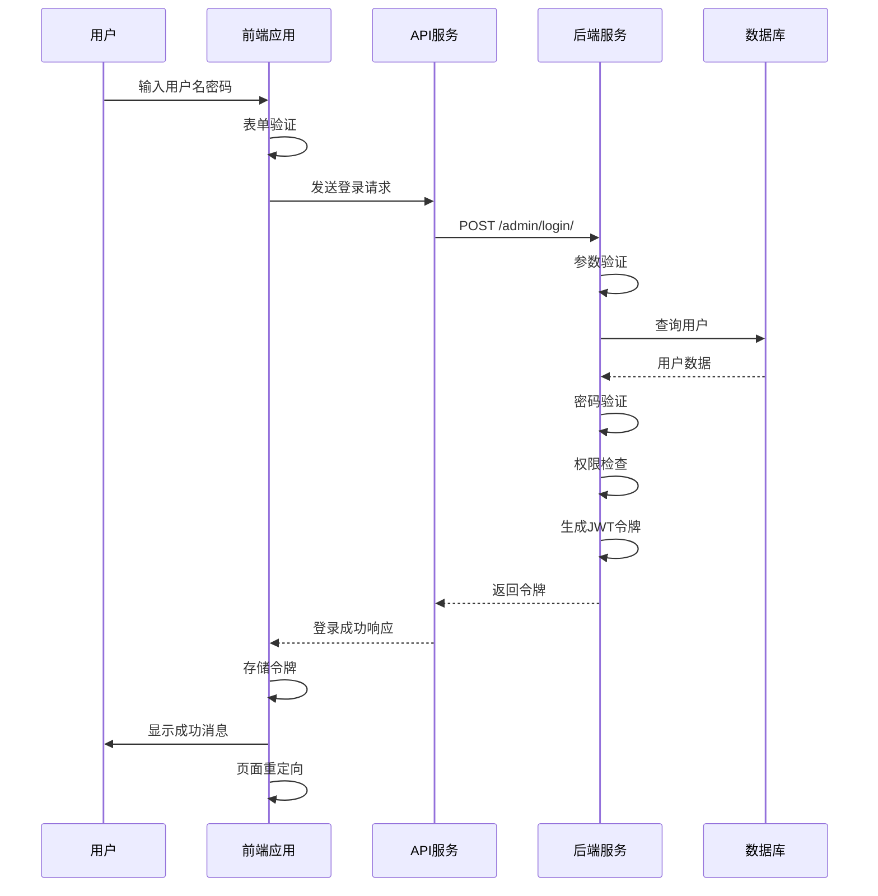

# 登录认证

<cite>
**本文档中引用的文件**
- [Login/index.tsx](file://merchant/src/pages/Login/index.tsx)
- [auth.ts](file://merchant/src/utils/auth.ts)
- [api.ts](file://merchant/src/services/api.ts)
- [views.py](file://backend/users/views.py)
- [urls.py](file://backend/users/urls.py)
- [services.py](file://backend/users/services.py)
- [models.py](file://backend/users/models.py)
- [throttles.py](file://backend/common/throttles.py)
- [request.ts](file://merchant/src/utils/request.ts)
- [base.py](file://backend/backend/settings/base.py)
</cite>

## 目录
1. [简介](#简介)
2. [系统架构概览](#系统架构概览)
3. [前端登录页面实现](#前端登录页面实现)
4. [后端API处理逻辑](#后端api处理逻辑)
5. [JWT令牌机制](#jwt令牌机制)
6. [安全防护措施](#安全防护措施)
7. [完整数据流分析](#完整数据流分析)
8. [操作流程说明](#操作流程说明)
9. [安全最佳实践](#安全最佳实践)
10. [故障排除指南](#故障排除指南)

## 简介

本系统采用基于JWT（JSON Web Token）的用户名密码登录认证机制，为商户后台管理系统提供安全可靠的用户身份验证服务。系统支持两种登录方式：微信小程序登录和管理员用户名密码登录，其中管理员登录专门针对商户后台管理场景设计。

核心特性包括：
- 基于JWT的无状态认证机制
- 严格的登录频率限制和防暴力破解保护
- 开发环境下的管理员快捷创建机制
- 完整的前后端交互流程
- 自动化的令牌管理和刷新机制

## 系统架构概览

系统采用前后端分离架构，登录认证流程涉及多个组件的协同工作：

**图表来源**
- [Login/index.tsx](file://merchant/src/pages/Login/index.tsx#L1-L42)
- [api.ts](file://merchant/src/services/api.ts#L1-L66)
- [views.py](file://backend/users/views.py#L162-L233)

**章节来源**
- [Login/index.tsx](file://merchant/src/pages/Login/index.tsx#L1-L42)
- [views.py](file://backend/users/views.py#L162-L233)

## 前端登录页面实现

### Ant Design表单组件使用

前端登录页面基于Ant Design组件库构建，提供了直观易用的用户界面：

**图表来源**
- [Login/index.tsx](file://merchant/src/pages/Login/index.tsx#L23-L36)

### 输入验证规则

系统实现了严格的表单验证机制：

| 字段 | 验证规则 | 错误提示 |
|------|----------|----------|
| 用户名 | 必填字段 | 请输入用户名 |
| 密码 | 必填字段 | 请输入密码 |
| 提交按钮 | 禁用状态 | 表单验证通过后启用 |

### 按钮状态控制

- **初始状态**：提交按钮禁用，等待用户输入有效数据
- **验证阶段**：当所有必填字段填写完成后，按钮变为可点击状态
- **提交阶段**：点击后显示加载状态，防止重复提交
- **响应阶段**：根据API响应结果更新按钮状态

### 错误提示机制

系统提供了多层次的错误处理：

1. **表单级错误**：实时验证输入格式
2. **网络级错误**：处理API请求失败
3. **业务级错误**：处理认证失败等业务逻辑错误
4. **用户友好提示**：通过Ant Design的消息组件显示错误信息

**章节来源**
- [Login/index.tsx](file://merchant/src/pages/Login/index.tsx#L1-L42)

## 后端API处理逻辑

### PasswordLoginView核心功能

后端的`PasswordLoginView`负责处理管理员用户名密码登录请求：

**图表来源**
- [views.py](file://backend/users/views.py#L177-L233)
- [services.py](file://backend/users/services.py#L26-L48)

### 用户身份验证流程

系统实现了多步骤的身份验证机制：

1. **参数验证**：检查用户名和密码是否为空
2. **用户查询**：根据用户名查找用户记录
3. **密码验证**：使用Django的密码验证机制
4. **权限检查**：确保用户具有管理员权限
5. **令牌生成**：创建JWT访问令牌和刷新令牌

### 管理员权限校验

系统采用严格的权限控制策略：

- **首次登录**：如果系统中没有管理员用户，则自动提升该用户为管理员
- **后续登录**：只有已授权的管理员用户才能成功登录
- **权限拒绝**：非管理员用户尝试登录时返回403错误

### 开发环境下的管理员快捷创建

在开发环境中，系统提供了便捷的管理员创建机制：

- **条件触发**：当系统中不存在管理员用户时
- **自动创建**：使用提供的用户名和密码创建管理员账户
- **权限设置**：自动设置`is_staff`和`is_superuser`标志位
- **安全限制**：仅在调试模式下生效

**章节来源**
- [views.py](file://backend/users/views.py#L162-L233)
- [services.py](file://backend/users/services.py#L26-L48)

## JWT令牌机制

### 令牌生成和返回

系统使用Django REST Framework SimpleJWT库实现JWT令牌管理：

**图表来源**
- [services.py](file://backend/users/services.py#L22-L24)
- [base.py](file://backend/backend/settings/base.py#L143-L145)

### 前端存储机制

前端通过`auth.ts`模块管理令牌的存储和检索：

| 函数 | 功能 | 存储位置 |
|------|------|----------|
| `getToken()` | 获取当前令牌 | localStorage |
| `setToken(token)` | 存储新令牌 | localStorage |
| `removeToken()` | 删除令牌 | localStorage |

### 令牌生命周期管理

- **访问令牌**：短期有效，用于日常API请求
- **刷新令牌**：长期有效，用于获取新的访问令牌
- **自动清理**：用户登出时清除本地存储的令牌

**章节来源**
- [auth.ts](file://merchant/src/utils/auth.ts#L1-L14)
- [services.py](file://backend/users/services.py#L22-L24)
- [base.py](file://backend/backend/settings/base.py#L143-L145)

## 安全防护措施

### 登录频率限制

系统实现了严格的登录频率限制机制：

**图表来源**
- [throttles.py](file://backend/common/throttles.py#L11-L29)

### 防暴力破解机制

系统采用多层次的安全防护：

1. **速率限制**：每分钟最多5次登录尝试
2. **错误反馈**：统一的错误响应，不泄露具体原因
3. **日志记录**：记录所有登录尝试和失败事件
4. **IP追踪**：可选的IP地址追踪机制

### 敏感信息保护

- **密码加密**：使用Django的密码哈希机制
- **传输安全**：HTTPS协议保护数据传输
- **存储安全**：数据库层面的密码加密存储
- **内存安全**：及时清理敏感数据

**章节来源**
- [throttles.py](file://backend/common/throttles.py#L11-L29)
- [views.py](file://backend/users/views.py#L184-L211)

## 完整数据流分析

### 从前端提交到后端验证的完整流程

**图表来源**
- [Login/index.tsx](file://merchant/src/pages/Login/index.tsx#L11-L20)
- [api.ts](file://merchant/src/services/api.ts#L4-L5)
- [views.py](file://backend/users/views.py#L177-L233)

### 前端响应处理

前端接收到登录响应后执行以下操作：

1. **成功处理**：
   - 调用`setToken()`存储JWT令牌
   - 显示成功消息提示
   - 导航到首页

2. **失败处理**：
   - 显示错误消息
   - 清除可能存在的旧令牌
   - 保持在登录页面

### 后端响应结构

成功的登录响应包含以下数据：

| 字段 | 类型 | 描述 |
|------|------|------|
| access | string | JWT访问令牌 |
| refresh | string | JWT刷新令牌 |
| user | object | 用户信息对象 |

**章节来源**
- [Login/index.tsx](file://merchant/src/pages/Login/index.tsx#L11-L20)
- [views.py](file://backend/users/views.py#L227-L233)

## 操作流程说明

### 初学者操作指南

对于初次使用系统的用户，以下是标准的登录流程：

1. **访问登录页面**
   - 打开浏览器访问商户后台URL
   - 确认进入登录页面

2. **输入凭据**
   - 在用户名字段输入管理员账号
   - 在密码字段输入对应的密码
   - 注意区分大小写

3. **提交登录**
   - 点击"登录"按钮
   - 等待页面加载完成
   - 查看是否有成功提示

4. **登录成功**
   - 成功后自动跳转到后台主页
   - 可以开始使用各项管理功能

### 开发环境特殊功能

在开发环境中，系统提供了额外的便利功能：

- **管理员快捷登录**：使用以"admin"开头的用户名可获得管理员权限
- **自动创建用户**：如果系统中没有管理员用户，会自动创建第一个管理员账户
- **调试信息**：详细的日志输出便于问题排查

**章节来源**
- [Login/index.tsx](file://merchant/src/pages/Login/index.tsx#L1-L42)
- [views.py](file://backend/users/views.py#L134-L140)

## 安全最佳实践

### 防止暴力破解攻击

1. **实施速率限制**
   - 每分钟最多5次登录尝试
   - 不同用户独立计数
   - 支持IP地址级别的限制

2. **统一错误响应**
   - 对所有认证失败返回相同的错误信息
   - 避免泄露具体失败原因
   - 防止攻击者获取有用信息

3. **监控和告警**
   - 记录所有登录尝试
   - 监控异常登录行为
   - 设置自动告警机制

### 敏感信息保护

1. **密码安全**
   - 使用强密码策略
   - 定期更换密码
   - 避免使用简单密码

2. **令牌安全**
   - 定期刷新访问令牌
   - 安全存储本地令牌
   - 及时清理过期令牌

3. **传输安全**
   - 强制使用HTTPS协议
   - 验证SSL证书有效性
   - 防止中间人攻击

### 会话超时处理

系统实现了完善的会话管理机制：

- **自动登出**：长时间无操作自动退出
- **令牌刷新**：定期获取新的访问令牌
- **强制更新**：检测到异常活动时要求重新登录

**章节来源**
- [throttles.py](file://backend/common/throttles.py#L11-L29)
- [request.ts](file://merchant/src/utils/request.ts#L23-L35)

## 故障排除指南

### 常见登录问题及解决方案

| 问题症状 | 可能原因 | 解决方案 |
|----------|----------|----------|
| 登录失败，提示"用户名或密码错误" | 凭据输入错误 | 检查用户名和密码是否正确 |
| 登录失败，提示"无管理员权限" | 用户不是管理员 | 联系系统管理员提升权限 |
| 页面卡住，无法跳转 | 网络连接问题 | 检查网络连接状态 |
| 令牌过期，需要重新登录 | 令牌有效期已过 | 系统自动处理令牌刷新 |

### 开发环境调试

在开发环境中遇到问题时：

1. **检查控制台输出**：查看浏览器开发者工具的控制台信息
2. **验证API响应**：检查网络请求的响应内容
3. **查看服务器日志**：检查后端服务的日志输出
4. **测试管理员创建**：使用"admin"前缀的用户名测试

### 生产环境注意事项

生产环境部署时需要注意：

- **配置正确的环境变量**
- **启用HTTPS协议**
- **配置适当的防火墙规则**
- **定期备份用户数据**
- **监控系统性能指标**

**章节来源**
- [views.py](file://backend/users/views.py#L186-L211)
- [request.ts](file://merchant/src/utils/request.ts#L23-L35)

## 总结

本系统的登录认证机制采用了现代化的安全设计，结合了JWT令牌、速率限制、权限控制等多种安全措施。通过前后端的紧密配合，为商户后台管理系统提供了可靠的身份验证服务。

关键优势包括：
- **安全性高**：多重防护机制保护系统安全
- **用户体验好**：简洁直观的登录界面
- **开发友好**：完善的开发环境支持
- **扩展性强**：模块化设计便于功能扩展

建议开发者在使用过程中遵循安全最佳实践，定期更新系统配置，确保系统的持续安全运行。