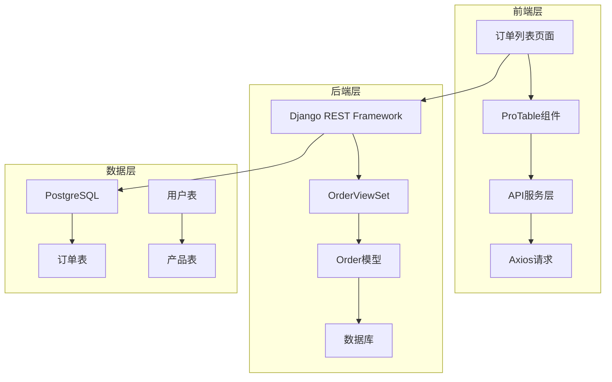
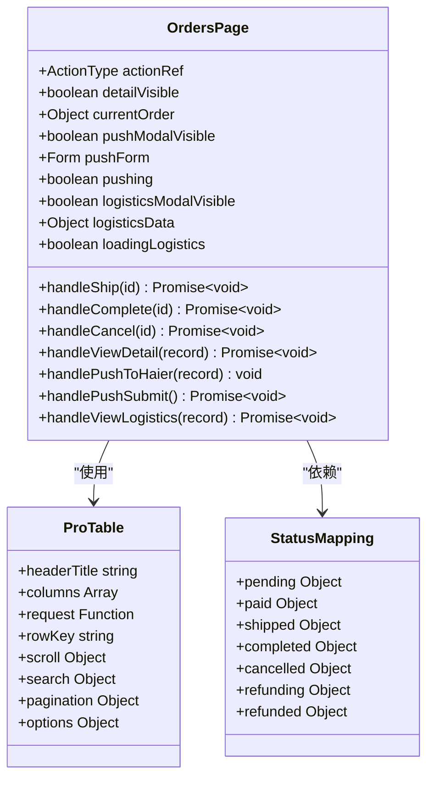
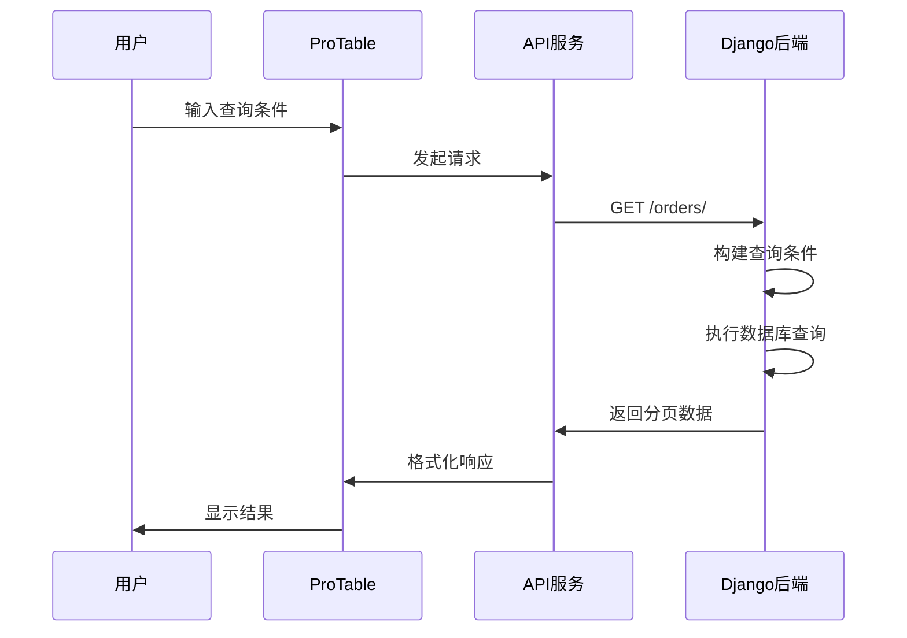
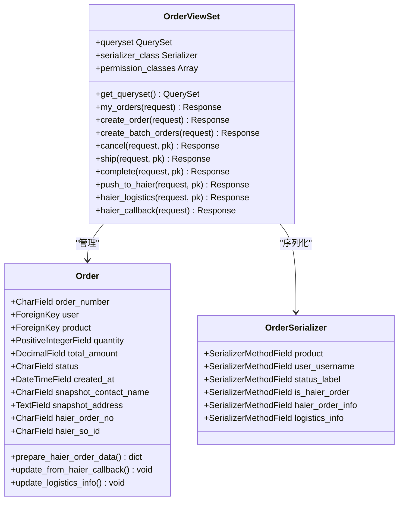
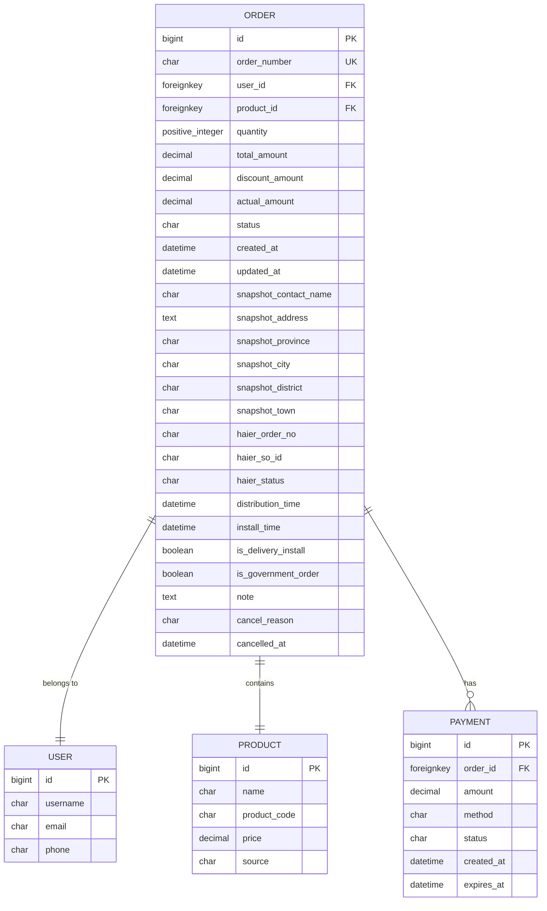
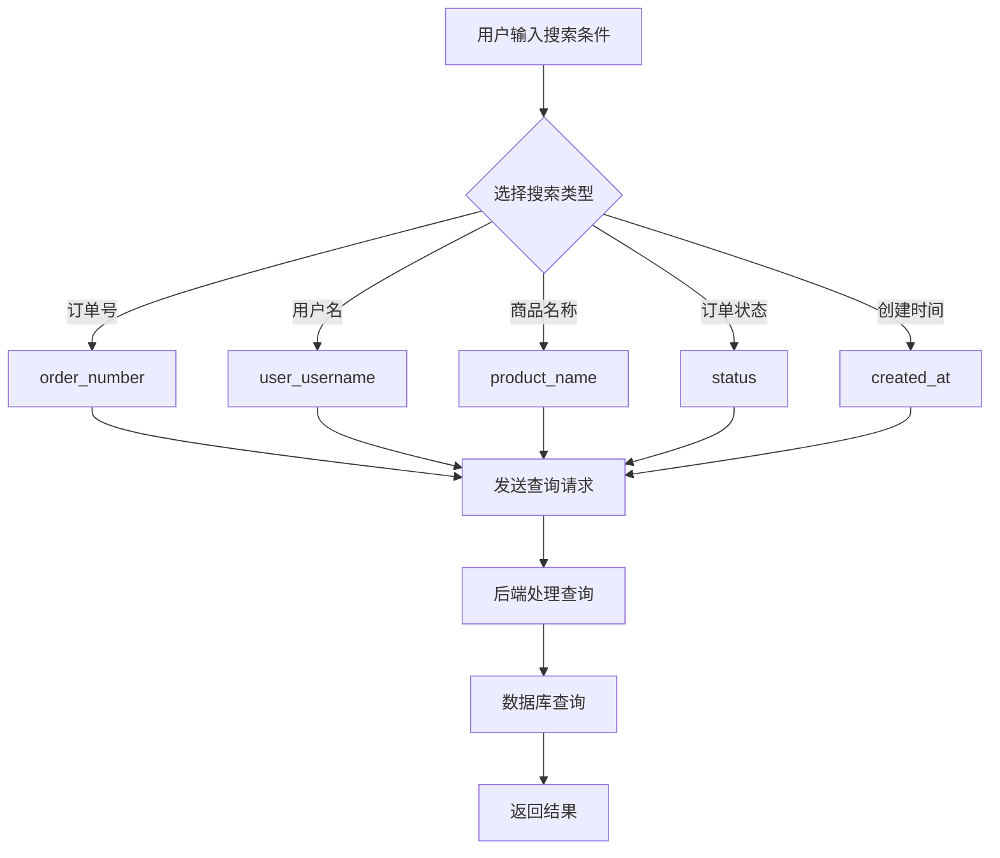
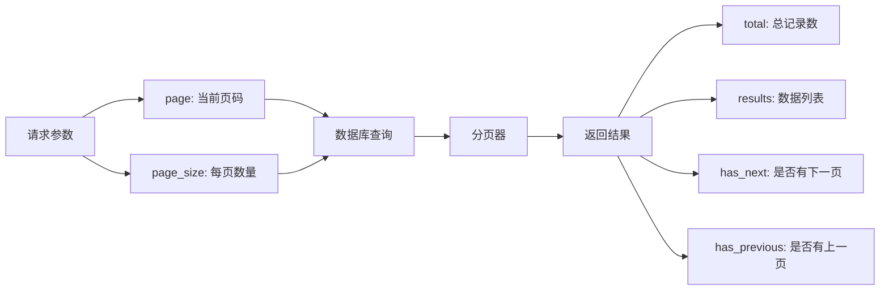
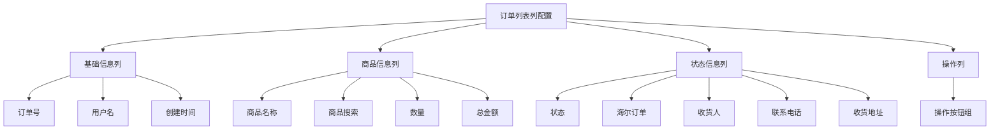
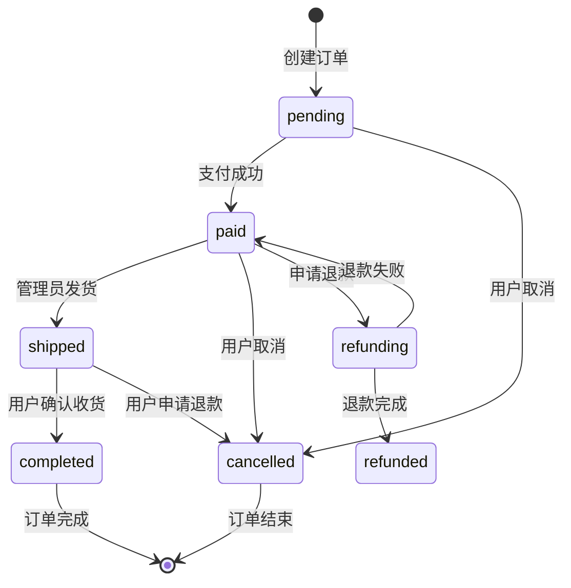

# 订单列表功能详细文档

<cite>
**本文档引用的文件**
- [merchant/src/pages/Orders/index.tsx](file://merchant/src/pages/Orders/index.tsx)
- [merchant/src/services/api.ts](file://merchant/src/services/api.ts)
- [backend/orders/views.py](file://backend/orders/views.py)
- [backend/orders/models.py](file://backend/orders/models.py)
- [backend/orders/serializers.py](file://backend/orders/serializers.py)
- [backend/common/pagination.py](file://backend/common/pagination.py)
- [frontend/src/services/order.ts](file://frontend/src/services/order.ts)
</cite>

## 目录
1. [概述](#概述)
2. [项目架构](#项目架构)
3. [前端订单列表组件](#前端订单列表组件)
4. [后端API设计](#后端api设计)
5. [数据模型分析](#数据模型分析)
6. [搜索与筛选功能](#搜索与筛选功能)
7. [分页机制](#分页机制)
8. [表格列配置](#表格列配置)
9. [操作功能实现](#操作功能实现)
10. [性能优化策略](#性能优化策略)
11. [开发指南](#开发指南)
12. [故障排除](#故障排除)

## 概述

订单列表功能是商户后台管理系统的核心模块，提供完整的订单管理界面，支持订单的查看、搜索、筛选、状态管理和操作等功能。该功能采用前后端分离架构，前端基于React和Ant Design Pro构建，后端使用Django REST Framework实现。

### 主要特性

- **完整的订单信息展示**：包含订单号、用户名、商品信息、金额、状态等关键字段
- **强大的搜索与筛选**：支持按订单号、用户名、商品名称、订单状态和时间范围查询
- **智能分页**：每页显示20条记录，支持快速跳转和页面大小切换
- **实时状态管理**：动态显示订单状态，并提供相应的操作按钮
- **海尔订单集成**：特殊支持海尔产品的订单推送和物流查询
- **响应式设计**：适配不同屏幕尺寸，提供良好的用户体验

## 项目架构



**架构图来源**
- [merchant/src/pages/Orders/index.tsx](file://merchant/src/pages/Orders/index.tsx#L1-L589)
- [backend/orders/views.py](file://backend/orders/views.py#L1-L800)

## 前端订单列表组件

### 组件结构分析

订单列表页面基于Ant Design Pro的ProTable组件构建，提供了丰富的表格功能和交互体验。



**类图来源**
- [merchant/src/pages/Orders/index.tsx](file://merchant/src/pages/Orders/index.tsx#L19-L589)

### 核心功能实现

#### 1. 状态映射配置

系统定义了完整的订单状态映射，为每个状态提供颜色标识和文本描述：

| 状态值 | 显示文本 | 颜色 | 描述 |
|--------|----------|------|------|
| pending | 待支付 | orange | 订单已创建但未支付 |
| paid | 已支付 | blue | 订单已支付等待发货 |
| shipped | 已发货 | cyan | 商品已发出 |
| completed | 已完成 | green | 订单已完成 |
| cancelled | 已取消 | red | 订单被取消 |
| refunding | 退款中 | purple | 正在处理退款 |
| refunded | 已退款 | magenta | 退款已完成 |

#### 2. 异步请求处理

ProTable组件的request函数实现了完整的查询参数映射和响应处理：



**序列图来源**
- [merchant/src/pages/Orders/index.tsx](file://merchant/src/pages/Orders/index.tsx#L340-L396)
- [merchant/src/services/api.ts](file://merchant/src/services/api.ts#L53)

**节源**
- [merchant/src/pages/Orders/index.tsx](file://merchant/src/pages/Orders/index.tsx#L340-L396)
- [merchant/src/services/api.ts](file://merchant/src/services/api.ts#L53)

## 后端API设计

### OrderViewSet核心功能

后端的OrderViewSet提供了完整的订单管理API，支持CRUD操作和高级查询功能。



**类图来源**
- [backend/orders/views.py](file://backend/orders/views.py#L23-L800)
- [backend/orders/models.py](file://backend/orders/models.py#L13-L322)
- [backend/orders/serializers.py](file://backend/orders/serializers.py#L8-L230)

### API端点设计

| 端点 | 方法 | 功能 | 权限要求 |
|------|------|------|----------|
| `/orders/` | GET | 获取订单列表 | IsOwnerOrAdmin |
| `/orders/` | POST | 创建订单 | IsAuthenticated |
| `/orders/my_orders/` | GET | 获取用户订单 | IsAuthenticated |
| `/orders/{id}/` | GET | 获取订单详情 | IsOwnerOrAdmin |
| `/orders/{id}/cancel/` | PATCH | 取消订单 | IsOwnerOrAdmin |
| `/orders/{id}/ship/` | PATCH | 发货 | IsAdmin |
| `/orders/{id}/complete/` | PATCH | 完成订单 | IsAdmin |
| `/orders/{id}/push_to_haier/` | POST | 推送海尔订单 | IsAdmin |
| `/orders/{id}/haier_logistics/` | GET | 查询海尔物流 | IsAuthenticated |

**节源**
- [backend/orders/views.py](file://backend/orders/views.py#L23-L800)

## 数据模型分析

### 订单模型结构

订单模型包含了完整的订单信息和业务逻辑，支持多种状态和扩展功能。



**实体关系图来源**
- [backend/orders/models.py](file://backend/orders/models.py#L13-L322)

### 关键字段说明

| 字段名 | 类型 | 说明 | 索引 |
|--------|------|------|------|
| order_number | CharField | 唯一订单编号 | Unique |
| status | CharField | 订单状态 | Index |
| created_at | DateTimeField | 创建时间 | Index |
| user | ForeignKey | 关联用户 | Index |
| product | ForeignKey | 关联商品 | Index |
| haier_so_id | CharField | 海尔子订单号 | Unique, Index |
| total_amount | DecimalField | 总金额 | - |
| quantity | PositiveIntegerField | 商品数量 | - |

**节源**
- [backend/orders/models.py](file://backend/orders/models.py#L13-L322)

## 搜索与筛选功能

### 前端搜索配置

前端使用ProTable的搜索功能，支持多种查询条件：



**流程图来源**
- [merchant/src/pages/Orders/index.tsx](file://merchant/src/pages/Orders/index.tsx#L348-L373)

### 后端查询逻辑

后端实现了灵活的查询过滤机制，支持链式查询构建：

| 查询参数 | 处理逻辑 | 示例 |
|----------|----------|------|
| order_number | 模糊匹配 | `icontains` |
| user_username | 模糊匹配 | `icontains` |
| product_name | 模糊匹配 | `icontains` |
| status | 精确匹配 | `=` |
| created_after | 时间范围 | `>=` |
| created_before | 时间范围 | `<=` |
| username | 管理员专用 | `icontains` |

**节源**
- [backend/orders/views.py](file://backend/orders/views.py#L35-L96)

## 分页机制

### 分页配置

系统采用标准的分页机制，支持灵活的页面大小配置：



**图表来源**
- [backend/common/pagination.py](file://backend/common/pagination.py#L8-L42)

### 分页参数配置

| 参数 | 默认值 | 最大值 | 说明 |
|------|--------|--------|------|
| page | 1 | - | 当前页码 |
| page_size | 20 | 100 | 每页记录数 |
| max_page_size | 100 | 1000 | 最大每页数量 |

**节源**
- [backend/common/pagination.py](file://backend/common/pagination.py#L8-L42)

## 表格列配置

### 列定义详解

订单列表的表格列经过精心设计，平衡了信息完整性和用户体验：



**图表来源**
- [merchant/src/pages/Orders/index.tsx](file://merchant/src/pages/Orders/index.tsx#L108-L331)

### 关键列配置

| 列名 | dataIndex | 宽度 | 隐藏属性 | 特殊处理 |
|------|-----------|------|----------|----------|
| 订单号 | order_number | 180px | - | 支持复制 |
| 用户名 | user_username | 120px | - | - |
| 商品名称 | product.name | - | 在搜索中隐藏 | 文本截断 |
| 商品搜索 | product_name | - | 仅在搜索中显示 | - |
| 数量 | quantity | 80px | 搜索中隐藏 | - |
| 总金额 | total_amount | 120px | 搜索中隐藏 | 格式化显示 |
| 状态 | status | 100px | - | Tag标签显示 |
| 海尔订单 | is_haier_order | 100px | 搜索中隐藏 | 复杂渲染 |
| 收货人 | snapshot_contact_name | 100px | 搜索中隐藏 | - |
| 联系电话 | snapshot_phone | 120px | 搜索中隐藏 | - |
| 收货地址 | snapshot_address | - | 搜索中隐藏 | 文本截断 |
| 创建时间 | created_at | 180px | 搜索中隐藏 | 日期格式化 |
| 操作 | - | 280px | 固定右侧 | 动态按钮组 |

**节源**
- [merchant/src/pages/Orders/index.tsx](file://merchant/src/pages/Orders/index.tsx#L108-L331)

## 操作功能实现

### 订单状态流转

系统实现了完整的订单状态机，支持状态间的合法转换：



### 操作按钮配置

不同状态下显示的操作按钮：

| 订单状态 | 可用操作 | 权限要求 |
|----------|----------|----------|
| paid | 发货 | 管理员 |
| shipped | 完成 | 管理员 |
| pending/paid | 取消 | 用户/管理员 |
| paid | 推送海尔 | 管理员 |
| 已推送海尔订单 | 查询物流 | 管理员 |

**节源**
- [merchant/src/pages/Orders/index.tsx](file://merchant/src/pages/Orders/index.tsx#L30-L106)

## 性能优化策略

### 数据库优化

1. **索引策略**
   - 对常用查询字段建立索引
   - 使用复合索引优化复杂查询
   - 合理使用数据库索引避免全表扫描

2. **查询优化**
   - 使用select_related减少数据库查询次数
   - 使用prefetch_related预加载关联对象
   - 实现查询集缓存机制

3. **分页优化**
   - 使用数据库原生分页功能
   - 避免深度分页导致的性能问题
   - 提供合理的默认页面大小

### 前端优化

1. **虚拟滚动**
   - 对于大数据量场景考虑虚拟滚动技术
   - 减少DOM节点数量提升渲染性能

2. **缓存策略**
   - 实现请求结果缓存
   - 使用本地存储缓存频繁访问的数据
   - 设置合理的缓存过期时间

3. **懒加载**
   - 对非关键信息实现懒加载
   - 按需加载详情数据
   - 延迟加载图片和其他媒体资源

**节源**
- [backend/orders/views.py](file://backend/orders/views.py#L39-L41)
- [backend/common/pagination.py](file://backend/common/pagination.py#L8-L42)

## 开发指南

### 新手使用指导

#### 1. 基本操作
- **查看订单详情**：点击"查看"按钮打开订单详情抽屉
- **搜索订单**：在搜索栏输入关键词进行模糊查询
- **筛选状态**：使用状态下拉菜单筛选特定状态的订单
- **分页导航**：使用分页控件在不同页面间切换

#### 2. 高级功能
- **海尔订单管理**：对于海尔产品订单，可以进行推送和物流查询
- **批量操作**：支持对多个订单执行相同操作
- **导出功能**：可以将订单数据导出为Excel格式

### 开发者扩展指南

#### 1. 表格列自定义
```typescript
// 添加新的表格列
const customColumns = [
  ...columns,
  {
    title: '自定义列',
    dataIndex: 'custom_field',
    render: (text: string) => `自定义: ${text}`
  }
];
```

#### 2. 搜索条件扩展
```typescript
// 扩展搜索条件
const extendedRequest = async (params: any) => {
  // 添加自定义搜索条件
  if (params.custom_filter) {
    queryParams.custom_filter = params.custom_filter;
  }
  
  return getOrders(queryParams);
};
```

#### 3. 导出功能扩展
```typescript
// 实现数据导出功能
const exportOrders = async () => {
  const response = await getOrders({ page_size: 1000 }); // 获取全部数据
  // 实现导出逻辑
};
```

#### 4. 响应式布局优化
```typescript
// 适配移动端布局
const responsiveConfig = {
  xs: 24,
  sm: 12,
  md: 8,
  lg: 6,
  xl: 4
};
```

**节源**
- [merchant/src/pages/Orders/index.tsx](file://merchant/src/pages/Orders/index.tsx#L336-L414)

## 故障排除

### 常见问题及解决方案

#### 1. 订单列表加载缓慢
**症状**：订单列表页面加载时间过长
**可能原因**：
- 数据库查询效率低
- 网络延迟过高
- 前端渲染性能瓶颈

**解决方案**：
- 检查数据库索引配置
- 优化查询语句
- 实现数据缓存机制
- 使用虚拟滚动技术

#### 2. 搜索功能不工作
**症状**：输入搜索条件后没有返回结果
**可能原因**：
- 查询参数映射错误
- 后端查询逻辑问题
- 数据库字段不存在

**解决方案**：
- 检查前端查询参数传递
- 验证后端查询逻辑
- 确认数据库字段存在

#### 3. 分页显示异常
**症状**：分页控件显示错误或无法正常切换
**可能原因**：
- 分页参数传递错误
- 后端分页逻辑问题
- 前端状态同步问题

**解决方案**：
- 检查分页参数配置
- 验证后端分页实现
- 确认前端状态管理

#### 4. 状态更新失败
**症状**：订单状态修改后没有生效
**可能原因**：
- 权限验证失败
- 状态转换逻辑错误
- 并发更新冲突

**解决方案**：
- 检查用户权限配置
- 验证状态转换规则
- 实现乐观锁机制

### 调试技巧

1. **网络请求监控**
   - 使用浏览器开发者工具检查API请求
   - 验证请求参数和响应数据
   - 检查HTTP状态码和错误信息

2. **数据库查询分析**
   - 启用Django查询日志
   - 分析慢查询SQL语句
   - 优化数据库索引

3. **前端状态调试**
   - 使用React DevTools检查组件状态
   - 验证状态更新流程
   - 检查副作用函数执行

**节源**
- [merchant/src/pages/Orders/index.tsx](file://merchant/src/pages/Orders/index.tsx#L393-L396)
- [backend/orders/views.py](file://backend/orders/views.py#L35-L96)

## 总结

订单列表功能作为商户后台的核心模块，实现了完整的订单管理能力。通过前后端分离架构，系统具备了良好的可维护性和扩展性。主要优势包括：

1. **功能完整性**：涵盖了订单管理的所有核心需求
2. **用户体验**：提供了直观易用的界面和流畅的操作体验
3. **技术先进性**：采用了现代Web开发技术和最佳实践
4. **性能优化**：通过多种优化策略确保系统的高效运行
5. **扩展性强**：模块化设计便于功能扩展和定制

该功能为商户提供了强大的订单管理工具，有助于提高运营效率和服务质量。随着业务的发展，可以在此基础上进一步扩展更多高级功能，如数据分析、自动化处理等。