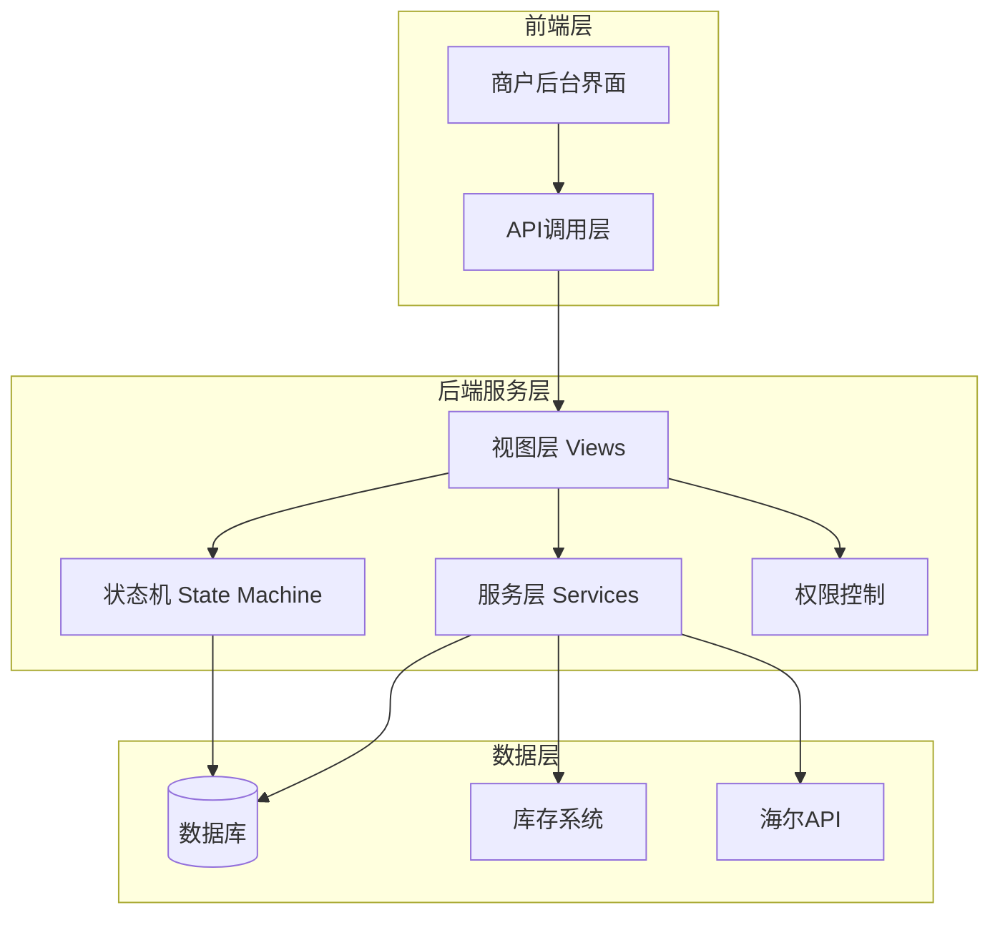
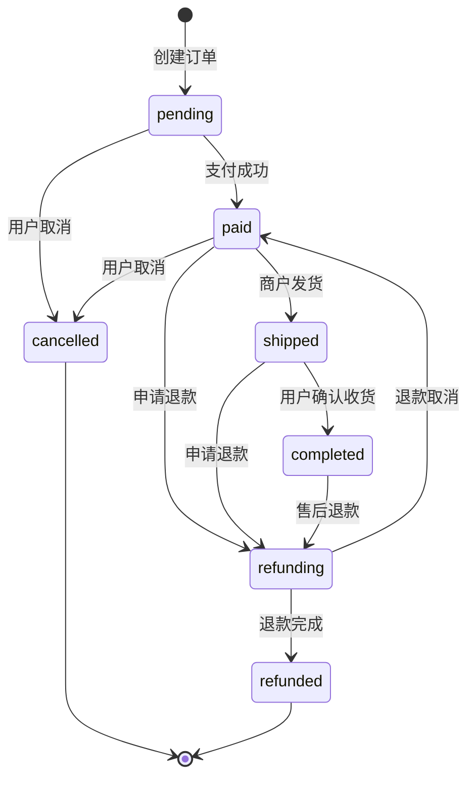
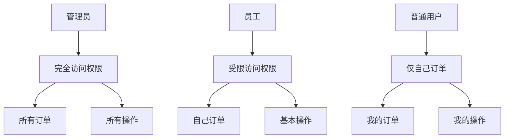
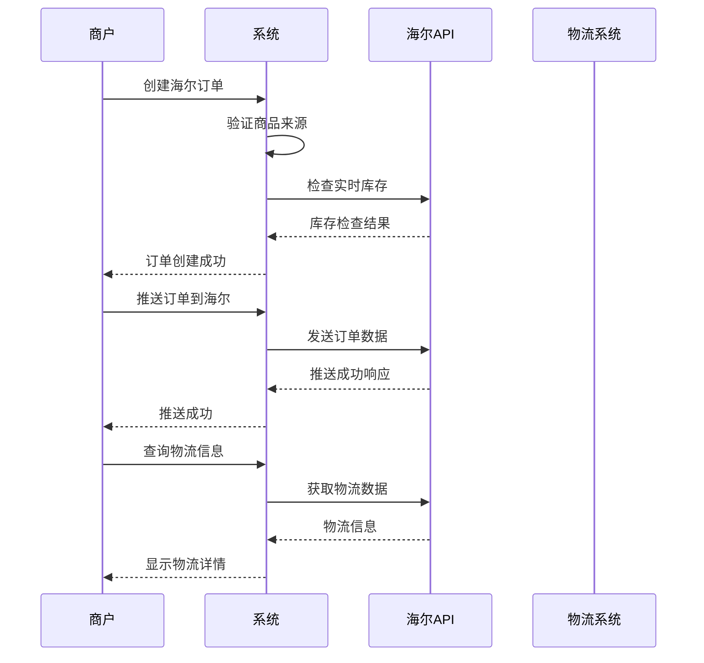

# 订单操作功能详细文档

<cite>
**本文档引用的文件**
- [merchant/src/pages/Orders/index.tsx](file://merchant/src/pages/Orders/index.tsx)
- [backend/orders/models.py](file://backend/orders/models.py)
- [backend/orders/state_machine.py](file://backend/orders/state_machine.py)
- [backend/orders/views.py](file://backend/orders/views.py)
- [backend/orders/services.py](file://backend/orders/services.py)
- [merchant/src/services/api.ts](file://merchant/src/services/api.ts)
- [backend/common/permissions.py](file://backend/common/permissions.py)
- [PRODUCT_ORDER_FULFILLMENT_GUIDE.md](file://PRODUCT_ORDER_FULFILLMENT_GUIDE.md)
</cite>

## 目录
1. [概述](#概述)
2. [系统架构](#系统架构)
3. [订单状态机设计](#订单状态机设计)
4. [商户后台订单操作界面](#商户后台订单操作界面)
5. [核心业务操作详解](#核心业务操作详解)
6. [权限控制系统](#权限控制系统)
7. [状态流转规则](#状态流转规则)
8. [操作确认机制](#操作确认机制)
9. [API接口设计](#api接口设计)
10. [错误处理与日志记录](#错误处理与日志记录)
11. [并发控制与事务一致性](#并发控制与事务一致性)
12. [最佳实践指南](#最佳实践指南)

## 概述

订单操作功能是商户后台管理系统的核心模块，负责处理订单的全生命周期管理。该系统采用状态机驱动的设计模式，确保订单状态流转的合法性和业务流程的规范性。系统支持发货、完成、取消等核心操作，并提供完善的权限控制、操作确认和日志记录机制。

### 主要特性

- **状态机驱动**：严格的订单状态流转控制
- **权限分级**：基于角色的访问控制
- **操作确认**：防止误操作的安全机制
- **实时库存管理**：支持海尔产品实时库存检查
- **事务一致性**：确保数据完整性
- **操作日志**：完整的操作轨迹追踪

## 系统架构



**架构图源文件**
- [merchant/src/pages/Orders/index.tsx](file://merchant/src/pages/Orders/index.tsx#L1-L589)
- [backend/orders/views.py](file://backend/orders/views.py#L1-L800)

## 订单状态机设计

系统采用状态机模式管理订单状态，确保状态流转的合法性。

### 状态定义



**状态图源文件**
- [backend/orders/state_machine.py](file://backend/orders/state_machine.py#L14-L57)

### 状态转换规则

| 当前状态 | 允许转换到的状态 | 说明 |
|---------|----------------|------|
| pending | paid, cancelled | 支付成功或用户取消 |
| paid | shipped, refunding, cancelled | 发货、申请退款或取消订单 |
| shipped | completed, refunding | 确认收货或申请退款 |
| completed | refunding | 售后退款 |
| refunding | refunded, paid | 退款完成或退款取消 |
| cancelled | 无 | 终态，不允许转换 |
| refunded | 无 | 终态，不允许转换 |

**章节源文件**
- [backend/orders/state_machine.py](file://backend/orders/state_machine.py#L34-L57)

## 商户后台订单操作界面

### 操作按钮渲染逻辑

系统根据订单当前状态动态显示可执行的操作按钮：

```mermaid
flowchart TD
Start([订单列表]) --> CheckStatus{检查订单状态}
CheckStatus --> |paid| ShowShip[显示"发货"按钮]
CheckStatus --> |shipped| ShowComplete[显示"完成"按钮]
CheckStatus --> |pending/paid| ShowCancel[显示"取消"按钮]
CheckStatus --> |其他状态| NoActions[无操作按钮]
ShowShip --> ShipConfirm[Popconfirm确认]
ShowComplete --> CompleteConfirm[Popconfirm确认]
ShowCancel --> CancelConfirm[Popconfirm确认]
ShipConfirm --> CallShipAPI[调用shipOrder API]
CompleteConfirm --> CallCompleteAPI[调用completeOrder API]
CancelConfirm --> CallCancelAPI[调用cancelOrder API]
CallShipAPI --> RefreshPage[刷新页面]
CallCompleteAPI --> RefreshPage
CallCancelAPI --> RefreshPage
```

**流程图源文件**
- [merchant/src/pages/Orders/index.tsx](file://merchant/src/pages/Orders/index.tsx#L273-L328)

### 按钮渲染实现

系统通过条件渲染实现动态按钮显示：

```typescript
// 发货按钮（仅paid状态）
if (record.status === 'paid') {
  actions.push(
    <Popconfirm
      key="ship"
      title="确认发货?"
      onConfirm={() => handleShip(record.id)}
    >
      <Button type="link" size="small" icon={<SendOutlined />}>
        发货
      </Button>
    </Popconfirm>
  );
}

// 完成按钮（仅shipped状态）
if (record.status === 'shipped') {
  actions.push(
    <Popconfirm
      key="complete"
      title="确认完成订单?"
      onConfirm={() => handleComplete(record.id)}
    >
      <Button type="link" size="small" icon={<CheckOutlined />}>
        完成
      </Button>
    </Popconfirm>
  );
}

// 取消按钮（仅pending/paid状态）
if (['pending', 'paid'].includes(record.status)) {
  actions.push(
    <Popconfirm
      key="cancel"
      title="确认取消订单?"
      description="取消后无法恢复"
      onConfirm={() => handleCancel(record.id)}
    >
      <Button
        type="link"
        size="small"
        danger
        icon={<CloseOutlined />}
      >
        取消
      </Button>
    </Popconfirm>
  );
}
```

**章节源文件**
- [merchant/src/pages/Orders/index.tsx](file://merchant/src/pages/Orders/index.tsx#L273-L328)

## 核心业务操作详解

### 发货操作（shipOrder）

发货操作将订单状态从`paid`转换为`shipped`。

#### 前端实现

```typescript
const handleShip = async (id: number) => {
  try {
    await shipOrder(id);
    message.success('发货成功');
    actionRef.current?.reload();
  } catch (error) {
    message.error('操作失败');
  }
};
```

#### 后端实现

```python
@action(detail=True, methods=['patch'], permission_classes=[IsAuthenticated])
def ship(self, request, pk=None):
    """发货：仅管理员可操作，状态从 paid 转换到 shipped"""
    order = self.get_object()
    user = request.user
    if not user.is_staff:
        return Response({"detail": "Only admins can ship orders"}, status=status.HTTP_403_FORBIDDEN)
    
    try:
        from .state_machine import OrderStateMachine
        note = request.data.get('note', '')
        order = OrderStateMachine.transition(
            order,
            'shipped',
            operator=user,
            note=note
        )
        serializer = self.get_serializer(order)
        return Response(serializer.data, status=200)
    except ValueError as e:
        return Response({"detail": str(e)}, status=status.HTTP_400_BAD_REQUEST)
    except Exception as e:
        return Response({"detail": f"发货失败: {str(e)}"}, status=status.HTTP_500_INTERNAL_SERVER_ERROR)
```

**章节源文件**
- [merchant/src/services/api.ts](file://merchant/src/services/api.ts#L55)
- [backend/orders/views.py](file://backend/orders/views.py#L331-L354)

### 完成操作（completeOrder）

完成操作将订单状态从`shipped`转换为`completed`。

#### 状态转换处理

系统在状态转换后自动执行以下业务逻辑：

```python
@classmethod
def _handle_post_transition(cls, order, old_status: str, new_status: str, operator=None):
    """处理状态转换后的业务逻辑"""
    
    # 订单完成时，更新商品销量
    if new_status == OrderStatus.COMPLETED.value:
        cls._handle_order_completed(order)
    
    # 订单被取消时，释放库存
    if new_status == OrderStatus.CANCELLED.value:
        cls._handle_order_cancelled(order, operator)
    
    # 退款完成时，释放库存
    if new_status == OrderStatus.REFUNDED.value:
        cls._handle_order_refunded(order, operator)
```

**章节源文件**
- [backend/orders/state_machine.py](file://backend/orders/state_machine.py#L185-L210)

### 取消操作（cancelOrder）

取消操作将订单状态从`pending`或`paid`转换为`cancelled`。

#### 库存释放机制

```python
@classmethod
def _handle_order_cancelled(cls, order, operator=None):
    """处理订单取消，释放锁定的库存"""
    from .services import InventoryService
    
    try:
        InventoryService.release_stock(
            product_id=order.product_id,
            quantity=order.quantity,
            reason='order_cancelled',
            operator=operator
        )
    except Exception as e:
        # 记录错误但不中断流程
        print(f'释放库存失败: {str(e)}')
```

**章节源文件**
- [backend/orders/state_machine.py](file://backend/orders/state_machine.py#L212-L233)

## 权限控制系统

### 权限层次结构



**权限图源文件**
- [backend/common/permissions.py](file://backend/common/permissions.py#L12-L189)

### 权限控制实现

#### IsOwnerOrAdmin权限类

```python
class IsOwnerOrAdmin(permissions.BasePermission):
    """允许所有者或管理员访问"""
    
    def has_object_permission(self, request, view, obj):
        # 管理员有所有对象的访问权限
        if request.user and request.user.is_staff:
            return True
        
        # 检查当前用户是否是所有者
        owner = getattr(obj, 'user', None)
        return owner == request.user
```

#### 视图权限配置

```python
@action(detail=True, methods=['patch'], permission_classes=[IsAuthenticated])
def cancel(self, request, pk=None):
    """取消订单：本人或管理员可取消"""
    order = self.get_object()
    user = request.user
    if not (user.is_staff or order.user_id == user.id):
        return Response({"detail": "Not allowed"}, status=status.HTTP_403_FORBIDDEN)
```

**章节源文件**
- [backend/common/permissions.py](file://backend/common/permissions.py#L12-L68)
- [backend/orders/views.py](file://backend/orders/views.py#L307-L313)

## 状态流转规则

### 海尔产品特殊流程

海尔产品需要特殊的推送和物流查询流程：



**序列图源文件**
- [PRODUCT_ORDER_FULFILLMENT_GUIDE.md](file://PRODUCT_ORDER_FULFILLMENT_GUIDE.md#L310-L446)

### 库存管理策略

#### 非海尔产品库存管理

```python
@staticmethod
@transaction.atomic
def lock_stock(product_id: int, quantity: int, reason: str = 'order_created', operator=None) -> bool:
    """锁定库存（使用数据库行锁）"""
    product = Product.objects.select_for_update().get(id=product_id)
    
    if product.stock < quantity:
        raise ValueError(f'库存不足，当前库存: {product.stock}，需要: {quantity}')
    
    # 扣减库存
    product.stock = F('stock') - quantity
    product.save(update_fields=['stock'])
    
    # 记录库存变更
    InventoryLog.objects.create(
        product=product,
        change_type='lock',
        quantity=-quantity,
        reason=reason,
        created_by=operator
    )
    
    return True
```

#### 海尔产品库存检查

```python
def check_haier_stock(product, address, quantity):
    """检查海尔产品库存"""
    # 获取区域编码
    county_code = get_county_code(address.province, address.city, address.district)
    
    # 调用海尔API查询库存
    stock_info = haier_api.check_stock(product.product_code, county_code)
    
    available_stock = stock_info.get('stock', 0)
    if available_stock < quantity:
        raise ValueError(f'海尔产品库存不足，当前库存: {available_stock}，需要: {quantity}')
    
    return {
        'available': True,
        'stock': available_stock,
        'warehouse_code': stock_info.get('secCode', ''),
        'warehouse_grade': stock_info.get('warehouseGrade', ''),
        'timeliness_data': stock_info.get('timelinessData', {})
    }
```

**章节源文件**
- [backend/orders/services.py](file://backend/orders/services.py#L332-L372)
- [backend/orders/services.py](file://backend/orders/services.py#L123-L217)

## 操作确认机制

### Popconfirm组件使用

系统使用Ant Design的Popconfirm组件防止误操作：

```typescript
<Popconfirm
  key="cancel"
  title="确认取消订单?"
  description="取消后无法恢复"
  onConfirm={() => handleCancel(record.id)}
>
  <Button
    type="link"
    size="small"
    danger
    icon={<CloseOutlined />}
  >
    取消
  </Button>
</Popconfirm>
```

### 确认机制特点

1. **双重确认**：点击按钮后弹出确认对话框
2. **明确提示**：显示操作后果和风险
3. **操作记录**：记录确认过程
4. **错误处理**：提供友好的错误反馈

**章节源文件**
- [merchant/src/pages/Orders/index.tsx](file://merchant/src/pages/Orders/index.tsx#L310-L328)

## API接口设计

### 核心操作接口

| 接口 | 方法 | URL | 权限 | 功能 |
|------|------|-----|------|------|
| 发货 | PATCH | `/orders/{id}/ship/` | 管理员 | 将订单状态从paid转为shipped |
| 完成 | PATCH | `/orders/{id}/complete/` | 管理员 | 将订单状态从shipped转为completed |
| 取消 | PATCH | `/orders/{id}/cancel/` | 用户/管理员 | 将订单状态转为cancelled |
| 推送海尔 | POST | `/orders/{id}/push_to_haier/` | 管理员 | 推送海尔产品订单到易理货系统 |
| 查询物流 | GET | `/orders/{id}/haier_logistics/` | 订单所有者/管理员 | 查询海尔订单物流信息 |

### 接口响应格式

```typescript
// 成功响应
{
  "success": true,
  "data": {
    "order": OrderObject,
    "message": "操作成功"
  }
}

// 错误响应
{
  "success": false,
  "error": {
    "code": "INVALID_STATUS",
    "message": "订单状态不允许此操作",
    "details": "当前状态为pending，不能执行发货操作"
  }
}
```

**章节源文件**
- [merchant/src/services/api.ts](file://merchant/src/services/api.ts#L55-L59)
- [api.md](file://api.md#L238-L288)

## 错误处理与日志记录

### 异常处理机制

```typescript
const handleShip = async (id: number) => {
  try {
    await shipOrder(id);
    message.success('发货成功');
    actionRef.current?.reload();
  } catch (error) {
    // 错误类型判断
    if (error.response?.status === 400) {
      message.error(`发货失败: ${error.response.data.detail}`);
    } else if (error.response?.status === 403) {
      message.error('您没有权限执行此操作');
    } else {
      message.error('操作失败，请稍后重试');
    }
  }
};
```

### 日志记录策略

#### 状态变更日志

```python
class OrderStatusHistory(models.Model):
    """订单状态变更历史"""
    order = models.ForeignKey(Order, on_delete=models.CASCADE, related_name='status_history')
    from_status = models.CharField(max_length=20, verbose_name='原状态')
    to_status = models.CharField(max_length=20, verbose_name='新状态')
    operator = models.ForeignKey('users.User', null=True, blank=True, on_delete=models.SET_NULL, verbose_name='操作人')
    created_at = models.DateTimeField(auto_now_add=True, verbose_name='创建时间')
    note = models.TextField(blank=True, default='', verbose_name='备注')
```

#### 操作审计日志

```python
@classmethod
@transaction.atomic
def transition(cls, order, new_status: str, operator=None, note: str = ''):
    """执行状态转换并记录日志"""
    
    # 记录状态变更历史
    OrderStatusHistory.objects.create(
        order=order,
        from_status=old_status,
        to_status=new_status,
        operator=operator,
        note=note
    )
    
    # 发送操作审计事件
    try:
        from .analytics import OrderAnalytics
        OrderAnalytics.on_order_status_changed(order.id)
    except Exception:
        pass
```

**章节源文件**
- [backend/orders/models.py](file://backend/orders/models.py#L292-L322)
- [backend/orders/state_machine.py](file://backend/orders/state_machine.py#L138-L144)

## 并发控制与事务一致性

### 数据库事务保护

```python
@classmethod
@transaction.atomic
def transition(cls, order, new_status: str, operator=None, note: str = ''):
    """执行状态转换（原子操作）"""
    
    # 检查转换是否合法
    if not cls.can_transition(order.status, new_status):
        allowed = cls.get_allowed_transitions(order.status)
        raise ValueError(f'不允许的转换: {allowed}')
    
    old_status = order.status
    
    # 执行状态转换前的业务逻辑
    cls._handle_pre_transition(order, old_status, new_status, operator)
    
    # 更新订单状态（原子操作）
    order.status = new_status
    order.updated_at = timezone.now()
    order.save(update_fields=['status', 'updated_at'])
    
    # 记录状态变更历史
    OrderStatusHistory.objects.create(...)
    
    # 执行状态转换后的业务逻辑
    cls._handle_post_transition(order, old_status, new_status, operator)
    
    return order
```

### 行锁机制

```python
@staticmethod
@transaction.atomic
def lock_stock(product_id: int, quantity: int, reason: str = 'order_created', operator=None) -> bool:
    """锁定库存（使用数据库行锁）"""
    # 使用select_for_update锁定行
    product = Product.objects.select_for_update().get(id=product_id)
    
    if product.stock < quantity:
        raise ValueError(f'库存不足')
    
    # 扣减库存
    product.stock = F('stock') - quantity
    product.save(update_fields=['stock'])
    
    return True
```

### 并发冲突解决方案

1. **乐观锁**：使用版本号检测并发修改
2. **悲观锁**：使用数据库行锁防止并发冲突
3. **重试机制**：操作失败时自动重试
4. **补偿机制**：发生冲突时回滚并重试

**章节源文件**
- [backend/orders/state_machine.py](file://backend/orders/state_machine.py#L96-L154)
- [backend/orders/services.py](file://backend/orders/services.py#L333-L372)

## 最佳实践指南

### 标准订单处理流程

#### 1. 订单创建阶段
- 验证商品库存和有效性
- 检查用户地址有效性
- 计算订单金额和折扣
- 锁定库存资源

#### 2. 支付阶段
- 创建支付记录
- 调用支付网关
- 监听支付回调
- 更新订单状态

#### 3. 发货阶段
- 确认订单状态为paid
- 检查库存可用性
- 更新订单状态
- 记录发货信息

#### 4. 完成阶段
- 确认订单状态为shipped
- 等待用户确认收货
- 自动完成机制
- 更新商品销量

### 开发者高级技术方案

#### 1. 操作日志记录
```python
# 记录详细的操作日志
logger.info(f'订单状态转换: order_id={order.id}, '
           f'from={old_status}, to={new_status}, '
           f'operator={operator.id if operator else "system"}')
```

#### 2. 事务一致性保障
```python
@transaction.atomic
def process_order_operation(order_id: int, operation: str):
    """原子性处理订单操作"""
    order = Order.objects.select_for_update().get(id=order_id)
    
    # 执行业务逻辑
    if operation == 'ship':
        # 发货逻辑
        pass
    elif operation == 'complete':
        # 完成逻辑
        pass
    
    # 记录操作日志
    log_operation(order, operation)
```

#### 3. 并发操作冲突解决
```python
def safe_order_operation(order_id: int, operation: str, max_retries: int = 3):
    """安全的订单操作，带重试机制"""
    for attempt in range(max_retries):
        try:
            return process_order_operation(order_id, operation)
        except (IntegrityError, DatabaseError) as e:
            if attempt == max_retries - 1:
                raise e
            time.sleep(0.1 * (attempt + 1))  # 指数退避
```

### 性能优化建议

1. **批量操作**：支持批量发货和批量完成
2. **缓存策略**：缓存常用的状态映射和权限信息
3. **异步处理**：大订单操作使用异步队列
4. **索引优化**：为常用查询字段建立索引

### 安全考虑

1. **输入验证**：严格验证所有输入参数
2. **权限检查**：每次操作前检查用户权限
3. **操作审计**：记录所有敏感操作
4. **防重放攻击**：使用nonce和时间戳防止重放

通过遵循这些最佳实践，可以构建一个稳定、安全、高效的订单操作系统，为商户提供可靠的订单管理能力。