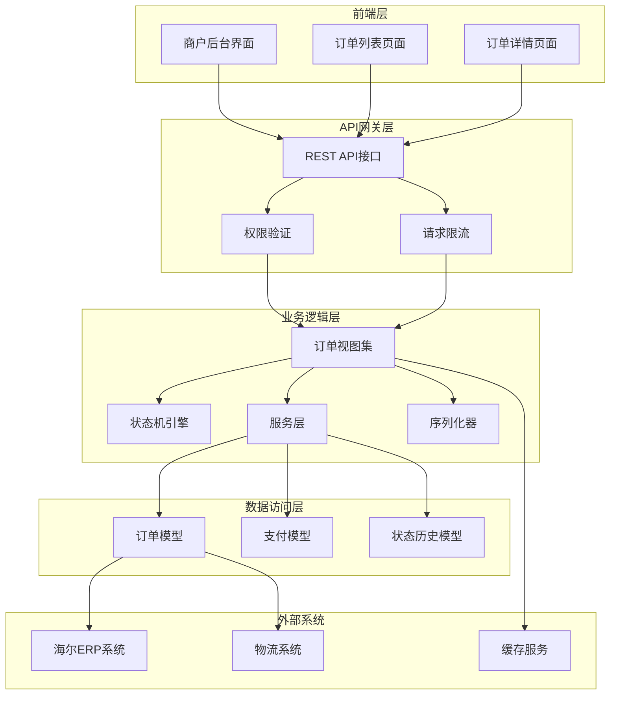
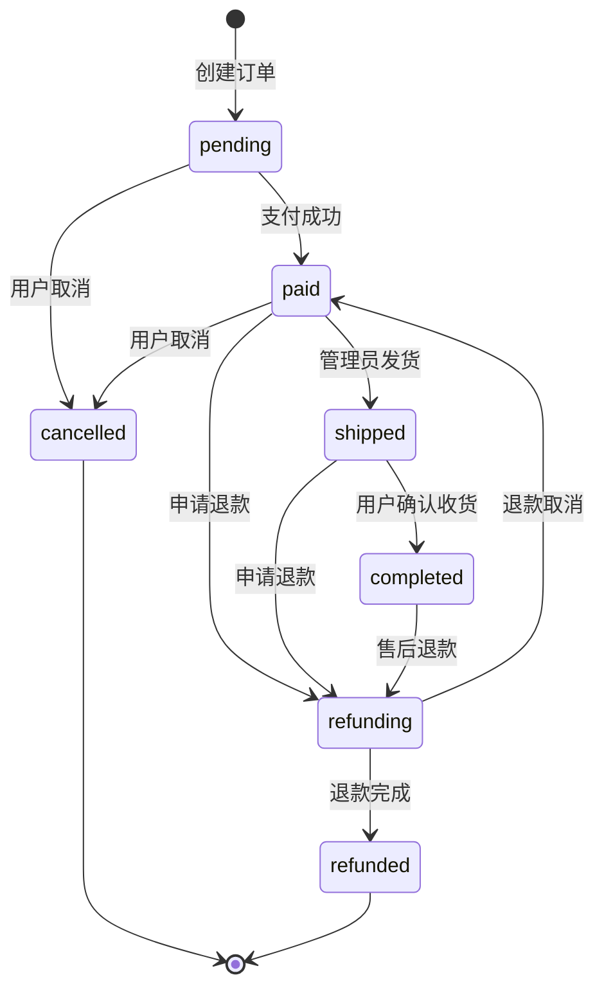
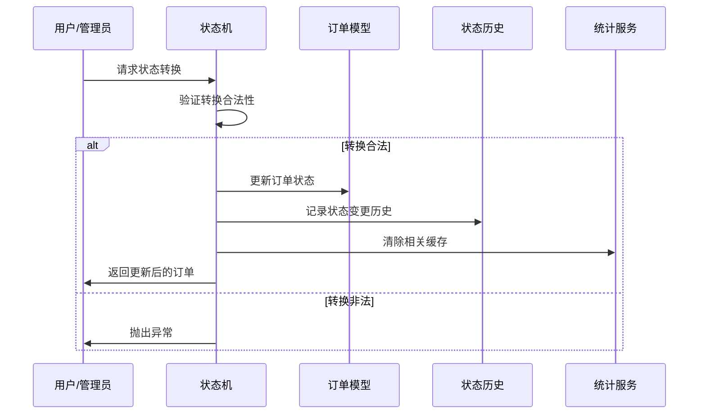
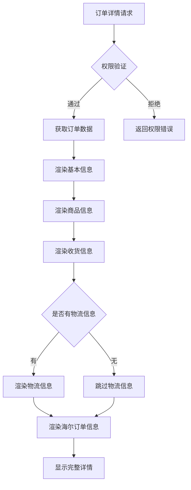
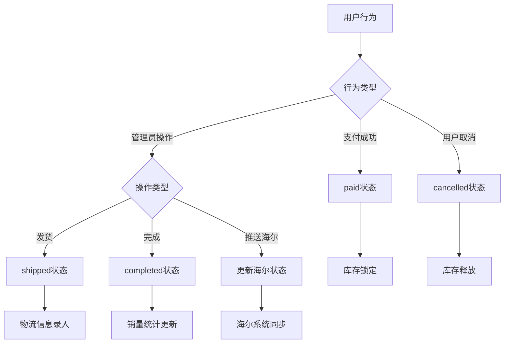
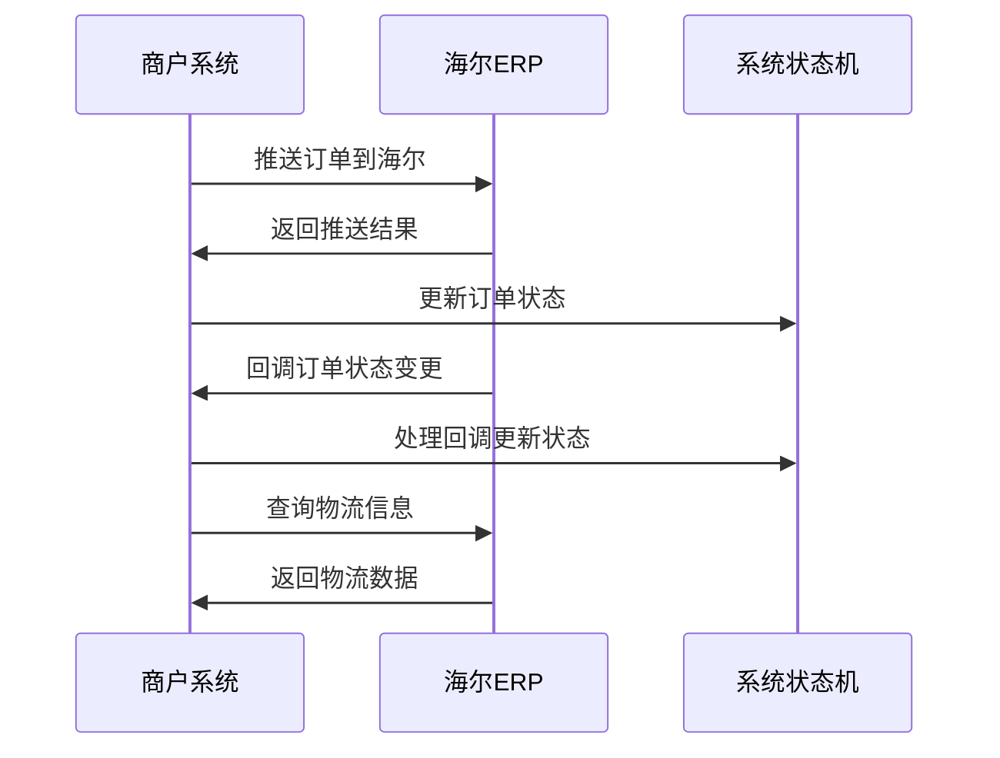
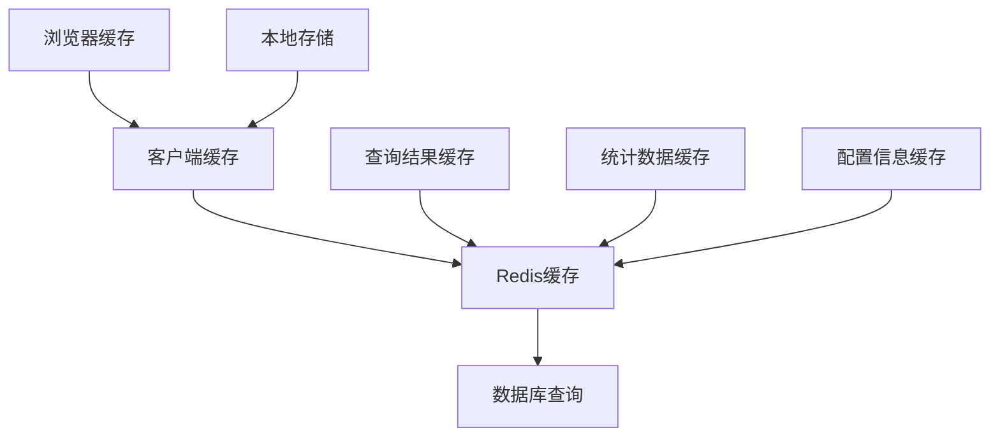

# 订单管理

<cite>
**本文档引用的文件**
- [merchant/src/pages/Orders/index.tsx](file://merchant/src/pages/Orders/index.tsx)
- [backend/orders/models.py](file://backend/orders/models.py)
- [backend/orders/views.py](file://backend/orders/views.py)
- [backend/orders/state_machine.py](file://backend/orders/state_machine.py)
- [backend/orders/serializers.py](file://backend/orders/serializers.py)
- [backend/orders/services.py](file://backend/orders/services.py)
- [backend/orders/analytics.py](file://backend/orders/analytics.py)
- [frontend/src/services/order.ts](file://frontend/src/services/order.ts)
</cite>

## 目录
1. [概述](#概述)
2. [系统架构](#系统架构)
3. [订单模型设计](#订单模型设计)
4. [订单状态机](#订单状态机)
5. [前端订单管理界面](#前端订单管理界面)
6. [后端API接口](#后端api接口)
7. [订单状态流转](#订单状态流转)
8. [海尔订单集成](#海尔订单集成)
9. [性能优化策略](#性能优化策略)
10. [操作指南](#操作指南)
11. [故障排除](#故障排除)

## 概述

订单管理系统是电商业务的核心组件，负责处理从订单创建到完成的全生命周期管理。系统采用前后端分离架构，前端使用React框架，后端基于Django REST framework构建，提供了完整的订单管理功能，包括订单列表展示、状态更新、物流跟踪、与第三方系统集成等。

### 核心功能特性

- **完整的订单生命周期管理**：从创建到完成的全流程跟踪
- **灵活的状态机驱动**：确保订单状态转换的合法性和一致性
- **多维度查询筛选**：支持按状态、时间范围、用户等条件查询
- **实时状态更新**：支持管理员和用户端的状态变更
- **海尔系统集成**：支持与海尔ERP系统的订单同步
- **性能优化**：采用缓存、索引等技术提升查询效率
- **权限控制**：严格的访问控制和操作权限管理

## 系统架构

订单管理系统采用分层架构设计，确保各组件职责清晰、耦合度低。



**图表来源**
- [backend/orders/views.py](file://backend/orders/views.py#L23-L800)
- [merchant/src/pages/Orders/index.tsx](file://merchant/src/pages/Orders/index.tsx#L1-L589)

## 订单模型设计

订单模型是整个系统的核心数据结构，包含了订单的完整信息和业务属性。

### 主要字段设计

| 字段名称 | 数据类型 | 描述 | 约束条件 |
|---------|---------|------|---------|
| order_number | CharField | 订单编号 | 唯一，自动生成 |
| status | CharField | 订单状态 | 枚举值，有状态机控制 |
| user | ForeignKey | 关联用户 | 外键关联用户表 |
| product | ForeignKey | 关联商品 | 外键关联商品表 |
| quantity | PositiveIntegerField | 商品数量 | 正整数 |
| total_amount | DecimalField | 总金额 | 保留两位小数 |
| discount_amount | DecimalField | 折扣金额 | 默认0 |
| actual_amount | DecimalField | 实付金额 | 默认0 |
| created_at | DateTimeField | 创建时间 | 自动添加 |
| updated_at | DateTimeField | 更新时间 | 自动更新 |
| snapshot_* | CharField/TextField | 订单快照 | 用户下单时的快照信息 |

### 状态定义

系统定义了7种订单状态，每种状态都有明确的业务含义：



**图表来源**
- [backend/orders/state_machine.py](file://backend/orders/state_machine.py#L34-L57)

**章节来源**
- [backend/orders/models.py](file://backend/orders/models.py#L1-L322)

## 订单状态机

订单状态机是系统的核心业务逻辑组件，确保订单状态转换的合法性和一致性。

### 状态转换规则

状态机定义了严格的转换规则，防止非法状态跳转：

| 当前状态 | 允许转换到的状态 | 业务场景 |
|---------|----------------|---------|
| pending | paid, cancelled | 支付成功或用户取消 |
| paid | shipped, refunding, cancelled | 发货、申请退款、用户取消 |
| shipped | completed, refunding | 确认收货或申请退款 |
| completed | refunding | 售后退款 |
| refunding | refunded, paid | 退款完成或退款取消 |
| cancelled | 无 | 不允许转换 |
| refunded | 无 | 不允许转换 |

### 状态转换流程



**图表来源**
- [backend/orders/state_machine.py](file://backend/orders/state_machine.py#L96-L154)

### 业务逻辑处理

状态转换不仅涉及状态更新，还包括相关的业务逻辑：

- **订单取消**：释放锁定的库存
- **订单完成**：更新商品销量统计
- **支付成功**：更新商品浏览次数
- **退款完成**：释放库存并更新统计

**章节来源**
- [backend/orders/state_machine.py](file://backend/orders/state_machine.py#L1-L289)

## 前端订单管理界面

前端订单管理界面基于Ant Design Pro构建，提供了直观的订单管理体验。

### 订单列表功能

订单列表页面展示了完整的订单信息，并支持多种操作：

#### 列表字段设计

| 字段名称 | 类型 | 功能描述 |
|---------|------|---------|
| 订单号 | 文本 | 唯一标识，支持复制 |
| 用户名 | 文本 | 显示下单用户信息 |
| 商品名称 | 文本 | 商品详情快照 |
| 数量 | 数字 | 订单中的商品数量 |
| 总金额 | 金额 | 订单总金额显示 |
| 状态 | 标签 | 状态标签，彩色显示 |
| 海尔订单 | 标签 | 海尔系统集成标识 |
| 收货人 | 文本 | 快照的收货人信息 |
| 联系电话 | 文本 | 快照的联系方式 |
| 收货地址 | 文本 | 快照的详细地址 |
| 创建时间 | 时间 | 订单创建时间戳 |

#### 操作按钮设计

不同状态下显示不同的操作按钮：

- **查看**：查看订单详情
- **推送海尔**：仅海尔订单且未推送时显示
- **查询物流**：海尔订单已推送后显示
- **发货**：待发货状态显示
- **完成**：待收货状态显示
- **取消**：待支付或待发货状态显示

### 订单详情页面

订单详情页面提供了完整的订单信息展示：



**图表来源**
- [merchant/src/pages/Orders/index.tsx](file://merchant/src/pages/Orders/index.tsx#L417-L494)

**章节来源**
- [merchant/src/pages/Orders/index.tsx](file://merchant/src/pages/Orders/index.tsx#L1-L589)

## 后端API接口

后端API提供了完整的订单管理接口，支持RESTful设计原则。

### 核心API端点

| 端点 | 方法 | 功能描述 | 权限要求 |
|------|------|---------|---------|
| `/orders/` | GET | 获取订单列表 | IsOwnerOrAdmin |
| `/orders/` | POST | 创建订单 | IsAuthenticated |
| `/orders/{id}/` | GET | 获取订单详情 | IsOwnerOrAdmin |
| `/orders/{id}/cancel/` | PATCH | 取消订单 | IsAuthenticated |
| `/orders/{id}/ship/` | PATCH | 发货 | IsAdmin |
| `/orders/{id}/complete/` | PATCH | 完成订单 | IsAdmin |
| `/orders/push_to_haier/{id}/` | POST | 推送海尔 | IsAdmin |
| `/orders/haier_logistics/{id}/` | GET | 查询海尔物流 | IsAuthenticated |

### 查询参数支持

系统支持丰富的查询参数，便于灵活筛选：

| 参数名称 | 类型 | 描述 | 示例 |
|---------|------|------|------|
| status | string | 订单状态筛选 | `status=paid` |
| order_number | string | 订单号模糊搜索 | `order_number=123` |
| product_name | string | 商品名称模糊搜索 | `product_name=冰箱` |
| username | string | 用户名模糊搜索（管理员） | `username=admin` |
| created_after | datetime | 创建时间范围开始 | `created_after=2024-01-01` |
| created_before | datetime | 创建时间范围结束 | `created_before=2024-12-31` |

### 分页和排序

API支持标准的分页机制：

```typescript
// 分页响应格式
interface PaginatedResponse<T> {
  results: T[];
  pagination: {
    total: number;
    page: number;
    page_size: number;
  };
}
```

**章节来源**
- [backend/orders/views.py](file://backend/orders/views.py#L1-L800)

## 订单状态流转

订单状态流转是系统的核心业务逻辑，通过状态机确保流程的正确性。

### 状态转换触发条件



**图表来源**
- [backend/orders/state_machine.py](file://backend/orders/state_machine.py#L178-L288)

### 权限控制机制

不同状态转换需要不同的权限：

- **用户级别**：查看自己的订单、取消未支付订单
- **管理员级别**：发货、完成订单、推送海尔订单
- **超级管理员**：所有操作权限

### 操作日志记录

每次状态转换都会记录详细的操作日志：

```python
# 状态历史记录结构
{
    "order_id": 123,
    "from_status": "pending",
    "to_status": "paid",
    "operator": "admin_user",
    "created_at": "2024-01-01T10:00:00Z",
    "note": "用户支付成功"
}
```

**章节来源**
- [backend/orders/state_machine.py](file://backend/orders/state_machine.py#L137-L154)

## 海尔订单集成

系统支持与海尔ERP系统的深度集成，实现了订单的自动化处理。

### 海尔订单特性

海尔订单具有特殊的业务流程：

- **库存管理**：库存由海尔系统管理，不占用本地库存
- **状态同步**：支持双向状态同步
- **物流跟踪**：支持海尔系统的物流信息查询
- **回调处理**：接收海尔系统的状态回调

### 海尔订单流程



**图表来源**
- [backend/orders/views.py](file://backend/orders/views.py#L379-L547)

### 海尔API集成

系统提供了完整的海尔API集成：

- **认证机制**：MD5签名验证
- **订单推送**：支持批量和单个订单推送
- **状态回调**：自动处理海尔系统的状态变更
- **物流查询**：查询统仓、智汇宝、第三方物流信息

**章节来源**
- [backend/orders/views.py](file://backend/orders/views.py#L379-L547)

## 性能优化策略

系统采用了多种性能优化策略，确保在高并发场景下的稳定运行。

### 数据库优化

#### 索引设计

订单表的关键索引配置：

| 索引字段 | 类型 | 用途 |
|---------|------|------|
| status | 单列索引 | 按状态查询优化 |
| created_at | 单列索引 | 按时间查询优化 |
| user_id | 单列索引 | 按用户查询优化 |
| haier_order_no | 单列索引 | 海尔订单查询优化 |
| haier_so_id | 唯一索引 | 海尔子订单去重 |

#### 查询优化

- **预加载关联数据**：使用`select_related`和`prefetch_related`减少查询次数
- **分页查询**：避免一次性加载大量数据
- **缓存策略**：对频繁查询的数据进行缓存

### 缓存策略

#### 缓存层次



**图表来源**
- [backend/orders/analytics.py](file://backend/orders/analytics.py#L20-L72)

#### 缓存策略

- **短期缓存**：统计数据（5分钟）
- **长期缓存**：配置信息（24小时）
- **智能失效**：状态变更时自动清理相关缓存

### 并发控制

#### 库存锁定

使用数据库行锁确保库存并发安全：

```python
# 库存锁定实现
with transaction.atomic():
    product = Product.objects.select_for_update().get(id=product_id)
    if product.stock < quantity:
        raise ValueError("库存不足")
    product.stock -= quantity
    product.save()
```

**章节来源**
- [backend/orders/services.py](file://backend/orders/services.py#L333-L372)

## 操作指南

### 商户后台操作流程

#### 查看待支付订单

1. 登录商户后台
2. 进入订单管理页面
3. 筛选状态为"待支付"的订单
4. 查看订单详情
5. 如需取消，点击"取消"按钮

#### 处理已支付订单

1. 进入订单列表，筛选"已支付"状态
2. 确认库存充足
3. 点击"发货"按钮
4. 录入物流信息
5. 确认发货完成

#### 海尔订单处理

1. 查看待支付的海尔订单
2. 确认海尔库存充足
3. 点击"推送海尔"按钮
4. 填写推送参数
5. 等待推送结果
6. 查询物流信息

### 用户端操作流程

#### 订单创建

1. 选择商品加入购物车
2. 确认收货地址
3. 提交订单
4. 选择支付方式
5. 完成支付

#### 订单查询

1. 登录个人中心
2. 进入订单页面
3. 查看订单状态
4. 参与评价

## 故障排除

### 常见问题及解决方案

#### 订单状态异常

**问题**：订单状态显示异常或无法更新
**解决方案**：
1. 检查状态转换规则是否符合预期
2. 查看状态历史记录
3. 检查权限配置
4. 重新初始化状态机

#### 海尔订单推送失败

**问题**：海尔订单推送失败或状态同步异常
**解决方案**：
1. 检查海尔API认证信息
2. 验证订单数据完整性
3. 查看推送日志
4. 手动重试推送

#### 性能问题

**问题**：订单查询缓慢
**解决方案**：
1. 检查数据库索引是否生效
2. 清理缓存
3. 优化查询条件
4. 增加数据库连接池

### 监控和告警

系统提供了完善的监控机制：

- **状态监控**：实时监控订单状态变化
- **性能监控**：监控API响应时间和数据库查询
- **错误监控**：记录和告警系统异常
- **业务监控**：监控订单量和转化率

**章节来源**
- [backend/orders/analytics.py](file://backend/orders/analytics.py#L258-L322)

## 总结

订单管理系统是一个功能完整、架构合理的电商核心组件。通过状态机驱动的业务逻辑、完善的权限控制、高效的性能优化策略，系统能够稳定支撑电商业务的正常运转。同时，与海尔ERP系统的深度集成，展现了系统在复杂业务场景下的适应能力。

对于开发者而言，系统提供了清晰的扩展点和良好的开发体验；对于商户而言，系统简化了订单管理流程，提升了运营效率。随着业务的发展，系统还可以进一步优化和扩展，以适应更多的业务需求。