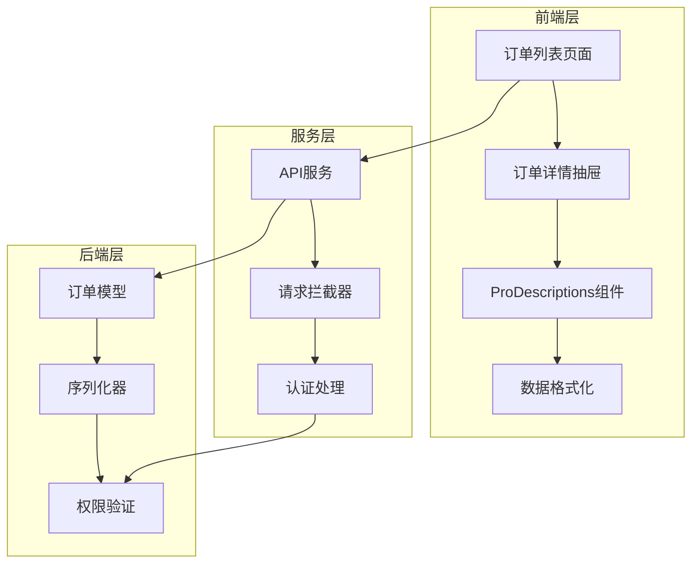
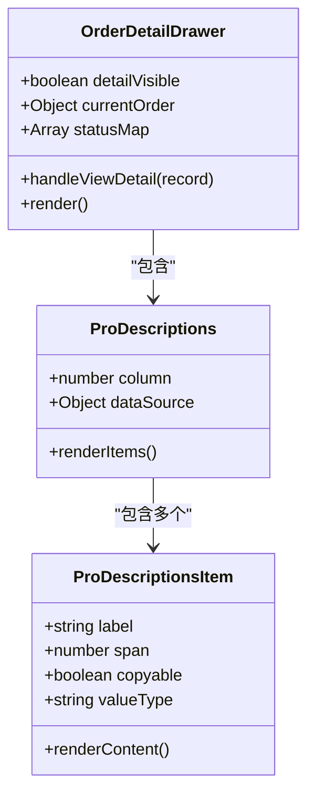
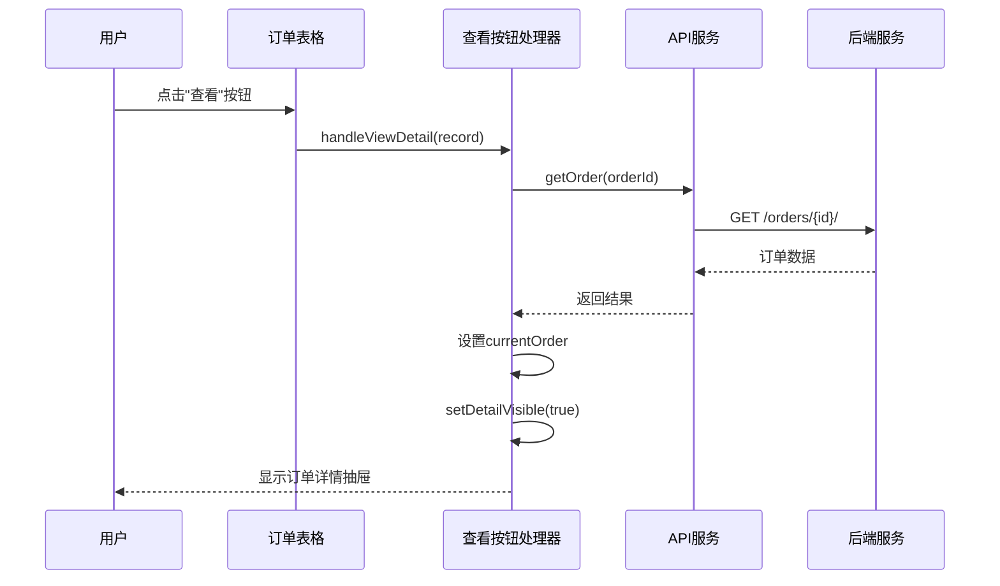
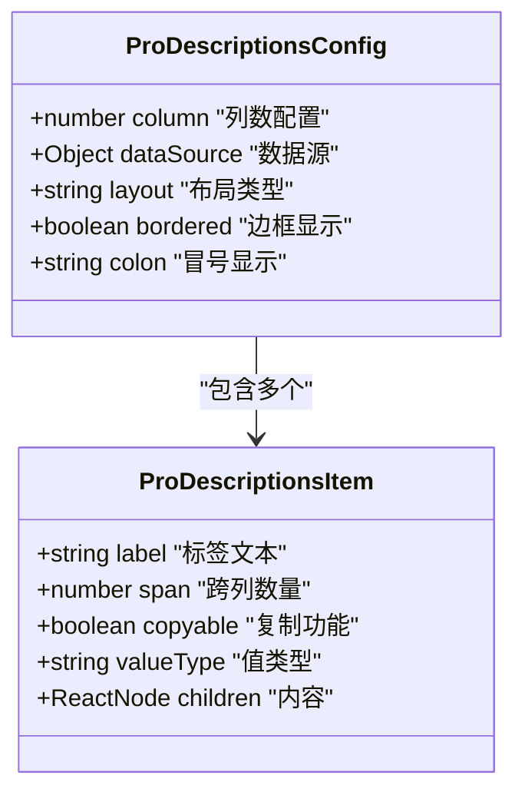
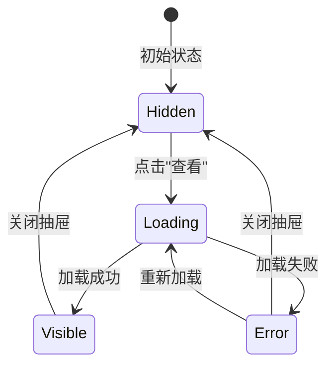

# 订单详情功能详细文档

<cite>
**本文档引用的文件**
- [merchant/src/pages/Orders/index.tsx](file://merchant/src/pages/Orders/index.tsx)
- [merchant/src/services/api.ts](file://merchant/src/services/api.ts)
- [backend/orders/models.py](file://backend/orders/models.py)
- [backend/orders/serializers.py](file://backend/orders/serializers.py)
- [frontend/src/pages/order-detail/index.tsx](file://frontend/src/pages/order-detail/index.tsx)
- [frontend/src/services/order.ts](file://frontend/src/services/order.ts)
- [frontend/src/utils/format.ts](file://frontend/src/utils/format.ts)
- [merchant/src/utils/request.ts](file://merchant/src/utils/request.ts)
- [merchant/src/utils/auth.ts](file://merchant/src/utils/auth.ts)
</cite>

## 目录
1. [概述](#概述)
2. [系统架构](#系统架构)
3. [订单详情抽屉组件](#订单详情抽屉组件)
4. [数据加载流程](#数据加载流程)
5. [ProDescriptions组件详解](#prodescriptions组件详解)
6. [数据格式化处理](#数据格式化处理)
7. [状态管理和异常处理](#状态管理和异常处理)
8. [最佳实践指南](#最佳实践指南)
9. [故障排除](#故障排除)
10. [总结](#总结)

## 概述

订单详情功能是商户后台管理系统的核心组件之一，为管理员提供了查看和管理订单详细信息的能力。该功能通过Ant Design的ProDescriptions组件实现结构化的信息展示，并通过Drawer抽屉组件提供非阻塞式的查看详情体验。

### 主要特性

- **非阻塞式查看详情**：使用Drawer抽屉组件，不影响主界面操作
- **结构化信息展示**：基于ProDescriptions组件的分组布局
- **实时数据加载**：通过API接口动态获取订单详情
- **状态可视化**：丰富的状态标签和颜色编码
- **异常处理**：完善的错误处理和用户反馈机制

## 系统架构

订单详情功能采用前后端分离架构，包含以下核心组件：

**图表来源**
- [merchant/src/pages/Orders/index.tsx](file://merchant/src/pages/Orders/index.tsx#L60-L68)
- [merchant/src/services/api.ts](file://merchant/src/services/api.ts#L54)
- [backend/orders/models.py](file://backend/orders/models.py#L1-L322)

## 订单详情抽屉组件

### 组件结构

订单详情抽屉组件基于Ant Design的Drawer组件构建，提供完整的订单信息展示界面：

**图表来源**
- [merchant/src/pages/Orders/index.tsx](file://merchant/src/pages/Orders/index.tsx#L417-L494)

### 触发机制

订单详情抽屉的触发通过"查看"按钮实现，点击事件绑定在表格操作列中：

**章节来源**
- [merchant/src/pages/Orders/index.tsx](file://merchant/src/pages/Orders/index.tsx#L229-L238)

### 抽屉配置

抽屉组件的关键配置参数：

| 参数 | 类型 | 默认值 | 说明 |
|------|------|--------|------|
| title | string | "订单详情" | 抽屉标题 |
| width | number | 720 | 抽屉宽度 |
| open | boolean | false | 显示状态 |
| onClose | function | - | 关闭回调 |

**章节来源**
- [merchant/src/pages/Orders/index.tsx](file://merchant/src/pages/Orders/index.tsx#L417-L421)

## 数据加载流程

### API调用序列

订单详情的数据加载遵循标准的异步请求模式：

**图表来源**
- [merchant/src/pages/Orders/index.tsx](file://merchant/src/pages/Orders/index.tsx#L60-L68)
- [merchant/src/services/api.ts](file://merchant/src/services/api.ts#L54)

### 异步处理机制

数据加载过程包含完整的错误处理和状态管理：

**章节来源**
- [merchant/src/pages/Orders/index.tsx](file://merchant/src/pages/Orders/index.tsx#L60-L68)

## ProDescriptions组件详解

### 组件配置

ProDescriptions组件提供了强大的数据展示能力，支持多种配置选项：

**图表来源**
- [merchant/src/pages/Orders/index.tsx](file://merchant/src/pages/Orders/index.tsx#L424-L427)

### 字段分类展示

订单详情按照逻辑分组展示不同类型的字段：

#### 基础信息组
- **订单号**：span=2，支持复制
- **用户名**：span=2
- **商品信息**：span=2
- **数量和单价**：分列显示
- **总金额**：加粗显示，红色字体

#### 状态信息组
- **订单状态**：状态标签，颜色编码
- **海尔订单标识**：布尔值显示
- **海尔订单号**：span=2，支持复制

#### 收货信息组
- **收货人**：姓名和电话
- **收货地址**：span=2
- **创建时间**：span=2，日期时间格式

#### 物流信息组
- **物流公司**：动态条件显示
- **物流单号**：支持复制

**章节来源**
- [merchant/src/pages/Orders/index.tsx](file://merchant/src/pages/Orders/index.tsx#L428-L491)

## 数据格式化处理

### 金额格式化

金额显示采用统一的格式化策略：

**章节来源**
- [frontend/src/utils/format.ts](file://frontend/src/utils/format.ts#L2-L5)

### 时间戳转换

时间显示支持多种格式化选项：

**章节来源**
- [frontend/src/utils/format.ts](file://frontend/src/utils/format.ts#L16-L38)

### 状态标签渲染

订单状态通过映射表实现本地化显示：

**章节来源**
- [merchant/src/pages/Orders/index.tsx](file://merchant/src/pages/Orders/index.tsx#L9-L17)
- [frontend/src/utils/format.ts](file://frontend/src/utils/format.ts#L41-L53)

## 状态管理和异常处理

### 状态管理

订单详情功能使用React的状态管理机制：

**图表来源**
- [merchant/src/pages/Orders/index.tsx](file://merchant/src/pages/Orders/index.tsx#L21-L22)

### 异常处理机制

系统实现了多层次的异常处理：

#### API请求异常
- 网络错误处理
- 服务器错误响应
- 权限验证失败

#### 数据处理异常
- 数据格式不匹配
- 缺失字段处理
- 类型转换错误

**章节来源**
- [merchant/src/pages/Orders/index.tsx](file://merchant/src/pages/Orders/index.tsx#L60-L68)

### 用户反馈机制

系统提供及时的用户反馈：

| 场景 | 反馈方式 | 实现位置 |
|------|----------|----------|
| 加载中 | 抽屉内显示加载动画 | ProDescriptions组件 |
| 加载成功 | 自动显示订单信息 | Drawer内容区域 |
| 加载失败 | 全局消息提示 | message.error() |
| 数据为空 | 占位符显示 | ProDescriptions.Item |

**章节来源**
- [merchant/src/pages/Orders/index.tsx](file://merchant/src/pages/Orders/index.tsx#L423-L425)

## 最佳实践指南

### 敏感信息脱敏

在展示订单信息时，需要考虑敏感信息的保护：

#### 电话号码脱敏
- 展示格式：`138****1234`
- 脱敏算法：保留前3位和后4位

#### 地址信息处理
- 精确地址：完整展示
- 区域信息：可选择性展示

### 信息分组布局

推荐的字段分组策略：

#### 重要性分组
1. **核心信息组**：订单号、状态、金额
2. **用户信息组**：用户名、联系方式
3. **商品信息组**：商品名称、规格、数量
4. **物流信息组**：物流状态、运单号
5. **时间信息组**：创建时间、更新时间

#### 布局优化原则
- 相关信息集中展示
- 重要信息优先显示
- 使用适当的间距和分隔线
- 支持响应式布局

### 性能优化建议

#### 数据缓存策略
- 频繁访问的订单信息缓存
- 避免重复API调用
- 合理设置缓存过期时间

#### 渲染性能优化
- 使用React.memo避免不必要的重渲染
- 虚拟滚动处理大量数据
- 懒加载非关键信息

**章节来源**
- [merchant/src/pages/Orders/index.tsx](file://merchant/src/pages/Orders/index.tsx#L417-L494)

## 故障排除

### 常见问题及解决方案

#### 订单详情无法加载
**症状**：点击"查看"按钮后抽屉显示空白
**可能原因**：
- API接口不可用
- 网络连接问题
- 权限验证失败

**解决步骤**：
1. 检查网络连接状态
2. 验证API接口可用性
3. 确认用户权限
4. 查看浏览器控制台错误信息

#### 数据格式异常
**症状**：某些字段显示异常或缺失
**可能原因**：
- 后端数据模型变更
- 序列化器配置错误
- 前端字段映射不匹配

**解决步骤**：
1. 对比前后端字段定义
2. 检查数据传输格式
3. 验证序列化器配置
4. 更新前端字段映射

#### 性能问题
**症状**：抽屉打开缓慢或卡顿
**可能原因**：
- 数据量过大
- 渲染复杂度高
- 网络延迟

**优化方案**：
1. 实施数据分页加载
2. 优化渲染逻辑
3. 添加加载骨架屏
4. 实现数据懒加载

### 调试技巧

#### 开发环境调试
- 使用浏览器开发者工具
- 监控网络请求状态
- 检查Redux状态变化
- 验证组件Props传递

#### 生产环境监控
- 集成错误追踪系统
- 监控API响应时间
- 收集用户操作日志
- 实施性能指标监控

## 总结

订单详情功能作为商户后台管理系统的重要组成部分，通过精心设计的架构和实现，为管理员提供了高效、直观的订单管理体验。该功能的主要优势包括：

### 技术优势
- **模块化设计**：清晰的组件分离和职责划分
- **状态管理**：完善的状态控制和异常处理机制
- **用户体验**：非阻塞式的设计提升了操作效率
- **数据安全**：合理的权限控制和数据脱敏处理

### 功能特点
- **信息完整性**：涵盖订单生命周期的所有关键信息
- **交互友好性**：直观的操作界面和及时的反馈机制
- **扩展性强**：灵活的字段配置和布局调整能力
- **性能优化**：合理的数据加载和渲染策略

### 发展方向
随着业务需求的不断演进，订单详情功能可以在以下方面进一步优化：
- 增强数据分析能力
- 提升移动端适配
- 优化大订单处理性能
- 加强安全防护措施

通过持续的优化和改进，订单详情功能将继续为商户提供更加优质的管理体验，助力业务发展。