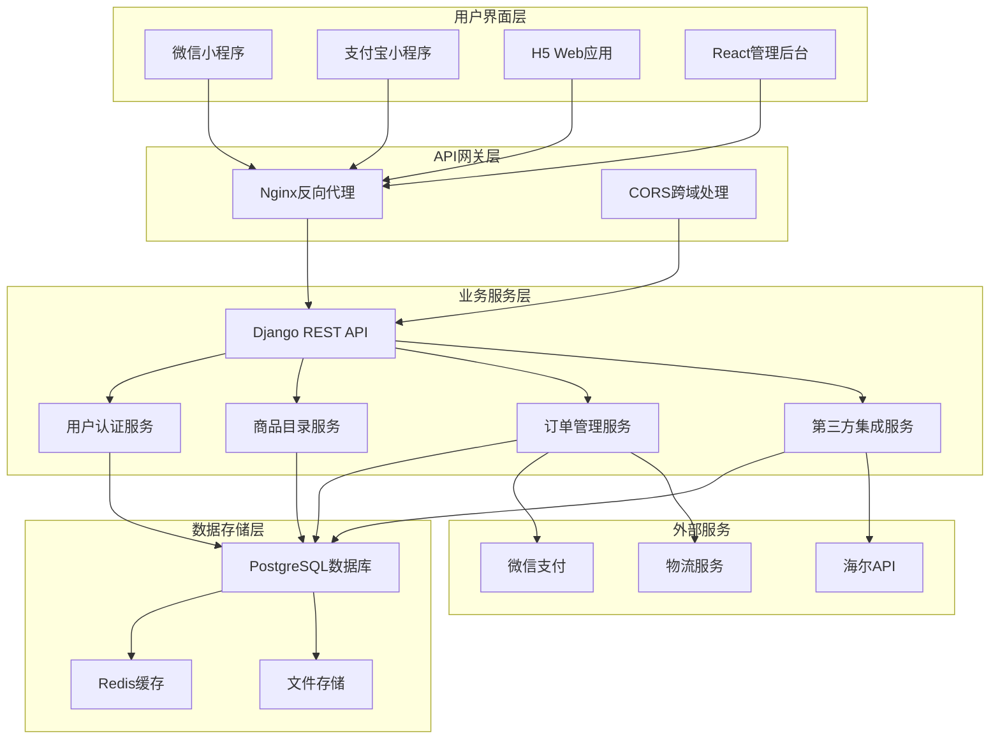
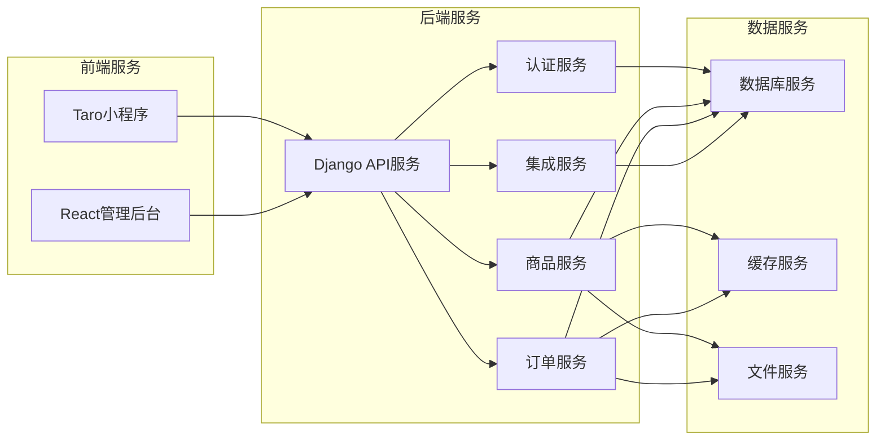
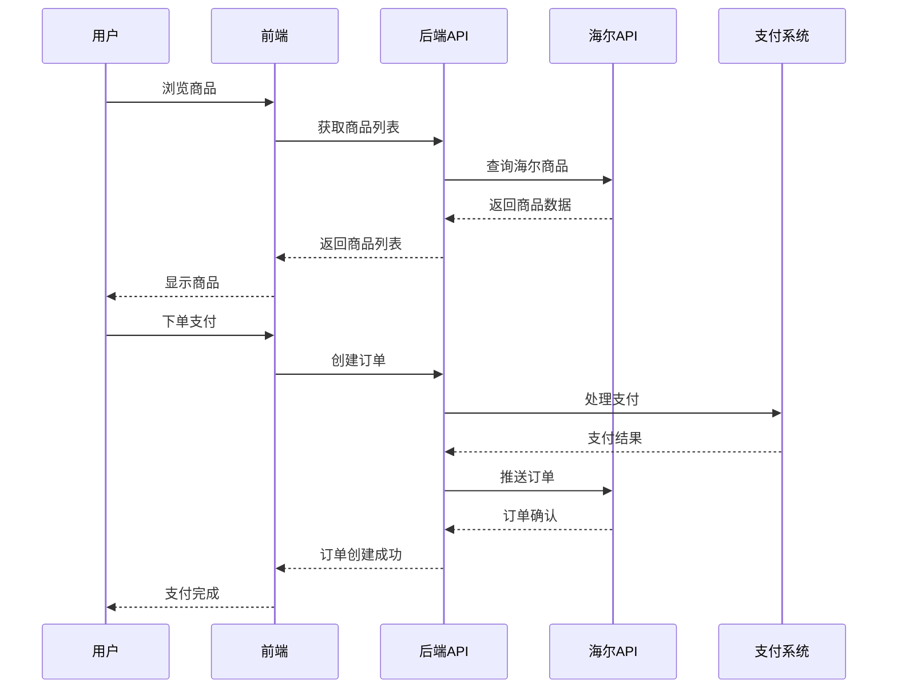
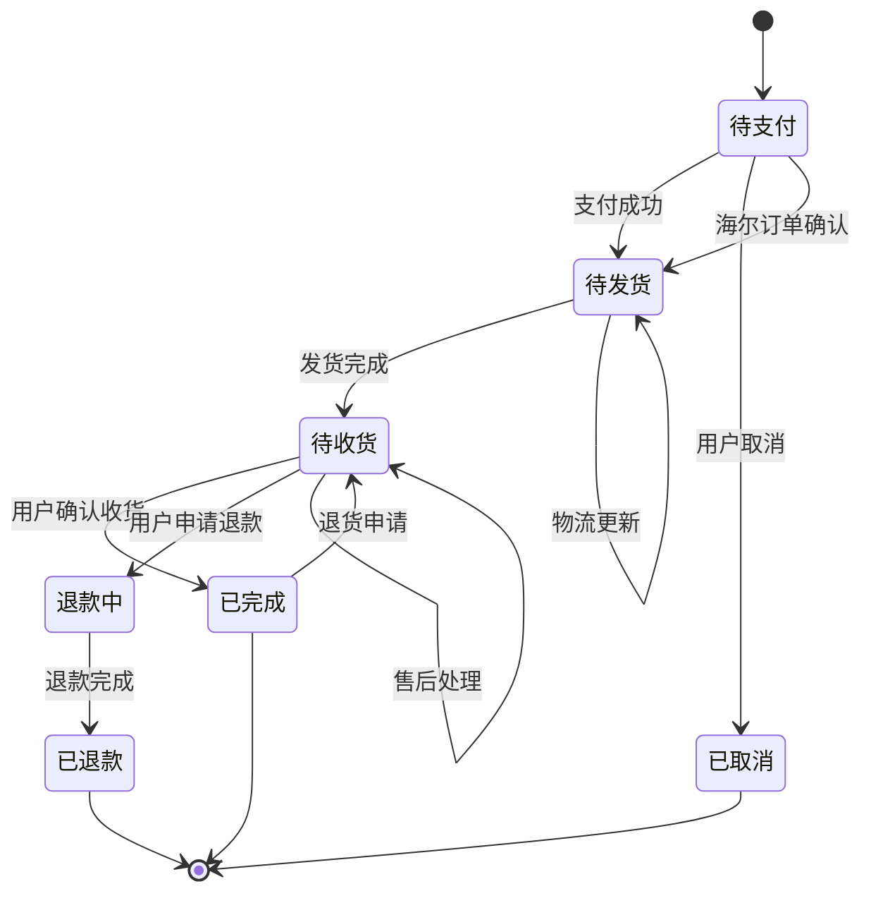
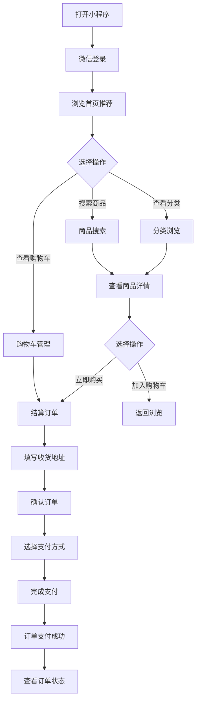
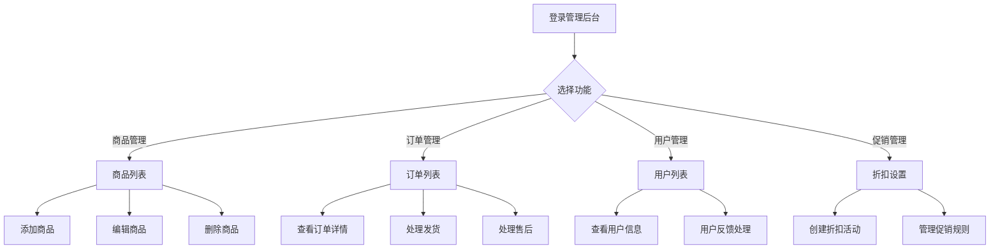
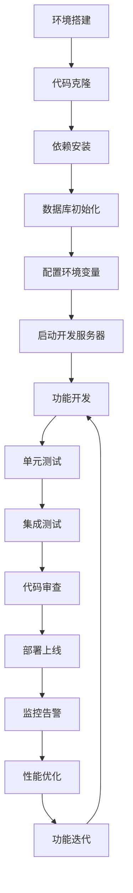
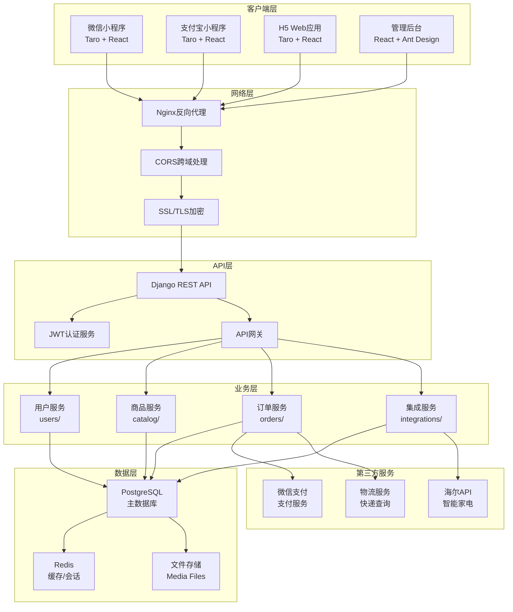
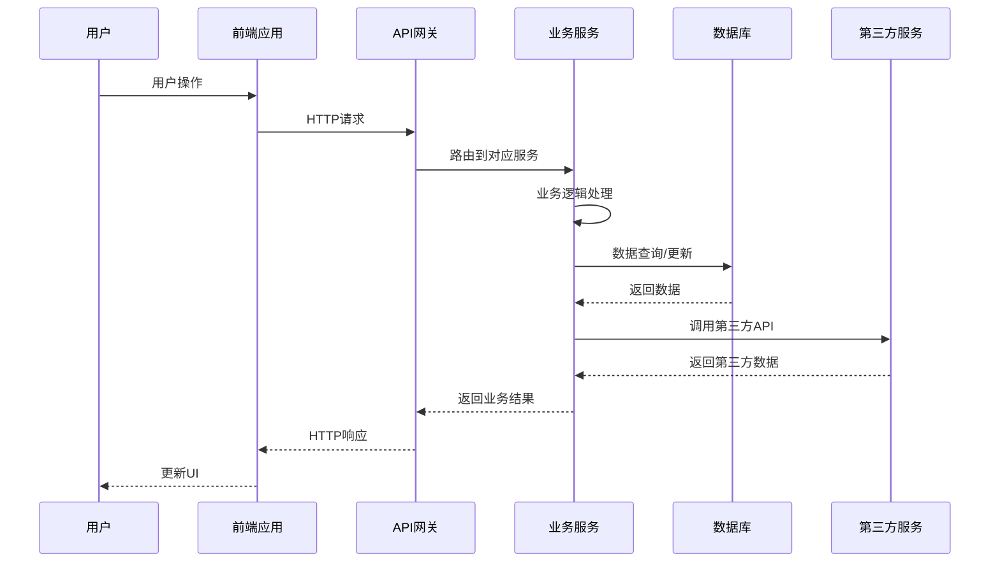

# 家电商城系统概述

<cite>
**本文档引用的文件**
- [backend/backend/settings/base.py](file://backend/backend/settings/base.py)
- [backend/backend/urls.py](file://backend/backend/urls.py)
- [backend/catalog/models.py](file://backend/catalog/models.py)
- [backend/users/models.py](file://backend/users/models.py)
- [backend/orders/models.py](file://backend/orders/models.py)
- [backend/integrations/haierapi.py](file://backend/integrations/haierapi.py)
- [frontend/src/app.ts](file://frontend/src/app.ts)
- [merchant/src/App.tsx](file://merchant/src/App.tsx)
- [frontend/package.json](file://frontend/package.json)
- [merchant/package.json](file://merchant/package.json)
- [DEVELOPER_GUIDE.md](file://DEVELOPER_GUIDE.md)
- [USER_INTRODUCTION.md](file://USER_INTRODUCTION.md)
- [backend/pyproject.toml](file://backend/pyproject.toml)
</cite>

## 目录
1. [系统简介](#系统简介)
2. [技术架构概览](#技术架构概览)
3. [核心子系统](#核心子系统)
4. [系统亮点特性](#系统亮点特性)
5. [用户用例分析](#用户用例分析)
6. [技术栈详解](#技术栈详解)
7. [系统架构图](#系统架构图)
8. [开发环境配置](#开发环境配置)
9. [总结](#总结)

## 系统简介

家电商城系统是一个完整的全栈电商解决方案，专为智能家电零售场景设计。该系统采用现代化的微服务架构，深度集成了海尔智能家电生态系统，为用户提供从商品浏览、下单采购到订单管理的完整电商体验。

### 系统定位
- **目标用户**：家电消费者、商户管理者、系统开发者
- **核心价值**：提供稳定可靠的智能家电在线购物平台
- **技术特色**：前后端分离、多端支持、企业级安全

**章节来源**
- [DEVELOPER_GUIDE.md](file://DEVELOPER_GUIDE.md#L24-L40)

## 技术架构概览

系统采用三层架构设计，确保高度的模块化和可扩展性：



**图表来源**
- [DEVELOPER_GUIDE.md](file://DEVELOPER_GUIDE.md#L43-L83)
- [backend/backend/settings/base.py](file://backend/backend/settings/base.py#L1-L50)

**章节来源**
- [DEVELOPER_GUIDE.md](file://DEVELOPER_GUIDE.md#L43-L83)

## 核心子系统

### 1. Django后端API系统

后端采用Django框架构建，提供RESTful API服务，具备以下特点：

#### 架构特点
- **RESTful API设计**：遵循REST原则，提供标准化的HTTP接口
- **JWT认证机制**：基于JSON Web Token的安全认证体系
- **模块化设计**：按功能划分为users、catalog、orders、integrations等应用
- **版本控制**：支持API版本管理，确保向后兼容

#### 核心模块
- **用户认证模块**：支持微信小程序登录和管理员登录
- **商品目录模块**：商品信息管理、分类品牌管理、搜索功能
- **订单管理模块**：完整的订单生命周期管理
- **第三方集成模块**：海尔API集成、支付系统对接

**章节来源**
- [backend/backend/settings/base.py](file://backend/backend/settings/base.py#L11-L29)
- [backend/backend/urls.py](file://backend/backend/urls.py#L24-L48)

### 2. Taro小程序前端系统

前端采用Taro框架开发，实现一次开发多端运行：

#### 技术特性
- **跨平台支持**：一套代码编译到微信、支付宝、抖音等多个小程序平台
- **React生态**：使用React框架，拥有丰富的组件库和开发工具
- **TypeScript支持**：提供类型安全保障和更好的开发体验
- **状态管理**：集成Redux或MobX进行状态管理

#### 支持平台
- 微信小程序（WeApp）
- 支付宝小程序（Alipay）
- 抖音小程序（Douyin）
- H5网页应用
- 其他小程序平台

**章节来源**
- [frontend/package.json](file://frontend/package.json#L1-L88)
- [frontend/src/app.ts](file://frontend/src/app.ts#L1-L18)

### 3. React商户管理后台

商户管理后台提供专业的后台管理系统：

#### 功能特性
- **Ant Design Pro**：基于Ant Design Pro的企业级中后台解决方案
- **路由管理**：React Router实现的单页应用路由
- **权限控制**：基于角色的访问控制（RBAC）
- **数据可视化**：集成图表组件进行数据分析展示

#### 核心功能模块
- 商品管理
- 订单管理
- 用户管理
- 品牌管理
- 分类管理
- 折扣管理

**章节来源**
- [merchant/package.json](file://merchant/package.json#L1-L27)
- [merchant/src/App.tsx](file://merchant/src/App.tsx#L1-L45)

**章节来源**
- [DEVELOPER_GUIDE.md](file://DEVELOPER_GUIDE.md#L88-L183)

## 系统亮点特性

### 1. 微服务架构设计

系统采用微服务架构，实现前后端完全分离：



**图表来源**
- [DEVELOPER_GUIDE.md](file://DEVELOPER_GUIDE.md#L43-L83)

### 2. 多端支持能力

系统支持多种终端设备和平台：

| 终端类型 | 技术方案 | 支持平台 | 特点 |
|---------|----------|----------|------|
| 小程序 | Taro框架 | 微信、支付宝、抖音等 | 原生体验，快速启动 |
| H5网页 | Taro + React | 所有浏览器 | 跨平台兼容性强 |
| 管理后台 | React + Ant Design | PC浏览器 | 专业管理功能 |

### 3. 深度海尔生态集成

系统与海尔智能家电生态系统深度集成：

#### 海尔API功能
- **商品信息同步**：实时获取海尔商品信息
- **价格库存查询**：动态获取最新价格和库存
- **订单推送**：自动将订单推送到海尔系统
- **物流跟踪**：集成海尔物流系统查询

#### 集成架构


**图表来源**
- [backend/integrations/haierapi.py](file://backend/integrations/haierapi.py#L1-L50)

### 4. 灵活的折扣系统

系统提供精细化的折扣管理功能：

#### 折扣类型
- **固定金额折扣**：直接减免固定金额
- **百分比折扣**：按比例计算折扣
- **满减优惠**：满足条件后的金额减免

#### 应用范围
- **用户级折扣**：针对特定用户群体
- **商品级折扣**：针对特定商品
- **品类级折扣**：针对商品分类
- **组合折扣**：多种折扣叠加使用

### 5. 完整的订单生命周期管理

订单系统支持完整的业务流程：



**图表来源**
- [backend/orders/models.py](file://backend/orders/models.py#L14-L22)

**章节来源**
- [DEVELOPER_GUIDE.md](file://DEVELOPER_GUIDE.md#L32-L40)

## 用户用例分析

### 1. 消费者用户用例

消费者是系统的主要用户群体，他们的典型工作流程如下：

#### 购买流程


**图表来源**
- [USER_INTRODUCTION.md](file://USER_INTRODUCTION.md#L43-L52)

#### 核心功能
- **商品浏览**：首页推荐、分类浏览、搜索功能
- **购物车管理**：添加商品、修改数量、删除商品
- **订单管理**：查看订单状态、物流信息、售后服务
- **地址管理**：新增地址、编辑地址、设置默认地址

### 2. 商户管理员用例

商户管理员负责商品和订单的管理：

#### 管理工作流程


**图表来源**
- [merchant/src/App.tsx](file://merchant/src/App.tsx#L20-L35)

#### 管理功能
- **商品管理**：商品上下架、价格调整、库存管理
- **订单处理**：订单审核、发货管理、售后处理
- **用户管理**：用户信息查看、异常处理
- **数据统计**：销售报表、用户分析、商品分析

### 3. 开发者用例

开发者负责系统的维护和扩展：

#### 开发工作流程


**图表来源**
- [DEVELOPER_GUIDE.md](file://DEVELOPER_GUIDE.md#L227-L330)

**章节来源**
- [USER_INTRODUCTION.md](file://USER_INTRODUCTION.md#L1-L60)
- [DEVELOPER_GUIDE.md](file://DEVELOPER_GUIDE.md#L332-L526)

## 技术栈详解

### 后端技术栈

| 技术 | 版本 | 用途 | 优势 |
|------|------|------|------|
| **Python** | 3.12+ | 编程语言 | 语法简洁，生态丰富 |
| **Django** | 5.2+ | Web框架 | 功能完整，开发高效 |
| **DRF** | 3.16+ | REST框架 | 快速构建API |
| **JWT** | 5.5+ | 认证 | 无状态，安全可靠 |
| **PostgreSQL** | 14+ | 数据库 | 企业级功能，ACID特性 |
| **Redis** | 6+ | 缓存 | 高性能，支持多种数据结构 |

### 前端技术栈（用户端）

| 技术 | 版本 | 用途 | 特点 |
|------|------|------|------|
| **Taro** | 4.1.8 | 跨端框架 | 一套代码多端运行 |
| **React** | 18+ | UI框架 | 组件化，性能优秀 |
| **TypeScript** | 5.4+ | 类型系统 | 类型安全，开发友好 |
| **Vite** | 4+ | 构建工具 | 快速冷启动，热更新 |
| **Sass** | 1.75+ | CSS预处理器 | 功能强大，易于维护 |

### 前端技术栈（管理后台）

| 技术 | 版本 | 用途 | 特点 |
|------|------|------|------|
| **React** | 18+ | UI框架 | 组件化，生态丰富 |
| **Ant Design** | 5.12+ | UI组件库 | 企业级设计系统 |
| **Ant Design Pro** | 2.6+ | 中后台解决方案 | 快速开发模板 |
| **TypeScript** | 5.3+ | 类型系统 | 类型安全 |
| **Vite** | 5+ | 构建工具 | 性能优异 |
| **React Router** | 6+ | 路由管理 | 声明式路由 |
| **Axios** | 1.6+ | HTTP客户端 | 强大功能，易于使用 |

**章节来源**
- [DEVELOPER_GUIDE.md](file://DEVELOPER_GUIDE.md#L188-L224)
- [backend/pyproject.toml](file://backend/pyproject.toml#L1-L23)

## 系统架构图

### 整体架构设计



**图表来源**
- [DEVELOPER_GUIDE.md](file://DEVELOPER_GUIDE.md#L43-L83)
- [backend/backend/settings/base.py](file://backend/backend/settings/base.py#L11-L29)

### 数据流架构



**图表来源**
- [DEVELOPER_GUIDE.md](file://DEVELOPER_GUIDE.md#L76-L83)

**章节来源**
- [DEVELOPER_GUIDE.md](file://DEVELOPER_GUIDE.md#L43-L83)

## 开发环境配置

### 环境要求

| 组件 | 最低版本 | 推荐版本 | 说明 |
|------|----------|----------|------|
| Python | 3.12+ | 3.12.x | 后端编程语言 |
| Node.js | 18+ | 18.x | 前端开发环境 |
| PostgreSQL | 14+ | 14.x | 生产数据库 |
| Redis | 6+ | 6.x | 缓存服务 |
| Git | 2.20+ | 最新 | 版本控制 |

### 后端开发环境

#### 1. 环境搭建步骤

```bash
# 克隆项目
git clone <repository-url>
cd electric-miniprogram/backend

# 安装uv包管理器
pip install uv

# 创建虚拟环境并安装依赖
uv sync

# 激活虚拟环境
# Windows:
.venv\Scripts\activate
# Linux/Mac:
source .venv/bin/activate

# 配置环境变量
cp .env.example .env
# 编辑 .env 文件，填入必要的配置

# 执行数据库迁移
python manage.py migrate

# 创建超级管理员
python manage.py createsuperuser

# 启动开发服务器
python manage.py runserver
```

#### 2. 关键配置文件

**环境变量配置 (.env)**
```env
# Django配置
DJANGO_ENV=development
SECRET_KEY=your-secret-key-here
DEBUG=True
ALLOWED_HOSTS=localhost,127.0.0.1

# 微信小程序配置
WECHAT_APPID=your-wechat-appid
WECHAT_SECRET=your-wechat-secret

# 海尔API配置
HAIER_CLIENT_ID=your-haier-client-id
HAIER_CLIENT_SECRET=your-haier-client-secret
HAIER_BASE_URL=https://openplat-test.haier.net
HAIER_CUSTOMER_CODE=your-customer-code
```

### 前端开发环境

#### 用户端小程序开发

```bash
cd ../frontend
# 安装依赖
npm install

# 配置开发环境
# 编辑 config/dev.ts，设置API地址

# 启动微信小程序开发
npm run dev:weapp

# 编译其他平台
npm run dev:alipay   # 支付宝小程序
npm run dev:h5       # H5网页
```

#### 管理后台开发

```bash
cd ../merchant
# 安装依赖
npm install

# 启动开发服务器
npm run dev

# 访问 http://localhost:5173
```

**章节来源**
- [DEVELOPER_GUIDE.md](file://DEVELOPER_GUIDE.md#L227-L330)

## 总结

家电商城系统是一个技术先进、功能完备的全栈电商解决方案。通过采用现代化的技术栈和架构设计，系统实现了以下核心价值：

### 技术优势
- **架构先进**：微服务架构确保系统的可扩展性和可维护性
- **技术前沿**：采用最新的Python、React、TypeScript等技术栈
- **安全可靠**：JWT认证、CORS跨域、输入验证等多重安全措施
- **性能优异**：PostgreSQL数据库、Redis缓存、CDN加速等优化

### 功能特色
- **生态集成**：深度集成海尔智能家电生态系统
- **多端支持**：一套代码支持多个小程序平台
- **灵活营销**：精细化的折扣和促销系统
- **完整流程**：从商品到售后的全生命周期管理

### 应用价值
- **用户体验**：流畅的购物流程和优质的售后服务
- **运营效率**：专业的管理后台提升运营效率
- **商业价值**：为企业创造持续的商业价值

该系统不仅满足了当前的业务需求，还具备良好的扩展性，能够适应未来业务的发展和技术的进步。无论是对于初创企业还是大型电商平台，都是一个值得信赖的选择。