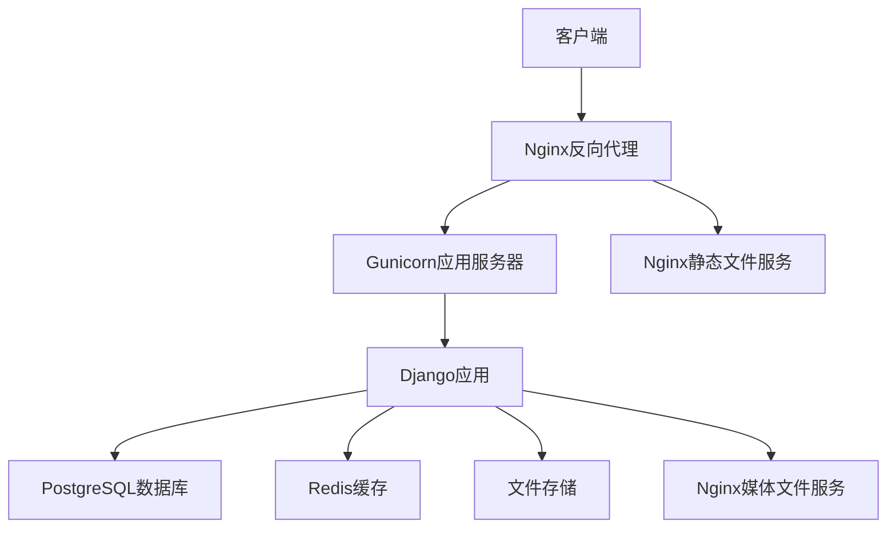
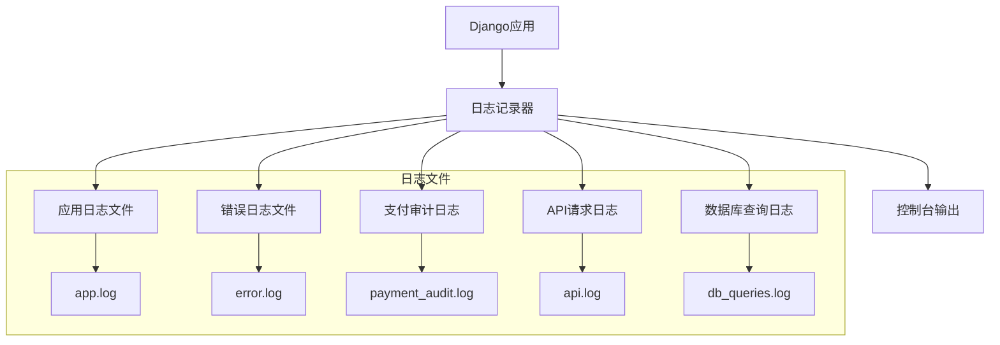

# 部署指南

<cite>
**本文档引用的文件**  
- [base.py](file://backend/backend/settings/base.py)
- [development.py](file://backend/backend/settings/development.py)
- [production.py](file://backend/backend/settings/production.py)
- [env_config.py](file://backend/backend/settings/env_config.py)
- [wsgi.py](file://backend/backend/wsgi.py)
- [asgi.py](file://backend/backend/asgi.py)
- [logging_config.py](file://backend/common/logging_config.py)
- [pyproject.toml](file://backend/pyproject.toml)
- [manage.py](file://backend/manage.py)
- [index.ts](file://frontend/config/index.ts)
- [prod.ts](file://frontend/config/prod.ts)
- [dev.ts](file://frontend/config/dev.ts)
- [package.json](file://frontend/package.json)
- [package.json](file://merchant/package.json)
</cite>

## 目录
1. [简介](#简介)
2. [环境配置](#环境配置)
3. [Docker部署方案](#docker部署方案)
4. [传统部署方式](#传统部署方式)
5. [配置文件管理](#配置文件管理)
6. [安全配置建议](#安全配置建议)
7. [监控和日志配置](#监控和日志配置)
8. [实际部署示例](#实际部署示例)
9. [结论](#结论)

## 简介
本部署指南详细介绍了电商业务小程序系统的部署流程和配置要求。文档涵盖了从开发环境到生产环境的完整部署方案，包括Docker部署、传统Nginx + Gunicorn部署、配置管理、安全设置以及监控日志配置。系统采用Django作为后端框架，支持微信小程序前端和商户管理后台，具有完善的环境感知配置机制和日志审计功能。

## 环境配置

本系统通过环境变量和配置文件实现开发环境与生产环境的差异化配置。核心配置通过`DJANGO_ENV`环境变量区分环境，支持`development`和`production`两种模式。

### 开发环境配置
开发环境配置位于`backend/backend/settings/development.py`，主要特点包括：
- `DEBUG=True`：启用调试模式，便于开发过程中的错误排查
- 使用SQLite数据库：简化开发环境的数据库配置
- 宽松的CORS策略：允许所有来源访问，避免开发时的跨域问题
- 允许所有主机访问：`ALLOWED_HOSTS=['*']`

### 生产环境配置
生产环境配置位于`backend/backend/settings/production.py`，强调安全性和稳定性：
- `DEBUG=False`：关闭调试模式，防止敏感信息泄露
- 使用PostgreSQL数据库：提供更好的性能和可靠性
- 严格的CORS策略：仅允许指定来源访问
- 启用HTTPS重定向和HSTS安全头
- 环境变量验证：启动时验证关键生产配置是否完整

**环境配置差异对比**

| 配置项 | 开发环境 | 生产环境 |
|--------|---------|---------|
| DEBUG模式 | True | False |
| 数据库 | SQLite | PostgreSQL |
| CORS策略 | 允许所有来源 | 仅允许指定来源 |
| 主机访问 | 允许所有主机 | 仅允许指定主机 |
| 日志级别 | DEBUG | INFO |
| 缓存 | 本地内存缓存 | 可配置为Redis等分布式缓存 |

**Section sources**
- [development.py](file://backend/backend/settings/development.py#L1-L20)
- [production.py](file://backend/backend/settings/production.py#L1-L35)
- [env_config.py](file://backend/backend/settings/env_config.py#L1-L252)

## Docker部署方案

### Dockerfile编写
虽然项目中未直接提供Dockerfile，但基于项目结构和依赖，可以创建如下的Dockerfile：

```dockerfile
FROM python:3.12-slim

WORKDIR /app

COPY backend/ ./backend/
COPY pyproject.toml uv.lock ./

RUN pip install uv && \
    uv pip install -r uv.lock

EXPOSE 8000

CMD ["uv", "run", "python", "backend/manage.py", "runserver", "0.0.0.0:8000"]
```

### docker-compose.yml配置
推荐的docker-compose.yml配置如下：

```yaml
version: '3.8'

services:
  db:
    image: postgres:16
    environment:
      POSTGRES_DB: electric_miniprogram
      POSTGRES_USER: admin
      POSTGRES_PASSWORD: password
    volumes:
      - postgres_data:/var/lib/postgresql/data
    ports:
      - "5432:5432"

  backend:
    build: .
    command: >
      sh -c "python backend/manage.py migrate &&
             python backend/manage.py runserver 0.0.0.0:8000"
    volumes:
      - ./backend:/app/backend
    ports:
      - "8000:8000"
    environment:
      DJANGO_ENV: development
      DJANGO_SETTINGS_MODULE: backend.settings.development
      POSTGRES_HOST: db
      POSTGRES_DB: electric_miniprogram
      POSTGRES_USER: admin
      POSTGRES_PASSWORD: password
    depends_on:
      - db

  frontend:
    build: ./frontend
    ports:
      - "8080:80"
    depends_on:
      - backend

volumes:
  postgres_data:
```

该配置实现了后端服务、数据库和前端的容器化部署，通过环境变量传递数据库连接信息，并确保服务间的正确依赖关系。

**Section sources**
- [pyproject.toml](file://backend/pyproject.toml#L1-L23)
- [env_config.py](file://backend/backend/settings/env_config.py#L1-L252)

## 传统部署方式

### Nginx + Gunicorn部署拓扑
传统的生产环境部署推荐使用Nginx作为反向代理服务器，Gunicorn作为WSGI服务器的架构：



**Diagram sources**
- [wsgi.py](file://backend/backend/wsgi.py#L1-L17)
- [production.py](file://backend/backend/settings/production.py#L1-L35)

### 部署步骤
1. **安装和配置Gunicorn**
   ```bash
   pip install gunicorn
   ```

2. **创建Gunicorn配置文件** (`gunicorn.conf.py`)
   ```python
   bind = "127.0.0.1:8000"
   workers = 4
   worker_class = "sync"
   worker_connections = 1000
   max_requests = 1000
   max_requests_jitter = 100
   timeout = 30
   keepalive = 2
   ```

3. **配置Nginx**
   ```nginx
   server {
       listen 80;
       server_name your-domain.com;
       
       location / {
           proxy_pass http://127.0.0.1:8000;
           proxy_set_header Host $host;
           proxy_set_header X-Real-IP $remote_addr;
           proxy_set_header X-Forwarded-For $proxy_add_x_forwarded_for;
           proxy_set_header X-Forwarded-Proto $scheme;
       }
       
       location /static/ {
           alias /path/to/static/files/;
           expires 1y;
           add_header Cache-Control "public, immutable";
       }
       
       location /media/ {
           alias /path/to/media/files/;
           expires 1y;
           add_header Cache-Control "public, immutable";
       }
   }
   ```

4. **启动服务**
   ```bash
   # 启动Gunicorn
   gunicorn backend.wsgi:application -c gunicorn.conf.py
   
   # 重启Nginx
   sudo systemctl restart nginx
   ```

**Section sources**
- [wsgi.py](file://backend/backend/wsgi.py#L1-L17)
- [production.py](file://backend/backend/settings/production.py#L1-L35)

## 配置文件管理

### .env文件配置
系统通过`.env`文件管理环境变量，关键配置包括：

```env
# Django基础配置
DJANGO_ENV=production
SECRET_KEY=your-secret-key-here
ALLOWED_HOSTS=your-domain.com,www.your-domain.com
CORS_ALLOWED_ORIGINS=https://your-domain.com,https://www.your-domain.com

# 数据库配置
POSTGRES_DB=electric_miniprogram
POSTGRES_USER=admin
POSTGRES_PASSWORD=your-db-password
POSTGRES_HOST=your-db-host
POSTGRES_PORT=5432

# 微信小程序配置
WECHAT_APPID=your-wechat-appid
WECHAT_SECRET=your-wechat-secret

# 海尔API配置
HAIER_CLIENT_ID=your-client-id
HAIER_CLIENT_SECRET=your-client-secret
HAIER_CUSTOMER_CODE=your-customer-code
HAIER_SEND_TO_CODE=your-send-to-code
HAIER_SUPPLIER_CODE=your-supplier-code
HAIER_PASSWORD=your-password
HAIER_SELLER_PASSWORD=your-seller-password

# YLH系统配置
YLH_USERNAME=your-ylh-username
YLH_PASSWORD=your-ylh-password
```

### 配置加载机制
系统通过`backend/backend/settings/env_config.py`实现配置加载：

1. **自动加载.env文件**：在模块导入时自动加载项目根目录下的.env文件
2. **环境感知**：根据`DJANGO_ENV`变量决定使用开发或生产配置
3. **生产环境验证**：启动时验证关键生产配置是否完整
4. **默认值设置**：为开发环境提供安全的默认值

**Section sources**
- [env_config.py](file://backend/backend/settings/env_config.py#L1-L252)
- [base.py](file://backend/backend/settings/base.py#L1-L263)

## 安全配置建议

### HTTPS设置
生产环境应启用HTTPS，相关配置：

```python
# backend/backend/settings/production.py
SECURE_SSL_REDIRECT = True  # 重定向HTTP到HTTPS
SECURE_HSTS_SECONDS = 31536000  # HSTS有效期1年
SECURE_HSTS_INCLUDE_SUBDOMAINS = True  # 包含子域名
SECURE_HSTS_PRELOAD = True  # 启用HSTS预加载
```

### CORS策略
系统通过`django-cors-headers`包管理跨域策略：

- **开发环境**：允许所有来源访问，便于开发调试
- **生产环境**：仅允许指定的前端域名访问，防止CSRF攻击

```python
# 生产环境CORS配置
CORS_ALLOW_ALL_ORIGINS = False
CORS_ALLOWED_ORIGINS = [
    "https://your-domain.com",
    "https://www.your-domain.com",
]
CORS_ALLOW_CREDENTIALS = True  # 允许携带凭证
```

### JWT令牌管理
系统使用`djangorestframework-simplejwt`进行认证：

```python
# backend/backend/settings/base.py
SIMPLE_JWT = {
    'ACCESS_TOKEN_LIFETIME': timedelta(days=7),  # 访问令牌有效期7天
    'REFRESH_TOKEN_LIFETIME': timedelta(days=30),  # 刷新令牌有效期30天
}
```

**安全建议**：
1. 生产环境的`SECRET_KEY`必须通过环境变量设置，不应硬编码
2. 定期轮换JWT密钥
3. 限制令牌有效期，避免长期有效的令牌
4. 启用令牌黑名单功能，支持令牌撤销

**Section sources**
- [production.py](file://backend/backend/settings/production.py#L1-L35)
- [base.py](file://backend/backend/settings/base.py#L1-L263)

## 监控和日志配置

### 日志配置
系统通过`backend/common/logging_config.py`实现全面的日志记录：



**Diagram sources**
- [logging_config.py](file://backend/common/logging_config.py#L1-L428)

### 日志级别配置
- **生产环境**：INFO级别，记录关键操作和错误
- **开发环境**：DEBUG级别，记录详细调试信息

### 日志文件管理
系统实现了自动化的日志文件管理：

1. **文件轮转**：按大小或时间进行日志轮转
2. **保留策略**：保留最近30天的应用日志和90天的支付审计日志
3. **平台兼容**：针对Windows和Linux系统使用不同的轮转策略
4. **编码支持**：统一使用UTF-8编码，支持中文日志

### 监控配置
系统提供了健康检查端点和监控URL：

```python
# common/monitor_urls.py
urlpatterns = [
    path('health/', health_check, name='health_check'),
    path('metrics/', metrics_view, name='metrics'),
]
```

建议配置外部监控系统定期检查`/health/`端点，确保服务可用性。

**Section sources**
- [logging_config.py](file://backend/common/logging_config.py#L1-L428)
- [base.py](file://backend/backend/settings/base.py#L1-L263)

## 实际部署示例

### 从代码部署到服务启动的完整流程

#### 1. 环境准备
```bash
# 创建虚拟环境
python -m venv venv
source venv/bin/activate

# 安装依赖
pip install uv
uv pip install -r uv.lock
```

#### 2. 数据库迁移
```bash
# 应用数据库迁移
python backend/manage.py migrate

# 创建超级用户
python backend/manage.py createsuperuser
```

#### 3. 静态文件收集
```bash
# 收集静态文件
python backend/manage.py collectstatic --noinput
```

#### 4. 启动开发服务器
```bash
# 开发环境启动
python backend/manage.py runserver 0.0.0.0:8000

# 或使用Gunicorn启动
gunicorn backend.wsgi:application --bind 0.0.0.0:8000
```

#### 5. 前端部署
```bash
# 进入前端目录
cd frontend

# 安装依赖
npm install

# 构建生产版本
npm run build:weapp

# 或启动开发服务器
npm run dev:weapp
```

#### 6. 商户管理后台部署
```bash
# 进入商户管理目录
cd merchant

# 安装依赖
npm install

# 构建生产版本
npm run build

# 启动开发服务器
npm run dev
```

#### 7. 环境变量配置示例
```bash
# 生产环境变量设置
export DJANGO_ENV=production
export DJANGO_SETTINGS_MODULE=backend.settings.production
export SECRET_KEY=your-secret-key
export ALLOWED_HOSTS=your-domain.com,www.your-domain.com
export CORS_ALLOWED_ORIGINS=https://your-domain.com
export POSTGRES_DB=electric_miniprogram
export POSTGRES_USER=admin
export POSTGRES_PASSWORD=your-password
export POSTGRES_HOST=localhost
```

#### 8. 系统启动脚本
```bash
#!/bin/bash
# start_production.sh

# 激活虚拟环境
source venv/bin/activate

# 应用数据库迁移
python backend/manage.py migrate --noinput

# 收集静态文件
python backend/manage.py collectstatic --noinput

# 启动Gunicorn
exec gunicorn backend.wsgi:application \
    --bind 0.0.0.0:8000 \
    --workers 4 \
    --worker-class sync \
    --timeout 30 \
    --max-requests 1000 \
    --max-requests-jitter 100 \
    --access-logfile - \
    --error-logfile -
```

**Section sources**
- [manage.py](file://backend/manage.py#L1-L23)
- [wsgi.py](file://backend/backend/wsgi.py#L1-L17)
- [env_config.py](file://backend/backend/settings/env_config.py#L1-L252)

## 结论
本部署指南详细介绍了电商业务小程序系统的完整部署方案。系统通过灵活的环境配置机制，实现了开发环境和生产环境的无缝切换。推荐的Docker部署方案简化了部署流程，而传统的Nginx + Gunicorn方案则提供了更高的性能和稳定性。完善的日志审计和监控配置确保了系统的可维护性和安全性。通过遵循本指南，可以快速、安全地部署和运行系统。