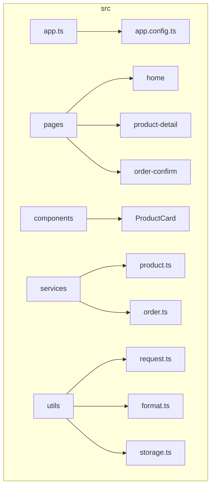
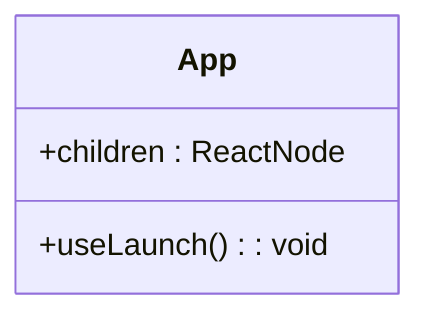
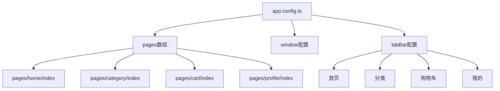
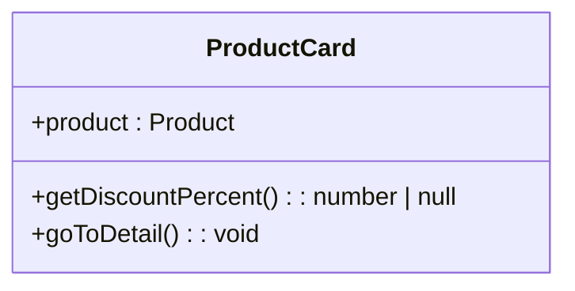
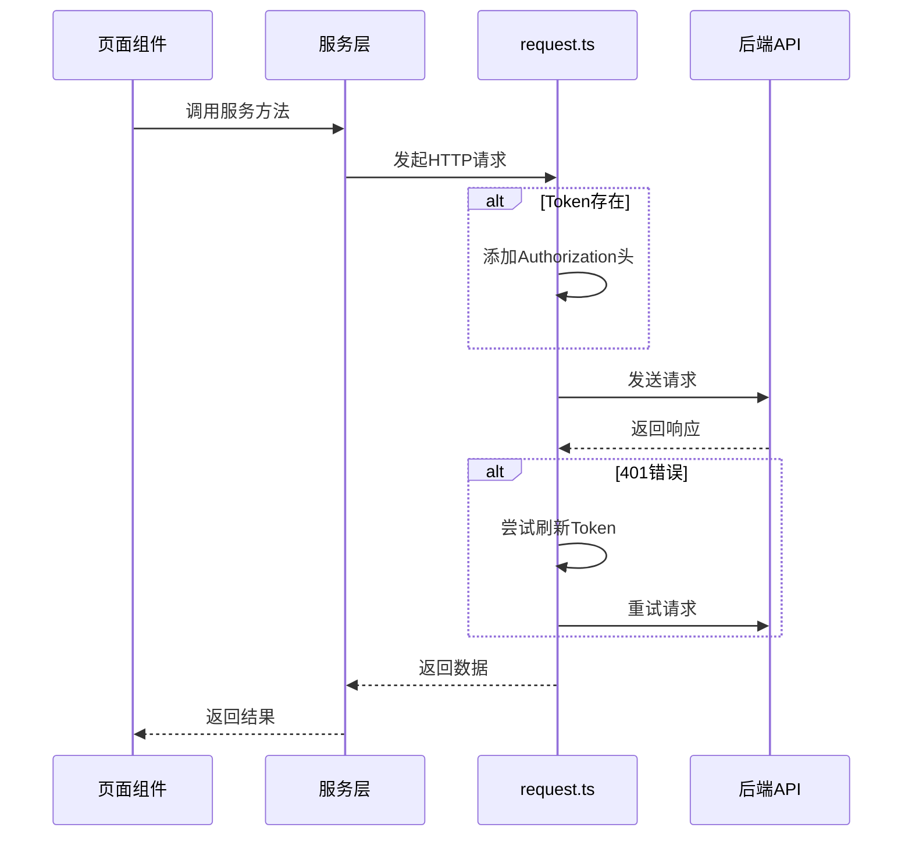
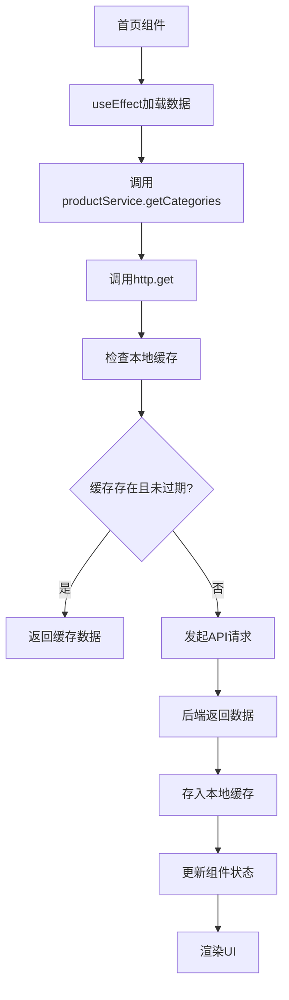

# 前端目录结构

<cite>
**本文档中引用的文件**   
- [app.ts](file://frontend/src/app.ts)
- [app.config.ts](file://frontend/src/app.config.ts)
- [home/index.tsx](file://frontend/src/pages/home/index.tsx)
- [product-detail/index.tsx](file://frontend/src/pages/product-detail/index.tsx)
- [order-confirm/index.tsx](file://frontend/src/pages/order-confirm/index.tsx)
- [ProductCard/index.tsx](file://frontend/src/components/ProductCard/index.tsx)
- [request.ts](file://frontend/src/utils/request.ts)
- [product.ts](file://frontend/src/services/product.ts)
- [order.ts](file://frontend/src/services/order.ts)
- [format.ts](file://frontend/src/utils/format.ts)
- [storage.ts](file://frontend/src/utils/storage.ts)
- [index.config.ts](file://frontend/src/pages/index/index.config.ts)
- [product-detail/index.config.ts](file://frontend/src/pages/product-detail/index.config.ts)
- [order-confirm/index.config.ts](file://frontend/src/pages/order-confirm/index.config.ts)
</cite>

## 目录

1. [项目结构](#项目结构)
2. [全局应用配置](#全局应用配置)
3. [路由与页面配置](#路由与页面配置)
4. [页面组件结构](#页面组件结构)
5. [可复用UI组件](#可复用ui组件)
6. [API服务层设计](#api服务层设计)
7. [工具函数应用](#工具函数应用)
8. [数据流示例](#数据流示例)

## 项目结构

该项目采用Taro框架构建的小程序架构，遵循标准的前端项目组织方式。src/目录下包含核心源码，主要分为以下几个部分：

- **assets/**：静态资源文件
- **components/**：可复用的UI组件
- **pages/**：各功能页面
- **services/**：API服务层
- **types/**：类型定义
- **utils/**：工具函数
- **app.ts** 和 **app.config.ts**：全局应用配置

**Diagram sources**
- [app.ts](file://frontend/src/app.ts)
- [app.config.ts](file://frontend/src/app.config.ts)

**Section sources**
- [app.ts](file://frontend/src/app.ts)
- [app.config.ts](file://frontend/src/app.config.ts)

## 全局应用配置

`app.ts` 文件是小程序的全局入口文件，负责定义应用级别的配置和生命周期。该文件通过Taro框架提供的`useLaunch`钩子监听应用启动事件，为整个应用提供统一的初始化逻辑。

**Diagram sources**
- [app.ts](file://frontend/src/app.ts#L1-L18)

**Section sources**
- [app.ts](file://frontend/src/app.ts#L1-L18)

## 路由与页面配置

`app.config.ts` 文件定义了小程序的全局路由配置，包括页面路径、窗口样式和底部导航栏。通过`defineAppConfig`函数导出配置对象，实现了声明式的路由管理。

页面路由配置采用数组形式定义，每个页面路径对应一个具体的页面组件。底部导航栏（tabBar）配置了四个主要功能入口：首页、分类、购物车和我的，提升了用户体验。

**Diagram sources**
- [app.config.ts](file://frontend/src/app.config.ts#L1-L50)

**Section sources**
- [app.config.ts](file://frontend/src/app.config.ts#L1-L50)

## 页面组件结构

### 首页分析

`pages/home/index.tsx` 是小程序的首页组件，实现了商品展示的核心功能。该页面通过`useEffect`钩子在组件挂载时加载分类、品牌和商品数据，采用分页加载机制优化性能。

页面结构包含搜索栏、轮播图、品类导航、品牌专区和商品列表等模块，通过`ScrollView`组件实现滚动加载功能。商品数据通过`ProductCard`组件进行渲染，形成良好的组件复用。

**Section sources**
- [home/index.tsx](file://frontend/src/pages/home/index.tsx#L1-L225)

### 商品详情页分析

`pages/product-detail/index.tsx` 实现了商品详情展示功能。该页面通过路由参数获取商品ID，调用服务层接口获取商品详情数据。

页面包含商品主图轮播、商品信息、规格选择、商品详情图片等模块，并实现了加入购物车和立即购买的功能。通过弹窗组件实现购买数量的选择，增强了用户交互体验。

**Section sources**
- [product-detail/index.tsx](file://frontend/src/pages/product-detail/index.tsx#L1-L311)

### 订单确认页分析

`pages/order-confirm/index.tsx` 处理订单确认流程。该页面接收商品ID和购买数量作为参数，获取商品信息和用户地址列表，为用户生成订单前的最后确认界面。

页面需要处理用户未登录的场景，确保交易安全。通过调用订单服务创建订单，并跳转到支付页面完成交易流程。

**Section sources**
- [order-confirm/index.tsx](file://frontend/src/pages/order-confirm/index.tsx)

## 可复用UI组件

### ProductCard组件分析

`components/ProductCard/index.tsx` 是一个可复用的商品卡片组件，用于在首页、搜索结果等场景中展示商品信息。

该组件实现了样式隔离，通过SCSS文件定义组件样式，避免样式污染。组件接收`Product`类型作为props，展示商品图片、名称、价格和销量等信息。

组件内部实现了点击跳转到商品详情页的功能，并根据商品折扣情况显示相应的优惠标签。通过`formatPrice`工具函数格式化价格显示，确保一致性。

**Diagram sources**
- [ProductCard/index.tsx](file://frontend/src/components/ProductCard/index.tsx#L1-L85)

**Section sources**
- [ProductCard/index.tsx](file://frontend/src/components/ProductCard/index.tsx#L1-L85)

## API服务层设计

### 统一HTTP客户端

`utils/request.ts` 文件封装了统一的HTTP客户端，通过`http`对象提供`get`、`post`、`put`、`patch`和`delete`等方法。该封装处理了请求加载状态、错误提示、Token认证等通用逻辑。

特别地，该文件实现了Token自动刷新机制。当请求返回401状态码时，自动尝试刷新Token并重试原请求，提升了用户体验。

**Diagram sources**
- [request.ts](file://frontend/src/utils/request.ts#L1-L162)

**Section sources**
- [request.ts](file://frontend/src/utils/request.ts#L1-L162)

### 商品服务

`services/product.ts` 定义了商品相关的API服务，通过`productService`对象导出。该服务封装了获取商品列表、商品详情、分类列表、品牌列表等方法。

服务层与类型系统紧密结合，使用`Product`、`Category`、`Brand`等类型定义确保类型安全。所有方法返回Promise，便于在页面组件中使用async/await语法。

**Section sources**
- [product.ts](file://frontend/src/services/product.ts#L1-L64)

### 订单服务

`services/order.ts` 处理订单相关的业务逻辑，包括创建订单、获取订单列表、取消订单等操作。该服务与购物车服务协同工作，完成从选购到支付的完整流程。

**Section sources**
- [order.ts](file://frontend/src/services/order.ts#L1-L47)

## 工具函数应用

### 数据格式化

`utils/format.ts` 提供了常用的数据格式化函数，如`formatPrice`用于格式化价格显示，`formatNumber`用于处理大数字的显示（如"1.2万"），`formatTime`用于将时间戳转换为友好的时间描述。

这些工具函数在多个页面和组件中被复用，确保了数据展示的一致性。

**Section sources**
- [format.ts](file://frontend/src/utils/format.ts#L1-L54)

### 本地存储管理

`utils/storage.ts` 封装了本地存储功能，提供了带过期时间的缓存机制。通过`Storage`对象提供`set`、`get`、`remove`和`clear`方法。

该工具在`home`页面中用于缓存分类和品牌数据，减少重复请求，提升页面加载速度。`CACHE_KEYS`常量定义了缓存键名，避免硬编码。

**Section sources**
- [storage.ts](file://frontend/src/utils/storage.ts#L1-L45)

## 数据流示例

以下是从首页发起请求到服务层调用的完整数据流：

**Diagram sources**
- [home/index.tsx](file://frontend/src/pages/home/index.tsx#L26-L47)
- [product.ts](file://frontend/src/services/product.ts#L35-L39)
- [request.ts](file://frontend/src/utils/request.ts#L137-L148)
- [storage.ts](file://frontend/src/utils/storage.ts#L4-L26)

**Section sources**
- [home/index.tsx](file://frontend/src/pages/home/index.tsx#L26-L47)
- [product.ts](file://frontend/src/services/product.ts#L35-L39)
- [request.ts](file://frontend/src/utils/request.ts#L137-L148)
- [storage.ts](file://frontend/src/utils/storage.ts#L4-L26)