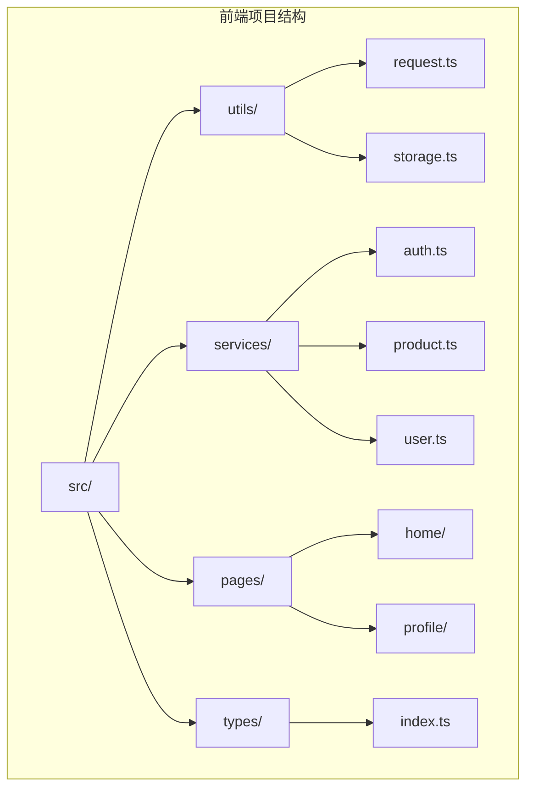
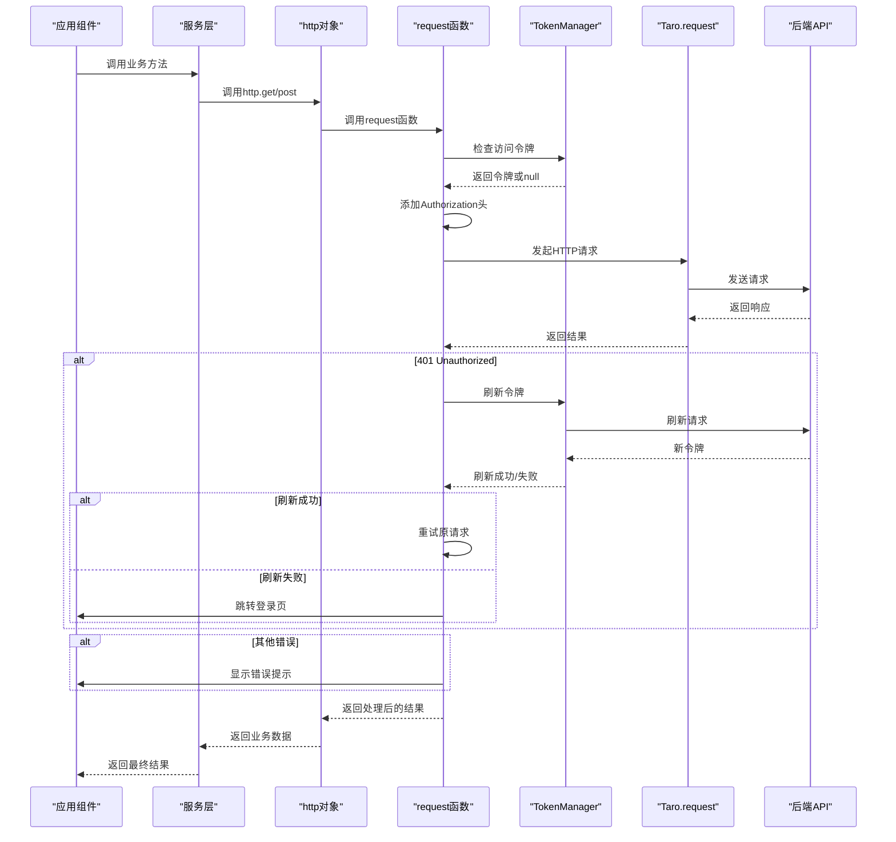
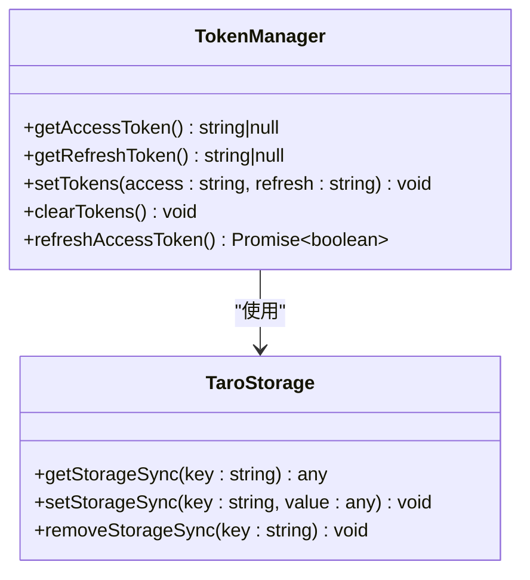
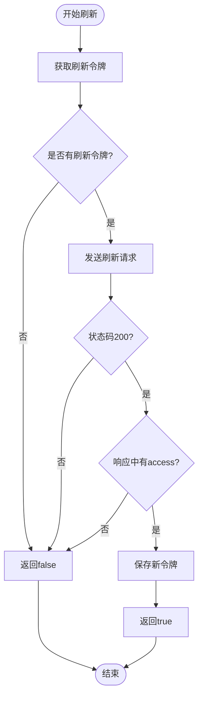
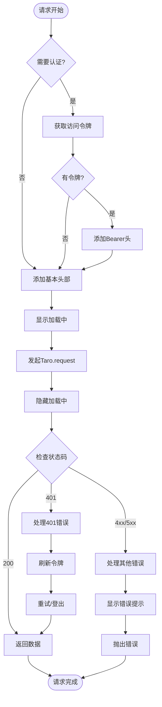
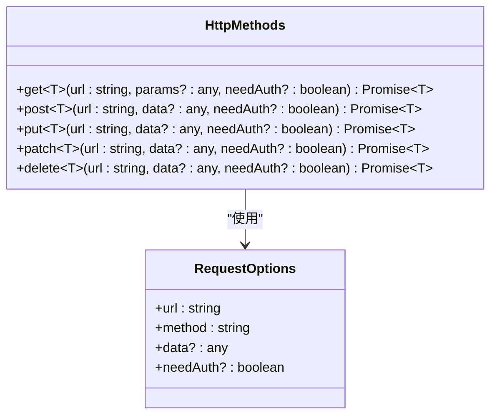
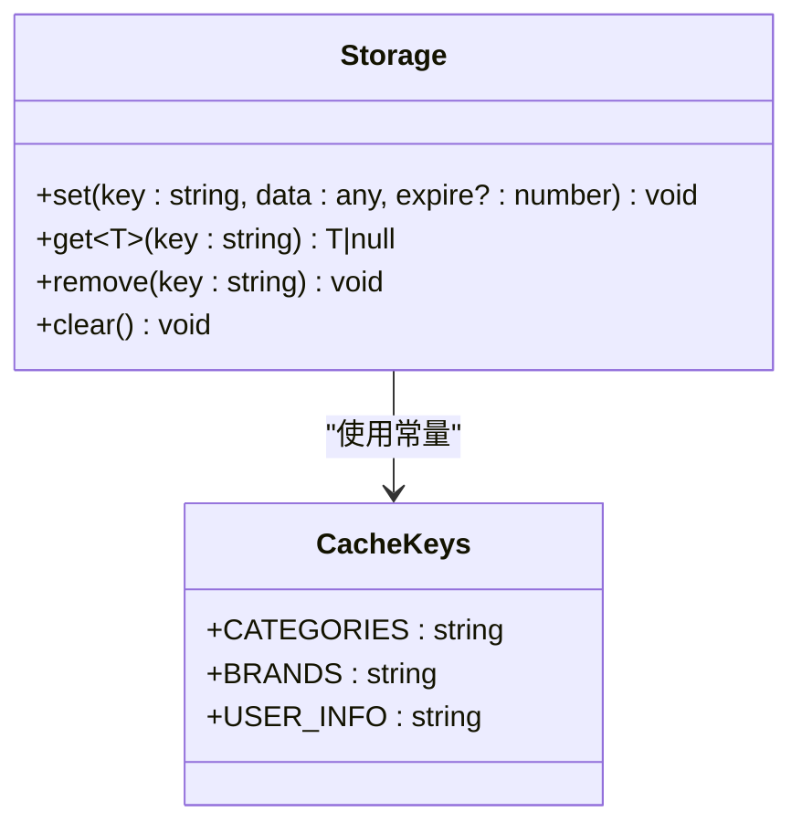
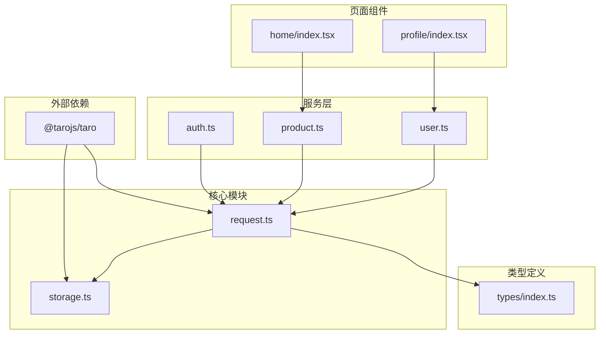

# API请求封装

<cite>
**本文档中引用的文件**
- [request.ts](file://frontend/src/utils/request.ts)
- [storage.ts](file://frontend/src/utils/storage.ts)
- [auth.ts](file://frontend/src/services/auth.ts)
- [product.ts](file://frontend/src/services/product.ts)
- [user.ts](file://frontend/src/services/user.ts)
- [home/index.tsx](file://frontend/src/pages/home/index.tsx)
- [index.ts](file://frontend/src/types/index.ts)
- [dev.ts](file://frontend/config/dev.ts)
- [prod.ts](file://frontend/config/prod.ts)
</cite>

## 目录
1. [简介](#简介)
2. [项目结构](#项目结构)
3. [核心组件](#核心组件)
4. [架构概览](#架构概览)
5. [详细组件分析](#详细组件分析)
6. [依赖关系分析](#依赖关系分析)
7. [性能考虑](#性能考虑)
8. [故障排除指南](#故障排除指南)
9. [结论](#结论)

## 简介

本文档详细介绍了基于Taro框架的前端统一HTTP客户端设计，重点解析了`request.ts`文件中基于Taro.request封装的request函数设计。该系统提供了完整的JWT令牌管理、请求拦截与响应处理、错误处理和用户体验优化等功能。

## 项目结构

前端项目采用模块化架构，主要包含以下关键目录：

**图表来源**
- [request.ts](file://frontend/src/utils/request.ts#L1-L162)
- [storage.ts](file://frontend/src/utils/storage.ts#L1-L45)

**章节来源**
- [request.ts](file://frontend/src/utils/request.ts#L1-L162)
- [storage.ts](file://frontend/src/utils/storage.ts#L1-L45)

## 核心组件

### TokenManager类
TokenManager是JWT令牌管理的核心类，负责令牌的存储、读取和刷新机制：

- **getAccessToken()**: 从本地存储获取访问令牌
- **getRefreshToken()**: 从本地存储获取刷新令牌
- **setTokens(access, refresh)**: 同时设置访问和刷新令牌
- **clearTokens()**: 清除所有令牌
- **refreshAccessToken()**: 异步刷新访问令牌

### request函数
统一的HTTP请求函数，提供完整的请求生命周期管理：

- 自动添加Bearer令牌
- 展示加载中状态
- 处理401未授权错误
- 统一错误提示处理
- 网络异常捕获

### http对象
便捷的HTTP方法封装，简化API调用：

- get(): GET请求方法
- post(): POST请求方法  
- put(): PUT请求方法
- patch(): PATCH请求方法
- delete(): DELETE请求方法

**章节来源**
- [request.ts](file://frontend/src/utils/request.ts#L19-L58)
- [request.ts](file://frontend/src/utils/request.ts#L62-L161)

## 架构概览

**图表来源**
- [request.ts](file://frontend/src/utils/request.ts#L62-L132)
- [auth.ts](file://frontend/src/services/auth.ts#L6-L21)

## 详细组件分析

### TokenManager类详细分析

TokenManager类实现了完整的JWT令牌生命周期管理：

**图表来源**
- [request.ts](file://frontend/src/utils/request.ts#L19-L58)

#### getAccessToken方法实现
该方法从本地存储中获取访问令牌，用于API认证：

- 使用Taro.getStorageSync读取存储
- 返回null表示没有有效令牌
- 实现了透明的令牌获取机制

#### refreshAccessToken方法实现
令牌刷新是系统的关键安全特性：

**图表来源**
- [request.ts](file://frontend/src/utils/request.ts#L39-L57)

**章节来源**
- [request.ts](file://frontend/src/utils/request.ts#L19-L58)

### request函数详细分析

request函数是整个HTTP客户端的核心，实现了完整的请求生命周期管理：

#### 请求拦截机制

**图表来源**
- [request.ts](file://frontend/src/utils/request.ts#L62-L132)

#### 错误处理策略
系统实现了多层次的错误处理机制：

1. **401未授权处理**: 自动刷新令牌并重试
2. **429限流处理**: 显示友好的限流提示
3. **网络错误处理**: 捕获网络异常并提示用户
4. **业务错误处理**: 提取错误消息并显示

**章节来源**
- [request.ts](file://frontend/src/utils/request.ts#L62-L132)

### http对象便捷方法分析

http对象提供了RESTful风格的便捷方法：

**图表来源**
- [request.ts](file://frontend/src/utils/request.ts#L135-L161)

#### GET请求参数处理
GET请求的查询参数序列化是一个重要的功能：

- 支持复杂对象参数的序列化
- 自动过滤undefined和null值
- URL编码确保参数安全性
- 智能处理已有查询字符串的情况

**章节来源**
- [request.ts](file://frontend/src/utils/request.ts#L135-L161)

### 缓存管理系统

Storage类提供了完整的缓存管理功能：

**图表来源**
- [storage.ts](file://frontend/src/utils/storage.ts#L4-L44)

**章节来源**
- [storage.ts](file://frontend/src/utils/storage.ts#L4-L44)

## 依赖关系分析

**图表来源**
- [request.ts](file://frontend/src/utils/request.ts#L1-L1)
- [storage.ts](file://frontend/src/utils/storage.ts#L1-L1)
- [auth.ts](file://frontend/src/services/auth.ts#L1-L2)
- [product.ts](file://frontend/src/services/product.ts#L1-L2)

**章节来源**
- [request.ts](file://frontend/src/utils/request.ts#L1-L162)
- [storage.ts](file://frontend/src/utils/storage.ts#L1-L45)

## 性能考虑

### 请求优化策略

1. **智能缓存机制**: 使用Storage类实现数据缓存，减少重复请求
2. **请求去重**: 在业务层实现请求去重逻辑
3. **懒加载**: 页面组件按需加载数据
4. **分页加载**: 大数据集采用分页方式加载

### 错误恢复机制

1. **自动重试**: 401错误时自动刷新令牌并重试
2. **降级处理**: 缓存失效时提供降级数据
3. **网络监控**: 监控网络状态并提供相应提示

### 用户体验优化

1. **加载状态**: 统一的加载中提示
2. **错误反馈**: 友好的错误提示信息
3. **无感刷新**: 令牌刷新过程对用户透明

## 故障排除指南

### 常见问题及解决方案

#### 1. 令牌过期问题
**症状**: 401错误频繁出现
**解决方案**: 
- 检查TokenManager.refreshAccessToken实现
- 确保刷新令牌的有效性
- 实现合理的令牌刷新策略

#### 2. 请求超时问题
**症状**: 请求长时间无响应
**解决方案**:
- 在request函数中添加超时控制
- 实现请求取消机制
- 提供超时重试选项

#### 3. 缓存失效问题
**症状**: 数据更新不及时
**解决方案**:
- 实现缓存更新策略
- 提供手动刷新功能
- 设置合理的缓存过期时间

**章节来源**
- [request.ts](file://frontend/src/utils/request.ts#L93-L105)
- [storage.ts](file://frontend/src/utils/storage.ts#L15-L26)

## 结论

前端统一HTTP客户端系统提供了完整而优雅的API请求解决方案。通过TokenManager的令牌管理、request函数的请求生命周期控制、http对象的便捷方法封装，以及Storage类的缓存管理，构建了一个健壮、可维护且用户体验优秀的前端架构。

### 主要优势

1. **安全性**: 完整的JWT令牌管理和自动刷新机制
2. **易用性**: 简洁的API接口和智能的错误处理
3. **性能**: 智能缓存和请求优化策略
4. **可维护性**: 模块化的代码结构和清晰的职责分离

### 扩展建议

1. **请求缓存**: 实现更复杂的缓存策略，支持条件缓存
2. **重试机制**: 添加指数退避重试算法
3. **监控系统**: 集成请求监控和性能分析
4. **测试覆盖**: 增加单元测试和集成测试覆盖率

这个系统为小程序应用提供了坚实的基础架构，能够满足现代Web应用的各种需求，同时保持代码的简洁性和可扩展性。