# 业务服务实现

<cite>
**本文档引用的文件**
- [product.ts](file://frontend/src/services/product.ts)
- [order.ts](file://frontend/src/services/order.ts)
- [auth.ts](file://frontend/src/services/auth.ts)
- [address.ts](file://frontend/src/services/address.ts)
- [user.ts](file://frontend/src/services/user.ts)
- [cart.ts](file://frontend/src/services/cart.ts)
- [payment.ts](file://frontend/src/services/payment.ts)
- [category.ts](file://frontend/src/services/category.ts)
- [brand.ts](file://frontend/src/services/brand.ts)
- [request.ts](file://frontend/src/utils/request.ts)
- [index.ts](file://frontend/src/types/index.ts)
- [product-detail/index.tsx](file://frontend/src/pages/product-detail/index.tsx)
- [order-list/index.tsx](file://frontend/src/pages/order-list/index.tsx)
- [cart/index.tsx](file://frontend/src/pages/cart/index.tsx)
- [profile/index.tsx](file://frontend/src/pages/profile/index.tsx)
</cite>

## 目录
1. [概述](#概述)
2. [统一请求封装](#统一请求封装)
3. [核心业务服务模块](#核心业务服务模块)
4. [商品服务详解](#商品服务详解)
5. [订单服务详解](#订单服务详解)
6. [认证服务详解](#认证服务详解)
7. [地址服务详解](#地址服务详解)
8. [用户服务详解](#用户服务详解)
9. [购物车与支付服务](#购物车与支付服务)
10. [最佳实践与类型安全](#最佳实践与类型安全)
11. [总结](#总结)

## 概述

本文档详细阐述了Electric小程序前端业务服务层的实现架构，重点分析了基于统一请求封装的各业务模块如何实现具体业务逻辑。整个服务层采用模块化设计，每个业务领域都有独立的服务模块，通过统一的HTTP请求封装提供类型安全的API接口。

## 统一请求封装

### 架构概览

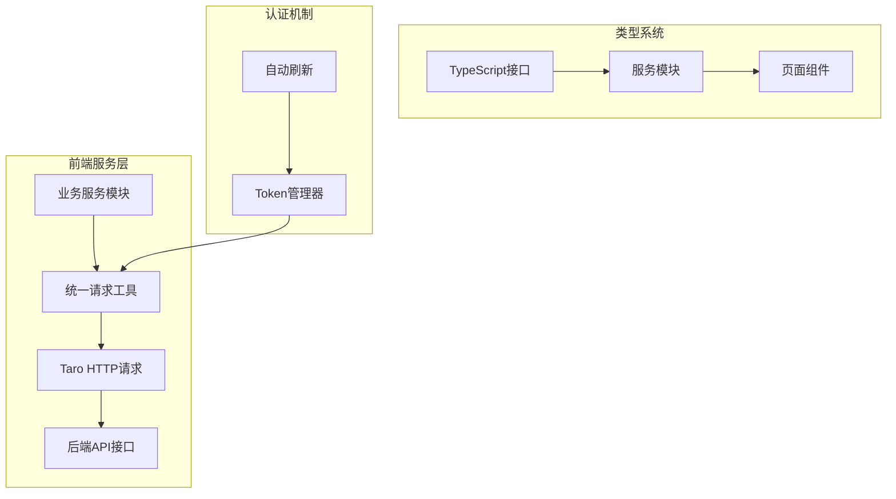

**图表来源**
- [request.ts](file://frontend/src/utils/request.ts#L1-L162)

### 请求工具核心功能

统一请求工具提供了完整的HTTP请求封装，包含以下核心特性：

1. **自动认证处理**：通过TokenManager管理访问令牌和刷新令牌
2. **错误处理机制**：统一处理401、429等HTTP状态码
3. **类型安全保证**：通过泛型确保返回数据的类型正确性
4. **加载状态管理**：自动显示/隐藏加载提示
5. **请求重试机制**：Token过期时自动刷新并重试

**章节来源**
- [request.ts](file://frontend/src/utils/request.ts#L1-L162)

## 核心业务服务模块

### 服务模块组织架构

```mermaid
classDiagram
class ProductService {
+getProducts(params) Promise~ProductListResponse~
+getProductDetail(id) Promise~Product~
+getProductsByCategory(params) Promise~ProductListResponse~
+getProductsByBrand(brand) Promise~ProductListResponse~
+getCategories() Promise~Category[]~
+getBrands() Promise~Brand[]~
+getRecommendations(params) Promise~Product[]~
+getRelatedProducts(id, limit) Promise~Product[]~
}
class OrderService {
+createOrder(data) Promise~CreateOrderResponse~
+createBatchOrders(data) Promise~BatchOrderResponse~
+getMyOrders(params) Promise~PaginatedResponse~Order~~
+getOrderDetail(id) Promise~Order~
+cancelOrder(id) Promise~Order~
}
class AuthService {
+login() Promise~LoginResponse~
+getUserProfile() Promise~User~
+updateUserProfile(data) Promise~User~
}
class AddressService {
+getAddresses() Promise~Address[]~
+createAddress(data) Promise~Address~
+updateAddress(id, data) Promise~Address~
+deleteAddress(id) Promise~void~
+setDefaultAddress(id) Promise~Object~
+parseAddress(address) Promise~ParseAddressResponse~
}
class UserService {
+getProfile() Promise~User~
+updateProfile(data) Promise~User~
+getStatistics() Promise~Object~
}
class CartService {
+getCart() Promise~Cart~
+addItem(product_id, quantity) Promise~Cart~
+updateItem(product_id, quantity) Promise~Cart~
+removeItem(product_id) Promise~Cart~
+clearCart() Promise~Cart~
}
class PaymentService {
+getPayments(params) Promise~PaginatedResponse~Payment~~
+createPayment(data) Promise~Payment~
+getPaymentDetail(id) Promise~Payment~
+startPayment(id) Promise~Payment~
+succeedPayment(id) Promise~Payment~
+failPayment(id) Promise~Payment~
+cancelPayment(id) Promise~Payment~
+expirePayment(id) Promise~Payment~
}
```

**图表来源**
- [product.ts](file://frontend/src/services/product.ts#L4-L63)
- [order.ts](file://frontend/src/services/order.ts#L4-L46)
- [auth.ts](file://frontend/src/services/auth.ts#L5-L21)
- [address.ts](file://frontend/src/services/address.ts#L4-L43)
- [user.ts](file://frontend/src/services/user.ts#L4-L19)
- [cart.ts](file://frontend/src/services/cart.ts#L4-L44)
- [payment.ts](file://frontend/src/services/payment.ts#L4-L52)

## 商品服务详解

### getProductList 方法实现

商品服务的核心方法之一是获取商品列表，展示了统一请求封装的典型使用模式：

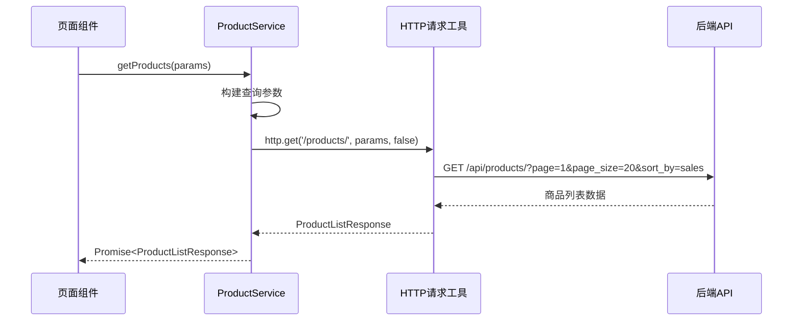

**图表来源**
- [product.ts](file://frontend/src/services/product.ts#L6-L13)
- [request.ts](file://frontend/src/utils/request.ts#L136-L147)

### 关键特性分析

1. **参数类型安全**：通过接口定义确保传入参数的正确性
2. **灵活查询**：支持分页、排序、搜索等多种查询条件
3. **自动类型推断**：返回值自动推断为ProductListResponse类型
4. **可选认证**：通过needAuth参数控制是否需要认证

### getProductDetail 方法实现

商品详情获取展示了单个资源查询的典型模式：

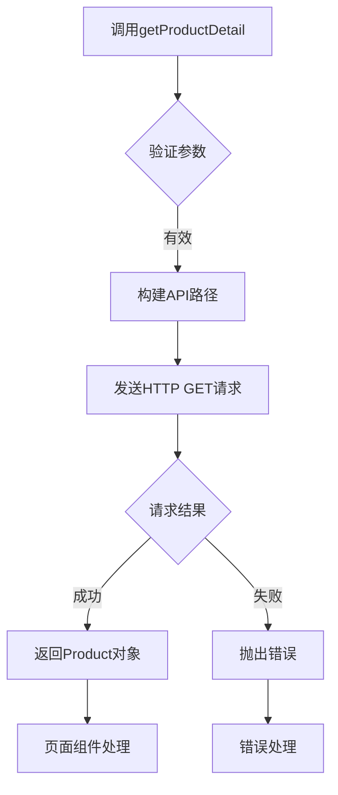

**图表来源**
- [product.ts](file://frontend/src/services/product.ts#L16-L18)

**章节来源**
- [product.ts](file://frontend/src/services/product.ts#L1-L64)

## 订单服务详解

### submitOrder 方法实现

订单提交是电商系统的核心业务流程，展示了复杂数据结构的构造和处理：

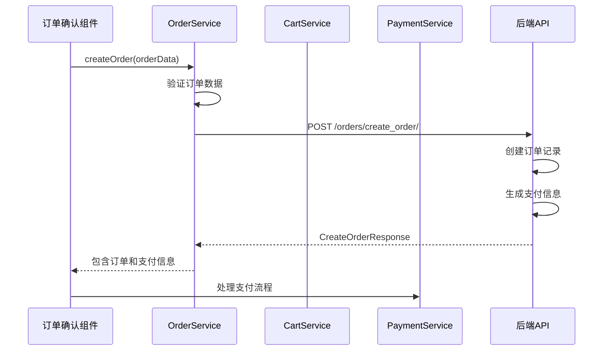

**图表来源**
- [order.ts](file://frontend/src/services/order.ts#L6-L13)

### 订单数据结构特点

订单服务的数据结构体现了电商系统的复杂性：

| 字段名 | 类型 | 描述 | 必填 |
|--------|------|------|------|
| product_id | number | 商品ID | 是 |
| address_id | number | 收货地址ID | 是 |
| quantity | number | 购买数量 | 是 |
| note | string | 订单备注 | 否 |

### getMyOrders 方法实现

用户订单列表获取展示了分页查询的完整实现：

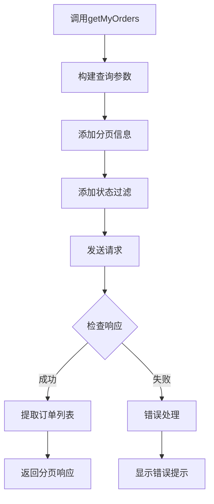

**图表来源**
- [order.ts](file://frontend/src/services/order.ts#L29-L35)

**章节来源**
- [order.ts](file://frontend/src/services/order.ts#L1-L47)

## 认证服务详解

### 微信登录认证流程

认证服务实现了完整的微信登录和用户管理流程：

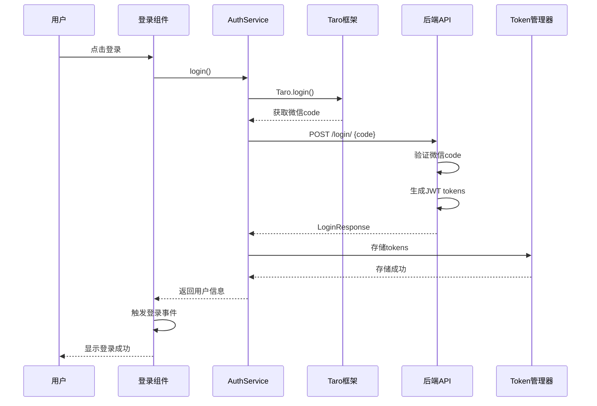

**图表来源**
- [auth.ts](file://frontend/src/services/auth.ts#L7-L10)
- [request.ts](file://frontend/src/utils/request.ts#L29-L37)

### 认证流程的关键特性

1. **零信任认证**：每次请求都携带认证令牌
2. **自动刷新**：Token过期时自动刷新机制
3. **安全存储**：本地存储加密的安全令牌
4. **事件通知**：登录状态变化时的通知机制

### 用户信息管理

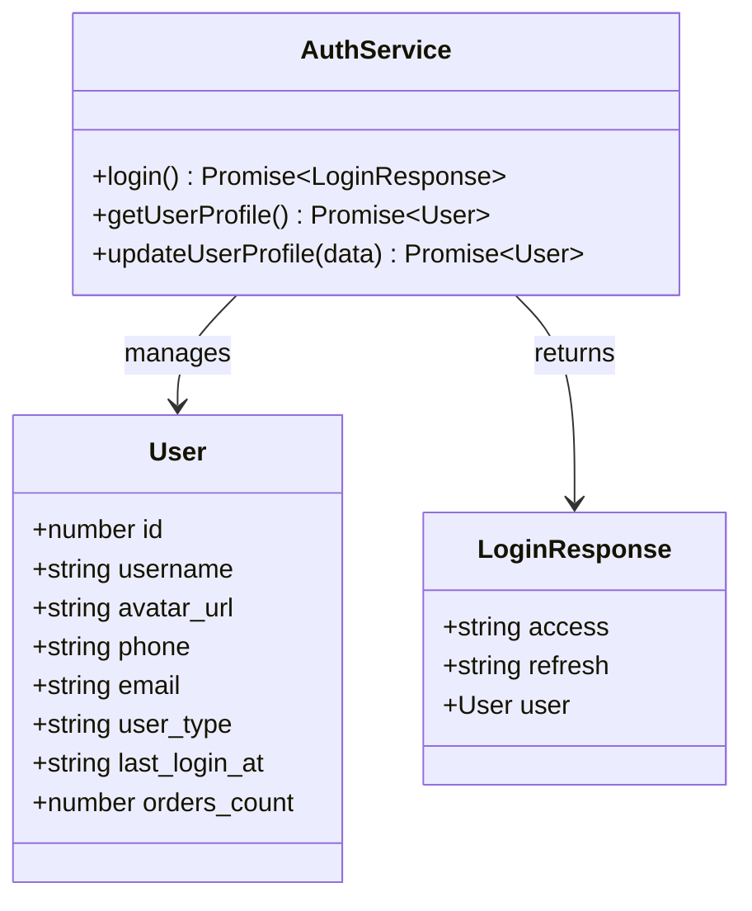

**图表来源**
- [auth.ts](file://frontend/src/services/auth.ts#L1-L22)
- [index.ts](file://frontend/src/types/index.ts#L1-L17)

**章节来源**
- [auth.ts](file://frontend/src/services/auth.ts#L1-L22)

## 地址服务详解

### CRUD操作封装

地址服务提供了完整的收货地址管理功能：

```mermaid
flowchart TD
A[地址服务调用] --> B{操作类型}
B --> |GET| C[获取地址列表]
B --> |POST| D[创建新地址]
B --> |PATCH| E[更新现有地址]
B --> |DELETE| F[删除地址]
B --> |POST| G[设为默认地址]
C --> H[HTTP GET /addresses/]
D --> I[HTTP POST /addresses/]
E --> J[HTTP PATCH /addresses/{id}/]
F --> K[HTTP DELETE /addresses/{id}/]
G --> L[HTTP POST /addresses/{id}/set_default/]
H --> M[返回Address数组]
I --> N[返回新Address对象]
J --> O[返回更新后的Address]
K --> P[返回状态信息]
L --> Q[返回设置结果]
```

**图表来源**
- [address.ts](file://frontend/src/services/address.ts#L4-L43)

### 地址解析功能

地址智能解析展示了高级功能的实现：

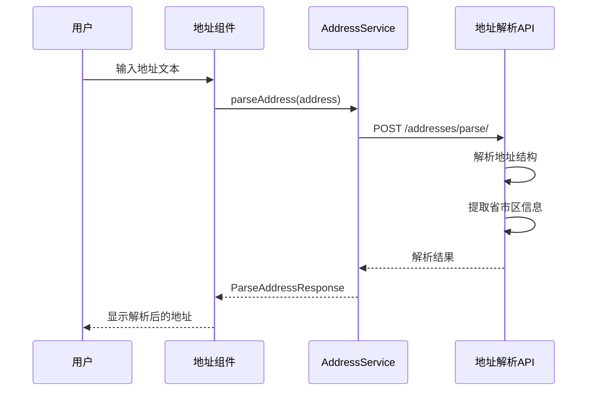

**图表来源**
- [address.ts](file://frontend/src/services/address.ts#L31-L42)

### 地址数据结构

| 字段名 | 类型 | 描述 | 必填 |
|--------|------|------|------|
| id | number | 地址ID | 是 |
| contact_name | string | 联系人姓名 | 是 |
| phone | string | 联系电话 | 是 |
| province | string | 省份 | 是 |
| city | string | 城市 | 是 |
| district | string | 区县 | 是 |
| detail | string | 详细地址 | 是 |
| is_default | boolean | 是否默认地址 | 是 |

**章节来源**
- [address.ts](file://frontend/src/services/address.ts#L1-L44)

## 用户服务详解

### 用户信息管理

用户服务专注于用户基本信息的管理：

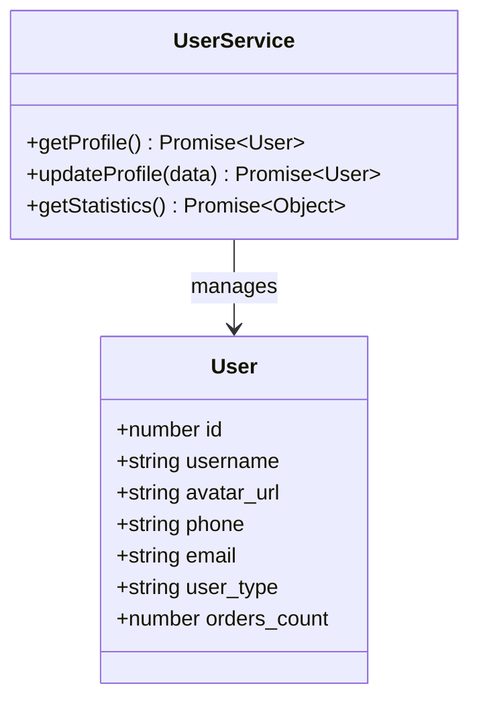

**图表来源**
- [user.ts](file://frontend/src/services/user.ts#L4-L19)

### 统计信息获取

用户统计功能展示了轻量级数据获取的实现：

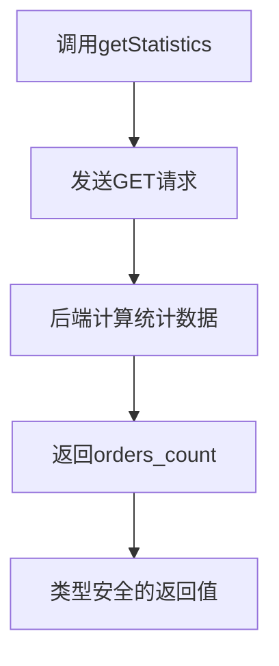

**图表来源**
- [user.ts](file://frontend/src/services/user.ts#L16-L18)

**章节来源**
- [user.ts](file://frontend/src/services/user.ts#L1-L20)

## 购物车与支付服务

### 购物车服务架构

购物车服务提供了完整的商品管理功能：

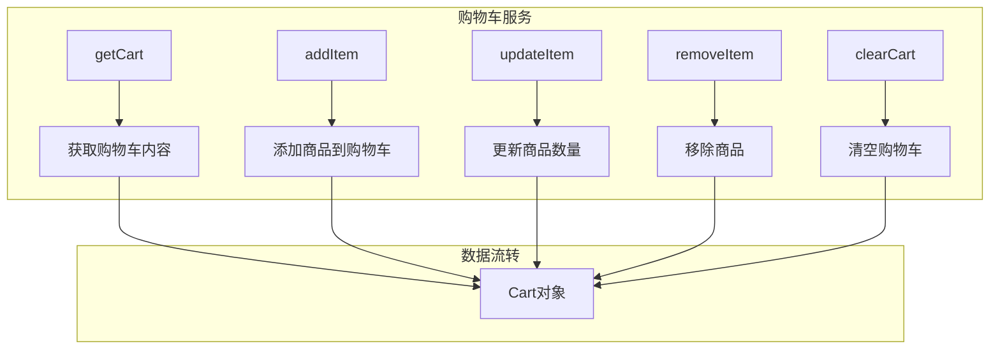

**图表来源**
- [cart.ts](file://frontend/src/services/cart.ts#L4-L44)

### 支付服务状态机

支付服务实现了完整的支付生命周期管理：

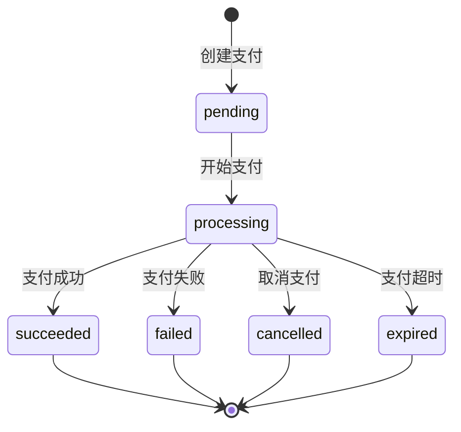

**图表来源**
- [payment.ts](file://frontend/src/services/payment.ts#L4-L52)

**章节来源**
- [cart.ts](file://frontend/src/services/cart.ts#L1-L45)
- [payment.ts](file://frontend/src/services/payment.ts#L1-L53)

## 最佳实践与类型安全

### 类型安全保证

整个服务层采用了严格的TypeScript类型系统：

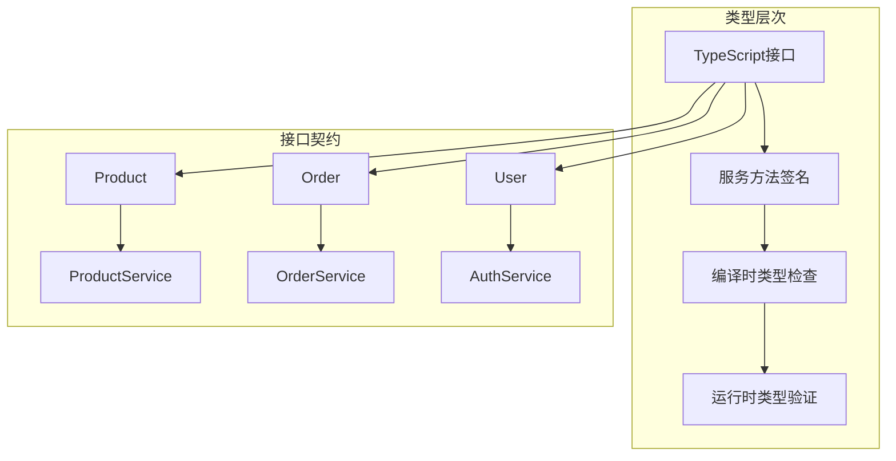

**图表来源**
- [index.ts](file://frontend/src/types/index.ts#L1-L144)

### 错误处理策略

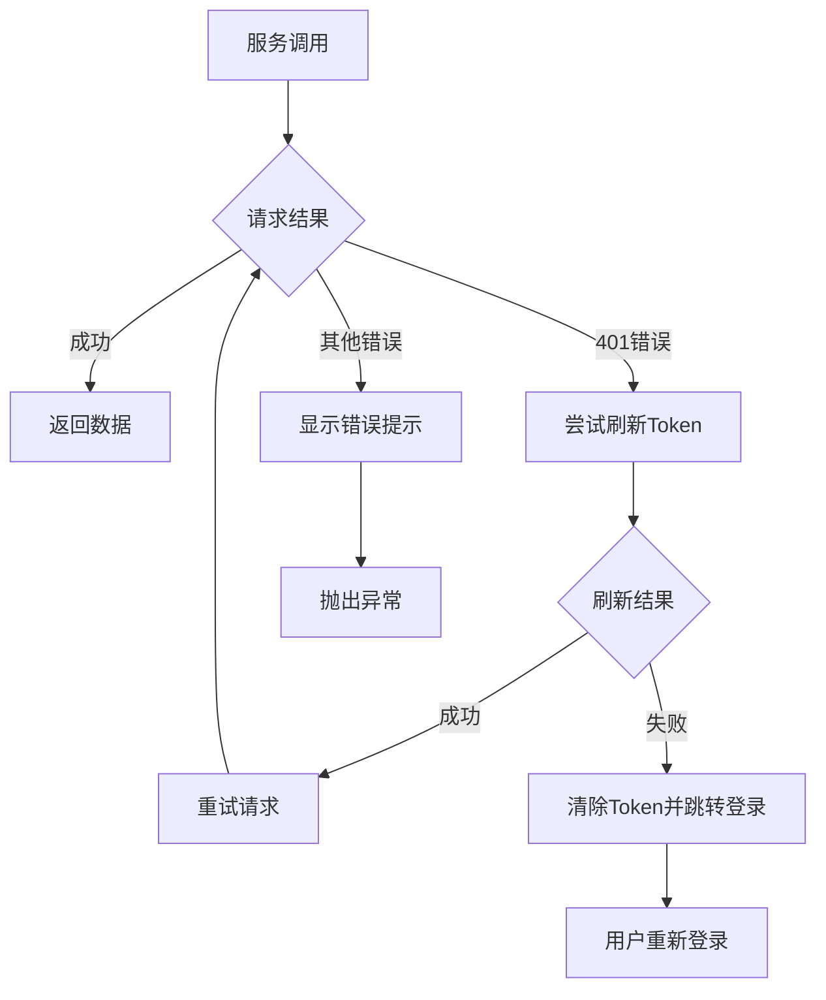

**图表来源**
- [request.ts](file://frontend/src/utils/request.ts#L93-L104)

### 页面组件集成模式

页面组件通过标准化的方式集成服务模块：

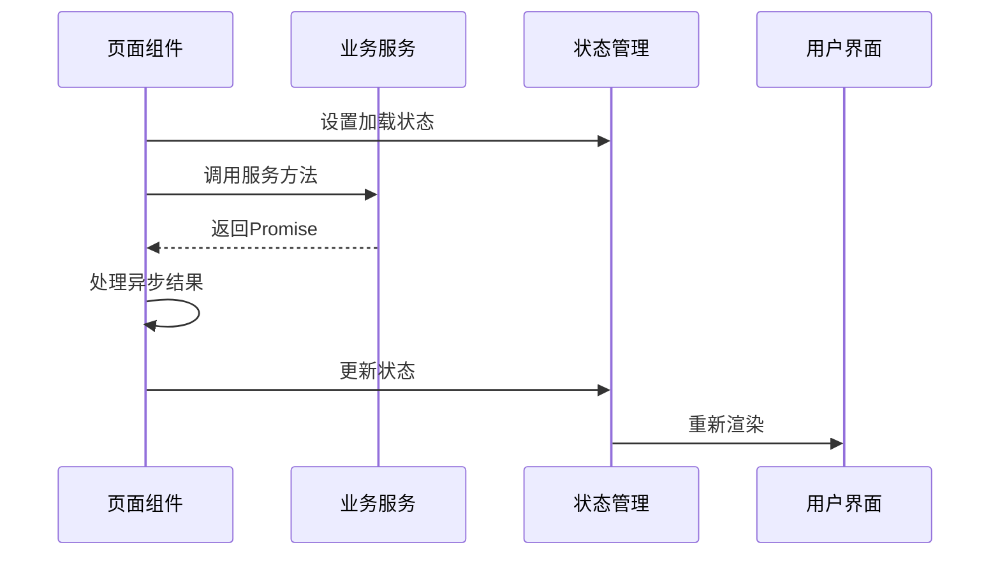

**图表来源**
- [product-detail/index.tsx](file://frontend/src/pages/product-detail/index.tsx#L27-L36)
- [order-list/index.tsx](file://frontend/src/pages/order-list/index.tsx#L35-L68)

**章节来源**
- [index.ts](file://frontend/src/types/index.ts#L1-L144)
- [request.ts](file://frontend/src/utils/request.ts#L1-L162)

## 总结

Electric小程序的业务服务层展现了现代前端架构的最佳实践：

1. **模块化设计**：每个业务领域都有独立的服务模块，职责清晰
2. **统一抽象**：通过统一的请求封装简化了HTTP通信
3. **类型安全**：完整的TypeScript类型系统确保了代码质量
4. **错误处理**：完善的错误处理和用户体验优化
5. **扩展性**：良好的架构设计支持功能的快速扩展

这种设计模式不仅提高了开发效率，还确保了代码的可维护性和可测试性，为构建高质量的小程序应用奠定了坚实的基础。