# 服务集成

<cite>
**本文档中引用的文件**
- [frontend/src/utils/request.ts](file://frontend/src/utils/request.ts)
- [frontend/src/services/product.ts](file://frontend/src/services/product.ts)
- [frontend/src/services/order.ts](file://frontend/src/services/order.ts)
- [frontend/src/services/auth.ts](file://frontend/src/services/auth.ts)
- [frontend/src/services/cart.ts](file://frontend/src/services/cart.ts)
- [frontend/src/services/address.ts](file://frontend/src/services/address.ts)
- [frontend/src/services/user.ts](file://frontend/src/services/user.ts)
- [frontend/src/types/index.ts](file://frontend/src/types/index.ts)
- [frontend/src/utils/storage.ts](file://frontend/src/utils/storage.ts)
- [frontend/src/pages/home/index.tsx](file://frontend/src/pages/home/index.tsx)
- [frontend/src/pages/product-detail/index.tsx](file://frontend/src/pages/product-detail/index.tsx)
- [frontend/src/pages/order-confirm/index.tsx](file://frontend/src/pages/order-confirm/index.tsx)
- [frontend/src/pages/cart/index.tsx](file://frontend/src/pages/cart/index.tsx)
- [frontend/config/index.ts](file://frontend/config/index.ts)
</cite>

## 目录
1. [概述](#概述)
2. [项目架构](#项目架构)
3. [HTTP客户端设计](#http客户端设计)
4. [服务层架构](#服务层架构)
5. [拦截器实现](#拦截器实现)
6. [具体服务实现](#具体服务实现)
7. [调用链路分析](#调用链路分析)
8. [错误处理机制](#错误处理机制)
9. [性能优化策略](#性能优化策略)
10. [最佳实践](#最佳实践)

## 概述

本项目采用基于Taro框架的小程序应用，实现了完整的前后端分离架构。前端服务层通过统一的HTTP客户端与后端API进行交互，提供了完整的CRUD操作能力，支持JWT认证、错误处理、缓存管理等企业级功能。

核心特点：
- 基于Taro.request封装的统一HTTP客户端
- 类型安全的API调用接口
- 完整的JWT令牌管理和自动刷新机制
- 智能的错误处理和用户体验优化
- 高效的缓存策略和性能优化

## 项目架构

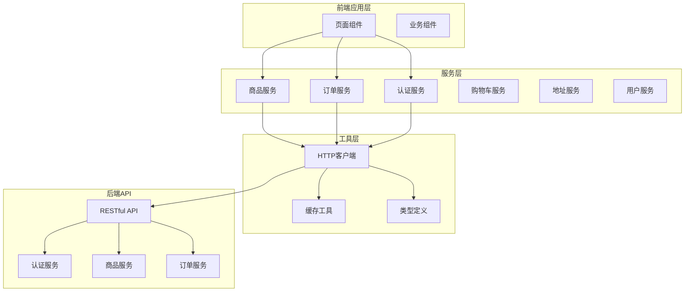

**图表来源**
- [frontend/src/utils/request.ts](file://frontend/src/utils/request.ts#L1-L162)
- [frontend/src/services/product.ts](file://frontend/src/services/product.ts#L1-L64)
- [frontend/src/services/order.ts](file://frontend/src/services/order.ts#L1-L47)

## HTTP客户端设计

### 核心架构

HTTP客户端基于Taro.request进行了深度封装，提供了类型安全、功能完善的API调用能力。

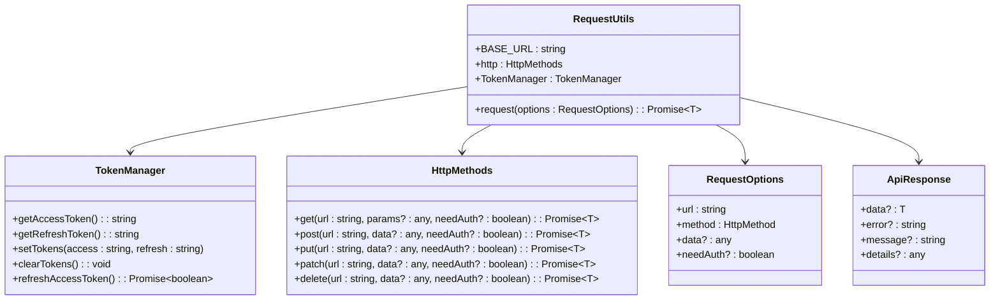

**图表来源**
- [frontend/src/utils/request.ts](file://frontend/src/utils/request.ts#L3-L162)

### 配置管理

系统通过环境变量和配置文件管理API基础URL：

| 配置项 | 默认值 | 描述 | 用途 |
|--------|--------|------|------|
| TARO_APP_API_BASE_URL | http://127.0.0.1:8000/api | API基础URL | 开发环境默认地址 |
| BASE_URL | process.env.TARO_APP_API_BASE_URL | 运行时基础URL | 支持动态配置 |
| dataType | 'json' | 数据类型 | 强制JSON格式响应 |

**章节来源**
- [frontend/src/utils/request.ts](file://frontend/src/utils/request.ts#L3-L5)

## 服务层架构

### 服务分层设计

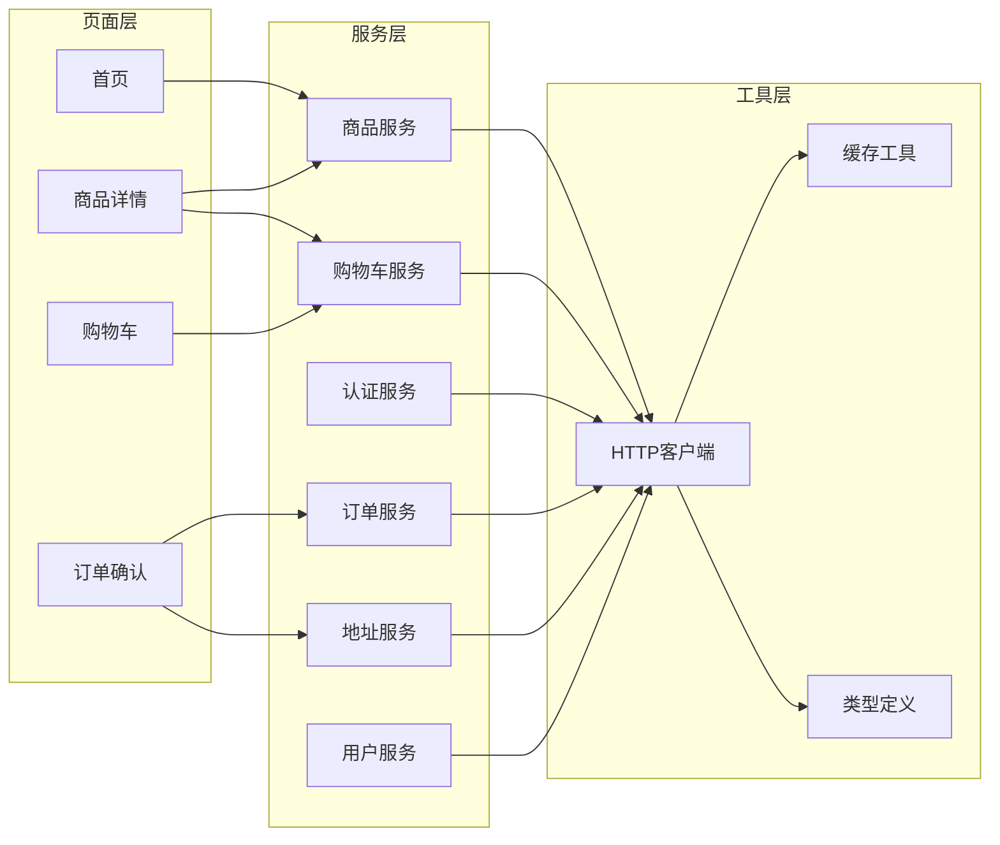

**图表来源**
- [frontend/src/services/product.ts](file://frontend/src/services/product.ts#L1-L64)
- [frontend/src/services/order.ts](file://frontend/src/services/order.ts#L1-L47)
- [frontend/src/services/auth.ts](file://frontend/src/services/auth.ts#L1-L22)

### 类型安全保障

所有服务都基于强类型定义，确保数据结构的一致性和安全性：

| 服务类型 | 主要接口 | 数据模型 | 特性 |
|----------|----------|----------|------|
| 商品服务 | getProducts, getProductDetail | Product, ProductListResponse | 分页查询、分类筛选 |
| 订单服务 | createOrder, getMyOrders | Order, CreateOrderResponse | 批量创建、状态管理 |
| 认证服务 | login, getUserProfile | User, LoginResponse | JWT令牌管理 |
| 购物车服务 | getCart, addItem | Cart, CartItem | 实时同步 |
| 地址服务 | getAddresses, createAddress | Address | 智能解析 |
| 用户服务 | getProfile, updateProfile | User | 个人信息管理 |

**章节来源**
- [frontend/src/types/index.ts](file://frontend/src/types/index.ts#L1-L144)

## 拦截器实现

### 请求拦截器

HTTP客户端实现了完整的请求拦截器链，处理认证、加载状态和请求头设置：

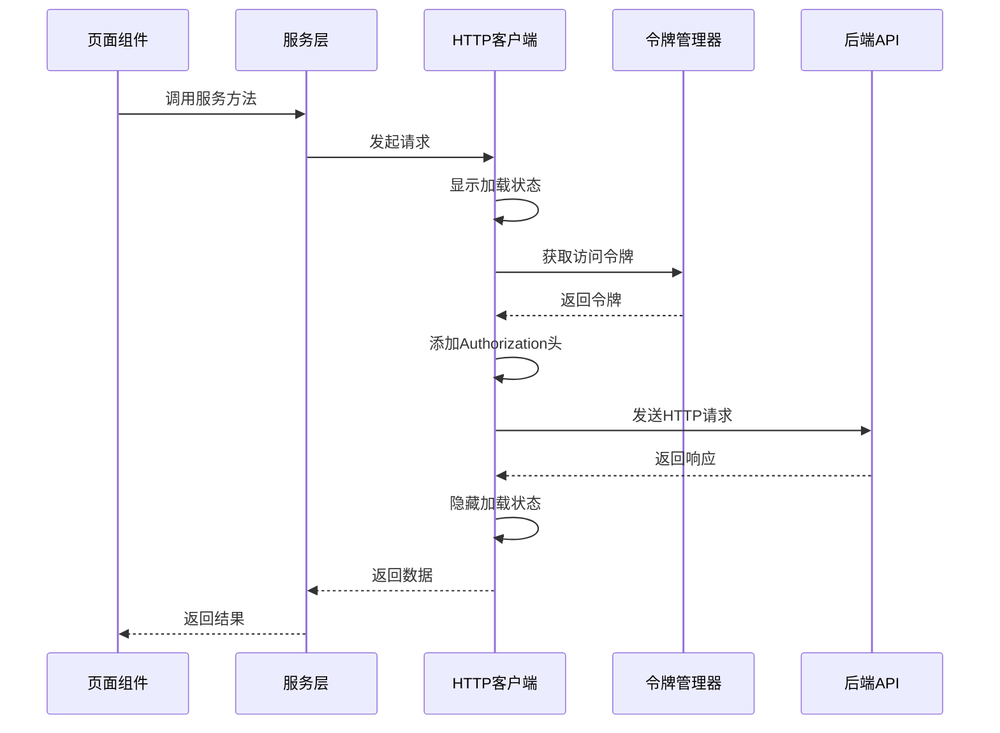

**图表来源**
- [frontend/src/utils/request.ts](file://frontend/src/utils/request.ts#L62-L162)

### JWT令牌管理

令牌管理系统提供了完整的认证生命周期管理：

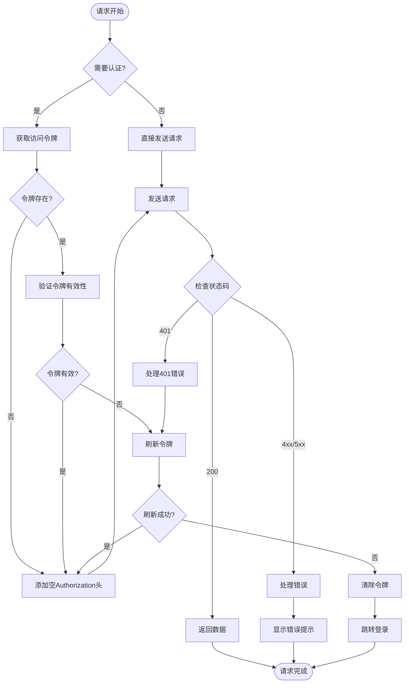

**图表来源**
- [frontend/src/utils/request.ts](file://frontend/src/utils/request.ts#L19-L58)

**章节来源**
- [frontend/src/utils/request.ts](file://frontend/src/utils/request.ts#L19-L162)

## 具体服务实现

### 商品服务

商品服务提供了完整的商品管理功能，支持多种查询方式：

#### 核心方法实现

| 方法名 | 参数 | 返回值 | 功能描述 |
|--------|------|--------|----------|
| getProducts | params?: ProductParams | ProductListResponse | 获取商品列表 |
| getProductDetail | id: number | Product | 获取商品详情 |
| getProductsByCategory | params: CategoryParams | ProductListResponse | 按分类获取商品 |
| getProductsByBrand | brand: string | ProductListResponse | 按品牌获取商品 |
| getCategories | - | Category[] | 获取分类列表 |
| getBrands | - | Brand[] | 获取品牌列表 |
| getRecommendations | params?: RecParams | Product[] | 获取推荐商品 |
| getRelatedProducts | id: number, limit?: number | Product[] | 获取相关商品 |

#### 查询参数处理

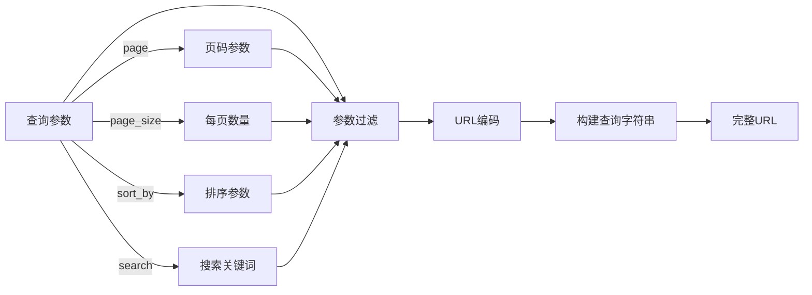

**图表来源**
- [frontend/src/utils/request.ts](file://frontend/src/utils/request.ts#L135-L161)

**章节来源**
- [frontend/src/services/product.ts](file://frontend/src/services/product.ts#L1-L64)

### 订单服务

订单服务实现了完整的电商订单流程，支持单商品和批量订单创建：

#### 订单流程

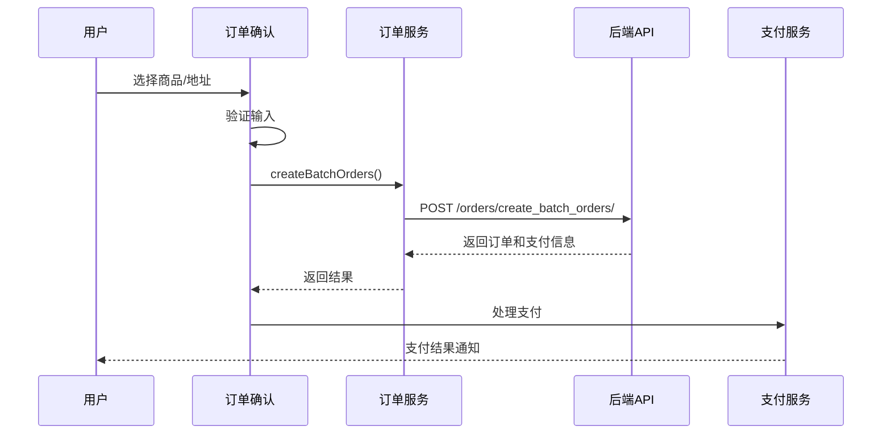

**图表来源**
- [frontend/src/pages/order-confirm/index.tsx](file://frontend/src/pages/order-confirm/index.tsx#L97-L148)

#### 批量订单处理

订单服务支持批量创建订单，提高了购物车结算的效率：

| 参数 | 类型 | 描述 | 必填 |
|------|------|------|------|
| items | Array<Item> | 商品列表 | ✓ |
| address_id | number | 收货地址ID | ✓ |
| note | string | 订单备注 | ✗ |
| method | string | 支付方式 | ✗ |

**章节来源**
- [frontend/src/services/order.ts](file://frontend/src/services/order.ts#L1-L47)

### 认证服务

认证服务提供了微信登录和用户信息管理功能：

#### 登录流程

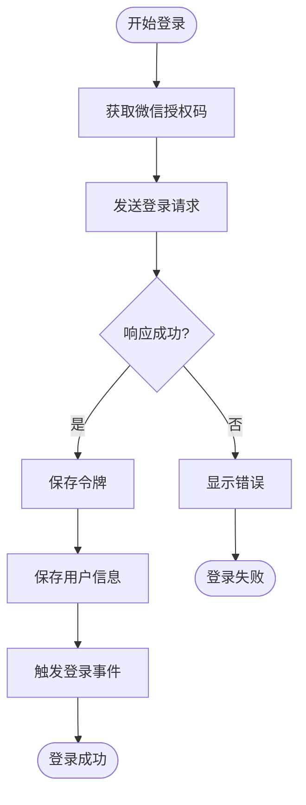

**图表来源**
- [frontend/src/services/auth.ts](file://frontend/src/services/auth.ts#L1-L22)

**章节来源**
- [frontend/src/services/auth.ts](file://frontend/src/services/auth.ts#L1-L22)

## 调用链路分析

### 完整数据流

从页面组件发起请求到返回数据解析的完整调用链路：

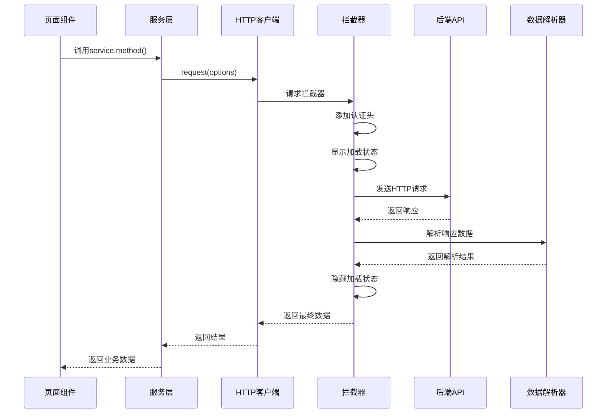

**图表来源**
- [frontend/src/pages/home/index.tsx](file://frontend/src/pages/home/index.tsx#L67-L90)
- [frontend/src/utils/request.ts](file://frontend/src/utils/request.ts#L62-L162)

### 实际调用示例

以首页商品加载为例，展示完整的调用链路：

1. **页面组件**：[Home组件](file://frontend/src/pages/home/index.tsx#L67-L90)调用`loadProducts()`方法
2. **服务层**：[productService.getProducts()](file://frontend/src/services/product.ts#L6-L13)封装API调用
3. **HTTP客户端**：[request()函数](file://frontend/src/utils/request.ts#L62-L162)执行实际请求
4. **拦截器**：处理认证、加载状态和错误
5. **后端API**：返回商品列表数据
6. **数据解析**：返回给页面组件

**章节来源**
- [frontend/src/pages/home/index.tsx](file://frontend/src/pages/home/index.tsx#L67-L90)
- [frontend/src/services/product.ts](file://frontend/src/services/product.ts#L6-L13)
- [frontend/src/utils/request.ts](file://frontend/src/utils/request.ts#L62-L162)

## 错误处理机制

### 多层次错误处理

系统实现了多层次的错误处理机制，确保用户体验和系统稳定性：

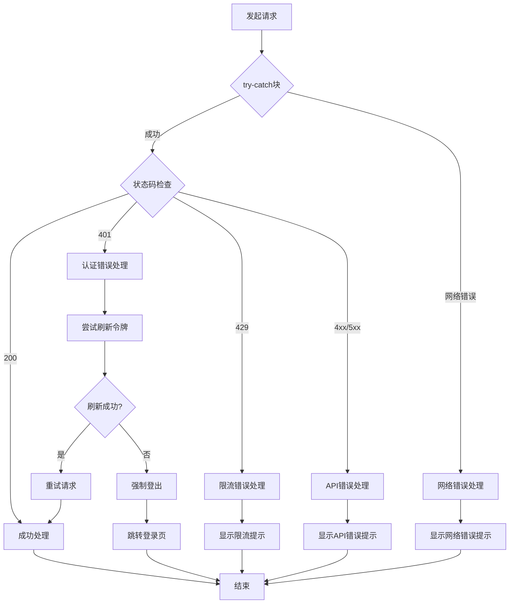

**图表来源**
- [frontend/src/utils/request.ts](file://frontend/src/utils/request.ts#L82-L132)

### 错误类型处理

| 错误类型 | HTTP状态码 | 处理策略 | 用户体验 |
|----------|------------|----------|----------|
| 认证过期 | 401 | 自动刷新令牌 | 跳转登录页 |
| 请求过于频繁 | 429 | 显示限流提示 | 稍后重试 |
| 参数错误 | 400 | 显示具体错误 | 修改参数 |
| 服务器错误 | 500 | 显示通用错误 | 联系客服 |
| 网络错误 | - | 显示网络提示 | 重试操作 |

**章节来源**
- [frontend/src/utils/request.ts](file://frontend/src/utils/request.ts#L93-L132)

## 性能优化策略

### 缓存策略

系统实现了智能的缓存策略，提升用户体验和减少服务器压力：

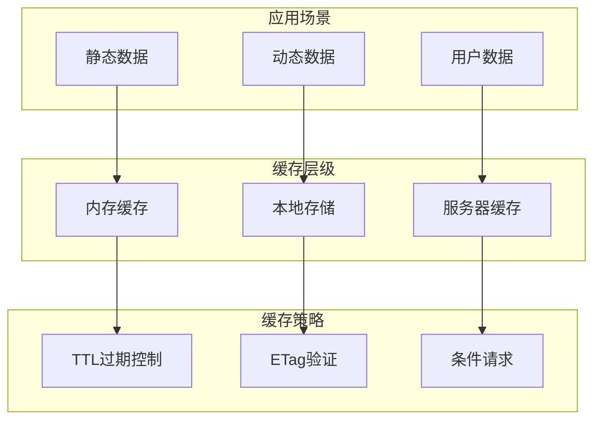

**图表来源**
- [frontend/src/utils/storage.ts](file://frontend/src/utils/storage.ts#L1-L45)

### 缓存配置

| 缓存类型 | 过期时间 | 存储位置 | 更新策略 |
|----------|----------|----------|----------|
| 分类数据 | 24小时 | 本地存储 | 手动刷新 |
| 品牌数据 | 24小时 | 本地存储 | 手动刷新 |
| 用户信息 | 1小时 | 内存缓存 | 登录时更新 |
| 商品详情 | 30分钟 | 内存缓存 | 访问时更新 |

**章节来源**
- [frontend/src/utils/storage.ts](file://frontend/src/utils/storage.ts#L1-L45)
- [frontend/src/pages/home/index.tsx](file://frontend/src/pages/home/index.tsx#L33-L64)

### 加载状态管理

系统提供了完整的加载状态管理，提升用户体验：

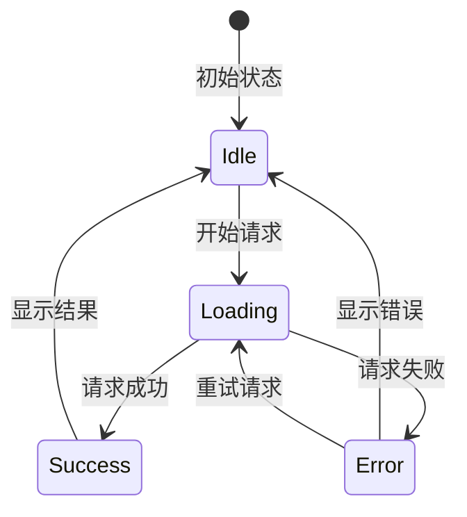

**图表来源**
- [frontend/src/utils/request.ts](file://frontend/src/utils/request.ts#L78-L91)

## 最佳实践

### 代码组织原则

1. **单一职责**：每个服务只负责特定领域的API调用
2. **类型安全**：使用TypeScript确保数据结构一致性
3. **错误隔离**：在不同层级处理不同类型的错误
4. **缓存策略**：合理使用缓存提升性能
5. **用户体验**：提供清晰的加载状态和错误提示

### 开发规范

#### 服务层规范
- 所有服务方法都应返回Promise
- 使用强类型定义接口
- 实现完整的错误处理
- 提供适当的加载状态

#### 页面组件规范
- 在useEffect中调用服务方法
- 处理加载状态和错误状态
- 使用事件中心进行组件通信
- 实现适当的缓存策略

#### HTTP客户端规范
- 统一的错误处理机制
- 自动化的认证管理
- 智能的重试策略
- 完整的日志记录

### 性能优化建议

1. **合理缓存**：根据数据特性选择合适的缓存策略
2. **批量请求**：对于相关数据使用批量API
3. **懒加载**：对非关键数据实现懒加载
4. **预加载**：对可能访问的数据进行预加载
5. **CDN加速**：对静态资源使用CDN

### 安全考虑

1. **HTTPS传输**：确保所有API请求使用HTTPS
2. **令牌保护**：敏感操作需要二次验证
3. **输入验证**：对用户输入进行严格验证
4. **权限控制**：实现细粒度的权限管理
5. **日志审计**：记录关键操作的审计日志

**章节来源**
- [frontend/src/utils/request.ts](file://frontend/src/utils/request.ts#L1-L162)
- [frontend/src/services/product.ts](file://frontend/src/services/product.ts#L1-L64)
- [frontend/src/services/order.ts](file://frontend/src/services/order.ts#L1-L47)