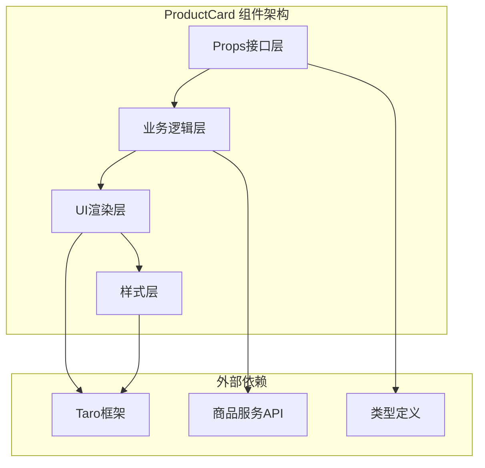
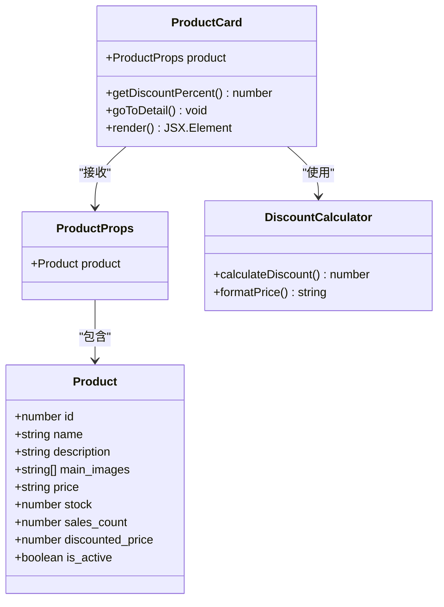
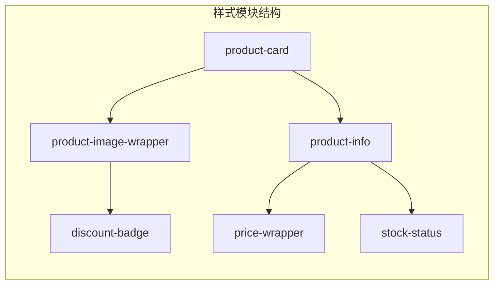
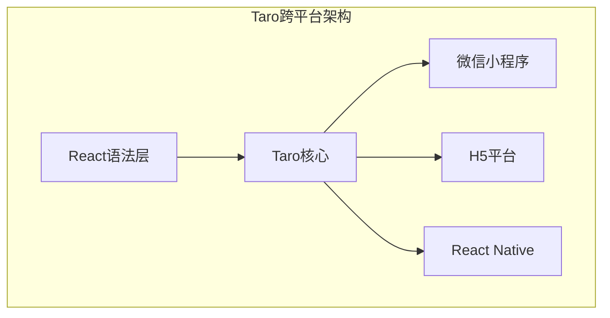
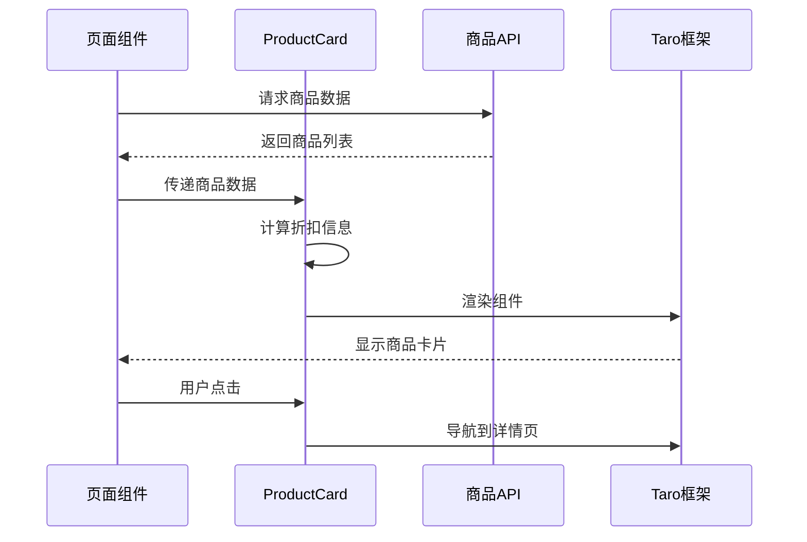

# 组件架构：ProductCard组件设计与实现

<cite>
**本文档引用的文件**
- [index.tsx](file://frontend/src/components/ProductCard/index.tsx)
- [index.scss](file://frontend/src/components/ProductCard/index.scss)
- [index.ts](file://frontend/src/types/index.ts)
- [product.ts](file://frontend/src/services/product.ts)
- [home/index.tsx](file://frontend/src/pages/home/index.tsx)
- [search/index.tsx](file://frontend/src/pages/search/index.tsx)
- [brand/index.tsx](file://frontend/src/pages/brand/index.tsx)
</cite>

## 目录
1. [概述](#概述)
2. [组件架构设计](#组件架构设计)
3. [核心功能特性](#核心功能特性)
4. [Props接口定义](#props接口定义)
5. [样式系统与BEM命名规范](#样式系统与bem命名规范)
6. [跨平台适配能力](#跨平台适配能力)
7. [使用场景与复用机制](#使用场景与复用机制)
8. [最佳实践示例](#最佳实践示例)
9. [性能优化措施](#性能优化措施)
10. [扩展与定制化](#扩展与定制化)
11. [总结](#总结)

## 概述

ProductCard是Electric小程序中的核心可复用UI组件，专为商品展示而设计。该组件采用模块化架构，支持多种商品展示场景，包括商品列表、搜索结果、推荐商品等。通过Taro框架的跨平台能力，确保在微信小程序、H5等多个平台上的一致性表现。

### 核心价值
- **高度复用性**：统一的商品展示界面，减少重复开发工作
- **响应式设计**：自适应不同屏幕尺寸和设备类型
- **性能优化**：内置懒加载、缓存等优化机制
- **跨平台兼容**：基于Taro框架的统一开发体验

## 组件架构设计

### 整体架构图



**架构图来源**
- [index.tsx](file://frontend/src/components/ProductCard/index.tsx#L1-L85)
- [index.scss](file://frontend/src/components/ProductCard/index.scss#L1-L158)

### 组件层次结构



**类图来源**
- [index.tsx](file://frontend/src/components/ProductCard/index.tsx#L7-L10)
- [index.ts](file://frontend/src/types/index.ts#L20-L40)

**章节来源**
- [index.tsx](file://frontend/src/components/ProductCard/index.tsx#L1-L85)
- [index.scss](file://frontend/src/components/ProductCard/index.scss#L1-L158)

## 核心功能特性

### 1. 商品信息展示
- **商品图片**：支持主图显示，具备占位符机制
- **商品名称**：支持多行文本截断显示
- **商品描述**：可选字段，支持文本溢出处理
- **价格信息**：原价和折扣价的智能展示

### 2. 折扣系统
- **折扣计算**：自动计算折扣百分比
- **折扣标签**：视觉化的折扣标识
- **价格对比**：原价和现价的清晰对比

### 3. 库存状态指示
- **库存警告**：低库存提醒
- **售罄标识**：明确的售罄状态
- **销量统计**：实时销售数据展示

### 4. 交互功能
- **点击跳转**：点击进入商品详情页
- **动画效果**：触摸反馈和过渡动画
- **状态保持**：组件状态的持久化

**章节来源**
- [index.tsx](file://frontend/src/components/ProductCard/index.tsx#L12-L84)

## Props接口定义

### ProductCardProps接口

```typescript
interface ProductCardProps {
  product: Product
}
```

### Product类型定义

| 属性名 | 类型 | 必填 | 描述 |
|--------|------|------|------|
| id | number | 是 | 商品唯一标识符 |
| name | string | 是 | 商品名称 |
| description | string | 否 | 商品描述 |
| category | string | 是 | 分类名称 |
| brand | string | 是 | 品牌名称 |
| price | string | 是 | 商品价格（字符串格式） |
| discounted_price | number | 否 | 折扣后价格 |
| stock | number | 是 | 库存数量 |
| main_images | string[] | 是 | 主图URL数组 |
| detail_images | string[] | 否 | 详情图URL数组 |
| sales_count | number | 是 | 销量统计 |
| is_active | boolean | 是 | 是否上架 |
| specifications | Record<string, any> | 否 | 商品规格 |

### 接口设计原则

1. **最小化原则**：只暴露必要的属性
2. **类型安全**：严格的类型定义
3. **可扩展性**：预留扩展字段
4. **向后兼容**：保证现有功能不受影响

**章节来源**
- [index.ts](file://frontend/src/types/index.ts#L20-L40)
- [index.tsx](file://frontend/src/components/ProductCard/index.tsx#L7-L9)

## 样式系统与BEM命名规范

### BEM命名体系

ProductCard采用BEM（Block Element Modifier）命名规范，确保样式的模块化和可维护性：

```scss
// Block: product-card
.product-card {
  // Element: product-image-wrapper
  .product-image-wrapper {
    // Element: product-image
    .product-image {
      // Modifier: 可能的状态类
    }
  }
  
  // Element: product-info
  .product-info {
    // Element: product-name
    .product-name {
      // Element: product-desc
      .product-desc {
        // Element: product-bottom
        .product-bottom {
          // Element: price-wrapper
          .price-wrapper {
            // Element: current-price
            .current-price {
              // Element: original-price
              .original-price {
                // Modifier: 价格装饰
              }
            }
          }
        }
      }
    }
  }
}
```

### 样式模块化设计



**样式图来源**
- [index.scss](file://frontend/src/components/ProductCard/index.scss#L1-L158)

### 样式特性

| 样式类别 | 实现方式 | 特点 |
|----------|----------|------|
| 响应式布局 | rpx单位 | 自适应不同屏幕密度 |
| 动画效果 | CSS过渡 | 平滑的用户交互体验 |
| 视觉层次 | 阴影和圆角 | 清晰的视觉焦点 |
| 状态指示 | 渐变色和图标 | 直观的状态表达 |

**章节来源**
- [index.scss](file://frontend/src/components/ProductCard/index.scss#L1-L158)

## 跨平台适配能力

### Taro框架集成

ProductCard基于Taro框架构建，确保跨平台一致性：



### 平台适配特性

1. **组件映射**：`View` → `div`，`Image` → `img`，`Text` → `span`
2. **样式转换**：SCSS编译为各平台CSS
3. **API兼容**：统一的导航和事件处理
4. **性能优化**：各平台特定的优化策略

### 兼容性测试

| 平台 | 支持度 | 特殊处理 |
|------|--------|----------|
| 微信小程序 | 完全支持 | 原生组件优化 |
| H5浏览器 | 完全支持 | CSS前缀处理 |
| 支付宝小程序 | 完全支持 | 组件映射调整 |
| 字节跳动小程序 | 完全支持 | API差异处理 |

**章节来源**
- [index.tsx](file://frontend/src/components/ProductCard/index.tsx#L1-L5)

## 使用场景与复用机制

### 主要使用场景

#### 1. 首页商品推荐
```typescript
// 在首页中使用ProductCard
const HomePage = () => {
  const [products, setProducts] = useState<Product[]>([])
  
  useEffect(() => {
    productService.getProducts({ page: 1, page_size: 20 })
      .then(res => setProducts(res.results))
  }, [])
  
  return (
    <View className='product-list'>
      {products.map(product => (
        <ProductCard key={product.id} product={product} />
      ))}
    </View>
  )
}
```

#### 2. 搜索结果展示
```typescript
// 搜索页面中的ProductCard应用
const SearchPage = () => {
  const [products, setProducts] = useState<Product[]>([])
  
  const handleSearch = async (keyword: string) => {
    const res = await productService.getProducts({ search: keyword })
    setProducts(res.results)
  }
  
  return (
    <ScrollView className='search-results'>
      {products.map(product => (
        <ProductCard product={product} />
      ))}
    </ScrollView>
  )
}
```

#### 3. 品牌商品列表
```typescript
// 品牌页面中的ProductCard应用
const BrandPage = () => {
  const [products, setProducts] = useState<Product[]>([])
  
  useEffect(() => {
    const brandName = getCurrentBrand()
    productService.getProductsByBrand(brandName)
      .then(res => setProducts(res.results))
  }, [])
  
  return (
    <View className='brand-products'>
      {products.map(product => (
        <ProductCard product={product} />
      ))}
    </View>
  )
}
```

### 复用机制设计



**序列图来源**
- [home/index.tsx](file://frontend/src/pages/home/index.tsx#L188-L193)
- [search/index.tsx](file://frontend/src/pages/search/index.tsx#L92-L104)
- [brand/index.tsx](file://frontend/src/pages/brand/index.tsx#L32-L36)

**章节来源**
- [home/index.tsx](file://frontend/src/pages/home/index.tsx#L188-L193)
- [search/index.tsx](file://frontend/src/pages/search/index.tsx#L92-L104)
- [brand/index.tsx](file://frontend/src/pages/brand/index.tsx#L32-L36)

## 最佳实践示例

### 基础使用模式

```typescript
// 基础用法示例
const BasicUsage = () => {
  const product: Product = {
    id: 1,
    name: '智能扫地机器人',
    price: '2999.00',
    discounted_price: 2499.00,
    stock: 15,
    sales_count: 128,
    main_images: ['https://example.com/robot.jpg'],
    description: '家用智能扫地机器人，支持语音控制',
    is_active: true
  }
  
  return <ProductCard product={product} />
}
```

### 高级定制用法

```typescript
// 扩展功能的ProductCard使用
const AdvancedUsage = () => {
  const [favorites, setFavorites] = useState<number[]>([])
  
  const toggleFavorite = (productId: number) => {
    // 添加收藏逻辑
  }
  
  return (
    <ProductCard 
      product={product}
      onFavoriteToggle={toggleFavorite}
      isFavorite={favorites.includes(product.id)}
    />
  )
}
```

### 性能优化示例

```typescript
// 虚拟滚动优化
const VirtualScrollExample = () => {
  const [products, setProducts] = useState<Product[]>([])
  
  const loadMore = useCallback(async () => {
    const newProducts = await productService.getProducts({
      page: currentPage + 1,
      page_size: 20
    })
    setProducts(prev => [...prev, ...newProducts.results])
  }, [currentPage])
  
  return (
    <VirtualList
      data={products}
      renderItem={(product: Product) => (
        <ProductCard product={product} />
      )}
      onEndReached={loadMore}
    />
  )
}
```

### 错误处理最佳实践

```typescript
// 错误边界和降级处理
const RobustProductCard = ({ product }: ProductCardProps) => {
  const [imageError, setImageError] = useState(false)
  
  const handleError = () => {
    setImageError(true)
  }
  
  return (
    <ProductCard product={product}>
      {imageError && (
        <View className='fallback-image'>
          <Text>图片加载失败</Text>
        </View>
      )}
    </ProductCard>
  )
}
```

**章节来源**
- [index.tsx](file://frontend/src/components/ProductCard/index.tsx#L11-L84)

## 性能优化措施

### 1. 图片懒加载集成

虽然当前版本的ProductCard主要使用静态图片，但可以轻松集成懒加载功能：

```typescript
// 懒加载实现示例
const LazyProductCard = ({ product }: ProductCardProps) => {
  const imageRef = useRef<HTMLImageElement>(null)
  
  useEffect(() => {
    const observer = new IntersectionObserver(
      (entries) => {
        entries.forEach(entry => {
          if (entry.isIntersecting && imageRef.current) {
            imageRef.current.src = product.main_images[0]
            observer.unobserve(imageRef.current)
          }
        })
      },
      { threshold: 0.1 }
    )
    
    if (imageRef.current) {
      observer.observe(imageRef.current)
    }
    
    return () => observer.disconnect()
  }, [product.main_images])
  
  return (
    <View className='product-card'>
      <Image 
        ref={imageRef}
        className='product-image'
        src='data:image/gif;base64,R0lGODlhAQABAIAAAAAAAP///yH5BAEAAAAALAAAAAABAAEAAAIBRAA7'
        mode='aspectFill'
      />
    </View>
  )
}
```

### 2. 内存优化策略

```typescript
// 组件卸载时的清理
const OptimizedProductCard = ({ product }: ProductCardProps) => {
  useEffect(() => {
    // 设置定时器清理
    const timer = setTimeout(() => {
      // 清理逻辑
    }, 10000)
    
    return () => {
      clearTimeout(timer)
      // 清理其他资源
    }
  }, [])
  
  return <ProductCard product={product} />
}
```

### 3. 渲染性能优化

| 优化技术 | 实现方式 | 性能提升 |
|----------|----------|----------|
| 虚拟滚动 | 只渲染可见区域 | 减少DOM节点 |
| 图片压缩 | 服务端预处理 | 减少网络传输 |
| 缓存策略 | localStorage缓存 | 减少API调用 |
| 代码分割 | 按需加载 | 减少初始包大小 |

### 4. 网络优化

```typescript
// 网络请求优化
const NetworkOptimizedProductCard = ({ productId }: { productId: number }) => {
  const [product, setProduct] = useState<Product | null>(null)
  
  useEffect(() => {
    // 使用缓存优先策略
    const cachedProduct = cache.get(`product_${productId}`)
    if (cachedProduct) {
      setProduct(cachedProduct)
      return
    }
    
    // 异步加载
    productService.getProductDetail(productId)
      .then(data => {
        cache.set(`product_${productId}`, data, 300) // 5分钟缓存
        setProduct(data)
      })
  }, [productId])
  
  if (!product) return <SkeletonProductCard />
  
  return <ProductCard product={product} />
}
```

**章节来源**
- [index.tsx](file://frontend/src/components/ProductCard/index.tsx#L32-L36)

## 扩展与定制化

### 功能扩展点

#### 1. 收藏功能扩展

```typescript
// 添加收藏功能的ProductCard
interface ExtendedProductCardProps extends ProductCardProps {
  onFavoriteToggle?: (productId: number) => void
  isFavorite?: boolean
}

const ExtendedProductCard: React.FC<ExtendedProductCardProps> = ({
  product,
  onFavoriteToggle,
  isFavorite
}) => {
  const handleFavorite = () => {
    onFavoriteToggle?.(product.id)
  }
  
  return (
    <View className='product-card'>
      {/* 商品图片部分 */}
      
      {/* 收藏按钮 */}
      {onFavoriteToggle && (
        <View 
          className={`favorite-btn ${isFavorite ? 'favorited' : ''}`}
          onClick={handleFavorite}
        >
          <Icon 
            name={isFavorite ? 'heart-filled' : 'heart'}
            className='favorite-icon'
          />
        </View>
      )}
      
      {/* 商品信息部分 */}
    </View>
  )
}
```

#### 2. 促销活动支持

```typescript
// 支持多种促销活动的ProductCard
interface PromotionalProductCardProps extends ProductCardProps {
  promotions?: Promotion[]
}

const PromotionalProductCard: React.FC<PromotionalProductCardProps> = ({
  product,
  promotions
}) => {
  const getPromotionBadge = (promotion: Promotion) => {
    switch (promotion.type) {
      case 'discount':
        return (
          <View className='promotion-badge discount'>
            {promotion.value}% OFF
          </View>
        )
      case 'bundle':
        return (
          <View className='promotion-badge bundle'>
            满{promotion.threshold}减{promotion.discount}
          </View>
        )
      default:
        return null
    }
  }
  
  return (
    <View className='product-card'>
      {/* 商品图片部分 */}
      
      {/* 促销标签 */}
      {promotions?.map((promo, index) => (
        <View key={index} className='promotion-container'>
          {getPromotionBadge(promo)}
        </View>
      ))}
      
      {/* 商品信息部分 */}
    </View>
  )
}
```

### 主题定制系统

```typescript
// 主题定制的ProductCard
interface ThemeProductCardProps extends ProductCardProps {
  theme?: 'default' | 'premium' | 'minimal'
  customStyles?: CSSProperties
}

const ThemeProductCard: React.FC<ThemeProductCardProps> = ({
  product,
  theme = 'default',
  customStyles
}) => {
  const themeClasses = {
    default: 'theme-default',
    premium: 'theme-premium',
    minimal: 'theme-minimal'
  }
  
  return (
    <View 
      className={`product-card ${themeClasses[theme]}`}
      style={customStyles}
    >
      {/* 不同主题的渲染逻辑 */}
    </View>
  )
}
```

### 响应式设计增强

```typescript
// 响应式ProductCard
const ResponsiveProductCard = ({ product }: ProductCardProps) => {
  const [screenWidth, setScreenWidth] = useState(window.innerWidth)
  
  useEffect(() => {
    const handleResize = () => setScreenWidth(window.innerWidth)
    window.addEventListener('resize', handleResize)
    return () => window.removeEventListener('resize', handleResize)
  }, [])
  
  const cardSize = screenWidth < 768 ? 'small' : 'large'
  
  return (
    <View className={`product-card ${cardSize}`}>
      {/* 根据尺寸调整的渲染逻辑 */}
    </View>
  )
}
```

**章节来源**
- [index.scss](file://frontend/src/components/ProductCard/index.scss#L42-L67)

## 总结

ProductCard组件作为Electric小程序的核心UI组件，展现了现代前端开发的最佳实践：

### 设计优势

1. **模块化架构**：清晰的职责分离，便于维护和扩展
2. **类型安全**：完整的TypeScript类型定义，提供良好的开发体验
3. **跨平台兼容**：基于Taro框架的统一开发方案
4. **性能优化**：内置多种性能优化策略
5. **可扩展性**：灵活的扩展机制支持个性化需求

### 技术特色

- **BEM命名规范**：确保样式的模块化和可维护性
- **响应式设计**：适应不同屏幕尺寸和设备类型
- **动画效果**：提供流畅的用户体验
- **错误处理**：完善的降级和错误恢复机制

### 发展方向

1. **功能增强**：添加更多交互功能和促销支持
2. **性能优化**：进一步优化渲染性能和网络请求
3. **主题系统**：完善主题定制和品牌化支持
4. **无障碍支持**：提升可访问性和用户体验

ProductCard组件的成功实践证明了模块化、类型安全、跨平台兼容的前端架构设计的价值，为后续组件的开发提供了宝贵的参考经验。