# 页面结构

<cite>
**本文档引用的文件**
- [app.config.ts](file://frontend/src/app.config.ts)
- [app.ts](file://frontend/src/app.ts)
- [home/index.tsx](file://frontend/src/pages/home/index.tsx)
- [product-detail/index.tsx](file://frontend/src/pages/product-detail/index.tsx)
- [order-confirm/index.tsx](file://frontend/src/pages/order-confirm/index.tsx)
- [cart/index.tsx](file://frontend/src/pages/cart/index.tsx)
- [profile/index.tsx](file://frontend/src/pages/profile/index.tsx)
- [index.config.ts](file://frontend/src/pages/index/index.config.ts)
- [home/index.scss](file://frontend/src/pages/home/index.scss)
- [product-detail/index.scss](file://frontend/src/pages/product-detail/index.scss)
- [types/index.ts](file://frontend/src/types/index.ts)
</cite>

## 目录
1. [概述](#概述)
2. [项目结构分析](#项目结构分析)
3. [路由配置系统](#路由配置系统)
4. [页面目录组织](#页面目录组织)
5. [配置文件详解](#配置文件详解)
6. [核心页面分析](#核心页面分析)
7. [页面生命周期](#页面生命周期)
8. [样式架构](#样式架构)
9. [用户体验流程](#用户体验流程)
10. [最佳实践总结](#最佳实践总结)

## 概述

本项目采用Taro框架构建微信小程序，遵循模块化、组件化的开发理念。整个前端页面结构以`app.config.ts`中的pages数组为核心，定义了完整的路由体系，并通过精心设计的页面目录结构实现了清晰的功能划分和职责分离。

## 项目结构分析

### 整体架构

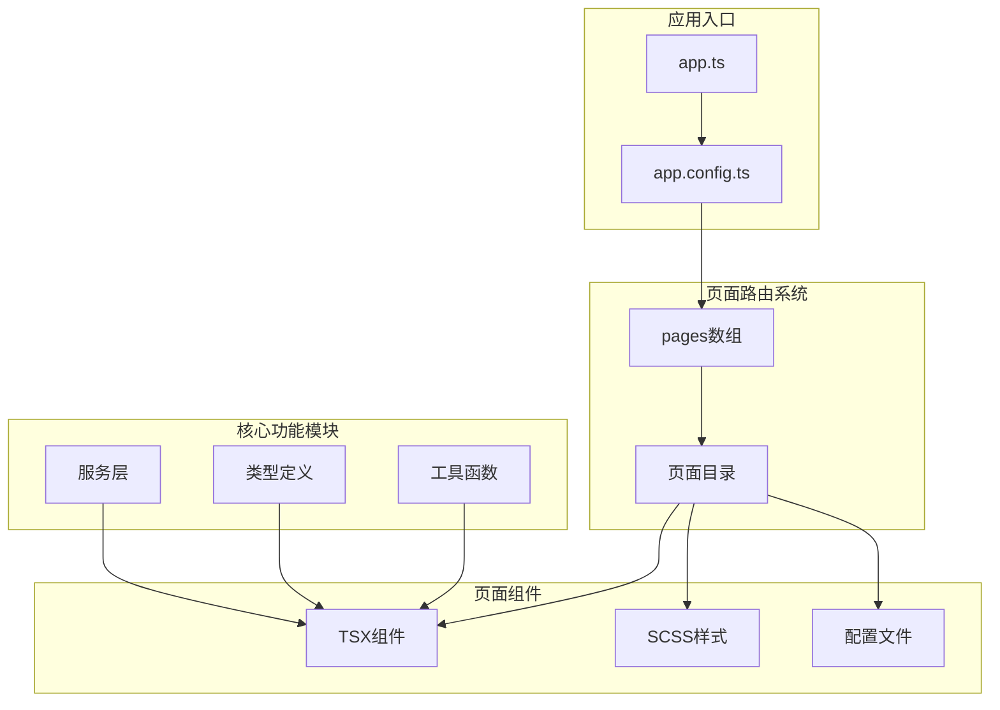

**图表来源**
- [app.config.ts](file://frontend/src/app.config.ts#L1-L50)
- [app.ts](file://frontend/src/app.ts#L1-L18)

### 目录结构特点

项目采用功能导向的目录组织方式，每个页面都是一个独立的功能模块，包含：
- **TSX组件文件**：负责页面逻辑和UI渲染
- **SCSS样式文件**：实现页面样式和布局
- **配置文件**：定义页面特定的导航和行为

**章节来源**
- [app.config.ts](file://frontend/src/app.config.ts#L1-L50)

## 路由配置系统

### app.config.ts的核心作用

`app.config.ts`是整个小程序的路由配置中心，通过pages数组定义了所有可访问的页面路径：

```typescript
export default defineAppConfig({
  pages: [
    'pages/home/index',           // 首页
    'pages/category/index',       // 分类页
    'pages/cart/index',           // 购物车
    'pages/profile/index',        // 我的
    'pages/product-detail/index', // 商品详情
    'pages/order-list/index',     // 订单列表
    'pages/order-confirm/index',  // 订单确认
    // ... 其他页面
  ],
  // 窗口配置
  window: {
    backgroundTextStyle: 'light',
    navigationBarBackgroundColor: '#fff',
    navigationBarTitleText: '家电商城',
    navigationBarTextStyle: 'black',
    backgroundColor: '#F7F8FA'
  },
  // 底部标签栏
  tabBar: {
    color: '#969799',
    selectedColor: '#1989FA',
    backgroundColor: '#fff',
    borderStyle: 'black',
    list: [
      { pagePath: 'pages/home/index', text: '首页' },
      { pagePath: 'pages/category/index', text: '分类' },
      { pagePath: 'pages/cart/index', text: '购物车' },
      { pagePath: 'pages/profile/index', text: '我的' }
    ]
  }
})
```

### 路由路径映射机制

Taro框架通过以下机制实现路由与页面的对应关系：

1. **相对路径解析**：pages数组中的路径相对于`src`目录
2. **自动注册**：Taro编译时自动将这些路径注册为可用路由
3. **动态路由**：支持带参数的动态路由（如`/pages/product-detail/index?id=123`）

**章节来源**
- [app.config.ts](file://frontend/src/app.config.ts#L1-L50)

## 页面目录组织

### 目录命名规范

每个页面都位于`pages/`目录下的独立子目录中，采用kebab-case命名法：

```
pages/
├── home/           # 首页
├── product-detail/ # 商品详情页
├── order-confirm/  # 订单确认页
├── cart/          # 购物车页
├── profile/       # 我的页
└── ...
```

### 文件职责分离

每个页面目录严格遵循单一职责原则：

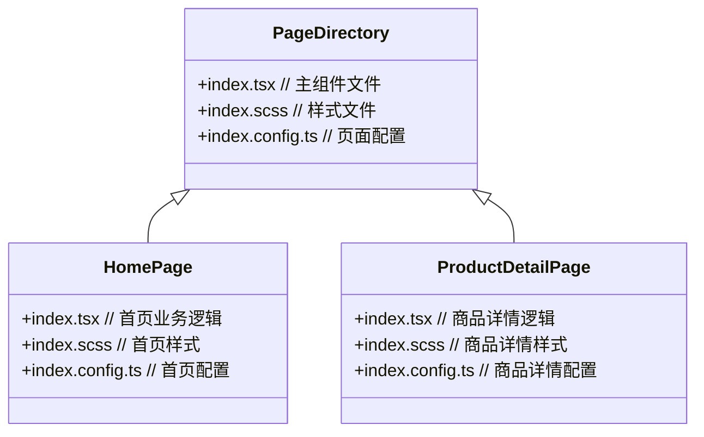

**图表来源**
- [home/index.tsx](file://frontend/src/pages/home/index.tsx#L1-L225)
- [product-detail/index.tsx](file://frontend/src/pages/product-detail/index.tsx#L1-L311)

### 组件层次结构

以首页为例，展示典型的组件层次：

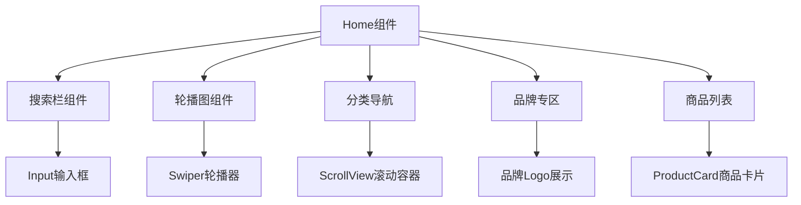

**图表来源**
- [home/index.tsx](file://frontend/src/pages/home/index.tsx#L122-L224)

**章节来源**
- [home/index.tsx](file://frontend/src/pages/home/index.tsx#L1-L225)
- [product-detail/index.tsx](file://frontend/src/pages/product-detail/index.tsx#L1-L311)

## 配置文件详解

### index.config.ts的作用

每个页面都可以通过`index.config.ts`文件定义页面级别的配置，覆盖全局配置：

```typescript
// 首页配置示例
export default definePageConfig({
  navigationBarTitleText: '首页'
})

// 商品详情页配置示例
export default definePageConfig({
  navigationBarTitleText: '商品详情',
  navigationBarBackgroundColor: '#fff',
  navigationBarTextStyle: 'black',
  backgroundColor: '#F7F8FA'
})
```

### 配置优先级

配置文件的优先级规则：
1. **页面级别配置**（index.config.ts） > 全局配置（app.config.ts）
2. **运行时动态配置** > 静态配置文件
3. **组件内部配置** > 外层配置

### 常见配置选项

| 配置项 | 类型 | 描述 | 示例值 |
|--------|------|------|--------|
| navigationBarTitleText | string | 导航栏标题 | '商品详情' |
| navigationBarBackgroundColor | string | 导航栏背景色 | '#fff' |
| navigationBarTextStyle | string | 导航栏文字颜色 | 'black' |
| backgroundColor | string | 页面背景色 | '#F7F8FA' |
| enablePullDownRefresh | boolean | 是否启用下拉刷新 | true |
| onReachBottomDistance | number | 上拉触底距离 | 50 |

**章节来源**
- [index.config.ts](file://frontend/src/pages/index/index.config.ts#L1-L4)
- [product-detail/index.config.ts](file://frontend/src/pages/product-detail/index.config.ts#L1-L7)
- [order-confirm/index.config.ts](file://frontend/src/pages/order-confirm/index.config.ts#L1-L7)

## 核心页面分析

### 首页（home）

首页作为用户的主要入口，承担着商品展示、分类导航、品牌推荐等功能：

#### 核心特性
- **无限滚动加载**：通过`onScrollToLower`实现分页加载
- **下拉刷新**：使用`onRefresherRefresh`提供即时更新体验
- **缓存机制**：对分类和品牌数据进行本地缓存
- **响应式布局**：适配不同屏幕尺寸

#### 数据流架构

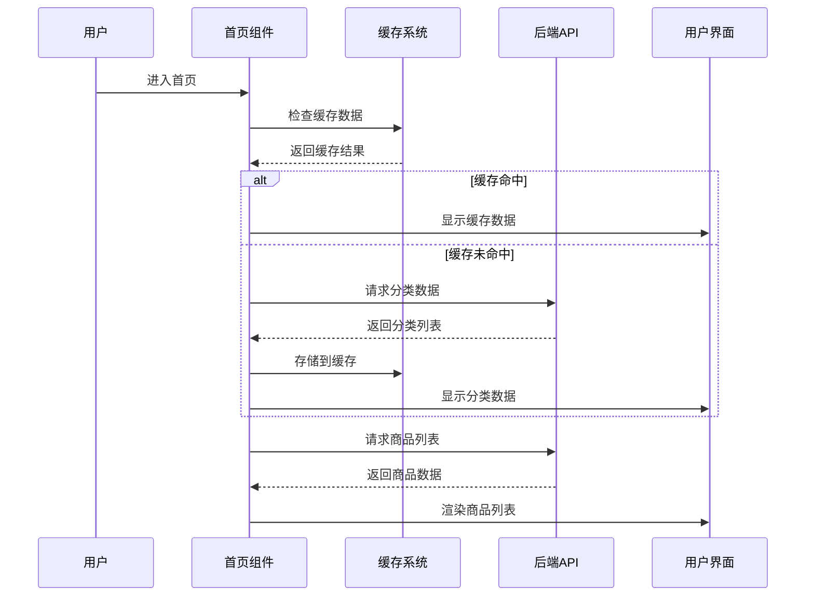

**图表来源**
- [home/index.tsx](file://frontend/src/pages/home/index.tsx#L26-L64)
- [home/index.tsx](file://frontend/src/pages/home/index.tsx#L66-L90)

**章节来源**
- [home/index.tsx](file://frontend/src/pages/home/index.tsx#L1-L225)

### 商品详情页（product-detail）

商品详情页是电商的核心页面，提供完整的商品信息展示和购买功能：

#### 关键功能模块

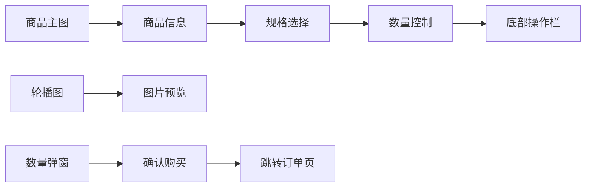

**图表来源**
- [product-detail/index.tsx](file://frontend/src/pages/product-detail/index.tsx#L120-L310)

#### 交互设计考量

1. **库存管理**：实时显示库存状态，防止超卖
2. **数量限制**：根据库存动态调整可购买数量
3. **状态反馈**：添加购物车和购买过程中的状态提示
4. **错误处理**：网络异常时的优雅降级

**章节来源**
- [product-detail/index.tsx](file://frontend/src/pages/product-detail/index.tsx#L1-L311)

### 订单确认页（order-confirm）

订单确认页连接购物车和支付流程，是转化率最高的页面之一：

#### 多商品处理机制

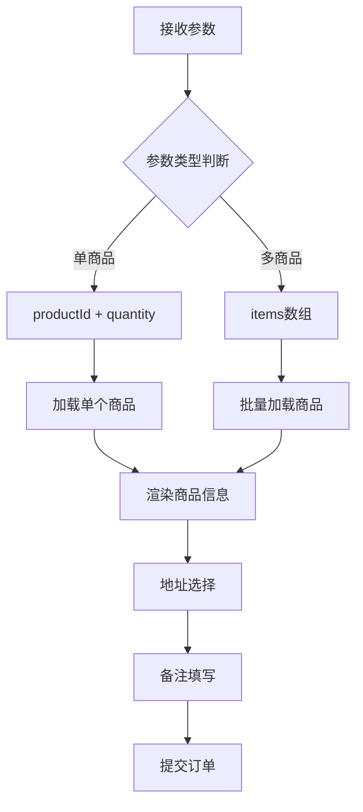

**图表来源**
- [order-confirm/index.tsx](file://frontend/src/pages/order-confirm/index.tsx#L23-L58)

#### 订单状态管理

| 状态 | 描述 | 用户操作 |
|------|------|----------|
| 加载中 | 正在加载商品和地址信息 | 显示加载动画 |
| 地址未选择 | 用户未选择收货地址 | 提示用户选择地址 |
| 商品不可用 | 商品已下架或库存不足 | 显示错误提示 |
| 可提交 | 所有信息完整，可以提交订单 | 允许用户提交 |

**章节来源**
- [order-confirm/index.tsx](file://frontend/src/pages/order-confirm/index.tsx#L1-L240)

### 购物车页（cart）

购物车页面管理用户的购物车状态，提供商品管理和结算功能：

#### 状态同步机制

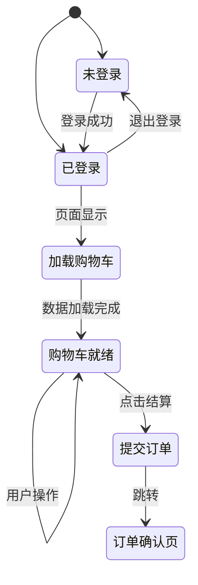

**图表来源**
- [cart/index.tsx](file://frontend/src/pages/cart/index.tsx#L16-L52)

**章节来源**
- [cart/index.tsx](file://frontend/src/pages/cart/index.tsx#L1-L281)

### 我的页面（profile）

我的页面作为用户中心，整合用户信息、订单管理和账户设置：

#### 用户状态管理

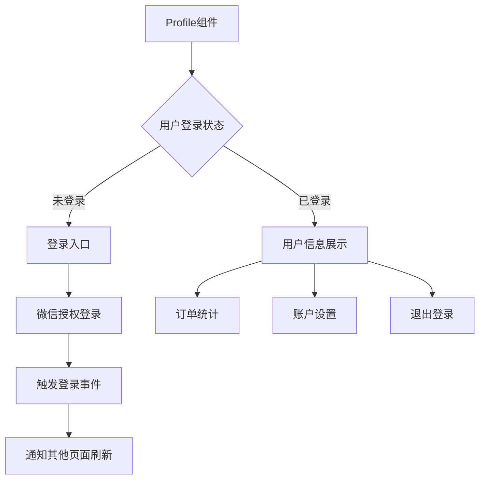

**图表来源**
- [profile/index.tsx](file://frontend/src/pages/profile/index.tsx#L93-L169)

**章节来源**
- [profile/index.tsx](file://frontend/src/pages/profile/index.tsx#L1-L170)

## 页面生命周期

### Taro页面生命周期

Taro提供了完整的页面生命周期钩子，用于管理页面状态和资源：

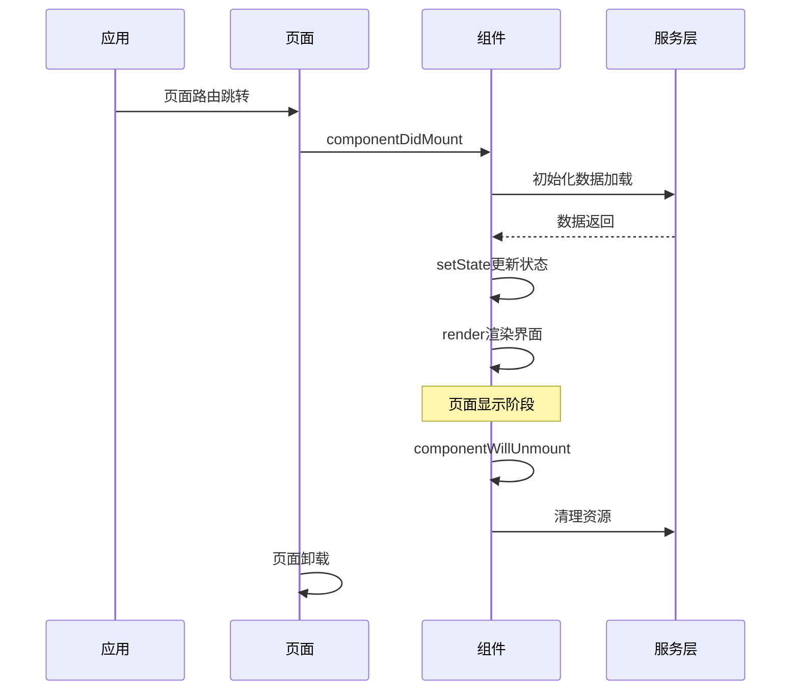

### 生命周期钩子详解

| 钩子 | 调用时机 | 用途 | 示例场景 |
|------|----------|------|----------|
| useLaunch | 应用启动时 | 初始化全局状态 | 设置主题、语言 |
| useDidShow | 页面显示时 | 刷新数据、恢复状态 | 重新加载购物车 |
| useDidHide | 页面隐藏时 | 清理定时器、暂停动画 | 防止内存泄漏 |
| componentWillUnmount | 页面卸载时 | 清理资源、取消订阅 | 取消网络请求 |

### 状态管理策略

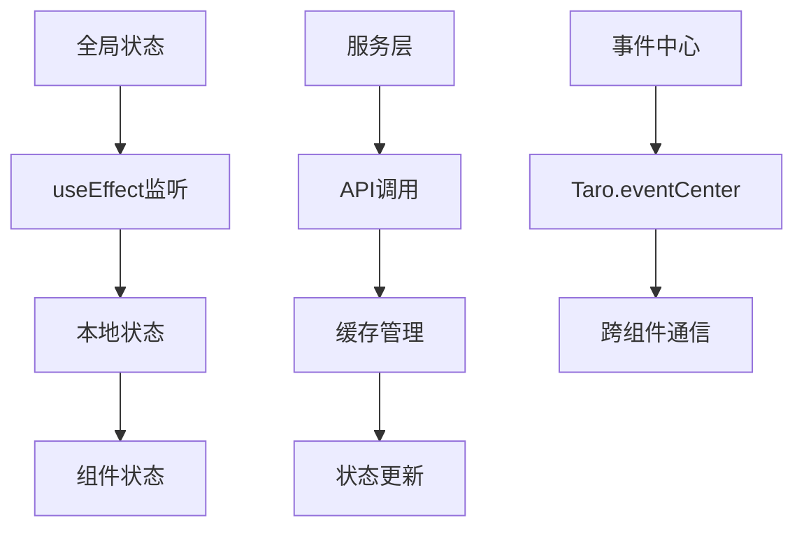

**图表来源**
- [app.ts](file://frontend/src/app.ts#L6-L12)
- [cart/index.tsx](file://frontend/src/pages/cart/index.tsx#L16-L52)

**章节来源**
- [app.ts](file://frontend/src/app.ts#L1-L18)
- [cart/index.tsx](file://frontend/src/pages/cart/index.tsx#L16-L52)

## 样式架构

### SCSS模块化设计

每个页面都有独立的SCSS文件，采用BEM命名规范：

```scss
// 首页样式结构
.home {
  width: 100%;
  height: 100vh;
  background: #F7F8FA;
  
  .search-bar {
    // 搜索栏样式
  }
  
  .content {
    // 内容区域样式
  }
  
  .product-section {
    // 商品区域样式
  }
}
```

### 响应式设计原则

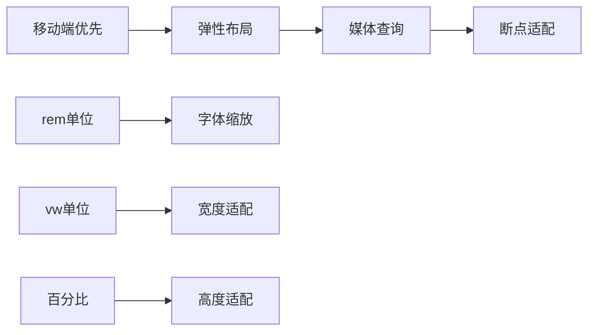

### 样式继承关系

| 层级 | 样式范围 | 优先级 | 示例 |
|------|----------|--------|------|
| 全局样式 | 整个应用 | 最低 | reset.css |
| 页面样式 | 单个页面 | 中等 | index.scss |
| 组件样式 | 特定组件 | 较高 | ProductCard |
| 行内样式 | 具体元素 | 最高 | style属性 |

**章节来源**
- [home/index.scss](file://frontend/src/pages/home/index.scss#L1-L223)
- [product-detail/index.scss](file://frontend/src/pages/product-detail/index.scss#L1-L629)

## 用户体验流程

### 核心购物流程

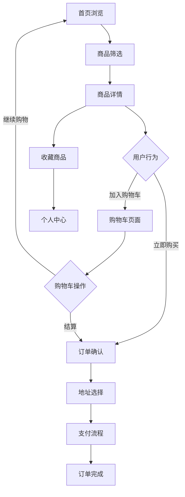

### 页面间导航策略

| 路由方法 | 使用场景 | 特点 | 示例 |
|----------|----------|------|------|
| Taro.navigateTo | 深度页面跳转 | 保留历史记录 | 商品详情 → 订单确认 |
| Taro.redirectTo | 替换当前页面 | 不保留历史 | 登录成功后跳转 |
| Taro.switchTab | 标签页切换 | 清空历史记录 | 首页 ↔ 我的 |
| Taro.navigateBack | 返回上一页 | 带参数返回 | 地址选择 → 订单确认 |

### 性能优化策略

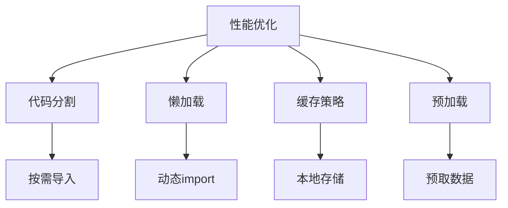

**章节来源**
- [home/index.tsx](file://frontend/src/pages/home/index.tsx#L105-L120)
- [product-detail/index.tsx](file://frontend/src/pages/product-detail/index.tsx#L41-L70)
- [order-confirm/index.tsx](file://frontend/src/pages/order-confirm/index.tsx#L91-L95)

## 最佳实践总结

### 开发规范

1. **文件命名**：统一使用kebab-case命名法
2. **目录结构**：严格遵循功能导向的模块化组织
3. **代码风格**：采用ESLint和Prettier统一代码格式
4. **类型安全**：使用TypeScript确保类型安全

### 性能优化

1. **路由懒加载**：减少初始包体积
2. **图片优化**：使用WebP格式和适当的尺寸
3. **数据缓存**：合理使用localStorage和内存缓存
4. **事件防抖**：优化频繁触发的事件处理

### 可维护性

1. **单一职责**：每个页面只负责一个功能领域
2. **依赖注入**：通过props和context传递依赖
3. **错误边界**：实现组件级别的错误处理
4. **测试覆盖**：编写单元测试和集成测试

### 用户体验

1. **加载状态**：提供明确的加载指示
2. **错误处理**：友好的错误提示和恢复机制
3. **交互反馈**：及时的状态反馈和视觉提示
4. **无障碍设计**：考虑不同用户群体的需求

这种页面结构设计不仅保证了代码的可维护性和扩展性，还为用户提供了流畅、一致的使用体验，是现代小程序开发的最佳实践体现。