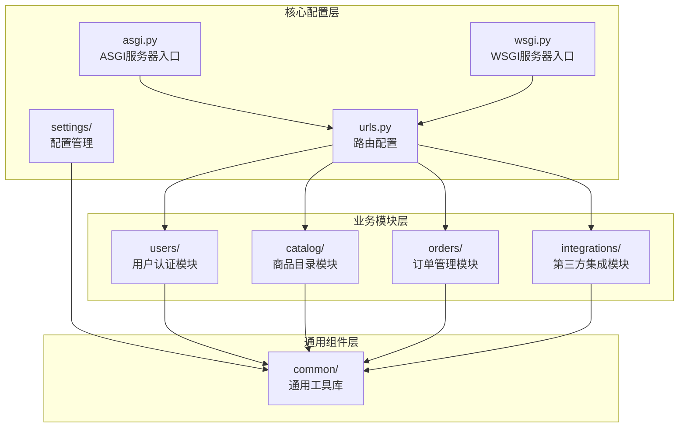
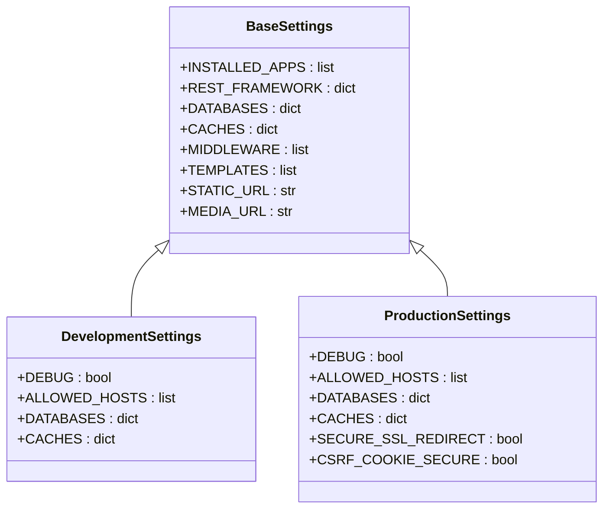
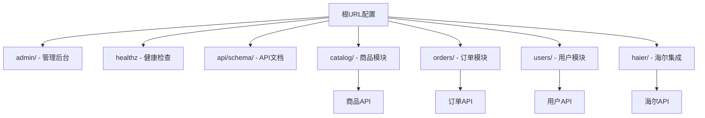
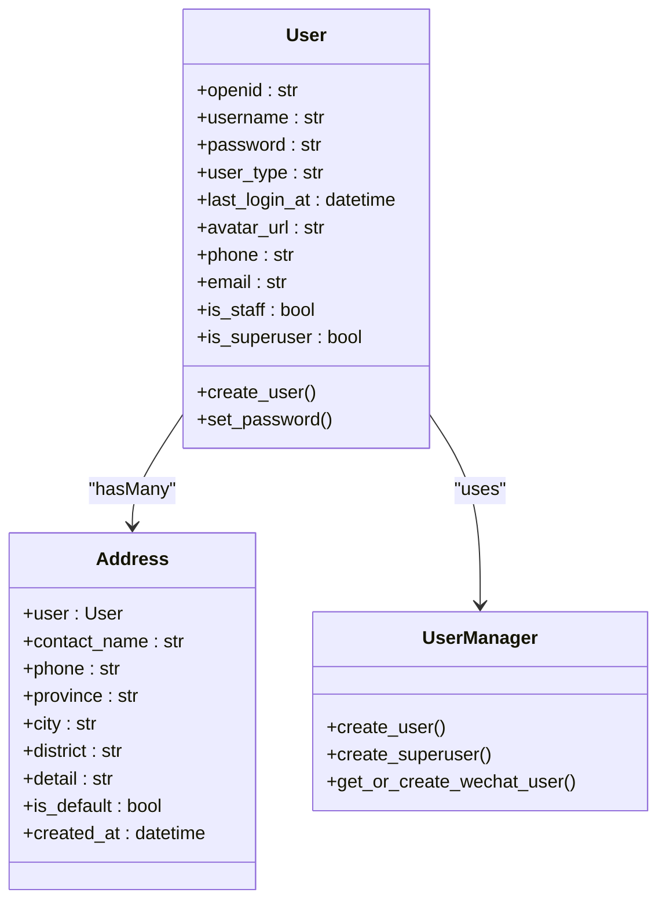
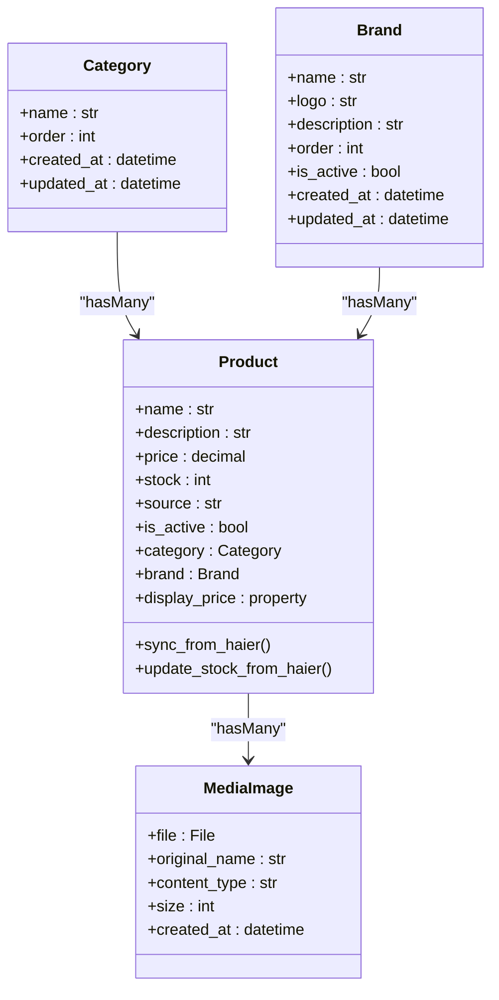
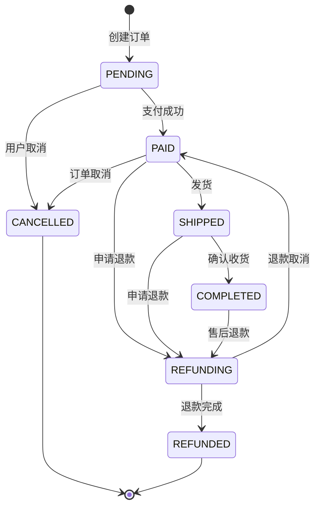
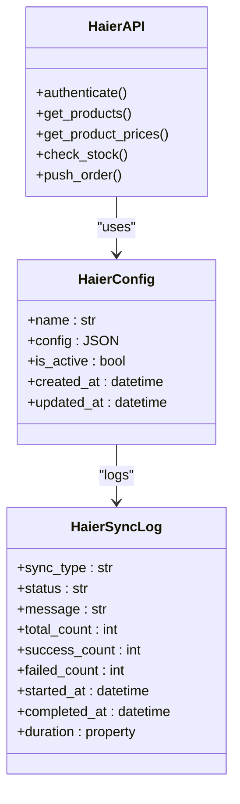
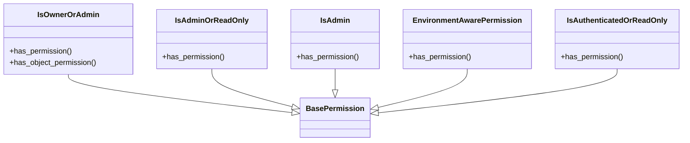
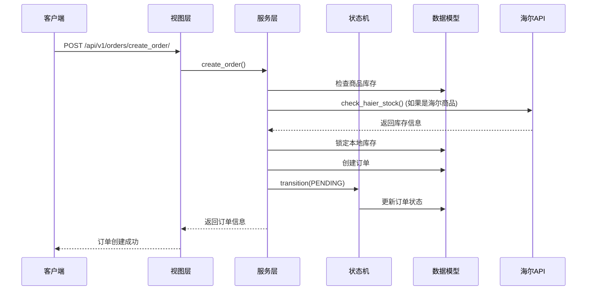

# 后端目录结构

<cite>
**本文档引用的文件**
- [backend/backend/settings/base.py](file://backend/backend/settings/base.py)
- [backend/backend/urls.py](file://backend/backend/urls.py)
- [backend/backend/asgi.py](file://backend/backend/asgi.py)
- [backend/backend/wsgi.py](file://backend/backend/wsgi.py)
- [backend/users/models.py](file://backend/users/models.py)
- [backend/catalog/models.py](file://backend/catalog/models.py)
- [backend/orders/models.py](file://backend/orders/models.py)
- [backend/integrations/models.py](file://backend/integrations/models.py)
- [backend/common/permissions.py](file://backend/common/permissions.py)
- [backend/common/pagination.py](file://backend/common/pagination.py)
- [backend/users/views.py](file://backend/users/views.py)
- [backend/catalog/views.py](file://backend/catalog/views.py)
- [backend/orders/views.py](file://backend/orders/views.py)
- [backend/integrations/views.py](file://backend/integrations/views.py)
- [backend/orders/state_machine.py](file://backend/orders/state_machine.py)
- [backend/orders/services.py](file://backend/orders/services.py)
</cite>

## 目录结构概览

Django项目采用模块化的目录结构，将不同业务功能分离到独立的应用模块中。整个后端架构围绕着四个核心业务模块和一个通用组件库构建：

**图表来源**
- [backend/backend/asgi.py](file://backend/backend/asgi.py#L1-L50)
- [backend/backend/wsgi.py](file://backend/backend/wsgi.py#L1-L50)
- [backend/backend/urls.py](file://backend/backend/urls.py#L1-L52)

## 核心配置文件详解

### settings/多环境配置系统

项目采用基于环境的配置管理策略，通过继承机制实现不同环境的配置隔离：

**图表来源**
- [backend/backend/settings/base.py](file://backend/backend/settings/base.py#L11-L29)

**section sources**
- [backend/backend/settings/base.py](file://backend/backend/settings/base.py#L1-L263)

### asgi.py 和 wsgi.py 服务器入口

这两个文件分别作为ASGI和WSGI协议的服务器入口点，负责启动Django应用：

- **asgi.py**: 支持异步Web框架，适用于WebSocket和长连接场景
- **wsgi.py**: 标准的WSGI协议入口，兼容传统HTTP请求

**section sources**
- [backend/backend/asgi.py](file://backend/backend/asgi.py#L1-L50)
- [backend/backend/wsgi.py](file://backend/backend/wsgi.py#L1-L50)

### 主要URL路由配置

主URL配置文件统一管理所有业务模块的路由映射：

**图表来源**
- [backend/backend/urls.py](file://backend/backend/urls.py#L24-L48)

**section sources**
- [backend/backend/urls.py](file://backend/backend/urls.py#L1-L52)

## 业务模块架构

### users/ 用户认证模块

用户模块实现了双认证体系，支持微信小程序和传统用户名密码两种登录方式：

**图表来源**
- [backend/users/models.py](file://backend/users/models.py#L31-L95)

**section sources**
- [backend/users/models.py](file://backend/users/models.py#L1-L95)

### catalog/ 商品目录模块

商品目录模块负责商品信息管理、分类体系和媒体资源处理：

**图表来源**
- [backend/catalog/models.py](file://backend/catalog/models.py#L5-L312)

**section sources**
- [backend/catalog/models.py](file://backend/catalog/models.py#L1-L312)

### orders/ 订单模块

订单模块实现了复杂的状态机管理和支付集成：

**图表来源**
- [backend/orders/state_machine.py](file://backend/orders/state_machine.py#L34-L57)

**section sources**
- [backend/orders/models.py](file://backend/orders/models.py#L1-L322)
- [backend/orders/state_machine.py](file://backend/orders/state_machine.py#L1-L289)

### integrations/ 第三方集成模块

集成模块专门处理与海尔API和其他第三方系统的对接：

**图表来源**
- [backend/integrations/models.py](file://backend/integrations/models.py#L4-L150)

**section sources**
- [backend/integrations/models.py](file://backend/integrations/models.py#L1-L150)

## 通用组件库

### 权限控制系统

通用权限系统提供了灵活的访问控制机制：

**图表来源**
- [backend/common/permissions.py](file://backend/common/permissions.py#L12-L189)

**section sources**
- [backend/common/permissions.py](file://backend/common/permissions.py#L1-L189)

### 分页处理系统

提供了多种分页策略以适应不同的业务场景：

| 分页类型 | 默认页面大小 | 最大页面大小 | 适用场景 |
|---------|-------------|-------------|----------|
| StandardResultsSetPagination | 20 | 100 | 标准API响应 |
| LargeResultsSetPagination | 100 | 1000 | 大数据集查询 |
| SmallResultsSetPagination | 10 | 50 | 移动客户端 |

**section sources**
- [backend/common/pagination.py](file://backend/common/pagination.py#L1-L99)

## 数据流转分析

### 典型用户下单流程

以下是用户下单时的完整数据流转路径：

**图表来源**
- [backend/orders/views.py](file://backend/orders/views.py#L136-L200)
- [backend/orders/services.py](file://backend/orders/services.py#L219-L297)
- [backend/orders/state_machine.py](file://backend/orders/state_machine.py#L96-L154)

**section sources**
- [backend/orders/views.py](file://backend/orders/views.py#L1-L200)
- [backend/orders/services.py](file://backend/orders/services.py#L1-L500)

## 总结

该项目的后端架构体现了以下设计原则：

1. **模块化设计**: 每个业务模块独立封装，职责清晰
2. **配置分离**: 多环境配置管理，便于部署和维护
3. **权限控制**: 层次化的权限系统，确保数据安全
4. **状态管理**: 使用状态机模式管理复杂业务流程
5. **扩展性**: 通用组件库提供可复用的功能模块

这种架构设计不仅提高了代码的可维护性和可扩展性，还为未来的功能扩展奠定了良好的基础。