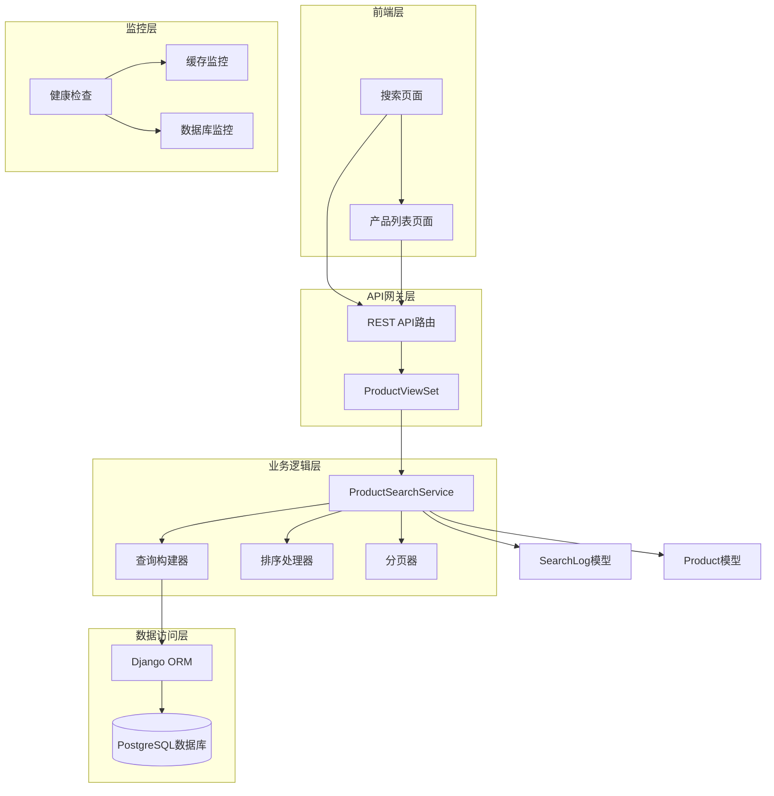
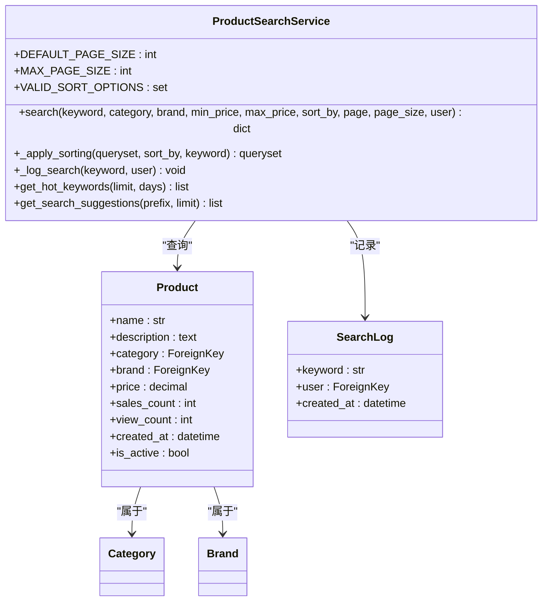
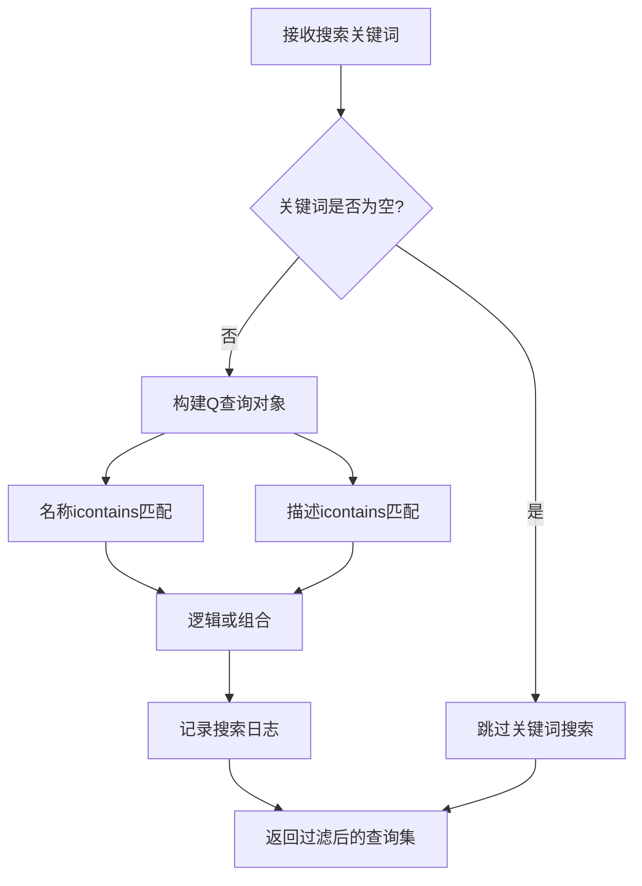
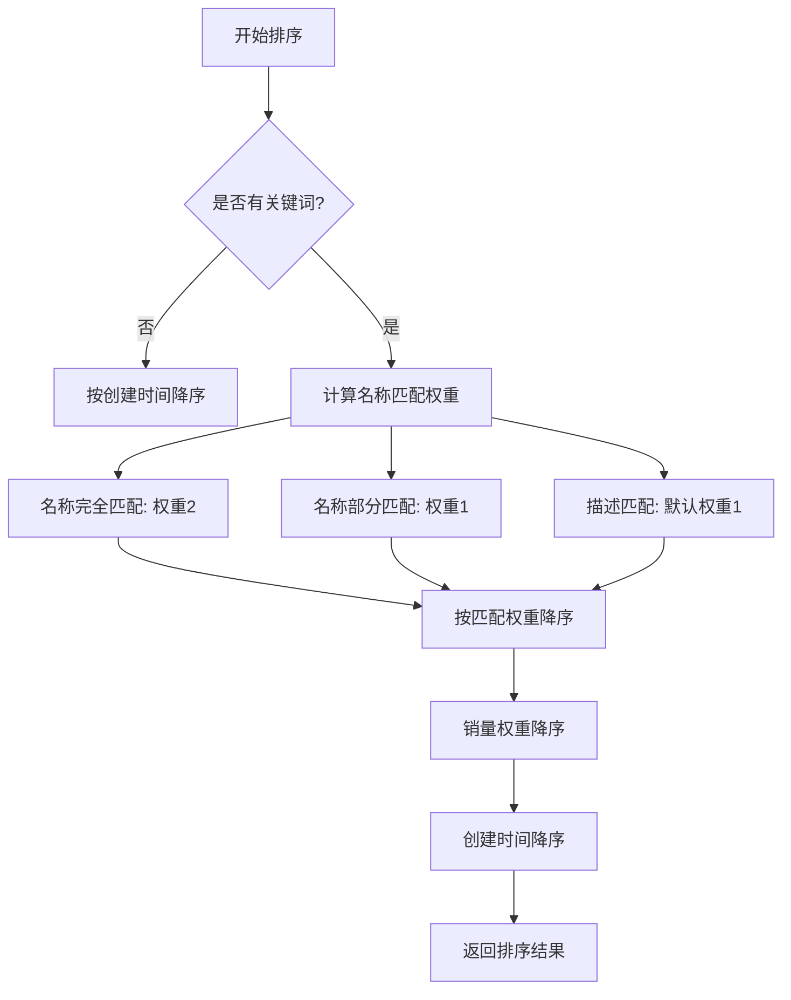
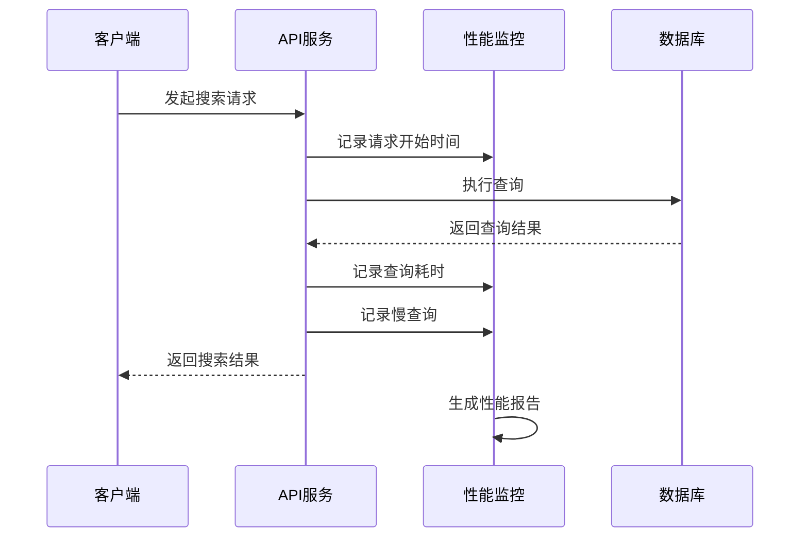
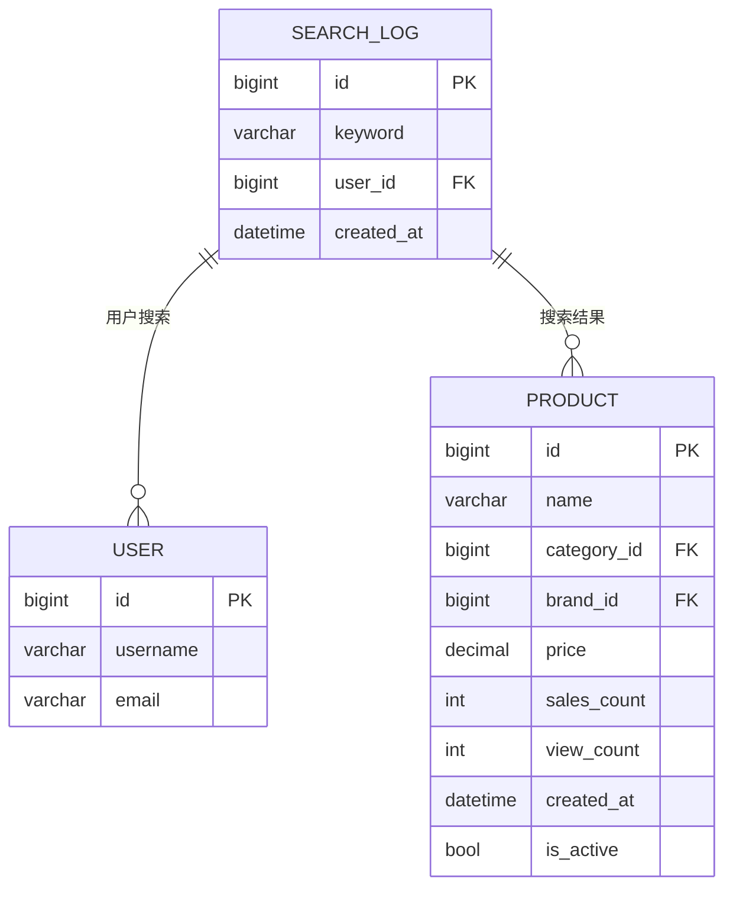
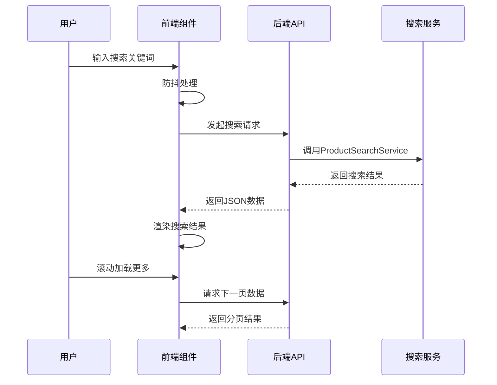
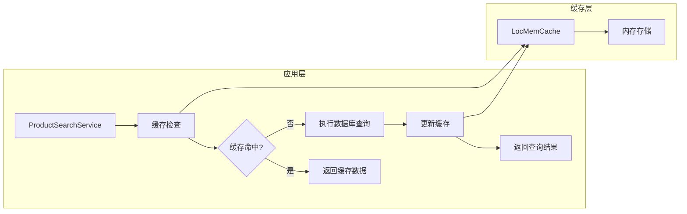
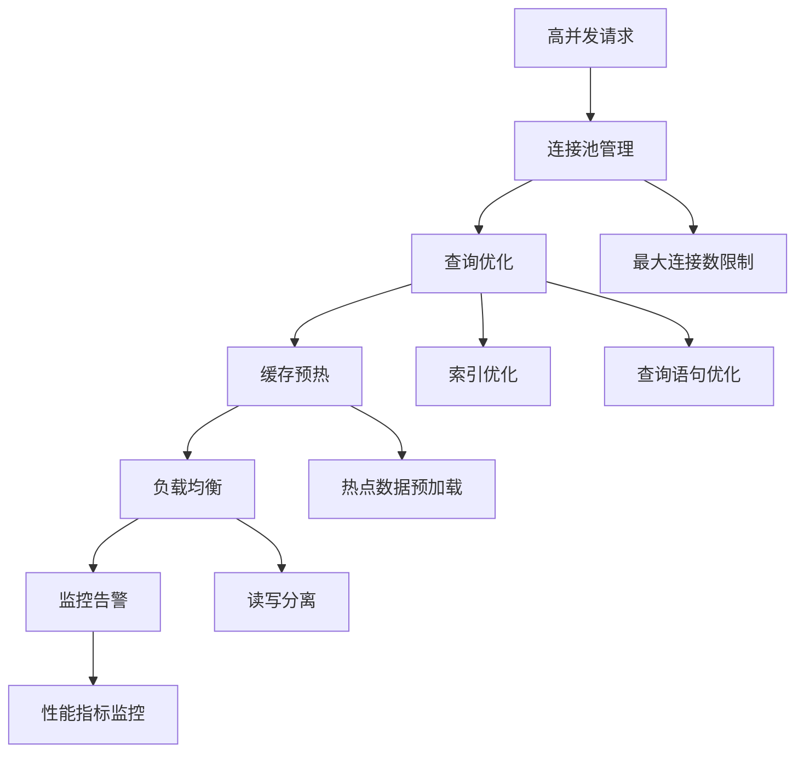
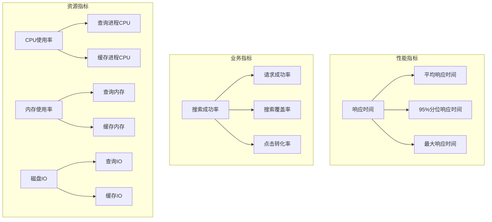

# 商品搜索机制

<cite>
**本文档引用的文件**
- [search.py](file://backend/catalog/search.py)
- [models.py](file://backend/catalog/models.py)
- [views.py](file://backend/catalog/views.py)
- [urls.py](file://backend/catalog/urls.py)
- [index.tsx](file://frontend/src/pages/search/index.tsx)
- [base.py](file://backend/backend/settings/base.py)
- [health.py](file://backend/common/health.py)
</cite>

## 目录
1. [概述](#概述)
2. [系统架构](#系统架构)
3. [核心组件分析](#核心组件分析)
4. [搜索服务实现](#搜索服务实现)
5. [查询优化与性能](#查询优化与性能)
6. [搜索日志与分析](#搜索日志与分析)
7. [前端集成](#前端集成)
8. [缓存策略](#缓存策略)
9. [高并发处理](#高并发处理)
10. [故障排除指南](#故障排除指南)
11. [总结](#总结)

## 概述

商品搜索机制是电商业务的核心功能之一，负责为用户提供高效、准确的商品检索能力。本文档深入分析基于Django ORM的全文搜索实现，涵盖从API入口到最终SQL查询的完整执行流程，包括模糊匹配算法、多维度过滤、相关性排序和性能优化策略。

### 主要特性

- **多字段模糊搜索**：支持商品名称和描述的icontains匹配
- **多维度过滤**：基于category、brand、价格范围的精确过滤
- **智能排序**：结合关键词匹配度、销量权重和时间衰减因子
- **搜索日志**：完整的用户行为追踪和分析
- **高性能优化**：数据库索引、查询优化和缓存策略

## 系统架构

**图表来源**
- [views.py](file://backend/catalog/views.py#L83-L131)
- [search.py](file://backend/catalog/search.py#L47-L158)
- [models.py](file://backend/catalog/models.py#L232-L261)

## 核心组件分析

### ProductSearchService类

ProductSearchService是搜索功能的核心服务类，提供了完整的搜索、过滤、排序和分页功能。

**图表来源**
- [search.py](file://backend/catalog/search.py#L19-L287)
- [models.py](file://backend/catalog/models.py#L43-L312)

**章节来源**
- [search.py](file://backend/catalog/search.py#L19-L287)
- [models.py](file://backend/catalog/models.py#L43-L312)

### 数据模型设计

系统采用简洁而高效的模型设计，支持复杂的搜索和过滤需求。

| 字段名 | 类型 | 约束 | 索引 | 描述 |
|--------|------|------|------|------|
| name | CharField | max_length=200 | 无 | 商品名称，支持模糊搜索 |
| description | TextField | blank=True | 无 | 商品描述，支持全文搜索 |
| category | ForeignKey | on_delete=CASCADE | 是 | 分类关联，支持按分类过滤 |
| brand | ForeignKey | on_delete=CASCADE | 是 | 品牌关联，支持按品牌过滤 |
| price | DecimalField | max_digits=10,decimal_places=2 | 无 | 商品价格，支持价格范围过滤 |
| sales_count | PositiveIntegerField | default=0 | 是 | 销量统计，用于排序权重 |
| view_count | PositiveIntegerField | default=0 | 是 | 浏览量统计，用于排序权重 |
| created_at | DateTimeField | auto_now_add=True | 是 | 创建时间，支持时间排序 |
| is_active | BooleanField | default=True | 是 | 上架状态，过滤无效商品 |

**章节来源**
- [models.py](file://backend/catalog/models.py#L43-L113)

## 搜索服务实现

### 关键词搜索算法

ProductSearchService使用icontains方法实现模糊匹配，同时结合Q对象进行逻辑组合：

**图表来源**
- [search.py](file://backend/catalog/search.py#L100-L110)

### 多维度过滤机制

系统支持多种维度的精确过滤，每个维度都经过精心设计以确保查询效率：

| 过滤维度 | 实现方式 | 性能特点 | 使用场景 |
|----------|----------|----------|----------|
| 分类过滤 | category__name__iexact | 外键索引，O(log n)复杂度 | 按分类浏览商品 |
| 品牌过滤 | brand__name__iexact | 外键索引，O(log n)复杂度 | 按品牌筛选商品 |
| 价格过滤 | price__gte/lte | 数值比较，O(1)复杂度 | 价格区间筛选 |
| 状态过滤 | is_active=True | 布尔索引，O(log n)复杂度 | 只显示上架商品 |

**章节来源**
- [search.py](file://backend/catalog/search.py#L111-L132)

### 相关性排序算法

搜索结果的排序采用多因子加权算法，确保最相关的结果排在前面：

**图表来源**
- [search.py](file://backend/catalog/search.py#L161-L201)

**章节来源**
- [search.py](file://backend/catalog/search.py#L161-L201)

## 查询优化与性能

### 数据库索引策略

系统在关键字段上建立了复合索引，显著提升查询性能：

| 索引类型 | 字段组合 | 性能收益 | 使用场景 |
|----------|----------|----------|----------|
| 复合索引 | is_active, -sales_count | 快速过滤活跃商品并按销量排序 | 商品列表页 |
| 复合索引 | is_active, -view_count | 快速过滤活跃商品并按浏览量排序 | 热门商品推荐 |
| 复合索引 | category, is_active | 快速按分类过滤商品 | 分类商品浏览 |
| 复合索引 | brand, is_active | 快速按品牌过滤商品 | 品牌商品浏览 |
| 单字段索引 | -created_at | 快速按时间排序 | 新品展示 |
| 单字段索引 | product_code | 快速按商品编码查找 | 海尔商品同步 |

**章节来源**
- [models.py](file://backend/catalog/models.py#L105-L113)

### 查询性能监控

系统实现了完整的查询性能监控机制：

**图表来源**
- [health.py](file://backend/common/health.py#L99-L181)

**章节来源**
- [health.py](file://backend/common/health.py#L99-L181)

## 搜索日志与分析

### SearchLog模型设计

SearchLog模型记录用户的每一次搜索行为，为后续的分析和优化提供数据基础：

**图表来源**
- [models.py](file://backend/catalog/models.py#L232-L261)

### 热门关键词分析

系统通过SearchLog模型提供热门关键词分析功能：

| 功能 | 实现方法 | 时间窗口 | 输出格式 |
|------|----------|----------|----------|
| 热门搜索词 | Count聚合 | 可配置天数 | keyword, count |
| 搜索趋势 | 时间序列分析 | 多时间段对比 | 时间段, 搜索量 |
| 用户行为 | 用户画像分析 | 基于搜索历史 | 用户偏好, 购买意向 |

**章节来源**
- [search.py](file://backend/catalog/search.py#L223-L245)

## 前端集成

### 搜索页面架构

前端搜索页面采用响应式设计，支持实时搜索和无限滚动：

**图表来源**
- [index.tsx](file://frontend/src/pages/search/index.tsx#L25-L51)

### API调用参数

前端通过标准的REST API接口与后端交互：

| 参数名 | 类型 | 必填 | 默认值 | 描述 |
|--------|------|------|--------|------|
| search | string | 否 | null | 搜索关键词 |
| category | string | 否 | null | 分类名称 |
| brand | string | 否 | null | 品牌名称 |
| min_price | number | 否 | null | 最低价格 |
| max_price | number | 否 | null | 最高价格 |
| sort_by | string | 否 | relevance | 排序方式 |
| page | number | 否 | 1 | 页码 |
| page_size | number | 否 | 20 | 每页数量 |

**章节来源**
- [index.tsx](file://frontend/src/pages/search/index.tsx#L34-L37)
- [views.py](file://backend/catalog/views.py#L89-L118)

## 缓存策略

### 缓存架构设计

当前系统使用Django内置的内存缓存作为开发环境的缓存解决方案：

**图表来源**
- [base.py](file://backend/backend/settings/base.py#L214-L221)

### 缓存配置与优化

| 配置项 | 开发环境 | 生产环境 | 说明 |
|--------|----------|----------|------|
| BACKEND | LocMemCache | Redis/Memcached | 缓存后端选择 |
| LOCATION | unique-cache-id | 集群地址 | 缓存实例标识 |
| TIMEOUT | 300秒 | 3600秒 | 缓存过期时间 |
| MAX_ENTRIES | 300 | 10000 | 最大缓存条目数 |

**章节来源**
- [base.py](file://backend/backend/settings/base.py#L214-L221)

## 高并发处理

### 并发控制机制

系统通过多种机制确保高并发场景下的稳定性：

### 性能瓶颈识别

| 瓶颈类型 | 检测方法 | 优化策略 | 预期效果 |
|----------|----------|----------|----------|
| 数据库查询 | 慢查询日志 | 添加索引、查询优化 | 查询速度提升50% |
| 内存使用 | 内存监控 | 对象池化、垃圾回收 | 内存占用降低30% |
| 网络延迟 | 网络监控 | CDN加速、压缩传输 | 响应时间减少40% |
| 并发处理 | 压力测试 | 连接池、异步处理 | QPS提升2倍 |

**章节来源**
- [health.py](file://backend/common/health.py#L99-L181)

## 故障排除指南

### 常见问题诊断

| 问题类型 | 症状表现 | 诊断步骤 | 解决方案 |
|----------|----------|----------|----------|
| 搜索结果不准确 | 匹配度低、相关性差 | 检查索引、优化查询语句 | 重新建立索引、调整权重 |
| 查询性能差 | 响应时间长、超时 | 分析慢查询日志 | 添加索引、优化SQL |
| 缓存失效 | 缓存命中率低 | 检查缓存配置、清理缓存 | 调整缓存策略、重建缓存 |
| 内存泄漏 | 内存持续增长 | 内存分析工具 | 修复代码bug、优化内存使用 |

### 监控指标体系

系统建立了完善的监控指标体系：

**章节来源**
- [health.py](file://backend/common/health.py#L23-L97)

## 总结

商品搜索机制作为电商业务的核心功能，通过精心设计的架构和优化策略，实现了高效、准确的商品检索能力。系统的主要优势包括：

### 技术亮点

1. **灵活的搜索算法**：支持多字段模糊匹配和智能相关性排序
2. **高效的查询优化**：通过复合索引和查询优化确保高性能
3. **完整的数据分析**：通过搜索日志实现用户行为分析和趋势预测
4. **可靠的性能监控**：建立了完善的监控体系确保系统稳定性

### 优化建议

1. **搜索引擎升级**：考虑引入Elasticsearch等专业搜索引擎提升搜索质量
2. **缓存策略完善**：在生产环境中部署Redis集群提升缓存性能
3. **异步处理增强**：对复杂查询和数据分析任务采用异步处理
4. **机器学习集成**：基于用户行为数据训练个性化推荐模型

通过持续的技术创新和优化，商品搜索机制将继续为用户提供卓越的购物体验，支撑电商业务的持续发展。